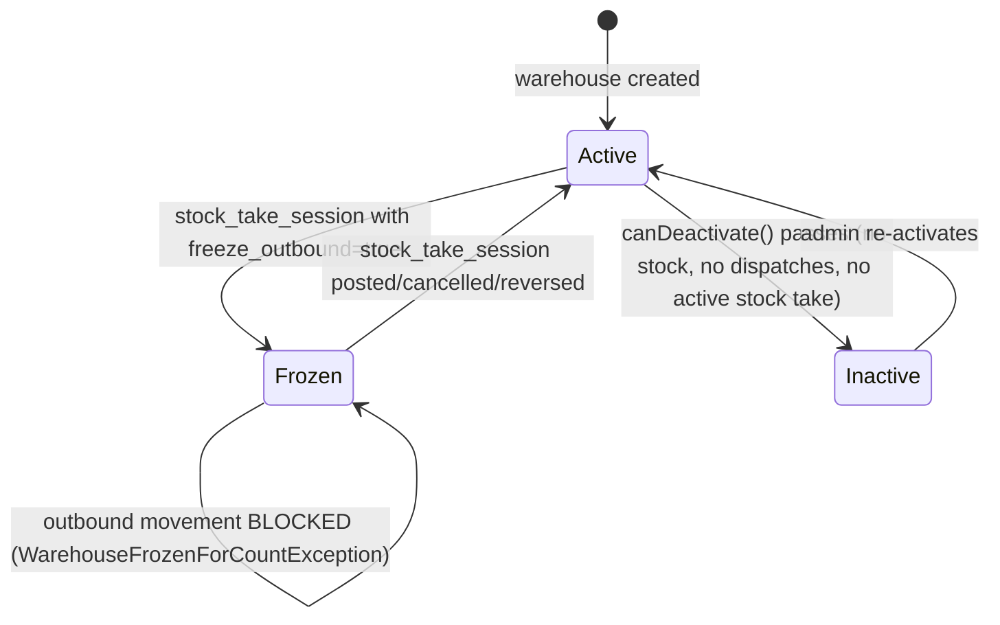

# Warehouse Stock

> **Module:** Inventory (Phase 8)
> **Audience:** Engineers + AI assistants + **accountants** (must review before Canonical)
> **Status:** Draft — pending accountant sign-off
> **Last reviewed:** 2025-08-03
> **Source of truth:** this file + `laravel/app/Models/WarehouseStock.php` + `laravel/app/Models/Warehouse.php` + `laravel/app/Services/Stock/StockService.php` (sole writer) + `laravel/app/Services/Stock/StockAvailabilityService.php` (availability computation) + `laravel/database/sql/03_stock.sql:62-97` + `laravel/database/sql/01_auth_and_master.sql:267-291` (`warehouses` DDL)

## 1. What is it?

**Warehouse stock** is the live, per-warehouse, per-product snapshot of physical quantity and
moving-average cost. It is the **derived** table — the single source of truth (SSOT) is the
`stock_transactions` ledger. `warehouse_stock` exists for fast O(1) reads of "how many of product
X do we have in warehouse Y, and at what cost?"

The `warehouses` master table defines the warehouses themselves — each warehouse belongs to
exactly one branch, and a branch can have multiple warehouses.

## 2. Why does it exist?

- Reading "current stock for product X" by summing the entire `stock_transactions` history would
  be O(N) per query. `warehouse_stock` is a single-row lookup per `(warehouse_id, product_id)`.
- The `qty` + `avg_cost` columns are the live state that `StockService::applyTransaction()`
  updates atomically (with `SELECT FOR UPDATE`) on every movement.
- The `stock_value` GENERATED column (`qty * avg_cost`) gives instant inventory valuation for
  reporting without recomputing.
- The `warehouses.is_frozen_for_count` flag enables the stock-take freeze mechanism (no outbound
  movements during a count).

## 3. When is it used?

- **On every stock movement** — `StockService::applyTransaction()` reads + locks + updates the
  `warehouse_stock` row.
- **On every availability check** — `StockAvailabilityService::getBranchAvailableQty()` sums
  `warehouse_stock.qty` across all warehouses in a branch, minus the sales pipeline.
- **On every reconciliation** — `ReconciliationService::reconcileInventory()` compares
  `warehouse_stock.stock_value` against the GL `inventory` ledger.
- **On every drift detection** — `StockAdjustmentReconcileService::computeDrift()` compares
  `warehouse_stock.qty` against `SUM(stock_transactions.qty) FILTER (WHERE NOT is_reversed)`.
- **On every stock-take freeze** — `StockTakeService::refreshWarehouseFreezeFlags()` sets
  `warehouses.is_frozen_for_count`.

## 4. Who uses it?

- **The system** reads + writes `warehouse_stock` via `StockService`. No user-facing UI writes
  directly.
- **Accountants / managers** read warehouse stock via the `admin/stock-transactions/warehouse-stock`
  view (read-only current balances).
- **Admins** manage warehouses via `admin/warehouses` CRUD (master data, with deactivation +
  branch-change safety checks).
- **Engineers / AI assistants** MUST understand the `warehouse_stock` schema before modifying any
  stock-posting code.

## 5. Related modules

- `stock-costing.md` — the moving-average formula that updates `avg_cost`.
- `stock-ledger.md` — the `stock_transactions` SSOT that `warehouse_stock` is derived from.
- `stock-take.md` — the freeze mechanism that blocks outbound movements during a count.
- `stock-verification.md` — the drift-detection + rebuild-snapshot mechanisms.
- `../accounting/subledger-reconciliation.md` §5 (Inventory) — the recon formula.
- `../security/branch-context-security.md` — `warehouses` is in the RLS-protected tables list;
  `warehouse_stock` is NOT (correctly — it has no `branch_id`).

## 6. Business rules (the Core Rule)

- **MUST** maintain `warehouse_stock` as a **derived** snapshot — the SSOT is `stock_transactions`.
  If the snapshot ever drifts, `StockAdjustmentReconcileService::rebuildSnapshot()` can rebuild it.
- **MUST** use the composite PK `(warehouse_id, product_id)` — there is NO `id` column. Each
  warehouse maintains its own independent `qty` + `avg_cost`.
- **MUST NOT** allow negative stock. Three layers enforce this: DB CHECK `qty >= -0.0001`, DB
  trigger `prevent_negative_stock()`, app-level throw in `StockService::applyTransaction`.
- **MUST** compute "available quantity" at runtime via `StockAvailabilityService` — there is NO
  `reserved_quantity` or `available_quantity` column. Available = physical − sales pipeline.
- **MUST** enforce the warehouse freeze during stock take — `StockService::applyTransaction()`
  checks `warehouses.is_frozen_for_count` on every OUTBOUND movement (qty < 0). Inbound movements
  are ALLOWED during freeze.
- **MUST** block warehouse deactivation if the warehouse has stock > 0, pending dispatches, or
  active stock take sessions (`WarehouseController::canDeactivate()` L197-250).
- **MUST** block warehouse branch change if the warehouse has stock or pending dispatches
  (`WarehouseController::canChangeBranch()` L260-296) — would corrupt `warehouse_stock` +
  interbranch GL.
- **MUST NOT** have RLS on `warehouse_stock` — it is warehouse-scoped, not branch-scoped. Branch
  isolation is enforced at the app layer (every query joins `warehouses.branch_id`).

## 7. Technical implementation

### 7.1 The `warehouses` table — `01_auth_and_master.sql:267-291`

```sql
CREATE TABLE warehouses (
    id integer GENERATED ALWAYS AS IDENTITY PRIMARY KEY,
    warehouse_code varchar(30) NOT NULL,
    warehouse_name varchar(100) NOT NULL,
    branch_id integer NOT NULL REFERENCES branches(id),    -- one warehouse belongs to ONE branch
    location text,
    is_active boolean NOT NULL DEFAULT true,
    is_frozen_for_count boolean NOT NULL DEFAULT false,    -- Phase 3 Stock Take
    created_at timestamp(0) DEFAULT CURRENT_TIMESTAMP,
    updated_at timestamp(0) DEFAULT CURRENT_TIMESTAMP,
    deleted_at timestamp(0),
    deleted_by integer,
    CONSTRAINT warehouses_warehouse_code_unique UNIQUE (warehouse_code)
);
CREATE INDEX idx_warehouses_branch ON warehouses(branch_id);
CREATE INDEX idx_wh_is_frozen ON warehouses(id) WHERE is_frozen_for_count = true;  -- partial
```

Multi-warehouse per branch: YES — a branch can have multiple warehouses. A warehouse belongs to
exactly ONE branch. RLS on `warehouses` (L535-539 of `07_views_triggers_constraints.sql`).
SoftDeletes + `AuditableMasterData` trait.

### 7.2 The `warehouse_stock` table — `03_stock.sql:62-73`

```sql
CREATE TABLE warehouse_stock (
    warehouse_id integer NOT NULL REFERENCES warehouses(id),
    product_id integer NOT NULL REFERENCES products(id),
    qty numeric(14,4) NOT NULL DEFAULT 0,
    avg_cost numeric(12,2) NOT NULL DEFAULT 0,
    total_qty numeric(14,4) NOT NULL DEFAULT 0,
    total_value numeric(14,2) NOT NULL DEFAULT 0,
    updated_at timestamp(0) DEFAULT CURRENT_TIMESTAMP,
    PRIMARY KEY (warehouse_id, product_id)   -- NO id column
);
ALTER TABLE warehouse_stock ADD CONSTRAINT ws_qty_nonnegative CHECK (qty >= -0.0001);
```

Plus a `stock_value` GENERATED column added by migration
`2025_01_20_000000_add_generated_columns.php`:
`GENERATED ALWAYS AS (ROUND(qty * avg_cost, 2)) STORED`.

Plus the `prevent_negative_stock()` trigger (`03_stock.sql:79-97`) that raises
`check_violation` with a business-friendly error message before the CHECK fires.

### 7.3 "Available quantity" computation — `StockAvailabilityService.php:62-68` (verbatim)

```php
public function getBranchAvailableQty(int $productId, int $branchId, ?int $excludeInvoiceId = null): float
{
    $physical = $this->getBranchPhysicalQty($productId, $branchId);
    $pipeline = $this->getBranchPipelineQty($productId, $branchId, $excludeInvoiceId);
    return max(0.0, $physical - $pipeline);
}
```

- `physical` = `SUM(warehouse_stock.qty)` across all warehouses in the branch.
- `pipeline` = `SUM(ordered_qty - dispatched_qty)` on `sales_invoice_dispatches` JOIN
  `sales_invoices` WHERE `si.is_reversed=false` AND `si.status NOT IN ('challan_completed',
  'reversed', 'cancelled')` (open sales pipeline).
- Pipeline qty is **cached in Redis** (5-min TTL, key `pipeline:branch:{branchId}:{productId}`)
  — invalidated by `SalesInvoiceService` + `SalesChallanService` whenever the pipeline changes.

### 7.4 Reservation mechanism — implicit (no `reserved_quantity` column)

There is NO explicit reservation column. Stock is "soft-held" by the existence of an open
`sales_invoice_dispatches` row (ordered_qty > dispatched_qty). The pipeline subtraction is the
reservation mechanism.

Two salesmen finalizing invoices for the same product simultaneously are protected by
`SELECT ... FOR UPDATE` on `warehouse_stock` (see `StockService::lockBranchProductsForUpdate()`
at L351-366).

### 7.5 Negative stock — prevented at 3 layers

1. **DB CHECK constraint:** `qty >= -0.0001` (`03_stock.sql:77`)
2. **DB trigger:** `prevent_negative_stock()` raises `check_violation` with business-friendly
   message (`03_stock.sql:79-97`)
3. **App-level throw:** `StockService::applyTransaction()` L130-135 when
   `newQty < -QTY_TOLERANCE`
4. **Stock Take pre-check:** `StockTakeService::assertNoNegativeStockOutcomes()` at L2016 —
   pre-checks shortage variances BEFORE applying any movement, with `FOR UPDATE` lock on
   `warehouse_stock` rows.

### 7.6 Warehouse freeze mechanism (Phase 3 Stock Take)

- `warehouses.is_frozen_for_count` boolean — denormalized snapshot of "any active
  `stock_take_session` with `freeze_outbound=true` covers this warehouse". Recomputed by
  `StockTakeService::refreshWarehouseFreezeFlags()`.
- `StockService::applyTransaction()` L89-92 — at the top of every OUTBOUND movement (qty < 0),
  checks the warehouse freeze flag. If frozen AND `reference_type NOT IN ('stock_take',
  'reversal')`, throws `WarehouseFrozenForCountException`.
- INBOUND movements are ALLOWED during a freeze (only stock LEAVING the warehouse would corrupt
  the physical count).
- DB trigger `prevent_overlapping_frozen_stock_take` (`07_views_triggers_constraints.sql:680-712`)
  prevents two freezing sessions from overlapping on the same warehouse.

### 7.7 Deactivation + branch-change safety — `WarehouseController` L197-296

```php
// canDeactivate() L197-250
public function canDeactivate(Warehouse $warehouse): array
{
    $stockCount = DB::table('warehouse_stock')->where('warehouse_id', $warehouse->id)->where('qty', '>', 0)->count();
    if ($stockCount > 0) {
        return ['ok' => false, 'reason' => "Warehouse has {$stockCount} products with stock > 0."];
    }
    $pendingDispatches = DB::table('sales_invoice_dispatches')->where('warehouse_id', $warehouse->id)
        ->whereColumn('ordered_qty', '>', 'dispatched_qty')->count();
    if ($pendingDispatches > 0) {
        return ['ok' => false, 'reason' => "Warehouse has {$pendingDispatches} pending dispatches."];
    }
    $activeStockTake = DB::table('stock_take_sessions')
        ->join('stock_take_warehouses', 'stock_take_sessions.id', '=', 'stock_take_warehouses.stock_take_session_id')
        ->where('stock_take_warehouses.warehouse_id', $warehouse->id)
        ->whereNotIn('stock_take_sessions.status', ['posted', 'cancelled', 'reversed'])
        ->count();
    if ($activeStockTake > 0) {
        return ['ok' => false, 'reason' => "Warehouse has an active stock take session."];
    }
    return ['ok' => true];
}
```

## 8. Intercompany / cross-branch

`warehouse_stock` is warehouse-scoped. Cross-branch stock movements go through the Branch Demand
module (Phase 13), which:

1. Decreases `warehouse_stock.qty` at the source warehouse (via `StockService::applyTransaction`
   with negative qty).
2. Increases `warehouse_stock.qty` at the dest warehouse (via `StockService::applyTransaction`
   with positive qty, at source avg_cost).
3. Posts an intercompany GL entry (Dr `interbranch_receivable` at dest, Cr `interbranch_payable`
   at source).

The `WarehouseTransfer` module is **same-branch only** — see `warehouse-transfer.md` §8.

## 9. Workflow / state machine

`warehouse_stock` has no state machine — it is a live snapshot. The `warehouses` master has an
`is_active` flag (active/inactive) and an `is_frozen_for_count` flag (frozen/unfrozen).



## 10. Validation & input rules

- `warehouse_stock.qty` is `numeric(14,4)`, CHECK `>= -0.0001`.
- `warehouse_stock.avg_cost` is `numeric(12,2)`.
- `warehouses.warehouse_code` is `varchar(30) UNIQUE`.
- `warehouses.branch_id` is FK to `branches(id)`, required.
- `warehouses.is_active` + `is_frozen_for_count` are booleans with sensible defaults.
- Deactivation + branch-change safety checks (§7.7) are enforced at the controller level.

## 11. Reversal & correction flow

`warehouse_stock` is not directly reversible — it is a snapshot. Reversals happen at the
`stock_transactions` ledger level (`StockService::reverseTransaction`), which inserts a new
opposite-sign ledger row and then updates `warehouse_stock` to reflect the reversal.

If `warehouse_stock` drifts from the ledger (detected by
`StockAdjustmentReconcileService::computeDrift()`), the admin can run
`StockAdjustmentReconcileService::rebuildSnapshot()` — an admin-only command that DELETEs +
reINSERTs `warehouse_stock` from the `stock_transactions` ledger (the SSOT), wrapped in a single
DB transaction so the table is never empty to concurrent readers.

## 12. Open questions / known gaps

1. **No reorder_level / safety_stock columns** — feature does NOT exist. NO `low_stock_alerts`
   table. NO `inventory:reorder-alert` artisan command. The `mv_stock_valuation` MV exposes
   `on_hand_qty` for manual review, but no automated alerting exists. **Recommended:** add
   `reorder_level` + `safety_stock` columns to `products` (or a per-warehouse
   `product_warehouse_reorder_levels` table) + a `low_stock_alerts` notification flow.
2. **No `reserved_quantity` / `available_quantity` columns** — availability is computed at runtime
   from `sales_invoice_dispatches`. This is intentional (denormalized reservation would drift),
   but it means the availability check is O(N) over the open dispatches, not O(1). The 5-min Redis
   cache mitigates this.
3. **`warehouse_stock` + `stock_transactions` have NO RLS** — warehouse-scoped, no `branch_id`
   column. App layer enforces branch scoping. A non-admin user querying `warehouse_stock` directly
   via DB would see ALL branches' stock. Defense-in-depth gap. **Recommended:** add a `branch_id`
   column to `warehouse_stock` (denormalized from `warehouses.branch_id`) and enable RLS, OR
   confirm the app-layer enforcement is sufficient.
4. **`mv_stock_valuation` excludes `qty <= 0` rows** — zero-qty + negative-qty warehouses are
   invisible in the MV. The underlying `warehouse_stock` rows exist; the MV is a reporting
   convenience that hides them. Cosmetic gap (carried from `stock-costing.md` §12 #2).
5. **No `total_qty` / `total_value` usage** — the `warehouse_stock` table has `total_qty` and
   `total_value` columns (defaults 0) that appear unused (the live columns are `qty` + `avg_cost`
   + the GENERATED `stock_value`). **Recommended:** confirm these are legacy/dead columns and drop
   them, or document their purpose.
6. **`warehouses.deleted_by` column** — added but the SoftDeletes trait doesn't natively populate
   `deleted_by`. The `WarehouseController::destroy()` method must manually set it. Confirm this is
   done.

## 13. Accountant review checklist

> **This is a SAFETY-CRITICAL document.** Before marking it Canonical, an accountant with
> production credentials MUST review and sign off on each item below.

- [ ] The composite PK `(warehouse_id, product_id)` (§7.2) — per-warehouse avg_cost granularity —
      is correct. Each warehouse maintains its own independent avg_cost.
- [ ] The "available = physical − pipeline" formula (§7.3) matches the actual availability
      semantics. The pipeline subtraction correctly soft-holds stock for open sales invoices.
- [ ] The warehouse freeze mechanism (§7.6) — outbound blocked, inbound allowed — is the correct
      behaviour during a stock take.
- [ ] The deactivation + branch-change safety checks (§7.7) are sufficient to prevent data
      corruption (orphaned stock, mis-branch GL).
- [ ] The lack of reorder_level / safety_stock (§12 #1) — is this a feature gap that should be
      addressed, or is manual review via `mv_stock_valuation` sufficient?
- [ ] The lack of RLS on `warehouse_stock` (§12 #3) — is the app-layer branch scoping sufficient,
      or should RLS be added (would require a `branch_id` column)?
- [ ] The rebuild-snapshot mechanism (§11) — confirm the admin-only repair path is acceptable and
      the single-transaction DELETE+INSERT is safe under concurrency.
- [ ] The `total_qty` / `total_value` columns (§12 #5) — are these legacy/dead, or do they have a
      purpose?
