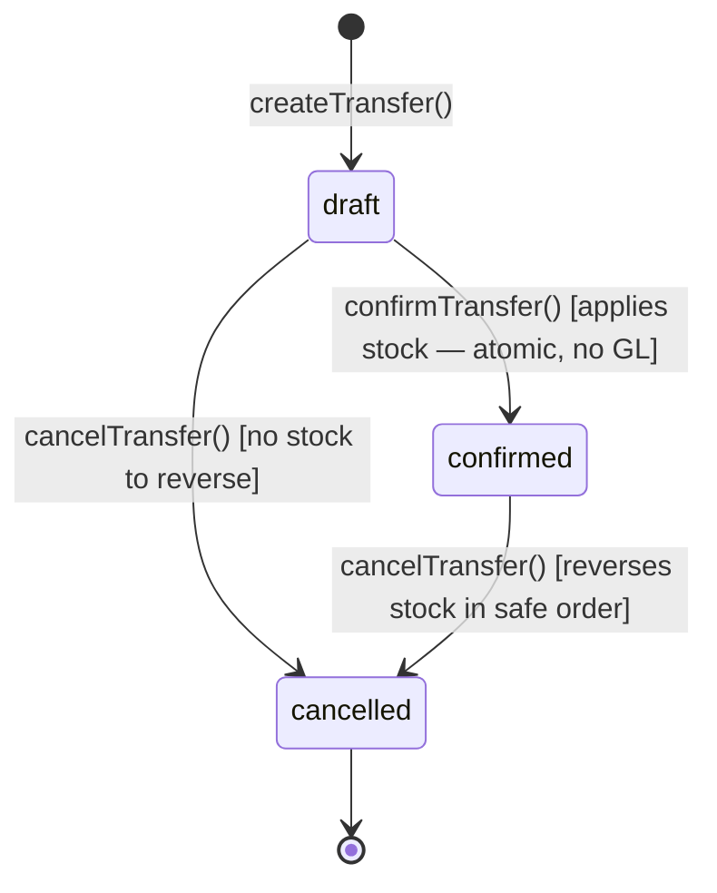

# Warehouse Transfer

> **Module:** Inventory (Phase 8)
> **Audience:** Engineers + AI assistants + **accountants** (must review before Canonical)
> **Status:** Draft — pending accountant sign-off
> **Last reviewed:** 2025-08-03
> **Source of truth:** this file + `laravel/app/Services/Stock/WarehouseTransferService.php` (688 lines — SAME-BRANCH ONLY) + `laravel/database/sql/03_stock.sql:553-575` (`warehouse_transfers` + `warehouse_transfer_items` DDL) + `laravel/app/Models/Scopes/WarehouseTransferBranchScope.php` (dual-branch filter)

## 1. What is it?

A **warehouse transfer** moves stock between two warehouses **in the same branch**. The source
warehouse's stock decreases; the dest warehouse's stock increases at the **source's avg_cost**
(preserves cost basis — no P&L impact on the transfer itself).

The module is **same-branch only** — cross-branch transfers are blocked at `createTransfer` and
must go through the Branch Demand module (Phase 13). The `postIntercompanyGL` method on
`WarehouseTransferService` is **dead code** — retained "for potential future use by the Branch
Demand module" but never invoked.

3-state lifecycle: `draft` → `confirmed` → `cancelled`. NO maker-checker gate, NO `in_transit`
state, NO `received` state — same-branch transfers are atomic (stock moves immediately on
confirm).

## 2. Why does it exist?

- A branch with multiple warehouses (e.g. main warehouse + counter sales floor) needs to move
  stock between them without going through purchase/sales flows.
- The dest warehouse inherits the source's avg_cost — preserves cost integrity (no P&L on the
  transfer itself).
- Same-branch transfers post NO GL entry (the asset class is unchanged — `inventory` Dr at source
  = `inventory` Cr at dest, net zero within the same branch).

## 3. When is it used?

- Move stock from the main warehouse to the counter sales floor.
- Move stock from the receiving dock to the main warehouse.
- Consolidate stock from multiple small warehouses into one bulk warehouse.
- Reorganize stock layout within a branch.

## 4. Who uses it?

- **Warehouse managers / managers / admins** create, confirm, cancel
  (`role:admin,manager,warehouse_manager`).
- **NO `WarehouseTransferPolicy` class** — relies on route middleware + RLS +
  `WarehouseTransferBranchScope` (dual-branch filter) + service-layer same-branch enforcement.

## 5. Related modules

- `stock-costing.md` — the avg_cost inheritance (dest inherits source's avg_cost).
- `stock-ledger.md` — the two `stock_transactions` rows per item (source OUT + dest IN).
- `warehouse-stock.md` — the `warehouse_stock` snapshot updated on confirm.
- `stock-verification.md` — the drift detection (transfer should produce zero net drift).
- `../accounting/journal-posting-rules.md` §5 #25 — `postIntercompanyGL` Dr/Cr matrix (the
  dead-code method — already documented in Phase 6).
- `../accounting/reversal-vs-cancellation.md` §7.5 — `cancelTransfer` reversal cascade (already
  documented).
- `../security/branch-context-security.md` — `WarehouseTransferBranchScope` is the dual-branch
  filter pattern (same as `MoneyTransferBranchScope`).

## 6. Business rules (the Core Rule)

- **MUST** record a `transfer_code` (unique, format `WT-YYYY-NNNNNN`) via `DocumentSequenceService`.
- **MUST** enforce same-branch: `from_warehouse.branch_id === to_warehouse.branch_id`. Enforced at
  `createTransfer` L114-126 + `confirmTransfer` L269-280 (defense-in-depth). Throws
  `'Both warehouses must belong to the same branch. Cross-branch transfers must go through the
  Branch Demand module.'`
- **MUST** post TWO `stock_transactions` rows per item on confirm:
  1. Source OUT (negative qty, at current avg_cost).
  2. Dest IN (positive qty, at SOURCE avg_cost — preserves cost basis).
- **MUST NOT** post a GL entry for same-branch transfers — the asset class is unchanged (Dr
  inventory at source = Cr inventory at dest, net zero within the same branch). The
  `journal_entry_id` + `journal_entry_id_debtor` columns are left null.
- **MUST** reverse (not edit) a confirmed transfer via `cancelTransfer` — reverses stock ledger
  (dest IN reversed FIRST, then source OUT — safe order to prevent "insufficient stock at
  receiver" errors) + marks `is_reversed=true` + `status='cancelled'`.
- **MUST** enforce pipeline-aware availability check on confirm — cannot transfer more than
  `StockAvailabilityService::getWarehouseAvailableQty` for the source warehouse.
- **MUST NOT** allow cancellation of demand-linked transfers (where `branch_demand_id` is set) —
  must use the Branch Demand module which handles the full reversal workflow.
- **MUST** use `WarehouseTransferBranchScope` for visibility — a user can see any transfer where
  their branch is the `from_branch_id` OR the `to_branch_id`. Admins bypass.

## 7. Technical implementation

### 7.1 The `warehouse_transfers` table — `03_stock.sql:553-572`

| Column | Type | Notes |
|---|---|---|
| `id` | PK | |
| `transfer_code` | `varchar(30) UNIQUE` | `WT-YYYY-NNNNNN` |
| `transfer_date` | `date NOT NULL` | |
| `from_warehouse_id` | FK warehouses | |
| `to_warehouse_id` | FK warehouses | |
| `from_branch_id` | FK branches | RLS key (dual-branch) |
| `to_branch_id` | FK branches | RLS key (dual-branch) |
| `status` | `varchar(20) CHECK IN (draft,confirmed,cancelled)` | see §9 |
| `journal_entry_id` | FK journal_entries | always null for same-branch |
| `journal_entry_id_debtor` | FK journal_entries | always null for same-branch (dead intercompany) |
| `is_interbranch` | boolean | always false (same-branch enforced) |
| `is_reversed`, `reversed_at`, `reversed_by`, `reverse_reason` | | reversal marker |
| `branch_demand_id` | FK branch_demands | demand-linked reversal protection |
| `notes`, `created_by`, timestamps | | |

RLS: `07_views_triggers_constraints.sql:834-840` — dual-branch `from_branch_id OR to_branch_id`.
NO `fn_financial_audit_trigger` (relies on `WarehouseTransferAuditLogger` dual-write DB + file).

### 7.2 The same-branch posting — `WarehouseTransferService.php:320-355` (verbatim)

```php
// Apply stock movements for each item.
foreach ($transfer->items as $item) {
    $rate = (float) $item->rate;
    $qty = (float) $item->qty;
    // Source OUT (negative qty, at current avg_cost)
    $this->stockService->applyTransaction([
        'warehouse_id' => $fromWh, 'product_id' => $item->product_id,
        'qty' => -$qty, 'rate' => $rate,
        'reference_type' => 'warehouse_transfer',
        'reference_id' => $transfer->id,
        'notes' => 'Transfer OUT ' . $transfer->transfer_code,
        'transaction_date' => $transferDate, 'created_by' => $confirmedBy,
    ]);
    // Dest IN (positive qty, at SOURCE avg_cost — preserves cost integrity)
    $this->stockService->applyTransaction([
        'warehouse_id' => $toWh, 'product_id' => $item->product_id,
        'qty' => $qty, 'rate' => $rate,
        'reference_type' => 'warehouse_transfer',
        'reference_id' => $transfer->id,
        'notes' => 'Transfer IN ' . $transfer->transfer_code,
        'transaction_date' => $transferDate, 'created_by' => $confirmedBy,
    ]);
}
// Same-branch transfer: NO GL posting.
$journalEntryId = null;
$journalEntryIdDebtor = null;
if ($transfer->is_interbranch) {
    // This should NEVER happen due to the defense-in-depth check above.
    throw new \RuntimeException('Cross-branch GL posting is not allowed in this module.');
}
```

### 7.3 The dead `postIntercompanyGL()` — `WarehouseTransferService.php:531-617`

```php
private function postIntercompanyGL(WarehouseTransfer $transfer, int $createdBy): array
{
    $amount = (float) $transfer->total_amount;
    if ($amount < 0.01) {
        return [null, null];
    }
    $inventoryLedgerId = $this->journalPosting->lookupLedgerByNature('inventory');
    $dueFromLedgerId = $this->journalPosting->lookupLedgerByNature('interbranch_receivable');
    $dueToLedgerId = $this->journalPosting->lookupLedgerByNature('interbranch_payable');
    ...
    // 1. From-branch (creditor): Dr Due-to-Branch / Cr Inventory
    $creditorEntryId = $this->journalPosting->createJournalEntry([
        'entry_date' => $transferDate, 'reference_type' => 'warehouse_transfer',
        'reference_id' => $transfer->id, 'branch_id' => $transfer->from_branch_id,
        'description' => "Transfer OUT {$code} — to {$transfer->toBranch->branch_name}",
        'source' => 'warehouse_transfer', 'created_by' => $createdBy,
    ], [
        ['ledger_id' => $dueToLedgerId, 'debit' => $amount, 'credit' => 0, 'memo' => '...'],
        ['ledger_id' => $inventoryLedgerId, 'debit' => 0, 'credit' => $amount, 'memo' => '...'],
    ]);
    // 2. To-branch (debtor): Dr Inventory / Cr Due-from-Branch
    $debtorEntryId = $this->journalPosting->createJournalEntry([...branch_id => $transfer->to_branch_id...], [
        ['ledger_id' => $inventoryLedgerId, 'debit' => $amount, 'credit' => 0, 'memo' => '...'],
        ['ledger_id' => $dueFromLedgerId, 'debit' => 0, 'credit' => $amount, 'memo' => '...'],
    ]);
    // Record the intercompany settlement in branch_ledger.
    DB::table('branch_ledger')->insert([...]);
    return [$creditorEntryId, $debtorEntryId];
}
```

> ⚠️ **DEAD CODE:** This method is **never called** from `WarehouseTransferService`. The
> same-branch path (§7.2) explicitly sets `$journalEntryId = null` and throws if
> `is_interbranch` is true. The method exists "for potential future use by the Branch Demand
> module" per the class docblock (L60-62). The actual cross-branch transfer logic lives in the
> Branch Demand module (Phase 13).

### 7.4 Reversal flow — `cancelTransfer()` `WarehouseTransferService.php:447-520`

Critical: **stock movements are reversed in SAFE ORDER — dest IN (positive qty) reversed FIRST,
then source OUT (negative qty)**. This prevents "insufficient stock at receiver" errors.
Implementation via `sortMovementsForReversal()` L660-671:

```php
private function sortMovementsForReversal($movements)
{
    return $movements->sort(function ($a, $b) {
        $qa = (float) $a->qty;
        $qb = (float) $b->qty;
        // Positive qty (dest IN) reversed first → sort them before negative
        if ($qa > 0 && $qb <= 0) return -1;
        if ($qa <= 0 && $qb > 0) return 1;
        // Secondary: by ID descending (most recent first)
        return (int) $b->id <=> (int) $a->id;
    })->values();
}
```

Demand-linked transfers CANNOT be cancelled via this module (L434-445) — must use the Branch
Demand module which handles the full reversal workflow.

### 7.5 Avg_cost at dest — INHERITS source's avg_cost

Dest warehouse's avg_cost is recomputed via the moving-average formula (see `stock-costing.md`
§7.3). Because the dest's `old_qty × old_avg + in_qty × source_rate` is the new basis, the dest's
avg_cost DOES change (it incorporates the source's cost, blended with the dest's existing avg).
This is the correct behavior — the dest branch receives stock at the source's cost, blended with
the dest's existing avg.

## 8. Intercompany / cross-branch — NOT SUPPORTED

The WarehouseTransfer module is **same-branch only**. Cross-branch stock movement MUST go through
the Branch Demand module (Phase 13), which:

1. Posts the same two `stock_transactions` rows (source OUT + dest IN at source avg_cost).
2. Posts the intercompany GL entry (Dr `interbranch_receivable` at dest, Cr `interbranch_payable`
   at source) — the `postIntercompanyGL` method in §7.3 is the dead-code template.
3. Records a `branch_ledger` obligation row.

The `postIntercompanyGL` method on `WarehouseTransferService` is retained "for potential future
use by the Branch Demand module" but is never invoked from `WarehouseTransferService` itself.

## 9. Workflow / state machine



3 states only: `draft`, `confirmed`, `cancelled`. NO `approved`, NO `in_transit`, NO `received`.
Same-branch transfers are atomic (stock moves immediately on confirm).

## 10. Validation & input rules

Web controller `WarehouseTransferController@store` L196-217 (NO dedicated FormRequest — uses
custom Rules):

```php
$validated = $request->validate([
    'from_warehouse_id' => [
        'required', 'integer', 'exists:warehouses,id',
        new WarehouseBelongsToBranch($userBranchId, 'branch'),
    ],
    'to_warehouse_id' => [
        'required', 'integer', 'exists:warehouses,id',
        'different:from_warehouse_id',
        new WarehouseBelongsToBranch($userBranchId, 'branch'),
    ],
    'transfer_date' => 'required|date',
    'notes' => 'nullable|string|max:1000',
    'items' => 'required|array|min:1',
    'items.*.product_id' => 'required|integer|exists:products,id',
    'items.*.qty' => [
        'required', 'numeric', 'min:0.001',
        new WarehouseTransferItemHasAvailableStock((int) $request->input('from_warehouse_id')),
    ],
    'items.*.rate' => 'nullable|numeric|min:0',
]);
```

Custom Rules:
- `WarehouseBelongsToBranch` — ensures the warehouse belongs to the user's branch.
- `WarehouseTransferItemHasAvailableStock` — checks pipeline-aware availability for the source
  warehouse.

## 11. Reversal & correction flow

`cancelTransfer` (§7.4) — runs in a `DB::transaction`:

1. `lockForUpdate()` the transfer + items.
2. Reject if demand-linked (`branch_demand_id` is set) — must use Branch Demand module.
3. If `wasConfirmed`:
   a. Look up all non-reversed `stock_transactions` with `(reference_type='warehouse_transfer',
      reference_id=transferId)`.
   b. Sort via `sortMovementsForReversal()` — dest IN (positive qty) first, source OUT (negative
      qty) last.
   c. `StockService::reverseTransaction(stockTxId, userId, reason, reversalDate)` for each, in
      sorted order.
   d. Mark `is_reversed=true` + `reversed_at` + `reversed_by` + `reverse_reason`.
4. Set `status='cancelled'`.
5. Audit log (`WarehouseTransferAuditLogger` dual-write DB + file).

```mermaid
sequenceDiagram
    participant U as User (admin/manager/warehouse_manager)
    participant C as WarehouseTransferController
    participant S as WarehouseTransferService
    participant SS as StockService
    participant DB as PostgreSQL

    U->>C: POST /admin/warehouse-transfers/{id}/cancel {reason}
    C->>S: cancelTransfer(id, userId, reason)
    S->>DB: BEGIN; SELECT ... FOR UPDATE
    S->>S: validate not demand-linked, reason non-empty
    alt wasConfirmed
        S->>DB: SELECT stock_transactions WHERE reference_type='warehouse_transfer' AND reference_id=id AND is_reversed=false
        S->>S: sortMovementsForReversal() — dest IN first, source OUT last
        loop each stock_transaction (sorted)
            S->>SS: reverseTransaction(stockTxId, userId, reason, reversalDate)
            SS->>DB: INSERT reversal stock_transactions row (opposite-sign qty, same rate)
            SS->>DB: UPDATE warehouse_stock SET qty, avg_cost
            SS->>DB: UPDATE original stock_transactions SET is_reversed=true
        end
        S->>DB: UPDATE warehouse_transfers SET is_reversed=true
    end
    S->>DB: UPDATE warehouse_transfers SET status=cancelled
    S->>DB: COMMIT
    S-->>C: WarehouseTransfer (cancelled)
    C-->>U: redirect with success
```

## 12. Open questions / known gaps

1. **NO `in_transit` state, NO `received` state** — same-branch transfers are atomic. There is
   no concept of "stock in transit" between warehouses in the same branch. For physical security
   (stock could be lost between warehouses), this is a gap. **Recommended:** add an `in_transit`
   state for high-value transfers, with a separate `receive` action.
2. **NO maker-checker gate** — admin/manager/warehouse_manager can create + confirm in one user's
   session. No submit/approve states. Compare to Stock Adjustment + Damage which both have
   maker-checker. **Recommended:** add maker-checker for high-value transfers (configurable
   threshold).
3. **`postIntercompanyGL()` is DEAD CODE** (§7.3) — never called. Retained for potential Branch
   Demand use. **Recommended:** either remove it (and document the Branch Demand module as the
   sole cross-branch path) or wire it into the Branch Demand module.
4. **NO `WarehouseTransferPolicy` class** — relies on route middleware + RLS. Compare to
   `StockAdjustmentPolicy` + `DamagePolicy` which both exist. **Recommended:** add a Policy class
   for per-action granularity.
5. **Warehouse freeze blocks both draft creation AND confirm** (§7.6 of `warehouse-stock.md`) —
   if the source warehouse is frozen for a stock take, the transfer cannot be created or
   confirmed. Inbound to a frozen warehouse IS allowed (only outbound is blocked). Document this
   interaction.
6. **Demand-linked reversal protection** (§11) — if `branch_demand_id` is set, cancellation is
   blocked via this module. The user must use the Branch Demand module. **Accountant must
   confirm this is the desired behaviour** (it prevents partial cancellation of a demand-linked
   transfer that would leave the demand in an inconsistent state).
7. **`warehouse_transfer_items` has NO RLS** — parent-table RLS suffices for most queries, but
   raw DB access leaks items across branches (minor gap, same as `damage_invoice_items`).

## 13. Accountant review checklist

> **This is a SAFETY-CRITICAL document.** Before marking it Canonical, an accountant with
> production credentials MUST review and sign off on each item below.

- [ ] The 3-state state machine (§9) — draft → confirmed → cancelled, atomic, no in_transit — is
      the desired behaviour for same-branch transfers.
- [ ] The same-branch enforcement (§6) — cross-branch transfers blocked, must use Branch Demand
      module — is the desired behaviour.
- [ ] The NO-GL-posting rule for same-branch transfers (§7.2) — asset class unchanged, net zero
      within the branch — is correct.
- [ ] The avg_cost inheritance (§7.5) — dest inherits source's avg_cost, blended with dest's
      existing avg — is correct (no P&L on the transfer itself).
- [ ] The safe-order reversal (§7.4) — dest IN reversed first, source OUT last — correctly
      prevents "insufficient stock at receiver" errors.
- [ ] The demand-linked reversal protection (§12 #6) — cannot cancel via this module — is the
      desired behaviour.
- [ ] The lack of `in_transit` state (§12 #1) — is the atomic transfer acceptable, or should an
      `in_transit` state be added for high-value transfers?
- [ ] The lack of maker-checker (§12 #2) — is the one-user create+confirm acceptable, or should
      maker-checker be added for high-value transfers?
- [ ] The dead `postIntercompanyGL` (§12 #3) — should it be removed, or wired into the Branch
      Demand module?
- [ ] The lack of `WarehouseTransferPolicy` (§12 #4) — is route-middleware-only RBAC acceptable?
- [ ] The warehouse-freeze interaction (§12 #5) — confirm the source-warehouse-frozen block on
      both draft creation AND confirm is correct.
