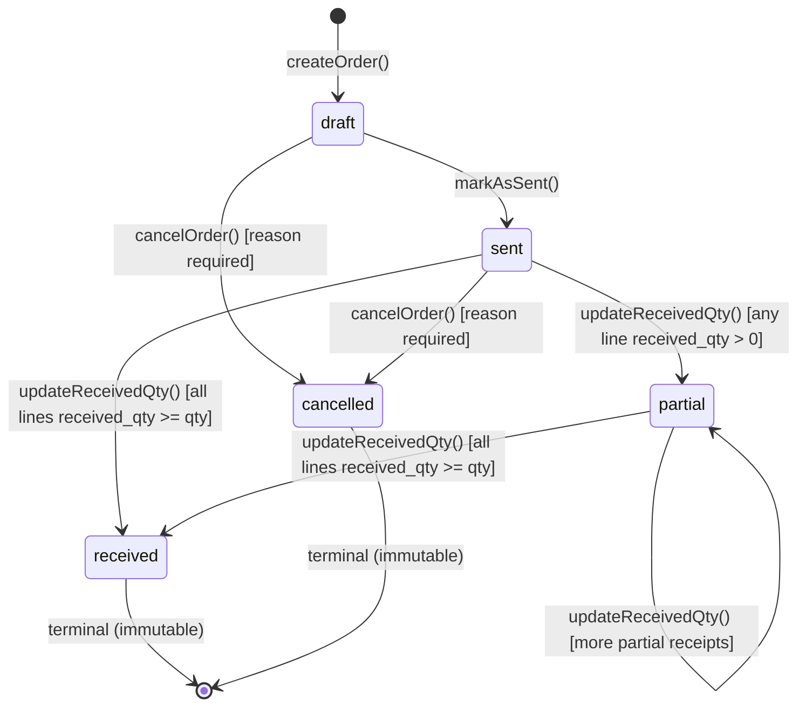

# Purchase Order

> **Module:** Purchasing (Phase 9)
> **Audience:** Engineers + AI assistants + accountants
> **Status:** Draft
> **Last reviewed:** 2025-08-03
> **Source of truth:** this file + `laravel/app/Services/Purchase/PurchaseOrderService.php`
> + `laravel/app/Models/PurchaseOrder.php` + `laravel/app/Models/PurchaseOrderItem.php`
> + `laravel/database/sql/05_purchase.sql:11-44` + migrations noted inline.

## 1. What is it?

A **Purchase Order (PO)** is the planning document of the procure-to-pay cycle. It records what
the branch intends to buy from a supplier, at what rate, in what quantity, and by when. It is
**NOT an accounting document** — creating, editing, sending, or cancelling a PO produces **no
stock movement and no GL journal entry**. The economic event of the cycle is the **GRN** (see
`purchase-receive.md`), which consumes the PO and posts the actual Dr Inventory / Cr AP entries.

A PO has 5 lifecycle states: `draft → sent → partial → received` (success) or `→ cancelled`
(abandoned). The PO tracks `received_qty` per line so the procurement team can see partial
receipts against an open order.

## 2. Why does it exist?

- **Planning & supplier confirmation.** A PO is the formal request a buyer issues to a supplier.
  Sending it (`markAsSent`) signals "the order is final; ship the goods".
- **Rate snapshot for the GRN.** The `purchase_order_items.rate` column is the negotiated price.
  When the GRN is created against the PO, the line rates are pre-filled from the PO. This makes
  the PO the **source of truth for negotiated pricing** at the moment of receipt.
- **Partial-receive tracking.** The `purchase_order_items.received_qty` column accumulates
  received quantities as GRNs are confirmed. The PO status auto-flips to `partial` (any line
  partially received) or `received` (all lines fully received, 0.0001 tolerance).
- **Branch-scoped obligation.** A PO is owned by exactly one branch (RLS-enforced). It cannot be
  used to receive goods into another branch's warehouse — that requires a separate PO per branch.
- **Audit trail.** Even though no GL is posted, every PO state transition is recorded in
  `user_audit_log` (see `purchase-audit.md`).

## 3. When is it used?

- **Procurement planning.** Buyer creates a draft PO from a supplier quotation.
- **Rate negotiation.** Buyer edits the draft until rates / quantities are final, then sends it.
- **Receipt anticipation.** Warehouse clerk sees open `sent` POs and prepares to receive goods.
- **Partial receipt.** A PO receiving the first of multiple shipments auto-flips to `partial`;
  the warehouse clerk can keep receiving against it until all lines are fully received.
- **Cancellation.** A `draft` or `sent` PO that will never be fulfilled can be cancelled with a
  reason. A `partial` or `received` PO **cannot** be cancelled (it has already consumed stock).

## 4. Who uses it?

- **`admin` / `superadmin`** — full access (read + write + cancel + audit).
- **`manager`** — full access (read + write + cancel + audit).
- **`warehouse_manager`** — read + write (`create`, `update`, `mark-sent`), **NOT cancel**
  (route restricts cancel to `admin,manager`).
- **`accountant`** — read only (`index`, `show`, `export`, `audit-log`).
- **Excluded:** `salesman`, `dispatcher`, `hr`, `user` — no route access.

There is **no `PurchaseOrderPolicy` class** (gap G2). RBAC is enforced only by the `role:`
route middleware + the `branch.isolation` middleware + the `BranchScope` global Eloquent scope +
PostgreSQL RLS policies. There is **no per-row policy gate** ("can this user edit THIS specific
PO?") — any user with the `manager` role can edit any PO in their branch.

## 5. Related modules

- `purchase-receive.md` — the GRN consumes the PO (`PurchaseReceiveService::confirmReceive` calls
  `PurchaseOrderService::updateReceivedQty` per line, auto-flipping PO status).
- `purchase-return.md` — returns are made against a **GRN**, not directly against a PO. The PO's
  `received_qty` is **not** decremented by a return (returns affect `purchase_receive_items.return_qty`).
- `purchase-audit.md` — PO state transitions are audited via `UserAuditLogger`; the
  `PurchaseAuditService` checklist inspects over-receive and open PO lines.
- `../accounting/supplier-transactions.md` — supplier payments are allocated against GRNs (which
  are linked to POs); the PO is the upstream document but not the AP settlement target.
- `../inventory/stock-costing.md` §7.4 — the PO line `rate` flows through to the GRN line `rate`,
  which drives the moving-average cost recompute on receipt.
- `../security/branch-context-security.md` — the 4-layer branch-isolation pattern (route
  middleware → BranchScope → EnforceBranchIsolation → RLS) applies to `purchase_orders`.

## 6. Business rules

- **MUST** create every PO in `draft` status. The DDL default is `draft` and `createOrder` hardcodes
  `'status' => 'draft'` (`PurchaseOrderService.php:81`).
- **MUST NOT** post any GL entry or stock movement from a PO. The service header explicitly notes
  this (`PurchaseOrderService.php:14`: "POs are draft documents — NO stock movement, NO GL journal.").
- **MUST** allow editing only when `status === 'draft'` (model `canEdit()` at `PurchaseOrder.php:134`).
- **MUST** allow cancellation only when `status ∈ ['draft','sent']` (model `canCancel()` at
  `PurchaseOrder.php:139`). Partial / received POs are immutable.
- **MUST** allow receiving against a PO only when `status ∈ ['sent','partial']` (model `canReceive()`
  at `PurchaseOrder.php:144`). This guard is re-enforced in `PurchaseReceiveService::createReceive`
  at L93–98 (Phase 8 BUG-39 fix).
- **MUST** auto-flip PO status when a GRN confirms:
  - If **any** line has `received_qty > 0` (0.0001 tolerance) and **not all** lines are fully
    received → `partial`.
  - If **all** lines have `received_qty >= qty` (0.0001 tolerance) → `received`.
  - If no change (the GRN was a draft cancel), do not touch status.
  - Implemented in `PurchaseOrderService::updateReceivedQty` L277–285.
- **MUST** auto-decrement `received_qty` and recompute status when a confirmed GRN is cancelled
  (`PurchaseReceiveService::cancelReceive` → `decrementPoReceivedQty` at L419).
- **MUST** generate a unique `po_code` via `DocumentSequenceService::nextCode('purchase_order', prefix='PO')`.
- **MUST** log every state transition via `UserAuditLogger::log()` with action prefix
  `purchase_order_*` and a jsonb `details` payload (po_code, branch_id, supplier_id, total, item_count).
- **MUST** enforce branch isolation at all 4 layers (route middleware, BranchScope,
  EnforceBranchIsolation URI map `purchase-orders → purchase_orders`, RLS 5 policies).
- **MUST NOT** enforce an over-receive guard (gap G6 — the audit checklist detects over-receive
  after the fact but the service allows it). A user can receive 100 units against a PO line that
  ordered 10.
- **MUST NOT** require a `PurchaseOrderPolicy` (gap G2 — none exists).
- **MUST NOT** wire into `ApprovalService` (gap G7 — no maker-checker gate for POs despite their
  financial significance).

## 7. Data model

### `purchase_orders` (DDL: `05_purchase.sql:11-31` + migrations)

```sql
CREATE TABLE purchase_orders (
    id integer GENERATED ALWAYS AS IDENTITY PRIMARY KEY,
    po_code varchar(30) NOT NULL,
    po_date date NOT NULL,
    supplier_id integer NOT NULL REFERENCES suppliers(id),
    branch_id integer NOT NULL REFERENCES branches(id),
    warehouse_id integer REFERENCES warehouses(id),          -- nullable (G17 — mismatch with GRN)
    sub_total numeric(14,2) DEFAULT 0,
    discount_amount numeric(14,2) DEFAULT 0,
    tax_amount numeric(14,2) DEFAULT 0,
    total_amount numeric(14,2) DEFAULT 0,                     -- = sub_total - discount + tax
    status varchar(20) NOT NULL DEFAULT 'draft'
        CHECK (status IN ('draft','sent','partial','received','cancelled')),
    expected_date date,                                       -- added by migration 2025_01_24_000003 (BUG-3)
    notes text,
    created_by integer,                                       -- no FK to users(id) (orphanable)
    created_at timestamp(0) DEFAULT CURRENT_TIMESTAMP,
    updated_at timestamp(0) DEFAULT CURRENT_TIMESTAMP,
    deleted_at timestamp(0),                                  -- added by 2025_01_23_000002 (SoftDeletes)
    CONSTRAINT purchase_orders_code_unique UNIQUE (po_code)
);
```

- **Computed totals** (`sub_total`, `discount_amount`, `tax_amount`, `total_amount`) are NOT
  GENERATED columns — they are computed in `createOrder` L51–54 (`sub_total = Σ(qty × rate)`;
  `total = sub_total - discount + tax`) and stored as plain numeric. This lets historical POs
  preserve their original negotiated values even if the chart of accounts changes.
- **`warehouse_id` is nullable** but `purchase_receives.warehouse_id` is NOT NULL (gap G17).
- **No `confirmed_by` / `cancelled_by` columns** — only `created_by`. Cancellation is recorded
  in `notes` (appended `[Cancelled] {reason}` text) and in `user_audit_log`.

### `purchase_order_items` (DDL: `05_purchase.sql:33-44`)

```sql
CREATE TABLE purchase_order_items (
    id integer GENERATED ALWAYS AS IDENTITY PRIMARY KEY,
    purchase_order_id integer NOT NULL REFERENCES purchase_orders(id) ON DELETE CASCADE,
    product_id integer NOT NULL REFERENCES products(id),
    qty numeric(14,4) NOT NULL,
    received_qty numeric(14,4) DEFAULT 0,                     -- accumulated by GRN confirm
    rate numeric(12,2) NOT NULL DEFAULT 0,
    amount numeric(14,2) GENERATED ALWAYS AS (qty * rate) STORED
);
```

- **`received_qty`** is updated by `PurchaseOrderService::updateReceivedQty` (L258) on GRN confirm
  and `decrementPoReceivedQty` (L419) on GRN cancel, both under `SELECT … FOR UPDATE`.
- **No UNIQUE on `(purchase_order_id, product_id)`** — the same product can appear on multiple
  PO lines. This is the root cause of gap G5: `updateReceivedQty` keys by `product_id` and uses
  `->first()`, so the first matching line gets all the received_qty credit.
- **No RLS** on `purchase_order_items` — branch isolation is inherited through the parent
  `purchase_orders` FK. Direct `DB::table('purchase_order_items')` queries bypass RLS.

### Indexes

- `idx_po_supplier (supplier_id)`, `idx_po_branch (branch_id)`.
- `idx_poi_po (purchase_order_id)`, `idx_poi_product (product_id)`.

### RLS

5 policies (SELECT/INSERT/UPDATE/DELETE + admin bypass) on `purchase_orders` — see
`07_views_triggers_constraints.sql:756-762`. `purchase_order_items` has NO RLS (inherits via FK).

## 8. Lifecycle / workflow

### State machine



### Transition guards (in code)

| Transition | Guard | Implemented at |
|---|---|---|
| `draft → sent` | `status === 'draft'` | `markAsSent` L188–214 |
| `draft → cancelled` | `status === 'draft'` | `cancelOrder` L219–247 |
| `sent → cancelled` | `status === 'sent'` | `cancelOrder` L219–247 |
| `sent → partial` | GRN confirms, any line `received_qty > 0` (0.0001 tol) | `updateReceivedQty` L277–285 |
| `sent → received` | GRN confirms, all lines `received_qty >= qty` (0.0001 tol) | `updateReceivedQty` L277–285 |
| `partial → received` | GRN confirms, all lines `received_qty >= qty` | `updateReceivedQty` L277–285 |
| `partial → cancelled` | **NOT ALLOWED** | `canCancel()` returns false |
| `received → cancelled` | **NOT ALLOWED** | `canCancel()` returns false |

### PO code generation

`po_code` is generated by `DocumentSequenceService::nextCode('purchase_order', prefix='PO')`,
which acquires a PostgreSQL advisory lock (`pg_advisory_xact_lock` on a hashed key) to ensure
uniqueness under concurrent inserts. Format: `PO-{YYYYMMDD}-{NNNN}` with 4-digit pad. The
`UNIQUE (po_code)` constraint at the DB level is the second line of defense.

### Atomic create flow

`createOrder` wraps the entire insert (PO header + items + audit log) in `DB::transaction()`.
If any step fails, the whole PO rolls back — no orphan items, no orphan audit entries.

### Cancellation flow

`cancelOrder(poId, cancelledBy, reason)`:

1. Validate `canCancel()` (status must be `draft` or `sent`).
2. Update `status = 'cancelled'`, append `[Cancelled] {reason}` to `notes`.
3. Emit `UserAuditLogger::log(action: 'purchase_order_cancelled', …)`.
4. **No stock/GL reversal** — there is nothing to reverse.

## 9. Integration points

| Integration | Direction | Purpose |
|---|---|---|
| `PurchaseReceiveService::confirmReceive` → `updateReceivedQty` | inbound | GRN confirm increments `received_qty` and auto-flips PO status |
| `PurchaseReceiveService::cancelReceive` → `decrementPoReceivedQty` | inbound | GRN cancel decrements `received_qty` and re-flips PO status |
| `PurchaseReceiveController::getPoDetails` (AJAX) | outbound | Returns PO + items to the GRN-create form for line pre-fill |
| `DocumentSequenceService::nextCode` | outbound | Generates `po_code` under advisory lock |
| `UserAuditLogger::log` | outbound | Emits `purchase_order_*` audit entries |
| `AuditableMasterData` trait | outbound | **Bypassed** (gap G4 — service uses `DB::table()` raw queries, so Eloquent events do not fire) |
| `EnforceBranchIsolation` middleware | inbound | URI prefix `purchase-orders` → table `purchase_orders` → branch_id check |
| `BranchScope` global scope | inbound | Read filter: non-admin queries auto-filter by `branch_id = session.branch_id` |
| PostgreSQL RLS (5 policies) | inbound | DB-level enforcement; admin bypass sets `app.is_admin = true` GUC |

## 10. Edge cases

- **Direct GRN (no PO).** A GRN can be created with `purchase_order_id = NULL` (the "Direct
  Purchase" mode). The PO lifecycle is bypassed entirely — the GRN posts stock + GL directly.
  The supplier is required on the GRN header.
- **Same product on multiple PO lines.** `updateReceivedQty` keys by `product_id` and uses
  `->first()` — the first matching line gets all the received_qty credit. Documented as gap G5.
- **Over-receive.** No service-level guard. A user can receive 100 units against a PO line that
  ordered 10. The PO line's `received_qty` becomes 100. The `PurchaseAuditService::sectionPurchaseOrder`
  detects this as a `fail` (L351–356) but does not prevent it. Documented as gap G6.
- **Cancel after partial receive.** Not allowed — `canCancel()` returns false for `partial`.
  The procurement team must instead cancel the GRN (which decrements received_qty back to 0 and
  flips the PO back to `sent`), then cancel the PO.
- **Cancel after full receive.** Not allowed — `canCancel()` returns false for `received`.
- **Back-dated PO.** `po_date` is user-editable; there is no period-close check on PO creation
  (POs do not post to GL, so the period gate is not relevant). The GRN's `receive_date` is what
  triggers the period-close check via `JournalPostingService::validatePeriod`.
- **Soft-deleted PO.** `use SoftDeletes` on the model + `deleted_at` column. Soft-deleted POs are
  excluded from default queries but remain in the DB for audit. A soft-deleted PO cannot be
  received against (the GRN's `purchase_order_id` FK still resolves, but `BranchScope` filters
  the read).
- **Branch override by admin.** An admin user can read/write POs in any branch. The
  `EnforceBranchIsolation` middleware logs this as a `branch_override` action in `user_audit_log`.

## 11. Gaps

1. **G2 — No `PurchaseOrderPolicy` class.** RBAC relies solely on route `role:` middleware + RLS.
   Per-row authorization (e.g. "only the PO creator can edit it") is impossible. CRITICAL for
   audit/compliance environments.

   > ✅ RESOLVED in commit 1ccc5b6 — Policy class `App\Policies\PurchaseOrderPolicy` created + registered in `AppServiceProvider::boot()`. Mirrors existing `role:` middleware exactly (defense-in-depth — no behavior change). Methods: view/create/update/delete/markSent/cancel/searchProducts/export/audit.
2. **G4 — `AuditableMasterData` trait is bypassed.** `PurchaseOrderService::createOrder` uses
   `DB::table('purchase_orders')->insertGetId(…)` (raw query) instead of `PurchaseOrder::create(…)`
   (Eloquent). The trait's `static::created()` listener never fires. The `master_data_*` audit
   rows are NEVER written through the canonical service path — only `UserAuditLogger::log()` is.
   CRITICAL — the trait is dead code on this model.

   > ✅ RESOLVED (PURCHASING-2) — Added `PurchaseOrder::logManualAudit()` calls to all 5 write
   > paths in `PurchaseOrderService`: `createOrder` (created), `updateOrder` (updated),
   > `markAsSent` (updated), `cancelOrder` (updated), `updateReceivedQty` (updated, only when
   > status flips). The helper is a new public static method on the `AuditableMasterData`
   > trait. For updates, old values are captured via `DB::table('purchase_orders')->first()`
   > BEFORE the update, and the audit row records `array_intersect_key($old, $update)` as old
   > + `$update` as new — mirroring the trait's `array_intersect_key($old, $changes)`
   > semantics. All calls fire inside the parent `DB::transaction()`. Closes G-034.
3. **G6 — No over-receive guard.** A user can receive more than the PO line's `qty`. The audit
   checklist detects this after the fact but does not prevent it. MAJOR — financial impact if
   the rate is wrong.

   > ✅ RESOLVED (PURCHASING-3) — Over-receive guard added to `PurchaseOrderService::updateReceivedQty`.
   > After computing `$newReceived = $item->received_qty + $additionalReceivedQty`, the method
   > throws `RuntimeException` if `$newReceived > $item->qty + 0.0001` (tolerance for float noise
   > on `numeric(14,4)` columns). The exception message includes the ordered qty, already-received
   > qty, attempted-add qty, and the excess — for fast triage. The guard PREVENTS over-receives
   > at the service boundary instead of relying on the audit checklist to detect them after the
   > fact. Closes G-038.
4. **G7 — No `ApprovalService` integration.** POs are not subject to maker-checker approval
   despite their financial significance. A single `manager` can create + send + receive a
   BDT 10M PO without a second-person review. MAJOR — control gap.
5. **G10 — No `config/purchase.php`.** The PO code prefix `PO`, pad length `4`, qty tolerance
   `0.0001`, etc. are all hardcoded in service code. Cannot be tuned without a code change.
6. **G13 — POs not in retention config.** `2026_08_25_000001_complete_retention_configs.php` lists
   `purchase_receives` and `purchase_returns` (84 months) but NOT `purchase_orders`. The archival
   engine never archives old POs. MAJOR — operational bloat over time.
7. **G17 — `warehouse_id` nullable mismatch.** `purchase_orders.warehouse_id` is nullable but
   `purchase_receives.warehouse_id` is NOT NULL. A PO without a warehouse can be created but the
   GRN against it must specify a warehouse at the header level (the controller's FormRequest
   masks this by making `warehouse_id` required on the GRN).
8. **No `confirmed_by` / `cancelled_by` on the row.** Only `created_by`. The identity of the
   user who cancelled a PO is recoverable only via `user_audit_log` (partitioned by month — slow
   join for historical queries). MAJOR for auditability.

## 12. Review checklist

- [ ] State machine (5 states, 4 transitions) matches the code in `PurchaseOrderService` and the
      model helpers (`isDraft/isSent/isPartial/isReceived/isCancelled/canEdit/canCancel/canReceive`).
- [ ] `po_code` uniqueness is enforced at BOTH the application layer (`DocumentSequenceService`
      advisory lock) and the DB layer (`UNIQUE (po_code)` constraint).
- [ ] Branch isolation is verified at all 4 layers (route middleware, BranchScope,
      EnforceBranchIsolation URI map, RLS 5 policies).
- [ ] Every state transition emits a `UserAuditLogger` entry with action prefix `purchase_order_*`.
- [ ] No GL/stock side-effects from PO create/cancel — verified by reading `createOrder`,
      `updateOrder`, `markAsSent`, `cancelOrder` (none call `JournalPostingService` or
      `StockService`).
- [ ] The over-receive gap (G6) is documented as a known limitation and surfaced in the
      `PurchaseAuditService` checklist.
- [ ] The `AuditableMasterData` bypass (G4) is documented — confirm the audit team is aware that
      `master_data_*` rows are NOT written for PO mutations through the service path.
- [ ] The lack of an approval gate (G7) is documented — confirm whether SOX-style compliance
      requires maker-checker for POs above a threshold.
- [ ] The retention gap (G13) is documented — confirm whether POs should be archived on the same
      84-month cycle as GRNs and returns.

## 13. Cross-references

- `purchase-receive.md` — the GRN consumes the PO and posts the actual stock + GL entries.
- `purchase-return.md` — returns are made against a GRN, not a PO; PO `received_qty` is unaffected.
- `purchase-audit.md` — PO state transitions are audited; the checklist inspects over-receive.
- `../accounting/journal-posting-rules.md` §7.6.2 — the purchase module posting methods
  (`postReceiveGL`, `postReturnGL`) — PO has no entry here (no posting).
- `../accounting/chart-of-accounts.md` — `inventory` and `ap` ledger natures used by the GRN/return.
- `../inventory/stock-ledger.md` — `stock_transactions.reference_type` enum includes
  `purchase_receive` and `purchase_return` (NOT `purchase_order` — POs produce no stock rows).
- `../inventory/stock-costing.md` §7.4 — the PO line `rate` flows through to the GRN line `rate`,
  which drives the moving-average cost recompute on receipt.
- `../security/branch-context-security.md` — the 4-layer branch-isolation pattern.
- `../security/audit-trails.md` — `UserAuditLogger` + `AuditableMasterData` trait (note the bypass gap).
- `../accounting/reversal-vs-cancellation.md` — PO cancellation does NOT use the reversal
  mechanism (no postings to reverse); only GRN and Return cancellations do.
