# Purchase Receive (GRN)

> **Module:** Purchasing (Phase 9)
> **Audience:** Engineers + AI assistants + **accountants** (must review before Canonical)
> **Status:** Draft — pending accountant sign-off
> **Last reviewed:** 2025-08-03
> **Source of truth:** this file + `laravel/app/Services/Purchase/PurchaseReceiveService.php`
> + `laravel/app/Models/PurchaseReceive.php` + `laravel/app/Models/PurchaseReceiveItem.php`
> + `laravel/database/sql/05_purchase.sql:46-91` + partition migration `2026_08_02_000004`.

## 1. What is it?

A **Purchase Receive** (also called **GRN** — Goods Received Note) is the **economic event** of
the procure-to-pay cycle. The moment a GRN is confirmed, the system simultaneously:

1. Increments warehouse stock (Dr `warehouse_stock.qty` + recomputes `avg_cost`).
2. Inserts one or more rows into the immutable `stock_transactions` ledger
   (`reference_type = 'purchase_receive'`).
3. Posts a GL journal entry: **Dr `inventory` / Cr `ap`** (Accounts Payable) at `total_amount`.
4. Writes a `supplier_ledger` credit row (we owe the supplier more).
5. Increments `purchase_order_items.received_qty` (if the GRN is against a PO) and auto-flips
   the PO status to `partial` or `received`.

All five operations are wrapped in a single `DB::transaction()` — they either all commit or all
roll back. The GRN is therefore the **single atomic unit** that keeps the stock ledger, GL, AP
sub-ledger, and PO tracking in sync.

A GRN has 3 lifecycle states: `draft → confirmed` (success) or `→ cancelled` (abandoned).
Cancellation of a **confirmed** GRN cascades a full reversal: reverse the GL journal entry,
reverse each `stock_transactions` row (append-only), reverse the `supplier_ledger` row, and
decrement the PO `received_qty`. Cancellation of a **draft** GRN simply marks it cancelled
(nothing was posted).

## 2. Why does it exist?

- **Captures the moment goods arrive.** The PO is a planning document; the GRN is the
  receipt-of-goods event. Without the GRN, the system would not know what stock was actually
  delivered vs. what was ordered.
- **Atomic consistency across 4 systems.** Stock + GL + AP + PO tracking must move together. If
  any one of them fails, the others must roll back — otherwise the GL drifts from the stock
  ledger, the AP aging becomes wrong, or the PO shows over-receive when no goods arrived.
- **Two-phase design (draft → confirm).** A draft GRN can be created (header + items) without
  committing stock/GL. This lets a warehouse clerk enter the receipt ahead of time and have a
  manager confirm it later (the confirm step is restricted to `admin,manager` roles). It also
  lets the clerk correct typos before the irreversible economic step.
- **Cost snapshot.** The per-line `rate` on the GRN is the negotiated purchase rate (pre-filled
  from the PO line rate). This `rate` is passed to `StockService::applyTransaction` and drives
  the moving-average cost recompute (see `../inventory/stock-costing.md` §7.4).
- **AP sub-ledger source.** The `supplier_ledger` credit row written by the GRN is the input to
  the AP aging report and the period-close AP reconciliation (`reconcileAP`).

## 3. When is it used?

- **Goods arrive at the warehouse.** Warehouse clerk creates a draft GRN, enters the supplier
  (or selects a PO to pre-fill), the warehouse, and the per-line product/qty/rate.
- **Manager review.** A manager confirms the GRN — this is the irreversible step that posts
  stock + GL + AP.
- **Mistake correction.** A draft GRN with a typo can simply be cancelled (no reversal needed).
  A confirmed GRN with a mistake requires cancellation, which cascades the full reversal.
- **Return to supplier.** If goods are defective, a `PurchaseReturn` is created against the
  confirmed GRN (see `purchase-return.md`). The GRN itself is not cancelled — the return
  reverses only the returned quantities.
- **Supplier payment allocation.** When the supplier is paid, the payment is allocated against
  one or more GRNs via `supplier_payment_settlements` (see `../accounting/supplier-transactions.md`).

## 4. Who uses it?

- **`admin` / `superadmin`** — full access (read + create + confirm + cancel + audit).
- **`manager`** — full access (read + create + confirm + cancel + audit).
- **`warehouse_manager`** — read + create only. **Cannot confirm or cancel** (route restricts
  these to `admin,manager`). This enforces a soft maker-checker: the warehouse clerk creates,
  the manager confirms.
- **`accountant`** — read only (`index`, `show`, `export`, `audit-log`).
- **Excluded:** `salesman`, `dispatcher`, `hr`, `user` — no route access.

There is **no `PurchaseReceivePolicy` class** (gap G2). RBAC is enforced only by the `role:`
route middleware + the `branch.isolation` middleware + `BranchScope` + RLS. The maker-checker
separation between `warehouse_manager` (create) and `manager` (confirm) is enforced at the
route level — there is no per-row policy gate.

## 5. Related modules

- `purchase-order.md` — the PO consumed by the GRN. `confirmReceive` calls
  `PurchaseOrderService::updateReceivedQty` per line, auto-flipping the PO status.
- `purchase-return.md` — returns against a confirmed GRN. The `purchase_receive_items.return_qty`
  column accumulates returned quantities. The BUG-5 guard blocks GRN cancellation if active
  returns exist.
- `purchase-audit.md` — GRN state transitions are audited; the `PurchaseAuditService` checklist
  inspects missing journals, missing stock IN, and cancelled-with-unreversed-journal.
- `../accounting/supplier-transactions.md` — supplier payments allocate against GRNs via
  `supplier_payment_settlements`. Note gap G1: `SupplierTransactionService::allocateToGRN`
  updates a `paid_amount` column that does not exist on `purchase_receives`.
- `../inventory/stock-costing.md` §7.4 — the GRN line `rate` drives the moving-average cost
  recompute. The rate is the **per-line gross purchase rate** (NOT net-of-discount — see gap G8).
- `../inventory/stock-ledger.md` — `stock_transactions.reference_type = 'purchase_receive'` is
  one of the 11 values in the DB CHECK constraint. The stock row is immutable after insert; only
  `is_reversed` is flipped on cancellation.
- `../inventory/warehouse-stock.md` — `warehouse_stock.qty` and `avg_cost` are upserted by
  `StockService::applyTransaction` on GRN confirm. The non-negative CHECK prevents over-issue.
- `../accounting/journal-posting-rules.md` §7.6.2 — the canonical Dr/Cr matrix for
  `postReceiveGL` (Dr `inventory` / Cr `ap` at `total_amount`).
- `../accounting/subledger-reconciliation.md` §7.2 — the AP reconciliation depends on
  `supplier_ledger` rows written by the GRN.
- `../accounting/reversal-vs-cancellation.md` — `cancelReceive` cascade pattern (reverse GL →
  reverse stock → decrement PO → mark `is_reversed`).

## 6. Business rules

- **MUST** create every GRN in `draft` status. The DDL default is `draft` and `createReceive`
  hardcodes `'status' => 'draft'`.
- **MUST NOT** post stock/GL/supplier_ledger on draft creation. Draft is for data entry only.
- **MUST** apply stock IN per-line via `StockService::applyTransaction` with:
  - `qty = (float) $item->qty` (positive = IN)
  - `rate = (float) $item->rate` (per-line purchase rate — drives avg_cost UP)
  - `reference_type = 'purchase_receive'`
  - `reference_id = $receive->id`
  - `transaction_date = $receive->receive_date`
- **MUST** post GL via `JournalPostingService::createJournalEntry` with two lines:
  - Dr `inventory` ledger (nature = `inventory`) at `total_amount`
  - Cr `ap` ledger (nature = `ap`) at `total_amount`
  - `reference_type = 'purchase_receive'`, `reference_id = $receive->id`, `branch_id`, `source`
- **MUST** write a `supplier_ledger` credit row via `SubLedgerService::postSupplierLedgerEntry`:
  - `debit = 0`, `credit = total_amount`
  - `transaction_type = 'purchase_receive'`
  - `journal_entry_id` (links the sub-ledger row to the GL journal entry)
- **MUST** increment `purchase_order_items.received_qty` per line via
  `PurchaseOrderService::updateReceivedQty(poId, productId, qty)` (auto-flips PO status).
- **MUST** block cancellation if active (non-reversed, confirmed) returns exist against this
  GRN (BUG-5 guard at `cancelReceive` L289–300). The user must reverse the returns first.
- **MUST** cascade reverse on cancellation of a confirmed GRN:
  1. `JournalReversalService::reverseByJournalEntry(journal_entry_id, cancelledBy, reason)` —
     reverses the GL entry AND the linked `supplier_ledger` row (sub-ledger reversal cascades
     from the journal reversal).
  2. `StockService::reverseTransaction(stock_tx_id, cancelledBy, reason)` for each
     `stock_transactions` row where `reference_type = 'purchase_receive' AND reference_id =
     receiveId AND is_reversed = false`. This appends a reversal row (qty sign flipped) and
     recomputes `warehouse_stock` accordingly.
  3. `decrementPoReceivedQty(poId, productId, qty)` per line — recomputes PO status.
  4. Mark `purchase_receives.is_reversed = true`, `reversed_at`, `reversed_by`, `reverse_reason`.
  5. Set `status = 'cancelled'`.
- **MUST** enforce PO status ∈ `{sent, partial}` before creating a GRN against that PO (BUG-39
  guard at `createReceive` L93–98). A GRN cannot be created against a `draft`, `received`, or
  `cancelled` PO.
- **MUST** generate a unique `receive_code` via `DocumentSequenceService::nextCode('purchase_receive', prefix='GRN')`.
- **MUST** log every state transition via `UserAuditLogger::log()` with action prefix
  `purchase_receive_*`.
- **MUST** enforce branch isolation at all 4 layers (route middleware, BranchScope,
  EnforceBranchIsolation URI map `purchase-receives → purchase_receives`, RLS 5 policies).
- **MUST NOT** enforce an over-receive guard (gap G6 — the audit checklist detects but does not
  prevent; `received_qty` can exceed `qty`).
- **MUST NOT** use net-of-discount rate for avg_cost (gap G8 — the per-line `rate` is the gross
  purchase rate; header-level discount and tax are NOT apportioned to the line rate. This causes
  the stock's avg_cost to drift from the GL-implied per-unit cost).
- **MUST NOT** require a `PurchaseReceivePolicy` (gap G2 — none exists).

## 7. Data model

### `purchase_receives` (post-partition schema — migration `2026_08_02_000004` L1141-1168)

```sql
CREATE TABLE purchase_receives (
    id                  INTEGER GENERATED BY DEFAULT AS IDENTITY,
    receive_code        VARCHAR(30) NOT NULL,
    receive_date        DATE NOT NULL,
    purchase_order_id   INTEGER REFERENCES purchase_orders(id) DEFERRABLE INITIALLY DEFERRED,
    supplier_id         INTEGER NOT NULL REFERENCES suppliers(id) DEFERRABLE INITIALLY DEFERRED,
    branch_id           INTEGER NOT NULL REFERENCES branches(id) DEFERRABLE INITIALLY DEFERRED,
    warehouse_id        INTEGER NOT NULL REFERENCES warehouses(id) DEFERRABLE INITIALLY DEFERRED,
    sub_total           NUMERIC(14,2) DEFAULT 0,
    discount_amount     NUMERIC(14,2) DEFAULT 0,
    tax_amount          NUMERIC(14,2) DEFAULT 0,
    total_amount        NUMERIC(14,2) DEFAULT 0,            -- = sub_total - discount + tax
    status              VARCHAR(20) NOT NULL DEFAULT 'draft'
        CHECK (status IN ('draft','confirmed','cancelled')),
    journal_entry_id    INTEGER REFERENCES journal_entries(id) DEFERRABLE INITIALLY DEFERRED,
    is_reversed         BOOLEAN NOT NULL DEFAULT false,
    reversed_at         TIMESTAMP(0),
    reversed_by         INTEGER,
    reverse_reason      TEXT,
    notes               TEXT,
    created_by          INTEGER,
    created_at          TIMESTAMP(0) DEFAULT CURRENT_TIMESTAMP,
    updated_at          TIMESTAMP(0) DEFAULT CURRENT_TIMESTAMP,
    deleted_at          TIMESTAMP(0),
    PRIMARY KEY (id, receive_date),                          -- composite PK (partitioned)
    CONSTRAINT purchase_receives_code_unique UNIQUE (receive_code, receive_date)
) PARTITION BY RANGE (receive_date);
```

**Schema evolution notes:**

- The original DDL `05_purchase.sql:46-75` did NOT declare `status`, `is_reversed`, `reversed_at`,
  `reversed_by`, `reverse_reason`, `deleted_at`, or `journal_entry_id`. These were added by
  migrations `2025_01_24_000001` (status), `2025_01_23_000002` (deleted_at), and the partition
  migration (`journal_entry_id`, `is_reversed`, etc.).
- The table is **partitioned by `RANGE(receive_date)`** into `pre2026` (default) + monthly 2026
  partitions. PK is composite `(id, receive_date)`. UNIQUE is composite
  `(receive_code, receive_date)`. All FKs targeting this table must include `receive_date` or be
  `DEFERRABLE INITIALLY DEFERRED`.
- `journal_entry_id` FK is **trigger-based** (migration `2026_08_15_000003`) because
  `journal_entries` is itself partitioned — a declarative FK across partitions is not allowed.
- **`paid_amount` column is MISSING** (gap G1). `SupplierTransactionService::allocateToGRN` and
  `reversePayment` reference it but no migration adds it. Any supplier payment allocated against
  a GRN will throw `SQLSTATE[42703]: Undefined column: paid_amount`.
- **No `confirmed_by` / `confirmed_at`** (gap G11). The identity of the confirmer is recoverable
  only via `user_audit_log`.

### `purchase_receive_items` (DDL: `05_purchase.sql:77-91`)

```sql
CREATE TABLE purchase_receive_items (
    id integer GENERATED ALWAYS AS IDENTITY PRIMARY KEY,
    purchase_receive_id integer NOT NULL REFERENCES purchase_receives(id) ON DELETE CASCADE,
    purchase_order_item_id integer REFERENCES purchase_order_items(id),
    product_id integer NOT NULL REFERENCES products(id),
    warehouse_id integer REFERENCES warehouses(id),          -- nullable in DDL (G18) but required by FormRequest
    qty numeric(14,4) NOT NULL,
    return_qty numeric(14,4) DEFAULT 0,                       -- accumulated by PurchaseReturn confirm
    rate numeric(12,2) NOT NULL DEFAULT 0,                    -- per-line gross purchase rate
    amount numeric(14,2) GENERATED ALWAYS AS (qty * rate) STORED
);
```

- **`return_qty`** is incremented by `PurchaseReturnService::confirmReturn` (L188, L210) and
  decremented by `cancelReturn` (L321) using `COALESCE(return_qty, 0) ± qty` and `GREATEST(0, …)`.
- **`purchase_order_item_id`** is written by `createReceive` but **never used** by
  `updateReceivedQty` (gap G5 — that method keys by `product_id` instead).
- **`warehouse_id`** is nullable in the DDL but required by `StorePurchaseReceiveRequest` and
  silently skipped by `validateItems` if missing (gap G18 — inconsistency).

### Indexes (post-partition)

- `idx_pr_po (purchase_order_id)`, `idx_pr_supplier (supplier_id)`, `idx_pr_branch (branch_id)`,
  `idx_pr_journal (journal_entry_id)`, `idx_pr_reversed (is_reversed)`, `idx_pr_status (status)`.
- Covering index `idx_pr_listing_covering` for the index page query.
- BRIN index `idx_pr_receive_date_brin` (Block Range Index — efficient for range scans on the
  partition key).

### RLS

5 policies (SELECT/INSERT/UPDATE/DELETE + admin bypass) on `purchase_receives` — see
`07_views_triggers_constraints.sql:764-770`. `purchase_receive_items` has NO RLS (inherits via
FK — direct `DB::table('purchase_receive_items')` queries bypass branch scoping).

## 8. Lifecycle / workflow

### State machine

```mermaid
stateDiagram-v2
    [*] --> draft: createReceive() [PO status ∈ {sent, partial} OR direct mode]
    draft --> confirmed: confirmReceive() [manager/admin only]
    draft --> cancelled: cancelReceive() [reason required, no reversal needed]
    confirmed --> cancelled: cancelReceive() [reason required, CASCADE: reverse GL + stock + supplier_ledger + decrement PO received_qty; BLOCKED if active returns exist]
    cancelled --> [*]: terminal
```



### Two-phase rationale

The draft phase exists so a warehouse clerk can enter the receipt ahead of time and have a
manager confirm it later. The confirm step is the **irreversible economic event** — once
confirmed, the only way to undo is cancellation, which cascades the full reversal and is itself
audited with a mandatory reason.

### Confirm cascade (atomic, in `DB::transaction`)

`confirmReceive(receiveId, confirmedBy)` executes the following in order, all inside one
transaction:

1. `lockForUpdate()` on the GRN row (pessimistic lock — prevents concurrent confirm/cancel).
2. Validate `status === 'draft'` (idempotency guard).
3. For each item: `StockService::applyTransaction(qty > 0, rate = item.rate, reference_type =
   'purchase_receive', reference_id = receive->id)`. This upserts `warehouse_stock` (recomputes
   avg_cost via the moving-average formula) and inserts an immutable `stock_transactions` row.
4. `postReceiveGL(receive, confirmedBy)` — calls `JournalPostingService::createJournalEntry`
   with two lines (Dr `inventory` / Cr `ap`) and stores the returned `journal_entry_id` on the
   GRN row.
5. `SubLedgerService::postSupplierLedgerEntry(debit=0, credit=total_amount, transaction_type=
   'purchase_receive', journal_entry_id=…)` — writes the AP sub-ledger row.
6. For each item (if against a PO): `PurchaseOrderService::updateReceivedQty(poId, productId,
   qty)` — increments `received_qty` and auto-flips PO status to `partial` or `received`.
7. Update `purchase_receives.status = 'confirmed'`, `journal_entry_id = …`.
8. `UserAuditLogger::log(action: 'purchase_receive_confirmed', details: {…})`.

If any step throws, the entire transaction rolls back — no partial state.

### Cancel cascade (atomic, in `DB::transaction`)

`cancelReceive(receiveId, cancelledBy, reason)`:

1. `lockForUpdate()` on the GRN row.
2. Validate `status !== 'cancelled'` (idempotency).
3. If `status === 'confirmed'`: check active returns (BUG-5 guard). If any
   `PurchaseReturn` exists with `purchase_receive_id = receiveId`, `is_reversed = false`,
   `status = 'confirmed'`, throw — user must reverse the returns first.
4. If `status === 'confirmed'`:
   a. `JournalReversalService::reverseByJournalEntry(journal_entry_id, cancelledBy, reason)` —
      reverses the GL entry AND the linked `supplier_ledger` row.
   b. For each non-reversed `stock_transactions` row with `reference_type = 'purchase_receive'`
      and `reference_id = receiveId`: `StockService::reverseTransaction(tx_id, cancelledBy,
      reason)` — appends a reversal row (qty sign flipped) and recomputes `warehouse_stock`.
   c. For each item (if against a PO): `decrementPoReceivedQty(poId, productId, qty)` —
      recomputes PO status (may flip `received` back to `partial` or `sent`).
   d. Mark `purchase_receives.is_reversed = true`, `reversed_at = now()`, `reversed_by`,
      `reverse_reason = reason`.
5. Update `purchase_receives.status = 'cancelled'`.
6. `UserAuditLogger::log(action: 'purchase_receive_cancelled', details: {was_confirmed: …})`.

### Dr/Cr matrix (verbatim from `postReceiveGL` L371-414)

```php
return $this->journalPosting->createJournalEntry([
    'entry_date'      => $receive->receive_date->format('Y-m-d'),
    'reference_type'  => 'purchase_receive',
    'reference_id'    => $receive->id,
    'branch_id'       => $receive->branch_id,
    'description'     => 'GRN ' . $receive->receive_code . …,
    'source'          => 'purchase_receive',
    'created_by'      => $createdBy,
], [
    [
        'ledger_id'   => $inventoryLedgerId,   // nature: inventory
        'debit'       => $amount,              // total_amount
        'credit'      => 0,
        'entity_type' => 'purchase_receive',
        'entity_id'   => $receive->id,
        'memo'        => 'Inventory received — ' . $receive->receive_code,
    ],
    [
        'ledger_id'   => $apLedgerId,          // nature: ap
        'debit'       => 0,
        'credit'      => $amount,              // total_amount
        'entity_type' => 'supplier',
        'entity_id'   => $receive->supplier_id,
        'memo'        => 'Payable to supplier — ' . $receive->receive_code,
    ],
]);
```

## 9. Integration points

| Integration | Direction | Purpose |
|---|---|---|
| `StockService::applyTransaction` | outbound | Per-line stock IN; recomputes `avg_cost` via moving-average |
| `StockService::reverseTransaction` | outbound | Per-row stock reversal on cancel (append-only) |
| `JournalPostingService::createJournalEntry` | outbound | Posts Dr `inventory` / Cr `ap` |
| `JournalPostingService::lookupLedgerByNature('inventory' / 'ap')` | outbound | Resolves ledger_id by nature |
| `JournalReversalService::reverseByJournalEntry` | outbound | Reverses GL entry + linked `supplier_ledger` row |
| `SubLedgerService::postSupplierLedgerEntry` | outbound | Writes AP sub-ledger credit row |
| `PurchaseOrderService::updateReceivedQty` | outbound | Increments PO `received_qty`; auto-flips PO status |
| `PurchaseOrderService::decrementPoReceivedQty` | outbound | Decrements PO `received_qty` on cancel |
| `PurchaseReturnService::confirmReturn` (inbound) | inbound | Increments `purchase_receive_items.return_qty` (used by the BUG-5 cancel guard) |
| `PurchaseReceiveController::getPoDetails` (AJAX) | inbound | Pre-fills GRN form from PO |
| `SupplierTransactionService::allocateToGRN` (inbound, BROKEN) | inbound | Updates `paid_amount` column (G1 — column missing) |
| `DocumentSequenceService::nextCode` | outbound | Generates `receive_code` under advisory lock |
| `UserAuditLogger::log` | outbound | Emits `purchase_receive_*` audit entries |
| `AuditableMasterData` trait | outbound | **Bypassed** (gap G4 — service uses `DB::table()` raw queries) |
| `EnforceBranchIsolation` middleware | inbound | URI prefix `purchase-receives` → table `purchase_receives` |
| `BranchScope` global scope | inbound | Read filter: non-admin queries auto-filter by branch_id |
| PostgreSQL RLS (5 policies) | inbound | DB-level enforcement; admin bypass via `app.is_admin` GUC |

## 10. Edge cases

- **Direct GRN (no PO).** `purchase_order_id = NULL`. The supplier is required on the GRN header.
  The PO-status guard is skipped. The PO `received_qty` update is skipped.
- **Multi-warehouse GRN.** Each line has its own `warehouse_id`. The header `warehouse_id` is
  also required (NOT NULL) but is overridden per-line for the stock movement.
- **Cancel with active returns.** Blocked by the BUG-5 guard. The user must reverse the returns
  first (cancel each `PurchaseReturn`), then cancel the GRN.
- **Cancel a draft GRN.** No reversal needed — just mark `status = 'cancelled'`. No stock/GL was
  posted, so nothing to reverse. `is_reversed` stays `false`.
- **Same product on multiple PO lines.** `updateReceivedQty` keys by `product_id` and uses
  `->first()` — the first matching line gets all the received_qty credit (gap G5).
- **Over-receive.** No service-level guard (gap G6). `received_qty` can exceed `qty`. The audit
  checklist detects but does not prevent.
- **Back-dated GRN.** `receive_date` in a closed period — `JournalPostingService::validatePeriod`
  throws (unless `PERIOD_CLOSE_ADMIN_OVERRIDE` is set and the user is admin).
- **Zero-amount GRN.** `postReceiveGL` short-circuits at L374 (`if ($amount < 0.01) return 0;`)
  — no journal entry is created. `journal_entry_id` stays NULL. The stock movements still post
  (each at `qty × rate`, which may be 0 if rate is 0). Edge case for free-sample receipts.
- **Rate = 0 (free samples).** `StorePurchaseOrderRequest` allows `rate min:0` (zero-rate items
  are permitted). The stock IN happens at rate 0, so `avg_cost` is recomputed toward 0. The GL
  posts Dr Inventory 0 / Cr AP 0 — economically a no-op but the stock qty increases.
- **Soft-deleted GRN.** `use SoftDeletes` on the model. A soft-deleted GRN cannot be confirmed
  or cancelled (the `find()` returns null after soft-delete).
- **Partition boundary.** A GRN with `receive_date` in a future month for which no partition
  exists will fail at insert time with `SQLSTATE[23514]: no partition of relation found`. The
  partition maintenance job must create future partitions ahead of time.

## 11. Gaps

1. **G1 — `purchase_receives.paid_amount` column referenced but never created.**
   `SupplierTransactionService::allocateToGRN` (L570-575) and `reversePayment` (L265-271)
   update this column. NO migration adds it. Any supplier payment allocated against a GRN throws
   `SQLSTATE[42703]: Undefined column: paid_amount`. **CRITICAL** — the supplier-payment-against-
   GRN workflow is broken.
2. **G2 — No `PurchaseReceivePolicy` class.** RBAC relies solely on route middleware + RLS.
   Per-row policy gates are impossible. CRITICAL for compliance.

   > ✅ RESOLVED in commit 1ccc5b6 — Policy class `App\Policies\PurchaseReceivePolicy` created + registered in `AppServiceProvider::boot()`. Mirrors existing `role:` middleware exactly (defense-in-depth — no behavior change). Methods: view/create/confirm/cancel/delete/getPoDetails/export/audit.
3. **G3 — `fn_financial_audit_trigger` NOT attached to `purchase_receives`.** The hash-chained
   immutable audit log covers only `supplier_payments` of the purchase ecosystem. Direct
   `DB::table('purchase_receives')` mutations bypass the hash chain. CRITICAL — forensic gap.
4. **G4 — `AuditableMasterData` trait bypassed by `DB::table()` writes.** `createReceive`,
   `confirmReceive`, and `cancelReceive` all use raw `DB::table(…)` queries. Eloquent events
   never fire. The `master_data_*` audit rows are NEVER written through the canonical path —
   only `UserAuditLogger::log()` captures the mutation. CRITICAL — silent audit gap.
5. **G5 — `received_qty` updated by `product_id`, not `purchase_order_item_id`.** If a PO has
   the same product on multiple lines, the first matching line gets all the received_qty credit.
   MAJOR — PO status flip becomes wrong.
6. **G6 — No over-receive guard.** A user can receive 100 units against a PO line that ordered
   10. MAJOR — financial impact if the rate is wrong.
7. **G8 — avg_cost uses per-line gross rate, not net-of-discount.** If a GRN has header
   `discount_amount` or `tax_amount`, the GL posts the net total (Dr Inventory = sub_total −
   discount + tax) but the stock's `avg_cost` uses the per-line gross `rate`. The two diverge
   over time, breaking `reconcileInventory`. MAJOR — accounting integrity.
8. **G11 — No `confirmed_by` / `confirmed_at` columns.** The confirmer's identity is recoverable
   only via `user_audit_log` (partitioned by month — slow join for historical queries). MAJOR
   for auditability.
9. **G17 — `warehouse_id` nullable mismatch with PO.** A PO can be created without a warehouse
   (nullable), but the GRN against it must specify a warehouse at the header level. MINOR.
10. **G18 — `purchase_receive_items.warehouse_id` nullable in DDL but required by FormRequest.**
    A direct DB insert could create a line with NULL `warehouse_id`, which would crash
    `StockService::applyTransaction`. MINOR.

## 12. Accountant review checklist

> **This is a SAFETY-CRITICAL document.** Before marking it Canonical, an accountant with
> production credentials MUST review and sign off on each item below.

- [ ] The Dr/Cr matrix (Dr `inventory` / Cr `ap` at `total_amount`) matches the actual treatment.
- [ ] The per-line `rate` passed to `StockService::applyTransaction` is the gross purchase rate
      (NOT net-of-discount). Confirm whether gap G8 (avg_cost uses gross rate, GL uses net total)
      is acceptable or must be fixed before Canonical.
- [ ] The `supplier_ledger` credit row is written with `transaction_type = 'purchase_receive'`
      and is linked to the GL journal entry via `journal_entry_id`. Confirm the AP aging report
      picks this up correctly.
- [ ] The cancel cascade reverses in the correct order: GL first (via
      `JournalReversalService::reverseByJournalEntry`), then stock (via
      `StockService::reverseTransaction` per row), then PO `received_qty` decrement, then
      `is_reversed = true`. Confirm no step can be skipped.
- [ ] The BUG-5 active-returns guard prevents cancelling a GRN with active returns. Confirm
      this is the desired behaviour (alternative: cascade-cancel the returns with the GRN).
- [ ] The over-receive gap (G6) is documented. Confirm whether a service-level guard should be
      added before Canonical.
- [ ] The `paid_amount` gap (G1) — confirm no supplier payments are currently being allocated
      against GRNs in production (or that the workflow is intentionally disabled).
- [ ] The `AuditableMasterData` bypass (G4) — confirm the audit team is aware that
      `master_data_*` rows are NOT written for GRN mutations through the service path.
- [ ] The lack of `confirmed_by` / `confirmed_at` columns (G11) — confirm whether the
      `user_audit_log` join is acceptable for forensic queries.
- [ ] The partition boundary behaviour — confirm the partition maintenance job creates future
      monthly partitions ahead of time (otherwise back-dated or forward-dated GRNs fail at
      insert).

## 13. Cross-references

- `purchase-order.md` — the PO consumed by the GRN.
- `purchase-return.md` — returns against a confirmed GRN.
- `purchase-audit.md` — GRN state transitions are audited; checklist inspects missing journals.
- `../accounting/journal-posting-rules.md` §7.6.2 — the canonical Dr/Cr matrix for `postReceiveGL`.
- `../accounting/chart-of-accounts.md` — `inventory` and `ap` ledger natures.
- `../accounting/supplier-transactions.md` §7.5 — `allocateToGRN` (note gap G1: `paid_amount`
  column missing).
- `../accounting/subledger-reconciliation.md` §7.2 — `reconcileAP` depends on `supplier_ledger`
  rows written here.
- `../accounting/reversal-vs-cancellation.md` — the cancel cascade pattern.
- `../accounting/fiscal-year-period-close.md` — the period-close guard on `receive_date`.
- `../inventory/stock-costing.md` §7.4 — rate semantics: `purchase_receive` = purchase rate,
  drives avg_cost UP via moving-average formula.
- `../inventory/stock-ledger.md` — `reference_type = 'purchase_receive'` (one of 11 CHECK values).
- `../inventory/warehouse-stock.md` — `warehouse_stock` upsert + non-negative CHECK.
- `../security/branch-context-security.md` — the 4-layer branch-isolation pattern.
- `../security/audit-trails.md` — `UserAuditLogger` + `AuditableMasterData` (note bypass gap G4).
