# Purchase Return

> **Module:** Purchasing (Phase 9)
> **Audience:** Engineers + AI assistants + **accountants** (must review before Canonical)
> **Status:** Draft — pending accountant sign-off
> **Last reviewed:** 2025-08-03
> **Source of truth:** this file + `laravel/app/Services/Purchase/PurchaseReturnService.php`
> + `laravel/app/Models/PurchaseReturn.php` + `laravel/app/Models/PurchaseReturnItem.php`
> + `laravel/database/sql/05_purchase.sql:93-143` + migrations noted inline.

## 1. What is it?

A **Purchase Return** reverses goods back to a supplier. It is **always created against a
confirmed GRN** (`purchase_receive_id` is required) — there is no "return without a GRN" mode.
The return reverses the stock and AP impact of the original receipt, using the **original
receive rate** (not the current `avg_cost`) to preserve cost integrity.

A return has 3 lifecycle states: `draft → confirmed` (success) or `→ cancelled` (abandoned).
Confirmation applies stock OUT per Good line, posts a GL journal entry (Dr `ap` / Cr `inventory`
at `total_amount`), writes a `supplier_ledger` debit row (we owe less), and increments
`purchase_receive_items.return_qty` for ALL items (Good + Damage). Cancellation of a confirmed
return cascades the full reversal.

The return supports a **Phase 5 condition** field per line: `Good` (default) or `Damage`. A
`Damage` line skips the stock movement entirely (the goods were never usable / never entered
usable stock) but still posts the GL + supplier_ledger entries and still increments the GRN's
`return_qty` (so the cumulative cap on returns tracks both conditions).

## 2. Why does it exist?

- **Reverse defective or incorrect goods.** When goods arrive damaged, wrong, or in excess, the
  buyer returns them to the supplier and expects a credit note (reduction in AP).
- **Cost integrity on reversal.** The return uses the **original receive rate** (snapshotted on
  the GRN line) — NOT the current `avg_cost`. This means if a product was received at rate 100
  and the current `avg_cost` is 110 (because later receipts were at 110), returning 1 unit
  reduces inventory at rate 100, not 110. The supplier credit matches what was actually paid for
  that unit. See `../inventory/stock-costing.md` §7.5 for the original-cost-preservation rule.
- **Damage condition (Phase 5).** A `Damage` line represents goods that were never usable (e.g.
  broken in transit) and were never entered into usable stock. The buyer still wants a supplier
  credit, so the GL + supplier_ledger entries are posted, but the warehouse stock is not
  decremented (it was never incremented in the first place if the GRN line was Condition=Damage
  — though in practice the GRN itself does not have a condition field; this is a return-only
  distinction).
- **Cumulative cap.** `purchase_receive_items.return_qty` accumulates returned quantities (Good
  + Damage) per GRN line. The return service validates `qty ≤ GRN_item.qty − GRN_item.return_qty`
  (0.0001 tolerance) before confirming — preventing over-return.
- **Audit trail.** Every return state transition is recorded in `user_audit_log` (see
  `purchase-audit.md`).

## 3. When is it used?

- **Defective goods.** Goods arrive damaged — return with `condition = Damage` (no stock impact).
- **Wrong product / wrong quantity.** Return with `condition = Good` (stock OUT at original rate).
- **Excess quantity.** Return the excess with `condition = Good`.
- **Supplier credit negotiation.** The buyer negotiates a credit note; the return documents it.
- **Mistake correction (alternative to GRN cancel).** If a GRN was confirmed by mistake and a
  return has not yet been created, prefer `cancelReceive` (cascades the full reversal). If a
  return already exists, the BUG-5 guard blocks GRN cancellation — the return must be cancelled
  first.

## 4. Who uses it?

- **`admin` / `superadmin`** — full access (read + create + confirm + cancel + audit).
- **`manager`** — full access (read + create + confirm + cancel + audit).
- **`warehouse_manager`** — read + create only. **Cannot confirm or cancel** (route restricts
  these to `admin,manager`). Note: `accountant` is allowed on the cancel route (legacy parity —
  accountants can reverse a return if needed for AP correction).
- **`accountant`** — read + cancel + audit (the cancel route allows `admin,manager,accountant`).
- **Excluded:** `salesman`, `dispatcher`, `hr`, `user` — no route access.

There is **no `PurchaseReturnPolicy` class** (gap G2). RBAC is enforced only by route middleware
+ `branch.isolation` + `BranchScope` + RLS.

## 5. Related modules

- `purchase-receive.md` — the parent GRN. The `purchase_receive_items.return_qty` column is
  incremented by return confirm and decremented by return cancel. The BUG-5 guard on
  `cancelReceive` checks for active returns.
- `purchase-order.md` — the PO is **NOT** affected by a return. Returns decrement
  `purchase_receive_items.return_qty`, not `purchase_order_items.received_qty`. (The PO continues
  to show as `received` even after a full return — only the GRN's `return_qty` reflects the
  reversal.)
- `purchase-audit.md` — return state transitions are audited; the `PurchaseAuditService`
  checklist inspects Damage-with-stock-movements, Good-missing-stock-OUT, over-returned, and
  reversal-flag mismatches.
- `../accounting/supplier-transactions.md` — the `supplier_ledger` debit row written here is the
  mirror of the credit row written by the GRN. The AP aging report nets the two.
- `../inventory/stock-costing.md` §7.4–7.5 — rate semantics: `purchase_return` = ORIGINAL receive
  rate (NOT current `avg_cost`). The original-cost-preservation rule (§7.5) ensures the supplier
  credit matches the original purchase cost.
- `../inventory/stock-ledger.md` — `stock_transactions.reference_type = 'purchase_return'` (one
  of the 11 CHECK values). The stock row is immutable; only `is_reversed` is flipped on cancel.
- `../accounting/journal-posting-rules.md` §7.6.2 — the canonical Dr/Cr matrix for `postReturnGL`
  (Dr `ap` / Cr `inventory` at `total_amount` — the mirror of `postReceiveGL`).
- `../accounting/subledger-reconciliation.md` §7.2 — `reconcileAP` nets the credit (GRN) and
  debit (return) rows.
- `../accounting/reversal-vs-cancellation.md` — `cancelReturn` cascade pattern (reverse GL →
  reverse stock for Good items only → decrement GRN `return_qty` for ALL items → mark `is_reversed`).

## 6. Business rules

- **MUST** create every return against a confirmed GRN (`purchase_receive_id` required, GRN
  `status === 'confirmed'`). The `createReturn` validator checks this.
- **MUST** apply stock OUT per **Good** line via `StockService::applyTransaction` with:
  - `qty = -(float) $item->qty` (negative = OUT)
  - `rate = (float) $item->rate` (the **ORIGINAL receive rate** from the GRN item, NOT current
    `avg_cost`; if `item.rate <= 0`, fall back to the GRN item rate — `validateItems` L448–451)
  - `reference_type = 'purchase_return'`
  - `reference_id = $return->id`
  - `transaction_date = $return->return_date`
- **MUST** skip stock movement for **Damage** condition lines (Phase 5 — `confirmReturn` L172–184).
  No `stock_transactions` row is inserted for a Damage line.
- **MUST** post GL for **ALL items** (Good + Damage) via `JournalPostingService::createJournalEntry`
  with two lines:
  - Dr `ap` ledger (nature = `ap`) at `total_amount`
  - Cr `inventory` ledger (nature = `inventory`) at `total_amount`
  - `reference_type = 'purchase_return'`, `reference_id = $return->id`, `branch_id`, `source`
- **MUST** write a `supplier_ledger` debit row via `SubLedgerService::postSupplierLedgerEntry`:
  - `debit = total_amount`, `credit = 0`
  - `transaction_type = 'purchase_return'`
  - `journal_entry_id` (links to the GL journal entry)
- **MUST** increment `purchase_receive_items.return_qty` for **ALL items** (Good + Damage) —
  `confirmReturn` L188–195 (Good branch) and L177–183 (Damage branch). Uses
  `DB::raw('COALESCE(return_qty, 0) + ' . (float) $item->qty)`.
- **MUST** validate the returnable-qty cap: `qty ≤ GRN_item.qty − GRN_item.return_qty` (0.0001
  tolerance) — `validateItems` L437–443. Throws if over-return is attempted.
- **MUST** cascade reverse on cancellation of a confirmed return:
  1. `JournalReversalService::reverseByJournalEntry(journal_entry_id, cancelledBy, reason)` —
     reverses the GL entry AND the linked `supplier_ledger` row.
  2. For each non-reversed `stock_transactions` row with `reference_type = 'purchase_return'`
     and `reference_id = returnId`: `StockService::reverseTransaction(tx_id, cancelledBy,
     reason)`. This naturally skips Damage lines (no stock row exists for them).
  3. For **ALL** items (Good + Damage): decrement `purchase_receive_items.return_qty` using
     `DB::raw('GREATEST(0, COALESCE(return_qty, 0) - ' . (float) $item->qty . ')')` — `cancelReturn`
     L321. (Both Good and Damage had `return_qty++`, so both must `return_qty--`.)
  4. Mark `purchase_returns.is_reversed = true`, `reversed_at`, `reversed_by`, `reverse_reason`.
  5. Set `status = 'cancelled'`.
- **MUST** inherit `warehouse_id` from the GRN header (BUG-4 fix at `createReturn` L85–92) —
  the return's warehouse is the same as the receipt's warehouse. The per-line `warehouse_id`
  on `purchase_return_items` is pre-filled from the GRN line.
- **MUST** generate a unique `return_code` via `DocumentSequenceService::nextCode('purchase_return', prefix='PR')`.
- **MUST** log every state transition via `UserAuditLogger::log()` with action prefix
  `purchase_return_*` (the confirmed action includes `good_lines` and `damage_lines` counts in
  the details payload).
- **MUST** enforce branch isolation at all 4 layers (route middleware, BranchScope,
  EnforceBranchIsolation URI map `purchase-returns → purchase_returns`, RLS 5 policies).
- **MUST NOT** decrement `purchase_order_items.received_qty` (returns affect GRN `return_qty`,
  not PO `received_qty`).
- **MUST NOT** use current `avg_cost` as the return rate — always the original receive rate.
- **MUST NOT** require a `PurchaseReturnPolicy` (gap G2 — none exists).

## 7. Data model

### `purchase_returns` (DDL: `05_purchase.sql:93-123` + migrations)

```sql
CREATE TABLE purchase_returns (
    id integer GENERATED ALWAYS AS IDENTITY PRIMARY KEY,
    return_code varchar(30) NOT NULL,
    return_date date NOT NULL,
    purchase_receive_id integer NOT NULL REFERENCES purchase_receives(id),
    supplier_id integer NOT NULL REFERENCES suppliers(id),
    branch_id integer NOT NULL REFERENCES branches(id),
    warehouse_id integer NOT NULL REFERENCES warehouses(id),
    sub_total numeric(14,2) DEFAULT 0,                       -- column exists but NEVER written (G12)
    discount_amount numeric(14,2) DEFAULT 0,                 -- column exists but NEVER written (G12)
    tax_amount numeric(14,2) DEFAULT 0,                      -- column exists but NEVER written (G12)
    total_amount numeric(14,2) DEFAULT 0,                    -- = sum(qty × rate) per item
    status varchar(20) NOT NULL DEFAULT 'draft'
        CHECK (status IN ('draft','confirmed','cancelled')),
    journal_entry_id integer REFERENCES journal_entries(id),
    is_reversed boolean NOT NULL DEFAULT false,
    reversed_at timestamp(0),
    reversed_by integer,
    reverse_reason text,                                     -- cancel reason
    notes text,
    reason text,                                             -- original return reason (BUG-10 fix)
    created_by integer,
    created_at timestamp(0) DEFAULT CURRENT_TIMESTAMP,
    updated_at timestamp(0) DEFAULT CURRENT_TIMESTAMP,
    deleted_at timestamp(0),
    CONSTRAINT purchase_returns_code_unique UNIQUE (return_code)
);
```

**Schema notes:**

- `sub_total`, `discount_amount`, `tax_amount` columns exist in the DDL but are **NEVER written**
  by `createReturn` (gap G12). Only `total_amount` is set (computed as `sum(qty × rate)` per
  item — no discount/tax breakdown). The GL posts a single Dr `ap` / Cr `inventory` at the net
  total — there is no input-VAT reclaim ledger entry.
- `reason` (original return reason) is distinct from `reverse_reason` (cancel reason) and from
  `notes` (free-text). Added by migration `2025_01_24_000004` (BUG-10 fix).
- `purchase_receive_id` FK is a normal declarative FK. After `purchase_receives` partitioning
  (migration `2026_08_02_000004`), this FK is declared `DEFERRABLE INITIALLY DEFERRED` to
  survive cross-partition references.
- **No `confirmed_by` / `confirmed_at`** (gap G11).
- **Retention:** 84 months (migration `2026_08_25_000001_complete_retention_configs.php` L100-130).
  The archival engine will archive old returns.

### `purchase_return_items` (DDL: `05_purchase.sql:125-143` + migration `2025_01_25_000001`)

```sql
CREATE TABLE purchase_return_items (
    id integer GENERATED ALWAYS AS IDENTITY PRIMARY KEY,
    purchase_return_id integer NOT NULL REFERENCES purchase_returns(id) ON DELETE CASCADE,
    purchase_receive_item_id integer REFERENCES purchase_receive_items(id),
    product_id integer NOT NULL REFERENCES products(id),
    warehouse_id integer REFERENCES warehouses(id),
    qty numeric(14,4) NOT NULL,
    rate numeric(12,2) NOT NULL DEFAULT 0,                    -- ORIGINAL receive rate (validated in service)
    amount numeric(14,2) GENERATED ALWAYS AS (qty * rate) STORED,
    -- Phase 5: Damage condition.
    condition varchar(10) NOT NULL DEFAULT 'Good'
        CHECK (condition IN ('Good','Damage'))
);
```

- `condition` added by migration `2025_01_25_000001` (Phase 5). Default `Good`. The service uses
  `$item->isDamage()` / `$item->isGood()` helpers (model L78–88) to branch in `confirmReturn`.
- `purchase_receive_item_id` is the link to the original GRN line — used to read the original
  rate (fallback) and to increment/decrement `return_qty`.

### Indexes

- `idx_prtn_receive (purchase_receive_id)`, `idx_prtn_supplier (supplier_id)`,
  `idx_prtn_branch (branch_id)`, `idx_prtn_journal (journal_entry_id)`,
  `idx_prtn_reversed (is_reversed)`, `idx_prtn_status (status)`.
- `idx_prti_return (purchase_return_id)`, `idx_prti_poitem (purchase_receive_item_id)`,
  `idx_prti_product (product_id)`, `idx_prti_warehouse (warehouse_id)`,
  `idx_prti_condition (condition)`.

### RLS

5 policies (SELECT/INSERT/UPDATE/DELETE + admin bypass) on `purchase_returns` — see
`07_views_triggers_constraints.sql:772-778`. `purchase_return_items` has NO RLS (inherits via FK).

## 8. Lifecycle / workflow

### State machine

```mermaid
stateDiagram-v2
    [*] --> draft: createReturn() [requires confirmed GRN; validates returnable_qty cap]
    draft --> confirmed: confirmReturn() [manager/admin only]
    draft --> cancelled: cancelReturn() [reason required, no reversal needed]
    confirmed --> cancelled: cancelReturn() [reason required, CASCADE: reverse GL + stock (Good only) + supplier_ledger + decrement GRN return_qty for ALL items]
    cancelled --> [*]: terminal
```



### Good vs Damage item flow (Phase 5)

`confirmReturn(returnId, confirmedBy)` branches per item:

```
For each item:
  if item.condition === 'Damage':
    - SKIP StockService::applyTransaction (no stock_transactions row)
    - Increment GRN item return_qty (DB::raw COALESCE + qty)
    - Continue to next item
  else (item.condition === 'Good'):
    - StockService::applyTransaction(qty < 0, rate = item.rate, reference_type = 'purchase_return')
    - Increment GRN item return_qty (DB::raw COALESCE + qty)

After all items:
  - postReturnGL (Dr ap / Cr inventory at total_amount — covers ALL items incl. Damage)
  - postSupplierLedgerEntry (debit = total_amount, credit = 0 — covers ALL items)
  - Update purchase_returns.status = 'confirmed', journal_entry_id = …
```

### Cancel cascade (atomic, in `DB::transaction`)

`cancelReturn(returnId, cancelledBy, reason)`:

1. `lockForUpdate()` on the return row.
2. Validate `status !== 'cancelled'` (idempotency).
3. If `status === 'confirmed'`:
   a. `JournalReversalService::reverseByJournalEntry(journal_entry_id, cancelledBy, reason)` —
      reverses the GL entry AND the linked `supplier_ledger` row. Covers ALL items (Good + Damage)
      because the JE was posted for the whole return.
   b. For each non-reversed `stock_transactions` row with `reference_type = 'purchase_return'`
      and `reference_id = returnId`: `StockService::reverseTransaction(tx_id, cancelledBy,
      reason)`. This naturally skips Damage lines (no stock row exists for them — the
      `WHERE reference_id = returnId` query returns only Good rows).
   c. For **ALL** items (Good + Damage): decrement `purchase_receive_items.return_qty` using
      `DB::raw('GREATEST(0, COALESCE(return_qty, 0) - ' . (float) $item->qty . ')')`.
   d. Mark `purchase_returns.is_reversed = true`, `reversed_at = now()`, `reversed_by`,
      `reverse_reason = reason`.
4. Update `purchase_returns.status = 'cancelled'`.
5. `UserAuditLogger::log(action: 'purchase_return_reversed', details: {…})`.

### Dr/Cr matrix (verbatim from `postReturnGL` L360-403)

```php
return $this->journalPosting->createJournalEntry([
    'entry_date'      => $return->return_date->format('Y-m-d'),
    'reference_type'  => 'purchase_return',
    'reference_id'    => $return->id,
    'branch_id'       => $return->branch_id,
    'description'     => 'Purchase Return ' . $return->return_code
        . ' (GRN ' . $return->purchaseReceive?->receive_code . ')'
        . ($return->reason ? ' — ' . $return->reason : ''),
    'source'          => 'purchase_return',
    'created_by'      => $createdBy,
], [
    [
        'ledger_id'   => $apLedgerId,            // nature: ap
        'debit'       => $amount,                // total_amount
        'credit'      => 0,
        'entity_type' => 'supplier',
        'entity_id'   => $return->supplier_id,
        'memo'        => 'AP reduced — ' . $return->return_code,
    ],
    [
        'ledger_id'   => $inventoryLedgerId,     // nature: inventory
        'debit'       => 0,
        'credit'      => $amount,                // total_amount
        'entity_type' => 'purchase_return',
        'entity_id'   => $return->id,
        'memo'        => 'Inventory out (cost) — ' . $return->return_code,
    ],
]);
```

## 9. Integration points

| Integration | Direction | Purpose |
|---|---|---|
| `StockService::applyTransaction` | outbound | Per-line stock OUT (Good lines only); qty negative; rate = original receive rate |
| `StockService::reverseTransaction` | outbound | Per-row stock reversal on cancel (Good rows only — Damage created no rows) |
| `JournalPostingService::createJournalEntry` | outbound | Posts Dr `ap` / Cr `inventory` at `total_amount` (covers ALL items incl. Damage) |
| `JournalPostingService::lookupLedgerByNature('ap' / 'inventory')` | outbound | Resolves ledger_id by nature |
| `JournalReversalService::reverseByJournalEntry` | outbound | Reverses GL entry + linked `supplier_ledger` row |
| `SubLedgerService::postSupplierLedgerEntry` | outbound | Writes AP sub-ledger debit row (covers ALL items) |
| `PurchaseReceiveItem.return_qty` update (raw `DB::table`) | outbound | Increment on confirm (ALL items); decrement on cancel (ALL items) |
| `PurchaseReceiveService::cancelReceive` BUG-5 guard (inbound) | inbound | Blocks GRN cancellation if active returns exist |
| `StockAvailabilityService::getBranchWarehouseBreakdown` (inbound) | inbound | `getReceiveDetails` AJAX uses this to show per-warehouse availability on the return-create form |
| `DocumentSequenceService::nextCode` | outbound | Generates `return_code` under advisory lock |
| `UserAuditLogger::log` | outbound | Emits `purchase_return_*` audit entries (confirmed action includes `good_lines` + `damage_lines` counts) |
| `AuditableMasterData` trait | outbound | **Bypassed** (gap G4 — service uses `DB::table()` raw queries) |
| `EnforceBranchIsolation` middleware | inbound | URI prefix `purchase-returns` → table `purchase_returns` |
| `BranchScope` global scope | inbound | Read filter: non-admin queries auto-filter by branch_id |
| PostgreSQL RLS (5 policies) | inbound | DB-level enforcement; admin bypass via `app.is_admin` GUC |

## 10. Edge cases

- **Damage-only return.** All lines have `condition = Damage`. No stock movement occurs. GL +
  supplier_ledger still posted at `total_amount`. GRN `return_qty` incremented for all lines.
  Cancel: GL reversal cascades; stock reversal naturally skipped (no stock rows); `return_qty`
  decremented for all lines.
- **Mixed Good + Damage return.** Per-line branch in `confirmReturn`. The JE covers all items at
  the sum total. Stock OUT happens only for Good lines. Cancel: stock reversal only for Good
  rows; `return_qty` decrement for all.
- **Full return (qty = GRN_item.qty).** `return_qty` becomes equal to `qty` after confirm. No
  further returns can be created against that GRN line (the returnable_qty cap drops to 0).
- **Cancel after Damage-only return.** No stock reversal needed — naturally skipped. GL + ledger
  reversal cascades normally. `return_qty` decrement for all items.
- **Rate fallback.** If `item.rate <= 0` (the user left the rate blank), `validateItems` L448–451
  falls back to the original GRN item rate. This preserves cost integrity even if the UI did not
  pre-fill the rate.
- **GRN cancelled after return confirmed.** Blocked by the BUG-5 guard on `cancelReceive`. The
  user must cancel the return first, then cancel the GRN.
- **Back-dated return.** `return_date` in a closed period — `JournalPostingService::validatePeriod`
  throws (unless `PERIOD_CLOSE_ADMIN_OVERRIDE` is set and the user is admin).
- **Zero-amount return.** `postReturnGL` short-circuits at L374 (`if ($amount < 0.01) return 0;`)
  — no journal entry is created. Stock movements still post (each at `qty × rate`). Edge case
  for zero-rate returns (e.g. returning free samples).
- **Over-return attempt.** `validateItems` L437–443 throws `RuntimeException` if
  `qty > GRN_item.qty − GRN_item.return_qty` (0.0001 tolerance). The return is not created.
- **Soft-deleted return.** `use SoftDeletes` on the model. A soft-deleted return's `return_qty`
  increments on the GRN items are NOT rolled back (soft-delete is not a reversal — the
  accounting impact remains).
- **Condition = Damage with rate > 0.** The Damage line still has a `rate` and `amount`. The GL
  posts Dr `ap` / Cr `inventory` for the Damage line's amount too — even though no stock was
  moved. This is correct: the supplier owes a credit for the damaged goods, and the inventory
  ledger must reflect the cost reduction (the goods were never usable but were originally
  capitalised into inventory at the GRN step). Confirm this treatment with the accountant (see
  review checklist).

## 11. Gaps

1. **G2 — No `PurchaseReturnPolicy` class.** RBAC relies solely on route middleware + RLS.
   Per-row policy gates are impossible. CRITICAL for compliance.

   > ✅ RESOLVED in commit 1ccc5b6 — Policy class `App\Policies\PurchaseReturnPolicy` created + registered in `AppServiceProvider::boot()`. Mirrors existing `role:` middleware exactly (defense-in-depth — no behavior change). Methods: view/create/confirm/cancel/delete/getReceiveDetails/searchReceives/summary/export/slip/audit.
2. **G3 — `fn_financial_audit_trigger` NOT attached to `purchase_returns`.** The hash-chained
   immutable audit log does not cover purchase returns. Direct `DB::table('purchase_returns')`
   mutations bypass the hash chain. CRITICAL — forensic gap.

   > ✅ RESOLVED (PURCHASING-1) — Migration `2026_09_03_000002_attach_financial_audit_trigger_to_purchase_tables.php`
   > attaches `trg_audit_purchase_returns` AFTER INSERT OR UPDATE OR DELETE. Same migration also
   > attaches to `purchase_orders`, `purchase_order_items`, `purchase_receives`,
   > `purchase_receive_items`, `purchase_return_items`. DDL refreshed at the bottom of
   > `database/sql/05_purchase.sql`. Closes G-032.
3. **G4 — `AuditableMasterData` trait bypassed by `DB::table()` writes.** `createReturn`,
   `confirmReturn`, and `cancelReturn` all use raw `DB::table(…)` queries. The trait never
   fires. Only `UserAuditLogger::log()` captures the mutation. CRITICAL — silent audit gap.

   > ✅ RESOLVED (PURCHASING-2) — Added `PurchaseReturn::logManualAudit()` calls to all 3 write
   > paths in `PurchaseReturnService`: `createReturn` (created), `confirmReturn` (updated),
   > `cancelReturn` (updated × 2 — reversal-field update + status='cancelled' update). The helper
   > is a new public static method on the `AuditableMasterData` trait. For updates, old values
   > are captured via `DB::table('purchase_returns')->first()` BEFORE each update, and the audit
   > row records `array_intersect_key($old, $update)` as old + `$update` as new. All calls fire
   > inside the parent `DB::transaction()`. Closes G-036.
4. **G11 — No `confirmed_by` / `confirmed_at` columns.** The confirmer's identity is
   recoverable only via `user_audit_log` (partitioned by month — slow join). MAJOR for
   auditability.
5. **G12 — `sub_total`, `discount_amount`, `tax_amount` columns exist but are NEVER written.**
   `createReturn` only sets `total_amount`. The GL posts a single Dr `ap` / Cr `inventory` at
   the net total — no input-VAT reclaim ledger entry. MAJOR — VAT compliance gap. Either write
   the columns (requires UI changes to capture tax/discount) or drop them from the schema.
6. **G14 — `searchReceives` uses inline `$request->validate` instead of a FormRequest.** Every
   other Purchase write endpoint uses a dedicated FormRequest class (Phase 7 refactor). This is
   the lone outlier. MAJOR — coding-standards violation.
7. **Damage condition's GL treatment is non-obvious.** A Damage line posts Dr `ap` / Cr
   `inventory` at the line's `amount` (qty × rate), even though no stock was moved. This
   effectively writes down the inventory by the Damage line's cost. Confirm this is the desired
   treatment (alternative: post to a `damage_loss` or `inventory_shrinkage` ledger instead of
   `inventory`). MAJOR — accounting policy.
8. **No `config/purchase.php`.** The return code prefix `PR`, pad length `4`, returnable_qty
   tolerance `0.0001`, and Damage condition toggle are all hardcoded. Cannot be tuned without a
   code change. MAJOR — configurability gap.
9. **No API v1 routes for purchase returns.** Mobile/external integrations cannot create returns
   via API. The Sales module has full mobile write endpoints; Purchase is web-only. MAJOR —
   feature parity gap.

## 12. Accountant review checklist

> **This is a SAFETY-CRITICAL document.** Before marking it Canonical, an accountant with
> production credentials MUST review and sign off on each item below.

- [ ] The Dr/Cr matrix (Dr `ap` / Cr `inventory` at `total_amount`) matches the actual treatment.
      This is the mirror of `postReceiveGL`.
- [ ] The rate used for stock OUT is the **ORIGINAL receive rate** (from the GRN item), NOT the
      current `avg_cost`. Confirm the original-cost-preservation rule (§6 + `stock-costing.md`
      §7.5) is the correct treatment. A product received at 100 and returned later (when
      `avg_cost` is 110) is returned at 100, not 110.
- [ ] The Damage condition's GL treatment — Dr `ap` / Cr `inventory` at the Damage line's amount
      — effectively writes down inventory by the Damage cost. Confirm this is correct (gap #7
      above). Alternative: post to `damage_loss` or `inventory_shrinkage` instead.
- [ ] The `supplier_ledger` debit row is written with `transaction_type = 'purchase_return'` and
      is linked to the GL journal entry via `journal_entry_id`. Confirm the AP aging report nets
      this against the GRN credit row correctly.
- [ ] The cancel cascade reverses in the correct order: GL first (covers ALL items), then stock
      (Good rows only — Damage created no rows), then `return_qty` decrement (ALL items).
- [ ] The returnable_qty cap (qty ≤ GRN_item.qty − GRN_item.return_qty) is enforced at
      `validateItems` L437–443 with 0.0001 tolerance. Confirm this is sufficient.
- [ ] The `sub_total` / `discount_amount` / `tax_amount` columns exist but are never written
      (gap G12). Confirm whether VAT input reclaim should be posted separately (currently it is
      not — the GL posts a single net total).
- [ ] The `AuditableMasterData` bypass (G4) — confirm the audit team is aware that
      `master_data_*` rows are NOT written for return mutations through the service path.
- [ ] The lack of `confirmed_by` / `confirmed_at` columns (G11) — confirm whether the
      `user_audit_log` join is acceptable for forensic queries.
- [ ] The `accountant` role's cancel permission (legacy parity) — confirm whether accountants
      should be allowed to reverse returns without manager approval.

## 13. Cross-references

- `purchase-receive.md` — the parent GRN; `return_qty` tracked on `purchase_receive_items`.
- `purchase-order.md` — the PO is NOT affected by returns (only the GRN's `return_qty`).
- `purchase-audit.md` — return state transitions are audited; checklist inspects
  Damage-with-stock-movements, Good-missing-stock-OUT, over-returned.
- `../accounting/journal-posting-rules.md` §7.6.2 — the canonical Dr/Cr matrix for `postReturnGL`.
- `../accounting/chart-of-accounts.md` — `inventory` and `ap` ledger natures.
- `../accounting/supplier-transactions.md` — the `supplier_ledger` debit row mirrors the GRN's
  credit row; AP aging nets the two.
- `../accounting/subledger-reconciliation.md` §7.2 — `reconcileAP` nets credit (GRN) + debit
  (return) rows.
- `../accounting/reversal-vs-cancellation.md` — the cancel cascade pattern.
- `../accounting/fiscal-year-period-close.md` — the period-close guard on `return_date`.
- `../inventory/stock-costing.md` §7.4–7.5 — rate semantics: `purchase_return` = ORIGINAL
  receive rate (NOT current `avg_cost`); the original-cost-preservation rule.
- `../inventory/stock-ledger.md` — `reference_type = 'purchase_return'` (one of 11 CHECK values).
- `../security/branch-context-security.md` — the 4-layer branch-isolation pattern.
- `../security/audit-trails.md` — `UserAuditLogger` + `AuditableMasterData` (note bypass gap G4).
