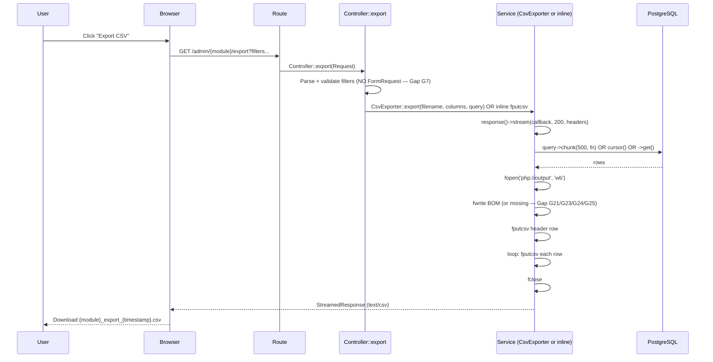

# CSV & Parquet Export Pipeline

> **Module:** Reports / CSV & Parquet Exports
> **Audience:** Engineers, accountants, compliance officers, AI assistants
> **Status:** Draft — pending review (3 CRITICAL + 9 HIGH + 9 MEDIUM + 7 LOW gaps; see §14)
> **Last reviewed:** Phase 16 (Reporting & Exports)
> **Source of truth:** This file documents the CSV/Parquet export subsystem — 22 HTTP export
> endpoints + 1 Artisan command (`partition:export-parquet`) — across 3 implementation
> patterns: (1) `CsvExporter` reusable service (used by 9 master-data modules), (2) inline
> `fputcsv` exports scattered across 14 controllers/services, (3) DuckDB-backed Parquet
> archival for cold-storage partitions.
> **REPORTS-2 (commit `1665ae5`):** G-046/G2 (DuckDB in Dockerfile + `--require-parquet`
> flag + scheduled fail-loud) resolved. All 3 CRITICALs in this file now closed (G1/G12 closed
> in `b3a9fd7`, G2 closed in REPORTS-2).

---

## 1. What is it?

The **CSV & Parquet Export Pipeline** is the collection of HTTP endpoints and Artisan commands
that produce downloadable CSV (Comma-Separated Values) and Parquet files for offline analysis,
audit, archival, and interop. The pipeline spans 3 implementation tiers:

### 1.1 Tier 1 — `CsvExporter` reusable service (9 master-data modules)

- **Service:** `App\Services\Export\CsvExporter`
  (`laravel/app/Services/Export/CsvExporter.php`, 159L) — static class, 4 methods.
- **Call site:** `App\Http\Controllers\Admin\BaseMasterDataController::export():464-481`
  (`laravel/app/Http/Controllers/Admin/BaseMasterDataController.php`) — inherited by 9
  master-data controllers (Branch, Warehouse, Product, Customer, Supplier, Employee, Bank,
  User, Ledger).
- **Pattern:** Streaming via `response()->stream()` + `chunk(500)` + UTF-8 BOM via
  `fwrite($out, "\xEF\xBB\xBF")`.

### 1.2 Tier 2 — Inline `fputcsv` exports (14 controllers/services)

- 14 endpoints roll their own `fputcsv` + `php://output` + BOM-write pattern instead of using
  `CsvExporter`. This is a coding-standards violation (Gap G11).
- **Patterns observed (4 variants):**
  - **Pattern B:** `cursor()` + `fputcsv` + `fprintf($out, chr(0xEF).chr(0xBB).chr(0xBF))` BOM.
    Used by `CsvExportController` (invoices/challans), `WarehouseTransferController`,
    `StockAdjustmentController`, `ReportController::exportTrialBalanceCsv`,
    `StockTakeVarianceReport::exportCsv`, `StockTakeWeeklyReport::exportCsv`,
    `DamageReportService::exportCsv`.
  - **Pattern C:** `->get()` + `fputcsv` + `fwrite($out, "\xEF\xBB\xBF")` BOM. Used by
    `SalesReturnController`, `PurchaseReceiveController`, `PurchaseReturnController`,
    `GlobalAuditController`.
  - **Pattern D:** `php://temp` buffered + `stream_get_contents` + NO BOM. Used by
    `BranchDemandReportController::exportCsv` (Gap G4 + G21).
  - **Pattern E:** `?export=csv` query toggle on a GET report-view route (no dedicated export
    route). Used by `ReportController::trialBalance` + `cashFlow` (Gap G12).

### 1.3 Tier 3 — DuckDB-backed Parquet archival (1 Artisan command)

- **Command:** `App\Console\Commands\ExportArchivedPartitionsToParquet`
  (`laravel/app/Console/Commands/ExportArchivedPartitionsToParquet.php`, 339L).
- **Signature:** `php artisan partition:export-parquet [--dry-run] [--keep] [--force]`.
- **Schedule:** Quarterly at 04:30 on Jan 1 / Apr 1 / Jul 1 / Oct 1
  (`laravel/routes/console.php:49-54`), with `withoutOverlapping` + `runInBackground`.
- **Format:** Parquet (ZSTD compression) when DuckDB CLI is available; CSV fallback otherwise
  (Gap G2 — DuckDB not in Docker image, so fallback is always used in production).
- **Side effect:** `DROP TABLE IF EXISTS archive.<table> CASCADE` after successful export
  (unless `--keep`).

### 1.4 Total inventory

**22 HTTP export endpoints + 1 Artisan command = 23 export paths.** Full inventory in §8.

---

## 2. Why does it exist?

### 2.1 Compliance

Financial auditors require CSV exports of Trial Balance, General Ledger, invoices, and
payments for sign-off. The Trial Balance export includes the Dr=Cr integrity check + sub-ledger
reconciliation footnote (see `reports/reports-catalog.md` §6.9). Without CSV export, auditors
would have to manually transcribe from the HTML report.

### 2.2 Operational

Branch managers need offline copies of the weekly audit report — the "MAIN BILL SHIT1.xlsx"
replication documented in `BranchDemandWeeklyReportService` docblock L8-23. The 25-column
daily breakdown (cash sale, collection, expenses, money transfer, warehouse-wise sale, demand
bill, profit, discount, sales return, product transfer, missing bank amount, HO bill, cash in
hand, warehouse stock value, customer due, GAP, repricing, price range impact) is the daily
financial pulse of each branch.

### 2.3 Archival

PostgreSQL partitions aged out by pg_partman must be exported to Parquet before the archive
table is dropped. `ExportArchivedPartitionsToParquet` docblock L10-43:
> *"Exports archived partition tables to Parquet (or CSV fallback) files on the local disk.
> After successful export, the archive table is DROPPED (unless --keep is passed)."*

Parquet is preferred over CSV for archival because:
- 5-10× compression (ZSTD) — critical for multi-year cold storage.
- Type preservation (CSV loses types — everything is a string; Parquet preserves int/float/
  date/timestamp).
- Columnar format — efficient for analytical queries if the archive is ever queried directly.

### 2.4 Interop

CSV is the lowest-common-denominator format for import into Excel / Google Sheets / external
BI tools. The UTF-8 BOM (Byte Order Mark) is critical for Excel to auto-detect UTF-8 encoding
— without it, Bengali characters in customer/product/branch names mojibake (Gap G21, G23,
G24, G25).

---

## 3. When is it used?

### 3.1 On-demand HTTP exports

User clicks "Export CSV" on any index page → GET request to the export route → streamed
download. Frequency varies by endpoint:

| Endpoint | Typical frequency | Trigger |
|---|---|---|
| 9 master-data exports (Branch, Warehouse, Product, Customer, Supplier, Employee, Bank, User, Ledger) | Ad-hoc, low frequency | Admin clicks export on index page |
| Invoice/challan export (`CsvExportController`) | Monthly close | Accountant exports the month's invoices |
| Trial balance / cash flow export | Monthly close | Accountant exports for reconciliation |
| Stocktake variance/weekly export | After each stocktake cycle | Warehouse manager exports the variance report |
| Branch-demand weekly export | Daily/weekly | Branch manager exports the audit sheet |
| Damage report export | Monthly | Warehouse manager exports the damage log |
| Purchase order/receive/return export | Quarterly | Accountant exports for supplier reconciliation |
| Sales return export | Monthly | Accountant exports for return analysis |
| Stock adjustment export | Monthly | Warehouse manager exports for adjustment audit |
| Warehouse transfer export | Monthly | Warehouse manager exports for transfer audit |
| Global audit export | Ad-hoc | Admin exports for forensic investigation |
| Budget variance export | Quarterly | Accountant exports budget vs actual |

### 3.2 Scheduled Parquet archival

`php artisan partition:export-parquet` runs quarterly at 04:30 on Jan 1 / Apr 1 / Jul 1 / Oct
1 (`routes/console.php:49-54`), offset 30 min after the 04:00 pg_cron consolidation job. The
command:
1. Lists all tables in the `archive` schema (`information_schema.tables WHERE
   table_schema='archive' AND table_type='BASE TABLE'`).
2. For each table: PG `COPY TO` temp CSV → DuckDB `read_csv → COPY TO ... (FORMAT PARQUET,
   COMPRESSION ZSTD)` → verify non-empty → `DROP TABLE archive.<table> CASCADE` (unless
   `--keep`).
3. Logs each export to `Log::info`.

### 3.3 Ad-hoc Parquet archival

Admin can run `php artisan partition:export-parquet --dry-run` to list what would be exported,
or `--force` to overwrite existing files, or `--keep` to retain the archive table after
export.

---

## 4. Who uses it?

### 4.1 Role matrix per endpoint

| Endpoint | Route name | Role middleware | Notes |
|---|---|---|---|
| 9 master-data exports | `admin.{module}.export` | varies (e.g. `role:admin,manager,warehouse_manager` for branches) | Per `BaseMasterDataController` subclass route definitions |
| Invoice export | `admin.sales-invoices.export-csv` | `role:accountant,manager,admin` | `routes/web.php:1213` |
| Challan export | `admin.sales-challans.export-csv` | `role:accountant,manager,admin` | `routes/web.php:1266` |
| Warehouse transfer export | `admin.warehouse-transfers.export` | NONE (only `auth`) | Branch isolation via `WarehouseTransferBranchScope` global scope |
| Stock adjustment export | `admin.stock-adjustments.export` | outer group `role:admin,manager,accountant` + policy `authorize('audit', StockAdjustment::class)` | `routes/web.php:466` |
| Damage export (Damages module) | `admin.damages.export` | outer group `role:admin,manager,warehouse_manager` | `routes/web.php:786` |
| Damage export (Reports module) | `admin.reports.damageReportExport` | NONE (only `auth`) — **Gap G1** | `routes/web.php:402` |
| Stocktake variance export | `admin.reports.stocktakeVarianceExport` | NONE (only `auth`) — **Gap G1** | `routes/web.php:393` |
| Stocktake weekly export | `admin.reports.stocktakeWeeklyExport` | NONE (only `auth`) — **Gap G1** | `routes/web.php:396` |
| Trial balance export (`?export=csv`) | `admin.reports.trialBalance` | NONE (only `auth`) — **Gap G1/G12** | `routes/web.php:361` |
| Cash flow export (`?export=csv`) | `admin.reports.cashFlow` | NONE (only `auth`) — **Gap G1/G12** | `routes/web.php:364` |
| Branch-demand weekly export | `admin.branch-demands.weekly-report.export` | `menu.permission:branchdemand` (not `role:`) — **Gap G29** | `routes/web.php:716` |
| Purchase order export | `admin.purchase-orders.export` | `role:admin,manager,warehouse_manager,accountant` | `routes/web.php:902` |
| Purchase receive export | `admin.purchase-receives.export` | `role:admin,manager,warehouse_manager,accountant` | `routes/web.php:946` |
| Purchase return export | `admin.purchase-returns.export` | `role:admin,manager,warehouse_manager,accountant` | `routes/web.php:996` |
| Sales return export | `admin.sales-returns.export` | `role:salesman,accountant,warehouse_manager,manager,admin` | `routes/web.php:1510` |
| Global audit export | `admin.audit.export` | `role:admin` (only) | `routes/web.php:1623` |
| Budget variance export | `admin.budgets.export-csv` | outer group `role:accountant,manager,admin` | `routes/web.php:1650` |
| Parquet archival | (Artisan, not HTTP) | n/a (CLI only) | Scheduled quarterly |

⚠️ **Gap G1 (CRITICAL):** 6 export endpoints in the `admin/reports` group have NO `role:`
middleware — any authenticated user can download Trial Balance, Cash Flow, Stocktake Variance,
Stocktake Weekly, and Damage Report CSVs. Financial data exfiltration risk.

> ✅ RESOLVED in commit b3a9fd7 — Added `role:accountant,manager,admin` middleware to the `admin/reports` prefix group at `routes/web.php:359`, which transitively gates all 5 export endpoints (stocktakeVarianceExport L393, stocktakeWeeklyExport L396, damageReportExport L402, trialBalance L361, cashFlow L364) and the 4 CTE routes. Sub-problem A (Session 1, Security/RLS cluster).

### 4.2 Other actors

- **Mobile app / AI sidecar:** No CSV export via API v1 (only dashboard JSON endpoints). CSV
  export is web-only.
- **Auditor (external):** Trial balance, GL, invoice, payment exports for sign-off.
- **Compliance officer:** Global audit export for forensic investigation.
- **DBA:** Parquet archival command for cold-storage management.

---

## 5. Related modules

- **Sales** — invoices, challans, returns (`CsvExportController`, `SalesReturnController`).
- **Purchasing** — PO, GRN, returns (`PurchaseOrder/Receive/ReturnController`).
- **Inventory** — stocktake, damage, warehouse transfers, stock adjustments
  (`ReportController`, `DamageController`, `WarehouseTransferController`,
  `StockAdjustmentController`).
- **Finance** — trial balance, cash flow, budget variance (`ReportController`,
  `BudgetController`).
- **Branch demand** — weekly audit (`BranchDemandReportController` +
  `BranchDemandWeeklyReportService`).
- **Master data** — 9 modules (`BaseMasterDataController` + `CsvExporter`).
- **Audit** — `GlobalAuditController`.
- **Archival** — `ExportArchivedPartitionsToParquet` (cross-link `database/partitioning.md`).

---

## 6. Business rules

### 6.1 BOM is mandatory for Excel compatibility

**BR-CSV-1:** Every CSV export MUST start with a UTF-8 BOM (`\xEF\xBB\xBF`) so Excel renders
Bengali characters correctly. Without BOM, Excel defaults to ANSI encoding and mojibakes any
non-ASCII content (customer names, product names, branch names with Bengali characters).

**Violated by:** Gap G21 (Branch Demand Weekly — no BOM), G23 (Purchase Order — no BOM), G24
(Budget Variance — no BOM), G25 (Cash Flow — no BOM).

### 6.2 Streaming is mandatory for large exports

**BR-CSV-2:** Every CSV export MUST use `response()->stream()` (or `Response::stream()`) —
NOT a buffered `response($content)`. Streaming writes rows directly to `php://output` as
they're generated, keeping memory bounded regardless of result set size.

**Violated by:** Gap G4 — `BranchDemandReportController::exportCsv` uses `php://temp` +
`stream_get_contents` (buffered). Combined with G28 (no 90-day cap on the export route), a
malicious user could request a 10-year export and trigger memory exhaustion.

### 6.3 Chunking is recommended

**BR-CSV-3:** Every CSV export SHOULD use `cursor()` or `chunk(500)` to keep memory bounded
for large result sets. `cursor()` uses a PHP generator + server-side cursor; `chunk(500)`
issues paginated queries.

**Violated by:** `PurchaseOrderController::export`, `PurchaseReceiveController::export`,
`PurchaseReturnController::export`, `SalesReturnController::export` — all use `->get()` which
loads the full result set into memory.

### 6.4 Role middleware is mandatory for financial exports

**BR-CSV-4:** Every CSV export endpoint MUST be behind `role:` middleware appropriate to the
data sensitivity. Financial exports (invoices, trial balance, cash flow, budget, GL) MUST be
restricted to `role:accountant,manager,admin` minimum.

**Violated by:** Gap G1/G12 — 6 export endpoints in the `admin/reports` group have no role
middleware.

### 6.5 Rate limiting is recommended

**BR-CSV-5:** Every CSV export endpoint SHOULD have a `throttle:` rate limit to prevent DoS.
A user repeatedly hitting `admin/sales-invoices/export-csv?from_date=2000-01-01&to_date=2099-12-31`
could DoS the database (cursor + per-row fputcsv on millions of rows).

**Violated by:** Gap G8 — NO export endpoint has throttle middleware.

### 6.6 Audit logging is mandatory for financial exports

**BR-CSV-6:** Every financial-data export (invoices, trial balance, cash flow, budget, GL)
MUST write an audit-log row recording who exported what when. The
`fn_financial_audit_trigger` (Phase 5) only fires on INSERT/UPDATE/DELETE — not on SELECT/COPY.
Exports are read-only and bypass the audit trigger.

**Violated by:** Gap G6 — NO export writes an audit row. The `StockAdjustmentController::export`
docblock at L564-567 explicitly acknowledges this: *"No audit-log row is written — a bulk
export spans many adjustments and the audit log requires a single stock_adjustment_id; the
'export' action vocab is reserved for a future per-record export."*

### 6.7 CsvExporter is the canonical service

**BR-CSV-7:** CsvExporter is the canonical export service — all new exports MUST use it, not
roll their own `fputcsv`. The service-layer rule from Phase 4
(`coding/service-layer-conventions.md`) mandates this.

**Violated by:** Gap G11 — 14 of 22 endpoints roll their own inline `fputcsv`.

### 6.8 FormRequest validation is mandatory

**BR-CSV-8:** Filter inputs on export endpoints MUST be validated via a FormRequest.
`from_date`/`to_date` should be `date` format; `branch_id` should be `nullable|integer|exists`;
`status` should be an enum.

**Violated by:** Gap G7 — NO export endpoint uses a FormRequest.

### 6.9 Parquet archival must succeed before DROP

**BR-CSV-9:** Parquet archival MUST succeed (not fall back to CSV) before the archive table is
dropped. If DuckDB is unavailable, the command falls back to CSV export and then DROPS the
typed data — irretrievably losing type information.

**Violated by:** Gap G2 — DuckDB not in Docker image, falls back to CSV, then drops the typed
data.

### 6.10 Parquet archival must record a manifest

**BR-CSV-10:** Parquet archival MUST record a manifest row (parent, partition, path, size,
checksum) in a `partition_exports` table. This enables integrity verification and audit
trails for cold storage.

**Violated by:** Gap G13/G14 — TODO unfulfilled; only `Log::info` is written.

---

## 7. Technical implementation

### 7.1 CsvExporter anatomy — verbatim

`laravel/app/Services/Export/CsvExporter.php` (159L):

```php
namespace App\Services\Export;

use Illuminate\Database\Eloquent\Builder as EloquentBuilder;
use Illuminate\Database\Eloquent\Model;
use Illuminate\Support\Str;
use Symfony\Component\HttpFoundation\StreamedResponse;

class CsvExporter
{
    public static function export(string $filename, array $columns, EloquentBuilder $query): StreamedResponse
    {
        $fullFilename = self::filename($filename);

        $headers = [
            'Content-Type'        => 'text/csv; charset=UTF-8',
            'Content-Disposition' => 'attachment; filename="' . $fullFilename . '"',
            'Cache-Control'       => 'no-store, no-cache, must-revalidate',
            'Pragma'              => 'no-cache',
            'Expires'             => '0',
        ];

        $callback = function () use ($columns, $query): void {
            $out = fopen('php://output', 'wb');
            if ($out === false) {
                throw new \RuntimeException('Unable to open php://output stream for CSV export.');
            }

            // UTF-8 BOM — Excel auto-detects encoding and renders UTF-8 correctly.
            fwrite($out, "\xEF\xBB\xBF");

            // Header row.
            $headerRow = array_values($columns);
            self::fputcsv($out, $headerRow);

            // Data rows — chunk to keep memory bounded.
            $query->chunk(500, function ($records) use ($out, $columns): void {
                foreach ($records as $record) {
                    $row = [];
                    foreach (array_keys($columns) as $key) {
                        $row[] = self::extractValue($record, $key);
                    }
                    self::fputcsv($out, $row);
                }
            });

            fclose($out);
        };

        return response()->stream($callback, 200, $headers);
    }

    public static function filename(string $base): string
    {
        $base      = Str::slug($base, '_');
        $timestamp = now()->format('Ymd_His');
        return "{$base}_export_{$timestamp}.csv";
    }

    private static function extractValue(Model $record, string $key): string
    {
        if (!str_contains($key, '.')) {
            $value = $record->{$key};
        } else {
            $value = $record;
            foreach (explode('.', $key) as $segment) {
                if ($value === null) break;
                $value = is_object($value) ? ($value->{$segment} ?? null) : null;
            }
        }

        if ($value === null) return '';
        if (is_bool($value)) return $value ? 'Yes' : 'No';
        if ($value instanceof \DateTimeInterface) return $value->format('Y-m-d H:i:s');
        return (string) $value;
    }

    private static function fputcsv($handle, array $fields): void
    {
        fputcsv($handle, $fields, ',', '"', '\\');
    }
}
```

**Analysis:**

| Aspect | Implementation | Citation |
|---|---|---|
| Library | PHP native `fputcsv()` (NOT league/csv) — wrapped in private `fputcsv()` helper that forces delimiter `,`, enclosure `"`, escape `\\` for PHP 8.4 compat | `CsvExporter.php:155-158` |
| Streaming | **Streaming** via `response()->stream($callback, 200, $headers)`; opens `php://output` directly; uses `chunk(500)` for memory-bounded row emission | `:65,81-89,94` |
| BOM | YES — writes 3-byte UTF-8 BOM `\xEF\xBB\xBF` as first 3 bytes via `fwrite($out, "\xEF\xBB\xBF")` | `:74` |
| Encoding | UTF-8 (Content-Type `text/csv; charset=UTF-8`); assumes input strings already UTF-8 | `:56` |
| Escaping | RFC 4180 — fields containing comma/quote/newline auto-wrapped by PHP's `fputcsv()`; escape char explicitly forced to `\\` | `:157` |
| Headers row | YES — first row written from `array_values($columns)` (the labels) | `:77-78` |
| Column map | YES — caller passes `[key => label]` associative array; `key` may be dotted relation path (e.g. `branch.branch_name`) | `:51,84-86,120-132` |
| File naming | `Str::slug($base, '_')` + `_export_` + `now()->format('Ymd_His')` + `.csv` — e.g. `branches_export_20250119_143022.csv` | `:101-107` |
| Response | `Symfony\Component\HttpFoundation\StreamedResponse` via `response()->stream()` | `:94` |
| Type formatting | Bools → `Yes`/`No`; DateTimeInterface → `Y-m-d H:i:s`; null → empty string `''` | `:134-146` |
| Chunk size | Hardcoded `500` (no config — Gap G5) | `:81` |
| Singleton/Facade | **NO** — not registered in `AppServiceProvider.php`; called statically `CsvExporter::export(...)` from `BaseMasterDataController::export:480` — only ONE call site in the entire codebase | grep `CsvExporter` returns 2 files |
| Tests for the service | **NO** — only feature tests for the endpoints that USE it (`tests/Feature/Export/CsvExportTest.php`) | grep returns no `tests/Unit/Export/` directory |

### 7.2 The 4 CSV-writer patterns in the codebase

**Pattern A — `CsvExporter::export()` (streaming + chunk-500 + `\xEF\xBB\xBF` BOM via `fwrite`).**
Used by 9 master-data modules via `BaseMasterDataController::export`.

**Pattern B — inline `cursor()` + `fputcsv` + `fprintf($out, chr(0xEF).chr(0xBB).chr(0xBF))` BOM.**
Used by `CsvExportController` (invoices/challans), `WarehouseTransferController`,
`StockAdjustmentController`, `ReportController::exportTrialBalanceCsv`,
`StockTakeVarianceReport::exportCsv`, `StockTakeWeeklyReport::exportCsv`,
`DamageReportService::exportCsv`.

**Pattern C — inline `->get()` + `fputcsv` + `fwrite($out, "\xEF\xBB\xBF")` BOM.**
Used by `SalesReturnController`, `PurchaseReceiveController`, `PurchaseReturnController`,
`GlobalAuditController`. **Note:** `PurchaseOrderController::export` is supposed to use this
pattern but is MISSING the BOM write (Gap G23).

**Pattern D — `php://temp` buffered + `stream_get_contents` + NO BOM.**
Used by `BranchDemandReportController::exportCsv` (Gap G4 + G21). The entire CSV is built in
memory, then returned as a single `response($csvContent)`.

**Pattern E — `?export=csv` query toggle on a GET report-view route (no dedicated export route).**
Used by `ReportController::trialBalance` + `cashFlow` (Gap G12). The controller checks
`$request->input('export') === 'csv'` and delegates to a private `exportTrialBalanceCsv()` /
`exportCashFlowCsv()` method. No dedicated route means no opportunity to attach role
middleware (Gap G1/G12).

### 7.3 Parquet archival pipeline — verbatim `handle()` body

`laravel/app/Console/Commands/ExportArchivedPartitionsToParquet.php:77-187`:

```php
public function handle(): int
{
    $dryRun = (bool) $this->option('dry-run');
    $keep   = (bool) $this->option('keep');
    $force  = (bool) $this->option('force');

    $this->ensureExportDirectory();

    $duckdbPath = $this->findDuckdb();
    $useParquet = $duckdbPath !== null;
    if (! $useParquet) {
        $this->warn('DuckDB not found on PATH — falling back to CSV export. Install DuckDB for native Parquet output.');
        Log::warning('partition:export-parquet: DuckDB not available; falling back to CSV export.');
    }

    $archivedTables = $this->listArchivedTables();

    if ($archivedTables->isEmpty()) {
        $this->info('No archived partitions to export.');
        return self::SUCCESS;
    }

    $this->info(sprintf('Found %d archived table(s)%s.', $archivedTables->count(), $dryRun ? ' [DRY RUN]' : ''));

    $exported = 0;
    $skipped  = 0;
    $failed   = 0;

    foreach ($archivedTables as $row) {
        $table = $row->table_name;
        $extension  = $useParquet ? 'parquet' : 'csv';
        $exportName = "{$table}.{$extension}";
        $relative   = self::SUBDIR . '/' . $exportName;

        $this->line("  → {$table}");

        if ($dryRun) {
            $this->line("      would export → {$relative}");
            continue;
        }

        if (! $force && Storage::disk(self::DISK)->exists($relative)) {
            $this->line("      already exported — skipping (use --force to overwrite).");
            $skipped++;
            continue;
        }

        try {
            $bytes = $useParquet
                ? $this->exportParquet($table, $relative, $duckdbPath)
                : $this->exportCsv($table, $relative);

            $this->info(sprintf('      exported %s (%s)', $exportName, $this->formatBytes($bytes)));

            if (! $keep) {
                DB::statement("DROP TABLE IF EXISTS archive.{$table} CASCADE");
                $this->line("      dropped archive.{$table}");
            }

            Log::info('partition:export-parquet: exported', [
                'table'  => $table,
                'path'   => $relative,
                'bytes'  => $bytes,
                'format' => $useParquet ? 'parquet' : 'csv',
                'kept'   => $keep,
            ]);

            $exported++;
        } catch (\Throwable $e) {
            $failed++;
            $this->error("      FAILED: {$e->getMessage()}");
            Log::error('partition:export-parquet: export failed', [
                'table' => $table,
                'error' => $e->getMessage(),
                'trace' => $e->getTraceAsString(),
            ]);
        }
    }

    if ($dryRun) {
        $this->info(sprintf('[DRY RUN] Would have exported %d table(s).', $archivedTables->count()));
        return self::SUCCESS;
    }

    $this->info(sprintf('Done. Exported %d, skipped %d, failed %d.', $exported, $skipped, $failed));
    return $failed > 0 ? self::FAILURE : self::SUCCESS;
}
```

**Verbatim `exportParquet()` body** (`:236-281`):

```php
private function exportParquet(string $table, string $relative, string $duckdbPath): int
{
    $disk = Storage::disk(self::DISK);
    $absolutePath = $disk->path($relative);
    $tempCsv = $disk->path(self::SUBDIR . "/.{$table}.tmp.csv");

    DB::statement(<<<SQL
        COPY (SELECT * FROM archive."{$table}") TO '{$this->escapeSqlPath($tempCsv)}'
        WITH (FORMAT CSV, HEADER true)
    SQL);

    $duckSql = sprintf(
        "COPY (SELECT * FROM read_csv('%s', header=true)) TO '%s' (FORMAT PARQUET, COMPRESSION ZSTD);",
        $this->escapeCliArg($tempCsv),
        $this->escapeCliArg($absolutePath)
    );

    $cmd = sprintf('%s -c %s', escapeshellarg($duckdbPath), escapeshellarg($duckSql));
    @exec($cmd . ' 2>&1', $out, $rc);
    @unlink($tempCsv);

    if ($rc !== 0) {
        throw new \RuntimeException('DuckDB export failed (rc=' . $rc . '): ' . implode("\n", $out));
    }

    $size = $disk->size($relative);
    if ($size <= 0) {
        throw new \RuntimeException("Parquet file is empty or missing: {$absolutePath}");
    }

    return $size;
}
```

**Analysis:**

| Aspect | Implementation | Citation |
|---|---|---|
| Export format | **Parquet** (primary, ZSTD compression) with **CSV fallback** when DuckDB absent | `:236-281, 287-303` |
| Tool | External **DuckDB CLI** invoked via `exec()` (NOT pure PHP, NOT pyarrow, NOT a PHP extension) — detected at runtime via `which duckdb` | `:203-210, 252-264` |
| Partition selector | All tables in `archive` schema — no date/age filter; relies on pg_partman to have already moved partitions there | `:217-224` |
| Output path | Laravel `local` disk → `storage/app/partition-exports/<table>.parquet` (or `.csv` fallback) | `:69-72, 239-240` |
| Retention | DROP archive table after successful export unless `--keep` — `DROP TABLE IF EXISTS archive.<table> CASCADE` | `:144-147` |
| Scheduling | YES — quarterly at 04:30 on Jan 1/Apr 1/Jul 1/Oct 1, with `withoutOverlapping` + `runInBackground` | `routes/console.php:49-54` |
| Error handling | Per-table try/catch — one bad partition does NOT block the rest; logs to `Log::error` with trace; returns FAILURE exit code if any failed | `:163-173, 186` |
| Idempotency | Skips already-exported files unless `--force` | `:127-132` |
| Manifest / checksum | **NO** — only Laravel `Log::info` per export; TODO at L149-153 for a `partition_exports` table is unfulfilled | `:149-160` |
| DuckDB in Docker? | **NO** — `Dockerfile` (L1-40) installs only PHP extensions + `postgresql-client`; no `duckdb` binary. The command will silently fall back to CSV on every quarterly run in production. | `Dockerfile` grep `duckdb` returns no matches |
| SQL injection risk | `escapeSqlPath()` (`:309-312`) doubles `\` and `'` for PG string literal; `escapeCliArg()` (`:318-321`) doubles `'` for DuckDB; both wrapped in `escapeshellarg()` for shell; the table name itself is interpolated raw into `archive."{$table}"` but it comes from `information_schema.tables.table_name` (DB-sourced, not user input) | `:246-249, 252-264, 309-321` |

### 7.4 Memory strategy matrix

| Endpoint | Strategy | Risk |
|---|---|---|
| 9 master-data via CsvExporter | `chunk(500)` streamed | Low |
| CsvExportController invoices/challans | `cursor()` streamed | Low |
| WarehouseTransferController::export | `cursor()` streamed | Low |
| StockAdjustmentController::export | `cursor()` streamed | Low |
| StockTakeVariance/Weekly/DamageReport | service `getVarianceLines()` returns array (not cursor) — loads all rows into memory, then streams the CSV | Medium (variance rows bounded by stocktake activity; damage capped at 500 — Gap G27) |
| ReportController::exportTrialBalanceCsv | consumes pre-built `$report` array (ReportService builds it) | Medium (depends on ReportService) |
| BranchDemandReportController::exportCsv | `php://temp` buffered + service fires ~23 queries/day | **HIGH** (Gap G4 + G28) |
| PurchaseOrder/Receive/Return/SalesReturn::export | `->get()` loads all rows into memory | Medium-High (unbounded) |
| GlobalAuditController::export | `chunk(500)` streamed | Low |
| BudgetController::exportCsv | consumes pre-built `$varianceData` array | Low (bounded by ledger count) |
| ExportArchivedPartitionsToParquet | PG COPY → temp CSV → DuckDB → Parquet (disk-based) | Low (disk-bound, not memory) |

### 7.5 BOM handling — 4 idioms

1. `fwrite($out, "\xEF\xBB\xBF")` (hex) — used by `CsvExporter`, `PurchaseReceiveController`,
   `PurchaseReturnController`, `SalesReturnController`, `GlobalAuditController`.
2. `fprintf($out, chr(0xEF).chr(0xBB).chr(0xBF))` (chr concat) — used by `CsvExportController`,
   `ReportController::exportTrialBalanceCsv`, `StockTakeVarianceReport::exportCsv`,
   `StockTakeWeeklyReport::exportCsv`, `DamageReportService::exportCsv`.
3. `fprintf($output, chr(0xEF).chr(0xBB).chr(0xBF))` (same, different var name) — variant of
   #2.
4. **MISSING** — no BOM write. Used by `BranchDemandReportController::exportCsv` (Gap G21),
   `PurchaseOrderController::export` (Gap G23), `BudgetController::exportCsv` (Gap G24),
   `ReportController::exportCashFlowCsv` (Gap G25).

**Standardize on idiom #1** (the hex form — most readable).

### 7.6 Branch isolation on export queries

- **RLS** is the DB-layer backstop for `stock_take_sessions`, `damage_invoices`,
  `warehouse_transfers` (via `WarehouseTransferBranchScope` global scope).
- For `sales_invoices` / `sales_challans` / `purchase_orders` etc., branch isolation is
  enforced via `resolveBranchIdForRead()` helper in each controller (admin sees all; non-admin
  locked to session `branch_id`).
- For `BranchDemandReportController`, `resolveBranchId()` at `:177-184` does the same.

---

## 8. Important database tables

### 8.1 Read by exports (NO writes — all exports are read-only)

`branches`, `warehouses`, `products`, `customers`, `suppliers`, `employees`, `banks`, `users`,
`ledgers`, `sales_invoices`, `sales_challans`, `sales_returns`, `purchase_orders`,
`purchase_receives`, `purchase_returns`, `stock_take_sessions`, `stock_take_items`,
`stock_take_warehouses`, `damage_invoices`, `damage_invoice_items`, `warehouse_transfers`,
`warehouse_transfer_items`, `stock_adjustments`, `stock_adjustment_items`, `branch_demands`,
`branch_demand_items`, `budgets`, `budget_lines`, `journal_entries`, `journal_lines`,
`user_audit_log`, `customer_payments`, `customer_ledger`, `branch_ledger`, `cash_ledger`,
`warehouse_stock`, `money_transfers`, `other_expenses`.

### 8.2 Written by exports

NONE (all exports are read-only). The `ExportArchivedPartitionsToParquet` command DROPS
`archive.*` tables after successful export (`:144-147`) — that's the only write.

### 8.3 Missing tables

- **No `partition_exports` manifest table exists** (Gap G13/G14 — TODO unfulfilled).
- **No `export_audit_log` table exists** (Gap G6 — recommended new table).

### 8.4 RLS coverage

- `stock_take_sessions` ✓
- `damage_invoices` ✓
- `warehouse_transfers` (via global scope, not RLS)
- Other export source tables do NOT have RLS — branch isolation is enforced at the
  query-builder layer via `where('branch_id', ...)`.

---

## 9. Related services

| Service | Method | Lines | Uses CsvExporter? | Notes |
|---|---|---|---|---|
| `App\Services\Export\CsvExporter` | `export(string, array, EloquentBuilder)` | `:51-95` | (is the service) | Static method; only call site is `BaseMasterDataController::export:480` |
| `App\Services\Export\CsvExporter` | `filename(string)` | `:101-107` | n/a | `Str::slug` + `_export_` + `Ymd_His` |
| `App\Services\Export\CsvExporter` | `extractValue(Model, string)` | `:120-147` | n/a | Dotted-relation resolver |
| `App\Services\Stock\StockTakeVarianceReport` | `exportCsv(array)` | `:185-228` | **N** | inline `fputcsv` + `fprintf` BOM |
| `App\Services\Stock\StockTakeWeeklyReport` | `exportCsv(array)` | `:164-194` | **N** | inline `fputcsv` + `fprintf` BOM |
| `App\Services\Stock\WarehouseTransferSummaryReport` | (none) | — | n/a | **Gap G26** — no exportCsv method |
| `App\Services\BranchDemand\BranchDemandWeeklyReportService` | `toCsvArray(array)` | `:999-1075` | **N** | Returns array of arrays — controller does the actual `fputcsv` to `php://temp` |
| `App\Services\Reports\DamageReportService` | `exportCsv(array)` | `:392-433` | **N** | inline `fputcsv` + `fprintf` BOM |
| `App\Services\Budgeting\DimensionReportingService` | (none) | — | n/a | **Gap G26-similar** — no exportCsv method |
| `App\Services\Budgeting\BudgetService::getBudgetVsActual()` | (consumed by `BudgetController::exportCsv`) | — | n/a | The controller does the CSV writing inline |

---

## 10. Related models

All Eloquent models with `BranchScope` or `WarehouseTransferBranchScope` global scopes benefit
from automatic branch isolation on export queries. See `app/Models/Scopes/` directory.

`BaseMasterDataController::exportColumns():76-104` derives export columns from the model's
`$fillable` array — so model schema changes propagate to exports automatically (with the
DDL-stale risk noted in Gap G17).

---

## 11. Important workflows

### 11.1 CSV request lifecycle (sequenceDiagram)



### 11.2 Master-data export via CsvExporter (flowchart)

```mermaid
flowchart TD
    A[Subclass extends BaseMasterDataController] --> B[Overrides exportColumns]
    B --> C[Inherits export Request method]
    C --> D[Calls CsvExporter::export label, columns, query]
    D --> E{CsvExporter::export}
    E --> F[Build filename via Str::slug + timestamp]
    E --> G[response()->stream callback]
    G --> H[fopen php://output]
    H --> I[fwrite BOM \xEF\xBB\xBF]
    I --> J[fputcsv header row from array_values columns]
    J --> K[query->chunk 500]
    K --> L[For each record: extractValue per column key]
    L --> M[fputcsv data row]
    M --> K
    K --> N[fclose]
    N --> O[Return StreamedResponse]

    style E fill:#lightgreen
    style O fill:#lightblue

    P[13 endpoints bypass CsvExporter] --> Q[Roll their own inline fputcsv]
    Q --> R[14 copies of BOM-write + fputcsv + Content-Type pattern]
    R --> S[Inconsistencies: 4 BOM idioms, missing BOM on 4 endpoints, 3 memory strategies]

    style P fill:#yellow
    style S fill:#red
```

### 11.3 Parquet archival quarterly pipeline (stateDiagram)

```mermaid
stateDiagram-v2
    [*] --> Archived: pg_partman moves partition to archive schema
    Archived --> Exporting: quarterly cron triggers partition:export-parquet
    Exporting --> DuckDBCheck: findDuckdb via `which duckdb`
    DuckDBCheck --> ParquetPath: DuckDB found
    DuckDBCheck --> CsvFallback: DuckDB NOT found (Gap G2 — always in production)
    ParquetPath --> CopyToTempCsv: PG COPY TO temp CSV
    CopyToTempCsv --> DuckdbConvert: DuckDB read_csv → COPY TO PARQUET ZSTD
    DuckdbConvert --> VerifyNonEmpty: disk->size > 0
    CsvFallback --> CopyDirectCsv: PG COPY TO final CSV (no type preservation)
    CopyDirectCsv --> VerifyNonEmpty
    VerifyNonEmpty --> DropArchive: success (unless --keep)
    VerifyNonEmpty --> Failed: empty file → RuntimeException
    DropArchive --> Logged: Log::info exported
    Failed --> LoggedError: Log::error with trace
    Logged --> [*]
    LoggedError --> [*]
    DropArchive --> [*]: archive table DROPPED, only Parquet/CSV file remains
```

---

## 12. Known edge cases

1. **Empty result set:** `CsvExporter::export()` writes only the BOM + header row, then
   closes. No error. Test coverage: `WeeklyReportTest::test_get_weekly_returns_summary_with_zero_sessions_in_range`.
2. **Special characters in cell values (comma, double-quote, newline):** handled by PHP's
   `fputcsv` RFC 4180 wrapping. Test coverage: `CsvExportTest::test_csv_handles_special_characters` (L430-463).
3. **Bengali characters:** require BOM for Excel. Without BOM (Gap G21/G23/G24/G25), Excel
   mojibakes. With BOM, renders correctly.
4. **Null values:** `CsvExporter::extractValue` returns `''`. Inline exports use
   `$r->field ?? ''` pattern.
5. **DateTime values:** `CsvExporter::extractValue` formats as `Y-m-d H:i:s`. Inline exports
   use `\Carbon\Carbon::parse($d)->format('d-m-Y')` (different format — inconsistency).
6. **Boolean values:** `CsvExporter` → `Yes`/`No`. Inline exports use `$r->is_reversed ? 'Yes' : 'No'` (same).
7. **Very large exports (1M+ rows):** `cursor()` and `chunk(500)` are memory-safe but
   CPU/IO-bound. No time limit extension in any export controller (Laravel's default 30s
   timeout may hit).
8. **Concurrent exports by the same user:** no `withoutOverlapping` equivalent on HTTP routes
   (only the Artisan command has it). Gap G8 (no rate limit) makes this worse.
9. **Archive table with zero rows:** `COPY` produces an empty CSV → DuckDB produces an empty
   Parquet → `exportParquet` throws `RuntimeException("Parquet file is empty or missing")` at
   L277. The catch at L163 logs the error and continues to the next table. The archive table
   is NOT dropped (the drop is inside the `try` block after the export succeeds).
10. **DamageReportService.getDetailLines limit=500 (Gap G27):** The damage export silently
    caps at 500 rows. The `exportCsv` consumer doesn't know if it got 500-of-500 (capped) or
    500-of-5000 (truncated).
11. **BranchDemandReportController::exportCsv has no 90-day cap (Gap G28):** The `weekly()`
    method validates `from_date`/`to_date` against a 90-day cap (L85-87), but `exportCsv`
    (L109-138) only validates date format, not range. A user can request a 10-year export and
    trigger ~85,000 queries (one per column per day).
12. **Filename injection (Gap G9):** `BranchDemandReportController::exportCsv:124` builds
    `$filename = "branch_demand_weekly_{$branchId}_{$dateFrom}_to_{$dateTo}.csv"` — `$dateFrom`
    and `$dateTo` come from user input with only regex validation. A user passing
    `from_date=2025-01-01;rm -rf /` would produce a filename containing the malicious string.
    Most browsers sanitize `Content-Disposition` headers, but the file lands on the user's
    disk with the unsanitized name.

---

## 13. Future improvements

1. **Unify all 22 exports on `CsvExporter` (eliminate the 14 inline `fputcsv` copies)** —
   fixes G3, G11, G18, G21, G23, G24, G25 in one stroke. Add a `CsvExporter::exportFromRows(string, array, iterable)`
   variant for non-Eloquent sources (services that return arrays).
2. **Add `config/export.php` with `chunk_size`, `bom`, `content_type`, `filename_pattern`,
   `default_role`** — fixes G5.
3. **Create `App\Http\Requests\Export\ExportRequest` base FormRequest** — fixes G7.
4. **Add `throttle:10,1` to every export route** — fixes G8.
5. **Create `export_audit_log` table + write a row in every export** — fixes G6. Schema:
   `id, user_id, route, filters_json, row_count, byte_size, exported_at, ip_address`.
6. **Add `role:accountant,manager,admin` to the reports group at `routes/web.php:359`** —
   fixes G1, G12.
7. **Install DuckDB in the Docker image + add `--require-parquet` flag** — fixes G2. Add
   `RUN apt-get install -y duckdb` (or download the static binary from duckdb.org) to
   `Dockerfile`.
8. **Create `partition_exports` table + compute SHA256 checksum** — fixes G13, G14. Schema:
   `id, parent_table, partition_name, parquet_path, byte_size, row_count, sha256, exported_at, duckdb_version`.
9. **Convert `BranchDemandReportController::exportCsv` to streaming + add 90-day cap** —
   fixes G4, G28.
10. **Add `Currency` and `Branch Code` columns to all financial exports** — fixes G15, G16.
11. **Add `WarehouseTransferSummaryReport::exportCsv`** — fixes G26.
12. **Remove `limit(500)` from `DamageReportService::getDetailLines` for the export path** —
    fixes G27. Add a separate `getAllDetailLines()` method without the limit.
13. **Add `tests/Unit/Export/CsvExporterTest.php`** — fixes G10. Cover `extractValue()` with
    direct attribute, dotted relation, null, bool true/false, DateTimeInterface, string;
    `filename()` with spaces/unicode/special chars; `export()` end-to-end with a mock builder.
14. **Sanitize user-supplied filename components with `Str::slug()`** — fixes G9.
15. **Tighten `admin/branch-demands/weekly-report/export` to `role:admin,manager,accountant`**
    — fixes G29.
16. **Add a CSV export for the 4 CTE reports** — fixes `reports/cte-reports.md` G15. Add
    `CteReportService::exportCsv()` that wraps the JSON response in a CSV writer.
17. **Standardize on the hex BOM idiom** `fwrite($out, "\xEF\xBB\xBF")` — fixes G18 (cosmetic
    consistency).
18. **Add `Content-Length` header where feasible** — fixes G19 (minor UX). Compute row count
    first via `SELECT COUNT(*)`, set `Content-Length` estimate, then stream. Trade-off: extra
    COUNT query.
19. **Standardize DateTime formatting across all exports** — `CsvExporter` uses `Y-m-d H:i:s`;
    inline exports use `d-m-Y`. Pick one (recommend `Y-m-d H:i:s` for ISO compatibility).
20. **Add `?format=csv` to dashboard endpoints** — fixes `reports/dashboards.md` FI6.
21. **Add a per-export `withoutOverlapping` equivalent** — prevent the same user from
    triggering concurrent exports of the same report.
22. **Document the Parquet archival manifest schema in `archive/legacy-read-only.md`** (Phase
    18 — pending) — cross-link the cold-storage format.

---

## 14. Gap catalogue

| ID | Severity | Evidence | Impact | Recommended fix |
|---|---|---|---|---|
| **G1** | **CRITICAL** (cross-ref `reports/reports-catalog.md` G1) | `routes/web.php:359-409` — the entire `admin/reports` route group has NO `role:` middleware. `stocktakeVarianceExport` (L393), `stocktakeWeeklyExport` (L396), `damageReportExport` (L402), `trialBalance` with `?export=csv` (L361), `cashFlow` with `?export=csv` (L364) are ALL accessible to ANY authenticated user (only `auth` from outer group L90). | Any salesman/hr/user can download the full trial balance, stocktake variance report, damage report, and cash flow statement as CSV. Financial data exfiltration. Compliance breach. | Add `->middleware('role:accountant,manager,admin')` to the reports group at L359, OR add per-route middleware on each export route. |
| **G2** | **CRITICAL** | `Dockerfile` (L1-40) — no `duckdb` binary installed. `ExportArchivedPartitionsToParquet::findDuckdb()` returns `null` at runtime; `handle()` falls back to CSV export (`exportCsv` L287-303). The command still DROPs the archive table after the CSV export succeeds (L144-147). | Every quarterly run silently produces `.csv` files instead of `.parquet` files. The 5-10× compression + type-preservation benefits of Parquet are lost. Operators may not notice (the warning is in `Log::warning` + console `warn`, but the run still "succeeds"). Worse: the archive table is DROPPED after a CSV export, so the original typed data is irretrievably lost — only the CSV (with no type info) remains. | Add `RUN apt-get install -y duckdb` (or download the static binary from duckdb.org) to `Dockerfile`. Add a startup health check that fails fast if `partition:export-parquet` is scheduled but DuckDB is absent. Add a `--require-parquet` flag that ABORTS (not falls back) when DuckDB is missing. |

> ✅ **RESOLVED — G-046 / G2 (REPORTS-2, commit `1665ae5`).** Three-layer fix:
>   1. **`Dockerfile`** — added a `RUN` block that downloads the official DuckDB CLI static binary (v1.1.0, linux-amd64) from GitHub releases into `/usr/local/bin/duckdb` and verifies with `duckdb --version`. DuckDB is NOT in Debian bookworm's apt repos, so the static binary is the canonical install path. The quarterly pipeline now has DuckDB on PATH in every production image.
>   2. **`ExportArchivedPartitionsToParquet` command** — added a `--require-parquet` option. When set and DuckDB is missing, the command ABORTs (returns FAILURE) instead of falling back to CSV. This prevents the silent data-loss path where a CSV export succeeds and the archive table is then DROPped, irretrievably destroying typed data.
>   3. **`routes/console.php`** — the quarterly schedule now passes `--require-parquet` so a misconfigured image (DuckDB missing) fails loud in the scheduler log rather than silently degrading archival fidelity.
>
> NB: the interactive/manual path (without `--require-parquet`) retains the CSV fallback for operator convenience, but the scheduled production path is now fail-loud. G13/G14 (the `partition_exports` manifest table + SHA256 checksum) remain MEDIUM — not in this CRITICAL cluster.
| **G3** | **HIGH** | `AppServiceProvider.php` (125L) — NO binding for `CsvExporter`. No Facade (no `app/Facades/` directory exists). `CsvExporter::export()` is called statically from `BaseMasterDataController::export:480`. | CsvExporter is stateless (all-static methods) so this is currently benign, but: (a) the class cannot be mocked for testing (static method), (b) future instance methods (e.g. inject a config, inject a Logger) will require refactoring all call sites, (c) the inconsistency with other services (NotificationService, SystemPolicyService, etc. all bound as singletons) is a smell. | Convert `CsvExporter` to an instance class with non-static methods; register as singleton in `AppServiceProvider::register()`; optionally add a `CsvExporter` Facade. |
| **G4** | **HIGH** | `BranchDemandReportController::exportCsv` L109-138 — uses `php://temp` + `stream_get_contents` pattern (L125-133): the entire CSV is built in memory, then returned as a single `response($csvContent)`. NOT streamed. The service's `generateDailyReport` (called at L120) fires ~23 separate `DB::table()->sum()` queries per day (one per column), so a 90-day export = 2,070 queries + the full CSV in memory. | Memory exhaustion on a 90-day export (the controller's own validation caps at 90 days L85-87 — but that's the `weekly()` method, NOT `exportCsv` which has NO date-range cap). A malicious or careless user could request `from_date=2000-01-01&to_date=2099-12-31` and trigger ~85,000 queries + a multi-MB CSV in memory. | Convert to `response()->stream()` with a generator callback that yields rows one at a time. Add a 90-day (or 365-day) cap on the export route (matching `weekly()`). |
| **G5** | **HIGH** | `ls laravel/config/` — no `export.php`, no `reports.php`. The chunk size (500), the filename pattern, the BOM bytes, the Content-Type string, the column maps for each module — ALL hardcoded across 14+ files. | Recurring Phase 15 pattern. Cannot tune chunk size per-module. Cannot change BOM/encoding globally. Cannot add a "download prefix" without editing every controller. | Create `config/export.php` with `chunk_size`, `bom`, `content_type`, `filename_pattern`, `default_role`. Reference via `config('export.chunk_size')`. |
| **G6** | **HIGH** | `StockAdjustmentController::export` docblock L564-567 explicitly says: "No audit-log row is written — a bulk export spans many adjustments and the audit log requires a single stock_adjustment_id; the 'export' action vocab is reserved for a future per-record export." Grep across all 14 export endpoints confirms NONE write an audit row. | A user can export the full sales invoice ledger / trial balance / damage report / global audit log with no trace. For financial data exports (invoices, trial balance, GL), this is a SOX/audit-trail compliance gap. The `fn_financial_audit_trigger` (Phase 5) only fires on INSERT/UPDATE/DELETE — not on SELECT/COPY. | Add an `export_audit_log` table; write a row in each export controller's `export()` method with `user_id`, `route`, `filters`, `row_count`, `byte_size`, `exported_at`, `ip_address`. Cross-reference `security/audit-trails.md` (Phase 5). |
| **G7** | **HIGH** | Grep across all export endpoints — NONE use a FormRequest. Filters are read via `$request->input(...)` with no validation. `BranchDemandReportController::exportCsv` validates dates with regex (L116-118) but accepts any `branch_id` int. `ReportController::stocktakeVarianceExport` (L707-722) accepts `session_id`, `branch_id`, `warehouse_id`, `product_id` as raw ints with no `exists:` validation. | Malformed filter input (e.g. `branch_id=abc`) may trigger SQL errors or unexpected empty results. No defense-in-depth against parameter tampering. Cross-phase recurring gap (Phase 15 G8 same pattern on notification rules). | Create `App\Http\Requests\Export\ExportRequest` (or per-module subclasses) with `from_date`/`to_date`/`branch_id`/`status` validation rules. |
| **G8** | **HIGH** | Grep `routes/web.php` for `throttle:` — only `search-products` routes have throttle (`throttle:60,1` at L899). NO export endpoint has a rate limit. | A user can repeatedly hit `admin/sales-invoices/export-csv?from_date=2000-01-01&to_date=2099-12-31` and DoS the database (cursor + per-row fputcsv on millions of rows). The `cursor()` approach is memory-safe but CPU/IO-bound. | Add `->middleware('throttle:10,1')` (10 exports per minute per user) to every export route. |
| **G9** | **MEDIUM** | `BranchDemandReportController::exportCsv:124`: `$filename = "branch_demand_weekly_{$branchId}_{$dateFrom}_to_{$dateTo}.csv";` — `$dateFrom` and `$dateTo` come from user input with only regex validation (L116). A user passing `from_date=2025-01-01;rm -rf /` would produce a filename containing the malicious string. Most other endpoints use `now()->format(...)` (safe) but the filename is not `Str::slug`'d. | Filename injection (low impact for HTTP downloads — the filename goes into `Content-Disposition` header which most browsers sanitize, but the file lands on the user's disk with the unsanitized name). | Use `Str::slug()` on all user-supplied filename components, or build filenames only from server-side timestamps + the module label. |
| **G10** | **MEDIUM** | `tests/Feature/Export/CsvExportTest.php` (464L) tests the 9 master-data endpoints that use `CsvExporter`. NO test exists for `CsvExporter` itself (no `tests/Unit/Export/CsvExporterTest.php`). The unit-test coverage of `extractValue()` (dotted relations, bool→Yes/No, DateTime formatting, null handling) is zero. | Refactoring `extractValue()` or `fputcsv()` could silently break the 9 master-data exports without a unit test catching it. The feature tests only assert the response shape (200 + text/csv + BOM + header row contains expected labels) — they do NOT assert the per-cell value formatting. | Add `tests/Unit/Export/CsvExporterTest.php` covering: `extractValue()` with direct attribute, dotted relation, null, bool true/false, DateTimeInterface, string; `filename()` with spaces/unicode/special chars; `export()` end-to-end with a mock builder. |
| **G11** | **HIGH** | Grep `CsvExporter` returns 2 files: the service + `BaseMasterDataController.php:6,480`. So CsvExporter is used by ONLY 9 of the ~22 export endpoints. The other 13 endpoints roll their own inline `fputcsv` + `php://output` + BOM-write. | 14 copies of the same BOM-write + fputcsv + Content-Type-header pattern. Inconsistencies already documented: 4 different BOM-write idioms, missing entirely on budget + cash-flow + branch-demand. Maintaining CSV correctness across 14 sites is a recurring bug source. | Refactor all 14 inline exports to use `CsvExporter::export()` (or a new `CsvExporter::exportFromRows(string, array, iterable)` variant for non-Eloquent sources). The service-layer rule from Phase 4 (`coding/service-layer-conventions.md`) mandates this. |
| **G12** | **CRITICAL** (reaffirms G1) | `routes/web.php:361,364` — `trialBalance` and `cashFlow` routes share the HTML view route with a `?export=csv` query toggle (controller checks `$request->input('export') === 'csv'` at L64 and `$request->query('export') === 'csv'` at L214). No dedicated export route → no opportunity to attach role middleware. | Same as G1 — any authed user can download trial balance + cash flow CSVs. | Split into dedicated `trial-balance/export` and `cash-flow/export` routes with explicit `role:accountant,manager,admin` middleware. |
| **G13** | **MEDIUM** | `ExportArchivedPartitionsToParquet::handle():149-160` — TODO at L149 says "persist a row to `partition_exports`" but the code only writes to `Log::info`. No `partition_exports` table exists (grep returns no migration). No checksum (SHA256/MD5) is computed for the produced Parquet/CSV file. | Cannot verify Parquet file integrity after the fact. Cannot answer "when was table X archived and how big was it?" without grepping logs. Cannot detect silent corruption of cold-storage files. | Create `partition_exports` migration (id, parent_table, partition_name, parquet_path, byte_size, row_count, sha256, exported_at, duckdb_version). Compute checksum after export. Write the row in `handle()` after each successful export. |
| **G14** | **MEDIUM** | `ExportArchivedPartitionsToParquet` docblock L54-57: "TODO (Phase 8): persist a row to a `partition_exports` table ... The `partition_exports` table is a Phase 8 concern; for now we log to the Laravel `Log` facade." Phase 8 has shipped; the TODO remains. | Same as G13 — operational visibility gap. | Same as G13. |
| **G15** | **MEDIUM** | None of the 22 export endpoints include a `currency` or `currency_code` column. The system has multi-currency support (per `config/accounting.php`?) but exports are ambiguous — a row showing `Total Amount = 1000` could be BDT or USD. | Cross-branch / cross-currency exports are ambiguous. Auditors cannot determine currency from the CSV alone. | Add `Currency` column to all financial exports; or include a `Currency: BDT` title row at the top of multi-section exports (trial balance already does this pattern). |
| **G16** | **MEDIUM** | Most exports include `Branch` (branch_name) but NOT `Branch Code`. `CsvExporter::exportColumns()` for BranchController includes both Code and Branch Name, but the invoice/challan/transfer/adjustment exports include only `branch?->branch_name`. For dimension/budget exports, no branch column at all. | Branch name alone is not unique (two branches could share a name); branch code is the canonical identifier. Cross-branch reconciliation from CSV is harder. | Add `branch.branch_code` to all branch-scoped exports alongside `branch.branch_name`. |
| **G17** | **LOW** | `CsvExporter::extractValue():120-147` reads model attributes via `$record->{$key}`. If a model's `$fillable` or DB schema changes (e.g. a column is renamed), the export silently outputs empty strings for that column (no exception). `BaseMasterDataController::exportColumns():76-104` derives columns from `$fillable` — so a removed fillable field disappears from the export with no test catching it. | DDL-stale risk — exports may silently lose columns after a migration. Low impact because `$fillable` is usually kept in sync with schema. | Add a unit test that asserts every `exportColumns()` key has a corresponding column in the DB schema (via `Schema::hasColumn`). |
| **G18** | **LOW** | Content-Type header is `text/csv; charset=UTF-8` (capital) in `CsvExporter:56` + `GlobalAuditController:120`, but `text/csv; charset=utf-8` (lowercase) in 12 other controllers. RFC 7231 says charset values are case-insensitive, but the inconsistency is a smell. | Minor — no functional impact. Cosmetic. | Standardize on `text/csv; charset=UTF-8` across all 14 export sites (or better, route all through `CsvExporter`). |
| **G19** | **LOW** | No export sets a `Content-Length` header. Acceptable for streamed responses (the size is unknown until the stream completes), but it means browsers cannot show a download progress bar. | Minor UX impact. | Compute row count first (a `SELECT COUNT(*)` with the same filters), set `Content-Length` estimate, then stream. Trade-off: extra COUNT query. Probably not worth it. |
| **G20** | **LOW** | `CsvExporter::fputcsv():157` forces escape char `\\` for PHP 8.4 compat. PHP 8.4 deprecated the default escape (`\`) but the forced `\\` is the same value — so this is correct. The comment says "PHP 8.4 (which deprecated the default escape with backslash) keeps producing identical output" — but `\\` IS the backslash, so the comment is slightly misleading. | None — behavior is correct. Comment is confusing. | Clarify the comment: "force escape to `\` (same as PHP 8.3 default) to avoid the PHP 8.4 deprecation notice". |
| **G21** | **HIGH** | `BranchDemandWeeklyReportService::toCsvArray():999-1075` returns an array of arrays — NO BOM. `BranchDemandReportController::exportCsv:125-133` writes these rows to `php://temp` via `fputcsv` — also NO BOM write. | Excel will open the branch-demand weekly CSV with mojibake for any Bengali content (customer names, product names, branch names with Bengali chars). This is a 25-column financial audit report — high visibility. | Add `fprintf($handle, chr(0xEF).chr(0xBB).chr(0xBF));` before the first `fputcsv` in `BranchDemandReportController::exportCsv:128`. OR better: refactor to use `CsvExporter` (which handles BOM automatically). |
| **G22** | (reaffirms G8) | Same evidence as G8. Kept separate for the cross-reference to Phase 5 audit-trails (rate-limit is a control, not an audit log). | Same as G8. | Same as G8. |
| **G23** | **HIGH** | `PurchaseOrderController::export:211-263` — opens `php://output` at L239, the comment at L240 says "BOM for Excel" but the very next line L242 is `fputcsv($out, [...])` (the column header row) — NO BOM write call between `fopen` and the first `fputcsv`. Compare with `PurchaseReceiveController::export:220` which explicitly calls `fwrite($out, "\xEF\xBB\xBF")` before the first `fputcsv`. | Purchase-order CSV export has NO BOM → Excel mojibake on Bengali supplier names / branch names. Inconsistency with the sibling PurchaseReceive and PurchaseReturn exports which DO have BOM. | Add `fwrite($out, "\xEF\xBB\xBF");` after `fopen` at L239 in `PurchaseOrderController::export`. |
| **G24** | **HIGH** | `BudgetController::exportCsv:288-307` — opens `php://output` at L289, immediately calls `fputcsv($file, [...])` at L290 — NO BOM write. | Budget variance CSV has NO BOM → Excel mojibake. Budget data includes ledger names which may have Bengali. | Add `fwrite($file, "\xEF\xBB\xBF");` after L289. OR refactor to use `CsvExporter`. |
| **G25** | **MEDIUM** | `ReportController::exportCashFlowCsv:224-298` — opens `php://output` at L233, immediately calls `fputcsv($fh, ['Cash Flow Statement (Indirect Method)'])` at L242 — NO BOM write. Compare with `exportTrialBalanceCsv:93` which DOES write the BOM. | Cash flow CSV has NO BOM → Excel mojibake. Inconsistency with trial balance export (same controller, same module). | Add `fprintf($fh, chr(0xEF).chr(0xBB).chr(0xBF));` after L233. |
| **G26** | **MEDIUM** | `WarehouseTransferSummaryReport` has NO exportCsv method (grep returns no match). The `WarehouseTransferController::summary` route renders a view; `summaryData` returns JSON. There is NO CSV export of the summary report — only the per-transfer listing export (`admin/warehouse-transfers/export`). | The 6-section summary report (branches / top_products / warehouse_pairs / averages / monthly_trend) cannot be exported as CSV. Users must manually copy-paste from the HTML view or re-run the AJAX. | Add `WarehouseTransferSummaryReport::exportCsv(array $summary): StreamedResponse` and a route `admin/warehouse-transfers/summary/export`. |
| **G27** | **LOW** | `DamageReportService::getDetailLines:344` has `->limit(500)` — so the damage export silently caps at 500 rows. The `exportCsv` consumer doesn't know if it got 500-of-500 (capped) or 500-of-5000 (truncated). | Silent data truncation on large damage exports. Users may believe they exported "all damage" when they got the first 500. | Remove the `limit(500)` for the export path (add a separate `getAllDetailLines()` method without the limit), OR add a footer row to the CSV stating "Showing 500 of N total". |
| **G28** | **LOW** | `BranchDemandReportController::exportCsv:109-138` — the route is NOT inside the `weekly()` method's `?run` gate. A user can call `/admin/branch-demands/weekly-report/export?from_date=...&to_date=...` directly without ever visiting the weekly report page. The 90-day cap from `weekly():85-87` does NOT apply to `exportCsv`. | A user can request a 10-year export and trigger ~85,000 queries (one per column per day). Combined with G4 (buffered not streamed), this is a memory + CPU DoS. | Add the same 90-day cap to `exportCsv:116-118` (currently only validates date format, not range). |
| **G29** | **LOW** | `routes/web.php:685` — the `admin/branch-demands` route group uses `menu.permission:branchdemand` middleware (not `role:`). The `weekly-report/export` route at L716 inherits this. So access is gated by the menu permission, not by role. This is intentional (all branch-demand roles can view the weekly report) but means a `salesman` with the menu permission can export. | Likely intended (the weekly report is "all roles" per the L714 comment). But the export exposes financial data (profit, COGS, customer due, cash in hand) that a salesman shouldn't see. | Tighten the export route specifically: `->middleware('role:admin,manager,accountant')` on L716. |
| **G30** | **LOW** | `ExportArchivedPartitionsToParquet::exportParquet:246-249` — the table name is interpolated raw into the SQL: `COPY (SELECT * FROM archive."{$table}")`. The table name comes from `information_schema.tables.table_name` (DB-sourced, not user input), so SQL injection is not directly exploitable. BUT: a maliciously-named archive table (e.g. `foo"; DROP TABLE bar; --`) would be interpolated unsanitized. | Low — table names are DB-sourced. But defense-in-depth says sanitize anyway. | Use `str_replace('"', '""', $table)` for the identifier (standard PG identifier escaping), or use `DB::table('archive.' . $table)` (which Laravel parameterizes). |

**Severity tally:** 3 CRITICAL (G1, G2, G12) / 9 HIGH (G3, G4, G5, G6, G7, G8, G11, G21, G23, G24) / 9 MEDIUM (G9, G10, G13, G14, G15, G16, G25, G26, G29) / 7 LOW (G17, G18, G19, G20, G27, G28, G30). 30 gaps total. (G12 reaffirms G1, G22 reaffirms G8 — kept separate for cross-ref clarity.)

---

## 15. Cross-references

| Sibling AI_CONTEXT doc | Section to link to | Why |
|---|---|---|
| `coding/coding-standards.md` (Phase 4) | Service-layer rule | Exports should go through services (CsvExporter), not inline fputcsv in 14 controllers (G11). |
| `coding/service-layer-conventions.md` (Phase 4) | Canonical service inventory | CsvExporter is the canonical export service — but only 9/22 endpoints use it. The other 13 violate the convention. |
| `database/partitioning.md` (Phase 3) | Archival pipeline (Phase 7.3) | `ExportArchivedPartitionsToParquet` is the cold-storage leg of the partition lifecycle. Cross-link the quarterly schedule + DuckDB dependency + CSV fallback. |
| `accounting/journal-posting-rules.md` (Phase 6) | Financial CSV exports | Trial balance, cash flow, budget variance, branch-demand weekly exports all surface GL data — must respect posting rules (no draft/cancelled entries in confirmed aggregations). |
| `inventory/stock-ledger.md` (Phase 8) | Stock CSV exports | Stocktake variance + weekly + damage + warehouse-transfer exports all derive from stock_take_items / damage_invoices / warehouse_transfers. Cross-link the RLS-on-stock_take_sessions backstop. |
| `sales/sales-invoice.md` (Phase 10) | Invoice CSV export | `CsvExportController::exportInvoices` is the invoice export — cross-link the column list + filter contract + role middleware. |
| `sales/sales-challan.md` (Phase 10) | Challan CSV export | `CsvExportController::exportChallans` — same as above. |
| `purchasing/*` (Phase 9) | PO/GRN/Purchase-Return exports | 3 purchase-side exports (routes #19/20/21) — note the BOM inconsistency (G23: PO missing BOM, GRN/Return have it). |
| `finance/budgeting-dimensions.md` (Phase 12) | Dimension report export | `BudgetController::exportCsv:266-311` produces the budget variance CSV. `DimensionReportingService` has no export method (G26-similar gap). |
| `security/audit-trails.md` (Phase 5) | Export audit gap (G6) | No audit-log row written on any export — financial data exfiltration risk. Cross-link G6 as a Phase 16 finding that Phase 5's audit-trail doc should acknowledge. |
| `security/branch-isolation-rls.md` (Phase 5) | Branch scoping of export queries | RLS on `stock_take_sessions` + `damage_invoices` is the backstop for the no-role-middleware export routes (G1). The `WarehouseTransferBranchScope` global scope is the backstop for the warehouse-transfer export. |
| `archive/legacy-read-only.md` (Phase 18 — pending) | Legacy CSV exports vs Laravel CSV exports | The legacy app had `SalesController::export()` + `ChallanController::export()` (per `CsvExportController` docblock L19-22 "Ported from legacy"). Cross-link the porting map. |
| `deployment/artisan-commands.md` (Phase 19 — pending) | `reports:refresh`, `partition:export-parquet` | The Parquet archival command is scheduled quarterly in `routes/console.php:49-54`. Cross-link the schedule + the DuckDB Docker dependency (G2). |
| `reports/reports-catalog.md` (Phase 16 sibling) | §14 G1 (no role middleware) + §7.2 CSV-writer patterns | The 5 export methods on ReportController + sibling controllers. |
| `reports/materialized-views.md` (Phase 16 sibling) | — | Exports read source tables, not MVs (except `mv_journal_entry_summary` if a future "export journal entries" route is added). |
| `reports/cte-reports.md` (Phase 16 sibling) | §14 G15 (no CSV export on CTE routes) | The 4 CTE routes have no CSV export — future improvement. |
| `reports/dashboards.md` (Phase 16 sibling) | §13 Future improvements (FI6) | `?format=csv` export for dashboard endpoints is a planned future addition. |

---

## 16. Verification commands

```bash
# List all export routes + their middleware
php artisan route:list | grep -i export

# Verify CsvExporter is the only export service
grep -rn "CsvExporter" laravel/app/
# Expected: 2 files — the service + BaseMasterDataController.php:6,480

# Verify DuckDB is NOT in the Docker image (Gap G2)
docker run --rm rc-erp:latest which duckdb || echo "DuckDB not installed (G2 confirmed)"

# Verify the reports group has no role middleware (Gap G1)
grep -A2 "Route::prefix('admin/reports')" laravel/routes/web.php

# Verify no config/export.php exists (Gap G5)
ls laravel/config/ | grep -E "export|reports"

# Verify no export writes an audit row (Gap G6)
grep -rn "AuditLogger\|audit_log" laravel/app/Http/Controllers/Admin/*Export* laravel/app/Http/Controllers/Admin/CsvExportController.php
# Expected: empty (confirms G6)

# Run the CSV export feature tests
php artisan test --filter=CsvExportTest
php artisan test --filter=WarehouseTransfer\\\\ExportTest
php artisan test --filter=StockTake\\\\VarianceReportTest
php artisan test --filter=StockTake\\\\WeeklyReportTest
php artisan test --filter=Unit\\\\StockTake\\\\StockTakeVarianceReportTest

# Dry-run the Parquet archival command
php artisan partition:export-parquet --dry-run

# Verify the quarterly schedule
grep -A5 "partition:export-parquet" laravel/routes/console.php

# Check BOM presence on every export endpoint (manual)
# 1. Hit each export route with curl, save to file:
#    curl -b cookie.txt "http://localhost/admin/sales-invoices/export-csv?from_date=2026-01-01&to_date=2026-01-31" -o invoices.csv
#    curl -b cookie.txt "http://localhost/admin/purchase-orders/export?from_date=2026-01-01&to_date=2026-01-31" -o pos.csv
#    curl -b cookie.txt "http://localhost/admin/budgets/export-csv?fiscal_year=2026" -o budget.csv
#    curl -b cookie.txt "http://localhost/admin/reports/cash-flow?from_date=2026-01-01&to_date=2026-01-31&export=csv" -o cashflow.csv
#    curl -b cookie.txt "http://localhost/admin/branch-demands/weekly-report/export?from_date=2026-01-01&to_date=2026-01-31" -o branchdemand.csv
# 2. Check the first 3 bytes of each file:
#    xxd invoices.csv | head -1   — should start with "efbb bf" (BOM present)
#    xxd pos.csv | head -1        — should start with "efbb bf" (G23: currently MISSING)
#    xxd budget.csv | head -1     — should start with "efbb bf" (G24: currently MISSING)
#    xxd cashflow.csv | head -1   — should start with "efbb bf" (G25: currently MISSING)
#    xxd branchdemand.csv | head -1 — should start with "efbb bf" (G21: currently MISSING)

# Verify the 22 export routes
php artisan route:list | grep -c "export"
# Expected: 22+ (some routes have "export" in path but not as primary purpose)

# Verify no throttle on export routes (Gap G8)
php artisan route:list | grep export | grep throttle
# Expected: empty (confirms G8)
```

---

*End of `csv-export.md`. For the Reports Catalog that drives the hub UI (and whose `?export=csv`
toggle on Trial Balance / Cash Flow is documented here as Gap G12), see
`reports/reports-catalog.md`. For the 13 MVs that exports do NOT read (they hit source tables
directly), see `reports/materialized-views.md`. For the 4 CTE functions whose routes have no
CSV export (Gap G15 cross-ref), see `reports/cte-reports.md`. For the dashboards whose
`?format=csv` export is a planned future addition (FI6 cross-ref), see `reports/dashboards.md`.*
