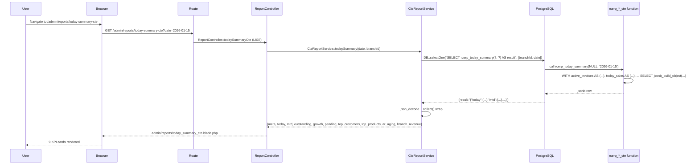
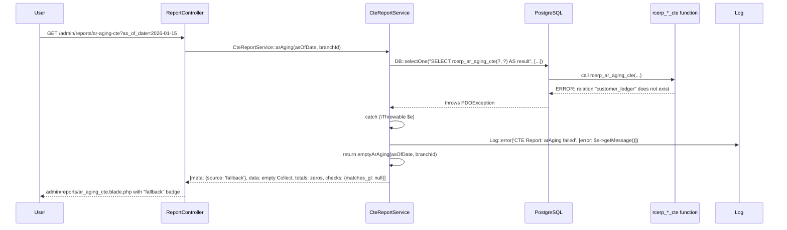
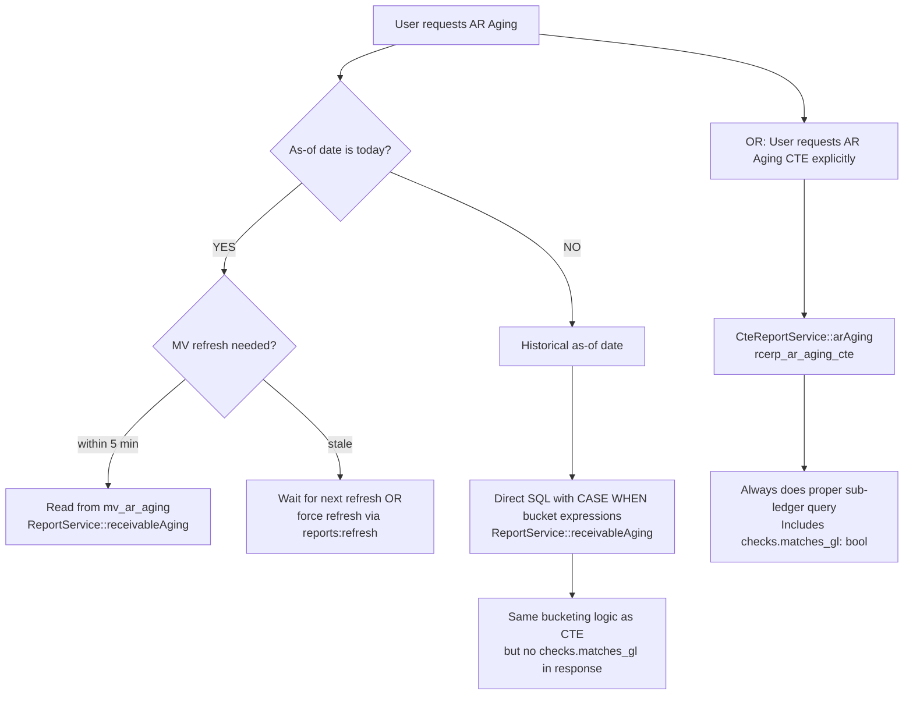

# CTE Reports

> **Module:** Reports / CTE-Based Complex Aggregations
> **Audience:** Engineers, accountants, AI assistants
> **Status:** Draft — pending review (3 HIGH + 3 MEDIUM gaps; see §14)
> **Last reviewed:** Phase 16 (Reporting & Exports)
> **Source of truth:** This file documents the 4 PostgreSQL CTE functions that power
> single-query complex aggregation reports, plus the `CteReportService` PHP layer that calls
> them. The crown jewels are the 4 `rcerp_*_cte` PL/pgSQL functions defined in migration
> `2025_01_21_000002_add_cte_complex_queries.php` (725L).

---

## 1. What is it?

The **CTE Reports** subsystem is a set of 4 PostgreSQL `STABLE` PL/pgSQL functions that
return `jsonb` documents pre-aggregated server-side, replacing multi-roundtrip PHP-side
computation. Each function is a single SQL round-trip from PHP via
`DB::selectOne("SELECT rcerp_*_cte(...) AS result", [...])`, and the PHP layer
(`App\Services\Reports\CteReportService`, 304L) decodes the JSON and assembles a structured
response with `meta` / `data` / `totals` / `checks` sub-keys.

The 4 CTE reports are:

| Report | Route | CTE function | Migration line range | SQL pattern |
|---|---|---|---|---|
| Today's Summary (CTE) | `admin.reports.todaySummaryCte` | `rcerp_today_summary(p_branch_id, p_date)` | `2025_01_21_000002:58-244` | 10+ CTEs returning single jsonb |
| AR Aging (CTE) | `admin.reports.arAgingCte` | `rcerp_ar_aging_cte(p_as_of_date, p_branch_id)` | `2025_01_21_000002:251-389` | Bucketing CTE + reconciliation CTE + detail CTE + per-branch CTE |
| General Ledger (CTE) | `admin.reports.generalLedgerCte` | `rcerp_general_ledger_cte(p_from_date, p_to_date, p_ledger_id, p_branch_id)` | `2025_01_21_000002:396-542` | Opening-balance CTE + window-function running-balance CTE |
| Gross Margin (CTE) | `admin.reports.grossMarginCte` | `rcerp_gross_margin_cte(p_from_date, p_to_date, p_branch_id)` | `2025_01_21_000002:548-694` | 6-stage pipeline CTE (active_invoices → invoice_items → item_cogs → invoice_margin → product_margin → grand_totals) |

All 4 functions are `LANGUAGE plpgsql STABLE` — STABLE volatility allows query plan caching
and is safe for read-only reports. The 4 routes are at `laravel/routes/web.php:405-408`,
served by `ReportController::todaySummaryCte/arAgingCte/generalLedgerCte/grossMarginCte` at
`laravel/app/Http/Controllers/Admin/ReportController.php:837-905`.

⚠️ **Catalog-orphan status:** None of the 4 CTE reports are listed in
`ReportsCatalog::categories()` — see `reports/reports-catalog.md` §14 G2. They are reachable
only by direct URL.

---

## 2. Why does it exist?

**Phase 1E (Task 32).** The migration docblock at `2025_01_21_000002:11-37` states:
*"These functions replace multiple separate SQL roundtrips or PHP-side computation with
single-function calls that return structured JSON."* Specific replacements:

1. **`rcerp_today_summary`** replaces `LegacyDashboardController::getRevenueKPIs` which made
   6+ separate SQL queries (today sales, MTD sales, MTD collection, outstanding, top customers,
   top products, AR aging buckets, branch revenue comparison). CteReportService.php L36-43
   documents this as "one DB call instead of 6+".
2. **`rcerp_ar_aging_cte`** replaces the dual-path in `ReportService::receivableAging`
   (`:843-907`) — MV for today + direct SQL for historical — with a single proper sub-ledger
   query that always does the right thing regardless of as-of-date. CteReportService.php L95-98
   documents the rationale.
3. **`rcerp_general_ledger_cte`** replaces the PHP-side
   `$running[$key] += $r->debit - $r->credit` loop in `ReportService::generalLedger`
   (`:1010-1016`) with a SQL `SUM() OVER (PARTITION BY ledger_id ORDER BY entry_date, entry_no,
   jl.id ROWS UNBOUNDED PRECEDING)` window function. The window function is computed entirely
   in SQL — single round-trip, no PHP array allocation.
4. **`rcerp_gross_margin_cte`** replaces the simplified `ReportController::grossMargin`
   (`:491-521`) single-`issue_cost` query with a 6-CTE pipeline joining invoice_items →
   sales_challan_items → stock_transactions for accurate per-product COGS. The simplified
   version uses `sales_challans.issue_cost` (a single column on the parent challan, not a
   per-item COGS) — inaccurate. CteReportService.php L207-218 documents the schema fixes.

The CTE approach exists because:

- **Single round-trip.** Each CTE function returns a single `jsonb` row. PHP does one
  `DB::selectOne` call. No N+1.
- **Server-side aggregation.** PostgreSQL's query planner can optimize CTEs (inlining since
  PG 12, materialization when needed). The window function for GL running balance is O(n log n)
  server-side vs O(n) PHP loop with array allocation.
- **Single source of truth.** The function body is version-controlled in a migration. The
  PHP layer just calls it. No drift between "what the SQL does" and "what PHP expects".
- **STABLE volatility.** Allows the planner to cache the query plan across calls within a
  transaction.

---

## 3. When is it used?

| Report | Trigger | Frequency |
|---|---|---|
| Today's Summary (CTE) | Dashboard KPI card refresh | Daily (replaces 6+ separate queries on every dashboard load) |
| AR Aging (CTE) | When reconciliation-grade sub-ledger aging is needed regardless of as-of-date | Monthly close + ad-hoc |
| General Ledger (CTE) | When running-balance computation on large GL datasets benefits from server-side window function | Monthly close + auditor request |
| Gross Margin (CTE) | When per-product margin accuracy matters (monthly close, ABC-style product profitability analysis) | Monthly close + product review |

Cite ReportController method map:
- `todaySummaryCte` at `:837-851` — reads `?date` + `?branch_id` filters.
- `arAgingCte` at `:856-868` — reads `?as_of_date` + `?branch_id`.
- `generalLedgerCte` at `:873-888` — reads `?from_date`, `?to_date`, `?ledger_id`, `?branch_id`.
- `grossMarginCte` at `:893-905` — reads `?from_date`, `?to_date`, `?branch_id`.

---

## 4. Who uses it?

| Role | Reports typically accessed |
|---|---|
| Super-admin / Admin | All 4 CTE reports + can pass `branch_id=null` for company-wide view |
| Accountant | All 4 — Today Summary for daily ops, AR Aging + GL CTE for monthly close, Gross Margin for product review |
| Manager (branch) | Today Summary, Gross Margin (RLS scopes to own branch) |
| Auditor | AR Aging (CTE) for reconciliation-grade aging; General Ledger (CTE) for window-function running balance |
| API consumer | None — the 4 CTE reports are web-only (no API v1 endpoints; see `routes/api.php`) |

⚠️ **Gap G1 (CRITICAL, cross-references `reports/reports-catalog.md` G1):** The 4 CTE routes
at `routes/web.php:405-408` are inside the `admin/reports` prefix group which has **no
`role:` middleware**. Any authenticated user can hit them.

> ✅ RESOLVED in commit bce8389 — Added `role:accountant,manager,admin` middleware to the `admin/reports` prefix group at `routes/web.php:359`, which transitively gates all 4 CTE routes (todaySummaryCte, arAgingCte, generalLedgerCte, grossMarginCte). Sub-problem A (Session 1, Security/RLS cluster).

---

## 5. Related modules

- **Accounting** — `general_ledger_cte` reads `journal_entries` + `journal_lines` + `ledgers`;
  `today_summary_cte` reads `journal_lines` for AR control account balance.
- **Finance** — `ar_aging_cte` reads `customer_ledger` (sub-ledger) + reconciles to GL AR
  control account.
- **Sales** — `gross_margin_cte` reads `sales_invoices` + `sales_invoice_items` +
  `sales_challans` + `sales_challan_items`.
- **Inventory** — `gross_margin_cte` joins `stock_transactions` (reference_type='sales_challan')
  for per-product COGS as `SUM(ABS(st.qty) * st.rate)`.

Cross-link to:
- `accounting/subledger-reconciliation.md` (Phase 6/7) — AR aging CTE reconciliation check.
- `accounting/running-balance.md` (Phase 6) — SQL window function vs PHP loop (G10).
- `inventory/stock-ledger.md` (Phase 8) — `stock_transactions` SSOT consumed by gross_margin_cte.
- `sales/sales-invoice.md` + `sales/sales-challan.md` (Phase 10) — read by gross_margin_cte.
- `reports/reports-catalog.md` (Phase 16 sibling) — catalog-orphan status (G2).
- `reports/materialized-views.md` (Phase 16 sibling) — MV-vs-CTE policy on AR aging (G8).

---

## 6. Business rules

### 6.1 Pattern: CTE function returns jsonb, PHP decodes once

**BR-CTE-1:** All 4 functions follow the same contract:
- Signature: `FUNCTION rcerp_*_cte(p_param1 type DEFAULT ..., p_param2 type DEFAULT ...) RETURNS jsonb`
- Body: `DECLARE v_result jsonb; BEGIN ... SELECT jsonb_build_object(...) INTO v_result; RETURN v_result; END;`
- Language: `LANGUAGE plpgsql STABLE`
- PHP call: `DB::selectOne("SELECT rcerp_*_cte(?, ?) AS result", [...])` — never `DB::select`
  (returns array; we want single row).

### 6.2 Fallback contract

**BR-CTE-2:** On any `Throwable`, `CteReportService` catches, logs via
`Log::error('CTE Report: <method> failed', [...])`, and returns an `empty<Method>()` structure
(4 private fallback methods at `CteReportService.php:265-303`). The user sees a
`meta.source = 'fallback'` badge instead of `'cte_function'` / `'cte_window_function'`. The
dashboard never crashes — it shows zeros with a "fallback" indicator.

### 6.3 Single round-trip

**BR-CTE-3:** Every CTE report issues exactly one `DB::selectOne` call. No N+1, no follow-up
queries. If the function returns NULL (e.g. table empty), PHP guards at
`CteReportService.php:59-61`: `if (!$result || !$result->result) { return $this->emptyTodaySummary(...); }`.

### 6.4 Sub-collections as Laravel Collections

**BR-CTE-4:** All returned `data` / `overdue_invoices` / `aging_by_branch` / `ledger_summary`
/ `invoice_margin` / `product_margin` arrays are wrapped in `collect($data[...] ?? [])` for
blade ergonomics. Empty arrays (when no rows match) are guaranteed by `COALESCE((SELECT
jsonb_agg(...) FROM ...), '[]'::jsonb)` in the SQL.

### 6.5 Meta block contract

**BR-CTE-5:** Every response includes a `meta` block with at minimum:
- `meta.title` — human-readable report name.
- `meta.source` — `'cte_function'` (success) / `'cte_window_function'` (GL success) / `'fallback'` (failure).
- Date / `branch_id` / `ledger_id` as applicable.

### 6.6 Reconciliation check contract

**BR-CTE-6:** The AR aging CTE includes a `checks.matches_gl: bool` field comparing sub-ledger
total (`SUM(customer_balances.total_receivable)`) to GL AR control account balance
(`gl_ar_control.gl_balance`). This is the same reconciliation documented in
`accounting/subledger-reconciliation.md` §2 — but computed in SQL rather than PHP.

### 6.7 NULL branch_id = all branches

**BR-CTE-7:** All 4 functions accept `p_branch_id integer DEFAULT NULL` — NULL means aggregate
across all branches (admin view). Non-admin users should never pass NULL: RLS policies apply at
query time and scope the result to the caller's branch. The function itself has no RLS
awareness — it's just SQL.

### 6.8 STABLE function + RLS interaction

**BR-CTE-8:** The function is declared `STABLE`, but RLS policies apply at query time, so the
same function call returns different rows for admin vs non-admin users. This is correct
behaviour — STABLE means "no side effects within a single transaction", not "same result for
all callers". The function reads rows visible to the current user.

---

## 7. Technical implementation

### 7.1 Function signature pattern

All 4 functions follow this pattern:

```sql
CREATE OR REPLACE FUNCTION rcerp_<name>(
    p_param1 type DEFAULT NULL,
    p_param2 type DEFAULT CURRENT_DATE,
    ...
) RETURNS jsonb AS $$
DECLARE
    v_result jsonb;
BEGIN
    WITH cte1 AS (...), cte2 AS (...), ... AS (...)
    SELECT jsonb_build_object(
        'meta', jsonb_build_object(...),
        'data', COALESCE((SELECT jsonb_agg(row_to_json(t)) FROM <final_cte> t), '[]'::jsonb),
        'totals', (SELECT jsonb_build_object(...) FROM <totals_cte>),
        'checks', (SELECT jsonb_build_object(...) FROM <check_cte>)
    ) INTO v_result;
    RETURN v_result;
END;
$$ LANGUAGE plpgsql STABLE;
```

### 7.2 Final assembly pattern (gross_margin example)

Migration `2025_01_21_000002:672-689`:

```sql
SELECT jsonb_build_object(
    'meta', jsonb_build_object(
        'from_date', p_from_date,
        'to_date', p_to_date,
        'branch_id', p_branch_id,
        'generated_at', NOW(),
        'source', 'cte_function'
    ),
    'invoice_margin', COALESCE(
        (SELECT jsonb_agg(row_to_json(im)::jsonb ORDER BY im.invoice_date DESC, im.invoice_code)
         FROM invoice_margin im),
        '[]'::jsonb
    ),
    'product_margin', COALESCE(
        (SELECT jsonb_agg(row_to_json(pm)::jsonb ORDER BY pm.gross_profit DESC)
         FROM product_margin pm),
        '[]'::jsonb
    ),
    'totals', (SELECT row_to_json(grand_totals) FROM grand_totals)
) INTO v_result;
```

### 7.3 Window function pattern (GL running balance)

Migration `2025_01_21_000002:443-449`:

```sql
COALESCE(o.opening_balance, 0) +
    SUM(jl.debit - jl.credit) OVER (
        PARTITION BY jl.ledger_id
        ORDER BY je.entry_date, je.entry_no, jl.id
        ROWS UNBOUNDED PRECEDING
    ) AS running_balance
```

This is the key CTE innovation: a running balance computed entirely in SQL via the `SUM()
OVER (PARTITION BY ... ORDER BY ... ROWS UNBOUNDED PRECEDING)` window function. Replaces the
PHP loop in `ReportService::generalLedger:1010-1016`:

```php
// Old PHP loop (ReportService::generalLedger)
foreach ($rows as $r) {
    $key = $r->ledger_id;
    if (!isset($running[$key])) {
        $running[$key] = $r->opening_balance ?? 0;
    }
    $running[$key] += $r->debit - $r->credit;
    $r->running_balance = $running[$key];
}
```

The window function is O(n log n) server-side; the PHP loop is O(n) but allocates a `$running`
array and iterates row-by-row in PHP (slower for large datasets due to PHP interpreter
overhead).

### 7.4 Bucketing pattern (AR aging)

Migration `2025_01_21_000002:269-277`:

```sql
SUM(CASE WHEN (p_as_of_date - cl.transaction_date) <= 30 THEN (cl.debit - cl.credit) ELSE 0 END) AS bucket_0_30,
SUM(CASE WHEN (p_as_of_date - cl.transaction_date) BETWEEN 31 AND 60 THEN (cl.debit - cl.credit) ELSE 0 END) AS bucket_31_60,
SUM(CASE WHEN (p_as_of_date - cl.transaction_date) BETWEEN 61 AND 90 THEN (cl.debit - cl.credit) ELSE 0 END) AS bucket_61_90,
SUM(CASE WHEN (p_as_of_date - cl.transaction_date) > 90 THEN (cl.debit - cl.credit) ELSE 0 END) AS bucket_90_plus
```

4 age buckets (0-30 / 31-60 / 61-90 / 90+). The `HAVING SUM(cl.debit - cl.credit) > 0.005`
clause (migration L286) excludes zero-balance customers (the 0.005 epsilon handles floating-
point noise).

### 7.5 CteReportService robustness pattern

All 4 PHP methods follow this pattern (`CteReportService.php:49-90` for `todaySummary`):

```php
public function todaySummary(?Carbon $date = null, ?int $branchId = null): array
{
    $date = $date ?? now();

    try {
        $result = DB::selectOne(
            "SELECT rcerp_today_summary(?, ?) AS result",
            [$branchId, $date->format('Y-m-d')]
        );

        if (!$result || !$result->result) {
            return $this->emptyTodaySummary($date, $branchId);
        }

        $data = json_decode($result->result, true);

        return [
            'meta' => [
                'title' => "Today's Summary — {$date->format('M j, Y')}",
                'source' => 'cte_function',
                'date' => $date->format('Y-m-d'),
                'branch_id' => $branchId,
            ],
            'today' => $data['today'] ?? [],
            'mtd' => $data['mtd'] ?? [],
            'outstanding' => $data['outstanding'] ?? [],
            'growth' => $data['growth'] ?? [],
            'pending' => $data['pending'] ?? [],
            'top_customers' => collect($data['top_customers'] ?? []),
            'top_products' => collect($data['top_products'] ?? []),
            'ar_aging' => $data['ar_aging'] ?? [],
            'branch_revenue' => collect($data['branch_revenue'] ?? []),
        ];
    } catch (\Throwable $e) {
        Log::error('CTE Report: todaySummary failed', [
            'date' => $date->format('Y-m-d'),
            'branch_id' => $branchId,
            'error' => $e->getMessage(),
        ]);
        return $this->emptyTodaySummary($date, $branchId);
    }
}
```

Key elements:
1. `DB::selectOne` — single round-trip.
2. `if (!$result || !$result->result)` — NULL guard for empty tables.
3. `json_decode($result->result, true)` — associative array.
4. `collect($data[...] ?? [])` — wrap sub-collections in Laravel Collections.
5. `catch (\Throwable $e)` — log + return empty fallback.
6. `meta.source = 'cte_function'` on success / `'fallback'` on failure.

### 7.6 Convenience views

Migration `2025_01_21_000002:701-710`:

```sql
CREATE OR REPLACE VIEW v_today_summary AS
SELECT rcerp_today_summary(NULL, CURRENT_DATE) AS summary_data;

CREATE OR REPLACE VIEW v_ar_aging_today AS
SELECT rcerp_ar_aging_cte(CURRENT_DATE, NULL) AS aging_data;
```

These views exist for direct `psql` access — a DBA can `SELECT * FROM v_today_summary;` to
smoke-test the function without PHP. Not consumed by the application.

---

## 8. Important database tables

Each CTE function reads from a specific set of tables:

### `rcerp_today_summary(p_branch_id, p_date)`
- `sales_invoices` (base CTE `active_invoices` at L68-75 — filters `is_reversed=false`, `status NOT IN ('cancelled','reversed')`, `deleted_at IS NULL`)
- `customer_payments` (L98-106 — note: no `deleted_at` column on customer_payments, only `is_reversed` filters reversed payments; comment at L103-104 calls this out)
- `sales_challans` (pending_challan count)
- `godowns` (pending_godown count — note: "godown" is the local term for a delivery preparation stage)
- `customers`, `products`, `branches`
- `journal_lines` ⨝ `journal_entries` ⨝ `ledgers` (for AR control account balance + AR aging buckets)

### `rcerp_ar_aging_cte(p_as_of_date, p_branch_id)`
- `customer_ledger` (sub-ledger — `customer_balances` CTE at L261-286)
- `customers`, `branches`
- `journal_lines` ⨝ `journal_entries` ⨝ `ledgers` (`gl_ar_control` CTE at L289-298 — single-row GL AR control account balance where `ledger_nature='ar'`)
- `sales_invoices` (for `overdue_invoices` detail CTE)

### `rcerp_general_ledger_cte(p_from_date, p_to_date, p_ledger_id, p_branch_id)`
- `journal_lines` ⨝ `journal_entries` (period_activity CTE at L422-…)
- `ledgers` (for account names + ledger_nature)
- `branches` (for branch_name in JOIN)
- `opening` CTE (L408-419) — pre-period `SUM(jl.debit - jl.credit)` per ledger

### `rcerp_gross_margin_cte(p_from_date, p_to_date, p_branch_id)`
- `sales_invoices` (active_invoices CTE at L559-575)
- `sales_invoice_items` (invoice_items CTE at L578-595)
- `sales_challan_items` ⨝ `sales_challans` (item_cogs CTE at L603-616 — joins via
  `stock_transactions` WHERE `reference_type='sales_challan'` for per-product COGS as
  `SUM(ABS(st.qty) * st.rate)`)
- `stock_transactions` (the SSOT — see `inventory/stock-ledger.md`)
- `products`

⚠️ **Schema fixes documented in migration L597-602:**
- `sales_challan_items` has `sales_challan_id` NOT `challan_id`.
- `sales_invoice_id` lives on `sales_challans` NOT `sales_challan_items`.
- `stock_transactions` uses `qty` NOT `qty_change` and `rate` NOT `avg_cost`.
- `sales_challans` has NO `deleted_at` column.

If any of these revert, the CTE breaks.

---

## 9. Related services

- **`App\Services\Reports\CteReportService`** (`laravel/app/Services/Reports/CteReportService.php`, 304L) — the only consumer of the 4 functions. 4 public methods + 4 private fallback methods.
- **`App\Services\Reports\ReportService`** — sibling service with the non-CTE duplicates:
  - `::receivableAging` (`:843-907`) — duplicates `rcerp_ar_aging_cte` (G8).
  - `::generalLedger` (`:979-1035`) — duplicates `rcerp_general_ledger_cte` (G10).
- **`App\Http\Controllers\Admin\ReportController`** — sibling controller with non-CTE duplicate:
  - `::grossMargin` (`:491-521`) — duplicates `rcerp_gross_margin_cte` (G9).
- **`App\Http\Controllers\LegacyDashboardController`** (`:502L`) — dead code (see
  `reports/dashboards.md` §14 G7) whose `getRevenueKPIs` method was the pre-CTE
  implementation of `rcerp_today_summary`.

---

## 10. Related models

None directly. `CteReportService` uses `DB::selectOne` exclusively — no Eloquent. The CTE
functions read raw tables. The only model interaction is in `ReportController::todaySummaryCte`
which passes `Branch::active()->pluck('id', 'id')` to the blade for a branch filter dropdown.

---

## 11. Important workflows

### 11.1 CTE report happy path (sequenceDiagram)



### 11.2 CTE report error path (sequenceDiagram)



### 11.3 AR Aging decision tree (flowchart)



The flowchart documents the **policy gap (G8)**: there's no documented rule for when to use
which path. The non-CTE `ReportService::receivableAging` is the catalog-listed route
(`admin.reports.receivableAging`); the CTE version (`admin.reports.arAgingCte`) is an orphan.
A user has to know the CTE URL to get the reconciliation-grade version.

---

## 12. Known edge cases

1. **CTE-vs-non-CTE duplication (G8, G9, G10):** 3 of 4 CTE reports duplicate non-CTE routes.
   No automated test verifies numbers match. See §14.
2. **`rcerp_today_summary` customer_payments has no `deleted_at`** (migration L103-104 comment):
   only `is_reversed` filters reversed payments; soft-deletes not respected because the column
   doesn't exist. If a soft-deleted customer_payment exists in the DB, it would be counted in
   MTD collection. (No current code path soft-deletes customer_payments, but the gap exists.)
3. **`rcerp_gross_margin_cte` schema fixes** (migration L597-602): `sales_challan_items` has
   `sales_challan_id` not `challan_id`; `sales_invoice_id` lives on `sales_challans` not
   `sales_challan_items`; `stock_transactions` uses `qty` not `qty_change` and `rate` not
   `avg_cost`; `sales_challans` has no `deleted_at` column. If any of these revert, the CTE
   breaks with a column-not-found error → caught by the Throwable handler → fallback response.
4. **NULL `branch_id` = all branches:** All 4 functions accept `p_branch_id integer DEFAULT
   NULL` — NULL means aggregate across all branches (admin view). Non-admin users should never
   pass NULL (RLS scopes the query, but the CTE itself has no RLS awareness). The current
   `ReportController` methods pass `branch_id` from `$request->input('branch_id')` — a
   salesman could pass `?branch_id=` (empty) and get NULL → company-wide view. Mitigated by
   RLS but not by the controller.
5. **STABLE function + RLS:** The function is `STABLE` but RLS policies apply at query time,
   so the same function call returns different rows for admin vs non-admin users. Correct
   behaviour but worth documenting.
6. **`jsonb_agg` ordering:** The final `jsonb_agg(row_to_json(...) ORDER BY ...)` clause
   controls row order in the returned JSON. PHP-side `collect()` preserves this order; blade
   `@foreach` iterates in order. If the ORDER BY is removed, the order is non-deterministic.
7. **Empty result:** `COALESCE((SELECT jsonb_agg(...) FROM ...), '[]'::jsonb)` ensures empty
   array (not NULL) when no rows — PHP `collect([] ?? [])` produces empty Collection. The
   blade renders "No data" gracefully.
8. **Today Summary pending counts include draft godowns/challans:** May overstate if many
   stale drafts exist. The `pending_godown` CTE counts `godowns` rows with `status='draft'`;
   the `pending_challan` CTE counts `sales_challans` rows with `status='draft'`. A backlog of
   abandoned drafts inflates the "pending" KPI.
9. **`rcerp_ar_aging_cte` reconciliation check is per-branch:** The `gl_ar_control` CTE
   filters by `p_branch_id` if non-NULL. So `checks.matches_gl` is a per-branch reconciliation,
   not a company-wide one. If `p_branch_id=NULL`, the check is company-wide.
10. **`rcerp_general_ledger_cte` opening balance is per-ledger:** The `opening` CTE groups by
    `ledger_id` — if `p_ledger_id=NULL`, you get opening balances for all ledgers. The
    `period_activity` CTE joins `opening` to compute running balance per ledger.
11. **`rcerp_gross_margin_cte` excludes reversed invoices:** The `active_invoices` CTE filters
    `is_reversed=false` AND `status NOT IN ('cancelled','reversed')` AND `deleted_at IS NULL`.
    Reversed invoices are excluded from margin calculation — correct behaviour.
12. **`rcerp_gross_margin_cte` COGS uses `ABS(st.qty)`:** Stock-out transactions have negative
    `qty`. The CTE uses `ABS(st.qty) * st.rate` to compute COGS as a positive number. If a
    stock_transaction has `qty=0`, COGS for that row is 0 — correct.

---

## 13. Future improvements

1. **Deprecate non-CTE duplicates (G8, G9, G10)** — collapse to one route per report with
   auto-selection (MV for today's aging, CTE for historical; CTE for gross margin; CTE for GL).
2. **Add tests comparing CTE vs non-CTE output** on identical inputs to verify equivalence
   before deprecation.
3. **Add `EXPLAIN ANALYZE` benchmarking** to verify CTE outperforms non-CTE on production-
   sized data. The window-function GL CTE should be faster than the PHP loop on multi-year
   ranges.
4. **Add `rcerp_pay_aging_cte`** for symmetric AP aging (currently no CTE version — only
   `ReportService::payableAging` exists). The non-CTE `payableAging` mirrors `receivableAging`
   (MV for today + direct SQL for historical) but there's no reconciliation-grade CTE.
5. **Add `rcerp_branch_intercompany_cte`** for SQL-side zero-sum check (currently
   `ReportService::branchIntercompany` reads from `mv_branch_intercompany` MV with no
   reconciliation check).
6. **Add `rcerp_trial_balance_cte`** for SQL-side Dr=Cr verification + sub-ledger
   reconciliation in one call. The current `ReportService::trialBalance` does 4 separate SQL
   queries + a PHP-side map.
7. **Add `rcerp_cash_flow_cte`** to replace the 6-query `ReportService::cashFlow`.
8. **Add `rcerp_balance_sheet_cte`** to replace `ReportService::balanceSheet`.
9. **Add `rcerp_profit_and_loss_cte`** to replace the 4-query `ReportService::profitAndLoss`.
10. **Migrate `rcerp_*` functions to `SECURITY DEFINER`** with explicit `SET search_path` if
    RLS becomes a bottleneck (currently `SECURITY INVOKER` — runs with caller's privileges).
11. **Add caching layer (Redis)** for `rcerp_today_summary` results — currently every dashboard
    page load calls the function fresh. A 30-second Redis cache would reduce DB load on
    dashboard traffic spikes.
12. **Add `?format=csv` to CTE routes** — currently the 4 CTE reports have no CSV export.
    Add a `CteReportService::exportCsv()` that wraps the JSON response in a CSV writer.
13. **Surface `meta.source` badge in all 4 blade views** — currently only some show it. The
    badge tells the user whether they're seeing CTE-computed or fallback data.
14. **Add the 4 CTE reports to `ReportsCatalog::categories()`** (G2 cross-reference) — add a
    new `phase_1e` category or fold them into the existing finance/sales categories.
15. **Add `rcerp_today_summary` partitioning awareness** — the function reads from
    `sales_invoices` which is partitioned by month (see `database/partitioning.md`). The
    function should be tested against partitioned tables to verify the planner prunes
    partitions correctly.

---

## 14. Gap catalogue

| ID | Severity | Evidence | Impact | Recommended fix |
|---|---|---|---|---|
| **G1** | **CRITICAL** (cross-ref `reports/reports-catalog.md` G1) | `routes/web.php:405-408` — 4 CTE routes inside `admin/reports` prefix group with NO `role:` middleware. | Any authenticated user can hit the 4 CTE reports. Salesmen can see AR aging (full customer balances), GL (full ledger activity), gross margin (per-product profitability). | Add `->middleware('role:accountant,manager,admin')` to the prefix group at `:359`. |
| **G2** | **HIGH** (cross-ref `reports/reports-catalog.md` G2) | The 4 CTE reports are NOT in `ReportsCatalog::categories()`. Users cannot discover them from the hub. | Phase 1E investment is hidden. Reachable only by direct URL. | Add the 4 CTE reports to the catalog with a `phase_1e` category or fold into existing categories. |
| **G4** | **HIGH** (cross-ref `reports/reports-catalog.md` G4) | `database/sql/07_views_triggers_constraints.sql` has ZERO matches for `rcerp_`. The 4 CTE functions live ONLY in migration `2025_01_21_000002`. | The canonical DDL file is stale. DBAs doing fresh provisioning from the SQL file get a database missing the 4 CTE functions. | Append CTE function DDL to `07_views_triggers_constraints.sql` or add a header comment pointing to the migration. |
| **G7** | **HIGH** (cross-ref `reports/reports-catalog.md` G7) | `tests/` grep for `CteReport` returned ZERO file matches. | 4 CTE functions + 4 PHP methods = 8 untested public code paths touching financial data. AR aging reconciliation check (`matches_gl`) is untested. | Add `tests/Feature/Reports/CteReportServiceTest.php` covering: (a) each method returns expected JSON shape, (b) `meta.source = 'cte_function'` on success, (c) `meta.source = 'fallback'` when function throws, (d) AR aging `checks.matches_gl` is true on seeded data, (e) GL running balance matches manual computation. |
| **G8** | **HIGH** (cross-ref `reports/reports-catalog.md` G8) | `ReportService::receivableAging` (`:843-907`) and `CteReportService::arAging` (`:110-144`) both compute AR aging. Two routes, two blade views. | Two "Receivable Aging" reports in the URL space. No automated test verifies numbers match. Maintenance burden: bucketing logic must be applied twice. | Document deprecation policy: "The CTE version is canonical. The non-CTE `receivableAging` is kept for the MV-accelerated today's-aging path. Future: collapse to one route with MV-or-CTE auto-selection." |
| **G9** | **HIGH** (cross-ref `reports/reports-catalog.md` G9) | `ReportController::grossMargin` (`:491-521`) — simplified non-CTE uses single `sales_challans.issue_cost` column (inaccurate). `CteReportService::grossMargin` (`:224-259`) → `rcerp_gross_margin_cte` joins invoice_items → challan_items → stock_transactions for accurate per-product COGS. | The simplified version is inaccurate. Users don't know which to use. Numbers diverge silently. | Deprecate `admin.reports.grossMargin`. Replace `ReportController::grossMargin` body with a redirect to `admin.reports.grossMarginCte`. |
| **G10** | **HIGH** (cross-ref `reports/reports-catalog.md` G10) | `ReportService::generalLedger` (`:979-1035`) uses PHP-side running balance loop. `CteReportService::generalLedger` (`:166-204`) uses SQL window function. | Two implementations. No documented deprecation. | Same as G8/G9 — document deprecation policy + collapse to one route. |
| **G11** | **MEDIUM** | `customer_payments` has no `deleted_at` column — `rcerp_today_summary` (migration L103-104) only filters `is_reversed`. | If a soft-deleted customer_payment exists (none currently do, but the schema allows it), it would be counted in MTD collection. | Add `deleted_at IS NULL` filter to the `mtd_collection` CTE in `rcerp_today_summary`. Add a migration to add `deleted_at` to `customer_payments` if soft-deletes are intended. |
| **G12** | **MEDIUM** | NULL `branch_id` = all branches in all 4 CTE functions. `ReportController` passes `branch_id` from `$request->input('branch_id')` — a non-admin user could pass `?branch_id=` (empty) and get NULL. | RLS scopes the query, so a non-admin would still only see their branch's rows. But the function call itself doesn't enforce this — defense-in-depth gap. | In `ReportController::todaySummaryCte/arAgingCte/generalLedgerCte/grossMarginCte`, default `branch_id` to `session('branch_id')` if not admin, instead of accepting NULL from the request. |
| **G13** | **MEDIUM** | `rcerp_today_summary` `pending_godown` + `pending_challan` counts include draft-status rows. A backlog of abandoned drafts inflates the "pending" KPI. | Dashboard shows misleading "pending" counts. | Add a `WHERE created_at > NOW() - INTERVAL '7 days'` filter to the pending CTEs to exclude stale drafts. Or add a separate `stale_drafts` count. |
| **G14** | **LOW** | `ReportsCatalog.php:9` docblock (cross-ref `reports/reports-catalog.md` G16) — "all 18 reports across 5 categories" doesn't mention Phase 1E CTE reports. | Stale docblock. | Update docblock to "Phase 5 + Phase 6 + Phase 1E" + actual count. |
| **G15** | **LOW** | No `?format=csv` on the 4 CTE routes. | Users who want CSV of CTE data have to use the non-CTE route (if it has CSV) or copy-paste from the HTML. | Add `CteReportService::exportCsv()` that wraps the JSON response in a CSV writer. Add `?export=csv` toggle to the 4 routes. |

**Severity tally:** 1 CRITICAL (G1) / 5 HIGH (G2, G4, G7, G8, G9, G10) / 3 MEDIUM (G11, G12, G13) / 2 LOW (G14, G15). 11 gaps total. (G1, G2, G4, G7, G8, G9, G10, G14 cross-reference `reports/reports-catalog.md` for the same findings.)

---

## 15. Cross-references

| Sibling AI_CONTEXT doc | Specific section to link | Why |
|---|---|---|
| `database/schema-overview.md` (Phase 3) | §8 SQL functions | CTE function DDL lives in migration, not in `07_*.sql` (G4). |
| `database/triggers-views-constraints.md` (Phase 3) | §4 CTE function listing | Should list the 4 `rcerp_*` functions + the 2 convenience views. |
| `accounting/subledger-reconciliation.md` (Phase 6/7) | §3 AR aging reconciliation check | `rcerp_ar_aging_cte` does the same reconciliation in SQL (BR-CTE-6). |
| `accounting/running-balance.md` (Phase 6) | §5 SQL window function vs PHP loop | `rcerp_general_ledger_cte` window function (G10). |
| `sales/sales-invoice.md` (Phase 10) | — | `rcerp_gross_margin_cte` reads `sales_invoices` + `sales_invoice_items`. |
| `sales/sales-challan.md` (Phase 10) | — | `rcerp_gross_margin_cte` joins `sales_challans` + `sales_challan_items`. |
| `inventory/stock-ledger.md` (Phase 8) | §2 stock_transactions SSOT | `rcerp_gross_margin_cte` joins `stock_transactions` for COGS. |
| `reports/reports-catalog.md` (Phase 16 sibling) | §7 + §14 G2 (catalog-orphan status) | The 4 CTE routes exist but are not in `ReportsCatalog::categories()`. |
| `reports/materialized-views.md` (Phase 16 sibling) | §6 MV-vs-CTE policy on AR aging | `mv_ar_aging` (today) vs `rcerp_ar_aging_cte` (any date) — G8. |
| `reports/dashboards.md` (Phase 16 sibling) | §7 UserPerformanceDashboardController | `rcerp_today_summary` replaces `LegacyDashboardController::getRevenueKPIs`. |

---

## 16. Verification commands

```bash
# List the 4 CTE routes + their middleware
php artisan route:list | grep cte

# Verify the 4 CTE functions exist in the database
psql -c "SELECT routine_name, routine_type FROM information_schema.routines WHERE routine_name LIKE 'rcerp_%';"
# Expected: 4 rows (rcerp_today_summary, rcerp_ar_aging_cte, rcerp_general_ledger_cte, rcerp_gross_margin_cte)

# Get the full function body (DDL inspection)
psql -c "SELECT pg_get_functiondef('rcerp_today_summary(integer, date)'::regprocedure);"

# Smoke test: call the function directly
psql -c "SELECT rcerp_today_summary(NULL, CURRENT_DATE);"
# Expected: single jsonb row

# Smoke test: use the convenience view
psql -c "SELECT * FROM v_today_summary;"

# EXPLAIN ANALYZE the GL CTE to verify the window function plan
psql -c "EXPLAIN ANALYZE SELECT rcerp_general_ledger_cte('2024-01-01', '2024-12-31', NULL, NULL);"

# Verify the 4 CTE routes have NO role middleware (G1)
grep -B1 -A2 "today-summary-cte\|ar-aging-cte\|general-ledger-cte\|gross-margin-cte" laravel/routes/web.php

# Verify no tests exist for CteReportService (G7)
ls laravel/tests/Feature/Reports/ 2>/dev/null || echo "Directory does not exist (G7 confirmed)"
grep -rn "CteReport" laravel/tests/ || echo "No CteReport tests (G7 confirmed)"

# Run the CTE reports via the web (manual smoke)
# 1. Visit /admin/reports/today-summary-cte
# 2. Visit /admin/reports/ar-aging-cte?as_of_date=2026-01-15
# 3. Visit /admin/reports/general-ledger-cte?from_date=2026-01-01&to_date=2026-01-31
# 4. Visit /admin/reports/gross-margin-cte?from_date=2026-01-01&to_date=2026-01-31
# Each should render with a "CTE Function" or "CTE Window Function" badge in the meta block.

# Force the fallback path (manual test of error handling)
# 1. Temporarily rename one of the source tables (e.g. RENAME customer_ledger TO customer_ledger_bak)
# 2. Visit /admin/reports/ar-aging-cte
# 3. The page should render with a "Fallback" badge, not a 500 error
# 4. Check storage/logs/laravel.log for "CTE Report: arAging failed"
# 5. Rename back: RENAME customer_ledger_bak TO customer_ledger
```

---

*End of `cte-reports.md`. For the 7 materialized views that complement the CTE functions
(especially `mv_ar_aging` for today's aging), see `reports/materialized-views.md`. For the
catalog that omits these 4 reports (Gap G2), see `reports/reports-catalog.md`. For the CSV
export pipeline that does NOT yet cover CTE routes (Gap G15), see `reports/csv-export.md`.*
