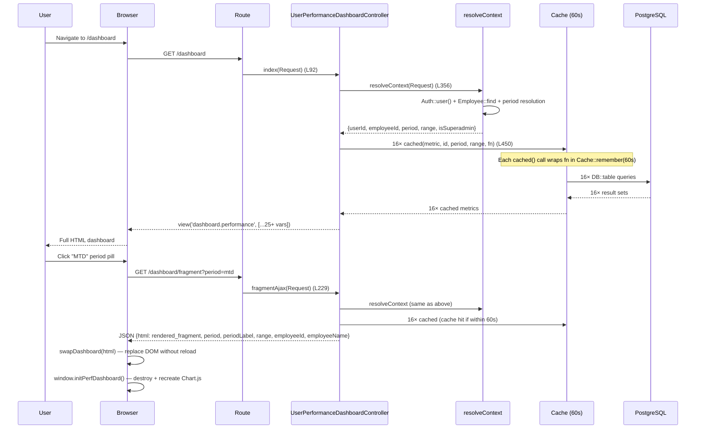
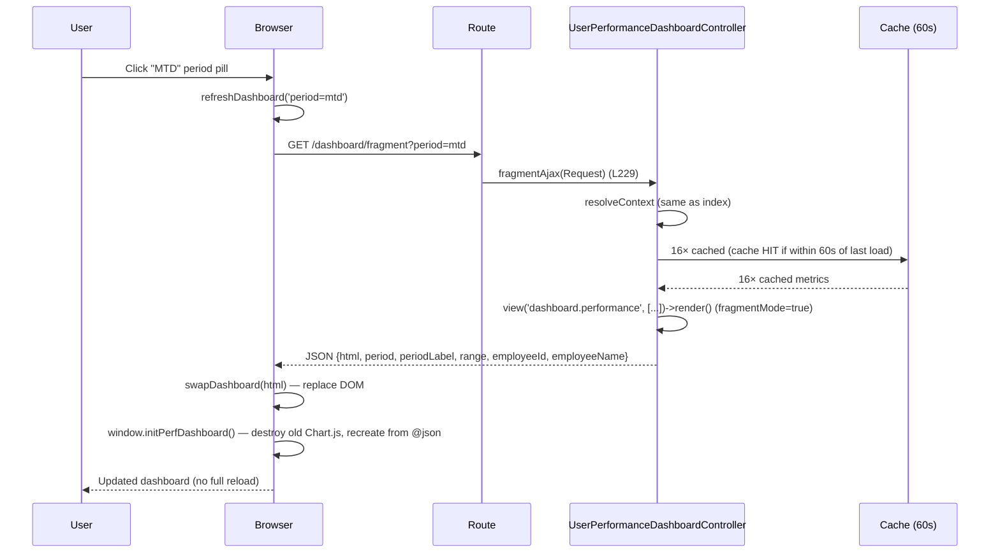
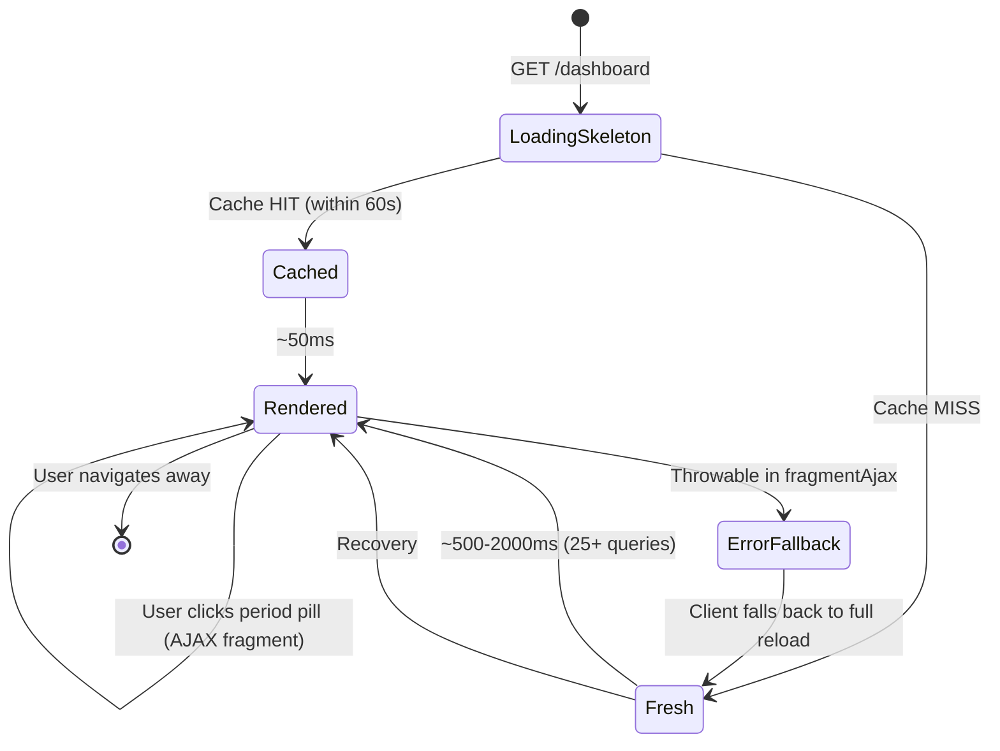
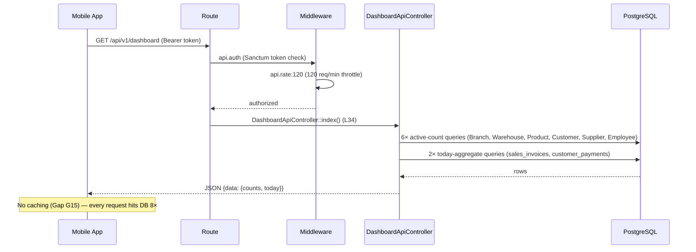

# Dashboards

> **Module:** Reports / Dashboards (Web + API)
> **Audience:** Engineers, branch managers, salesmen, API consumers, AI assistants
> **Status:** Draft — pending review (2 HIGH + 4 MEDIUM gaps; see §14)
> **Last reviewed:** Phase 16 (Reporting & Exports)
> **Source of truth:** This file documents the 3 dashboard tiers in RC_ERP_v2 —
> (1) the web user-performance dashboard (`UserPerformanceDashboardController`, 2246L), (2)
> the REST API dashboard (`DashboardApiController`, 167L), (3) the dead legacy dashboard
> (`LegacyDashboardController`, 502L — Gap G7) — plus the dead static demo asset
> `intelligent-sales-cockpit.html` (Gap G8).

---

## 1. What is it?

RC_ERP_v2 has **3 dashboard tiers** + **1 dead demo asset**:

### 1.1 Web user-performance dashboard (PRIMARY)

- **Controller:** `App\Http\Controllers\UserPerformanceDashboardController`
  (`laravel/app/Http/Controllers/UserPerformanceDashboardController.php`, 2246L — a god-class,
  see Gap G9).
- **Routes:** 3 routes at `routes/web.php:100-108`:
  - `GET /dashboard` → `index()` — renders full HTML dashboard.
  - `GET /dashboard/sales-trend` → `salesTrendAjax()` — JSON for chart refresh.
  - `GET /dashboard/fragment` → `fragmentAjax()` — JSON returning rendered HTML fragment
    for no-reload period/employee switching.
- **View:** `laravel/resources/views/dashboard/performance.blade.php` (4272L).
- **Class docblock (L1-83):** *"Per-user attribution dashboard. NO company-wide metrics
  anywhere. Every metric is attributed to a single user via `created_by`."*

### 1.2 REST API dashboard (for mobile apps + AI sidecars)

- **Controller:** `App\Http\Controllers\Api\V1\DashboardApiController`
  (`laravel/app/Http/Controllers/Api/V1/DashboardApiController.php`, 167L).
- **Routes:** 3 routes at `routes/api.php:114-120`, all behind `api.auth` (Bearer token) +
  `api.rate:120` (120 req/min):
  - `GET /api/v1/dashboard` → `index()` — summary counts + today's sales/collection.
  - `GET /api/v1/dashboard/sales-trend` → `salesTrend()` — last 7 days sales totals.
  - `GET /api/v1/dashboard/top-products` → `topProducts()` — top 10 products by revenue.
- **Class docblock (L16-25):** *"Lightweight summary endpoints for mobile apps and the AI
  sidecar."*

### 1.3 Legacy dashboard (DEAD CODE — Gap G7)

- **Controller:** `App\Http\Controllers\LegacyDashboardController`
  (`laravel/app/Http/Controllers/LegacyDashboardController.php`, 502L).
- **Routes:** NONE — `routes/web.php:6` imports the class but `:98` only mentions it in a
  comment. **No route maps to `LegacyDashboardController@index` or `salesTrendAjax`.**
- **Class docblock (L9-37):** *"SUPERSEDED — kept for reference only"*.
- **View reference:** `index()` at `:99` returns `view('dashboard.index', ...)` — but
  **there is no `dashboard/index.blade.php`**. The blade files are `index_legacy.blade.php`
  (634L) and `performance.blade.php` (4272L). Calling `LegacyDashboardController::index()`
  would throw `InvalidArgumentException: View [dashboard.index] not found.`

### 1.4 Dead static demo asset (Gap G8)

- **File:** `laravel/public/assets/dashboard/intelligent-sales-cockpit.html` (1700L).
- **Access:** Direct URL `/assets/dashboard/intelligent-sales-cockpit.html` — no auth gate
  because it's in `/public/`.
- **Content:** Hardcoded demo data — "Ayesha Rahman" (L239), "$185k" (L885), "1.84M" (L295),
  "Apex Engineering – Phase 2" (L883), "Industrial Pump 3000" (L930), "Only 14 units left"
  (L931). The `setDateRange()` function (L1080-1118) swaps hardcoded numbers
  (`revenueEl.textContent = '1.84' / '4.12' / '9.84'`). NO `fetch()` calls, NO Laravel route
  references, NO `@json` directives.
- **Same gap pattern as Phase 15's `public/assets/js/push.js`** (also a dead demo asset).

---

## 2. Why does it exist?

### 2.1 Web user-performance dashboard

Per the class docblock (`UserPerformanceDashboardController.php:23-26`):
> *"NO company-wide metrics anywhere. Every metric is attributed to a single user via
> `created_by`."*

The dashboard exists because the legacy ERP had a company-wide dashboard that was useless to
individual salesmen — they couldn't see their own performance. The Phase 0→6 incremental
buildout (class docblock L14-19) introduced a per-user attribution dashboard where every KPI,
chart, and table is scoped to the authenticated user (or, for super-admin, to a
`?employee_id=X` target). This supports the RC_ERP principle of "what gets measured gets
managed" — salesmen see their own numbers, managers see their team's numbers (via super-admin
impersonation), and the dashboard becomes a daily-checking habit.

### 2.2 REST API dashboard

Per the class docblock (`DashboardApiController.php:16-25`):
> *"Lightweight summary endpoints for mobile apps and the AI sidecar."*

The API dashboard exists because mobile apps and AI assistants need a structured JSON
endpoint, not HTML. The 3 endpoints provide the minimum viable dashboard data (counts + today
+ 7-day trend + top products) without the 25+ queries of the web dashboard. The 120 req/min
rate limit (the highest tier — see `routes/api.php:115-120`) reflects the read-heavy +
cacheable nature of dashboard traffic.

### 2.3 Legacy dashboard

Per the class docblock (`LegacyDashboardController.php:9-37`):
> *"SUPERSEDED — kept for reference only. The query patterns are reusable as templates."*

The legacy dashboard was the Phase 0 company-wide dashboard. It was superseded by the
per-user dashboard in Phase 6. The class was kept for "reference" but is dead code — no
route, broken view reference, and the `getRevenueKPIs` method it inspired has been replaced
by the `rcerp_today_summary` CTE function (see `reports/cte-reports.md`).

### 2.4 Intelligent Sales Cockpit HTML

Purpose unclear — appears to be a design mockup that was committed to `/public/` by mistake.
No Laravel route references it; no blade includes it; no controller renders it. The hardcoded
demo data suggests it was a sales-pitch artifact, not a real feature.

---

## 3. When is it used?

### 3.1 Web dashboard

- **Every authenticated page load** — the default landing route is `/dashboard`
  (`routes/web.php:100`).
- **AJAX period switch** — user clicks a period pill (today/mtd/qtd/last30/custom) →
  `refreshDashboard(qs)` JS function → `fetch('/dashboard/fragment?qs')` →
  `fragmentAjax()` returns rendered HTML fragment → `swapDashboard(html)` replaces the DOM
  without full reload.
- **AJAX chart refresh** — user clicks the sales-trend chart's refresh button →
  `fetch('/dashboard/sales-trend?days=N')` → `salesTrendAjax()` returns JSON → Chart.js
  updates.
- **Super-admin employee switch** — `?employee_id=X` query param → `resolveContext()` at
  `:356-424` resolves the target employee → all 16 metrics scoped to that employee.

### 3.2 API dashboard

- **Mobile app home screen** — polls `/api/v1/dashboard` on app open.
- **AI sidecar** — queries `/api/v1/dashboard/sales-trend` + `/top-products` for context.
- **External BI tools** — read-only consumers of the summary data.

### 3.3 Refresh cycle (sequenceDiagram)



---

## 4. Who interacts with it?

| Actor | Dashboard | Access |
|---|---|---|
| Salesman | Web | `auth` middleware; sees own metrics only; `resolveRoleSections('salesman')` enables sales+collections+returns+commission+operational+accuracy sections |
| Warehouse Manager | Web | `auth`; sees own metrics + operational+stock_discipline+accuracy sections (resolveRoleSections L2089-2148) |
| Dispatcher | Web | `auth`; sees operational+accuracy sections |
| Accountant | Web | `auth`; sees collections+returns+operational+accuracy sections |
| Manager / Admin / Super-admin | Web | `auth`; sees ALL sections + approval_workload; super-admin can `?employee_id=X` |
| HR / unknown role | Web | `auth`; resolveRoleSections default is permissive — turns on sales+collections+operational+accuracy (Gap G10) |
| Mobile app | API | `api.auth` (Bearer token) + `api.rate:120` |
| AI sidecar | API | Same |
| External BI tool | API | Same |

⚠️ **Gap G1 (cross-ref `reports/reports-catalog.md` G1):** The web dashboard routes have only
`auth` middleware — no `role:` gate. Any authenticated user can hit `/dashboard`. The
role-section visibility is enforced in PHP via `resolveRoleSections()` (L2089-2148), not at
the route level.

⚠️ **Gap G10:** `resolveRoleSections` default for unknown roles (`'hr'`, `'other'`, default)
is permissive (L2140-2143): turns on sales+collections+operational+accuracy. Any new role
auto-gets dashboard access.

---

## 5. Related modules

- **Phase 0-6 user-performance-dashboard plan** (`docs/USER_PERFORMANCE_DASHBOARD_PLAN.md`).
- **Phase 13 REST API** — the API dashboard is part of the v1 REST surface.
- **Phase 15 notifications** — `getNotificationEngagement` widget reads `notifications` table.
- **Phase 16 reports** (this doc) — the dashboard is a sibling to the Reports Catalog.
- **Phase 16 materialized-views** — the dashboard does NOT read MVs (hits live tables for
  freshness); cross-link explains why.

---

## 6. Business rules

### 6.1 Per-user attribution

**BR-DASH-1:** Every activity metric MUST be scoped via `created_by = $userId`. Every
commission/portfolio metric MUST be scoped via `salesman_id = $employeeId`. Every damage-blame
metric MUST be scoped via `accountable_employee_id = $employeeId`. (Class docblock L72-76.)

This is the foundational rule — the dashboard is per-user, not company-wide. The
`resolveContext()` method at `:356-424` resolves the userId + employeeId from the auth user
(or from `?employee_id=X` if super-admin).

### 6.2 Super-admin employee switch

**BR-DASH-2:** Super-admin can switch employees via `?employee_id=X`. Non-admin
`?employee_id=X` is silently ignored (L367-375) — the authenticated user's own employee_id is
used. This prevents privilege escalation.

### 6.3 Role-section visibility

**BR-DASH-3:** Role → section visibility is mapped in `resolveRoleSections(role)` at
`:2089-2148`:

| Role | Sections enabled |
|---|---|
| salesman | sales + collections + returns + commission + operational + accuracy |
| warehouse_manager | operational + stock_discipline + accuracy |
| dispatcher | operational + accuracy |
| accountant | collections + returns + operational + accuracy |
| manager / admin / superadmin | ALL + approval_workload |
| hr / other / default | sales + collections + operational + accuracy (permissive — Gap G10) |

### 6.4 Cache TTL

**BR-DASH-4:** Every metric is wrapped in `Cache::remember("perf:user:{id}:{metric}:{period}:{rangeHash}", 60, fn)`
— 60-second TTL. Short enough for fresh data, long enough to amortize the 25+ queries per
page load.

### 6.5 Slow-query threshold

**BR-DASH-5:** Every metric is timed via `timed(label, fn)` at `:474-504`. If a metric takes
>200ms, `Log::build(['driver'=>'single','path'=>storage_path('logs/perf.log'),'level'=>'warning'])->warning(...)`
logs to `storage/logs/perf.log`. The telemetry never throws (nested try/catch at L499-501).

### 6.6 Period resolution

**BR-DASH-6:** Periods are resolved via `resolvePeriod(Request)` at `:561-601`. Supported
values: `today`, `mtd`, `qtd`, `last30`, `custom` (requires `?from` + `?to`). The `ytd`
period was deliberately removed (L556-559 — graceful degradation to MTD).

### 6.7 Collection rate

**BR-DASH-7:** Collection rate = `collection / sales × 100` for the same period + same user
(`:1044-1054`). The `customer_payments.transaction_type='receive'` filter is conditionally
applied based on the G12 schema-gap check (`checkCustomerPaymentsTransactionType()` at
`:628-641` — checks if the `transaction_type` column exists).

### 6.8 Overdue definition

**BR-DASH-8:** Overdue = `invoice_date < now() - 30 days` (assumed 30-day term — see G3 in
the plan doc). The 30-day term is hardcoded — not configurable.

### 6.9 Error fallback

**BR-DASH-9:** Every metric method catches `\Throwable` + returns a zeroed default + logs via
`Log::warning('Phase N getX failed: ' . $e->getMessage())`. The dashboard never crashes — it
shows zeros with a warning in the log. (`UserPerformanceDashboardController` does this
correctly; `LegacyDashboardController` does NOT log — Gap G16.)

### 6.10 Fragment AJAX protocol

**BR-DASH-10:** `fragmentAjax()` returns JSON `{html, period, periodLabel, range,
employeeId, employeeName}` on success, or `{error: 'server-error'}` on Throwable (L331-338).
The client checks for `error` and falls back to a full reload.

---

## 7. Technical implementation

### 7.1 Crown jewel: `index()` method — verbatim

`UserPerformanceDashboardController.php:92-210`:

```php
public function index(Request $request)
{
    $ctx = $this->resolveContext($request);

    if ($ctx['scaffoldingOnly'] ?? false) {
        return view('dashboard.performance', $ctx['viewData'] + ['scaffoldingOnly' => true]);
    }

    [$period, $periodLabel, $range] = $ctx['period'];

    $userId = $ctx['userId'];
    $employeeId = $ctx['employeeId'];
    $isSuperadmin = $ctx['isSuperadmin'];

    // 16 cached metric calls
    $salesKPIs = $this->cached('sales_kpis', $userId, $period, $range, fn() => $this->getSalesKPIs($userId, $range));
    $salesTrend = $this->cached('sales_trend', $userId, $period, $range, fn() => $this->getSalesTrend($userId, $range));
    $salesByProductGroup = $this->cached('sales_by_product_group', $userId, $period, $range, fn() => $this->getSalesByProductGroup($userId, $range));
    $topCustomers = $this->cached('top_customers', $userId, $period, $range, fn() => $this->getTopCustomers($userId, $range));
    $customerAcquisition = $this->cached('customer_acquisition', $userId, $period, $range, fn() => $this->getCustomerAcquisition($userId, $range));
    $collectionKPIs = $this->cached('collection_kpis', $userId, $period, $range, fn() => $this->getCollectionKPIs($userId, $range, $ctx['hasTxnType']));
    $receivableAging = $this->cached('receivable_aging', $userId, $period, $range, fn() => $this->getReceivableAging($userId));
    $returnKPIs = $this->cached('return_kpis', $userId, $period, $range, fn() => $this->getReturnKPIs($userId, $range));
    $paymentModeMix = $this->cached('payment_mode_mix', $userId, $period, $range, fn() => $this->getPaymentModeMix($userId, $range, $ctx['hasTxnType']));
    $velocityKPIs = $this->cached('velocity_kpis', $userId, $period, $range, fn() => $this->getVelocityKPIs($userId, $range));
    $pipelineSnapshot = $this->cached('pipeline_snapshot', $userId, $period, $range, fn() => $this->getPipelineSnapshot($userId));
    $workPattern = $this->cached('work_pattern', $userId, $period, $range, fn() => $this->getWorkPattern($userId, $range));
    $activitySummary = $this->cached('activity_summary', $userId, $period, $range, fn() => $this->getActivitySummary($userId, $range));
    $notificationEngagement = $this->cached('notification_engagement', $userId, $period, $range, fn() => $this->getNotificationEngagement($userId));
    $commissionSummary = $this->cached('commission_summary', $employeeId, $period, $range, fn() => $this->getCommissionSummary($employeeId, $range));
    $stockDiscipline = $this->cached('stock_discipline', $userId, $period, $range, fn() => $this->getStockDiscipline($userId, $employeeId, $range));
    $accuracyKPIs = $this->cached('accuracy_kpis', $userId, $period, $range, fn() => $this->getAccuracyKPIs($userId, $range));

    $roleSections = $this->resolveRoleSections($ctx['role']);

    // Approval workload only for manager/admin/superadmin
    $approvalWorkload = null;
    if ($roleSections['approval_workload'] ?? false) {
        $approvalWorkload = $this->cached('approval_workload', $employeeId, $period, $range, fn() => $this->getApprovalWorkload($userId, $employeeId, $range));
    }

    return view('dashboard.performance', compact(
        'period', 'periodLabel', 'range',
        'salesKPIs', 'salesTrend', 'salesByProductGroup', 'topCustomers', 'customerAcquisition',
        'collectionKPIs', 'receivableAging', 'returnKPIs', 'paymentModeMix', 'velocityKPIs',
        'pipelineSnapshot', 'workPattern', 'activitySummary', 'notificationEngagement',
        'commissionSummary', 'stockDiscipline', 'accuracyKPIs', 'approvalWorkload',
        'roleSections', 'isSuperadmin', 'employeeId', 'ctx'
    ));
}
```

### 7.2 Crown jewel: `cached()` method — verbatim

`UserPerformanceDashboardController.php:450-463`:

```php
private function cached(string $metric, int $id, string $period, array $range, \Closure $fn, int $ttl = 60): mixed
{
    if ($id <= 0) {
        return $fn();  // no cache for invalid IDs (e.g. user with no employee record)
    }

    $rangeHash = md5(json_encode($range));
    $key = "perf:user:{$id}:{$metric}:{$period}:{$rangeHash}";

    return Cache::remember($key, $ttl, fn() => $this->timed($metric, $fn));
}
```

### 7.3 Crown jewel: `timed()` method — verbatim

`UserPerformanceDashboardController.php:474-504`:

```php
private function timed(string $label, \Closure $fn): mixed
{
    $start = microtime(true);
    try {
        return $fn();
    } finally {
        try {
            $elapsed = (microtime(true) - $start) * 1000;
            if ($elapsed > 200.0) {
                Log::build([
                    'driver' => 'single',
                    'path' => storage_path('logs/perf.log'),
                    'level' => 'warning',
                ])->warning(sprintf(
                    '[perf] slow metric %s took %.1f ms (user=%d, range=%s)',
                    $label, $elapsed, Auth::id(), request()->fullUrl()
                ));
            }
        } catch (\Throwable $e) {
            // Telemetry must never throw.
        }
    }
}
```

### 7.4 Method map — 29 methods

| Method | Line range | Visibility | Purpose | Data source | Cache |
|---|---|---|---|---|---|
| `index(Request)` | L92-210 | public | Render full performance dashboard | Calls 16 private metric methods via `cached()` | 60s per metric |
| `fragmentAjax(Request)` | L229-339 | public | AJAX endpoint returning inner HTML | Same 16 metrics as `index()` | 60s per metric |
| `salesTrendAjax(Request)` | L516-543 | public | AJAX for chart refresh | `sales_invoices` by `created_by` | None |
| `resolveContext(Request)` | L356-424 | private | Shared context resolution | `Auth::user()`, `Employee`, `User::where('employee_id')` | None |
| `cached(metric, id, period, range, fn, ttl=60)` | L450-463 | private | `Cache::remember` wrapper + slow-query telemetry | `Cache::remember("perf:user:{id}:{metric}:{period}:{rangeHash}", 60, fn)` | 60s |
| `timed(label, fn)` | L474-504 | private | Times callable, logs >200ms to `storage/logs/perf.log` | `Log::build(['driver'=>'single','path'=>storage_path('logs/perf.log'),'level'=>'warning'])` | None |
| `resolvePeriod(Request)` | L561-601 | private | Maps `?period=today\|mtd\|qtd\|last30\|custom` to `[$period, $label, [$start,$end]]` | Carbon | None |
| `isValidDate(?string)` | L606-613 | private | YYYY-MM-DD validator | `preg_match` + `checkdate` | None |
| `checkCustomerPaymentsTransactionType()` | L628-641 | private | G12 schema-gap check | `information_schema.columns` | None |
| `previousPeriodRange(array)` | L665-677 | private | Compute same-length previous period for growth % | Carbon | None |
| `getSalesKPIs(userId, range)` | L684-753 | private | Sales KPIs: count, total, AOV, growth %, active days, peak day | `sales_invoices` by `created_by` | 60s |
| `getSalesTrend(userId, range)` | L762-804 | private | Daily invoice count + total, zero-filled | `sales_invoices` by `created_by` | 60s |
| `getSalesByProductGroup(userId, range, limit=8)` | L813-849 | private | Top product groups by user's revenue | `sales_invoice_items ⨝ sales_invoices ⨝ products ⨝ product_groups` | 60s |
| `getTopCustomers(userId, range, limit=5)` | L857-895 | private | User's top-N customers | `sales_invoices ⨝ customers` by `created_by` | 60s |
| `getCustomerAcquisition(userId, range)` | L909-959 | private | Active / new / repeat customers + rates | `sales_invoices` by `created_by`, cross-period distinct customer_ids | 60s |
| `getCollectionKPIs(userId, range, hasTxnType)` | L1005-1109 | private | Collection count/value/rate, outstanding, overdue, discount, growth | `customer_payments` + `sales_invoices` by `created_by`; conditional `transaction_type='receive'` filter | 60s |
| `getReceivableAging(userId)` | L1119-1167 | private | 5-bucket receivable aging (point-in-time) | `sales_invoices` by `created_by`, CASE expression | 60s |
| `getReturnKPIs(userId, range)` | L1183-1272 | private | Return count/value/rate, growth, top 5 reasons | `sales_returns` by `created_by` + `sales_invoices` for rate denominator | 60s |
| `getPaymentModeMix(userId, range)` | L1282-1325 | private | Bank/cash/cheque/mobile_banking/adjustment counts + shares | `customer_payments` by `created_by`, `transaction_type='receive'` | 60s |
| `getVelocityKPIs(userId, range)` | L1374-1425 | private | Avg hours invoice→godown, godown→challan, invoice→challan; same-day dispatch % | `sales_invoices` single query with `AVG(EXTRACT(EPOCH FROM ...))` + `FILTER` clauses | 60s |
| `getPipelineSnapshot(userId)` | L1439-1477 | private | Stale drafts, open pipeline value, parked sales, confirmed pending dispatch | `sales_invoices` point-in-time COUNT FILTER | 60s |
| `getWorkPattern(userId, range)` | L1489-1545 | private | 24-bin hour-of-day histogram UNIONed across 6 activity tables | **Raw SQL UNION ALL** across `sales_invoices, customer_payments, sales_returns, sales_challans, stock_adjustments, damage_invoices` filtered by `created_by=? AND created_at BETWEEN` | 60s |
| `getActivitySummary(userId, range)` | L1560-1654 | private | Transactions per day, cross-table active days, peak day | **Raw SQL UNION ALL** across same 6 tables, 3 separate queries (peak/active/total) | 60s |
| `getNotificationEngagement(userId)` | L1665-1694 | private | Read rate, total/unread/read counts | `notifications` by `user_id = $userId` (NOT `created_by`) | 60s |
| `getCommissionSummary(employeeId, range)` | L1736-1841 | private | Net commission, calculated/confirmed/paid/reversed, attainment %, target, active rule | `commission_entries` by `salesman_id`, `commission_rules`, `commission_rule_targets`, `sales_invoices` by `salesman_id` | 60s |
| `getStockDiscipline(userId, employeeId, range)` | L1869-1936 | private | Adjustments initiated, loss value, accountable damages, recovery (placeholder), variances, transfers | `stock_adjustments` + `damage_invoices ⨝ damage_invoice_items` (by `accountable_employee_id`) + `warehouse_transfers` | 60s |
| `getAccuracyKPIs(userId, range)` | L1961-2051 | private | Reversed/cancelled counts across 4 tables + composite error rate | `sales_invoices` + `customer_payments` + `sales_returns` + `sales_challans` by `created_by`, COUNT FILTER | 60s |
| `resolveRoleSections(role)` | L2089-2148 | private | Map role → {section: bool} visibility | Switch on `salesman / warehouse_manager / dispatcher / accountant / manager / admin / superadmin / hr / other` | None |
| `getApprovalWorkload(userId, employeeId, range)` | L2179-2245 | private | Pending/approved counts + value for stock_adjustments + damage_invoices | `stock_adjustments` + `damage_invoices` (status='submitted' branch-wide via RLS; `approved_by = $userId` for own approved) | 60s |

### 7.5 DashboardApiController — verbatim method signatures

`laravel/app/Http/Controllers/Api/V1/DashboardApiController.php` (167L):

```php
public function index(): JsonResponse       // L34-78  — counts + today
public function salesTrend(): JsonResponse   // L87-123 — last 7 days
public function topProducts(): JsonResponse  // L132-166 — top 10 products last 30d
```

All 3 methods take NO request parameters — they hardcode `now()` / `7 days` / `30 days`. No
caching (Gap G15). No FormRequest validation (Gap G10).

### 7.6 Performance indexes migration

`laravel/database/migrations/2026_07_31_000001_add_performance_indexes_for_user_dashboard.php`
(133L) — adds 6 partial composite indexes to optimize the dashboard's hot queries:

| Index | Table | Columns | Filter |
|---|---|---|---|
| `idx_si_perf_user_date` | `sales_invoices` | `(created_by, invoice_date)` | `WHERE deleted_at IS NULL` |
| `idx_cp_perf_user_date` | `customer_payments` | `(created_by, payment_date)` | (none) |
| `idx_ce_perf_salesman_period` | `commission_entries` | `(salesman_id, period_start, period_end)` | (none) |
| `idx_sr_perf_user_date` | `sales_returns` | `(created_by, return_date)` | `WHERE deleted_at IS NULL` |
| `idx_sa_perf_approver` | `stock_adjustments` | `(approved_by, status, updated_at)` | `WHERE deleted_at IS NULL` |
| `idx_di_perf_approver` | `damage_invoices` | `(approved_by, status, updated_at)` | `WHERE deleted_at IS NULL` |

Plus `ANALYZE` on each table after index creation. These indexes are consumed by
`getSalesKPIs`, `getCollectionKPIs`, `getCommissionSummary`, `getReturnKPIs`,
`getApprovalWorkload`.

### 7.7 Notable patterns

- **NO MV reads** anywhere in `UserPerformanceDashboardController` — every query is direct
  `DB::table(...)` against the source tables. The dashboard prioritizes freshness over
  performance (the 60s cache amortizes the 25+ queries).
- **All 16 metric methods** wrap their query in `try/catch (\Throwable $e)` +
  `Log::warning('Phase N getX failed: ' . $e->getMessage())` + return a zeroed default.
  **Gap G16** — `LegacyDashboardController` does NOT log (but it's dead code per G7).
- **`getWorkPattern`** + **`getActivitySummary`** build raw SQL UNION ALLs across 6 tables by
  string interpolation: `"FROM {$tbl} WHERE created_by = ? AND created_at BETWEEN ? AND ?"` —
  table names from a hardcoded array at L1503-1510 / L1575-1582. No SQL injection risk
  (hardcoded list, not user input) but brittle if a table is renamed.
- **`getCollectionKPIs`** uses `(clone $cpQuery)->selectRaw(...)` pattern (L1030, L1042) —
  interesting because `transaction_type='receive'` filter is conditional on `$hasTxnType` (the
  G12 schema-gap check at L1027-1029 / L1039-1041).
- **`resolveRoleSections`** default for unknown roles (`'hr'`, `'other'`, default) is
  permissive (L2140-2143): turns on sales+collections+operational+accuracy. **Gap G10** — any
  new role auto-gets dashboard access.
- **No FormRequest validation** — `Request` is the bare Illuminate base. `?period`, `?from`,
  `?to`, `?employee_id`, `?days` validated inline via `$request->input()` + manual
  regex/checkdate (L611-613). **Gap G10.**

---

## 8. Important database tables

The dashboard reads (NO writes — all read-only):

**Direct-read tables (NO MV reads in dashboards):** `sales_invoices`, `customer_payments`,
`sales_returns`, `sales_challans`, `stock_adjustments`, `damage_invoices`,
`damage_invoice_items`, `warehouse_transfers`, `commission_entries`, `commission_rules`,
`commission_rule_targets`, `notifications`, `employees`, `users`, `sales_invoice_items`,
`products`, `product_groups`, `customers`, `branches`, `warehouses`.

**Indexes consumed:** 6 partial composite indexes from the `2026_07_31_000001` migration
(`idx_si_perf_user_date`, `idx_cp_perf_user_date`, `idx_ce_perf_salesman_period`,
`idx_sr_perf_user_date`, `idx_sa_perf_approver`, `idx_di_perf_approver`).

**Cache backend:** Laravel default cache store (configured in `config/cache.php` — typically
`file` or `database`; not Redis in the default config).

---

## 9. Related services

None — the dashboard bypasses services and hits `DB::table` directly (**Gap G9** — god-class
with inline SQL, violates Phase 4 coding-standards). `ReportService::refreshMaterializedViews()`
exists but is not called by the dashboard.

The 16 metric methods should be extracted into 6 services (Gap G9 fix):
- `SalesPerformanceMetricsService` — `getSalesKPIs`, `getSalesTrend`, `getSalesByProductGroup`,
  `getTopCustomers`, `getCustomerAcquisition`, `getReceivableAging`, `getPipelineSnapshot`,
  `getVelocityKPIs`, `getWorkPattern`, `getActivitySummary`.
- `CollectionMetricsService` — `getCollectionKPIs`, `getPaymentModeMix`.
- `ReturnMetricsService` — `getReturnKPIs`.
- `CommissionMetricsService` — `getCommissionSummary`.
- `StockDisciplineMetricsService` — `getStockDiscipline`, `getAccuracyKPIs`.
- `ApprovalWorkloadService` — `getApprovalWorkload`.

---

## 10. Related models

- `User` (`Auth::user()`, `isSuperadmin()`)
- `Employee` (`with('branch')`, `role` attribute)
- `Branch`, `Warehouse`, `Product`, `Customer`, `Supplier` (`DashboardApiController` active counts)

---

## 11. Important workflows

### 11.1 Dashboard page load (sequenceDiagram)

See §3.3 above.

### 11.2 AJAX fragment switch (sequenceDiagram)



### 11.3 Page states (stateDiagram)



### 11.4 API request lifecycle (sequenceDiagram)



---

## 12. Known edge cases

1. **User with no employee record:** `resolveContext()` at L98-112 detects missing employee
   → returns `scaffoldingOnly=true` → `index()` renders the dashboard with an error message
   instead of metrics.
2. **Super-admin's `?employee_id=X` for non-existent employee:** silently ignored (L367-375)
   → super-admin sees their own dashboard.
3. **`ytd` period gracefully degrades to MTD:** `resolvePeriod()` at L556-559 — `ytd` was
   removed but the period resolver doesn't throw; it falls back to MTD.
4. **Invalid custom date range:** `resolvePeriod()` at L585-590 — falls back to MTD if
   `?from` or `?to` is invalid or `?from > ?to`.
5. **G12 schema-gap runtime check:** `checkCustomerPaymentsTransactionType()` at L628-641
   queries `information_schema.columns` to check if `customer_payments.transaction_type`
   exists. The `transaction_type='receive'` filter is conditionally applied (L1027-1029,
   L1039-1041) based on this check. If the column doesn't exist, the filter is skipped
   (collection KPIs include all payment types).
6. **Every metric method catches Throwable + returns zeroed default:** L749-752, L1105-1108,
   etc. — masks errors but keeps the dashboard alive. The error is logged via `Log::warning`.
7. **fragmentAjax catches Throwable → returns 200 OK with `{error: 'server-error'}`:**
   L331-338 — client checks for `error` and falls back to full reload.
8. **Cache key uses `userId` for activity metrics but `employeeId` for commission:** L151 vs
   L134-150 — both flows share the `perf:user:{id}:...` namespace (comment L432-434).
9. **`intelligent-sales-cockpit.html` accessible without auth:** It's in `/public/` so any
   visitor can hit `/assets/dashboard/intelligent-sales-cockpit.html`. The hardcoded demo
   data could be mistaken for real production data.
10. **`LegacyDashboardController` view reference is broken:** `view('dashboard.index', ...)`
    at L99 — but there is no `dashboard/index.blade.php`. Calling the controller would throw
    `InvalidArgumentException: View [dashboard.index] not found.` (Moot because no route
    maps to it — Gap G7.)
11. **DashboardApiController rate-limit (120 req/min) but no caching:** A mobile app polling
    every 5s = 24 req/min × 8 DB queries = 192 DB queries/min per client. The 120 req/min
    cap limits this to 960 DB queries/min per token.
12. **6-table UNION all in `getWorkPattern`/`getActivitySummary`:** Hardcoded table list at
    L1503-1510 / L1575-1582. If a table is renamed (e.g. `damage_invoices` →
    `damage_records`), the dashboard silently breaks (caught by Throwable → zeroed default).

---

## 13. Future improvements

1. **Extract 16 metric methods into 6 services (Gap G9 fix).** Controller becomes a thin
   orchestrator that calls 6 services + assembles view data. Each service is unit-testable.
2. **Add FormRequest validation (Gap G10 fix).** Create
   `app/Http/Requests/Dashboard/PerformanceDashboardRequest.php` with rules `{period:
   in:today,mtd,qtd,last30,custom, from: date, to: date, after_or_equal:from, employee_id:
   integer|exists:employees,id, days: integer|min:7|max:90}`. Same for API v1 endpoints
   (allow `?days`, `?limit`).
3. **Add caching to `DashboardApiController` (Gap G15 fix).** `Cache::remember('api:dashboard:summary', 30, fn() => [...])`
   on `index()`. Same for `salesTrend` (5 min) and `topProducts` (15 min).
4. **Use SSE for realtime dashboard refresh.** SSE is already wired (Phase 15 —
   `SseController::events`). Add a `rcerp_dashboard_refresh` channel so the dashboard
   auto-refreshes when an underlying record changes. Cross-reference
   `architecture/realtime-events.md`.
5. **Surface unread notifications as a dashboard widget.** `getNotificationEngagement` reads
   read-rate but doesn't surface the bell-icon notifications list. Cross-reference
   `workflows/notification-workflow.md`.
6. **Add `?format=csv` export to dashboard endpoints.** Cross-reference
   `reports/csv-export.md` (Phase 16 sibling).
7. **Replace 6-table UNION ALL with a pre-aggregated MV.** Would shift work to the MV refresh
   cycle. Tradeoff: stale data (≤5 min) vs real-time.
8. **Add `config/reports.php` for cache TTL + slow-query threshold (Gap G12 fix).**
   `'dashboard_cache_ttl' => env('DASHBOARD_CACHE_TTL', 60)`,
   `'slow_query_threshold_ms' => env('PERF_SLOW_QUERY_MS', 200)`.
9. **Delete `LegacyDashboardController` + `index_legacy.blade.php` (Gap G7 fix).** The live
   patterns are in Git history if needed.
10. **Delete `intelligent-sales-cockpit.html` (Gap G8 fix).** If kept as a design reference,
    move to `docs/design/intelligent-sales-cockpit-mockup.html` (out of `/public/`).
11. **Tighten `resolveRoleSections` default (Gap G10 fix).** Change the default case from
    permissive to restrictive (no sections enabled) — force explicit role registration.
12. **Add `?format=csv` to dashboard endpoints for export.** Currently the dashboard has no
    export — users must use the Reports Catalog CSV exports instead.
13. **Add a "team dashboard" for managers.** Currently managers see only their own metrics
    (or impersonate one employee at a time via `?employee_id=X`). A team rollup view would
    show all direct reports' metrics in one page.
14. **Document the API rate-limit tiers in `api/api-conventions.md` (Phase 17 territory).**
    The 120 req/min for dashboard is the highest tier; the convention doc should explain why.

---

## 14. Gap catalogue

| ID | Severity | Evidence | Impact | Recommended fix |
|---|---|---|---|---|
| **G1** | **CRITICAL** (cross-ref `reports/reports-catalog.md` G1) | `routes/web.php:100-108` — dashboard routes have only `auth` middleware, no `role:` gate. | Any authenticated user can hit `/dashboard`. Role-section visibility enforced in PHP via `resolveRoleSections()`, not at route level. Defense-in-depth gap. | Add `->middleware('role:...')` if dashboard access should be role-restricted. (Currently permissive by design — all authed users see their own dashboard.) |
| **G7** | **HIGH** | `LegacyDashboardController.php` (502L) — imported at `routes/web.php:6` but NO route maps to it. `index():99` returns `view('dashboard.index', ...)` but no `dashboard/index.blade.php` exists. Class docblock says "SUPERSEDED — kept for reference only". | 502 lines of dead code. Misleading — the docblock says "query patterns reusable as templates" but the controller would crash if invoked. The blade `index_legacy.blade.php` (634L) is also dead. | Either delete `LegacyDashboardController.php` + `index_legacy.blade.php` (preferred — live patterns in Git history), OR fix the view reference (`view('dashboard.index_legacy', ...)`), wire a route, and document as a reference-only `/dashboard/legacy` endpoint. |
| **G8** | **HIGH** | `laravel/public/assets/dashboard/intelligent-sales-cockpit.html` (1700L) — grep for `intelligent-sales-cockpit` across `laravel/` → only self-references. Hardcoded demo data ("Ayesha Rahman", "$185k", "1.84M"). NO `fetch()` calls, NO Laravel route references. Accessible at `/assets/dashboard/intelligent-sales-cockpit.html` without auth (in `/public/`). | Misleading — anyone who finds this URL thinks it's a real dashboard. Demo data could be screenshot-ed and mistaken for real production data. 1700L of untested dead HTML. Same gap pattern as Phase 15's `public/assets/js/push.js`. | Delete the file. If kept as a design reference, move to `docs/design/intelligent-sales-cockpit-mockup.html` (out of `/public/`) and add a "DO NOT DEPLOY" header. |
| **G9** | **HIGH** | `UserPerformanceDashboardController.php` is 2246L with 16 private metric methods, each containing 1-3 inline `DB::table(...)` / `DB::select($sql, $bindings)` queries. `getWorkPattern` L1489-1545 + `getActivitySummary` L1560-1654 build raw SQL UNION ALLs across 6 tables by string interpolation. No metric method delegates to a service — all queries inline. | Violates Phase 4 coding-standards (controllers should be thin; SQL belongs in services). Hard to unit-test (no service to mock). Any schema change requires editing the controller. The class is 5× the size of the largest service (`ReportService.php` 1171L). | Extract each Phase's metric methods into a service: `SalesPerformanceMetricsService`, `CollectionMetricsService`, `OperationalMetricsService`, `CommissionMetricsService`, `StockDisciplineMetricsService`, `ApprovalWorkloadService`. Controller becomes a thin orchestrator. |
| **G10** | **HIGH** | `UserPerformanceDashboardController::index` L92 accepts bare `Request $request`. `resolvePeriod` L561-601 reads `?period`, `?from`, `?to` — validated inline via `isValidDate()` regex L606-613 (manual `preg_match` + `checkdate`). `salesTrendAjax` L518 reads `?days` via `min(max((int)$request->input('days', 7), 7), 90)` — inline clamp. `fragmentAjax` L229 inherits same resolution. No `FormRequest` class exists. `DashboardApiController` index/salesTrend/topProducts take NO request parameter — they hardcode `now()` / `7 days` / `30 days`. `resolveRoleSections` default for unknown roles is permissive. | Unvalidated input flows into SQL `WHERE` clauses. The `isValidDate` regex protects against SQL injection (parameterized via `?` bindings) but doesn't catch semantically invalid ranges. Any new role auto-gets dashboard access (permissive default). | Create `app/Http/Requests/Dashboard/PerformanceDashboardRequest.php` with rules. Tighten `resolveRoleSections` default to restrictive (no sections enabled for unknown roles). |
| **G12** | **MEDIUM** (cross-ref `reports/materialized-views.md` G12) | `UserPerformanceDashboardController::cached():450` has `int $ttl = 60` default. `timed():481` has hardcoded `200.0` ms threshold. No `config/reports.php` file exists. | Tuning the cache TTL or slow-query threshold requires a code change + redeploy. | Create `config/reports.php` with `'dashboard_cache_ttl'`, `'slow_query_threshold_ms'`, `'mv_refresh_concurrently'`. |
| **G13** | **MEDIUM** | `routes/api.php:115-120` — all 3 dashboard endpoints have `->middleware('api.rate:120')`. Compare to other API endpoints: `branches` at 60 req/min, `lookups/*` at 120 req/min, most write endpoints at 30 req/min. No documentation in `routes/api.php` header (L20-90) explaining the rate-tier conventions. | Phase 17 (API Layer) will need to document the 4 rate tiers (30/60/120 + default) in `api/api-conventions.md`. Without that, the choice of 120 for dashboard looks arbitrary. | Defer to Phase 17. Flag for cross-reference: `api/api-conventions.md` §rate-limits should enumerate the tiers. |
| **G15** | **MEDIUM** | `DashboardApiController::index` L34-78 fires 6 active-count queries + 2 today-aggregate queries on every request — no `Cache::remember`. Compare to `UserPerformanceDashboardController::index` L92-210 which wraps every metric in 60s `Cache::remember`. The API is rate-limited at 120 req/min but each request hits the DB 8×. | A mobile app polling `/api/v1/dashboard` every 5s would generate 24 req/min × 8 DB queries = 192 DB queries/min just for one client. The 120 req/min rate limit caps this at 960 DB queries/min per token. | Add `Cache::remember('api:dashboard:summary', 30, fn() => [...])` to `index()`. Same for `salesTrend` (5 min cache) and `topProducts` (15 min cache). |
| **G16** | **LOW** | `LegacyDashboardController` private methods end with `catch (\Throwable $e) { return [...zeros...]; }` (L60-62, L205-213, L253-255, L287-289, L331-333, L368-370, L406-408, L493-500). No `Log::warning` — errors silently swallowed. Same pattern in `UserPerformanceDashboardController` BUT that controller DOES `Log::warning`. | A broken query in `LegacyDashboardController` produces a dashboard with all zeros and no log entry — impossible to debug. | Add `Log::warning('Legacy getX failed: ' . $e->getMessage())` to each catch. (Moot if G7 is fixed by deleting the controller.) |
| **G17** | **LOW** | `tests/Feature/Api/V1/DashboardApiTest.php` L108-125, L175-192, L232-249 — uses `DB::table('sales_invoices')->insert([...])` with hardcoded column lists instead of `SalesInvoice::factory()->create()` or `SalesInvoiceService::create(...)`. Missing columns like `created_by`, `salesman_id`, `sub_total` (uses `sub_total=100` but `total_amount=250.50` without explaining the discrepancy). | Tests don't exercise the real sales-invoice creation path (which posts journal entries + updates customer_ledger + fires notifications + triggers MV refresh). A regression in `SalesInvoiceService` wouldn't be caught. | Refactor tests to use `SalesInvoice::factory()` or call `SalesInvoiceService::create()` with a fixture. (Lower priority — tests pass and verify the dashboard reads correctly.) |
| **G18** | **LOW** | No tests for `UserPerformanceDashboardController`. Grep `tests/` for `UserPerformanceDashboard` → 0 matches. Only the API dashboard has tests (`DashboardApiTest.php`). | The 2246L web dashboard with 16 metric methods + 60s cache + role-section logic is untested. Refactoring (G9) would be risky without test coverage. | Add `tests/Feature/Dashboard/UserPerformanceDashboardTest.php` covering: (a) GET /dashboard as 3 roles (salesman, manager, superadmin), (b) assert 200 + view data keys, (c) `?employee_id=X` as superadmin switches employee, (d) `?employee_id=X` as salesman is ignored, (e) `?period=today/mtd/qtd/last30/custom` resolves correctly, (f) cache invalidation on period change. |

**Severity tally:** 1 CRITICAL (G1, cross-ref) / 4 HIGH (G7, G8, G9, G10) / 3 MEDIUM (G12, G13, G15) / 3 LOW (G16, G17, G18). 11 gaps total. (G1, G12 cross-reference sibling docs for the same findings.)

---

## 15. Cross-references

| Sibling AI_CONTEXT doc | Specific section to link | Why |
|---|---|---|
| `database/schema-overview.md` (Phase 3) | §"Materialized views" | Dashboards do NOT read MVs — they hit live tables for freshness. This doc explains why. |
| `database/partitioning.md` (Phase 3) | §"Performance indexes for dashboard" | The 6 partial composite indexes from `2026_07_31_000001` migration optimize the dashboard's hot queries. |
| `accounting/journal-posting-rules.md` (Phase 6) | §"Per-user attribution" | The dashboard's `created_by` scoping aligns with the journal-posting rule that every JE has a `created_by` user. |
| `sales/sales-invoice.md` (Phase 10) | §"Salesman attribution" | `getSalesKPIs` reads `sales_invoices.created_by` — same attribution rule. |
| `sales/sales-challan.md` (Phase 10) | §"Velocity KPIs" | `getVelocityKPIs` computes invoice→godown→challan timing. |
| `sales/sales-return.md` (Phase 10) | §"Return KPIs" | `getReturnKPIs` reads `sales_returns.created_by`. |
| `inventory/stock-adjustment.md` (Phase 8) | §"Approval workload" | `getApprovalWorkload` reads `stock_adjustments.approved_by`. |
| `inventory/damage.md` (Phase 8) | §"Stock discipline" | `getStockDiscipline` reads `damage_invoices.accountable_employee_id`. |
| `finance/commission.md` (Phase 10/11) | §"Commission summary" | `getCommissionSummary` reads `commission_entries.salesman_id`. |
| `security/branch-isolation-rls.md` (Phase 5) | §"Dashboard branch scoping" | RLS auto-scopes dashboard queries by `session('branch_id')`. |
| `security/rbac-roles-permissions.md` (Phase 5) | §"Role-section visibility" | `resolveRoleSections` maps roles to dashboard sections — G10 default permissive. |
| `architecture/realtime-events.md` (Phase 15) | §"SSE for realtime dashboard refresh" (future) | SSE is wired but not used by the dashboard. |
| `workflows/notification-workflow.md` (Phase 15) | §"Notification engagement widget" | `getNotificationEngagement` reads `notifications.user_id`. |
| `reports/reports-catalog.md` (Phase 16 sibling) | §6.6 Refresh strategy | Dashboards bypass MVs and CTEs — they hit live tables directly. |
| `reports/materialized-views.md` (Phase 16 sibling) | §6 + §14 G15 | Dashboards do NOT call `ReportService::refreshMaterializedViews()`. |
| `reports/cte-reports.md` (Phase 16 sibling) | §1.1 `rcerp_today_summary` | The CTE today-summary could replace the 25+ direct queries in the web dashboard — future improvement. |
| `reports/csv-export.md` (Phase 16 sibling) | §13 Future improvements | `?format=csv` export for dashboard endpoints is a planned future addition. |
| `api/api-conventions.md` (Phase 17 — pending) | §rate-limits | The 120 req/min rate tier for dashboard should be documented. |

---

## 16. Verification commands

```bash
# Run the existing dashboard API tests
php artisan test tests/Feature/Api/V1/DashboardApiTest.php
# Expected: 8 tests pass

# Manual smoke test: web dashboard
# 1. Visit /dashboard as salesman — should see sales+collections+returns+commission+operational+accuracy sections
# 2. Visit /dashboard as manager — should see ALL sections + approval_workload
# 3. Visit /dashboard?period=last30 as superadmin — should show last 30 days
# 4. Visit /dashboard?employee_id=2 as superadmin — should show employee 2's metrics
# 5. Visit /dashboard?employee_id=2 as salesman — should be IGNORED (show own metrics)
# 6. Visit /dashboard?period=custom&from=2026-01-01&to=2026-01-31 — should show January

# Manual smoke test: API dashboard
curl -H "Authorization: Bearer $TOKEN" http://localhost/api/v1/dashboard | jq .
curl -H "Authorization: Bearer $TOKEN" http://localhost/api/v1/dashboard/sales-trend | jq .
curl -H "Authorization: Bearer $TOKEN" http://localhost/api/v1/dashboard/top-products | jq .

# Verify rate-limit header
curl -H "Authorization: Bearer $TOKEN" -I http://localhost/api/v1/dashboard | grep X-RateLimit
# Expected: X-RateLimit-Limit: 120

# Check perf.log for slow metrics
tail -100 storage/logs/perf.log
# Expected: empty (no slow metrics). If entries appear, investigate the named metric.

# Verify the cache is working
php artisan tinker --execute="Cache::flush();"
# Then load /dashboard — first load should be slow (cache miss), second load fast (cache hit)

# Verify LegacyDashboardController is dead (Gap G7)
grep -n "LegacyDashboard" laravel/routes/web.php
# Expected: only the import at L6 + a comment at L98 — NO route mapping.

# Verify intelligent-sales-cockpit.html is dead (Gap G8)
grep -rn "intelligent-sales-cockpit" laravel/ --exclude-dir=public
# Expected: empty (no references outside /public/).

# Verify no tests for UserPerformanceDashboardController (Gap G18)
ls laravel/tests/Feature/Dashboard/ 2>/dev/null || echo "Directory does not exist (G18 confirmed)"
grep -rn "UserPerformanceDashboard" laravel/tests/ || echo "No tests (G18 confirmed)"

# EXPLAIN ANALYZE the 6 hot queries with the perf indexes
psql -c "EXPLAIN ANALYZE SELECT COUNT(*), SUM(total_amount) FROM sales_invoices WHERE created_by = 1 AND invoice_date BETWEEN '2026-01-01' AND '2026-01-31' AND deleted_at IS NULL;"
# Expected: Index Scan on idx_si_perf_user_date
```

---

*End of `dashboards.md`. For the Reports Catalog that drives the hub UI, see
`reports/reports-catalog.md`. For the 13 MVs that the dashboard does NOT read (it hits live
tables for freshness), see `reports/materialized-views.md`. For the 4 CTE functions whose
`rcerp_today_summary` could replace the 25+ direct dashboard queries, see
`reports/cte-reports.md`. For the CSV export pipeline that does NOT yet cover dashboard
endpoints, see `reports/csv-export.md`.*
