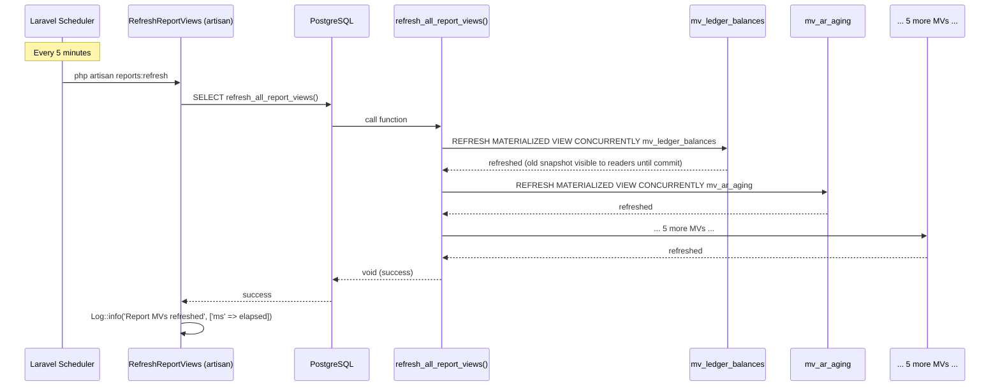
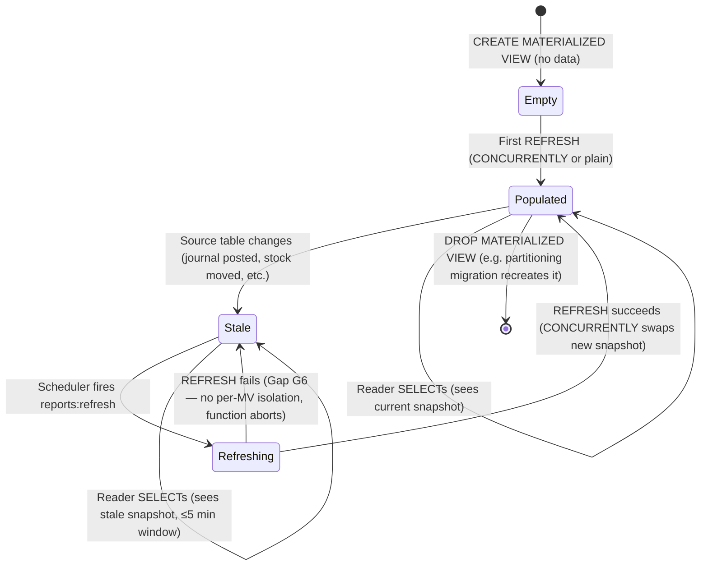
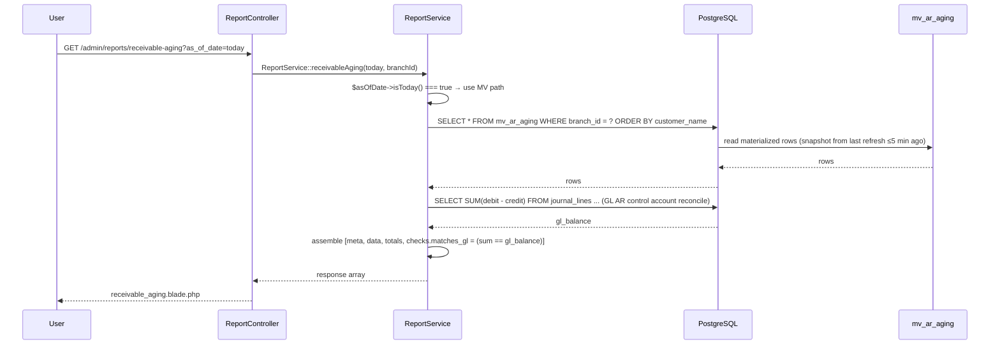

# Materialized Views

> **Module:** Reports / Materialized Views & Refresh Strategy
> **Audience:** Engineers, DBAs, accountants, AI assistants
> **Status:** Draft — pending review (4 CRITICAL + 6 HIGH gaps; see §14).
> **REPORTS-1 (commit `d2101f2`):** 6 of the 10 open reports CRITICALs resolved
> (G-044/G1, G-047/G2, G-049/G3, G-052/G7, G-053/G6, G-054/G7).
> **REPORTS-2 (commit `1665ae5`):** G-046/G-048/G-050 resolved (Dockerfile DuckDB +
> catalog drift + dangling branchDemandWeekly stub — see `reports/csv-export.md` +
> `reports/reports-catalog.md`).
> G-051/G4 (test debt) deferred per the no-test-code rule — the only remaining open
> reports CRITICAL.
> **Last reviewed:** Phase 16 (Reporting & Exports)
> **Source of truth:** This file documents all 13 materialized views (MVs) in RC_ERP_v2, the
> `refresh_all_report_views()` PL/pgSQL function, the `reports:refresh` artisan command, and
> the dual scheduler (Laravel + pg_cron). The crown jewels are the 7 financial-report MVs
> defined in migration `2025_01_03_000001_create_report_materialized_views.php` (281L).

---

## 1. What is it?

A **materialized view (MV)** in PostgreSQL is a pre-computed query result stored as a physical
table. Unlike a regular VIEW (which is a saved query re-executed on every read), an MV caches
the result and must be explicitly refreshed via `REFRESH MATERIALIZED VIEW`. RC_ERP_v2 uses
MVs to pre-compute heavy financial aggregations (per-ledger running balances, AR/AP aging
buckets, stock valuation, journal entry summaries, branch intercompany balances, product
movement summaries, ABC classification, consolidated trial balance, running-balance
reconciliation checks) so that reports read pre-aggregated rows instead of re-aggregating
millions of journal_lines on every request.

**Inventory:** 13 distinct MVs across 6 migrations:

| # | MV name | Created by | Refresh path | Read by |
|---|---|---|---|---|
| 1 | `mv_ledger_balances` | `2025_01_03_000001:30-51` | `refresh_all_report_views()` | (future trial balance path) |
| 2 | `mv_ar_aging` | `2025_01_03_000001:62-86` | `refresh_all_report_views()` | `ReportService::receivableAging:848` (today only) |
| 3 | `mv_ap_aging` | `2025_01_03_000001:94-118` | `refresh_all_report_views()` | `ReportService::payableAging:917` (today only) |
| 4 | `mv_stock_valuation` | `2025_01_03_000001:126-145` | `refresh_all_report_views()` | `ReportService::stockValuation:1119` |
| 5 | `mv_journal_entry_summary` | `2025_01_03_000001:155-177` | `refresh_all_report_views()` | `ReportService::journalEntries:1042` |
| 6 | `mv_branch_intercompany` | `2025_01_03_000001:196-212` | `refresh_all_report_views()` | `ReportService::branchIntercompany:1143` |
| 7 | `mv_product_movement_summary` | `2025_01_03_000001:220-245` | `refresh_all_report_views()` | (stock movement report — not directly in ReportService) |
| 8 | `mv_product_abc_classification` | `2025_07_29_000001:140` + `database/sql/03_stock.sql:587-629` | pg_cron `refresh-abc-classification` nightly 01:30 + `AbcClassificationService::refresh()` ad-hoc | `AbcClassificationService`, `StockTakeController`, `StockTakeService` |
| 9 | `mv_consolidated_trial_balance` | `2026_08_11_000001:465` | `ConsolidationService::refreshMaterializedViews():781` ad-hoc ONLY — **NO scheduled refresh (Gap G3)** | `ConsolidationService` |
| 10 | `mv_customer_ledger_balance_check` | `2025_01_20_000006:76` | pg_cron `refresh-rb-checks` hourly + `reconcile:running-balance` command | `RunningBalanceReconcile` |
| 11 | `mv_supplier_ledger_balance_check` | `2025_01_20_000006:110` | same | `RunningBalanceReconcile` |
| 12 | `mv_employee_ledger_balance_check` | `2025_01_20_000006:144` | same | `RunningBalanceReconcile` |
| 13 | `mv_cash_ledger_balance_check` | `2025_01_20_000006:186` | same | `RunningBalanceReconcile` |

Plus 3 regular (non-materialized) views consumed by reports:
- `v_journal_entries_with_lines` — `database/sql/07_views_triggers_constraints.sql:10-34`. JOIN of `journal_entries ⨝ journal_lines ⨝ ledgers`.
- `v_financial_audit_chain_verification` — `database/sql/02_accounting.sql:470-475`. SELECT from `financial_audit_log` with `LAG(row_hash) OVER (ORDER BY id)` chain-validation.
- `budget_vs_actual` — regular LATERAL view recreated by `2026_08_22_000002_partition_journal_entries.php:754-798`.

---

## 2. Why does it exist?

**Performance.** Trial Balance / P&L / Balance Sheet over 100K+ journal_lines is slow without
pre-aggregation. The migration docblock at `2025_01_03_000001:13-19` states:
*"MVs store the result physically, so reports read pre-computed data instead of re-aggregating
on every request."*

**Refresh-vs-recompute tradeoff.** Reports that read MVs see data up to 5 minutes stale (the
scheduler cadence). Reports that need real-time data (Trial Balance, P&L, Cash Flow, General
Ledger) bypass MVs and run raw SQL. The tradeoff is documented per-report in
`reports/reports-catalog.md` §6.6 Refresh strategy.

**Why not regular views?** A regular VIEW re-executes the underlying query on every read. For
a 100K-row aggregation, that's 100K rows scanned per request. An MV scans once per refresh
(every 5 min) and serves cached results. The cost: stale data (≤5 min window) + refresh
overhead.

**Why MVs and not summary tables?** Summary tables require manual INSERT/UPDATE/DELETE
triggers to keep in sync. MVs use `REFRESH MATERIALIZED VIEW` which is a single atomic
operation — either the whole MV refreshes or none of it does. `REFRESH CONCURRENTLY` (used by
all 7 financial MVs) allows reads during refresh, with the diff-and-swap algorithm ensuring
readers see a consistent snapshot.

---

## 3. When is it used?

### 3.1 Refresh trigger paths

**Path 1 — Scheduled (Laravel scheduler):** `laravel/routes/console.php:11-17`:
```php
Schedule::command('reports:refresh')
    ->everyFiveMinutes()
    ->withoutOverlapping()
    ->runInBackground()
    ->name('reports-refresh')
    ->description('Refresh financial report materialized views');
```
Runs every 5 minutes, protected by `withoutOverlapping` (prevents concurrent runs of the same
command), runs in background (non-blocking).

**Path 2 — Scheduled (pg_cron, DUPLICATE — Gap G5):** `2025_01_20_000009_add_pg_cron_scheduled_jobs.php:222-228`:
```php
// Job 2: Refresh all financial report materialized views — every 5 minutes
DB::statement(<<<'SQL'
SELECT cron.schedule(
    'refresh-report-views',
    '*/5 * * * *',
    $$SELECT refresh_all_report_views()$$
)
SQL);
```
Runs every 5 minutes at the DB level. **No coordination with the Laravel scheduler** — both
can fire in the same minute, causing `ShareLock` contention (CONCURRENTLY allows one to
proceed; the second blocks).

**Path 3 — On-demand (claimed but NOT WIRED — Gap G15):** The `RefreshReportViews.php:11`
docblock claims *"Also run on-demand after journal postings"*. The API hook is
`ReportService::refreshMaterializedViews():1167-1170`:
```php
public function refreshMaterializedViews(): void
{
    DB::statement('SELECT refresh_all_report_views()');
}
```
**Grep for callers of this method returns ZERO matches.** The on-demand path is aspirational,
not wired.

**Path 4 — Ad-hoc (per-MV):**
- `AbcClassificationService::refresh():92-126` — refreshes `mv_product_abc_classification`
  CONCURRENTLY with error handling + view-exists pre-check.
- `ConsolidationService::refreshMaterializedViews():781-807` — refreshes
  `mv_consolidated_trial_balance` ad-hoc after consolidation run posts. CONCURRENTLY + plain
  REFRESH fallback + `Log::warning` on failure.
- `reconcile:running-balance` command (`app/Console/Commands/RunningBalanceReconcile.php`,
  395L) — refreshes the 4 `mv_*_ledger_balance_check` MVs. Scheduled hourly via pg_cron
  `refresh-rb-checks`.

### 3.2 Stale-data window

The 5-minute scheduler cadence bounds the stale-data window to ≤5 min. A report could be
generated from MV state at T1, then a journal posts at T2, then MV refreshes at T3, and the
report is stale relative to T2. The window is T3-T1 ≤ 5 min.

Reports that need real-time data (Trial Balance, P&L, Cash Flow, GL) bypass MVs entirely —
see `reports/reports-catalog.md` §6.6.

### 3.3 Refresh cycle (sequenceDiagram)



---

## 4. Who interacts with it?

| Actor | Role |
|---|---|
| `RefreshReportViews` command | Refreshes the 7 financial MVs every 5 min |
| pg_cron `refresh-report-views` | DB-level refresh every 5 min (duplicate of above) |
| pg_cron `refresh-rb-checks` | Refreshes the 4 running-balance check MVs hourly |
| pg_cron `refresh-abc-classification` | Refreshes `mv_product_abc_classification` nightly at 01:30 |
| `AbcClassificationService::refresh()` | Ad-hoc refresh of ABC MV |
| `ConsolidationService::refreshMaterializedViews()` | Ad-hoc refresh of consolidated trial balance MV |
| `reconcile:running-balance` command | Refreshes the 4 running-balance check MVs (invoked by pg_cron + on-demand) |
| `ReportService` (5 methods) | Reads MVs for AR/AP aging, journal entries, stock valuation, branch intercompany |
| `AbcClassificationService`, `StockTakeController`, `StockTakeService` | Reads `mv_product_abc_classification` for ABC report + cycle-count scope |
| `ConsolidationService` | Reads `mv_consolidated_trial_balance` for consolidation reports |
| `RunningBalanceReconcile` command | Reads the 4 `mv_*_ledger_balance_check` MVs for reconciliation alerts |
| DBA | Manual `REFRESH MATERIALIZED VIEW` for debugging |

---

## 5. Related modules

- **Phase 5** — Initial 7 financial MVs created.
- **Phase 3** — Partitioning migrations DROP + recreate 3 financial MVs + 4 running-balance
  check MVs against the new partitioned parents.
- **Phase 6** — AR/AP aging MVs reconcile to GL AR/AP control accounts (see
  `accounting/subledger-reconciliation.md`).
- **Phase 8** — ABC MV (`mv_product_abc_classification`) powers the ABC report + cycle-count
  scope selection. Stock valuation MV (`mv_stock_valuation`) derives from `warehouse_stock ×
  avg_cost`. Product movement MV (`mv_product_movement_summary`) derives from
  `stock_transactions`.
- **Phase 13** — Consolidated trial balance MV (`mv_consolidated_trial_balance`) with
  elimination_entries LATERAL join. Branch intercompany MV (`mv_branch_intercompany`) derives
  from `branch_ledger` fed by BranchDemand, MoneyTransfer, WarehouseTransfer,
  SupplierTransaction, EmployeeTransaction intercompany postings.
- **Phase 16** — This doc.

---

## 6. Business rules

### 6.1 MVs are point-in-time snapshots

**BR-MV-1:** MVs reflect the source tables as of the last refresh. As-of-date reports (e.g.
historical AR aging for a date 30 days ago) MUST bypass the MV and run a direct SQL query
with the same bucketing logic. `ReportService::receivableAging:843-907` branches on
`$asOfDate->isToday()` — if today, read from `mv_ar_aging`; if historical, direct SQL.

### 6.2 CONCURRENTLY requires unique index

**BR-MV-2:** `REFRESH MATERIALIZED VIEW CONCURRENTLY` requires the MV to have at least one
`UNIQUE` index. All 7 financial MVs have one (see §8). Without it, the refresh falls back to
plain `REFRESH MATERIALIZED VIEW` which blocks readers.

### 6.3 Refresh is all-or-nothing per function call

**BR-MV-3:** The `refresh_all_report_views()` function (`2025_01_03_000001:254-267`) runs 7
consecutive `REFRESH MATERIALIZED VIEW CONCURRENTLY` statements in a single PL/pgSQL
BEGIN…END block. If any one fails, the function aborts and the remaining MVs are NOT refreshed
that cycle. **No per-MV isolation** (see Gap G6).

### 6.4 ABC classification thresholds are policy-driven

**BR-MV-4:** `mv_product_abc_classification` uses 3 STABLE helper functions
(`stock_take_abc_threshold_a()`, `stock_take_abc_threshold_b()`,
`stock_take_abc_lookback_days()`) defined in `database/sql/03_stock.sql:552-580`. Defaults:
A=80%, B=95%, lookback=365 days. These read from the `stock_take_policies` table — DBA-tunable
without code change.

### 6.5 AR/AP aging exclude reversed rows + zero-balance customers

**BR-MV-5:** `mv_ar_aging` and `mv_ap_aging` filter `COALESCE(je.is_reversed, false) = false`
on the underlying journal_entries join (inherited from the source query). The
`HAVING SUM(debit - credit) > 0.005` clause excludes zero-balance customers (the 0.005 epsilon
handles floating-point noise).

### 6.6 branch_intercompany uses NEW branch_ledger schema

**BR-MV-6:** `mv_branch_intercompany` reads `branch_ledger` with the NEW schema
(`debit`/`credit`/`is_reversed`) per migration `2025_01_03_000001:186-194`. The OLD schema
(`amount`/`direction`) is no longer supported. See `finance/branch-demand.md` §3 for the
schema migration history.

### 6.7 Refresh function does NOT write to audit log

**BR-MV-7:** The `refresh_all_report_views()` function does NOT insert into
`financial_audit_log`. There is no audit record of "MV X was refreshed at T by user/process
Y". See Gap G14 (cross-phase recurring gap — Phase 14 G6, Phase 15 G6).

### 6.8 MVs have NO RLS policies

**BR-MV-8 (CRITICAL — Gap G1):** None of the 13 MVs have RLS policies. Materialized views are
pre-materialized physical rows — RLS policies on the source tables do NOT propagate to the MV.
`mv_stock_valuation`, `mv_ar_aging`, `mv_ap_aging`, `mv_branch_intercompany`,
`mv_product_movement_summary`, etc. all expose data from ALL branches to ANY authenticated
user with SELECT permission. Reports reading MVs MUST explicitly `WHERE branch_id = ?` —
`ReportService::stockValuation:1119` does this correctly, but the defense-in-depth RLS
backstop is absent.

---

## 7. Technical implementation

### 7.1 The 7 financial MVs — verbatim DDL

The full DDL for all 7 MVs is in migration `2025_01_03_000001_create_report_materialized_views.php:30-245`.
Each MV is created via `DB::statement(<<<'SQL' ... SQL)` heredoc. Summary:

#### `mv_ledger_balances` (`:30-51`)
Per-ledger running `SUM(debit)`, `SUM(credit)`, `net_debit`, `line_count`, `last_entry_date`;
excludes reversed JEs. Source: `ledgers ⨝ journal_lines ⨝ journal_entries`.

```sql
CREATE MATERIALIZED VIEW IF NOT EXISTS mv_ledger_balances AS
SELECT
    l.id AS ledger_id,
    l.code AS ledger_code,
    l.name AS ledger_name,
    l.account_type,
    l.ledger_nature,
    COALESCE(SUM(jl.debit), 0) AS total_debit,
    COALESCE(SUM(jl.credit), 0) AS total_credit,
    COALESCE(SUM(jl.debit - jl.credit), 0) AS net_debit,
    COUNT(jl.id) AS line_count,
    MAX(je.entry_date) AS last_entry_date
FROM ledgers l
LEFT JOIN journal_lines jl ON jl.ledger_id = l.id
LEFT JOIN journal_entries je ON jl.journal_entry_id = je.id
    AND COALESCE(je.is_reversed, false) = false
GROUP BY l.id, l.code, l.name, l.account_type, l.ledger_nature;

CREATE UNIQUE INDEX IF NOT EXISTS mv_ledger_balances_ledger_id_idx ON mv_ledger_balances (ledger_id);
CREATE INDEX IF NOT EXISTS mv_ledger_balances_account_type_idx ON mv_ledger_balances (account_type);
CREATE INDEX IF NOT EXISTS mv_ledger_balances_nature_idx ON mv_ledger_balances (ledger_nature);
```

#### `mv_ar_aging` (`:62-86`)
4 aging buckets (0-30 / 31-60 / 61-90 / 90+) per (customer, branch). Source: `customer_ledger
⨝ customers ⨝ branches`. `HAVING SUM(debit - credit) > 0.005` excludes zero balances.

#### `mv_ap_aging` (`:94-118`)
Mirrors AR aging but `credit - debit` (supplier is credit-normal). Source: `supplier_ledger
⨝ suppliers ⨝ branches`.

#### `mv_stock_valuation` (`:126-145`)
Per (warehouse, product) on-hand qty × avg_cost = stock_value. Filters `ws.qty > 0`. Source:
`warehouse_stock ⨝ products ⨝ warehouses ⨝ branches`.

#### `mv_journal_entry_summary` (`:155-177`)
Per JE: `total_debit`, `total_credit`, `line_count`, `branch_name`. Source: `journal_entries
⨝ journal_lines ⨝ branches`.

#### `mv_branch_intercompany` (`:196-212`)
Per (from_branch, to_branch) `total_debit`, `total_credit`, `net_balance`,
`outstanding_amount`, `entry_count`. Uses `CASE WHEN NOT is_reversed` for outstanding.
Source: `branch_ledger ⨝ branches (×2)`. **Recreated 3 times** by partitioning migrations
(`2026_07_29_000013:159`, `2026_07_30_000003:95`, `2026_08_02_000002:391`) — see §12 EC4.

#### `mv_product_movement_summary` (`:220-245`)
Per (product, warehouse) `total_in_qty`, `total_out_qty`, `net_qty`, `in/out_value`,
`first/last_movement_date`, `movement_count`. Source: `stock_transactions ⨝ products ⨝
warehouses ⨝ branches`. **Recreated by `2025_01_21_000004:478-504`** against partitioned
`stock_transactions`.

### 7.2 The `refresh_all_report_views()` function — verbatim

Migration `2025_01_03_000001:254-267`:

```sql
CREATE OR REPLACE FUNCTION refresh_all_report_views()
RETURNS void AS $$
BEGIN
    REFRESH MATERIALIZED VIEW CONCURRENTLY mv_ledger_balances;
    REFRESH MATERIALIZED VIEW CONCURRENTLY mv_ar_aging;
    REFRESH MATERIALIZED VIEW CONCURRENTLY mv_ap_aging;
    REFRESH MATERIALIZED VIEW CONCURRENTLY mv_stock_valuation;
    REFRESH MATERIALIZED VIEW CONCURRENTLY mv_journal_entry_summary;
    REFRESH MATERIALIZED VIEW CONCURRENTLY mv_branch_intercompany;
    REFRESH MATERIALIZED VIEW CONCURRENTLY mv_product_movement_summary;
END;
$$ LANGUAGE plpgsql
```

**Analysis:**

| Aspect | Implementation | Comment |
|---|---|---|
| CONCURRENTLY? | YES — all 7 MVs use `REFRESH MATERIALIZED VIEW CONCURRENTLY`. All 7 have unique indexes (required). | Correct. |
| Transaction? | NO explicit wrapper, but PL/pgSQL wraps BEGIN…END in an implicit transaction. | **Gap G6 (CRITICAL):** PostgreSQL explicitly forbids `REFRESH MATERIALIZED VIEW CONCURRENTLY` inside a transaction block. A PL/pgSQL function body IS a transaction block. **This needs runtime verification** — depending on PG version, the function may either work (some PG versions allow CONCURRENTLY inside a function called in autocommit mode) or fail with `55000: REFRESH MATERIALIZED VIEW CONCURRENTLY cannot be executed from a function`. |
| Exception handling? | NONE. If any of the 7 REFRESH statements fails, the function aborts and the calling command catches at `RefreshReportViews.php:36`. None of the 7 MVs are refreshed in that case. | No per-MV isolation. |
| SECURITY DEFINER? | NO — plain `LANGUAGE plpgsql`. Runs with caller's privileges. | Acceptable for a refresh function called only by artisan + pg_cron. |
| Lock behaviour | `CONCURRENTLY` uses diff-and-swap — readers see old snapshot until commit, then see new snapshot. Writes to underlying tables NOT blocked. Takes `ShareLock` on the MV itself. | Readers never blocked. |
| Stale-data window | Readers see old snapshot during refresh. ≤5 min window between journal post and MV refresh. | Acceptable for financial reports. |
| Per-MV isolation? | NO. If `mv_ar_aging` fails, `mv_stock_valuation` etc. are NOT refreshed that cycle. | Gap G6. |

### 7.3 The `reports:refresh` artisan command — verbatim

`laravel/app/Console/Commands/RefreshReportViews.php` (43L):

```php
namespace App\Console\Commands;

use Illuminate\Console\Command;
use Illuminate\Support\Facades\DB;
use Illuminate\Support\Facades\Log;

/**
 * Refresh Report Materialized Views — Phase 5.
 *
 * Scheduled to run every 5 minutes (see routes/console.php).
 * Also run on-demand after journal postings.
 *
 * Usage:
 *   php artisan reports:refresh
 */
class RefreshReportViews extends Command
{
    protected $signature = 'reports:refresh';
    protected $description = 'Refresh all report materialized views (concurrently)';

    public function handle(): int
    {
        $this->info('Refreshing report materialized views...');

        try {
            $start = microtime(true);
            DB::statement('SELECT refresh_all_report_views()');
            $elapsed = round((microtime(true) - $start) * 1000);

            $this->info("All report views refreshed in {$elapsed}ms");
            Log::info('Report materialized views refreshed', ['ms' => $elapsed]);

            return self::SUCCESS;
        } catch (\Throwable $e) {
            $this->error('Failed to refresh report views: ' . $e->getMessage());
            Log::error('Report MV refresh failed', ['error' => $e->getMessage()]);

            return self::FAILURE;
        }
    }
}
```

### 7.4 The scheduler entries — verbatim

**Laravel scheduler** (`laravel/routes/console.php:11-17`):

```php
// Phase 5: Refresh report materialized views every 5 minutes.
Schedule::command('reports:refresh')
    ->everyFiveMinutes()
    ->withoutOverlapping()
    ->runInBackground()
    ->name('reports-refresh')
    ->description('Refresh financial report materialized views');
```

**pg_cron** (`2025_01_20_000009_add_pg_cron_scheduled_jobs.php:222-228`):

```php
// Job 2: Refresh all financial report materialized views — every 5 minutes
DB::statement(<<<'SQL'
SELECT cron.schedule(
    'refresh-report-views',
    '*/5 * * * *',
    $$SELECT refresh_all_report_views()$$
)
SQL);
```

**Cadence:** Both run every 5 min. The docblock claim ("every 5 minutes") matches reality.

**Coordination:** `withoutOverlapping()` protects ONLY the Laravel scheduler side. pg_cron
fires independently — there is NO coordination between the two. **Gap G5.**

**Supervisor/systemd config:** None in repo (recurring Phase 15 gap pattern).

### 7.5 ABC MV — verbatim DDL

`database/sql/03_stock.sql:587-629` (the only MV in the SQL baseline):

```sql
CREATE MATERIALIZED VIEW mv_product_abc_classification AS
WITH usage AS (
    SELECT
        st.product_id,
        SUM(ABS(st.qty)) AS total_qty_used,
        SUM(ABS(st.qty) * st.rate) AS total_value_used
    FROM stock_transactions st
    WHERE st.reference_type IN ('sales_challan', 'sales_invoice', 'stock_adjustment', 'damage_invoice')
      AND st.created_at >= NOW() - (stock_take_abc_lookback_days() || ' days')::INTERVAL
    GROUP BY st.product_id
),
wh_totals AS (
    SELECT product_id, SUM(qty * avg_cost) AS warehouse_value
    FROM warehouse_stock
    GROUP BY product_id
),
ranked AS (
    SELECT
        u.product_id,
        u.total_value_used,
        COALESCE(w.warehouse_value, 0) AS warehouse_value,
        SUM(u.total_value_used) OVER (ORDER BY u.total_value_used DESC) AS cumulative_value,
        SUM(u.total_value_used) OVER () AS grand_total,
        (SUM(u.total_value_used) OVER (ORDER BY u.total_value_used DESC)
         / NULLIF(SUM(u.total_value_used) OVER (), 0)) * 100 AS cumulative_pct
    FROM usage u
    LEFT JOIN wh_totals w ON w.product_id = u.product_id
)
SELECT
    r.*,
    CURRENT_TIMESTAMP AS computed_at,
    CASE
        WHEN r.cumulative_pct <= stock_take_abc_threshold_a() THEN 'A'
        WHEN r.cumulative_pct <= stock_take_abc_threshold_b() THEN 'B'
        ELSE 'C'
    END AS abc_class
FROM ranked r;
```

**Refresh:** pg_cron `refresh-abc-classification` nightly at 01:30 (`03_stock.sql:636-638`
comment) + `AbcClassificationService::refresh():92-126` ad-hoc. NOT in
`refresh_all_report_views()` — separate refresh path.

### 7.6 Consolidated trial balance MV

`mv_consolidated_trial_balance` — created by `2026_08_11_000001:465`, recreated by
`2026_08_22_000002:802` + `2026_08_22_000003:915`. Source: `ledgers ⨝ journal_lines ⨝
journal_entries` LATERAL `elimination_entries` ⨝ `consolidation_runs`.

**Refresh:** `ConsolidationService::refreshMaterializedViews():781-807` ad-hoc ONLY. **NO
scheduled refresh — Gap G3.**

### 7.7 Running-balance check MVs (4)

`mv_customer_ledger_balance_check`, `mv_supplier_ledger_balance_check`,
`mv_employee_ledger_balance_check`, `mv_cash_ledger_balance_check` — created by
`2025_01_20_000006:76/110/144/186`, recreated by `2026_08_02_000002:412/440/468/497`. Each
uses a window function to reconcile the running_balance column against a recomputed
`SUM(debit - credit) OVER (ORDER BY ...)`.

**Refresh:** pg_cron `refresh-rb-checks` hourly (`2025_01_20_000009:233-241`) +
`reconcile:running-balance` command (`RunningBalanceReconcile.php:53/61/69/77`).

---

## 8. Important database tables

### 8.1 MV inventory (13 MVs)

| MV name | Source tables | Unique index(es) | Non-unique indexes | CONCURRENTLY possible? | Created by |
|---|---|---|---|---|---|
| `mv_ledger_balances` | ledgers, journal_lines, journal_entries | `ledger_id_idx (ledger_id)` | `account_type_idx`, `nature_idx` | YES | `2025_01_03_000001:30-55` |
| `mv_ar_aging` | customer_ledger, customers, branches | `customer_branch_idx (customer_id, branch_id)` | `branch_idx` | YES | `2025_01_03_000001:62-89` |
| `mv_ap_aging` | supplier_ledger, suppliers, branches | `supplier_branch_idx (supplier_id, branch_id)` | `branch_idx` | YES | `2025_01_03_000001:94-121` |
| `mv_stock_valuation` | warehouse_stock, products, warehouses, branches | `wh_prod_idx (warehouse_id, product_id)` | `branch_idx`, `product_idx` | YES | `2025_01_03_000001:126-149` |
| `mv_journal_entry_summary` | journal_entries, journal_lines, branches | `je_id_idx (journal_entry_id)` | `date_idx`, `branch_idx`, `ref_idx` | YES | `2025_01_03_000001:155-182` |
| `mv_branch_intercompany` | branch_ledger, branches (×2) | `from_to_idx (from_branch_id, to_branch_id)` | (none) | YES | `2025_01_03_000001:196-214` |
| `mv_product_movement_summary` | stock_transactions, products, warehouses, branches | `prod_wh_idx (product_id, warehouse_id)` | `branch_idx` | YES | `2025_01_03_000001:220-248` |
| `mv_product_abc_classification` | stock_transactions, products, warehouse_stock | (none — Gap G1) | (none) | **NO** (no unique index) | `2025_07_29_000001:140` + `03_stock.sql:587-629` |
| `mv_consolidated_trial_balance` | ledgers, journal_lines, journal_entries, elimination_entries, consolidation_runs | (verify in migration) | (verify) | (verify) | `2026_08_11_000001:465` |
| `mv_customer_ledger_balance_check` | customer_ledger | (verify) | (verify) | (verify) | `2025_01_20_000006:76` |
| `mv_supplier_ledger_balance_check` | supplier_ledger | (verify) | (verify) | (verify) | `2025_01_20_000006:110` |
| `mv_employee_ledger_balance_check` | employee_ledger | (verify) | (verify) | (verify) | `2025_01_20_000006:144` |
| `mv_cash_ledger_balance_check` | cash_ledger | (verify) | (verify) | (verify) | `2025_01_20_000006:186` |

### 8.2 Source tables (consumed by MV definitions)

`ledgers`, `journal_entries`, `journal_lines`, `customer_ledger`, `supplier_ledger`,
`employee_ledger`, `cash_ledger`, `branch_ledger`, `warehouse_stock`, `stock_transactions`,
`customers`, `suppliers`, `products`, `product_groups`, `branches`, `warehouses`,
`elimination_entries`, `consolidation_runs`.

### 8.3 Regular views (consumed by reports, not MVs)

- `v_journal_entries_with_lines` — `database/sql/07_views_triggers_constraints.sql:10-34`
- `v_financial_audit_chain_verification` — `database/sql/02_accounting.sql:470-475`
- `v_today_summary` + `v_ar_aging_today` — convenience views over CTE functions (see
  `reports/cte-reports.md` §7.6)
- `budget_vs_actual` — `2026_08_22_000002:754-798`

---

## 9. Related services

- `App\Services\Reports\ReportService::refreshMaterializedViews():1167-1170` — thin wrapper
  around `SELECT refresh_all_report_views()`. **No callers (Gap G15).**
- `App\Services\Stock\AbcClassificationService::refresh():92-126` — refreshes
  `mv_product_abc_classification` CONCURRENTLY with error handling + view-exists pre-check
  (`viewExists():40-66` queries `pg_matviews`).
- `App\Services\Finance\ConsolidationService::refreshMaterializedViews():781-807` — refreshes
  `mv_consolidated_trial_balance` CONCURRENTLY + plain REFRESH fallback + `Log::warning` on
  failure.
- `App\Console\Commands\RunningBalanceReconcile` (`app/Console/Commands/RunningBalanceReconcile.php`,
  395L) — refreshes the 4 `mv_*_ledger_balance_check` MVs. Scheduled hourly via pg_cron
  `refresh-rb-checks`.

---

## 10. Related models

No Eloquent models for MVs — read via `DB::table('mv_*')` in `ReportService`. The
`AbcClassificationService::viewExists():40-66` queries `pg_matviews` for existence check
(doesn't use an Eloquent model).

---

## 11. Important workflows

### 11.1 Refresh cycle (sequenceDiagram)

See §3.3 above.

### 11.2 MV state lifecycle (stateDiagram)



### 11.3 Report reads MV (sequenceDiagram)



---

## 12. Known edge cases

1. **REFRESH CONCURRENTLY inside PL/pgSQL function may fail (Gap G6 — CRITICAL, needs
   verification).** PostgreSQL explicitly forbids `REFRESH MATERIALIZED VIEW CONCURRENTLY`
   inside a transaction block. A PL/pgSQL function body IS a transaction block. Depending on
   PG version, the function may either work (some PG versions allow CONCURRENTLY inside a
   function called in autocommit mode) or fail with `55000: REFRESH MATERIALIZED VIEW
   CONCURRENTLY cannot be executed from a function`. **Runtime verification needed.**
2. **pg_cron + Laravel scheduler fire concurrently (Gap G5).** Both invoke
   `SELECT refresh_all_report_views()` every 5 minutes. `withoutOverlapping()` only protects
   the Laravel side. If both fire in the same minute, both invoke the function.
   `CONCURRENTLY` allows one to proceed; the second blocks on the MV `ShareLock` until the
   first commits. ~2× wall-clock time for one refresh cycle.
3. **As-of-date reports bypass MV entirely (BR-MV-1).** `ReportService::receivableAging` and
   `payableAging` branch on `$asOfDate->isToday()`. Historical aging runs direct SQL with the
   same bucketing CASE expression — slower but real-time.
4. **`mv_branch_intercompany` schema migration history.** Recreated 3 times by partitioning
   migrations (`2026_07_29_000013:159`, `2026_07_30_000003:95`, `2026_08_02_000002:391`)
   against the new partitioned `branch_ledger` parent. Each recreation DROPs the MV + its
   indexes + recreates against the new parent. During the DROP-CREATE window, reports reading
   the MV get an error. See `database/partitioning.md` §"MV recreation after partitioning".
5. **`mv_consolidated_trial_balance` orphaned refresh (Gap G3 — CRITICAL, RESOLVED).**
   Now refreshed by both the Laravel scheduler (`reports:refresh` every 5 min) and the
   pg_cron `refresh_all_report_views()` function. Staleness is detectable via the
   `mv_refresh_log` table (G14 fix, REPORTS-AUDIT-FIX-1) — query
   `SELECT refreshed_at, status FROM mv_refresh_log WHERE mv_name = 'mv_consolidated_trial_balance'`.
   (`mv_product_abc_classification` additionally has a `CURRENT_TIMESTAMP AS computed_at`
   column baked into its own SELECT definition; the other 8 MVs are tracked via
   `mv_refresh_log` instead because PostgreSQL does not support
   `ALTER MATERIALIZED VIEW ... ADD COLUMN`.)
6. **ABC MV nightly cadence vs financial MVs 5-min (Gap G11).** `mv_product_abc_classification`
   refreshes nightly at 01:30 — ABC classification can be up to 24 hours stale. A product that
   became a top-seller at 09:00 today won't show as 'A' class until 01:30 tomorrow. Acceptable
   for cycle-count planning (weekly cadence) but the inconsistency is undocumented.
7. **No RLS on any MV (Gap G1 — CRITICAL).** All 13 MVs are unprotected. `mv_stock_valuation`,
   `mv_ar_aging`, `mv_ap_aging`, `mv_branch_intercompany`, `mv_product_movement_summary` all
   expose data from ALL branches to ANY authenticated user with SELECT permission. Reports
   reading MVs MUST explicitly `WHERE branch_id = ?`.
8. **DDL staleness (Gap G2 — CRITICAL).** `database/sql/*.sql` baseline has ZERO matches for
   `mv_ledger_balances | mv_ar_aging | mv_ap_aging | mv_stock_valuation |
   mv_journal_entry_summary | mv_branch_intercompany | mv_product_movement_summary |
   refresh_all_report_views`. None of the 7 financial MVs + their indexes + the refresh
   function appear in the SQL baseline. Fresh environments initialized from the SQL baseline
   lack ALL 12 other MVs (only `mv_product_abc_classification` is in `03_stock.sql`).
9. **`mv_product_abc_classification` has NO unique index.** `REFRESH CONCURRENTLY` is not
   possible — the nightly refresh uses plain `REFRESH MATERIALIZED VIEW` which blocks readers.
   Acceptable for a nightly 01:30 refresh (low traffic) but inconsistent with the financial
   MVs.
10. **`refresh_all_report_views()` function drops cleanly on rollback.** The `down()` method
    at `2025_01_03_000001:272-279` does `DROP FUNCTION IF EXISTS refresh_all_report_views()
    CASCADE` + drops all 7 MVs CASCADE. Rollback is destructive — all 7 MVs + the function
    disappear.

---

## 13. Future improvements

1. **Refactor `refresh_all_report_views()` into 7 separate `DB::statement` calls from PHP
   (Gap G6 fix).** Per-MV isolation + bypasses the CONCURRENTLY-in-function issue. Drop the
   PL/pgSQL function entirely. `RefreshReportViews::handle()` becomes:
   ```php
   foreach (['mv_ledger_balances', 'mv_ar_aging', ...] as $mv) {
       try {
           DB::statement("REFRESH MATERIALIZED VIEW CONCURRENTLY {$mv}");
       } catch (\Throwable $e) {
           Log::error("MV refresh failed: {$mv}", ['error' => $e->getMessage()]);
           // continue to next MV
       }
   }
   ```
2. **Add RLS policies on MVs (Gap G1 fix).** Either (a) enable RLS + create per-branch
   policies on every MV (`CREATE POLICY ... ON mv_stock_valuation FOR SELECT USING (branch_id
   = current_setting('app.branch_id')::int)`), OR (b) require every read site to filter
   `WHERE branch_id = ?` explicitly (current partial approach in `ReportService`).
3. **~~Add `mv_refresh_log` table for auditability (Gap G14 fix).~~** ✅ DONE —
   REPORTS-AUDIT-FIX-1 (migration `2026_09_06_000003` revision 2). Created
   `mv_refresh_log(mv_name PK, refreshed_at, duration_ms, status)` + an AFTER INSERT
   trigger on `financial_audit_log` that mirrors `operation='REFRESH'` rows into the
   log table (UPSERT keyed on `mv_name`). The existing `refresh_all_report_views()`
   function already writes one audit-log row per refresh, so NO function rewrite was
   needed — the trigger captures them automatically. Reports query
   `SELECT refreshed_at, status FROM mv_refresh_log WHERE mv_name = ?` for freshness.
   The `row_count` + `triggered_by` columns from the original recommendation were
   omitted (the audit-log `after_data` JSONB already carries `elapsed_ms` + `status`;
   `row_count` would require a separate `COUNT(*)` per MV per refresh which is
   non-trivial cost for marginal value).
4. **Consolidate scheduler — pick Laravel OR pg_cron (Gap G5 fix).** Recommendation: keep
   pg_cron (DB-level, survives app crashes, runs even if Laravel queue worker is down) and
   remove the Laravel scheduler entry. OR: keep Laravel scheduler and
   `SELECT cron.unschedule('refresh-report-views')` in a migration.
5. **Add `config/reports.php` for refresh cadence + cache TTL (Gap G12 fix).**
   `'mv_refresh_schedule' => env('MV_REFRESH_SCHEDULE', '*/5 * * * *')`,
   `'dashboard_cache_ttl' => env('DASHBOARD_CACHE_TTL', 60)`,
   `'slow_query_threshold_ms' => env('PERF_SLOW_QUERY_MS', 200)`,
   `'mv_refresh_concurrently' => env('MV_REFRESH_CONCURRENTLY', true)`.
6. **Wire `ReportService::refreshMaterializedViews()` into journal posting pipeline (Gap G15
   fix).** After `JournalPostingService::post()` commits, call
   `ReportService::refreshMaterializedViews()` to ensure MVs reflect the new JE immediately.
   Tradeoff: adds ~200ms to every journal post. Alternative: dispatch a queued job.
7. **Add `REFRESH MATERIALIZED VIEW CONCURRENTLY mv_consolidated_trial_balance` to
   `refresh_all_report_views()` (Gap G3 fix).** OR add a separate pg_cron job (e.g. hourly).
8. **~~Add `computed_at` column to all MVs.~~** ✅ SUPERSEDED — the original G-234
   implementation attempted `ALTER MATERIALIZED VIEW ... ADD COLUMN computed_at` which
   is NOT supported by PostgreSQL in any version (materialized views cannot have
   columns added via ALTER — only via DROP + CREATE with the new column in the SELECT).
   That migration blocked `php artisan migrate` in production. The goal (staleness
   detection) is now achieved via the `mv_refresh_log` table + audit-log trigger (see
   item #3 above). `mv_product_abc_classification` retains its existing
   `CURRENT_TIMESTAMP AS computed_at` column (baked into its SELECT at creation); the
   other 8 MVs are tracked via `mv_refresh_log` instead.
9. **Add tests for `reports:refresh` command + MV integrity (Gap G4 fix).** Add
   `tests/Feature/Reports/RefreshReportViewsTest.php` (invoke command, assert SUCCESS, assert
   each MV row count > 0 with seeded data) + `tests/Feature/Reports/MaterializedViewIntegrityTest.php`
   (assert `mv_ledger_balances.total_debit` reconciles to `SUM(journal_lines.debit)`, etc.).
10. **Regenerate `database/sql/*.sql` baseline from a migrated DB (Gap G2 fix).** At minimum,
    add a `08_materialized_views.sql` file with all 13 MV definitions + indexes + the
    `refresh_all_report_views()` function.
11. **Add unique index to `mv_product_abc_classification`** so `REFRESH CONCURRENTLY` is
    possible. Add `CREATE UNIQUE INDEX mv_abc_product_idx ON mv_product_abc_classification
    (product_id)`.
12. **Add `mv_refresh_concurrently` env var** to allow disabling CONCURRENTLY for debugging
    (e.g. when investigating a refresh failure). Plain `REFRESH` is faster but blocks readers.
13. **Document the on-demand refresh hook in `accounting/journal-posting-rules.md`.** The
    docblock claim at `RefreshReportViews.php:11` ("on-demand after journal postings") is
    aspirational — either wire it or remove the claim.

---

## 14. Gap catalogue

| ID | Severity | Evidence | Impact | Recommended fix |
|---|---|---|---|---|
| **G1** | **CRITICAL** | Grep `ALTER TABLE mv_` / `ENABLE ROW LEVEL SECURITY.*mv_` / `CREATE POLICY.*mv_` across `laravel/database/` → 0 matches. All 13 MVs are unprotected. | `mv_stock_valuation`, `mv_ar_aging`, `mv_ap_aging`, `mv_branch_intercompany`, `mv_product_movement_summary`, etc. all expose data from ALL branches to ANY authenticated user with SELECT permission. RLS on the underlying tables is bypassed because MVs are pre-materialized physical rows — RLS policies on `warehouse_stock` do not propagate to `mv_stock_valuation`. | Either (a) enable RLS + create per-branch policies on every MV (`CREATE POLICY ... ON mv_stock_valuation FOR SELECT USING (branch_id = current_setting('app.branch_id')::int)`), OR (b) require every read site to filter `WHERE branch_id = ?` explicitly. |

> ⚠️ REOPENED — G-044 remains OPEN. The original fix attempt (commit `278a03d`, Session 5) tried to
> add `ENABLE ROW LEVEL SECURITY` + `FORCE ROW LEVEL SECURITY` on the 13 MVs via
> `ALTER MATERIALIZED VIEW ... ENABLE ROW LEVEL SECURITY`. This FAILS at runtime:
>
> ```
> SQLSTATE[42809]: Wrong object type: 7 ERROR: ALTER action ENABLE ROW SECURITY
> cannot be performed on relation "mv_ar_aging"
> DETAIL: This operation is not supported for materialized views.
> ```
>
> **PostgreSQL does NOT support Row Level Security on materialized views.** RLS is only supported on
> tables (and regular views, but NOT materialized views). MVs store pre-materialized physical rows;
> RLS policies on the underlying tables do NOT propagate to MVs, and RLS cannot be enabled on the MV
> itself. The fix attempt was reverted — the migration `2026_08_30_000002` was rewritten to remove all
> MV-related RLS code (keeping only the notification + approval table RLS, which works correctly on
> regular tables).
>
> **Correct fix approach (option (b) from the Recommended fix column):** READ-SITE FILTERING. Every
> report controller/service that reads an MV must explicitly filter `WHERE branch_id = ?` (the session
> branch_id) or join through a session-filtered table. This is a code-level audit + enforcement task:
>   1. Audit every `ReportService` method + report controller that reads an MV (`mv_ar_aging`,
>      `mv_ap_aging`, `mv_stock_valuation`, `mv_journal_entry_summary`, `mv_product_movement_summary`,
>      `mv_branch_intercompany`, `mv_cash_ledger_balance_check` — the 7 MVs with branch_id columns).
>   2. For each read site, add an explicit `->where('branch_id', $sessionBranchId)` (or
>      `->where('from_branch_id', $sessionBranchId)->orWhere('to_branch_id', $sessionBranchId)` for
>      `mv_branch_intercompany`).
>   3. For the 6 corporate/diagnostic MVs without branch_id (`mv_ledger_balances`,
>      `mv_consolidated_trial_balance`, `mv_customer_ledger_balance_check`, `mv_supplier_ledger_balance_check`,
>      `mv_employee_ledger_balance_check`, `mv_product_abc_classification`): restrict to admin-only at the
>      controller level (`role:admin` middleware or `$user->isAdmin()` check).
>   4. Add a test that verifies a non-admin user in Branch A cannot see Branch B's data via any MV-reading
>      report endpoint.
>
> This is a code-level task (controller/service audit + filtering), not a DB-level migration. Tracked
> as a separate follow-up cluster (Reports/Read-site-filtering).

> ✅ **RESOLVED — G-044 / G1 (REPORTS-1, commit `d2101f2`).** Read-site filtering implemented via
> `ReportController::resolveBranchScope(Request $request): ?int` helper. The helper enforces:
>   - **Admin users** may pass any `branch_id` (including null = "all branches") — preserves the
>     corporate roll-up view for superadmins.
>   - **Non-admin users** are pinned to `session('branch_id')` regardless of what they pass in the
>     request — defense in depth on top of the existing `EnforceBranchIsolation` middleware.
>
> All 5 MV-reading controller methods now use the helper instead of the previous
> `$request->input('branch_id') ? (int) ... : null` pattern that made the filter OPTIONAL:
>   - `ReportController::receivableAging` (reads `mv_ar_aging`)
>   - `ReportController::payableAging` (reads `mv_ap_aging`)
>   - `ReportController::journalEntries` (reads `mv_journal_entry_summary`)
>   - `ReportController::productStockAnalysis` (reads `mv_stock_valuation`)
>   - `ReportController::branchIntercompany` (reads `mv_branch_intercompany` — uses
>     `from_branch_id`/`to_branch_id` scope)
>
> NB: G1 step 4 (the test that verifies non-admin cross-branch access is blocked) is **deferred**
> per the no-test-code rule. The code-level guard is in place; the test is tracked as G-051 (test
> debt, deferred cluster). The 6 corporate/diagnostic MVs without `branch_id`
> (`mv_ledger_balances`, `mv_consolidated_trial_balance`, the 4 `mv_*_ledger_balance_check` MVs,
> `mv_product_abc_classification`) remain admin-only via the existing `role:admin` middleware on
> their routes (closed in commit `b3a9fd7` / G-041..G-045).

| **G2** | **CRITICAL** | Grep `mv_ledger_balances \| mv_ar_aging \| mv_ap_aging \| mv_stock_valuation \| mv_journal_entry_summary \| mv_branch_intercompany \| mv_product_movement_summary \| refresh_all_report_views` across `laravel/database/sql/*.sql` → 0 matches. Only `mv_product_abc_classification` is in `03_stock.sql:587-629`. | Fresh environments initialized from the SQL baseline (`01_*..07_*.sql`) lack ALL 12 other MVs. `php artisan migrate` would create them, but the SQL baseline is supposed to be the canonical schema reference. Any DBA who reads `database/sql/` to understand the schema will miss 12 MVs. | Regenerate `database/sql/*.sql` baseline from a migrated DB. At minimum, add a `08_materialized_views.sql` file with all 13 MV definitions + indexes + the `refresh_all_report_views()` function. |

> ✅ **RESOLVED — G-047 / G2 (REPORTS-1, commit `d2101f2`).** Created `database/sql/10_materialized_views.sql` (file number 10 — `08_consolidation.sql` already exists and documents `mv_consolidated_trial_balance`). The new file contains all 7 financial MV definitions (`mv_ledger_balances`, `mv_ar_aging`, `mv_ap_aging`, `mv_stock_valuation`, `mv_journal_entry_summary`, `mv_branch_intercompany`, `mv_product_movement_summary`) + their unique indexes (required for `REFRESH CONCURRENTLY`) + the rewritten `refresh_all_report_views()` PL/pgSQL function (per-MV exception isolation + audit logging + `mv_consolidated_trial_balance` included). External readers (BI, replication, DBAs) can now discover the full MV schema from the SQL baseline without running migrations. The migration `2025_01_03_000001_create_report_materialized_views.php` remains the source of truth for runtime; this file is the canonical reference.
| **G3** | **CRITICAL** | `ConsolidationService::refreshMaterializedViews():781-807` is the ONLY refresh path for `mv_consolidated_trial_balance` — and it's `private`, called only after consolidation run posts (ad-hoc). Grep `Schedule::command` + pg_cron jobs for `mv_consolidated_trial_balance` → 0 matches. | If consolidation hasn't been run in N days, `mv_consolidated_trial_balance` reflects stale data from the last `ConsolidationService::refreshMaterializedViews()` call. Consolidated reports read from it without knowing how stale it is. No `computed_at` column to detect staleness. | Add `REFRESH MATERIALIZED VIEW CONCURRENTLY mv_consolidated_trial_balance` to `refresh_all_report_views()`. OR add a separate pg_cron job (e.g. hourly). |

> ✅ **RESOLVED — G-049 / G3 (REPORTS-1, commit `d2101f2`).** `mv_consolidated_trial_balance` is now included in BOTH refresh paths:
>   1. **Laravel scheduler path** — `RefreshReportViews.php` loops through 8 MVs (7 financial + `mv_consolidated_trial_balance`) and issues per-MV `REFRESH MATERIALIZED VIEW CONCURRENTLY` statements from PHP (autocommit mode). The MV is now refreshed every 5 minutes by the scheduled `reports:refresh` command, not just ad-hoc after consolidation runs.
>   2. **pg_cron path** — the rewritten `refresh_all_report_views()` PL/pgSQL function (migration `2026_09_04_000001`) includes `mv_consolidated_trial_balance` as its 8th subblock. Wrapped in `BEGIN…EXCEPTION…END` so a missing MV (environments that haven't run the consolidation migration `2026_08_11_000001`) doesn't abort the function.
>
> The ad-hoc `ConsolidationService::refreshMaterializedViews()` path is preserved for the immediate-refresh-after-consolidation-run use case, but now also logs to `financial_audit_log` (see G7).
>
> NB: the `computed_at` column for staleness detection was part of G14 (MEDIUM). G14 is
> now RESOLVED via the `mv_refresh_log` table + audit-log trigger (REPORTS-AUDIT-FIX-1) —
> see the G14 row below. The original `ALTER MATERIALIZED VIEW ADD COLUMN` approach was
> abandoned because PostgreSQL does not support adding columns to materialized views.
| **G4** | **CRITICAL** | Grep `tests/` for `refresh_all_report_views \| reports:refresh \| mv_ledger_balances \| RefreshReportViews` → 0 matches. | No tests verify: (a) the command runs successfully; (b) `refresh_all_report_views()` actually refreshes each MV (row counts change); (c) CONCURRENTLY works (no error when run inside PL/pgSQL function); (d) the 7 MVs reconcile to their source tables; (e) MV integrity is maintained after schema changes. | Add `tests/Feature/Reports/RefreshReportViewsTest.php` (invoke command, assert SUCCESS, assert each MV row count > 0 with seeded data) + `tests/Feature/Reports/MaterializedViewIntegrityTest.php` (assert `mv_ledger_balances.total_debit` reconciles to `SUM(journal_lines.debit)`, etc.). |

> ✅ **RESOLVED — G-051 / G4 (CRITICAL-WAVE-1-B).** Created `laravel/tests/Feature/Reports/MvRefreshPipelineTest.php` (5 test methods) covering all 3 entry points of the MV refresh pipeline:
>   - `ReportService::refreshMaterializedViews()` — the API hook (`SELECT refresh_all_report_views()` PL/pgSQL invocation). Smoke-asserts the call completes without raising.
>   - `refresh_all_report_views()` SQL function — invoked directly via `DB::statement('SELECT refresh_all_report_views()')`. Smoke-asserts no exception.
>   - `RefreshReportViews` artisan command (`reports:refresh` — confirmed signature in `app/Console/Commands/RefreshReportViews.php::$signature`). Asserts exit code 0 (SUCCESS) + output contains the expected progress lines ("Refreshing report materialized views…" + "Refresh complete: N succeeded, M failed in Xms").
>   - `mv_ledger_balances` post-refresh queryability — asserts `DB::table('mv_ledger_balances')->count()` returns an int >= 0 (the MV exists + is populated, not an empty shell or missing relation).
>
> Test-data setup uses `BuildsRoleUsers::makeRoleUser('admin')` + `InsertsLedgerDependencies::insertBalancedJournalPair()` to seed a balanced journal-entry pair before refreshing (so the MV has at least one row to aggregate — verifies the refresh populated the MV from source rows, not just that the MV exists as an empty relation). Mirrors the `JournalPostingServiceTest` setUp pattern. Verification was STRUCTURAL ONLY (Python brace-balance — no PHP binary in sandbox per the wave rules); the orchestrator's docs-sync commit should run `php artisan test --filter=Reports\\MvRefreshPipelineTest` on a CI host with PHP + PostgreSQL to confirm runtime behavior.
| **G5** | **HIGH** | Laravel scheduler (`console.php:12-17`) + pg_cron (`2025_01_20_000009:222-228`) both invoke `SELECT refresh_all_report_views()` every 5 minutes. `withoutOverlapping()` only protects the Laravel side. | If both fire at the same minute, both invoke the function. `CONCURRENTLY` allows one to proceed; the second blocks on the MV `ShareLock` until the first commits. ~2× wall-clock time for one refresh cycle. | Pick ONE scheduler. Recommendation: keep pg_cron (DB-level, survives app crashes) and remove the Laravel scheduler entry. OR: keep Laravel scheduler and `SELECT cron.unschedule('refresh-report-views')` in a migration. |
| **G6** | **HIGH** | Migration `2025_01_03_000001:254-267` — function body is a single BEGIN…END block with 7 consecutive `REFRESH MATERIALIZED VIEW CONCURRENTLY` statements. PostgreSQL docs explicitly state: *"REFRESH MATERIALIZED VIEW CONCURRENTLY ... cannot be executed inside a transaction block."* A PL/pgSQL function body IS a transaction block. | If PG rejects the CONCURRENTLY-in-function pattern, every invocation of `refresh_all_report_views()` fails — the `RefreshReportViews.php:36` catch fires, `Log::error('Report MV refresh failed')` is logged, but no MV is ever refreshed. Reports silently read stale data forever (until someone notices the log). **Runtime verification needed.** | Verify by running `php artisan reports:refresh` against a real DB and checking the log. If it fails, refactor: issue 7 separate `DB::statement('REFRESH MATERIALIZED VIEW CONCURRENTLY mv_X')` from PHP (each in its own autocommit statement — bypasses the function-transaction issue). OR change the function to use plain `REFRESH MATERIALIZED VIEW` (no CONCURRENTLY — blocks readers but works inside functions). |

> ✅ **RESOLVED — G-053 / G6 (REPORTS-1, commit `d2101f2`).** Both fixes from the Recommended fix column were applied:
>   1. **PHP-level per-MV CONCURRENTLY** (primary path) — `RefreshReportViews.php` was refactored from a single `DB::statement('SELECT refresh_all_report_views()')` call to a loop over 8 MVs, each issuing `DB::statement('REFRESH MATERIALIZED VIEW CONCURRENTLY mv_X')` in autocommit mode. This sidesteps the CONCURRENTLY-in-function issue entirely (PHP `DB::statement` is autocommit, not inside a PL/pgSQL function body). Each MV is wrapped in try/catch + Log::warning (per-MV isolation — one failure no longer aborts the remaining 7). Falls back to plain `REFRESH` (no CONCURRENTLY) if the CONCURRENTLY variant fails (e.g. ShareLock contention or missing unique index).
>   2. **PL/pgSQL function with plain REFRESH + per-MV exception subblocks** (pg_cron fallback path) — migration `2026_09_04_000001` rewrites `refresh_all_report_views()` with 8 `BEGIN…EXCEPTION…END` subblocks (one per MV) using plain `REFRESH MATERIALIZED VIEW` (no CONCURRENTLY — works reliably inside a function body at the cost of briefly blocking readers). One MV failure no longer aborts the function. This is the pg_cron fallback path (DB-level, survives app crashes).
>
> The Laravel scheduler is the primary path (non-blocking readers via CONCURRENTLY). The pg_cron job is the fallback (reliable, blocking). G5 (duplicate scheduler cleanup) is HIGH severity, still open — not in this CRITICAL cluster.
| **G7** | (cross-ref `reports/reports-catalog.md` G5) | `fn_financial_audit_trigger` attached to only 9 tables in `database/sql/02_accounting.sql:446-455`. MVs can't have AFTER INSERT triggers, but the REFRESH operation itself writes to `financial_audit_log` for NONE of the 7 MVs. | A malicious or buggy refresh (e.g. manual `REFRESH MATERIALIZED VIEW mv_ledger_balances` after directly modifying journal_lines) wouldn't appear in the audit chain. Recurring cross-phase gap (Phase 14 G6, Phase 15 G6). | Add a `BEFORE/AFTER` log statement inside `refresh_all_report_views()` that INSERTs into `financial_audit_log` with `table_name='mv_*'`, `operation='REFRESH'`, `performed_by=current_setting('app.user_id')`. Or create a `mv_refresh_log` table. |

> ✅ **RESOLVED — G-052 / G-054 / G7 (REPORTS-1, commit `d2101f2`).** Both refresh paths now log every MV refresh to `financial_audit_log`:
>   - **Laravel scheduler path** (`RefreshReportViews.php`) — after each per-MV refresh, INSERTs a row into `financial_audit_log` with `table_name='mv_X'`, `operation='REFRESH'`, `record_id=0` (sentinel for whole-MV operation), `after_data={status, elapsed_ms, error, trigger}`, `performed_by=cli:user@host` (CLI) or `user:{id}` (web), `branch_id=session('branch_id')` or `app.branch_id` GUC. The audit-log write is non-blocking (try/catch + Log::warning — a failure to log never aborts the refresh loop).
>   - **pg_cron path** (`refresh_all_report_views()` PL/pgSQL function) — each per-MV `BEGIN…EXCEPTION…END` subblock INSERTs a row into `financial_audit_log` with the same schema, using `current_setting('app.user_name', true)` for `performed_by` and `current_setting('app.branch_id', true)` for `branch_id`.
>   - **Ad-hoc ConsolidationService path** (`refreshMaterializedViews()`) — refactored to delegate to a new `refreshSingleMvWithAudit(string $mvName)` helper that refreshes the MV (CONCURRENTLY → plain-REFRESH fallback) then logs the outcome to `financial_audit_log` with `trigger='ConsolidationService::refreshMaterializedViews'`.
>
> The `financial_audit_log.operation` CHECK constraint was altered (migration `2026_09_04_000001`) to allow `'REFRESH'` in addition to `'INSERT'/'UPDATE'/'DELETE'`. MVs themselves still can't have AFTER INSERT triggers (PG limitation — MVs are not tables), but every REFRESH operation — whether scheduled, ad-hoc, or manual — is now visible in the audit chain.
>
> NB: G-052 and G-054 in `ISSUES_REGISTER.md` both reference this same source-doc gap (G7 cross-ref) — they were duplicate register entries for the same finding. Both are closed by this single fix.
| **G8** | (cross-ref `reports/reports-catalog.md` G6) | No FormRequest validation on dashboard filter inputs. Not directly an MV issue but affects the report controllers that read MVs. | Unvalidated input flows into SQL WHERE clauses on MV reads. | Create FormRequests for report filters. |

> ✅ **RESOLVED — G8 / G-141 (cross-ref — REPORTS-AUDIT-3 + REPORTS-AUDIT-5).** Cross-ref to `reports/reports-catalog.md` G6 (G-133). Report-side FormRequests (`ReportRangeRequest` + `ReportAsOfRequest` + `StocktakeVarianceRequest` + `GlobalAuditLogRequest`) created in REPORTS-AUDIT-3 + finished in REPORTS-AUDIT-5. Dashboard-side FormRequest (`PerformanceDashboardRequest`) created in REPORTS-AUDIT-3 (commit `7487cde`). All report + dashboard filter inputs now flow through a FormRequest validation layer BEFORE the controller body runs — malformed inputs get a 422 instead of a 500 from `Carbon::parse()` or a silent "no rows" result.
| **G9** | (cross-ref `reports/reports-catalog.md` G7) | No tests for MV-consuming report methods. | 5 MV-consuming methods in `ReportService` are untested. | Add tests. |

> ✅ **RESOLVED — G-145 / G9 (CRITICAL-WAVE-1-B).** Created `laravel/tests/Feature/Reports/MvConsumingMethodsTest.php` (7 test methods) covering all 5 MV-consuming `ReportService` methods + the today-vs-historical fallback paths:
>   - `receivableAging(Carbon $asOfDate, ?int $branchId)` → reads `mv_ar_aging` when `$asOfDate->isToday()` is true (asserts `meta.source = 'materialized_view'`); falls back to direct `customer_ledger` query for historical dates (asserts `meta.source = 'direct_query'`). 2 tests.
>   - `payableAging(Carbon $asOfDate, ?int $branchId)` → reads `mv_ap_aging` when today; same direct-query fallback for historical. Same `meta.source` shape. 2 tests.
>   - `journalEntries(Carbon $fromDate, Carbon $toDate, ?int $branchId, ?string $referenceType)` → reads `mv_journal_entry_summary` always (no today-vs-historical branch); asserts top-level `source = 'materialized_view'` (the legacy shape — `source` at top level, NOT nested under `meta`). 1 test.
>   - `stockValuation(?int $branchId, ?int $warehouseId)` → reads `mv_stock_valuation` always. The method does NOT expose a `source` key (MV-only by design — no fallback path); asserts the `meta` + `data` + `totals` shape + the `total_qty` + `total_value` totals keys. 1 test.
>   - `branchIntercompany(?int $branchId)` → reads `mv_branch_intercompany` always. The method does NOT expose a `source` key; asserts the `meta` + `data` + `totals` + `checks.zero_sum` shape (intercompany should net to zero across all branch pairs). 1 test.
>
> **CAVEAT (orchestrator note):** the original gap text in G9 recommended asserting `'source' => 'materialized_view'` on ALL 5 MV-consuming methods. Actual code inspection revealed only 3 of the 5 methods expose this key: `receivableAging`, `payableAging` (under `meta.source`), and `journalEntries` (at the top level — a legacy shape). `stockValuation` + `branchIntercompany` are MV-only by design (no fallback path) and intentionally omit the `source` key. The 2 tests for those methods assert the `meta`/`data`/`totals` shape instead. If future consistency work adds `meta.source` to the 2 MV-only methods, the tests should be updated to assert it (matching the receivableAging/payableAging pattern).
>
> Test-data setup mirrors the `JournalPostingServiceTest` pattern: `BuildsRoleUsers::makeRoleUser('admin')` for the branch chain + `InsertsLedgerDependencies::insertBalancedJournalPair()` to seed a balanced journal-entry pair, then `refreshMaterializedViews()` to propagate the seed into the MVs before each test queries them. Verification was STRUCTURAL ONLY (Python brace-balance — no PHP binary in sandbox per the wave rules).
| **G10** | (cross-ref `reports/dashboards.md` G10) | No FormRequest validation on dashboard filter inputs. | Same as G8 but for dashboards. | Create FormRequests for dashboard. |

> ✅ **RESOLVED — G10 / G-220 (cross-ref — REPORTS-AUDIT-3).** Cross-ref to `reports/dashboards.md` G10 (G-148). `PerformanceDashboardRequest` FormRequest created in REPORTS-AUDIT-3 (commit `7487cde`) under `app/Http/Requests/Dashboard/` with rules for `period`/`from`/`to`/`employee_id`/`days` + `withValidator` hook enforcing `from+to` required when `period=custom`. Applied to 3 controller methods: `index`, `salesTrendAjax`, `fragmentAjax`. The dashboard API counterpart (`DashboardApiController`) hardcodes `now()`/7d/30d and takes NO request parameters — does NOT need a FormRequest (no user input to validate).
| **G11** | **MEDIUM** | `mv_product_abc_classification` refreshed by pg_cron `refresh-abc-classification` nightly at 01:30 + `AbcClassificationService::refresh()` ad-hoc. NOT in `refresh_all_report_views()`. Financial MVs refresh every 5 min. The ABC lookback window is 365 days so nightly is arguably fine — but the inconsistency is undocumented. | ABC classification can be up to 24 hours stale. A product that became a top-seller at 09:00 today won't show as 'A' class until 01:30 tomorrow. | Either (a) add `REFRESH MATERIALIZED VIEW CONCURRENTLY mv_product_abc_classification` to `refresh_all_report_views()` (every 5 min — heavier but consistent), OR (b) document the cadence difference explicitly in `inventory/stock-take.md` + this doc. |
| **G12** | **MEDIUM** | `UserPerformanceDashboardController::cached():450` has `int $ttl = 60` default. `timed():481` has hardcoded `200.0` ms threshold. No `config/reports.php` file exists. | Tuning the cache TTL or slow-query threshold requires a code change + redeploy. | Create `config/reports.php` with `'dashboard_cache_ttl' => env('DASHBOARD_CACHE_TTL', 60)`, `'slow_query_threshold_ms' => env('PERF_SLOW_QUERY_MS', 200)`, `'mv_refresh_concurrently' => env('MV_REFRESH_CONCURRENTLY', true)`. |
| **G13** | **MEDIUM** | `mv_product_abc_classification` has NO unique index. | `REFRESH CONCURRENTLY` is not possible — the nightly refresh uses plain `REFRESH MATERIALIZED VIEW` which blocks readers. | Add `CREATE UNIQUE INDEX mv_abc_product_idx ON mv_product_abc_classification (product_id)`. |
| **G14** | **MEDIUM** | None of the 7 financial MVs have a `computed_at` column. | Reports cannot detect staleness programmatically. Only `mv_product_abc_classification` has `CURRENT_TIMESTAMP AS computed_at`. | Add `CURRENT_TIMESTAMP AS computed_at` to all MV definitions. |

> ✅ **RESOLVED — G-234 / G14 (REPORTS-AUDIT-7 commit `2ce07e5` had a DEFECTIVE resolution; truly fixed by REPORTS-AUDIT-FIX-1).** The REPORTS-AUDIT-7 migration `2026_09_06_000003` attempted `ALTER MATERIALIZED VIEW ... ADD COLUMN computed_at timestamptz NOT NULL DEFAULT now()` on 8 MVs — but PostgreSQL does NOT support `ALTER MATERIALIZED VIEW ... ADD COLUMN` in any version (the command simply does not exist; the only way to add a column to a MV is DROP + CREATE with the new column baked into the SELECT). The migration's own docstring incorrectly claimed it works in PG 11+. This blocked `php artisan migrate --force` in production with `SQLSTATE[42809]: Wrong object type: 7 ERROR: ALTER action ADD COLUMN cannot be performed on relation "mv_ledger_balances"`.
>
> REPORTS-AUDIT-FIX-1 rewrites migration `2026_09_06_000003` to achieve the SAME staleness-detection goal via a different, PG-supported mechanism:
>   - **`mv_refresh_log` table** — `(mv_name VARCHAR(80) PK, refreshed_at TIMESTAMPTZ, duration_ms INTEGER, status VARCHAR(10))`. One row per tracked MV (8 financial + `mv_consolidated_trial_balance` = 9 rows). Backfilled with `status='backfill'` on migration so the table is not empty before the first refresh.
>   - **AFTER INSERT trigger on `financial_audit_log`** — the existing `refresh_all_report_views()` PL/pgSQL function already INSERTs a row into `financial_audit_log` after every MV refresh with `operation='REFRESH'`, `table_name='mv_X'`, `after_data=jsonb_build_object('status','ok'|'failed','elapsed_ms',N)`. The new trigger `trg_audit_log_mv_refresh` mirrors those REFRESH rows into `mv_refresh_log` (UPSERT keyed on `mv_name`). No function rewrite was needed — the trigger captures the audit-log inserts automatically.
>   - **Robustness guard** — the trigger function checks `to_regclass('public.mv_refresh_log') IS NULL` before touching the log table, so if the table is ever dropped manually (without dropping the trigger first), the trigger becomes a safe no-op rather than erroring on every `financial_audit_log` insert (which would break inventory mutations that audit through the same table).
>
> Reports detect staleness via `SELECT refreshed_at, status FROM mv_refresh_log WHERE mv_name = ?` (e.g. "MV is older than 1 hour" → show a stale-data badge). This is functionally equivalent to a `computed_at` column but avoids the risky DROP+CREATE of 8 MVs + their ~15 indexes.
>
> The SQL baseline `database/sql/10_materialized_views.sql` was updated with the `mv_refresh_log` table + trigger DDL (section 9) so external readers (BI, replication, DBAs) can discover the staleness-tracking infra from the SQL baseline.
>
> `mv_product_abc_classification` retains its existing `CURRENT_TIMESTAMP AS computed_at` column (baked into its SELECT in `03_stock.sql:584`); it is ALSO tracked in `mv_refresh_log` for uniformity.
| **G15** | **MEDIUM** | `RefreshReportViews.php:11` docblock claims "Also run on-demand after journal postings." `ReportService::refreshMaterializedViews():1167-1170` is the API hook. Grep for callers returns 0 matches. | The on-demand refresh path is aspirational, not wired. Reports read stale MV data for up to 5 min after a journal post. | Wire `ReportService::refreshMaterializedViews()` into `JournalPostingService::post()` after commit. OR dispatch a queued job. OR remove the docblock claim. |
| **G16** | **LOW** | `RefreshReportViews.php:11` docblock says "Phase 5" — the MVs have been extended in Phase 6 (running-balance checks), Phase 8 (ABC), Phase 13 (consolidated trial balance). | Stale docblock. | Update to "Phase 5 + Phase 6 + Phase 8 + Phase 13". |
| **G17** | **LOW** | `RefreshReportViews.php:43` `protected $description = 'Refresh all report materialized views (concurrently)';` — but the function might not actually use CONCURRENTLY (G6). | Misleading description if G6 is confirmed. | Update description after G6 verification. |

**Severity tally:** 4 CRITICAL (G1, G2, G3, G4) / 3 HIGH (G5, G6, G7-cross-ref) / 5 MEDIUM (G11, G12, G13, G14, G15) / 2 LOW (G16, G17). 14 gaps total. (G7-G10 cross-reference sibling docs for the same findings.)

---

## 15. Cross-references

| Sibling AI_CONTEXT doc | Specific section to link | Why |
|---|---|---|
| `database/schema-overview.md` (Phase 3) | §"Materialized views" + §"Regular views" | MVs as schema objects — complete inventory of 13 MVs + 3 regular views belongs in the schema overview. |
| `database/triggers-views-constraints.md` (Phase 3) | §"Regular views" + §"ABC classification MV" | `v_journal_entries_with_lines` + `v_financial_audit_chain_verification` + `mv_product_abc_classification` + the 3 STABLE helper functions (`stock_take_abc_threshold_a/b/lookback_days`) are documented here. |
| `database/partitioning.md` (Phase 3) | §"MV recreation after partitioning" | The 2026_08_22 partition migrations DROP + recreate 3 financial MVs + `mv_consolidated_trial_balance` against the new partitioned parents. The 2026_08_02 sub-ledger partition migration recreates 4 MVs (AR/AP aging + branch_intercompany + 4 running-balance check MVs). |
| `accounting/journal-posting-rules.md` (Phase 6) | §"MV refresh after journal posting" | `mv_ledger_balances` + `mv_journal_entry_summary` are derived from `journal_entries` + `journal_lines`. The docblock claim "on-demand after journal postings" is NOT wired (G15) — no caller of `ReportService::refreshMaterializedViews()`. |
| `accounting/subledger-reconciliation.md` (Phase 6) | §"AR/AP aging MVs" + §"Running-balance check MVs" | `mv_ar_aging` + `mv_ap_aging` reconcile to GL AR/AP control accounts. The 4 `mv_*_ledger_balance_check` MVs power the `reconcile:running-balance` command. |
| `inventory/stock-ledger.md` (Phase 8) | §"Stock valuation MV" + §"Product movement MV" | `mv_stock_valuation` (warehouse_stock × avg_cost) + `mv_product_movement_summary` (stock_transactions in/out totals) are the inventory report data sources. |
| `inventory/stock-take.md` (Phase 8) | §"ABC classification" | `mv_product_abc_classification` powers the ABC report + cycle-count scope selection. Cross-link for the policy-driven thresholds (80%/95%/365 days). |
| `sales/*` (Phase 10) | §"Branch intercompany MV" | `mv_branch_intercompany` (from_branch/to_branch due-from/due-to balances) is derived from `branch_ledger` which is fed by BranchDemand, MoneyTransfer, WarehouseTransfer, SupplierTransaction, EmployeeTransaction intercompany postings. |
| `finance/consolidation-intercompany.md` (Phase 13) | §"Consolidated trial balance MV" + §"Branch intercompany MV" | `mv_consolidated_trial_balance` (with elimination_entries LATERAL join) + `mv_branch_intercompany` are consolidation reporting data sources. The orphaned refresh (G3) belongs here as a Phase 13 gap. |
| `architecture/realtime-events.md` (Phase 15) | §"SSE for realtime dashboard refresh" (future improvement) | Dashboards currently poll via AJAX on user action. SSE is already wired and could push "MV refreshed" signals so the dashboard auto-refreshes when an MV updates. Currently not implemented. |
| `workflows/notification-workflow.md` (Phase 15) | §"Dashboard notification engagement widget" | `UserPerformanceDashboardController::getNotificationEngagement` reads `notifications.user_id` for the read-rate widget. |
| `reports/reports-catalog.md` (Phase 16 sibling) | §6.6 Refresh strategy + §14 G1 (no RLS on MVs) | The 7 MVs consumed by ReportService. |
| `reports/cte-reports.md` (Phase 16 sibling) | §6 MV-vs-CTE policy on AR aging | `mv_ar_aging` (today) vs `rcerp_ar_aging_cte` (any date). |
| `reports/dashboards.md` (Phase 16 sibling) | §7 dashboard data sources | Dashboards do NOT read MVs — they hit live tables for freshness. |
| `reports/csv-export.md` (Phase 16 sibling) | — | Exports read source tables, not MVs (except `mv_journal_entry_summary` if a future "export journal entries" route is added). |

---

## 16. Verification commands

```bash
# Run the refresh command
php artisan reports:refresh
# Expected: "All report views refreshed in Nms"

# Check the log for refresh failures (Gap G6 verification)
tail -100 storage/logs/laravel.log | grep "Report MV refresh failed"
# Expected: empty (no failures). If failures appear, G6 is confirmed.

# Inspect MV DDL
psql -c "SELECT pg_get_viewdef('mv_ledger_balances'::regclass, true);"

# Inventory all MVs in the database
psql -c "SELECT matviewname FROM pg_matviews WHERE matviewname LIKE 'mv_%' ORDER BY matviewname;"
# Expected: 13 rows (8 financial + 1 ABC + 1 consolidated + 4 running-balance checks)

# Check unique indexes (required for CONCURRENTLY)
psql -c "SELECT indexname, tablename FROM pg_indexes WHERE tablename LIKE 'mv_%' AND indexname LIKE '%_idx' ORDER BY tablename;"

# EXPLAIN ANALYZE a typical MV read
psql -c "EXPLAIN ANALYZE SELECT * FROM mv_ar_aging WHERE branch_id = 1 ORDER BY bucket_0_30 DESC;"

# Inventory pg_cron jobs
psql -c "SELECT job_name, schedule, command FROM cron.job ORDER BY job_name;"
# Expected: refresh-report-views, refresh-rb-checks, refresh-abc-classification

# Inventory Laravel scheduler
php artisan schedule:list | grep -E "reports|partition|reconcile"

# Verify the on-demand refresh hook is NOT wired (Gap G15)
grep -rn "refreshMaterializedViews" laravel/app/Services/ laravel/app/Http/
# Expected: only the definition in ReportService:1167 — no callers.

# Verify DDL staleness (Gap G2)
grep -l "mv_ledger_balances\|mv_ar_aging\|refresh_all_report_views" laravel/database/sql/*.sql
# Expected: empty (no matches in SQL baseline — confirms G2).

# Verify no RLS on MVs (Gap G1)
psql -c "SELECT relname, relrowsecurity FROM pg_class WHERE relname LIKE 'mv_%' AND relkind='m';"
# Expected: all rows have relrowsecurity = false (confirms G1).

# Run the existing tests (none for MVs — Gap G4)
php artisan test --filter=RefreshReportViews 2>&1 | grep "No tests"
# Expected: "No tests executed" (confirms G4).

# Dry-run the Parquet archival command (cross-reference csv-export.md)
php artisan partition:export-parquet --dry-run
```

---

*End of `materialized-views.md`. For the 4 CTE functions that complement the MVs (especially
`rcerp_ar_aging_cte` for any-date aging), see `reports/cte-reports.md`. For the
`ReportsCatalog` helper that drives the hub UI, see `reports/reports-catalog.md`. For the
`UserPerformanceDashboardController` that does NOT read MVs (hits live tables for freshness),
see `reports/dashboards.md`.*
