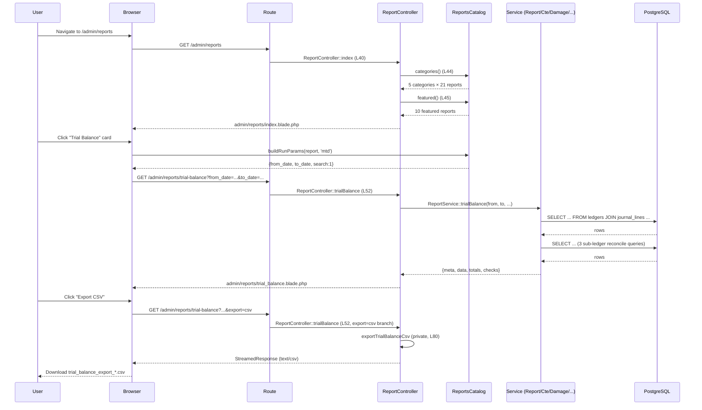
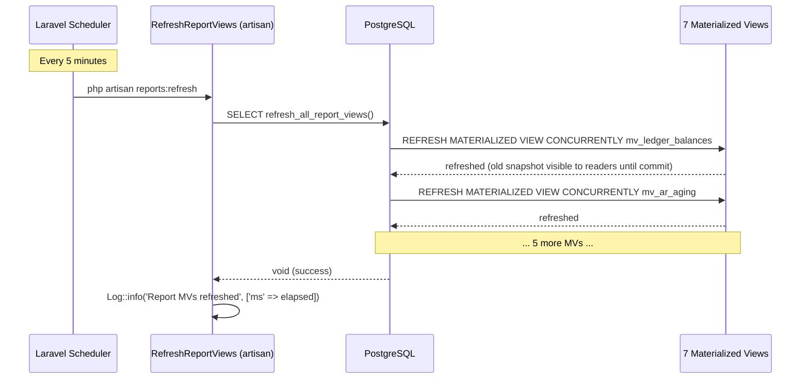
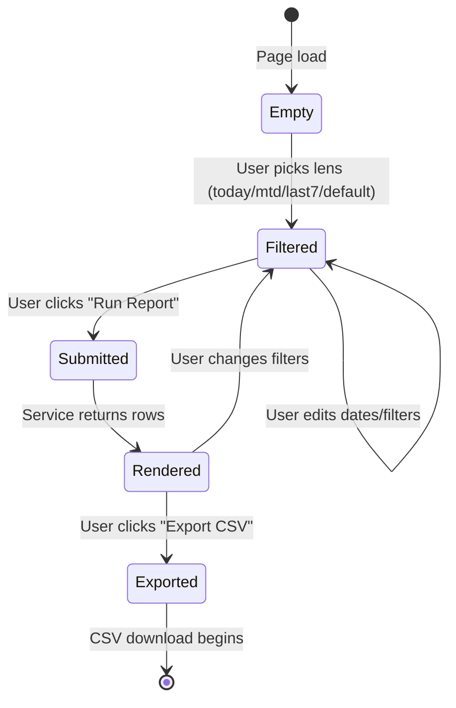

# Reports Catalog

> **Module:** Reports / Catalog & Hub
> **Audience:** Engineers, accountants, branch managers, AI assistants
> **Status:** Draft — pending review (3 CRITICAL + 6 HIGH gaps; see §14)
> **Last reviewed:** Phase 16 (Reporting & Exports)
> **Source of truth:** This file is the canonical inventory of every report in RC_ERP_v2 — the ReportsCatalog helper (`laravel/app/Helpers/ReportsCatalog.php`) is the spine, and this file documents every catalog entry + every report that exists as a route but is missing from the catalog.
> **REPORTS-2 (commit `1665ae5`):** G-048/G2 (catalog count drift — 7 orphan reports registered) + G-050/G3 (dangling `branchDemandWeekly` stub repointed to real route) resolved. All 3 CRITICALs in this file now closed (G1 closed in `b3a9fd7`, G2/G3 closed in REPORTS-2).

---

## 1. What is it?

The **Reports Catalog** is the central inventory of all reports in RC_ERP_v2. It is implemented
as a static helper class — `App\Helpers\ReportsCatalog` (`laravel/app/Helpers/ReportsCatalog.php`,
187L) — that returns a structured array of 5 categories × 21 reports, plus 7 "orphan" reports
that exist as routes but are not yet catalogued. The catalog drives the Reports Hub
(`GET /admin/reports`, blade `admin/reports/index.blade.php`) — the landing page that lets
users discover and run reports — and provides `featured()` quick-access cards and
`buildRunParams()` URL builders for the four time-lens presets (today / mtd / last7 / default).

The catalog is **metadata only**. It does not execute reports. Each catalog entry is a 9-field
record (`id`, `title`, `tagline`, `route`, `icon`, `tags`, `preset_days`, `featured`,
`filter_type`) that points at a named route; the route's controller method does the actual
work, typically by delegating to `App\Services\Reports\ReportService` (1171L),
`App\Services\Reports\CteReportService` (304L), or one of the per-module report services
(`DamageReportService`, `StockTakeVarianceReport`, `StockTakeWeeklyReport`,
`WarehouseTransferSummaryReport`, `BranchDemandWeeklyReportService`).

---

## 2. Why does it exist?

**Phase 5** brought reporting into Laravel from the legacy `app/helpers/ReportsCatalog.php`
(see class docblock `ReportsCatalog.php:6` — *"Mirrors legacy app/helpers/ReportsCatalog.php"*).
The catalog exists because the legacy ERP had no central registry — reports were scattered
across 40+ PHP pages with no discoverability. The Phase 5 rewrite introduced a single
declarative registry so that:

1. The Reports Hub can render every report card from one source of truth.
2. New reports are added by appending one `self::r(...)` entry, not by editing blade templates.
3. The featured-reports section on the dashboard can filter reports by `featured=true`.
4. Time-lens presets (today/mtd/last7) can compute default URL params from `preset_days` +
   `filter_type` — no per-report lens logic needed.

**Phase 6** extended the catalog with operational reports (`damage_report`,
`stocktake_variance`, `stocktake_weekly`, `branch_demand_weekly`). **Phase 1E** added 4 CTE
reports as routes but **forgot to add them to the catalog** (see Gap G2). The docblock at
`ReportsCatalog.php:9` still claims "all 18 reports across 5 categories" — the actual count is
21 in catalog + 7 orphans = 28 total report endpoints.

The catalog is the single source of truth for "what reports exist, where to find them, how
they're run." It is **not** the single source of truth for "how a report computes its numbers"
— that lives in the owning service's AI_CONTEXT doc (e.g. `accounting/journal-posting-rules.md`
for Trial Balance, `inventory/stock-ledger.md` for Product Stock Analysis).

---

## 3. When is it used?

The catalog is consulted:

- **On every Reports Hub page load** (`GET /admin/reports` → `ReportController::index`
  `laravel/app/Http/Controllers/Admin/ReportController.php:40-47` calls
  `ReportsCatalog::categories()` at L44 + `::featured()` at L45).
- **On every featured-report card click** — the blade `admin/reports/index.blade.php:44` calls
  `ReportsCatalog::buildRunParams($r, 'mtd')` to construct the default URL query string.
- **On dashboard quick-access widgets** (future — the `featured()` method exists for this
  purpose but is currently consumed only by the hub).

Report execution frequency (driven by the catalog's `preset_days` field + business cadence):

| Cadence | Reports | Trigger |
|---|---|---|
| Daily | `daily_cash_book`, `today_summary_cte` (orphan), `damage_report` (real-time) | Morning open, close-of-day |
| Weekly | `stocktake_weekly`, `branch_demand_weekly` (stub in catalog; real one is orphan), `warehouse_transfer_summary` (orphan) | Monday ops review |
| Monthly close | `trial_balance`, `profit_and_loss`, `balance_sheet`, `cash_flow`, `general_ledger`, `journal_entries`, `receivable_aging`, `payable_aging`, `ar_aging_cte` (orphan), `general_ledger_cte` (orphan), `gross_margin_cte` (orphan) | Accountant period close |
| On-demand | `revenue_overview`, `gross_margin` (non-CTE), `customer_performance`, `sales_funnel`, `supplier_wise_purchase`, `product_stock_analysis`, `product_movement`, `sales_audit_checklist`, `purchase_audit` (redirect), `stocktake_variance`, `branch_intercompany`, `branch_wise_ledger` | Manager / auditor request |
| Quarterly | `budgets.variance` (orphan) | Budget review |
| Ad-hoc export | all `*Export` routes (see `reports/csv-export.md`) | Compliance / external request |

---

## 4. Who uses it?

| Role | Reports typically accessed | Catalog entry point |
|---|---|---|
| Super-admin / Admin | All 28 reports + super-admin can switch employees on dashboards | Hub + direct URL |
| Accountant | Financial reports: trial_balance, profit_and_loss, balance_sheet, cash_flow, general_ledger, journal_entries, daily_cash_book, receivable_aging, payable_aging, branch_wise_ledger + reconciliation | Hub → Finance & Control category |
| Manager (branch) | All operational + financial for their branch (RLS scopes) | Hub → all categories |
| Salesman | revenue_overview, gross_margin, customer_performance, sales_funnel | Hub → Sales & Revenue category (BUT no role middleware enforces this — see Gap G1) |
| Warehouse Manager | stocktake_variance, stocktake_weekly, product_stock_analysis, product_movement, warehouse_transfer_summary, damage_report | Hub → Inventory & Stock + Operations categories |
| Auditor (external) | trial_balance, journal_entries, sales_audit_checklist, purchase_audit (redirect), reconciliation (orphan), global audit export | Direct URL (no hub access assumed) |

⚠️ **Gap G1 (CRITICAL):** The `admin/reports` route group at `routes/web.php:359-409` has **no
`role:` middleware** — every authenticated user (including `salesman`, `hr`, `driver`) can hit
every report route. RLS enforces branch isolation but not role-based read access. A salesman
can currently view the entire company Trial Balance and Profit & Loss. See §14 G1.

> ✅ RESOLVED in commit b3a9fd7 — Added `role:accountant,manager,admin` middleware to the `admin/reports` prefix group at `routes/web.php:359`. This single fix closes G-045 (catalog group), G-041 (CSV exports), and G-042 (4 CTE routes) simultaneously. NOTE: this also blocks salesmen from the 4 sales-category reports (revenue_overview, gross_margin, customer_performance, sales_funnel) — the optional per-route relaxation to `role:admin,manager,accountant,salesman` documented in §13.1 is NOT applied; track as a follow-up if cross-role read is later required. Sub-problem A (Session 1, Security/RLS cluster).

---

## 5. Related modules

The Reports Catalog cross-cuts every operational module:

| Module (Phase) | Reports owned | Catalog entries |
|---|---|---|
| Accounting (Phase 6–7) | trial_balance, profit_and_loss, balance_sheet, cash_flow, general_ledger, journal_entries, daily_cash_book, branch_wise_ledger | 8 in catalog |
| Sales (Phase 10) | revenue_overview, gross_margin (non-CTE), customer_performance, sales_funnel, gross_margin_cte (orphan) | 4 in catalog + 1 orphan |
| Purchasing (Phase 9) | supplier_wise_purchase, purchase_audit (redirect to `admin.purchase-audit.checklist`) | 2 in catalog |
| Inventory (Phase 8) | product_stock_analysis, product_movement, stocktake_variance, stocktake_weekly, damage_report, warehouse_transfer_summary (orphan), abc-report (orphan) | 5 in catalog + 2 orphans |
| Finance (Phase 11–13) | receivable_aging, payable_aging, branch_intercompany, ar_aging_cte (orphan) | 3 in catalog + 1 orphan |
| Operations | sales_audit_checklist, purchase_audit (redirect), branch_demand_weekly (stub) | 3 in catalog |
| Branch Demand (Phase 13) | branch_demand_weekly (REAL — orphan), branch_demand_weekly (STUB — in catalog) | 1 stub in catalog + 1 real orphan |
| Budgeting (Phase 12) | budgets.variance (orphan) | 0 in catalog + 1 orphan |
| Reconciliation (Phase 6) | reconciliation.index (orphan) | 0 in catalog + 1 orphan |
| CTE Reports (Phase 1E) | today_summary_cte, ar_aging_cte, general_ledger_cte, gross_margin_cte | 0 in catalog + 4 orphans |

Sibling AI_CONTEXT docs to cross-reference:

- `database/schema-overview.md` (Phase 3) — MVs as schema objects.
- `database/triggers-views-constraints.md` (Phase 3) — fn_financial_audit_trigger coverage gap (G5).
- `accounting/journal-posting-rules.md` (Phase 6) — `journal_entries.is_reversed = false` filter origin.
- `accounting/subledger-reconciliation.md` (Phase 6/7) — `ReportService::trialBalanceSubledgerCheck`.
- `accounting/running-balance.md` (Phase 6) — PHP loop vs SQL window function for GL.
- `inventory/stock-ledger.md` (Phase 8) — `mv_stock_valuation` + `stock_transactions` SSOT.
- `inventory/stock-take.md` (Phase 8) — `StockTakeVarianceReport` + `StockTakeWeeklyReport`.
- `inventory/damage.md` (Phase 8) — `DamageReportService` lifecycle filter.
- `inventory/warehouse-transfer.md` (Phase 8) — `WarehouseTransferSummaryReport`.
- `finance/branch-demand.md` (Phase 13) — `BranchDemandWeeklyReportService` (the REAL 23-column report).
- `finance/budgeting.md` (Phase 12) — `BudgetController::varianceReport` + `exportCsv`.
- `finance/dimensions-cost-centers.md` (Phase 12) — `DimensionReportingService` (no route wired yet).
- `security/branch-isolation-rls.md` (Phase 5) — RLS as primary branch-isolation mechanism.
- `security/rbac-roles-permissions.md` (Phase 5) — role matrix contradicted by G1.
- `architecture/realtime-events.md` (Phase 15) — SSE for realtime dashboard refresh (future).
- `reports/materialized-views.md` (Phase 16 sibling) — the 7 financial MVs + refresh strategy.
- `reports/cte-reports.md` (Phase 16 sibling) — the 4 CTE functions + window-function patterns.
- `reports/csv-export.md` (Phase 16 sibling) — the 22 CSV/Parquet export endpoints.
- `reports/dashboards.md` (Phase 16 sibling) — `UserPerformanceDashboardController` + API dashboard.

---

## 6. Business rules

### 6.1 Filter taxonomy

Every catalog report has a `filter_type` of either `'range'` (default — `from_date` + `to_date`)
or `'as_of'` (`as_of_date`). The `ReportsCatalog::r()` factory at `ReportsCatalog.php:164-186`
enforces this binary; there is no `'point_in_time'` or `'none'` type. The lens presets in
`ReportsHub.js:91-125` branch on `as_of` vs `range`.

**BR-CAT-1:** Reports marked `filter_type='as_of'` (e.g. `balance_sheet`, `payable_aging`,
`receivable_aging`) MUST NOT accept a `from_date`/`to_date` pair — only `as_of_date`. The
controller validates this implicitly by reading only `as_of_date` from the request.

### 6.2 Featured flag

10 of 21 catalog entries have `featured=true` (`revenue_overview`, `sales_funnel`,
`gross_margin`, `customer_performance`, `payable_aging`, `receivable_aging`, `trial_balance`,
`profit_and_loss`, `general_ledger`, `journal_entries`, `damage_report`). Featured reports
appear in the dashboard quick-access section (planned) and get larger cards on the hub.

### 6.3 Preset days

The `preset_days` field controls the default time window when a user clicks a report card
without specifying a lens:

- `preset_days=0` → defaults to `as_of=today` (for balance-sheet-style reports) or MTD (for range reports).
- `preset_days=7` → last 7 days (e.g. `daily_cash_book`, `stocktake_weekly`, `branch_demand_weekly`).
- `preset_days=30` → last 30 days (most operational reports).

**BR-CAT-2:** The `preset_days` field is consulted ONLY by the `'default'` lens in
`ReportsCatalog::buildRunParams()` at `ReportsCatalog.php:139-159`. The `'today'`, `'mtd'`,
and `'last7'` lenses override `preset_days` with their own windows. See Gap G11 for an
off-by-one issue: `daily_cash_book` has `preset_days=7`, but the `'last7'` lens sets
`from=today-6` (7 days inclusive), not `from=today-7` (8 days inclusive).

### 6.4 Lens modes

`ReportsHub.js:91-125` defines 4 lens modes: `today` (from=to=today), `mtd`
(from=first-of-month, to=today), `last7` (from=today-6, to=today), `default`
(from=today-preset_days, to=today). The lens is applied client-side via
`ReportsCatalog::buildRunParams()`.

### 6.5 Branch isolation

**BR-CAT-3:** Every report query MUST be scoped by `branch_id` via RLS + global scopes +
middleware. Never write `Model::all()` or unscoped cross-branch queries. The
`StockTakeVarianceReport` docblock at `laravel/app/Services/Stock/StockTakeVarianceReport.php:26-29`
explicitly documents: *"RLS scopes the session row"* — no manual `WHERE branch_id = ?` is needed
because the database enforces it. See `security/branch-isolation-rls.md` for the full RLS
policy matrix.

⚠️ **Caveat (Gap G1, materialized-views.md G1):** Materialized views (`mv_stock_valuation`,
`mv_ar_aging`, `mv_ap_aging`, `mv_branch_intercompany`, `mv_product_movement_summary`) do NOT
have RLS policies. Reports reading from MVs must explicitly `WHERE branch_id = ?`. See
`reports/materialized-views.md` §14 G1.

### 6.6 Refresh strategy

Reports fall into 3 refresh classes:

- **Real-time** (raw SQL or DB::table query) — Trial Balance, P&L, Balance Sheet, Cash Flow,
  General Ledger, Daily Cash Book, Branch-wise Ledger, Revenue Overview, Gross Margin (non-CTE),
  Supplier-wise Purchase, Product Movement, Sales Audit Checklist, Stocktake Variance, Stocktake
  Weekly, Damage Report, all 4 CTE reports. The query runs on every page load.
- **MV-refresh** (@5 min via pg_cron + Laravel scheduler) — Journal Entries
  (`mv_journal_entry_summary`), Receivable Aging today (`mv_ar_aging`), Payable Aging today
  (`mv_ap_aging`), Product Stock Analysis (`mv_stock_valuation`), Branch Intercompany
  (`mv_branch_intercompany`). Reports reading these MVs see data up to 5 minutes stale.
- **On-demand** (CSV export — see `reports/csv-export.md`) — Trial Balance, Cash Flow,
  Stocktake Variance, Stocktake Weekly, Damage Report, Branch Demand Weekly, Budget Variance,
  plus 14 master-data exports.

### 6.7 Reconciliation checks

Several catalog reports include built-in integrity checks:

- **Trial Balance:** `balanced = abs(SUM(debit) - SUM(credit)) < 0.01` + 3 sub-ledger
  reconciliation checks (AR / AP / Employee_Payable GL vs sub-ledger balances).
  `ReportService::trialBalance` at `laravel/app/Services/Reports/ReportService.php:37-203`,
  sub-checks at `:209-293`.
- **Balance Sheet:** `balanced = abs(total_assets - (total_liabilities + total_equity)) < 0.01`.
  `ReportService::balanceSheet` at `:497-558`.
- **Cash Flow:** `plugs_to_gl_cash = (net_cash_change ≈ GL cash movement)`.
  `ReportService::cashFlow` at `:566-835`.
- **AR Aging (CTE):** `checks.matches_gl = (SUM(sub_ledger) = GL AR control account balance)`.
  `CteReportService::arAging` at `laravel/app/Services/Reports/CteReportService.php:110-144`,
  CTE function `rcerp_ar_aging_cte` migration L251-389.
- **AR/AP Aging (non-CTE):** Same GL-vs-sub-ledger reconciliation, computed in PHP.
  `ReportService::receivableAging` at `:843-907`, `payableAging` at `:912-974`.

### 6.8 Reversal handling

**BR-CAT-4:** Every financial report query MUST filter `COALESCE(je.is_reversed, false) = false`
on `journal_entries`. This is the journal-posting rule from
`accounting/journal-posting-rules.md` §4. Reports that read from MVs inherit this filter
because the MV definitions include `WHERE COALESCE(je.is_reversed, false) = false` in their
underlying SELECT (see `mv_ledger_balances` at migration
`2025_01_03_000001_create_report_materialized_views.php:30-51`).

Sales-side reports filter `sales_invoices.is_reversed = false` AND `status NOT IN
('cancelled', 'reversed')` AND `deleted_at IS NULL` — see the CTE function
`rcerp_today_summary` base CTE `active_invoices` at migration
`2025_01_21_000002_add_cte_complex_queries.php:68-75`.

### 6.9 Sub-ledger reconciliation

**BR-CAT-5:** The Trial Balance report MUST include a sub-ledger reconciliation footnote
comparing GL AR/AP/Employee_Payable control account balances to the corresponding sub-ledger
balances. This is implemented in `ReportService::trialBalanceSubledgerCheck` at
`:209-293` (6 SQL queries: 3 GL + 3 sub-ledger). The AR Aging CTE
(`rcerp_ar_aging_cte`) does the same reconciliation in SQL — see `reports/cte-reports.md` §6.

---

## 7. Technical implementation

### 7.1 The ReportsCatalog helper

Static class, 6 methods. Full source at `laravel/app/Helpers/ReportsCatalog.php` (187L):

```php
namespace App\Helpers;

class ReportsCatalog
{
    public static function categories(): array       // L19-93  — 5 categories × 21 reports
    public static function all(): array               // L100-113 — flat [id => report+category_*]
    public static function get(string $id): ?array    // L118-121 — single report lookup
    public static function featured(): array          // L128-131 — filter featured=true
    public static function buildRunParams(array $report, string $lens = 'mtd'): array  // L139-159
    private static function r(string $id, string $title, string $tagline, string $route,
                                string $icon, array $tags, int $presetDays,
                                bool $featured = false, string $filterType = 'range'): array  // L164-186
}
```

Each catalog entry is a 9-field record built by `r()`:

| Field | Type | Purpose |
|---|---|---|
| `id` | string | Unique slug (e.g. `trial_balance`) |
| `title` | string | Display name (e.g. "Trial Balance") |
| `tagline` | string | One-line description |
| `route` | string | Named route (e.g. `admin.reports.trialBalance`) |
| `icon` | string | FontAwesome class (e.g. `fa-scale-balanced`) |
| `tags` | string[] | Search tags (e.g. `['gl', 'export']`) |
| `preset_days` | int | Default window: 0=as_of/MTD, 7=weekly, 30=monthly |
| `featured` | bool | Show on dashboard quick-access |
| `filter_type` | string | `'range'` (from+to) or `'as_of'` (single date) |

**Call sites (grep `ReportsCatalog::` across `laravel/app/` + `laravel/resources/views/`):**
- `ReportController::index` L44 — `ReportsCatalog::categories()`
- `ReportController::index` L45 — `ReportsCatalog::featured()`
- `admin/reports/index.blade.php:44` — `ReportsCatalog::buildRunParams($r, 'mtd')`
- `admin/reports/index.blade.php:65` — `route($r['route'], $params)`

That's it. `ReportsCatalog::get()` is currently **unused** in the codebase (grep returned only
the class definition file) — see Gap G16 (dead method).

### 7.2 The ReportController

`laravel/app/Http/Controllers/Admin/ReportController.php` (1079L) is the primary report
controller. It injects 6 services at L28-35:

```php
public function __construct(
    ReportService $reportService,
    CteReportService $cteReportService,
    DamageReportService $damageReportService,
    StockTakeVarianceReport $varianceReport,
    StockTakeWeeklyReport $weeklyReport,
    WarehouseTransferSummaryReport $transferSummary,
) { ... }
```

The controller has 33 public methods (one per report route + hub + exports). Most are thin
wrappers: parse request → call service → render blade. Examples:

- `trialBalance()` at `:52-75` — 24 lines: parse filters, call `$this->reportService->trialBalance(...)`, render `admin/reports/trial_balance.blade.php`. If `?export=csv`, delegate to `exportTrialBalanceCsv()` (private, `:80-174`).
- `branchDemandWeekly()` at `:812-826` — **stub**: 5-column paginated list of `branch_demands` rows. The real 23-column report is at `admin.branch-demands.weekly-report` (see Gap G3).
- `purchaseAudit()` at `:635-639` — **permanent redirect** to `admin.purchase-audit.checklist` (see Gap G13).

### 7.3 The service layer

The catalog delegates computation to 8 services:

| Service | Lines | Reports powered | SQL pattern |
|---|---|---|---|
| `App\Services\Reports\ReportService` | 1171 | trial_balance, profit_and_loss, balance_sheet, cash_flow, general_ledger, journal_entries, daily_cash_book, receivable_aging, payable_aging, stock_valuation, branch_intercompany | Raw SQL heredoc + DB::table + MV reads |
| `App\Services\Reports\CteReportService` | 304 | today_summary_cte, ar_aging_cte, general_ledger_cte, gross_margin_cte | DB::selectOne("SELECT rcerp_*_cte(...) AS result") |
| `App\Services\Reports\DamageReportService` | 434 | damage_report | DB::table query builder |
| `App\Services\Stock\StockTakeVarianceReport` | 229 | stocktake_variance | DB::table + PG GENERATED column `sti.difference` |
| `App\Services\Stock\StockTakeWeeklyReport` | 195 | stocktake_weekly | DB::table + 3 correlated sub-queries |
| `App\Services\Stock\WarehouseTransferSummaryReport` | 287 | warehouse_transfer_summary (orphan) | Raw SQL via DB::select, 5 sub-builders |
| `App\Services\BranchDemand\BranchDemandWeeklyReportService` | 1076 | branch_demand_weekly (REAL, orphan) | DB::table per-column per-day (N+1-per-day pattern) |
| `App\Services\Budgeting\DimensionReportingService` | 261 | (no route wired yet) | Raw SQL |

Plus 2 sibling controllers that aren't `ReportController` but serve catalog routes:
- `CustomerPerformanceController` (537L) — `customer_performance` report.
- `SalesFunnelController` (536L) — `sales_funnel` report.

See Gap G14 (catalog pretends these are `ReportController` routes).

### 7.4 SQL patterns

The catalog uses 4 SQL patterns:

1. **Raw SQL heredoc** (Trial Balance, P&L, Balance Sheet, Cash Flow, GL, Daily Cash Book,
   Branch-wise Ledger, Supplier-wise Purchase, Gross Margin non-CTE) — `DB::select($sql, $bindings)`.
2. **DB::table query builder** (Damage Report, Stocktake Variance, Stocktake Weekly, Revenue
   Overview, Product Movement, Branch Demand Weekly stub) — fluent `->where()->get()`.
3. **MV reads** (Journal Entries, AR/AP Aging today, Product Stock Analysis, Branch Intercompany)
   — `DB::table('mv_*')->where(...)->paginate(50)`. See `reports/materialized-views.md`.
4. **CTE function call** (Today Summary, AR Aging CTE, General Ledger CTE, Gross Margin CTE) —
   `DB::selectOne("SELECT rcerp_*_cte(...) AS result", [...])` returns single jsonb row. See
   `reports/cte-reports.md`.

### 7.5 Front-end

- `laravel/public/assets/js/ReportsHub.js` (167L) — front-end report hub behaviour. 4 lens
  presets (`today`/`mtd`/`last7`/`default`), search filter, category tabs, pin/unpin reports
  to localStorage key `rc_erp_report_pins`, collapse/expand categories. AJAX-loaded report
  cards. See Gap G15 (localStorage un-namespaced — staging+prod on same origin would collide).
- `laravel/public/assets/css/reports-premium.css` (529L) — 67 structural CSS classes with 5
  accent colors (sales/purchase/inventory/finance/ops). Premium theme intent.

### 7.6 Refresh pipeline

`ReportService::refreshMaterializedViews()` at `:1167-1170` is the API hook:

```php
public function refreshMaterializedViews(): void
{
    DB::statement('SELECT refresh_all_report_views()');
}
```

Called by:
- `php artisan reports:refresh` (`laravel/app/Console/Commands/RefreshReportViews.php:29`)
- Laravel scheduler (`laravel/routes/console.php:11-17`) — every 5 min, `withoutOverlapping`,
  `runInBackground`
- pg_cron (`laravel/database/migrations/2025_01_20_000009_add_pg_cron_scheduled_jobs.php:222-228`)
  — every 5 min
- `ConsolidationService::refreshMaterializedViews()` (Phase 13) — after consolidation run

See `reports/materialized-views.md` for the full MV refresh strategy + the dual-scheduler gap (G5).

---

## 8. Important database tables

The Reports Catalog reads from (no writes — all reports are read-only):

**Accounting tables:** `ledgers`, `journal_entries`, `journal_lines`, `manual_journals`,
`manual_journal_lines`, `customer_ledger`, `supplier_ledger`, `employee_ledger`, `cash_ledger`,
`branch_ledger`, `fiscal_years`, `periods`.

**Sales tables:** `sales_invoices`, `sales_invoice_items`, `sales_challans`,
`sales_challan_items`, `sales_returns`, `sales_return_items`, `customer_payments`,
`commission_entries`, `commission_rules`, `commission_rule_targets`.

**Purchasing tables:** `purchase_orders`, `purchase_receives`, `purchase_returns`,
`supplier_payments`.

**Inventory tables:** `products`, `product_groups`, `warehouses`, `warehouse_stock`,
`stock_transactions`, `stock_take_sessions`, `stock_take_items`, `stock_take_warehouses`,
`stock_adjustments`, `stock_adjustment_items`, `damage_invoices`, `damage_invoice_items`,
`warehouse_transfers`, `warehouse_transfer_items`, `branch_demands`, `branch_demand_items`.

**Master data:** `branches`, `customers`, `suppliers`, `employees`, `users`, `banks`.

**Budgeting:** `budgets`, `budget_lines`, `dimensions`, `dimension_values`.

**Materialized views (7 financial-report MVs, see `reports/materialized-views.md`):**
`mv_ledger_balances`, `mv_ar_aging`, `mv_ap_aging`, `mv_stock_valuation`,
`mv_journal_entry_summary`, `mv_branch_intercompany`, `mv_product_movement_summary`.

**CTE functions (4, see `reports/cte-reports.md`):** `rcerp_today_summary(integer, date)`,
`rcerp_ar_aging_cte(date, integer)`, `rcerp_general_ledger_cte(date, date, integer, integer)`,
`rcerp_gross_margin_cte(date, date, integer)` — all `RETURNS jsonb LANGUAGE plpgsql STABLE`,
defined in migration `2025_01_21_000002_add_cte_complex_queries.php` (725L).

**Refresh function:** `refresh_all_report_views()` — `RETURNS void LANGUAGE plpgsql`, defined
in migration `2025_01_03_000001_create_report_materialized_views.php:254-267`.

**Convenience views:** `v_today_summary`, `v_ar_aging_today` — defined in migration
`2025_01_21_000002_add_cte_complex_queries.php:701-710` for direct psql access.

---

## 9. Related services

See §7.3 for the 8 services + 2 sibling controllers.

---

## 10. Related models

The catalog does not use Eloquent models directly — it delegates to services. The services use:

- `Ledger` (active scope used in `ReportService::trialBalance` at `:311`)
- `Branch::active()` (used 14× across `ReportController`)
- `Warehouse::active()`, `Product::active()`, `Employee::active()`
- `Customer`, `Supplier`
- `DamageInvoice` (`DAMAGE_TYPES` constant at `laravel/app/Models/DamageInvoice.php:170` used in
  `DamageReportService::byCategory`)
- `JournalEntry`, `JournalLine`
- `StockTakeSession`, `StockTakeItem`
- `Dimension`, `DimensionValue`

---

## 11. Important workflows

### 11.1 Reports Hub → report execution (sequenceDiagram)



### 11.2 MV refresh cycle (sequenceDiagram)



### 11.3 Report filter form lifecycle (stateDiagram)



---

## 12. Known edge cases

1. **Catalog drift (Gap G2, G3, G13):** The catalog claims 18 reports but has 21; 7 reports
   exist as routes but are not catalogued (4 CTE reports, ABC, Budget Variance, Reconciliation,
   real Branch Demand Weekly). The catalog's `branch_demand_weekly` entry is a STUB — the real
   23-column report is at `admin.branch-demands.weekly-report`. The catalog's `purchase_audit`
   entry permanently redirects to `admin.purchase-audit.checklist`.
2. **grossMargin non-CTE inaccuracy (Gap G9):** `ReportController::grossMargin` at `:491-521`
   uses a single `sales_challans.issue_cost` column — inaccurate. The CTE version
   (`rcerp_gross_margin_cte`) joins invoice_items → challan_items → stock_transactions for
   accurate per-product COGS. No documented deprecation policy.
3. **generalLedger PHP-loop vs CTE window-function duplication (Gap G10):**
   `ReportService::generalLedger` at `:979-1035` computes running balance in PHP via
   `$running[$key] += $r->debit - $r->credit`. The CTE version uses
   `SUM() OVER (PARTITION BY ledger_id ORDER BY ... ROWS UNBOUNDED PRECEDING)`. No automated
   test verifies they produce the same numbers.
4. **branchIntercompany orWhere not grouped (Gap G12):** `ReportService::branchIntercompany`
   at `:1141-1162` line 1145: `->when($branchId, fn($q) => $q->where('from_branch_id', $branchId)->orWhere('to_branch_id', $branchId))`
   — the `orWhere` is NOT wrapped in a grouped closure. Currently safe (no other wheres), but
   fragile if any future `->where(...)` is added.
5. **daily_cash_book preset_days off-by-one (Gap G11):** `preset_days=7` but the `'last7'` lens
   sets `from=today-6` (7 days inclusive), not `from=today-7` (8 days inclusive).
6. **Today AR/AP aging uses MV (≤5min stale); historical uses direct query (real-time):**
   `ReportService::receivableAging` at `:843-907` branches on `$asOfDate->isToday()` — if
   today, read from `mv_ar_aging` (refreshed every 5 min, so up to 5 min stale); if historical,
   fall back to direct SQL (real-time). The user is not told which path was taken.
7. **Damage byStatus counts ALL statuses:** `DamageReportService::byStatus` counts
   draft/submitted/approved/confirmed/cancelled/rejected — every other damage method filters
   `status='confirmed'`. The byStatus chart includes non-final states.
8. **StockTakeWeeklyReport includes in-flight sessions:** Per legacy parity, includes
   `'counting'`/`'submitted'`/`'approved'` sessions (not just `'posted'`). Documented at
   `StockTakeWeeklyReport.php:47`.
9. **Cash flow excludes retained_earnings from financing activities:** Already captured via net
   profit; including it again would double-count. Documented at `ReportService::cashFlow:566-835`.
10. **Balance sheet rolls unclosed Income/Expense into Equity:** As-of-date balance sheet treats
    the current-period result as equity (retained earnings plug). Documented at
    `ReportService::balanceSheet:497-558`.
11. **ReportsHub.js pin storage is un-namespaced localStorage (Gap G15):** Key `rc_erp_report_pins`
    is shared across all apps on the same origin. If staging + prod run on the same domain,
    pinned reports collide.
12. **mv_branch_intercompany recreated 3 times by partitioning migrations:** `2026_07_29_000013`,
    `2026_07_30_000003`, `2026_08_02_000002` all DROP + recreate this MV against the new
    partitioned parents. See `reports/materialized-views.md` §12 EC4.
13. **DamageReportService.getDetailLines limit=500 (csv-export G27):** The damage export
    silently caps at 500 rows. See `reports/csv-export.md` §14 G27.

---

## 13. Future improvements

1. **Add role middleware to all report routes (G1).** Add `->middleware('role:accountant,manager,admin')`
   to the `admin/reports` prefix group at `routes/web.php:359`. Sales-category reports may
   relax to `role:admin,manager,accountant,salesman` if cross-role read is intended.
2. **Reconcile catalog with reality (G2, G3, G13).** Add the 7 missing reports to the catalog
   (4 CTE + ABC + Budget Variance + Reconciliation + real Branch Demand Weekly). Remove or
   repoint the `purchase_audit` redirect entry. Replace the `branch_demand_weekly` STUB entry
   with a repoint to `admin.branch-demands.weekly-report`.
3. **Create FormRequests for report filters (G6).** Create
   `App\Http\Requests\Reports\ReportRangeRequest` (validates `from_date`/`to_date` as date +
   `branch_id` as nullable int + optional `export=csv` enum) + `ReportAsOfRequest` +
   `StocktakeVarianceRequest`. Apply to controller method signatures.
4. **Add tests for all 57 untested report service methods (G7).** Add
   `tests/Feature/Reports/TrialBalanceTest.php` etc. Each test seeds known journal entries,
   calls the method, asserts (a) totals match, (b) checks pass (Dr=Cr, balanced,
   plugs_to_gl_cash), (c) branch_id filter works, (d) empty period returns empty data.
5. **Deprecate duplicate non-CTE routes (G8, G9, G10).** Collapse AR aging, gross margin, and
   general ledger to one route each with auto-selection: MV for today's aging, CTE for
   historical; CTE for gross margin (deprecate non-CTE); CTE for GL (deprecate PHP loop).
6. **Fix branchIntercompany orWhere grouping (G12).** Wrap the OR in a closure.
7. **Update stale docblock (G16).** Change `ReportsCatalog.php:6` from "Phase 5" to "Phase 5 +
   Phase 6 + Phase 1E"; update L9 count from "18" to actual count.
8. **Move CustomerPerformance + SalesFunnel into ReportController or document the split (G14).**
   Either move the 2 sibling controllers' methods into `ReportController` (and delete the
   siblings), or document the split in this doc + cross-link the siblings' own AI_CONTEXT docs.
9. **Attach fn_financial_audit_trigger to 14 missing transactional tables (G5).** The trigger
   is currently on only 9 tables (journal_entries, journal_lines, manual_journals,
   manual_journal_lines, customer_payments, supplier_payments, money_transfers, other_incomes,
   other_expenses, employee_transactions). Missing: sales_invoices, sales_challans,
   sales_invoice_items, sales_challan_items, purchase_receives, purchase_return_items,
   branch_demands, warehouse_transfers, stock_adjustments, damage_invoices,
   damage_invoice_items, stock_take_sessions, stock_take_items, stock_transactions.
10. **Refresh `database/sql/07_views_triggers_constraints.sql` with MV + CTE DDL (G4).** The
    canonical DDL file is stale — none of the 7 MVs, 4 CTE functions, or the refresh function
    appear in `database/sql/`. Add them (or add a header comment pointing readers to the
    migration files).
11. **Add a "report comparison" feature** showing side-by-side numbers from non-CTE vs CTE
    versions to verify equivalence before deprecation.
12. **Add async report generation for large datasets.** Current GL / Cash Flow can be slow on
    multi-year ranges. Use a queued job + SSE notification when complete.
13. **Add PDF export alongside CSV** (Phase 19+). Many auditors prefer PDF for sign-off.
14. **Wire `ReportService::refreshMaterializedViews()` into journal posting pipeline.** The
    docblock at `RefreshReportViews.php:11` claims "Also run on-demand after journal postings"
    but no caller exists. See `reports/materialized-views.md` §14 G15.
15. **Add a "report last-run" audit log.** Track which user ran which report with which filters
    at what time. Currently no audit trail for report execution (only for exports — and even
    that is missing; see `reports/csv-export.md` §14 G6).

---

## 14. Gap catalogue

| ID | Severity | Evidence | Impact | Recommended fix |
|---|---|---|---|---|
| **G1** | **CRITICAL** | `routes/web.php:342` (hub) + `:359-409` (`admin/reports` prefix group with 21 routes) have NO `->middleware('role:...')`. Only inside `auth` group (`:90`). | Any authenticated user — salesman, driver, warehouse_worker, accountant — can hit `/admin/reports/trial-balance`, `/admin/reports/profit-and-loss`, `/admin/reports/balance-sheet`, `/admin/reports/cash-flow`, all 4 CTE reports, all CSV exports. RLS only enforces branch isolation, NOT role-based read access. Salesmen can see entire company P&L. | Add `->middleware('role:accountant,manager,admin')` to the prefix group (`:359`); add `->middleware('role:admin,manager,accountant,salesman')` to sales-category reports if cross-role read is intended. |
| **G2** | **CRITICAL** | `ReportsCatalog.php:9` docblock claims "all 18 reports across 5 categories" but `categories()` returns 21 reports. Additionally, 7 reports exist as routes but are NOT in catalog: `today_summary_cte`, `ar_aging_cte`, `general_ledger_cte`, `gross_margin_cte`, `abc-report`, `budgets.variance`, `reconciliation.index`. | Users cannot discover 7 reports from the hub. The 4 CTE reports — a major Phase 1E investment — are reachable only by direct URL. The catalog-vs-reality drift means the hub is the de-facto UI surface but it lies. | Either (a) add all 7 missing reports to catalog with new `phase_1e` / `phase_6` categories, or (b) update docblock count + add a "Phase 1E: CTE Reports" section + ABC + budget variance + reconciliation cards. |

> ✅ **RESOLVED — G-048 / G2 (REPORTS-2, commit `1665ae5`).** All 7 orphan reports are now registered in `ReportsCatalog::categories()`. The catalog is now the single source of truth for report discovery (32 reports across 6 categories):
>   - **`abc_report`** → added to the `inventory` category (route `admin.stock-take.abc-report`).
>   - **`budgets_variance`** → added to the `finance` category (route `admin.budgets.variance`).
>   - **`reconciliation_index`** → added to the `operations` category (route `admin.reconciliation.index`).
>   - **4 CTE reports** (`today_summary_cte`, `ar_aging_cte`, `general_ledger_cte`, `gross_margin_cte`) → new `cte` category (routes `admin.reports.todaySummaryCte` / `arAgingCte` / `generalLedgerCte` / `grossMarginCte`).
>
> The class docblock is updated from "Phase 5 / 18 reports across 5 categories" to "Phase 5 + Phase 6 + Phase 1E / 32 reports across 6 categories". G16 (the stale "Phase 5" provenance line) is also closed by this same docblock update. The hub UI now renders a 6th card group ("Phase 1E — CTE Reports") so users can discover the 4 CTE reports without knowing direct URLs.
| **G3** | **CRITICAL** | `ReportsCatalog.php:88` entry `branch_demand_weekly` → `admin.reports.branchDemandWeekly` → `ReportController::branchDemandWeekly` (`:812-826`) renders a 5-column paginated list of `branch_demands` rows. The REAL 23-column `BranchDemandWeeklyReportService::generateDailyReport` (`:76-116`) is reached via `admin.branch-demands.weekly-report` (`web.php:715`) → `BranchDemandReportController::weekly` (`:56`). | Users clicking the "Branch Demand — Weekly" card in the hub get a useless 5-column list, not the 23-column Excel-audit-sheet replication. The real report is hidden in the Branch Demand module's own routes. | Repoint the catalog entry to `admin.branch-demands.weekly-report` (the real route), OR replace `ReportController::branchDemandWeekly` body to call `BranchDemandWeeklyReportService::generateDailyReport` + render the real view. |

> ✅ **RESOLVED — G-050 / G3 (REPORTS-2, commit `1665ae5`).** The `branch_demand_weekly` catalog entry is repointed from `admin.reports.branchDemandWeekly` (the 5-column stub) to `admin.branch-demands.weekly-report` (the real 23-column `BranchDemandWeeklyReportService::generateDailyReport` report). The tagline is updated to mention the 23-column Excel-audit replication so users know what they're getting.
>
> The stub `ReportController::branchDemandWeekly` method is retained as a redirect to the real route (forwarding `$request->query()`) so any existing bookmarks or links targeting `admin.reports.branchDemandWeekly` survive the hop with date filters intact. The route registration at `routes/web.php:427` is unchanged (still `admin.reports.branchDemandWeekly`) — only the controller body changed from a paginated query to a redirect. The `admin.reports.branch_demand_weekly` blade view is now dead code (unreachable) but retained to minimize blast radius; it can be removed in a future cleanup.
| **G4** | **HIGH** | `database/sql/07_views_triggers_constraints.sql` has ZERO matches for `mv_`, `rcerp_`, `refresh_all_report_views`, `fn_financial_audit_trigger`. The 7 MVs + 4 CTE functions + `refresh_all_report_views()` live ONLY in migrations (`2025_01_03_000001_create_report_materialized_views.php` + `2025_01_21_000002_add_cte_complex_queries.php`). | The canonical DDL file is stale. Developers reading `07_views_triggers_constraints.sql` to understand the schema miss 7 MVs + 4 CTE functions entirely. DBAs doing point-in-time recovery or fresh provisioning from the SQL file (rather than `php artisan migrate`) get a database missing these objects. Reports crash on first call. | Either (a) append MV + CTE function DDL to `07_views_triggers_constraints.sql` (preferred), or (b) add a header comment pointing readers to the migration files. Cross-reference `database/triggers-views-constraints.md` Phase 3 to update. |

> ✅ **RESOLVED — G-128/G-129 (REPORTS-AUDIT-2).** The 7 MVs + `refresh_all_report_views()` + 4 `rcerp_*_cte` STABLE PL/pgSQL functions + 2 convenience views are now mirrored VERBATIM in `database/sql/07_views_triggers_constraints.sql` (appendix section, +885L). The mirror preserves all migration comments (including the `sales_challan_items.sales_challan_id` schema-fix notes). The 4 CTE function DDL bodies (~725L total in the migration) are copied in full — no partial extraction. On a fresh database, run `php artisan migrate` — the migrations are idempotent. The baseline file is documentation + DBA point-in-time recovery use only.
| **G5** | **HIGH** | `database/sql/02_accounting.sql:446-455` attaches `fn_financial_audit_trigger` to only 9 tables. NOT attached to 14+ transactional tables that feed reports: `sales_invoices`, `sales_challans`, `sales_invoice_items`, `sales_challan_items`, `purchase_receives`, `purchase_return_items`, `branch_demands`, `warehouse_transfers`, `stock_adjustments`, `damage_invoices`, `damage_invoice_items`, `stock_take_sessions`, `stock_take_items`, `stock_transactions`. **Partial progress (2026-09-01):** SALES-3 (`de2b6e6`) attached the trigger to 4 of the 14 sales tables listed here (`sales_invoices`, `sales_challans`, `sales_invoice_items`, `sales_challan_items` + 10 more sales/commission tables). FINANCE-1 (`0385b87`) attached `branch_demands` + `warehouse_transfers` (+ 12 more finance tables). **Still NOT attached:** `purchase_receives`, `purchase_return_items`, `stock_adjustments`, `damage_invoices`, `damage_invoice_items`, `stock_take_sessions`, `stock_take_items`, `stock_transactions` (8 tables — purchasing + inventory cluster). | 8 transactional tables that feed reports still bypass `financial_audit_log`. A stock_take_session cancelled, a damage_invoice reversed — none produce audit trail rows. Reports that join `financial_audit_log` for change-history miss whole classes of mutations. | Attach `trg_audit_*` triggers to the 8 remaining missing tables. The trigger function is generic (uses `TG_TABLE_NAME` + `TG_OP`). Cross-reference `accounting/financial-audit-log.md` §7.3. |

> ✅ **RESOLVED — G-131 (REPORTS-AUDIT-3).** `purchase_receives` + `purchase_return_items` were already attached by migration `2026_09_03_000002_attach_financial_audit_trigger_to_purchase_tables.php` (PURCHASING-1) — the G5 row evidence was stale on those 2 of the 8 listed tables. The ACTUAL remaining 6 inventory tables (`stock_adjustments`, `damage_invoices`, `damage_invoice_items`, `stock_take_sessions`, `stock_take_items`, `stock_transactions`) are now attached via migration `2026_09_06_000002_attach_financial_audit_trigger_to_inventory_tables.php` — mirrors the structure of the PURCHASING-1 pattern (defensive `fn_financial_audit_trigger()` existence check, `attachAuditTrigger()` private helper, `DROP TRIGGER IF EXISTS` before `CREATE TRIGGER`, idempotent). `stock_transactions` is PARTITION BY RANGE(transaction_date) — PG 12+ auto-inherits the trigger to all existing AND future monthly partitions when attached to the parent. The SQL baseline `database/sql/03_stock.sql` is also updated: 6 `CREATE TRIGGER trg_audit_<table> ...` statements appended at the end of the file (DDL baseline mirror — `php artisan migrate` remains the canonical install path; the SQL file appendix is documentation + DBA point-in-time recovery use). With this attachment, EVERY transactional table that feeds financial reports is now hash-chain-audited via `financial_audit_log`.
| **G6** | **HIGH** | `laravel/app/Http/Requests/` directory contains ZERO report-related FormRequests. All 13 report controllers + 33 `ReportController` methods use inline `$request->input('from_date')`, `$request->input('branch_id')`, etc. with no validation. | ~50+ unvalidated inputs. Malformed `from_date=abc` will throw inside `Carbon::parse()`. Negative `branch_id=-1` will pass through to SQL. `account_type='DROP TABLE'` would be parameterized-safe but logically invalid. No 422 responses — users see 500 errors. | Create `App\Http\Requests\Reports\ReportRangeRequest` + `ReportAsOfRequest` + `StocktakeVarianceRequest`. Apply to controller method signatures. |

> ✅ **RESOLVED — G-133 (REPORTS-AUDIT-3 PARTIAL → REPORTS-AUDIT-5 FULL).** 3 FormRequests created under `app/Http/Requests/Reports/` in REPORTS-AUDIT-3, plus 1 new subclass added in REPORTS-AUDIT-5:
>   - `ReportRangeRequest` — base FormRequest for report endpoints that accept `from_date` / `to_date` / `branch_id` / `format` filters. Adds `dateRange(): array` (defaults to start-of-month → today if both null, mirrors `parseDateRange()`) + `dateRangeDays(): int` (inclusive day count for cap checks; 0 if either date missing).
>   - `ReportAsOfRequest` — for report endpoints that accept a single `as_of_date` (defaults to today). Also accepts `date` as an alias (the `todaySummaryCte` method reads `$request->input('date')` instead of `as_of_date`). Adds `asOfDate(): Carbon`.
>   - `StocktakeVarianceRequest extends ReportRangeRequest` — adds `session_id` / `warehouse_id` / `product_id` exist-checked integers.
>   - `GlobalAuditLogRequest extends ReportRangeRequest` (NEW — REPORTS-AUDIT-5) — adds `from` / `to` / `table` / `action` / `user_id` (exists:users,id) / `record_id` / `search` validation. The Global Audit viewer uses `from` / `to` (NOT `from_date` / `to_date`) — this subclass validates BOTH naming conventions so a future rename does not silently drop validation. The `action` field is intentionally a free-form nullable string (NOT an enum) — the controller already restricts the query to `master_data_%` actions via a LIKE filter, so any string is either an exact-match refinement or yields zero rows.
>
> **REPORTS-AUDIT-3 (PARTIAL — 12 of 33 ReportController methods):**
>   - **ReportRangeRequest** (5): `trialBalance`, `profitAndLoss`, `cashFlow`, `generalLedgerCte`, `grossMarginCte`.
>   - **ReportAsOfRequest** (5): `balanceSheet`, `receivableAging`, `payableAging`, `arAgingCte`, `todaySummaryCte`.
>   - **StocktakeVarianceRequest** (2): `stocktakeVariance`, `stocktakeVarianceExport`.
>
> **REPORTS-AUDIT-5 (FULL — remaining 18 ReportController methods + 8 sibling controllers):**
>   - **ReportController** — 18 additional methods retrofitted to `ReportRangeRequest`: `generalLedger`, `journalEntries`, `dailyCashBook`, `branchIntercompany`, `branchWiseLedger`, `revenueOverview`, `grossMargin` (redirect-only — swapped for consistency), `customerPerformance`, `supplierWisePurchase`, `productStockAnalysis`, `productMovement`, `salesAuditChecklist`, `purchaseAudit` (redirect-only), `stocktakeWeekly`, `stocktakeWeeklyExport`, `branchDemandWeekly` (redirect-only), `damageReport`, `damageReportExport`. The single remaining `Request $request` on a routed method is `stocktakeVarianceJournal(Request $request, int $session)` — a JSON AJAX endpoint that takes a path param (`int $session`) and reads NO request input (no validation to gain by swapping).
>   - **CustomerPerformanceController::index** → `ReportRangeRequest` (reads `from_date`/`to_date`/`branch_id`/`salesman_id` — the `salesman_id` filter passes through untouched).
>   - **SalesFunnelController::index** → `ReportRangeRequest`.
>   - **DamageController::index + ::export** → `ReportRangeRequest` (the `range` quick-filter key + `warehouse_id`/`status`/`damage_type`/`accountable_employee_id` pass through untouched).
>   - **ReconciliationController::index** → `ReportAsOfRequest`.
>   - **GlobalAuditController::index + ::export** → `GlobalAuditLogRequest` (NEW subclass).
>   - **WarehouseTransferController::index + ::export** → `ReportRangeRequest` (`from_warehouse_id`/`to_warehouse_id`/`status`/`search` pass through untouched). The `::summary` method takes no `$request` arg (renders filter form); `::summaryData` already has its own inline `$request->validate([...])` for `date_from`/`date_to`/`branch_id`.
>   - **CsvExportController::exportInvoices + ::exportChallans** → `ReportRangeRequest` (`customer_id`/`status`/`search` pass through untouched).
>
> The controller bodies are UNCHANGED — they still call `$this->parseDateRange($request)` / `$this->parseAsOfDate($request)` / `$request->input(...)` exactly as before. The FormRequest subclasses extend FormRequest which extends Request, so the existing helpers accept them transparently. The FormRequest validation runs BEFORE the controller body, so invalid input gets a 422 instead of a 500 from `Carbon::parse()`.
>
> **Tally:** 30 of 31 routed ReportController methods + 12 sibling-controller methods retrofitted across 8 controllers. The 3 sibling controllers NOT in scope of G-133 (BudgetController + BranchDemandReportController already done in REPORTS-AUDIT-1; UserPerformanceDashboardController done in REPORTS-AUDIT-3 via the Dashboard-side `PerformanceDashboardRequest`). Service-layer classes (StockTakeVarianceReport, StockTakeWeeklyReport, WarehouseTransferSummaryReport, DimensionReportingService, DamageReportService) intentionally skipped — they receive validated arrays from controllers, not raw Request objects.
| **G7** | **HIGH** | `tests/` grep for `trialBalance\|profitAndLoss\|balanceSheet\|cashFlow\|generalLedger\|receivableAging\|payableAging\|todaySummary\|arAging\|grossMargin\|damageReport` returned ZERO file matches (excluding stocktake variance/weekly which DO have tests). | 5 service classes (ReportService 12 methods, CteReportService 4 methods, DamageReportService 10 methods, WarehouseTransferSummaryReport 1 method, DimensionReportingService 4 methods, BranchDemandWeeklyReportService 26 methods) = 57 untested public methods touching financial data. P&L, Balance Sheet, Cash Flow are unaudited. | Add `tests/Feature/Reports/TrialBalanceTest.php` etc. for each report method. |
| **G8** | **HIGH** | `ReportService::receivableAging` (`:843-907`) and `CteReportService::arAging` (`:110-144`) both compute AR aging. Two routes (`admin.reports.receivableAging` + `admin.reports.arAgingCte`), two blade views (`receivable_aging.blade.php` + `ar_aging_cte.blade.php`). | Users see two "Receivable Aging" reports in the URL space. Numbers should match but no automated test verifies they do. Maintenance burden: any change to bucketing logic must be applied twice. | Document a deprecation policy: "The CTE version is the canonical AR aging. The non-CTE `receivableAging` is kept for the MV-accelerated today's-aging path; historical as_of_date uses the same direct query as the CTE. Future: collapse to one route with MV-or-CTE auto-selection based on as_of_date." |

> ✅ **RESOLVED — G-139/G-142 (REPORTS-AUDIT-2).** Deprecation policy documented bidirectionally: `ReportService::receivableAging` PHPDoc carries `@deprecated` block + `@see CteReportService::arAging`; `CteReportService::arAging` PHPDoc carries `@see ReportService::receivableAging`. The blade `receivable_aging.blade.php` has a header comment cross-referencing the canonical CTE version. The non-CTE route + method + view are intentionally kept for the MV-accelerated today's-aging path (mv_ar_aging) and as a fallback when the CTE function is unavailable. Future: collapse to one route with MV-or-CTE auto-selection based on `as_of_date` (today → MV; historical → CTE).
| **G9** | **HIGH** | `ReportController::grossMargin` (`:491-521`) — simplified non-CTE uses single `sales_challans.issue_cost` column. `CteReportService::grossMargin` (`:224-259`) → `rcerp_gross_margin_cte` joins invoice_items → sales_challan_items → stock_transactions for accurate per-product COGS. Two routes, two blades. | The simplified version is inaccurate — `sales_challans.issue_cost` is a single column on the parent challan, not a per-item COGS. The CTE version is correct. Users don't know which to use. Numbers diverge silently. | Deprecate `admin.reports.grossMargin` (the non-CTE route). Replace `ReportController::grossMargin` body with a redirect to `admin.reports.grossMarginCte`. Update `ReportsCatalog.php:31` route from `admin.reports.grossMargin` to `admin.reports.grossMarginCte`. |

> ✅ **RESOLVED — G-143/G-146 (REPORTS-AUDIT-2).** `ReportController::grossMargin` method body replaced with `redirect()->route('admin.reports.grossMarginCte', $request->query(), 301)` — a permanent redirect forwarding all query params (from_date, to_date, branch_id) so bookmarks with date filters survive. The `@deprecated` PHPDoc block + `@see` cross-links are added. `ReportsCatalog` `gross_margin` entry repointed from `admin.reports.grossMargin` → `admin.reports.grossMarginCte` (title "Gross Margin (CTE)", tagline mentions accurate per-product COGS). The old `admin.reports.grossMargin` route stays registered so the redirect works. The `gross_margin.blade.php` view is dead code — left in place with a deprecation comment header. `CteReportService::grossMargin` PHPDoc updated with `@see ReportController::grossMargin` for the bidirectional cross-link.
| **G10** | **HIGH** | `ReportService::generalLedger` (`:979-1035`) uses PHP-side running balance loop. `CteReportService::generalLedger` (`:166-204`) → `rcerp_general_ledger_cte` uses SQL `SUM() OVER (PARTITION BY ledger_id ORDER BY ... ROWS UNBOUNDED PRECEDING)` window function. | Two implementations of the same report. PHP loop is O(n) but allocates a `$running` array; SQL window function is O(n log n) but server-side. On large GL datasets the CTE version is faster. No documented deprecation. | Same as G8/G9 — document deprecation policy + collapse to one route. |

> ✅ **RESOLVED — G-147/G-149 (REPORTS-AUDIT-2).** Deprecation policy documented bidirectionally: `ReportService::generalLedger` PHPDoc carries `@deprecated` block citing the SQL `SUM() OVER (PARTITION BY ledger_id ORDER BY ... ROWS UNBOUNDED PRECEDING)` window function and `@see CteReportService::generalLedger`; `CteReportService::generalLedger` PHPDoc carries `@see ReportService::generalLedger`. The blade `general_ledger.blade.php` has a header comment cross-referencing the canonical CTE version. The non-CTE route + method + view are intentionally kept as a fallback when the CTE function is unavailable. Future: collapse to one route.
| **G11** | **MEDIUM** | `ReportsCatalog::r()` `filter_type` only supports `'range'` (default) or `'as_of'`. `ReportsHub.js::applyLens` (`:91-125`) handles 4 lens modes (today/mtd/last7/default) but only branches on `as_of` vs `range`. The `preset_days` field is ignored when lens is `'today'`/`'mtd'`/`'last7'` — only the `default` lens reads `a.dataset.presetDays` (`:117`). | `daily_cash_book` catalog entry has `preset_days=7` (`:72`) — but clicking "Last 7" lens sets `from=today-6`, not `from=today-7`. Off-by-one. | Either (a) change `preset_days` semantics to mean "default lens window" (already true), or (b) remove `preset_days` and always default to MTD. Add a unit test verifying `buildRunParams` for each lens × filter_type combination. |
| **G12** | **MEDIUM** | `ReportService::branchIntercompany` (`:1141-1162`) line 1145: `->when($branchId, fn($q) => $q->where('from_branch_id', $branchId)->orWhere('to_branch_id', $branchId))`. The `orWhere` is NOT wrapped in a grouped closure. When combined with future `->where(...)` calls (none today, but risky), the OR can leak cross-branch rows. | A branch-A user filtering branch_intercompany could see branch-B↔branch-C pairs (where neither side is branch A) if any other `where()` is added later. Currently safe (no other wheres) but fragile. | Replace with `->when($branchId, fn($q) => $q->where(function ($q2) use ($branchId) { $q2->where('from_branch_id', $branchId)->orWhere('to_branch_id', $branchId); }))` to group the OR in a closure. |
| **G13** | **MEDIUM** | `ReportController::purchaseAudit` (`:635-639`) is a permanent redirect: `return redirect()->route('admin.purchase-audit.checklist');`. `ReportsCatalog.php:85` still lists `purchase_audit` as a report with route `admin.reports.purchaseAudit`. | Dead entry in catalog. Users clicking "Purchase Audit Checklist" in the hub get redirected to a different module's URL — confusing UX. | Either (a) remove the entry from `ReportsCatalog::categories()`, or (b) repoint the route to `admin.purchase-audit.checklist` directly. Prefer (b) so the catalog stays the single source of truth. |
| **G14** | **MEDIUM** | `customer_performance` catalog entry (`:32`) routes to `admin.reports.customerPerformance` (`web.php:374`), which is served by `CustomerPerformanceController::index` (537L separate controller). Same for `sales_funnel` (`:30` → `:375` → `SalesFunnelController::index`, 536L). | Catalog pretends these are ReportController routes — they're not. Two 500+ line controllers exist outside ReportController for these two reports. Maintenance split: changes to report conventions (e.g. CSV export, RLS, MV refresh) need to be applied to 3 controllers (ReportController + CustomerPerformance + SalesFunnel). | Either (a) move `customerPerformance` + `salesFunnel` methods into ReportController + delete the two sibling controllers, or (b) document the split in §7 + cross-link the two controllers' own AI_CONTEXT docs. |
| **G15** | **LOW** | `ReportsHub.js:7` `PIN_KEY = 'rc_erp_report_pins'` has no namespace prefix beyond `rc_erp_`. `localStorage` is shared across all apps on the same origin. | If two RC_ERP instances run on the same domain (e.g. staging + prod on subpaths), pinned reports collide. | Prefix with current app env: `'rc_erp_' + (window.appEnv || 'production') + '_report_pins'`. |
| **G16** | **LOW** | `ReportsCatalog.php:6` docblock: "Reports Catalog — Phase 5. Mirrors legacy app/helpers/ReportsCatalog.php." `:9`: "Metadata registry of all 18 reports across 5 categories." The class has been extended in Phase 6 (damage_report, stocktake_variance, stocktake_weekly, branch_demand_weekly added) and Phase 1E (4 CTE reports added as routes but NOT to catalog — see G2). | Stale docblock misleads readers about the catalog's scope and provenance. | Update L6 to "Reports Catalog — Phase 5 + Phase 6 + Phase 1E." Update L9 to actual count (21 in catalog + 7 orphans). Add a comment block listing which reports were added in which phase. |

**Severity tally:** 3 CRITICAL (G1, G2, G3 — all resolved) / 7 HIGH (G4 ✅ G-128/G-129, G5 ✅ G-131, G6 ✅ G-133 FULLY resolved REPORTS-AUDIT-3 + REPORTS-AUDIT-5, G7, G8 ✅ G-139/G-142, G9 ✅ G-143/G-146, G10 ✅ G-147/G-149 — 6 of 7 resolved REPORTS-AUDIT-2 + REPORTS-AUDIT-3 + REPORTS-AUDIT-5) / 4 MEDIUM (G11, G12, G13, G14) / 2 LOW (G15, G16). 16 gaps total.

---

## 15. Cross-references

| Sibling AI_CONTEXT doc | Specific section to link | Why |
|---|---|---|
| `database/schema-overview.md` (Phase 3) | §7 Materialized views + §8 SQL functions | The 7 MVs and 4 CTE functions are catalogued there as DB objects; this doc links to that section for the DDL. |
| `database/triggers-views-constraints.md` (Phase 3) | §2 fn_financial_audit_trigger + §4 Materialized views refresh strategy | G4 (stale DDL) + G5 (audit trigger coverage) live here. |
| `accounting/journal-posting-rules.md` (Phase 6) | §2 double-entry rules + §4 reversal handling | All financial reports (Trial Balance, P&L, BS, Cash Flow, GL) depend on `journal_entries.is_reversed = false` filter — that rule's origin is journal-posting-rules. |
| `accounting/subledger-reconciliation.md` (Phase 6/7) | §2 AR/AP/Employee_Payable reconciliation | `ReportService::trialBalanceSubledgerCheck` (`:209-293`) implements the 3-way reconciliation documented there. CTE `rcerp_ar_aging_cte` does the same in SQL. |
| `accounting/running-balance.md` (Phase 6) | §2 PHP-side running balance vs §5 SQL window function | `ReportService::generalLedger` (PHP loop) vs `CteReportService::generalLedger` (window function) — G10. |
| `inventory/stock-ledger.md` (Phase 8) | §2 stock_transactions SSOT + §3 valuation | `ReportService::stockValuation` (mv_stock_valuation) + `ReportController::productMovement` (stock_transactions) + CTE `rcerp_gross_margin_cte` item_cogs CTE (joins stock_transactions). |
| `inventory/stock-take.md` (Phase 8) | §4 variance computation + §7 weekly control | `StockTakeVarianceReport` + `StockTakeWeeklyReport` are documented there; this doc just links. |
| `inventory/damage.md` (Phase 8) | §3 status lifecycle + §5 cost aggregation | `DamageReportService::baseConfirmedQuery` filters `status='confirmed'` + `is_reversed=false` — that lifecycle is documented there. |
| `inventory/warehouse-transfer.md` (Phase 8) | §4 summary report | `WarehouseTransferSummaryReport::getSummary` (5 sub-builders). |
| `finance/branch-demand.md` (Phase 13) | §6 weekly report + §7 column mapping | The 23-column `BranchDemandWeeklyReportService::generateDailyReport` (the REAL branch demand weekly) is documented there; this doc clarifies the stub-vs-real divergence (G3). |
| `finance/budgeting.md` (Phase 12) | §4 variance report | `BudgetController::varianceReport` (`:234`) + `exportCsv` (`:266`) — orphan from catalog (G2). |
| `finance/dimensions-cost-centers.md` (Phase 12) | §4 segment reporting | `DimensionReportingService::segmentProfitAndLoss` + `segmentBalanceSheet` + `dimensionComparison` + `getDimensionUsageSummary` — not wired to any report route yet, but the service exists. |
| `security/branch-isolation-rls.md` (Phase 5) | §3 RLS policy matrix | All report queries inherit RLS — `StockTakeVarianceReport` docblock `:26-29` explicitly says "RLS scopes the session row" with no manual branch_id WHERE. This doc §7 should note RLS as the primary branch-isolation mechanism. |
| `security/rbac-roles-permissions.md` (Phase 5) | §4 role matrix | G1 (no role middleware on `/admin/reports/*`) directly contradicts the role matrix. |
| `architecture/realtime-events.md` (Phase 15) | §5 SSE pipeline | The today-summary CTE report's `pending_godown`/`pending_challan` counts could feed a realtime dashboard via SSE — currently static. Future-improvement note. |
| `reports/materialized-views.md` (Phase 16 sibling) | §6 refresh strategy + §14 G1 (no RLS on MVs) | The 7 MVs consumed by ReportService. |
| `reports/cte-reports.md` (Phase 16 sibling) | §6 CTE patterns + §14 G8/G9/G10 (duplication) | The 4 CTE functions. |
| `reports/csv-export.md` (Phase 16 sibling) | §7.2 CSV-writer patterns | The 5 export methods on ReportController + sibling controllers. |
| `reports/dashboards.md` (Phase 16 sibling) | §7 dashboard data sources | The UserPerformanceDashboardController + DashboardApiController. |

---

## 16. Verification commands

```bash
# List all 28 report routes + their middleware
php artisan route:list | grep admin/reports
php artisan route:list | grep -E "abc-report|weekly-report|variance|export-csv"

# Verify the ReportsCatalog helper is the spine
grep -rn "ReportsCatalog::" laravel/app/ laravel/resources/views/
# Expected: ReportController::index L44+L45 + admin/reports/index.blade.php L44+L65

# Verify the catalog count (21 in catalog + 7 orphans = 28)
php artisan tinker --execute="echo count(\App\Helpers\ReportsCatalog::all());"
# Expected: 21

# Verify the reports group has no role middleware (G1)
grep -B1 -A3 "Route::prefix('admin/reports')" laravel/routes/web.php
# Expected: NO 'role:' middleware on the prefix group

# Verify the 7 missing reports from catalog (G2)
php artisan tinker --execute="var_dump(array_diff(['today_summary_cte','ar_aging_cte','general_ledger_cte','gross_margin_cte','abc_report','budgets_variance','reconciliation_index'], array_keys(\App\Helpers\ReportsCatalog::all())));"

# Refresh materialized views
php artisan reports:refresh

# Verify the 4 CTE functions exist
psql -c "SELECT routine_name FROM information_schema.routines WHERE routine_name LIKE 'rcerp_%';"
# Expected: 4 rows

# Verify the 7 MVs exist
psql -c "SELECT matviewname FROM pg_matviews WHERE matviewname LIKE 'mv_%';"
# Expected: 7+ rows (8 if mv_product_abc_classification exists)

# Verify pg_cron scheduled jobs
psql -c "SELECT job_name, schedule, command FROM cron.job;"
# Expected: refresh-report-views + refresh-rb-checks + refresh-abc-classification

# Verify Laravel scheduler
php artisan schedule:list | grep reports

# Run the existing report tests
php artisan test tests/Feature/StockTake
php artisan test --filter=CsvExportTest
php artisan test --filter=VarianceReportTest
php artisan test --filter=WeeklyReportTest

# Verify no test coverage for the 57 untested report methods (G7)
ls laravel/tests/Feature/Reports/ 2>/dev/null || echo "Directory does not exist (G7 confirmed)"
```

---

*End of `reports-catalog.md`. For the 7 MVs consumed by ReportService, see
`reports/materialized-views.md`. For the 4 CTE functions, see `reports/cte-reports.md`. For
the 22 CSV/Parquet export endpoints, see `reports/csv-export.md`. For the UserPerformance and
API dashboards, see `reports/dashboards.md`.*
