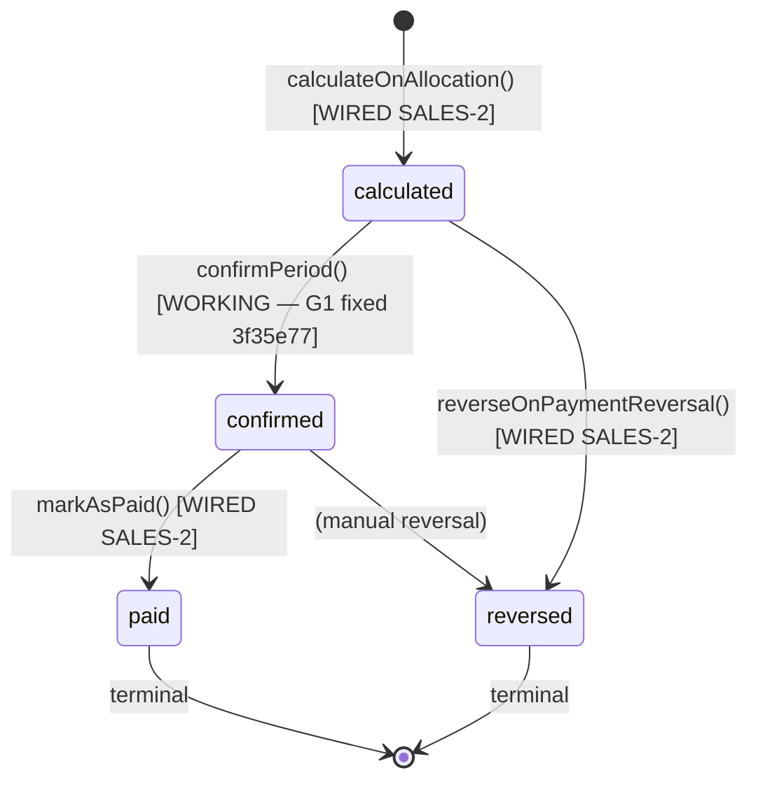

# Commission Tracking

> **Module:** Sales (Phase 10)
> **Audience:** Engineers + AI assistants + **accountants** (must review before Canonical)
> **Status:** Draft — pending accountant sign-off
> **Last reviewed:** 2025-08-03
> **Source of truth:** this file + `laravel/app/Services/Sales/CommissionService.php`
> + `laravel/app/Models/CommissionRule.php` + `laravel/app/Models/CommissionEntry.php`
> + `laravel/app/Models/CommissionRuleTier.php` + `laravel/app/Models/CommissionRuleProductGroup.php`
> + `laravel/app/Models/CommissionRuleTarget.php`
> + `laravel/database/migrations/2025_01_22_000001_create_commission_tracking.php`.

> ⚠️ **RESOLVED:** This module's 3 blocking gaps (G1 + G2 + G3) are now ALL fixed.
> G1 + G3 were resolved in commit 3f35e77 (SALES-1). G2 (the dead-code auto-calc pipeline)
> was resolved in SALES-2 — the 4 commission methods are now wired into their callers
> (`CustomerPaymentService::confirmPayment` / `cancelPayment`,
> `SalesReturnService::confirmReturn`, `EmployeeTransactionService`). See §11.

## 1. What is it?

The **Commission module** is a per-salesman commission calculation engine. It is **intended** to
be triggered by customer payment allocations (commission is earned only when the customer pays,
proportional to the payment amount — NOT on invoice creation). The engine supports **4 rule
types**:

1. **`flat`** — single `%` on `allocation.allocated_amount`.
2. **`tiered`** — progressive thresholds (cumulative sales in the period determine the tier).
3. **`product_group`** — per-`product_group_id` rate overrides (different margins → different
   rates).
4. **`target_bonus`** — base rate on all allocation + bonus rate on portion above target.

Rules are **time-bounded** (`effective_from` / `effective_to`) with a GiST EXCLUDE constraint
ensuring only ONE active open-ended rule per salesman. Rules are **branch-scoped**
(`branch_id` NULL = global; specific `branch_id` = branch-specific, takes precedence).

The commission entry has 4 lifecycle states: `calculated → confirmed → paid` (with `reversed` as
a terminal side-state). Month-end `confirmPeriod('YYYY-MM')` groups entries by salesman and
posts a GL journal entry per salesman (Dr `commission_expense` / Cr `employee_payable`).

> ✅ **The auto-calc pipeline is now WIRED (G2 — resolved in SALES-2).** `calculateOnAllocation`,
> `reverseOnReturn`, `reverseOnPaymentReversal`, and `markAsPaid` are called from
> `CustomerPaymentService::confirmPayment`, `SalesReturnService::confirmReturn`,
> `CustomerPaymentService::cancelPayment`, and `EmployeeTransactionService` respectively. All
> 4 call sites are wrapped in try/catch (non-blocking) so a commission failure never aborts
> the parent transaction. `CommissionApiController` (rule CRUD + `confirmPeriod` + summaries)
> remains wired as before.
>
> ✅ **`confirmPeriod` is fixed (G1 — resolved in 3f35e77).** `JournalPostingService::postCommissionExpense`
> now exists and posts a balanced Dr commission_expense / Cr commission_payable JE per salesman.
>
> ✅ **The ledger natures are registered (G3 — resolved in 3f35e77).** `LedgerNatureService::EXTENDED_NATURES`
> has `commission_expense` (Expense, debit) + `commission_payable` (Liability, credit).

## 2. Why does it exist?

- **Salesmen earn commission** on invoices they sell — the system must calculate, confirm, and
  pay these amounts.
- **Per-payment-allocation model** (NOT per-invoice): commission is earned only when the
  customer pays, proportional to the payment amount. This aligns commission with cash
  collection, not just sales volume.
- **4 rule types** support common commission structures: flat (simple %), tiered (incentivize
  higher sales), product_group (different margins → different rates), target_bonus (quota-based
  bonus).
- **Reversal on sales return / payment reversal** preserves net commission accuracy.
- **Month-end batch confirm** posts the GL Dr Commission Expense / Cr Employee Payable per
  salesman (one JE per salesman per period).

## 3. When is it used?

> ✅ All triggers below are now WIRED (G2 — resolved in SALES-2). Commission calls are
> non-blocking (try/catch) so the parent transaction succeeds even if no rule matches.

- **On customer payment confirmation** (WIRED — SALES-2): `calculateOnAllocation` creates a
  `calculated` commission entry. Fires only for AR-reduction types (receive/discount/write_off).
- **On sales return confirmation** (WIRED — SALES-2): `reverseOnReturn` creates a NEGATIVE
  commission entry proportional to `return_amount / invoice_total × original commission`.
- **On payment cancellation** (WIRED — SALES-2): `reverseOnPaymentReversal` marks original
  `reversed` + creates negative mirror with `reversed_by_entry_id` link. Fires only for
  AR-reduction types (receive/discount/write_off).
- **On month-end batch** (WIRED — G1 fixed in 3f35e77): `confirmPeriod('YYYY-MM')` via
  `POST /api/v1/sales/commission/confirm-period` (admin-only API). Posts GL Dr Commission
  Expense / Cr Employee Payable per salesman.
- **On employee transaction (type=repayment)** (WIRED — SALES-2): `markAsPaid` sets status →
  `paid` for confirmed entries in the transaction's period.

All flows are now working:
- **Rule CRUD** via `CommissionApiController` (admin API).
- **Entries list / summaries** via `CommissionApiController` (read API).
- **`confirmPeriod`** is wired and working (G1 fixed in 3f35e77).
- **Auto-calc pipeline** is wired (G2 fixed in SALES-2): `calculateOnAllocation`,
  `reverseOnReturn`, `reverseOnPaymentReversal`, `markAsPaid`.

## 4. Who uses it?

- **`admin` / `superadmin`** — full commission rule CRUD + period confirmation (API only — no
  web UI, gap G12).
- **`manager`** — read access to rules + entries + summaries (INTENDED — current API allows any
  authenticated bearer, gap G10).
- **`accountant`** — read access for month-end reconciliation.
- **`salesman`** — should be able to view OWN entries only (NOT implemented — gap G11, no
  per-row policy).

There is **no `CommissionPolicy` class** (gap G11). There is **no web UI** for commission rule
management (gap G12) — commission rules can ONLY be created/deactivated via the API.

## 5. Related modules

- `sales-overview.md` — module map.
- `sales-invoice.md` — the invoice that earns commission (`salesman_id` on `sales_invoices`).
- `sales-return.md` — the return that SHOULD reverse commission (`reverseOnReturn` — DEAD CODE).
- `../accounting/customer-payments.md` — the payment allocation that SHOULD trigger commission
  (`calculateOnAllocation` — DEAD CODE).
- `../accounting/employee-transactions.md` (Phase 7) — the repayment that SHOULD mark commission
  paid (`markAsPaid` — DEAD CODE).
- `../accounting/chart-of-accounts.md` — `commission_expense` + `commission_payable` natures
  (NOT registered — gap G3).
- `../accounting/journal-posting-rules.md` — commission GL (NOT documented because the method
  doesn't exist — gap G1).
- `../security/branch-context-security.md` — RLS on `commission_entries` + `commission_rules`.

## 6. Business rules

- **MUST** resolve active rule via branch-specific → global fallback (`getActiveRule` L162-190).
- **MUST** skip commission if invoice has no `salesman_id`, is reversed, or is cancelled.
- **MUST** skip commission if rule rate = 0 AND `rule_type = 'flat'`.
- **MUST** calculate per `rule_type`:
  - `flat`: `amount = base × rate / 100`.
  - `tiered`: progressive — allocation applied tier-by-tier; cumulative sales =
    `getCumulativeSalesForPeriod` (sum of `total_amount` from non-reversed, non-cancelled
    invoices in YYYY-MM period).
  - `product_group`: per-item weighted — allocation proportion = `itemAmount / invoiceTotal`
    applied to each line, with per-group rate override or rule default.
  - `target_bonus`: base rate on all allocation + bonus rate on portion above `target_amount`
    if cumulative+allocation crosses the threshold.
- **MUST** create NEGATIVE entry for return reversal (proportional: `return_amount /
  invoice_total × original commission`).
- **MUST** mark original entry `reversed` + create negative mirror for payment reversal (with
  `reversed_by_entry_id` link).
- **MUST** group entries by salesman at `confirmPeriod` and post ONE GL JE per salesman (Dr
  `commission_expense` / Cr `employee_payable`).
- **MUST NOT** auto-calculate commission on invoice creation (only on payment allocation).
- **MUST NOT** bypass the GiST EXCLUDE constraint (one active open-ended rule per salesman).
- **MUST NOT** pay commission without GL posting (status `paid` requires prior `confirmed`
  status with `journal_entry_id` set).

## 7. Data model

### `commission_rules` (migration `2025_01_22_000001` L82-117 + ALTER L138-150)

```sql
CREATE TABLE commission_rules (
    id integer GENERATED ALWAYS AS IDENTITY PRIMARY KEY,
    salesman_id integer NOT NULL REFERENCES employees(id),
    rule_type varchar(20) NOT NULL
        CHECK (rule_type IN ('flat','tiered','product_group','target_bonus')),
    rate numeric(8,4) NOT NULL DEFAULT 0,
    effective_from date NOT NULL DEFAULT CURRENT_DATE,
    effective_to date,                                 -- NULL = open-ended
    is_active boolean NOT NULL DEFAULT true,
    branch_id integer REFERENCES branches(id),         -- NULL = global rule
    notes text,
    created_by integer,
    created_at timestamp(0) DEFAULT CURRENT_TIMESTAMP,
    updated_at timestamp(0) DEFAULT CURRENT_TIMESTAMP
);

ALTER TABLE commission_rules
ADD CONSTRAINT commission_rules_unique_active
EXCLUDE USING gist (
    salesman_id WITH =,
    (CASE WHEN is_active AND effective_to IS NULL
          THEN daterange(effective_from, NULL, '[)')
          ELSE daterange(NULL, NULL, '[]')
     END) WITH &&
) WHERE (is_active AND effective_to IS NULL);
```

- **GiST EXCLUDE constraint** guarantees only ONE active open-ended rule per salesman (uses
  `btree_gist` extension).
- **RLS:** 5-policy pattern with `branch_id IS NULL OR branch_id = current_setting('app.branch_id')::int`
  (global rules visible to all branches).
- **Seed:** existing `employees WHERE role='salesman' AND is_active=true` get a 0% flat rule on
  migration.

### `commission_rule_tiers` (migration L171-183)

```sql
CREATE TABLE commission_rule_tiers (
    id integer GENERATED ALWAYS AS IDENTITY PRIMARY KEY,
    commission_rule_id integer NOT NULL REFERENCES commission_rules(id) ON DELETE CASCADE,
    threshold numeric(14,2) NOT NULL DEFAULT 0,
    rate numeric(8,4) NOT NULL DEFAULT 0,
    sort_order integer NOT NULL DEFAULT 0,
    created_at timestamp(0) DEFAULT CURRENT_TIMESTAMP,
    CONSTRAINT commission_rule_tiers_threshold_unique UNIQUE (commission_rule_id, threshold)
);
```

### `commission_rule_product_groups` (migration L197-206)

```sql
CREATE TABLE commission_rule_product_groups (
    id integer GENERATED ALWAYS AS IDENTITY PRIMARY KEY,
    commission_rule_id integer NOT NULL REFERENCES commission_rules(id) ON DELETE CASCADE,
    product_group_id integer NOT NULL REFERENCES product_groups(id) ON DELETE CASCADE,
    rate numeric(8,4) NOT NULL DEFAULT 0,
    created_at timestamp(0) DEFAULT CURRENT_TIMESTAMP,
    CONSTRAINT commission_rule_pg_unique UNIQUE (commission_rule_id, product_group_id)
);
```

### `commission_rule_targets` (migration L226-239)

```sql
CREATE TABLE commission_rule_targets (
    id integer GENERATED ALWAYS AS IDENTITY PRIMARY KEY,
    commission_rule_id integer NOT NULL REFERENCES commission_rules(id) ON DELETE CASCADE,
    target_amount numeric(14,2) NOT NULL DEFAULT 0,
    bonus_rate numeric(8,4) NOT NULL DEFAULT 0,
    period varchar(10) NOT NULL DEFAULT 'monthly'
        CHECK (period IN ('monthly','quarterly','yearly')),
    created_at timestamp(0) DEFAULT CURRENT_TIMESTAMP,
    CONSTRAINT commission_rule_targets_rule_unique UNIQUE (commission_rule_id, period)
);
```

### `commission_entries` (migration L269-324)

```sql
CREATE TABLE commission_entries (
    id integer GENERATED ALWAYS AS IDENTITY PRIMARY KEY,
    salesman_id integer NOT NULL REFERENCES employees(id),
    branch_id integer NOT NULL REFERENCES branches(id),
    sales_invoice_id integer,                          -- FK enforced by trg_fk_ce_si (trigger-based)
    commission_rule_id integer NOT NULL REFERENCES commission_rules(id),
    allocation_id integer REFERENCES invoice_payment_allocations(id) ON DELETE SET NULL,
    sales_return_id integer REFERENCES sales_returns(id) ON DELETE SET NULL,
    invoice_total numeric(14,2) DEFAULT 0,
    commission_base numeric(14,2) DEFAULT 0,
    commission_rate numeric(8,4) DEFAULT 0,
    commission_amount numeric(14,2) NOT NULL DEFAULT 0,  -- NEGATIVE for return reversals
    status varchar(20) NOT NULL DEFAULT 'calculated'
        CHECK (status IN ('calculated','confirmed','paid','reversed')),
    entry_date date NOT NULL DEFAULT CURRENT_DATE,
    journal_entry_id integer REFERENCES journal_entries(id),  -- Posted when status → confirmed
    reversed_by_entry_id integer REFERENCES commission_entries(id),
    is_reversed boolean NOT NULL DEFAULT false,
    reversed_at timestamp(0),
    reversed_by integer,
    reverse_reason text,
    commission_period varchar(7),                     -- 'YYYY-MM' — auto-set by trg_ce_set_period
    notes text,
    created_by integer,
    created_at timestamp(0) DEFAULT CURRENT_TIMESTAMP,
    updated_at timestamp(0) DEFAULT CURRENT_TIMESTAMP
);
```

**4 triggers installed by migration:**
1. `trg_fk_ce_si` (constraint trigger, DEFERRABLE) — validates `sales_invoice_id` exists in
   partitioned `sales_invoices` (declarative FK not supported in PG 12-17).
2. `trg_ce_set_period` (BEFORE INSERT) — auto-sets `commission_period = to_char(entry_date, 'YYYY-MM')`.
3. `trg_ce_updated_at` (BEFORE UPDATE) — refreshes `updated_at`.
4. `trg_ce_validate_source` (BEFORE INSERT) — enforces exactly-one-of (`allocation_id`,
   `sales_return_id`) unless `notes LIKE 'Manual adjustment:%'`.

## 8. Lifecycle / workflow

### State machine



### Rule resolution algorithm

```
1. Resolve salesman_id from invoice.salesman_id
2. If salesman_id is NULL → no commission (return null)
3. If invoice.isReversed() || invoice.isCancelled() → no commission
4. Resolve active rule:
   a. Try branch-specific: WHERE salesman_id=X AND is_active=true AND effective_from<=date
      AND (effective_to IS NULL OR effective_to>=date) AND branch_id=invoice.branch_id
   b. If not found, try global: WHERE ... AND branch_id IS NULL
5. If no rule OR (rate=0 AND rule_type='flat') → no commission
6. Calculate amount based on rule_type (match dispatcher)
7. INSERT commission_entries (status='calculated', commission_period='YYYY-MM')
8. Audit log: 'commission_calculated' event
```

## 9. Integration points

| Integration | Direction | Status | Purpose |
|---|---|---|---|
| `CustomerPaymentService::confirmPayment` → `calculateOnAllocation` | inbound | ✅ wired (SALES-2) | Commission calc on payment allocation (AR-reduction types only) |
| `SalesReturnService::confirmReturn` → `reverseOnReturn` | inbound | ✅ wired (SALES-2) | Negative commission on return |
| `CustomerPaymentService::cancelPayment` → `reverseOnPaymentReversal` | inbound | ✅ wired (SALES-2) | Reverse commission on payment cancel (AR-reduction types only) |
| `EmployeeTransactionService` (repayment) → `markAsPaid` | inbound | ✅ wired (SALES-2) | Mark commission paid |
| `CommissionApiController` (8 endpoints) | inbound | ✅ wired | Rule CRUD + entries list + summaries + confirmPeriod |
| `JournalPostingService::postCommissionExpense` | outbound | ✅ exists (3f35e77) | Posts Dr commission_expense / Cr employee_payable |
| `LedgerNatureService::EXTENDED_NATURES['commission_expense']` | outbound | ✅ registered (3f35e77) | Dr side ledger resolution |
| `LedgerNatureService::EXTENDED_NATURES['commission_payable']` | outbound | ✅ registered (3f35e77) | Cr side ledger resolution |
| `SalesAuditLogger` (5 commission events) | outbound | ✅ wired + now fires (SALES-2) | commission_rule_created, commission_calculated, etc. |

## 10. Edge cases

- **Cumulative sales for tiered calc:** EXCLUDES the current allocation
  (`excludeAllocationId` parameter) to avoid double-counting.
- **Tier with no thresholds defined:** falls back to flat rate (`calculateFlat`).
- **Product not in any group:** uses `rule.rate` as default.
- **Target with no period match:** takes first target regardless of period.
- **Negative commission_amount:** allowed (DB has no CHECK > 0) — used for return reversals.
- **Multiple allocations to same invoice:** each creates a separate `commission_entry`
  (per-payment model).
- **Net zero commission at confirmPeriod:** skips GL posting, just marks entries confirmed.
- **`commission_period` uses `now()->format('Y-m')` for reversals (G14):** a return in February
  reverses commission from a January payment, but the negative entry lands in February's period.
  Month-end summaries will show January's full commission + February's reversal, distorting both
  months.

## 11. Gaps

1. **G1 (CRITICAL)** — `CommissionService::confirmPeriod` calls non-existent
   `JournalPostingService::postCommissionExpense()` (L674). Runtime `BadMethodCallException`
   when API client POSTs `/api/v1/sales/commission/confirm-period`.

   > ✅ RESOLVED in commit 3f35e77 (SALES-1) — added `JournalPostingService::postCommissionExpense()`
   > (Dr commission_expense / Cr commission_payable, swaps Dr/Cr for net-negative reversal periods,
   > returns `{id}` object to match the `$je->id` access pattern). Call site enhanced to pass
   > `salesman_id` + `created_by` for traceability. `branch_id=null` → skips per-branch period
   > check (commission confirmation is an admin action spanning branches).
2. **G2 (CRITICAL)** — Entire commission auto-calc pipeline is DEAD CODE.
   `calculateOnAllocation` (L205), `reverseOnReturn` (L498), `reverseOnPaymentReversal` (L580),
   `markAsPaid` (L719) are NEVER called from `CustomerPaymentService::confirmPayment`,
   `SalesReturnService::confirmReturn`, `CustomerPaymentService::cancelPayment`, or
   `EmployeeTransactionService`.

   > ✅ RESOLVED in SALES-2 — all 4 dead-code methods are now wired into their callers:
   > - `calculateOnAllocation` ← `CustomerPaymentService::confirmPayment` (per-allocation,
   >   AR-reduction types only: receive/discount/write_off)
   > - `reverseOnPaymentReversal` ← `CustomerPaymentService::cancelPayment` (per-allocation,
   >   before the allocation rows are deleted, AR-reduction types only)
   > - `reverseOnReturn` ← `SalesReturnService::confirmReturn` (after status → confirmed +
   >   audit log, before the notification dispatch)
   > - `markAsPaid` ← `EmployeeTransactionService::createTransaction` (when
   >   transaction_type='repayment', period derived from transaction_date YYYY-MM)
   >
   > All 4 call sites are wrapped in try/catch + Log::warning — a commission failure (e.g.
   > no rule for the salesman, invoice has no salesman, or no prior entries to reverse)
   > NEVER aborts the parent payment/return/transaction. The GL/ledger posting remains the
   > source of truth; commission is a downstream concern.
   >
   > `allocateToInvoice` was refactored from `void` to `?int` (returns the allocation ID via
   > `insertGetId`) so the caller can load the `InvoicePaymentAllocation` model and pass it to
   > `calculateOnAllocation`. `CommissionService` was added to the constructor of all 3 caller
   > services (no circular dependency — CommissionService depends only on JournalPostingService,
   > DocumentSequenceService, SalesAuditLogger, SalesAccess).
   >
   > NOTE: gap G14 (reverseOnReturn uses `now()->format('Y-m')` for the reversal period instead
   > of the original entry's period) remains open — tracked separately. The SALES-2 wiring does
   > not change the period-derivation logic inside CommissionService; it only connects the
   > call sites.
3. **G3 (CRITICAL)** — `LedgerNatureService` has NO `commission_expense` or `commission_payable`
   natures. Even if G1 is fixed, the GL posting can't resolve the Dr side ledger.

   > ✅ RESOLVED in commit 3f35e77 (SALES-1) — registered `commission_expense` (Expense, debit) +
   > `commission_payable` (Liability, credit) in `LedgerNatureService::EXTENDED_NATURES`. With G1
   > also fixed, `postCommissionExpense` now resolves both ledgers and posts the balanced JE.
4. **G4 (CRITICAL — RESOLVED)** — `fn_financial_audit_trigger` is now attached to all 5
   commission tables (`commission_rules`, `commission_entries`, `commission_rule_tiers`,
   `commission_rule_product_groups`, `commission_rule_targets`) via migration
   `2026_09_01_000002` (SALES-3, commit de2b6e6).

   > ✅ RESOLVED in SALES-3 (commit de2b6e6) — migration
   > `2026_09_01_000002_attach_financial_audit_trigger_to_sales_tables.php` attaches
   > `trg_audit_<table>` to the 5 commission tables + 9 core sales tables (14 total).
   > Direct DB mutations to commission tables are now captured in `financial_audit_log`
   > with hash-chained before/after snapshots. The trigger function reads `branch_id`
   > from the row's JSONB (works for tables without a `branch_id` column —
   > `commission_rule_tiers` etc. are safe).
5. **G7 (MAJOR)** — No `config/commission.php` — no knobs for commission batch minimum, max
   rules per salesman, default rule type, target period default, auto-confirm flag.

   > ✅ RESOLVED in SALES-AUDIT-1 — Created `laravel/config/commission.php` with 5
   > env-overridable knobs: `batch_minimum_amount` (default 0.01 — replaces the
   > hardcoded threshold in `CommissionService::confirmPeriod` L663),
   > `max_rules_per_salesman` (default 0 = unlimited, enforced by
   > `CommissionService::createRule`), `default_rule_type` (default 'flat'),
   > `default_target_period` (default 'monthly'), `auto_confirm_calculated_entries`
   > (default false — preserves the month-end batch flow). Wired `batch_minimum_amount`
   > into `confirmPeriod` (replaces the `0.01` literal). The other 4 knobs are
   > config-only (read by future service work or seeders — no runtime consumer yet,
   > but the config surface is now in place so a deployment can tune without a code
   > change).
6. **G8 (MAJOR)** — No materialized view for commission summaries. `getSalesmanSummary` and
   `getBranchSummary` recompute from `commission_entries` + `sales_invoices` joins on every API
   call.
7. **G10 (MAJOR)** — Commission API read endpoints (`listRules`, `showRule`, `listEntries`,
   `salesmanSummary`, `branchSummary`) have NO `api.auth:admin` middleware — any authenticated
   bearer token can list ALL commission rules and entries.

   > ✅ RESOLVED in SALES-AUDIT-2 — All 5 commission API read endpoints now
   > require `api.auth:manager,admin` middleware (manager OR admin). The
   > route-group comment already declared "Admin/manager endpoints for
   > commission rule management and reporting" but the reads had no role
   > gate — any authenticated bearer token could list ALL commission rules
   > and entries across all branches. Fixed in `routes/api.php`:
   > - `GET /sales/commission/rules` (listRules) → `api.auth:manager,admin`
   > - `GET /sales/commission/rules/{id}` (showRule) → `api.auth:manager,admin`
   > - `GET /sales/commission/entries` (listEntries) → `api.auth:manager,admin`
   > - `GET /sales/commission/salesman-summary` (salesmanSummary) → `api.auth:manager,admin`
   > - `GET /sales/commission/branch-summary` (branchSummary) → `api.auth:manager,admin`
   > Write endpoints (`storeRule`, `deactivateRule`, `confirmPeriod`) already
   > had `api.auth:admin` and are unchanged. The `CommissionEntryPolicy::view()`
   > method (commit 1ccc5b6) mirrors this intent matrix — defense-in-depth
   > at both the route middleware + policy layers.
8. **G11 (MAJOR)** — No `CommissionPolicy` class. Per-row policy gates (e.g. "a salesman can
   only see their own commission entries") are impossible.

   > ✅ RESOLVED in commit 1ccc5b6 — Policy class `App\Policies\CommissionEntryPolicy` created + registered in `AppServiceProvider::boot()`. Mirrors existing API route middleware exactly (defense-in-depth — no behavior change). Methods: view/create/confirm/delete/reverse. The commission module is API-only (no web UI — gap G12); entries are auto-generated by `CommissionService::calculateForInvoice` and auto-reversed by `CommissionService::reverseOnReturn`. `confirm()` mirrors `api.auth:admin` on `confirmPeriod`; `view()` mirrors the INTENDED matrix per the route-group comment ("Admin/manager endpoints") — gap G10 (reads have no `api.auth:admin`) remains open for the API middleware to be tightened. Per-row policy (salesman sees only their own entries) is a future enhancement — the controller's `salesmanSummary` endpoint already filters by `salesman_id = auth()->id()`.
9. **G12 (MAJOR)** — No web UI for commission rule management. Commission rules can ONLY be
   created/deactivated via the API (admin bearer token). An accountant or manager without API
   access cannot configure commission rules.
10. **G14 (MAJOR)** — `reverseOnReturn` uses `commission_period = now()->format('Y-m')` for the
    reversal entry — NOT the original entry's period. Distorts month-end summaries.

    > ✅ RESOLVED in SALES-AUDIT-2 — `CommissionService::reverseOnReturn` now
    > uses the ORIGINAL entry's `commission_period` for the reversal entry,
    > NOT `now()->format('Y-m')`. A return processed in October for a sale
    > made in September now correctly reverses against the September period.
    > The fix reads `$originalEntries->first()->commission_period` (all
    > original entries share the same period — they were calculated in the
    > same batch for the same invoice) with a defensive fallback to
    > `now()->format('Y-m')` only if the original entries somehow have NULL
    > period (should never happen since `calculateForInvoice` always sets it).
    > The `notes` field now includes the period for traceability:
    > `"Reversal for return {code} (period {YYYY-MM})"`. Month-end summaries
    > are no longer distorted by cross-period returns.
11. **G15 (MAJOR)** — `CommissionApiController::storeRule` uses inline `$request->validate()`
    — no dedicated FormRequest. Complex rule-type-conditional validation is duplicated inline.

   > ✅ RESOLVED in SALES-AUDIT-1 — `storeRule` was already migrated to
   > `StoreCommissionRuleRequest` in a prior session (the FormRequest contains
   > the full rule-type-conditional validation for all 4 rule types). This session
   > extracted the 3 REMAINING inline `$request->validate()` calls in the same
   > controller: `salesmanSummary` → `SalesmanSummaryRequest`, `branchSummary` →
   > `BranchSummaryRequest`, `confirmPeriod` → `ConfirmCommissionPeriodRequest`.
   > All 4 commission-write/read API methods now use dedicated FormRequests —
   > zero inline `validate()` calls remain in `CommissionApiController`. The 3 new
   > FormRequests mirror the validation rules they replaced (1:1, no behavior
   > change) and add `bodyParameters()` for Scribe/OpenAPI doc generation.
12. **G16 (MINOR)** — `commission_rule_tiers`, `commission_rule_product_groups`,
    `commission_rule_targets` have NO `updated_at` column. Audit trail for tier rate changes is
    impossible.
13. **AuditableMasterData bypass** — `CommissionService::createRule` uses
    `CommissionRule::create` (Eloquent, so the trait fires for rules), but `commission_entries`
    are created via `CommissionEntry::create` (Eloquent, trait fires). This is one area where
    the trait is NOT bypassed — but the audit events NEVER fire because the methods are dead
    code (G2).

## 12. Accountant review checklist

> **This is a SAFETY-CRITICAL document.** Before marking it Canonical, an accountant with
> production credentials MUST review and sign off on each item below.

- [ ] **G1 + G2 + G3 documented as blocking production use.** The entire commission module is
      non-functional. Confirm whether commission should be re-enabled or formally deprecated.
- [ ] The per-payment-allocation model (commission earned only when the customer pays) is the
      correct business rule (vs per-invoice).
- [ ] The 4 rule types (flat/tiered/product_group/target_bonus) cover the business needs.
- [ ] The GiST EXCLUDE constraint (one active open-ended rule per salesman) is sufficient.
- [ ] The branch-specific → global rule resolution precedence is correct.
- [ ] The NEGATIVE commission entry for return reversals (proportional to
      `return_amount / invoice_total × original commission`) is correct.
- [ ] The `commission_period` uses `entry_date` (auto-set by trigger) — confirm this is correct
      (vs `invoice_date` or `payment_date`).
- [ ] The G14 gap (reversal `commission_period` uses `now()` instead of original entry's period)
      — confirm whether this should be fixed before Canonical.
- [ ] The month-end `confirmPeriod` grouping (one GL JE per salesman per period) is correct.
- [ ] The `commission_expense` (Dr, expense) and `commission_payable` (Cr, liability) ledger
      nature classification is correct (to be registered after G3 fix).

## 13. Cross-references

- `sales-overview.md` — module map.
- `sales-invoice.md` — the invoice that earns commission.
- `sales-return.md` — the return that SHOULD reverse commission (DEAD CODE G2).
- `../accounting/customer-payments.md` — the payment that SHOULD trigger commission (DEAD CODE G2).
- `../accounting/employee-transactions.md` — the repayment that SHOULD mark commission paid
  (DEAD CODE G2).
- `../accounting/chart-of-accounts.md` — `commission_expense` + `commission_payable` natures (to
  be registered after G3 fix).
- `../accounting/journal-posting-rules.md` — commission GL (to be added after G1 fix).
- `../security/audit-trails.md` — `SalesAuditLogger` (5 commission events — NEVER fire due to G2).
- `../security/branch-context-security.md` — RLS on `commission_entries` + `commission_rules`.
