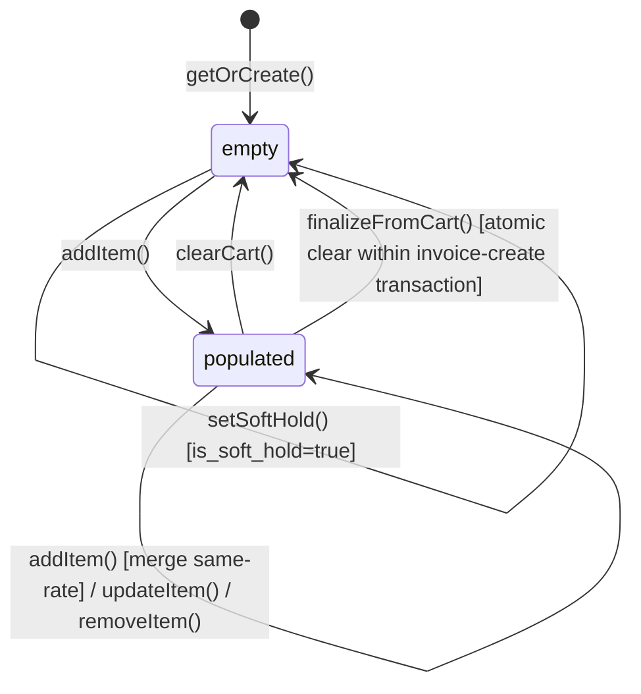

# Sales Cart

> **Module:** Sales (Phase 10)
> **Audience:** Engineers + AI assistants + accountants
> **Status:** Draft
> **Last reviewed:** 2025-08-03
> **Source of truth:** this file + `laravel/app/Services/Sales/SalesCartService.php`
> + `laravel/app/Models/SalesDraftCart.php`
> + `laravel/database/sql/04_sales.sql:158-174`.

## 1. What is it?

The **Sales Cart** is a **per-user × per-customer × per-branch** draft cart stored in
`sales_draft_carts` (DB-backed JSONB, NOT session-based). It is the pre-invoice state — the
salesman builds a cart of products, then calls `finalizeFromCart` to create the invoice (see
`sales-invoice.md`).

The cart is **stateless** — there is no `status` column. The `items_json` array IS the state.
The only boolean flag is `is_soft_hold`. The unique key `(user_id, customer_id, branch_id)`
means each user has at most one cart per (customer, branch) tuple.

The cart supports:

- **Cross-session persistence** — survives logout/login + device switching (mobile API + web).
- **Merge-on-same-rate** — adding a product already in the cart at the same rate sums the qty.
- **Price range validation** — each item carries `min_rate`, `max_rate`, `default_rate` from
  `product_price_history`; the salesman cannot set a rate outside the range.
- **Stock availability validation** — `StockAvailabilityService::getBranchAvailableQty` per
  product, pipeline-aware (subtracts open dispatches).
- **R4 audit events** — every cart mutation (add/update/remove/clear) is audit-logged via
  `SalesAuditLogger` for forensic analysis (e.g. "did the salesman inflate the qty then reduce
  it before finalize to test the credit limit?").

## 2. Why does it exist?

- **Persists across sessions + devices.** A salesman can start a cart on the web, continue on
  mobile, and finalize from either. Session-based carts would be lost on logout.
- **Supports salesman multi-customer workflow.** The `listDrafts` endpoint returns all open
  carts for the user — the "draft-tabs" dock lets the salesman switch between customers.
- **R6 3-column unique key** prevents cross-branch cart contamination. A salesman at Branch-A
  cannot accidentally use a Branch-B cart (the unique key includes `branch_id`).
- **Pre-finalize validation.** `validateCart` is a hard gate before `finalizeFromCart` — if any
  item is out of stock or the rate is out of range, the finalize throws.
- **Credit snapshot.** `getCustomerDetails` returns the live customer credit snapshot
  (`credit_limit`, `current_due`, `due_left`) for the cart page.
- **R4 forensic audit.** Cart mutations are auditable — a suspicious pattern (add 100 units,
  check credit, remove 90, finalize 10) is detectable.

## 3. When is it used?

- **`getCart(userId, customerId, branchId, excludeInvoiceId?)`** — load + enrich + validate.
  Enrichment adds `min_rate`, `max_rate`, `default_rate`, `total`, `warehouse_id` (null until
  godown). Validation returns `{valid, message, stock_errors[], rate_errors[]}`.
- **`addItem(userId, customerId, branchId, productId, qty, rate)`** — merge-on-same-rate,
  reject different-rate (must remove first).
- **`updateItem(userId, customerId, branchId, productId, qty, rate?)`** — capture oldQty +
  oldRate for audit.
- **`removeItem(userId, customerId, branchId, productId)`** — capture `removedQty` +
  `removedRate` for audit (foregone revenue auditable).
- **`clearCart(userId, customerId, branchId)`** — capture `itemsClearedCount` +
  `itemsClearedValue` for audit (suspicious bulk-clear before finalize-with-different-cart).
- **`validateCart(userId, customerId, branchId)`** — hard gate before finalize.
- **`setSoftHold(userId, customerId, branchId, bool)`** — UI flag.
- **`listCarts(userId)`** — draft-tabs dock.
- **`getCustomerDetails(customerId)`** — live credit snapshot for cart page.
- **Finalize** — `SalesInvoiceService::finalizeFromCart` calls `clearCart` atomically within the
  invoice-creation transaction.

## 4. Who uses it?

- **`salesman` / `manager` / `admin`** — all cart operations.
- **Excluded:** `accountant`, `warehouse_manager`, `dispatcher`, `hr`, `user` — no route access.

There is **no `SalesDraftCartPolicy` class** (gap G6 in `sales-overview.md`). RBAC is enforced
only by route `role:salesman,manager,admin` + `branch.isolation` middleware.

## 5. Related modules

- `sales-overview.md` — module map.
- `sales-invoice.md` — `finalizeFromCart` consumes the cart + clears it atomically.
- `../inventory/warehouse-stock.md` — `StockAvailabilityService::getBranchAvailableQty` (pipeline
  subtraction).
- `../accounting/subledger-reconciliation.md` — `getCustomerDetails` `current_due` formula
  (`SUM(debit) - SUM(credit) FROM customer_ledger WHERE is_reversed=false`).
- `../security/branch-context-security.md` — R6 branch_id unique key.

## 6. Business rules

- **MUST** enforce one cart per (user, customer, branch) tuple via the UNIQUE constraint
  `(user_id, customer_id, branch_id)` (R6 — extended from 2-col to 3-col).
- **MUST** merge-on-same-rate: if the product is already in the cart at the same rate (0.01
  tolerance), sum the qty. If different rate, throw "Product already in cart at rate X".
- **MUST** validate price range from `product_price_history` (`effective_from <= today AND
  (effective_to IS NULL OR effective_to >= today)`) with fallback to `products.sales_rate`.
- **MUST** validate stock availability via `StockAvailabilityService::getBranchAvailableQty(
  productId, branchId, excludeInvoiceId?)` (pipeline-aware — subtracts open dispatches).
- **MUST** support `excludeInvoiceId` parameter — when editing an invoice (not finalizing from
  cart), the invoice's own dispatch pipeline should not block availability.
- **MUST** audit every cart mutation via `SalesAuditLogger`:
  - `cartItemAdded` (productId, qty, rate, total).
  - `cartItemUpdated` (productId, oldQty, oldRate, newQty, newRate, deltaTotal).
  - `cartItemRemoved` (productId, removedQty, removedRate, removedTotal).
  - `cartCleared` (itemsClearedCount, itemsClearedValue).
- **MUST** normalize `null` branch_id to `0` in `SalesDraftCart::getOrCreate` (sentinel "no
  specific branch").
- **MUST** clear the cart atomically within the `finalizeFromCart` transaction (set
  `items_json=[]`, `is_soft_hold=false`).
- **MUST NOT** post GL or stock movement from the cart (the cart is a draft).
- **MUST NOT** allow a cart item with `rate <= 0` (validated in `addItem`).
- **MUST NOT** allow a cart item with `qty <= 0` (validated in `addItem`).

## 7. Data model

### `sales_draft_carts` (DDL: `04_sales.sql:158-174`)

```sql
CREATE TABLE sales_draft_carts (
    id integer GENERATED ALWAYS AS IDENTITY PRIMARY KEY,
    user_id integer NOT NULL REFERENCES users(id) ON DELETE CASCADE,
    branch_id integer NOT NULL DEFAULT 0,            -- R6: part of unique key (0 = no specific branch)
    customer_id integer,
    items_json jsonb,                                 -- array of {product_id, product_name, qty, rate, total, min_rate, max_rate, default_rate, warehouse_id}
    is_soft_hold boolean NOT NULL DEFAULT false,
    updated_at timestamp(0) DEFAULT CURRENT_TIMESTAMP,
    created_at timestamp(0) DEFAULT CURRENT_TIMESTAMP,
    CONSTRAINT uq_sales_draft_user_customer_branch UNIQUE (user_id, customer_id, branch_id)
);
```

- **RLS:** 5 policies (SELECT/INSERT/UPDATE/DELETE + admin bypass) — see
  `07_views_triggers_constraints.sql:739-745`.
- **UNIQUE constraint** `(user_id, customer_id, branch_id)` — R6 3-column key (extended from
  2-col to prevent cross-branch contamination).
- **`items_json`** is a jsonb array. Each item: `{product_id, product_name, qty, rate, total,
  min_rate, max_rate, default_rate, warehouse_id}`.
- **`branch_id` DEFAULT 0** — sentinel "no specific branch" (normalized from null in
  `SalesDraftCart::getOrCreate`).

## 8. Lifecycle / workflow

### State machine (stateless — no status column)



### Add-item flow

`addItem(userId, customerId, branchId, productId, qty, rate)`:

1. Validate `productId > 0`, `qty > 0`, `rate > 0`.
2. Look up price range from `product_price_history` (effective_from ≤ today AND (effective_to
   IS NULL OR ≥ today)); fallback to `products.sales_rate`.
3. `SalesDraftCart::getOrCreate(userId, customerId, branchId)` (uses 3-col unique key).
4. If same product already in cart:
   - Same rate (0.01 tolerance): merge by summing qty.
   - Different rate: throw "Product already in cart at rate X".
5. If new: push item with `{product_id, product_name, qty, rate, total, min_rate, max_rate,
   default_rate, warehouse_id:null}`.
6. `validateCartItems()` (stock + price range).
7. Save cart.
8. R4 audit `cartItemAdded`.

## 9. Integration points

| Integration | Direction | Purpose |
|---|---|---|
| `StockAvailabilityService::getBranchAvailableQty` | outbound | Per-item stock check (pipeline-aware) |
| `StockAvailabilityService::invalidatePipelineForInvoice` | outbound | Cache invalidation after finalize |
| `SalesAuditLogger::cartItemAdded / cartItemUpdated / cartItemRemoved / cartCleared` | outbound | R4 audit events |
| `SalesInvoiceService::finalizeFromCart` (inbound) | inbound | Consumes cart + clears atomically |
| `SalesDraftCart::getOrCreate` | outbound | Idempotent cart creation (3-col unique key) |

## 10. Edge cases

- **Cross-session cart.** A salesman starts a cart on web, continues on mobile. The DB-backed
  JSONB cart survives across sessions + devices.
- **Merge-on-same-rate.** Adding 5 units of product X at rate 100 to a cart that already has 3
  units of X at rate 100 → the cart now has 8 units at rate 100.
- **Reject different-rate.** Adding 5 units of X at rate 110 to a cart that already has 3 units
  of X at rate 100 → throw "Product already in cart at rate 100". The user must remove the
  existing line first.
- **Price range violation.** Setting a rate outside `[min_rate, max_rate]` → validation fails.
- **Stock shortage.** Adding 100 units when only 50 are available → validation fails with
  `stock_errors[]`.
- **`excludeInvoiceId` on edit.** When editing an invoice (not finalizing from cart), the
  invoice's own dispatch pipeline is excluded from the availability check (otherwise editing
  would always fail).
- **`null` branch_id normalization.** `SalesDraftCart::getOrCreate` normalizes `null` branch_id
  to `0` (sentinel) to satisfy the NOT NULL DEFAULT 0 column + the 3-col UNIQUE constraint.
- **`shop_name` column gap (G1 CRITICAL).** `getCustomerDetails` selects `shop_name` which does
  NOT exist on the `customers` table → runtime `SQLSTATE[42703]` on the cart customer-details
  AJAX endpoint.
- **Soft-hold.** `is_soft_hold=true` is a UI flag — the cart is excluded from the "active carts"
  list but NOT deleted. No GL impact.
- **Stale drafts.** The `sales:cancel-stale-drafts` command cancels draft INVOICES older than
  14 days — it does NOT touch carts. Carts persist indefinitely until cleared or finalized.

## 11. Gaps

1. **G1 (CRITICAL)** — `customers.shop_name` column referenced by `getCustomerDetails` (L487),
   `SalesCartController::searchCustomer` (L84), `SalesCartController::listDrafts` (L96) but
   NEVER created by any migration. Runtime `SQLSTATE[42703]` on cart AJAX endpoints. The
   migration `2026_07_30_000011` comment explicitly states "new schema has only customer_name
   (no shop_name column)".
2. **G6 (MAJOR)** — No `SalesDraftCartPolicy` class. RBAC via route middleware + RLS only.

   > ✅ RESOLVED in commit 1ccc5b6 — Policy class `App\Policies\SalesDraftCartPolicy` created + registered in `AppServiceProvider::boot()`. Mirrors existing `role:` middleware exactly (defense-in-depth — no behavior change). Methods: view/create/update/delete/clear. The cart route group (`admin/sales`) carries `role:salesman,manager,admin` + `branch.isolation` at the prefix level (routes/web.php L1082-1083); all cart routes inherit it.
3. **AuditableMasterData NOT used** — `SalesDraftCart` model does NOT `use AuditableMasterData`
   (the cart is a transient draft, not master data). This is intentional, not a gap.
4. **No `config/sales.php` cart knobs** — no max-items-per-cart, no max-cart-value, no
   cart-expiry-hours. Only stale-draft-INVOICE knobs exist.
5. **No cart-to-invoice conversion status** — the cart is cleared atomically within
   `finalizeFromCart`; there is no "converted" status to track which cart became which invoice
   (the audit log captures it via `sale_created` action with `cart_items_cleared` count).
6. **`items_json` has no schema validation** — the jsonb array is free-form. A crafted API
   payload could inject extra keys. The service-layer validation catches known issues but a
   DB-level CHECK (e.g. jsonb_path_exists) would be defense-in-depth.

## 12. Review checklist

- [ ] The 3-column unique key `(user_id, customer_id, branch_id)` (R6) is documented and enforced.
- [ ] The merge-on-same-rate + reject-different-rate behaviour matches the code.
- [ ] The price range validation (from `product_price_history`) + fallback to `products.sales_rate`
      is documented.
- [ ] The stock availability check is pipeline-aware (subtracts open dispatches) + supports
      `excludeInvoiceId` for invoice-edit mode.
- [ ] The R4 audit events (add/update/remove/clear) capture enough detail for forensic analysis.
- [ ] The G1 `shop_name` gap is documented as CRITICAL — the cart AJAX endpoints are broken.
- [ ] The atomic clear within `finalizeFromCart` is documented (the cart is cleared inside the
      invoice-creation transaction, so a finalize failure rolls back the clear too).

## 13. Cross-references

- `sales-overview.md` — module map.
- `sales-invoice.md` — `finalizeFromCart` consumes + clears the cart.
- `../inventory/warehouse-stock.md` — `StockAvailabilityService` pipeline.
- `../accounting/subledger-reconciliation.md` — `customer_ledger` `current_due` formula.
- `../security/branch-context-security.md` — R6 branch_id unique key + RLS.
