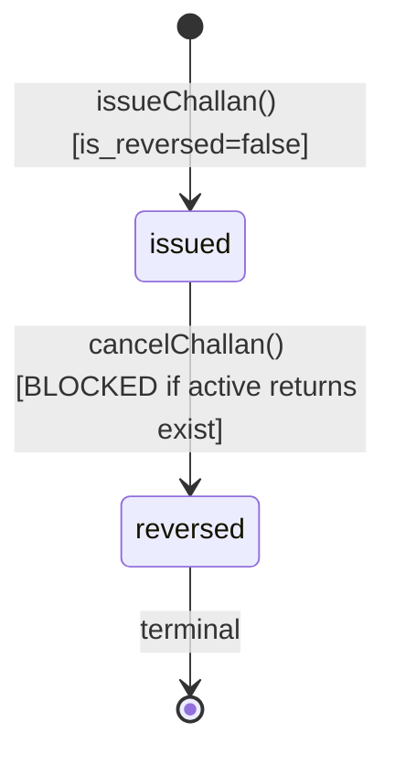

# Sales Challan

> **Module:** Sales (Phase 10)
> **Audience:** Engineers + AI assistants + **accountants** (must review before Canonical)
> **Status:** Draft — pending accountant sign-off
> **Last reviewed:** 2025-08-03
> **Source of truth:** this file + `laravel/app/Services/Sales/SalesChallanService.php`
> + `laravel/app/Models/SalesChallan.php` + `laravel/app/Models/SalesChallanItem.php`
> + `laravel/database/sql/04_sales.sql:129-156` + migrations noted inline.

## 1. What is it?

A **Sales Challan** is the **stock-movement document** of the order-to-cash cycle. It is created
via `SalesChallanService::issueChallan` after the parent invoice has been godown-prepared. At the
moment of challan issue, the system simultaneously:

1. Applies stock OUT per item via `StockService::applyTransaction` with `reference_type='sales_challan'`,
   `qty = -qty` (negative = OUT), `rate = current avg_cost` (the COGS rate).
2. Persists per-line issue-cost snapshots in `sales_challan_items` (`issue_rate = avg_cost`,
   `cogs_amount = qty × issue_rate` GENERATED — the SSOT for COGS reversal + GrossMargin report).
3. Posts a GL journal entry: **Dr `cogs` / Cr `inventory`** at `Σ(qty × avg_cost)`.
4. Updates `sales_invoice_dispatches.dispatched_qty = ordered_qty` (pipeline tracker).
5. Posts the deferred transport-adjustment GL (if the godown prep edited transport — see
   `transport-cost.md`) and links the godown-time `customer_ledger` 'invoice_adjustment' rows to it.
6. Sets `sales_invoices.is_challan_issued=true`, `challan_issued_at=now()`,
   `cogs_journal_entry_id=journal_entry_id`.

All operations are wrapped in a single `DB::transaction()`. The challan has a **binary
lifecycle**: `is_reversed=false` (issued/active) → `is_reversed=true` (cancelled). There is NO
`status` column and NO intermediate `in_transit` state. The parent invoice's `is_challan_issued`
flag tracks the issued step.

The challan is preceded by a **3-step godown workflow**:
1. `storeBlankGodown` — print the blank godown copy with dispatcher selection (sets
   `is_blank_godown_printed=true`).
2. `prepareGodown` — assign `warehouse_id` per item + optionally edit transport cost (Phase 6
   deferred-GL). Sets `is_godown_prepared=true`, `status='confirmed'`.
3. `issueChallan` — stock OUT + COGS GL + transport adjustment GL.

## 2. Why does it exist?

- **Decouples revenue recognition from stock movement.** Revenue is recognized at invoice
  finalize (Dr AR / Cr Revenue); stock moves at challan issue (Dr COGS / Cr Inventory). This
  supports the warehouse queue workflow (godown prep happens after the salesman finalizes).
- **COGS snapshot.** The per-line `issue_rate` in `sales_challan_items` is the avg_cost at issue
  time. This is the SSOT for COGS reversal (on `cancelChallan`) and the GrossMargin report.
- **Pipeline tracking.** `sales_invoice_dispatches` tracks ordered_qty vs dispatched_qty so
  `StockAvailabilityService::getBranchAvailableQty` can subtract the open dispatch pipeline.
- **Transport capture.** The actual transport cost (vs the estimate at finalize) is recorded on
  the challan header. If it differs from the godown-edited estimate, a transport-adjustment GL
  is posted (Phase 6 deferred-GL workflow — see `transport-cost.md`).
- **Sales return cost source.** When a sales return is created, the `original_cost` is looked up
  from the challan's `stock_transactions.rate` (NOT current avg_cost) — preserves cost integrity
  (see `sales-return.md` + `../inventory/stock-costing.md` §7.5).

## 3. When is it used?

- **3-step godown workflow:**
  1. `storeBlankGodown` (Step 1) — print blank godown copy, select dispatchers.
  2. `prepareGodown` (Step 2) — assign warehouse_id per item, optionally edit transport. NO GL.
  3. `issueChallan` (Step 3) — stock OUT + COGS GL + transport adjustment GL.
- **Cancel challan.** `cancelChallan` reverses everything: COGS GL + transport adjustment GL
  (cascade), stock movements (append-only reversal), resets the invoice to draft (invalidates
  godown prep). Blocked if active sales returns exist (P9/A19 guard).
- **Phase 5 edit-godown mode.** `prepareGodown` can be re-run when `is_godown_prepared=true &&
  !is_challan_issued` to re-save warehouse assignments + transport.

## 4. Who uses it?

- **`warehouse_manager` / `dispatcher` / `manager` / `admin`** — godown prep + challan issue.
- **`manager` / `admin` only** — challan cancel (legacy `reverse_challan` route).
- **`accountant`** — read-only show + print-challan.
- **Excluded:** `salesman`, `hr`, `user` — no route access.

There is **no `SalesChallanPolicy` class** (gap G6 in `sales-overview.md`). RBAC is enforced only
by route `role:` middleware + RLS.

## 5. Related modules

- `sales-overview.md` — module map.
- `sales-invoice.md` — the parent invoice. `issueChallan` sets `is_challan_issued=true` +
  `cogs_journal_entry_id`; `cancelChallan` resets both.
- `sales-return.md` — returns require a completed challan (the `original_cost` lookup comes from
  the challan's `stock_transactions.rate`). The P9/A19 guard on `cancelChallan` blocks cancel if
  active returns exist.
- `transport-cost.md` — the transport cost columns on `sales_challans` + the deferred-GL workflow.
- `../inventory/stock-costing.md` §3 + §7.4 — rate semantics: `sales_challan` = current avg_cost
  OUT (avg UNCHANGED on OUT).
- `../inventory/stock-ledger.md` — `stock_transactions.reference_type='sales_challan'` (one of 11
  CHECK values).
- `../inventory/warehouse-stock.md` — `StockAvailabilityService::getWarehouseAvailableQty` (godown
  prep availability check, pipeline-aware).
- `../accounting/journal-posting-rules.md` §7.6.1 — Dr/Cr matrix for `postCogsGL` +
  `postTransportAdjustmentGL`.
- `../accounting/reversal-vs-cancellation.md` — `cancelChallan` cascade pattern.

## 6. Business rules

- **MUST** complete the 3-step godown workflow before issuing a challan: `storeBlankGodown` →
  `prepareGodown` → `issueChallan`.
- **MUST** enforce `prepareGodown` gate: `is_blank_godown_printed=true` OR `is_godown_prepared=true`
  (legacy exemption for pre-blank-godown invoices).
- **MUST** enforce `issueChallan` gate: `is_godown_prepared=true` AND `!is_challan_issued`.
- **MUST** apply stock OUT per item via `StockService::applyTransaction` with:
  - `qty = -(float) $item->qty` (negative = OUT)
  - `rate = (float) $avgCost` (current avg_cost via `StockService::getWarehouseAvgCost`)
  - `reference_type = 'sales_challan'`
  - `reference_id = $challanId`
- **MUST** throw if `avgCost <= 0` ("Cannot issue challan: zero avg_cost for product X in
  warehouse Y") — prevents issuing from an empty/unvalued warehouse.
- **MUST** persist per-line issue cost in `sales_challan_items` (`issue_rate = avgCost`,
  `cogs_amount` GENERATED `qty × issue_rate`).
- **MUST** post GL via `postCogsGL`: Dr `cogs` / Cr `inventory` at `Σ(qty × avgCost)`.
- **MUST** post the deferred transport-adjustment GL at `issueChallan` (NOT at godown prep) if
  `pre_challan_transport IS NOT NULL` and `|transportAdjustment| > 0.01`. Link the godown-time
  `customer_ledger` 'invoice_adjustment' rows to this GL JE (so `cancelChallan`'s cascade
  reverses both).
- **MUST** update `sales_invoice_dispatches.dispatched_qty = ordered_qty` per item.
- **MUST** set `sales_invoices.is_challan_issued=true`, `challan_issued_at=now()`,
  `cogs_journal_entry_id=journal_entry_id`.
- **MUST** support idempotency via `idempotency_token` (UUID) on `issueChallan`.
- **MUST** enforce the P9/A19 sales_returns guard on `cancelChallan`: reject if any non-reversed
  confirmed returns exist for the parent invoice (must reverse returns first).
- **MUST** cascade reverse on `cancelChallan`:
  1. `JournalReversalService::reverseByJournalEntry(journal_entry_id)` — reverses COGS GL +
     linked customer_ledger (none for COGS, but the cascade is safe).
  2. `StockService::reverseTransaction` per `stock_transactions WHERE reference_type='sales_challan'
     AND reference_id=? AND is_reversed=false` (append-only reversal).
  3. Reset `sales_invoice_dispatches`: `qty=0`, `dispatched_qty=0`.
  4. If `adjustment_journal_entry_id` is set: `JournalReversalService::reverseByJournalEntry`
     (reverses transport adjustment GL + linked customer_ledger).
  5. Restore invoice snapshot if `pre_challan_transport IS NOT NULL`: reset `transport_cost` +
     `total_amount` from snapshot, clear snapshot columns.
  6. Reset invoice to draft: `status='draft'`, `is_challan_issued=false`, `challan_issued_at=null`,
     `cogs_journal_entry_id=null`, `is_godown_prepared=false`, `godown_prepared_at=null`,
     `warehouse_id=null` on items + dispatches.
  7. Mark `sales_challans.is_reversed=true`, `reversed_at`, `reversed_by`, `reverse_reason`.
- **MUST** log every transition via `SalesAuditLogger` (`godownPrepared`, `challanIssued`,
  `challanReversed`).
- **MUST** enforce branch isolation at all 4 layers.
- **MUST NOT** post revenue on challan (revenue was recognized at finalize).
- **MUST NOT** allow `cancelChallan` if active returns exist (P9/A19 guard).
- **MUST NOT** allow re-issue of a challan for an invoice that already has `is_challan_issued=true`.

## 7. Data model

### `sales_challans` (DDL: `04_sales.sql:129-156` — partitioned by RANGE(challan_date))

```sql
CREATE TABLE sales_challans (
    id integer GENERATED ALWAYS AS IDENTITY PRIMARY KEY,
    challan_code varchar(30) NOT NULL,
    challan_date date NOT NULL,
    sales_invoice_id integer NOT NULL,               -- FK enforced by trg_fk_sc_si (trigger-based)
    branch_id integer NOT NULL REFERENCES branches(id),
    transport_name varchar(100),                     -- free text — no transport_vendors table (G18)
    transport_phone varchar(30),
    vehicle_number varchar(50),
    driver_name varchar(100),
    transport_cost numeric(12,2) DEFAULT 0,          -- actual at delivery
    transport_adjustment numeric(12,2) DEFAULT 0,    -- delta from pre_challan_transport
    adjustment_journal_entry_id integer REFERENCES journal_entries(id),
    journal_entry_id integer REFERENCES journal_entries(id),  -- COGS GL JE
    is_reversed boolean NOT NULL DEFAULT false,
    reversed_at timestamp(0),
    reversed_by integer,
    reverse_reason text,
    issue_cost numeric(14,2) DEFAULT 0,              -- COGS total Σ(qty × avg_cost)
    is_dispatch_soft_hold boolean NOT NULL DEFAULT false,
    created_by integer,
    created_at timestamp(0) DEFAULT CURRENT_TIMESTAMP,
    updated_at timestamp(0) DEFAULT CURRENT_TIMESTAMP,
    CONSTRAINT sales_challans_code_unique UNIQUE (challan_code, challan_date)
) PARTITION BY RANGE (challan_date);
```

**Note:** NO `status` column — binary lifecycle via `is_reversed` boolean. The table is
partitioned by `RANGE(challan_date)` (migration `2026_08_20_000001`). FKs to `journal_entries`
converted to trigger-based by `2026_08_22_000004`. `deleted_at` added by `2025_01_23_000002`.

### `sales_challan_items` (created ONLY by migration `2025_01_08_000005` — NOT in DDL, gap G5)

```sql
CREATE TABLE sales_challan_items (
    id integer GENERATED ALWAYS AS IDENTITY PRIMARY KEY,
    sales_challan_id integer NOT NULL REFERENCES sales_challans(id) ON DELETE CASCADE,
    product_id integer NOT NULL REFERENCES products(id),
    warehouse_id integer REFERENCES warehouses(id),
    qty numeric(14,4) NOT NULL,                      -- positive (OUT)
    issue_rate numeric(12,2) NOT NULL DEFAULT 0,     -- avg_cost snapshot at issue time
    cogs_amount numeric(14,2) GENERATED ALWAYS AS (qty * issue_rate) STORED,
    created_at timestamp(0) DEFAULT CURRENT_TIMESTAMP
    -- NO updated_at — append-only (issue_rate is immutable once set)
);
```

**Note:** This table is NOT in `04_sales.sql` DDL — created only by migration
`2025_01_08_000005_create_sales_challan_items_table.php` (gap G5 — DDL is stale).

### RLS

5 policies (SELECT/INSERT/UPDATE/DELETE + admin bypass) on `sales_challans` — see
`07_views_triggers_constraints.sql:731-737`. `sales_challan_items` has NO RLS.

## 8. Lifecycle / workflow

### State machine



**Note:** NO intermediate `in_transit` state. The parent invoice's flags track the workflow:
`is_blank_godown_printed` → `is_godown_prepared` → `is_challan_issued`.

### Issue cascade (atomic, in `DB::transaction`)

`issueChallan(invoiceId, data)`:

1. `lockForUpdate()` on the invoice row (+ load items + dispatches).
2. `SalesAccess::assertBranchAccessible`.
3. Validate `is_godown_prepared` AND `!is_challan_issued`.
4. `generateChallanCode()`.
5. INSERT `sales_challans` header.
6. **Per item:**
   a. `avgCost = stockService->getWarehouseAvgCost(warehouseId, productId)`. Throw if ≤ 0.
   b. `stockService->applyTransaction(['qty' => -$qty, 'rate' => $avgCost, 'reference_type' =>
      'sales_challan', 'reference_id' => $challanId])`.
   c. INSERT `sales_challan_items` (`issue_rate = $avgCost`).
   d. UPDATE `sales_invoice_dispatches` SET `qty=ordered_qty`, `dispatched_qty=ordered_qty`,
      `warehouse_id=$warehouseId`.
   e. `$cogsTotal += $qty * $avgCost`.
7. `postCogsGL(challanId, challanCode, challanDate, branchId, cogsTotal)` → `journal_entry_id`.
8. **Transport adjustment (Phase 6 deferred GL):** if `pre_challan_transport !== null`:
   a. `transportAdjustment = transport_cost - pre_challan_transport`.
   b. If `|transportAdjustment| > 0.01`: `postTransportAdjustmentGL(...)` →
      `adjustment_journal_entry_id`.
   c. UPDATE `customer_ledger` SET `journal_entry_id = adjustment_journal_entry_id` WHERE
      `journal_entry_id IS NULL AND transaction_type='invoice_adjustment'` (link the godown-time
      rows so the cancel cascade reverses them).
9. UPDATE `sales_challans` SET `journal_entry_id`, `issue_cost=cogsTotal`,
   `transport_adjustment`, `adjustment_journal_entry_id`.
10. UPDATE `sales_invoices` SET `is_challan_issued=true`, `challan_issued_at=now()`,
    `cogs_journal_entry_id=journal_entry_id`.
11. `auditLogger->challanIssued(...)`.
12. `availabilityService->invalidatePipelineForInvoice`.
13. `notifications->dispatch('challan_create', ...)` (try/catch wrapped).

### Dr/Cr matrix (verbatim from `postCogsGL` L703-741)

```php
return $this->journalPosting->createJournalEntry([
    'entry_date' => $challanDate,
    'reference_type' => 'sales_challan',
    'reference_id' => $challanId,
    'branch_id' => $branchId,
    'description' => 'Sales Challan COGS ' . $challanCode,
    'source' => 'sales_challan',
    'created_by' => $createdBy,
], [
    [
        'ledger_id' => $cogsLedgerId,           // nature: cogs
        'debit' => $cogsAmount, 'credit' => 0,
        'entity_type' => 'sales_challan', 'entity_id' => $challanId,
        'memo' => 'Challan ' . $challanCode . ' — COGS',
    ],
    [
        'ledger_id' => $inventoryLedgerId,      // nature: inventory
        'debit' => 0, 'credit' => $cogsAmount,
        'entity_type' => 'sales_challan', 'entity_id' => $challanId,
        'memo' => 'Challan ' . $challanCode . ' — Inventory issued',
    ],
]);
```

## 9. Integration points

| Integration | Direction | Purpose |
|---|---|---|
| `StockService::applyTransaction(['qty' => -$qty, 'rate' => $avgCost, 'reference_type' => 'sales_challan'])` | outbound | Per-line stock OUT (avg_cost unchanged on OUT) |
| `StockService::getWarehouseAvgCost(warehouseId, productId)` | outbound | COGS rate lookup |
| `StockService::reverseTransaction` | outbound | Per-row stock reversal on cancel (append-only) |
| `StockAvailabilityService::getWarehouseAvailableQty` | outbound | Godown prep availability check (pipeline-aware) |
| `StockAvailabilityService::invalidatePipelineForInvoice` | outbound | Cache invalidation |
| `JournalPostingService::createJournalEntry` via `postCogsGL` | outbound | Dr COGS / Cr Inventory |
| `JournalPostingService::createJournalEntry` via `postTransportAdjustmentGL` | outbound | Dr/Cr AR + transport_revenue (swapped by sign) |
| `JournalReversalService::reverseByJournalEntry` | outbound | Cancel cascade (COGS JE + adjustment JE) |
| `SubLedgerService::postCustomerLedgerEntry` | outbound | Transport adjustment delta (at godown, journal_entry_id=NULL; linked at issue) |
| `DocumentSequenceService::nextCode('sales_challan', 'CH', ...)` | outbound | Code generation |
| `NotificationService::dispatch('challan_create', ...)` | outbound | Notification (try/catch wrapped) |
| `SalesAuditLogger::godownPrepared / challanIssued / challanReversed` | outbound | Audit events |
| `SalesReturnService::createReturn` (inbound) | inbound | Requires a completed challan for original_cost lookup |
| `SalesReturnService::confirmReturn` (inbound) | inbound | P9/A19 guard blocks cancelChallan if active returns exist |

## 10. Edge cases

- **Zero avg_cost.** `issueChallan` throws "Cannot issue challan: zero avg_cost for product X in
  warehouse Y" — prevents issuing from an empty/unvalued warehouse. The warehouse must have
  received stock at least once before a challan can issue from it.
- **Transport edit at godown (Phase 6 deferred GL).** The transport cost can be edited at
  `prepareGodown`. The original is snapshotted into `pre_challan_transport` / `pre_challan_total`
  (ONLY on the FIRST edit — preserved across re-edits). The GL is deferred to `issueChallan` and
  linked to the godown-time `customer_ledger` 'invoice_adjustment' rows. See `transport-cost.md`.
- **Multi-edit at godown.** `pre_challan_transport` is preserved across re-edits — the snapshot
  is taken only on the FIRST edit. Subsequent edits update `transport_cost` + `total_amount` but
  don't re-snapshot.
- **Cancel resets invoice to draft.** `cancelChallan` resets the invoice all the way back to
  `draft`: `status='draft'`, `is_challan_issued=false`, `is_godown_prepared=false`,
  `godown_prepared_at=null`, `warehouse_id=null` on items + dispatches. The user must re-run
  godown prep + re-issue the challan.
- **P9/A19 returns guard.** `cancelChallan` rejects if any non-reversed confirmed returns exist
  for the parent invoice. The user must reverse the returns first.
- **Idempotency replay.** Duplicate POST with the same `idempotency_token` returns the original
  challan instead of creating a duplicate.
- **Transport adjustment = 0.** If `transport_cost == pre_challan_transport` (no change), no
  adjustment GL is posted, `adjustment_journal_entry_id` stays NULL.
- **Pre-Phase-6 invoices.** Invoices with `pre_challan_transport = NULL` (never edited at godown)
  have no transport adjustment GL at `issueChallan` and no restore at `cancelChallan` (backward
  compat).
- **Soft-deleted challan.** `use SoftDeletes` on the model. A soft-deleted challan's stock
  movements are NOT rolled back (soft-delete is not a reversal).

## 11. Gaps

1. **G3 (CRITICAL)** — `StockAvailabilityService` pipeline filter references nonexistent status
   `'challan_completed'` (L141, L186). The DDL CHECK is `('draft','confirmed','cancelled','reversed')`
   — no `challan_completed`. Currently benign (secondary `dispatched_qty < ordered_qty` filter
   catches it) but fragile.

   > ✅ RESOLVED in commit 3f35e77 (SALES-1) — removed `'challan_completed'` from all 5
   > `whereNotIn('si.status', ...)` arrays (L141, L186, L265, L351, L491). The filter now excludes
   > only `['reversed', 'cancelled']`; the `sid.ordered_qty > sid.dispatched_qty` predicate does
   > the real "fully dispatched" exclusion. Behavior-preserving (the nonexistent value was a
   > no-op — `whereNotIn` never matched it).
2. **G4 (CRITICAL)** — `fn_financial_audit_trigger` NOT attached to `sales_challans` /
   `sales_challan_items`. Only `customer_payments` is hash-chain-audited.
3. **G5 (CRITICAL)** — `sales_challan_items` table is NOT in `04_sales.sql` DDL — created only
   by migration `2025_01_08_000005`.
4. **G6 (MAJOR)** — No `SalesChallanPolicy` class. RBAC via route middleware + RLS only.

   > ✅ RESOLVED in commit 1ccc5b6 — Policy class `App\Policies\SalesChallanPolicy` created + registered in `AppServiceProvider::boot()`. Mirrors existing `role:` middleware exactly (defense-in-depth — no behavior change). Methods: viewAny/view/listDispatchers/blankGodownForm/storeBlankGodown/godown/storeGodown/challanForm/issueChallan/create/cancel/delete/print/exportCsv. Splits `viewAny()` (index: `warehouse_manager,dispatcher,manager,admin`) from `view()` (show: `accountant,warehouse_manager,manager,admin`) to mirror the divergent route middleware exactly.
5. **G18 (MINOR)** — `sales_challans.transport_name` / `transport_phone` / `vehicle_number` /
   `driver_name` are free-text fields — no `transport_vendors` master table. Typos fragment
   reporting.
6. **AuditableMasterData bypass** — the trait is `use`d on `SalesChallan` but bypassed by
   `DB::table('sales_challans')->insertGetId()` in `issueChallan`.
7. **NO `status` column** — the binary `is_reversed` lifecycle is simpler but provides no
   `in_transit` state for tracking goods in delivery. Considered a design decision, not a gap.
8. **NO `confirmed_by` / `issued_by` columns** — the issuer's identity is recoverable only via
   `user_audit_log` (partitioned by month — slow join).
9. **`sales_challan_items` has NO `updated_at`** — append-only by design (issue_rate is immutable),
   but means edits to the table are invisible in audit.

## 12. Accountant review checklist

> **This is a SAFETY-CRITICAL document.** Before marking it Canonical, an accountant with
> production credentials MUST review and sign off on each item below.

- [ ] The Dr/Cr matrix (Dr `cogs` / Cr `inventory` at `Σ(qty × avgCost)`) matches the actual
      treatment. Cross-check `../accounting/journal-posting-rules.md` §7.6.1.
- [ ] The per-line `issue_rate` in `sales_challan_items` is the avg_cost at issue time (the COGS
      rate). Confirm this is the SSOT for COGS reversal + GrossMargin report.
- [ ] The transport adjustment GL is posted at `issueChallan` (NOT at godown prep) — deferred
      pattern. Confirm the godown-time `customer_ledger` 'invoice_adjustment' rows are linked to
      the GL JE at issue (so cancel cascade reverses both).
- [ ] The cancel cascade reverses in the correct order: COGS GL first, then transport adjustment
      GL, then stock movements (append-only), then invoice reset to draft.
- [ ] The P9/A19 returns guard blocks `cancelChallan` when active returns exist — confirm this
      is the desired behaviour (alternative: cascade-cancel the returns with the challan).
- [ ] The zero-avg_cost guard prevents issuing from an empty/unvalued warehouse — confirm this
      is sufficient.
- [ ] The `AuditableMasterData` bypass gap — confirm the audit team is aware.
- [ ] The transport vendor free-text fields (G18) — confirm whether a `transport_vendors` master
      table should be created for reporting accuracy.

## 13. Cross-references

- `sales-overview.md` — module map.
- `sales-invoice.md` — parent invoice.
- `sales-return.md` — returns require a completed challan (original_cost lookup).
- `transport-cost.md` — transport cost columns + deferred-GL workflow.
- `../inventory/stock-costing.md` §3 + §7.4 — rate semantics (`sales_challan` = current avg_cost OUT).
- `../inventory/stock-ledger.md` — `reference_type='sales_challan'`.
- `../inventory/warehouse-stock.md` — `StockAvailabilityService` pipeline.
- `../accounting/journal-posting-rules.md` §7.6.1 — Dr/Cr matrix for `postCogsGL` +
  `postTransportAdjustmentGL`.
- `../accounting/reversal-vs-cancellation.md` — cancel cascade pattern.
- `../accounting/fiscal-year-period-close.md` — period gate on `challan_date`.
- `../security/branch-context-security.md` — 4-layer isolation.
- `../database/partitioning.md` — `sales_challans` partitioning by `challan_date`.
