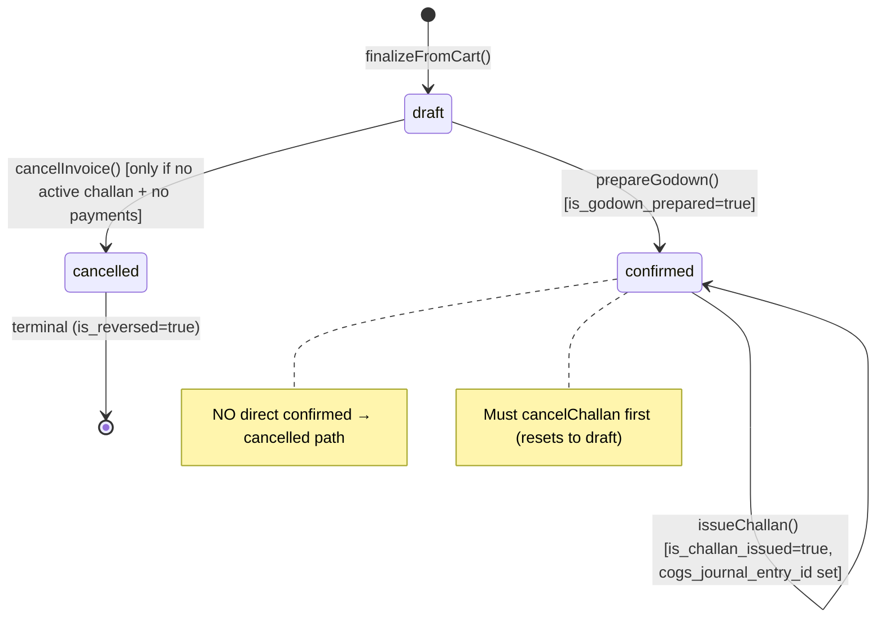

# Sales Invoice

> **Module:** Sales (Phase 10)
> **Audience:** Engineers + AI assistants + **accountants** (must review before Canonical)
> **Status:** Draft — pending accountant sign-off
> **Last reviewed:** 2025-08-03
> **Source of truth:** this file + `laravel/app/Services/Sales/SalesInvoiceService.php`
> + `laravel/app/Models/SalesInvoice.php` + `laravel/app/Models/SalesInvoiceItem.php`
> + `laravel/database/sql/04_sales.sql:26-122` + migrations noted inline.

## 1. What is it?

A **Sales Invoice** is the **revenue recognition document** of the order-to-cash cycle. It is
created from a draft cart via `SalesInvoiceService::finalizeFromCart`. At the moment of
finalization, the system simultaneously:

1. Posts a GL journal entry: **Dr `ar` (Accounts Receivable) / Cr `sales_revenue`** at
   `sub_total` (or `sub_total - discount` if no `sales_discount` ledger configured) **+ Dr
   `sales_discount`** if discount > 0 **+ Cr `transport_revenue`** if transport > 0.
2. Writes a `customer_ledger` debit row (the customer owes more).
3. Creates `sales_invoice_items` rows (warehouse_id = NULL — assigned at godown prep).
4. Creates `sales_invoice_dispatches` pipeline-tracker rows (ordered_qty = qty, dispatched_qty = 0).
5. Clears the cart atomically.

All five operations are wrapped in a single `DB::transaction()`. The invoice starts in `draft`
status. **No stock movement occurs at finalize** — stock moves at challan issue (see
`sales-challan.md`). This decoupling supports the godown-prep queue workflow and cross-branch
finalize (BUG-53).

The invoice has 4 lifecycle states: `draft → confirmed` (godown prep promotes) → `cancelled`
(with `is_reversed=true`) or terminal. There is NO direct `confirmed → cancelled` path — a
confirmed invoice must have its challan reversed first (which resets it to draft), then it can
be cancelled.

## 2. Why does it exist?

- **Revenue recognition.** The invoice is the customer's bill. The GL Dr AR / Cr Revenue entry
  is the economic event of the sale.
- **AR sub-ledger source.** The `customer_ledger` debit row written at finalize is the input to
  the AR aging report and the period-close `reconcileAR`.
- **Decoupled from stock movement.** Revenue is recognized at finalize; stock moves at challan
  issue. This supports the warehouse workflow (godown prep happens after the salesman finalizes)
  and the credit-limit guard (which must block BEFORE stock is committed).
- **Credit-limit enforcement.** The race-safe `Customer::lockForUpdate()` at
  `assertCreditLimitUnderLock` serializes concurrent finalize/edit calls for the same customer.
- **Pipeline tracking.** `sales_invoice_dispatches` tracks ordered_qty vs dispatched_qty so
  `StockAvailabilityService::getBranchAvailableQty` can subtract the open dispatch pipeline from
  physical stock (see `../inventory/warehouse-stock.md`).
- **Idempotency.** The finalize endpoint accepts an `idempotency_token` (UUID, 10-min cache) so
  a duplicate POST (e.g. network retry) does not create a duplicate invoice.

## 3. When is it used?

- **Finalize from cart.** Salesman UI (`POST admin/sales/finalize`) or mobile API
  (`POST /api/v1/sales/invoices`). Validates stock + credit limit, posts GL, clears cart.
- **Edit draft invoice.** Only `draft` status, not godown-prepared, not challan-issued, no
  payments. Reverses old GL + customer_ledger, DELETE old items/dispatches, INSERT new, post new
  GL. Edit invalidates prior godown prep (resets `is_godown_prepared=false`,
  `godown_prepared_at=null`).
- **Cancel draft invoice.** Only `draft` status, no active challan, no non-reversed payment
  allocations. Reverses GL + customer_ledger via `JournalReversalService::reverseByJournalEntry`.
- **Call-it-a-day.** Bulk UI action setting `call_a_day=true` (hides from daily collection list).
  No GL impact.
- **Credit-limit check.** AJAX endpoint `GET admin/sales/credit-check` for the cart page.

## 4. Who uses it?

- **`salesman` / `manager` / `admin`** — finalize, edit, cancel, call-it-a-day, assign
  dispatchers. NOTE: the finalize route is pulled OUT of the `admin/sales` group to drop
  `branch.isolation` (BUG-53 — cross-branch finalize allowed). The `SalesAccess::assertBranchAccessible`
  defense-in-depth check is the only guard.
- **`accountant`** — read-only index/show, receive-payment modal, export-csv, audit trail.
- **`warehouse_manager`** — read-only index/show + assign dispatchers.
- **Excluded:** `dispatcher`, `hr`, `user` — no route access (except dispatcher can view index
  for dispatch coordination).

There is **one policy class**: `SalesInvoicePolicy` (122 lines, the ONLY sales policy). Methods:
`view`, `create`, `update`, `delete`, `callItADay`, `receivePayment`, `reversePayment`,
`exportCsv`. It mirrors the route middleware. The other 7 sales sub-domains have NO policy
classes (gap G6 in `sales-overview.md`).

## 5. Related modules

- `sales-overview.md` — module map + cross-cutting concerns.
- `sales-challan.md` — godown prep + challan issue (stock OUT + COGS). The invoice's
  `is_godown_prepared` and `is_challan_issued` flags track the challan workflow.
- `sales-cart.md` — the cart source for `finalizeFromCart`.
- `sales-return.md` — returns against this invoice (requires a completed challan for the
  original avg_cost snapshot).
- `commission.md` — commission triggered by payment allocations against this invoice (DEAD CODE
  gap G2).
- `transport-cost.md` — the `transport_cost` column on `sales_invoices` + the godown-edit
  deferred-GL workflow.
- `../accounting/customer-payments.md` — customer payment + `invoice_payment_allocations` +
  `trg_ipa_no_overallocation`.
- `../accounting/journal-posting-rules.md` §7.6.1 — the Dr/Cr matrix for `postInvoiceGL`.
- `../accounting/subledger-reconciliation.md` — `reconcileAR` depends on `customer_ledger` rows.
- `../accounting/reversal-vs-cancellation.md` — `cancelInvoice` cascade pattern.
- `../inventory/stock-costing.md` §7.4 — rate semantics (NO stock movement at invoice finalize).
- `../inventory/warehouse-stock.md` — `StockAvailabilityService` pipeline subtraction.

## 6. Business rules

- **MUST** create every invoice in `draft` status. `finalizeFromCart` hardcodes `'status' => 'draft'`.
- **MUST** post GL at finalize via `postInvoiceGL`: Dr `ar` (total) / Cr `sales_revenue`
  (subTotal or subTotal−discount) + Dr `sales_discount` (if discount > 0 and ledger configured)
  + Cr `transport_revenue` (if transport > 0 and ledger configured).
- **MUST** write a `customer_ledger` debit row (`debit = total_amount`, `credit = 0`,
  `transaction_type = 'sales_invoice'`) linked to the GL journal entry via `journal_entry_id`.
- **MUST** create `sales_invoice_items` rows with `warehouse_id = NULL` (assigned at godown prep).
- **MUST** create `sales_invoice_dispatches` pipeline-tracker rows (`ordered_qty = qty`,
  `dispatched_qty = 0`).
- **MUST** clear the cart atomically within the same transaction (`clearCart` sets
  `items_json = []`, `is_soft_hold = false`).
- **MUST** enforce the credit-limit guard with a race-safe lock:
  - UX fast-fail check OUTSIDE the transaction (`checkCreditLimit` L120-135).
  - Authoritative re-check INSIDE the transaction after `Customer::lockForUpdate()` at
    `assertCreditLimitUnderLock` L944-987.
  - Override requires `override_reason` ≥ 10 characters.
- **MUST** lock branch products FOR UPDATE (`stockService->lockBranchProductsForUpdate`) before
  re-checking availability inside the transaction.
- **MUST** re-check stock availability after locking (`availabilityService->getBranchAvailableQty`
  per product; throw if `qty > available + 0.0001`).
- **MUST** generate a unique `invoice_code` via `DocumentSequenceService::nextCode('sales_invoice', 'INV', ...)`.
- **MUST** support idempotency via `idempotency_token` (UUID, 10-min cache) — duplicate POSTs
  return the original invoice instead of creating a duplicate.
- **MUST** invalidate the pipeline cache after every mutation (`availabilityService->invalidatePipelineForInvoice`).
- **MUST** dispatch notifications (`NotificationService::dispatch('sales_finalize', ...)`) wrapped
  in try/catch — failure does NOT roll back the transaction.
- **MUST** log every state transition via `SalesAuditLogger` (`saleCreated`, `saleCancelled`,
  `sale_call_a_day`, `credit_limit_override`). Note: `sale_updated` is documented but the
  `saleUpdated()` method does NOT exist in `SalesAuditLogger` — `updateInvoice` writes directly
  to `user_audit_log` via `DB::table()->insert()` (gap G14).
- **MUST** enforce branch isolation at all 4 layers (route middleware, BranchScope,
  EnforceBranchIsolation URI map `sales-invoices → sales_invoices`, RLS 5 policies). NOTE: the
  finalize route drops `branch.isolation` (BUG-53) — `SalesAccess::assertBranchAccessible` is the
  defense-in-depth guard.
- **MUST NOT** post stock movement at finalize (stock moves at challan issue).
- **MUST NOT** allow edit if status is not `draft`, or if godown-prepared, or if challan-issued,
  or if non-reversed payment allocations exist (`assertEditable` L854-872).
- **MUST NOT** allow cancel if status is not `draft`, or if an active challan exists, or if
  non-reversed payment allocations exist.
- **MUST NOT** allow `confirmed → cancelled` directly (must reverse the challan first, which
  resets to draft).

## 7. Data model

### `sales_invoices` (DDL: `04_sales.sql:26-67` — PARTITIONED by RANGE(invoice_date))

```sql
CREATE TABLE sales_invoices (
    id integer GENERATED ALWAYS AS IDENTITY,
    invoice_code varchar(30) NOT NULL,
    invoice_date date NOT NULL,
    customer_id integer NOT NULL,                    -- FK added by 07_views fk_si_customer
    salesman_id integer,                             -- NO FK to employees(id) — gap G12
    sales_person varchar(100),                       -- free-text fallback
    branch_id integer NOT NULL,
    sub_total numeric(14,2) DEFAULT 0,
    discount_amount numeric(14,2) DEFAULT 0,
    tax_amount numeric(14,2) DEFAULT 0,
    transport_cost numeric(12,2) DEFAULT 0,          -- initial estimate at finalize
    total_amount numeric(14,2) DEFAULT 0,            -- = sub_total - discount + transport
    pre_challan_transport numeric(12,2),             -- snapshot (Phase 6 godown edit)
    pre_challan_total numeric(14,2),                 -- snapshot (Phase 6 godown edit)
    paid_amount numeric(14,2) DEFAULT 0,
    due_amount numeric(14,2) DEFAULT 0,              -- GENERATED: total_amount - paid_amount
    payment_mode varchar(20) DEFAULT 'cash'
        CHECK (payment_mode IN ('cash','bank','mobile_banking','cheque','adjustment')),
    status varchar(20) NOT NULL DEFAULT 'draft'
        CHECK (status IN ('draft','confirmed','cancelled','reversed')),
    is_godown_prepared boolean NOT NULL DEFAULT false,
    godown_prepared_at timestamp(0),
    is_challan_issued boolean NOT NULL DEFAULT false,
    challan_issued_at timestamp(0),
    journal_entry_id integer REFERENCES journal_entries(id),
    cogs_journal_entry_id integer REFERENCES journal_entries(id),  -- set at challan issue
    is_reversed boolean NOT NULL DEFAULT false,
    reversed_at timestamp(0),
    reversed_by integer,
    reverse_reason text,
    is_soft_hold boolean NOT NULL DEFAULT false,
    call_a_day boolean NOT NULL DEFAULT false,        -- UI filter (no GL impact)
    notes text,
    created_by integer,
    created_at timestamp(0) DEFAULT CURRENT_TIMESTAMP,
    updated_at timestamp(0) DEFAULT CURRENT_TIMESTAMP,
    deleted_at timestamp(0),
    deleted_by integer,
    PRIMARY KEY (id, invoice_date),                   -- composite PK (partitioned)
    CONSTRAINT sales_invoices_code_unique UNIQUE (invoice_code, invoice_date)
) PARTITION BY RANGE (invoice_date);
```

**Post-DDL migrations add:** `is_blank_godown_printed` + `blank_godown_printed_at` +
`blank_godown_printed_by` (2025_07_26_000001); `deleted_at` for SoftDeletes (2025_01_23_000002);
`due_amount` → GENERATED (2025_01_20_000000). **FKs:** child tables use trigger-based enforcement
(`trg_fk_sii_si`, `trg_fk_sid_si`, `trg_fk_sdis_si`, `trg_fk_sc_si`, `trg_fk_sr_si`,
`trg_fk_ipa_si`) because PG 12-17 does not support declarative FK references TO partitioned
tables.

### `sales_invoice_items` (DDL: `04_sales.sql:86-97`)

```sql
CREATE TABLE sales_invoice_items (
    id integer GENERATED ALWAYS AS IDENTITY PRIMARY KEY,
    sales_invoice_id integer NOT NULL,                -- FK enforced by trg_fk_sii_si
    product_id integer NOT NULL REFERENCES products(id),
    warehouse_id integer REFERENCES warehouses(id) ON DELETE SET NULL,  -- NULL until godown
    qty numeric(14,4) NOT NULL,
    rate numeric(12,2) NOT NULL DEFAULT 0,
    amount numeric(14,2) GENERATED ALWAYS AS (qty * rate) STORED,
    discount_amount numeric(14,2) DEFAULT 0,
    condition_state varchar(10) DEFAULT 'Good'
        CHECK (condition_state IN ('Good','Damage'))  -- UNUSED at invoice layer — gap G8
);
```

### `sales_invoice_dispatches` (DDL: `04_sales.sql:110-122` + migrations)

```sql
CREATE TABLE sales_invoice_dispatches (
    id integer GENERATED ALWAYS AS IDENTITY PRIMARY KEY,
    sales_invoice_id integer NOT NULL,                -- FK enforced by trg_fk_sdis_si
    product_id integer NOT NULL REFERENCES products(id),
    warehouse_id integer REFERENCES warehouses(id),
    qty numeric(14,4) NOT NULL,
    rate numeric(12,2) DEFAULT 0,
    amount numeric(14,2) GENERATED ALWAYS AS (qty * rate) STORED,
    dispatch_date date,
    CONSTRAINT unique_invoice_product UNIQUE (sales_invoice_id, product_id)
    -- Post-DDL: ordered_qty, dispatched_qty, dispatched_ctn, created_by added by migrations
    -- idx_sdis_pipeline partial index WHERE dispatched_qty < ordered_qty
);
```

### `sales_invoice_dispatchers` (DDL: `04_sales.sql:102-107`)

Pivot table linking invoices to employees (dispatchers). NO UNIQUE constraint on
`(sales_invoice_id, employee_id)` — gap G10. `BelongsToMany::sync()` handles dedup at the app
layer.

### RLS

5 policies (SELECT/INSERT/UPDATE/DELETE + admin bypass) on `sales_invoices` — see
`07_views_triggers_constraints.sql:723-729`. `sales_invoice_items` has NO RLS (inherits via FK).

## 8. Lifecycle / workflow

### State machine



**Orthogonal flags** (all boolean, NOT part of status enum):
- `is_godown_prepared` — set true by `prepareGodown`, reset false by `cancelChallan`.
- `is_challan_issued` — set true by `issueChallan`, reset false by `cancelChallan`.
- `is_blank_godown_printed` — set true by `storeBlankGodown` (Step 1 of 3-step workflow); never reset.
- `is_reversed` — set true by `cancelInvoice`; never reset.
- `is_soft_hold` — UI flag, no GL impact.
- `call_a_day` — UI flag (G-10), hides from daily collection list; no GL impact.

### Finalize cascade (atomic, in `DB::transaction`)

`finalizeFromCart(data)`:

1. `SalesAccess::assertBranchAccessible(branchId)` — defense-in-depth (BUG-53).
2. Load + validate cart (`cartService->getCart`); throw if empty or validation fails.
3. Calculate totals (`subTotal`, `discount`, `transport`, `totalAmount`).
4. UX credit-limit check (fast-fail); override requires `override_reason` ≥ 10 chars.
5. **Inside `DB::transaction`:**
   a. `Customer::lockForUpdate()` + `assertCreditLimitUnderLock` (R5 race-safe re-check).
   b. `stockService->lockBranchProductsForUpdate(branchId, productIds)`.
   c. Re-check availability per product; throw if `qty > available + 0.0001`.
   d. `generateInvoiceCode()` via `DocumentSequenceService`.
   e. INSERT `sales_invoices` header (status='draft').
   f. INSERT `sales_invoice_items` (warehouse_id=NULL, condition_state='Good').
   g. INSERT `sales_invoice_dispatches` (ordered_qty=qty, dispatched_qty=0).
   h. `postInvoiceGL()` → returns `journal_entry_id`.
   i. `subLedger->postCustomerLedgerEntry(debit=total_amount, credit=0, transaction_type='sales_invoice')`.
   j. UPDATE `sales_invoices.journal_entry_id`.
   k. `cartService->clearCart(userId, customerId, branchId)`.
   l. Assign dispatchers (if provided).
   m. Audit log (`credit_limit_override` if applicable + `saleCreated`).
   n. `availabilityService->invalidatePipelineForInvoice(invoiceId)`.
   o. `notifications->dispatch('sales_finalize', ...)` (try/catch wrapped).

### Dr/Cr matrix (verbatim from `postInvoiceGL` L989-1062)

```php
$lines = [];
// Dr Accounts Receivable (total)
$lines[] = [
    'ledger_id' => $arLedgerId, 'debit' => $total, 'credit' => 0,
    'entity_type' => 'customer', 'entity_id' => $customerId,
    'memo' => 'Invoice ' . $invoiceCode . ' — AR',
];
// Cr Sales Revenue (subTotal - discount, or subTotal if no discount ledger)
$discountLedgerId = $discount > 0.01 ? $this->journalPosting->lookupLedgerByNature('sales_discount') : null;
$revenueAmount = $discountLedgerId ? $subTotal : max(0, $subTotal - $discount);
$lines[] = [
    'ledger_id' => $revenueLedgerId, 'debit' => 0, 'credit' => $revenueAmount,
    'entity_type' => 'sales_invoice', 'entity_id' => $invoiceId,
    'memo' => 'Invoice ' . $invoiceCode . ' — Revenue',
];
// Dr Discount (if applicable)
if ($discountLedgerId && $discount > 0.01) { $lines[] = [...Dr sales_discount...]; }
// Cr Transport Revenue (if applicable)
if ($transport > 0.01) {
    $transportLedgerId = $this->journalPosting->lookupLedgerByNature('transport_revenue');
    if ($transportLedgerId) { $lines[] = [...Cr transport_revenue...]; }
}
return $this->journalPosting->createJournalEntry([...], $lines);
```

### Cancel cascade (atomic, in `DB::transaction`)

`cancelInvoice(invoiceId, cancelledBy, reason)`:

1. `lockForUpdate()` on the invoice row.
2. `SalesAccess::assertBranchAccessible`.
3. Validate `isDraft()` (only draft can be cancelled).
4. **Guards:** `hasActiveChallan(invoiceId)` → throw; `invoiceHasPayments(invoiceId)` → throw.
5. `journalReversal->reverseByJournalEntry(journal_entry_id, cancelledBy, reason)` — cascades
   GL + customer_ledger reversal.
6. UPDATE `sales_invoices` SET `status='cancelled'`, `is_reversed=true`, `reversed_at=now()`,
   `reversed_by`, `reverse_reason`.
7. `availabilityService->invalidatePipelineForInvoice`.
8. `auditLogger->saleCancelled(...)`.

## 9. Integration points

| Integration | Direction | Purpose |
|---|---|---|
| `SalesCartService::getCart` + `clearCart` | outbound | Cart source + atomic clear |
| `StockAvailabilityService::getBranchAvailableQty` | outbound | Availability check (pipeline-aware) |
| `StockAvailabilityService::invalidatePipelineForInvoice` | outbound | Cache invalidation after mutation |
| `StockService::lockBranchProductsForUpdate` | outbound | Pessimistic lock on branch products |
| `JournalPostingService::createJournalEntry` via `postInvoiceGL` | outbound | GL Dr AR / Cr Revenue + Dr Discount + Cr Transport |
| `JournalPostingService::lookupLedgerByNature('ar' / 'sales_revenue' / 'sales_discount' / 'transport_revenue')` | outbound | Ledger resolution |
| `SubLedgerService::postCustomerLedgerEntry` | outbound | customer_ledger debit row |
| `JournalReversalService::reverseByJournalEntry` | outbound | Cancel cascade (GL + customer_ledger) |
| `DocumentSequenceService::nextCode('sales_invoice', 'INV', ...)` | outbound | Code generation (advisory lock) |
| `NotificationService::dispatch('sales_finalize', ...)` | outbound | Notification (try/catch wrapped) |
| `SalesAuditLogger::saleCreated / saleCancelled` | outbound | Audit events |
| `SalesChallanService::prepareGodown` (inbound) | inbound | Promotes invoice to `confirmed` |
| `SalesChallanService::cancelChallan` (inbound) | inbound | Resets invoice to `draft` |
| `CustomerPaymentService::confirmPayment` (inbound) | inbound | Updates `paid_amount` |
| `SalesReturnService::createReturn` (inbound) | inbound | Creates return against this invoice |

## 10. Edge cases

- **Cross-branch finalize (BUG-53).** The finalize route drops `branch.isolation` middleware.
  A salesman at Head Office can finalize an invoice with `branch_id` set to Branch-B. The
  `SalesAccess::assertBranchAccessible` check at L91 is the only guard (admin bypass).
- **Credit-limit race (R5).** Two concurrent finalize calls for the same customer could both
  pass the UX check but the `Customer::lockForUpdate()` inside the transaction serializes them —
  the second call's authoritative re-check will see the first's debit and throw if it exceeds
  the limit.
- **Idempotency replay.** Duplicate POST with the same `idempotency_token` (within 10-min cache
  window) returns the original invoice instead of creating a duplicate.
- **Edit invalidates godown prep.** `updateInvoice` resets `is_godown_prepared=false`,
  `godown_prepared_at=null`, and `warehouse_id=null` on all items + dispatches. The user must
  re-run godown prep after edit.
- **Transport edit at godown.** The transport cost can be edited at godown prep (Phase 6
  deferred-GL workflow — see `transport-cost.md`). The invoice's `pre_challan_transport` and
  `pre_challan_total` are snapshotted on the first edit.
- **Call-it-a-day.** Bulk UI action (`callItADay`) sets `call_a_day=true` on selected invoices.
  No GL impact — just hides from the "Sales Today" daily collection view.
- **Stale draft auto-cancel.** The `sales:cancel-stale-drafts` command nightly cancels draft
  invoices older than `config('sales.stale_draft_days')` (default 14 days) using the system user
  (`config('sales.stale_draft_cancelled_by')`, default 1).
- **Zero-amount invoice.** `postInvoiceGL` short-circuits if `total < 0.01` — no GL posted.
  `journal_entry_id` stays NULL. Edge case for free-sample invoices (rate=0).
- **Soft-deleted invoice.** `use SoftDeletes` on the model. A soft-deleted invoice's
  `customer_ledger` rows are NOT rolled back (soft-delete is not a reversal).
- **Partition boundary.** An invoice with `invoice_date` in a future month for which no partition
  exists will fail at insert time with `SQLSTATE[23514]`.
- **Back-dated invoice.** `invoice_date` in a closed period — `JournalPostingService::validatePeriod`
  throws (unless `PERIOD_CLOSE_ADMIN_OVERRIDE` is set and the user is admin).

## 11. Gaps

1. **G2 (CRITICAL)** — `SalesInvoiceApiController::update` doesn't pass `items[]`, always fails
   with "Cannot update: items list is empty." Mobile API invoice edit is broken.
   (`Api/V1/Sales/SalesInvoiceApiController.php:140-172`)

   > ✅ RESOLVED in commit 3f35e77 (SALES-1) — `update()` now validates + passes the full `items[]`
   > array (product_id + qty + rate per line; condition_state constrained to the DDL CHECK
   > `'Good'`/`'Damage'`) plus the header fields the service reads (`invoice_date`,
   > `credit_limit_override`, `override_reason`, `dispatcher_ids`). Mobile invoice edit works.
2. **G4 (CRITICAL — RESOLVED)** — `fn_financial_audit_trigger` is now attached to
   `sales_invoices` (partitioned — PG 12+ auto-inherits to monthly partitions),
   `sales_invoice_items`, `sales_invoice_dispatches`, and `sales_invoice_dispatchers`
   via migration `2026_09_01_000002` (SALES-3, commit de2b6e6). All 4 tables are now
   hash-chain-audited alongside `customer_payments`.
3. **G5 (CRITICAL — RESOLVED)** — DDL `04_sales.sql` is now refreshed to match the live
   schema (SALES-4, commit 33563e4). The DDL now includes `is_blank_godown_printed` +
   `blank_godown_printed_at` + `blank_godown_printed_by` on `sales_invoices`, and
   `ordered_qty` + `dispatched_qty` + `dispatched_ctn` + `created_by` on
   `sales_invoice_dispatches`. Plus the partial index `idx_si_call_a_day_active`,
   `idx_sdis_pipeline`, and `idx_sdis_product_warehouse`.
   NOTE: the original G5 gap text listed `call_a_day` and `sales_invoices.created_by`
   as drifted — both were ALREADY in the DDL (lines 57 + 59). Those two were NOT
   drifted; the doc claim was inaccurate. The actual drifted columns are the 3
   blank-godown-print columns + the 4 dispatch columns listed above.
4. **G8 (MAJOR)** — `sales_invoice_items.condition_state` column exists but is NEVER used at the
   invoice layer (always 'Good'). Dead column.

   > ✅ RESOLVED in SALES-AUDIT-2 — Migration
   > `2026_09_05_000011_drop_condition_state_from_sales_invoice_items.php`
   > drops the `condition_state` column from `sales_invoice_items`.
   > The column was always 'Good' at the invoice layer —
   > `SalesInvoiceService::create` hardcoded `'condition_state' => 'Good'`
   > (L211), `update` read `$item['condition_state'] ?? 'Good'` (L591),
   > and the web edit form submitted it as a hidden input always set to
   > 'Good' (edit.blade.php L80, L357). Damage is tracked via a DIFFERENT
   > column on a DIFFERENT table: `sales_return_items.condition_state`
   > (actively used by `StoreSalesReturnRequest`) + `damage_invoices`.
   > No invoice ever had a 'Damage' item — the column carried zero
   > information. All 6 code references removed:
   > - `SalesInvoiceItem` model: removed from `$fillable` + `@property`
   > - `SalesInvoiceApiController`: removed `items.*.condition_state` validation rule
   > - `SalesInvoiceService`: removed from both create + update insert arrays
   > - `edit.blade.php`: removed hidden input (L80), JS attr rename (L296), JS row template (L357)
   > - `print_invoice.blade.php`: removed `@if ($item->condition_state === 'Damage')` badge
   > - SQL baseline `04_sales.sql`: removed column from CREATE TABLE
   > Idempotent migration (Schema::hasColumn guard); `down()` recreates the
   > column with its original DEFAULT + CHECK constraint.
5. **G12 (MAJOR)** — `sales_invoices.salesman_id` has NO FK to `employees(id)`. Orphan
   salesman_id values possible.

   > ✅ RESOLVED in SALES-AUDIT-1 — Migration
   > `2026_09_05_000005_add_fk_sales_invoices_salesman_id_to_employees.php` adds
   > `FOREIGN KEY (salesman_id) REFERENCES employees(id) ON DELETE SET NULL`.
   > Approach: backfill guard NULLs out orphan salesman_id values (any
   > non-NULL salesman_id that doesn't reference an existing employees.id
   > row — rare, only happens if an employee was hard-deleted prior to
   > the FK being added), then adds the FK constraint. `ON DELETE SET NULL`
   > preserves the invoice row when an employee is deleted (only the
   > salesman link is severed — matches the existing
   > `sales_invoice_item_id ON DELETE SET NULL` pattern). SQL baseline
   > `04_sales.sql` updated to reflect the FK. Partitioning note:
   > sales_invoices is PARTITION BY RANGE (invoice_date); PostgreSQL 12+
   > supports FK constraints on partitioned tables natively (the
   > constraint is declared on the parent and inherited by all partitions).
6. **G13 (MAJOR)** — API v1 routes have NO role middleware on invoice store/update/cancel —
   only `api.auth` (token). Any authenticated API user can create/edit/cancel invoices.

   > ✅ RESOLVED in commit b3a9fd7 — Added `api.auth:salesman,manager,admin` role gate to the 3 invoice write endpoints (`POST sales/invoices`, `PUT sales/invoices/{id}`, `POST sales/invoices/{id}/cancel`) at `routes/api.php:173,175,178`. Mirrors the web RBAC at `routes/web.php:1177,1182` (cancel + update use `role:salesman,manager,admin`) and the docblock role requirement at `api.php:139`. Superadmin passes via `ApiAuth`'s superadmin bypass. Sub-problem A (Session 1, Security/RLS cluster).
7. **G14 (MINOR)** — `saleUpdated` audit event documented but NO `SalesAuditLogger::saleUpdated()`
   method. `updateInvoice` writes directly to `user_audit_log` via `DB::table()->insert()`.
8. **AuditableMasterData bypass** — the trait is `use`d on `SalesInvoice` but bypassed by
   `DB::table('sales_invoices')->insertGetId()` in `finalizeFromCart`. `master_data_*` rows are
   NEVER written through the canonical path.
9. **`customer_ledger.transaction_type` has NO CHECK constraint** — free varchar. Typos silently
   corrupt the ledger.
10. **`sales_invoice_dispatchers` has NO UNIQUE(sales_invoice_id, employee_id)** — gap G10.
11. **`sales_invoice_items.warehouse_id` has no DB-level branch-ownership check** — relies on
    app-layer `WarehouseBelongsToBranch` FormRequest rule.

## 12. Accountant review checklist

> **This is a SAFETY-CRITICAL document.** Before marking it Canonical, an accountant with
> production credentials MUST review and sign off on each item below.

- [ ] The Dr/Cr matrix (Dr `ar` / Cr `sales_revenue` + Dr `sales_discount` + Cr `transport_revenue`)
      matches the actual treatment. Cross-check `../accounting/journal-posting-rules.md` §7.6.1.
- [ ] The `customer_ledger` debit row is written with `transaction_type = 'sales_invoice'` and
      is linked to the GL journal entry via `journal_entry_id`. Confirm the AR aging report
      picks this up correctly.
- [ ] The credit-limit override audit row (`credit_limit_override` action) captures the
      `override_reason` verbatim.
- [ ] The cancel cascade reverses in the correct order: GL first (via
      `JournalReversalService::reverseByJournalEntry`), which cascades the `customer_ledger`
      reversal automatically.
- [ ] The `due_amount` GENERATED column (`total_amount - paid_amount`) is correct.
- [ ] The credit-limit race-safe lock (`Customer::lockForUpdate`) is sufficient to prevent
      concurrent finalize from exceeding the limit.
- [ ] The idempotency token (10-min cache) is sufficient to prevent duplicate invoice creation
      on network retry.
- [ ] The stale-draft auto-cancel (14-day threshold) is acceptable — confirm no legitimate
      draft should survive beyond 14 days.
- [ ] The BUG-53 cross-branch finalize gap is documented — confirm whether this is intentional
      (salesman can sell to any branch's customer) or a bug to be fixed.
- [ ] The `AuditableMasterData` bypass gap — confirm the audit team is aware that
      `master_data_*` rows are NOT written for invoice mutations through the service path.

## 13. Cross-references

- `sales-overview.md` — module map + cross-cutting concerns.
- `sales-challan.md` — godown prep + challan issue.
- `sales-cart.md` — cart source.
- `sales-return.md` — returns against this invoice.
- `commission.md` — commission (DEAD CODE — not triggered).
- `transport-cost.md` — transport revenue + godown-edit workflow.
- `../accounting/chart-of-accounts.md` — `ar`, `sales_revenue`, `sales_discount`,
  `transport_revenue` natures.
- `../accounting/journal-posting-rules.md` §7.6.1 — Dr/Cr matrix.
- `../accounting/customer-payments.md` — payment + allocations.
- `../accounting/subledger-reconciliation.md` §reconcileAR.
- `../accounting/reversal-vs-cancellation.md` §Sales Invoice.
- `../accounting/fiscal-year-period-close.md` — period gate.
- `../inventory/stock-costing.md` §7.4 — rate semantics (NO stock at finalize).
- `../inventory/warehouse-stock.md` — `StockAvailabilityService` pipeline.
- `../security/branch-context-security.md` — 4-layer isolation.
- `../security/audit-trails.md` — `UserAuditLogger` + `AuditableMasterData` (bypass gap).
- `../database/partitioning.md` — `sales_invoices` partitioning.
