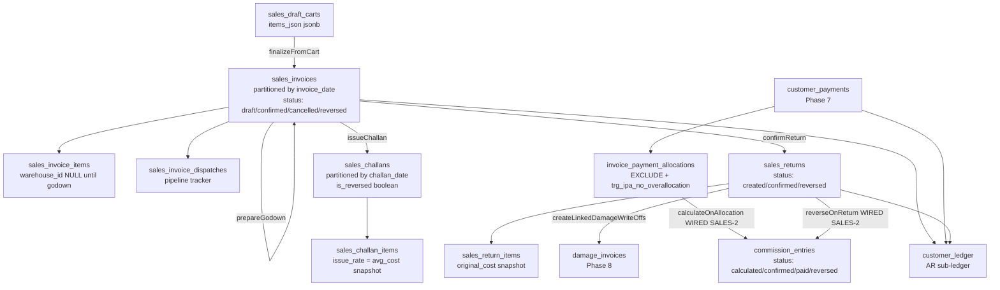

# Sales Overview — Order-to-Cash

> **Module:** Sales (Phase 10)
> **Audience:** Engineers + AI assistants + accountants + new contributors
> **Status:** Draft
> **Last reviewed:** 2025-08-03
> **Source of truth:** this file + the 7 sibling files in `sales/` + the service layer
> at `laravel/app/Services/Sales/` + the DDL at `laravel/database/sql/04_sales.sql`.

## 1. What is it?

The **Sales module** (Order-to-Cash) is the highest-volume economic cycle in the ERP. It
covers the full flow from draft cart → finalized invoice → godown preparation → challan
issue (delivery) → customer payment → commission → sales return → period close.

The module is documented across **8 files** in this folder:

| File | Scope |
|---|---|
| `sales-overview.md` (this file) | Module map, cross-cutting concerns, shared infrastructure |
| `sales-invoice.md` | Invoice finalize (revenue + AR posting), draft edit/cancel, credit-limit guard |
| `sales-challan.md` | Godown prep + challan issue (stock OUT + COGS), cancel cascade |
| `sales-cart.md` | Per-user × per-customer × per-branch JSONB draft cart |
| `sales-return.md` | Return against confirmed invoice, original-cost stock IN, reversal guard |
| `commission.md` | 4-type commission rule engine (flat/tiered/product_group/target_bonus) |
| `transport-cost.md` | Header-level transport revenue, godown-edit deferred-GL workflow |
| `sales-audit.md` | 3-layer audit infrastructure + 3-section health-check checklist |

### The core flow

```
Cart → Invoice (finalize: Dr AR / Cr Revenue + Cr Transport Revenue) →
  Godown Prep (assign warehouse_id, transport edit) →
  Challan Issue (stock OUT at avg_cost, Dr COGS / Cr Inventory, deferred transport GL) →
  Customer Payment (Dr Cash/Bank / Cr AR, invoice_payment_allocations) →
  Commission (per-payment-allocation, 4 rule types) →
  Sales Return (stock IN at ORIGINAL avg_cost, Dr AR / Cr Sales Return + Dr Inv / Cr COGS) →
  Period Close (reconcileAR, commission confirmPeriod)
```

### Key design principle: decoupled revenue vs stock movement

Revenue is recognized at **invoice finalize** (Dr AR / Cr Sales Revenue). Stock moves at
**challan issue** (Dr COGS / Cr Inventory at current avg_cost). This decoupling supports:

- **Cross-branch finalize** (a salesman at Head Office can finalize an invoice dispatched from
  Branch-B — BUG-53, documented in `sales-invoice.md`).
- **Godown-prep queue workflow** (warehouse managers prepare the godown after the salesman
  finalizes; the challan is issued when the goods physically leave).
- **Transport estimate → actual** (the transport cost is estimated at finalize, re-evaluated
  at godown prep, and the GL adjustment is deferred to challan issue — see `transport-cost.md`).

## 2. Why does it exist?

- **Customer order-to-cash** is the primary revenue stream. The module captures every sale,
  the stock it consumes, the AR it creates, the cash it collects, and the commission it earns.
- **Mirrors the legacy `legacy/app/` sales flow** (SalesController + ChallanModel +
  CustomerPaymentModel) — the migration preserved the two-document model (invoice + challan).
- **Drives the AR sub-ledger** (`customer_ledger`) and the GL `ar` control account. Every
  invoice finalization, payment, return, and adjustment posts a `customer_ledger` row linked
  to the GL journal entry.
- **Supports commission tracking** — per-payment-allocation model with 4 rule types
  (flat/tiered/product_group/target_bonus). See `commission.md` (note: the auto-calc pipeline
  is currently dead code — CRITICAL gap G2 documented there).
- **Provides transport revenue capture** — transport cost charged to the customer is Cr
  `transport_revenue` (income), NOT a separate expense. See `transport-cost.md`.

## 3. When is it used?

- **Daily operations:** salesmen finalize carts → warehouse managers prep godowns →
  dispatchers issue challans → accountants receive payments → salesmen mark "call-it-a-day".
- **Month-end:** commission period confirmation (`confirmPeriod('YYYY-MM')`) + AR aging +
  sales audit checklist (`admin/sales-audit-checklist`).
- **Period close:** `reconcileAR` cross-checks `customer_ledger` (debit + credit rows) against
  the GL `ar` control account. Any drift is surfaced via the checklist.
- **Returns:** when goods come back from a customer, a sales return is created against the
  original invoice (which must have a completed challan — the return needs the original avg_cost
  snapshot from the challan's `stock_transactions` row).

## 4. Who uses it?

| Role | Cart | Invoice | Challan | Return | Payment | Commission | Audit |
|---|---|---|---|---|---|---|---|
| `salesman` | ✅ full | ✅ create/edit/cancel draft | ❌ | ✅ create | ✅ receive | read own (G11) | ❌ |
| `warehouse_manager` | ❌ | read | ✅ godown + issue | ✅ confirm | ❌ | ❌ | ❌ |
| `dispatcher` | ❌ | read | ✅ godown + issue | ❌ | ❌ | ❌ | ❌ |
| `accountant` | ❌ | read | read | ✅ confirm/reverse | ✅ full | read | ✅ full |
| `manager` | ✅ full | ✅ full | ✅ full + cancel | ✅ full | ✅ full | ✅ admin (API) | ✅ full |
| `admin` | ✅ full | ✅ full | ✅ full + cancel | ✅ full | ✅ full | ✅ admin (API) | ✅ full |

There is **no dedicated "auditor" role** — the `accountant` role serves as the read-only audit
consumer. There is **no `SalesChallanPolicy`, `SalesReturnPolicy`, `SalesDraftCartPolicy`,
`CommissionPolicy`, `TransportCostPolicy`** classes — only `SalesInvoicePolicy` exists (gap G6
in the sibling docs). RBAC for the other 4 modules relies solely on route `role:` middleware +
`BranchScope` global scope + PostgreSQL RLS policies.

## 5. Related modules

### Deferred to Phase 6/7/8/9 docs (do NOT duplicate here)

- `../accounting/chart-of-accounts.md` — ledger natures: `ar`, `sales_revenue`, `sales_discount`,
  `sales_return`, `cogs`, `inventory`, `transport_revenue`, `cash_bank`. NOTE: `commission_expense`
  and `commission_payable` natures are NOT registered (CRITICAL gap G3 in `commission.md`).
- `../accounting/journal-posting-rules.md` §7.6.1 — the Dr/Cr matrix for the 6 sales posting
  methods (`postInvoiceGL`, `postCogsGL`, `postTransportAdjustmentGL`, `postRevenueReversalGL`,
  `postCogsReversalGL`, plus the commission GL which does not exist yet).
- `../accounting/customer-payments.md` (Phase 7) — customer payment receive/discount/write_off/
  refund + `invoice_payment_allocations` + `trg_ipa_no_overallocation`.
- `../accounting/subledger-reconciliation.md` — `customer_ledger` schema + `reconcileAR` formula
  (`SUM(debit) - SUM(credit) WHERE is_reversed=false`).
- `../accounting/reversal-vs-cancellation.md` — `JournalReversalService::reverseByJournalEntry`
  cascade pattern (covers GL + customer_ledger).
- `../accounting/financial-audit-log.md` — the hash-chain mechanism. NOTE: only `customer_payments`
  of the sales ecosystem is covered (CRITICAL gap G4 in `sales-audit.md`).
- `../accounting/fiscal-year-period-close.md` — the period-close guard on `invoice_date` /
  `challan_date` / `return_date`.
- `../inventory/stock-costing.md` §7.4-7.5 — rate semantics: `sales_challan` = current avg_cost
  OUT; `sales_return` = ORIGINAL cost preservation (snapshot from the challan's
  `stock_transactions.rate`).
- `../inventory/stock-ledger.md` — `StockService::applyTransaction` canonical entry point;
  `stock_transactions.reference_type` CHECK includes `sales_challan` and `sales_return`.
- `../inventory/damage.md` — sales-return-linked auto damage write-off
  (`SalesReturnService::createLinkedDamageWriteOffs`).
- `../security/branch-context-security.md` — the 4-layer branch-isolation pattern (route
  middleware → BranchScope → EnforceBranchIsolation → RLS).
- `../security/audit-trails.md` — `UserAuditLogger` + `AuditableMasterData` trait (note the
  bypass gap G4 in `sales-audit.md`).
- `../purchasing/purchase-audit.md` — the 12-section `PurchaseAuditService` template that
  `sales-audit.md` should mirror (currently sales has only 3 sections — gap G5).

### Sibling files in this folder

- `sales-invoice.md` — invoice finalize (revenue + AR posting).
- `sales-challan.md` — godown prep + challan issue (stock OUT + COGS).
- `sales-cart.md` — draft cart.
- `sales-return.md` — return + reversal guard.
- `commission.md` — commission rule engine.
- `transport-cost.md` — transport revenue + godown-edit deferred-GL workflow.
- `sales-audit.md` — 3-layer audit + 3-section checklist.

## 6. Business rules (cross-cutting)

- **MUST** route every stock movement through `StockService::applyTransaction` (canonical, NO
  bypass). Sales posts with `reference_type='sales_challan'` (OUT, qty negative) and
  `reference_type='sales_return'` (IN, qty positive).
- **MUST** route every GL-affecting operation through `JournalPostingService::createJournalEntry`
  (NO bypass). The 6 sales posting methods are documented in `../accounting/journal-posting-rules.md`
  §7.6.1.
- **MUST** post a `customer_ledger` row for every AR-affecting operation (invoice debit, payment
  credit, return credit, transport adjustment delta). The row is linked to the GL journal entry
  via `journal_entry_id` so the `JournalReversalService::reverseByJournalEntry` cascade
  automatically reverses both.
- **MUST** reverse (never mutate) posted entries. `cancelInvoice`, `cancelChallan`,
  `reverseReturn`, `cancelPayment` all use `JournalReversalService::reverseByJournalEntry` +
  `StockService::reverseTransaction` (append-only).
- **MUST** enforce the credit-limit guard with a race-safe lock (`Customer::lockForUpdate()` at
  `SalesInvoiceService::assertCreditLimitUnderLock` L944-987). The UX fast-fail check at L120-135
  runs OUTSIDE the transaction; the authoritative re-check runs INSIDE after locking the customer
  row.
- **MUST** enforce the returnable-qty cap on sales returns (`SalesReturnableQty::getMaxReturnableQty`:
  `invoiceItem.qty - SUM(sri.qty WHERE sr.status IN ['created','confirmed'] AND sr.is_reversed=false)`).
- **MUST** enforce the active-returns guard on `cancelChallan` (P9/A19 — reject if non-reversed
  confirmed returns exist for the parent invoice; must reverse returns first).
- **MUST** enforce the active-challan + active-payments guards on `cancelInvoice` (reject if
  either exists; must reverse them first).
- **MUST** snapshot the original avg_cost from the challan's `stock_transactions` row at
  `SalesReturnService::validateItems` time (the `original_cost` column on `sales_return_items`).
  The return posts stock IN at this ORIGINAL rate (NOT current avg_cost) — preserves cost
  integrity (`../inventory/stock-costing.md` §7.5).
- **MUST** enforce branch isolation at all 4 layers (route middleware, BranchScope,
  EnforceBranchIsolation URI map, RLS 5 policies per table).
- **MUST** log every state transition via `SalesAuditLogger` (17+ event methods, dual-write to
  `user_audit_log` DB + `logs/user_audit.log` file).
- **MUST NOT** rely on `AuditableMasterData` trait alone (gap G4 — bypassed by `DB::table()`
  raw writes in the sales services).
- **MUST NOT** assume `financial_audit_log` covers sales tables (gap G4 — only `customer_payments`
  is covered).
- **MUST NOT** auto-calculate commission on invoice creation (only on payment allocation —
  now WIRED via `CustomerPaymentService::confirmPayment → calculateOnAllocation`, gap G2
  resolved in SALES-2).

## 7. Module map



### Module interrelationship table

| From | To | Trigger | What flows |
|---|---|---|---|
| Cart | Invoice | `finalizeFromCart` | cart items → `sales_invoice_items`; cart cleared; GL Dr AR / Cr Revenue (+ Cr Transport Revenue if transport>0); `customer_ledger` debit |
| Invoice | Challan | `prepareGodown` → `issueChallan` | warehouse_id assignment; stock OUT (qty=-X); GL Dr COGS / Cr Inventory; transport adjustment GL (if godown edited transport) |
| Challan | Invoice | `cancelChallan` | reverse COGS GL + transport adjustment GL (cascade); restore invoice transport snapshot; reset invoice to draft |
| Invoice | Return | `SalesReturnService::create` + `confirm` | stock IN at ORIGINAL avg_cost; GL Dr AR / Cr Sales Return + Dr Inv / Cr COGS |
| Invoice | Commission | `CustomerPaymentService::confirmPayment → calculateOnAllocation` (WIRED SALES-2) | one `commission_entries` row per payment allocation |
| Return | Commission | `SalesReturnService::confirmReturn → reverseOnReturn` (WIRED SALES-2) | negative `commission_entries` row proportional to return_amount / invoice_total |
| Commission | GL | `confirmPeriod` (WORKING — G1 fixed 3f35e77) | per-salesman Dr Commission Expense / Cr Employee Payable (natures registered — G3 fixed 3f35e77) |

## 8. Shared infrastructure

### Services (laravel/app/Services/Sales/)

| Service | Lines | Role |
|---|---|---|
| `SalesInvoiceService` | 1072 | Cart → draft invoice finalize + draft edit + cancel; Dr AR / Cr Revenue + customer_ledger debit; credit-limit race-safe lock (R5) |
| `SalesChallanService` | 855 | Two-step flow: prepareGodown (warehouse assign, no GL) → issueChallan (stock OUT + Dr COGS / Cr Inventory) → cancelChallan (append-only reversal + transport adjustment GL) |
| `SalesCartService` | 684 | Per-user × per-customer × per-branch JSONB draft cart; merge-on-same-rate; price range + availability validation |
| `SalesReturnService` | 743 | createReturn (no GL) → confirmReturn (stock IN at ORIGINAL avg_cost + Dr Sales Return / Cr AR + Dr Inventory / Cr COGS + customer_ledger credit + linked damage write-offs) → reverseReturn (cascades all) |
| `SalesReturnReversalGuard` | 315 | Pre-check stock shortage for return reversal; structured `getBlockReasons()` + `getPreview()` snapshot |
| `SalesReturnableQty` | 102 | Shared returnable-qty calculator (batch `getReturnableQtyMap`) |
| `SalesAccess` | 121 | Defense-in-depth branch isolation: `assertBranchAccessible()` + `resolveBranchIdForWrite()` |
| `SalesAuditLogger` | 442 | 17 sales business-event methods wrapping `UserAuditLogger` |
| `CommissionService` | 864 | Commission rule engine (4 rule types) + 2 reversal paths + month-end confirm (CRITICAL BUG G1) |
| `CustomerPaymentService` | (Phase 7) | Customer payment receive/discount/write_off/refund + allocations |

### Key database tables (DDL: `04_sales.sql` + migrations)

| Table | Purpose | RLS | Partitioned |
|---|---|---|---|
| `sales_invoices` | Invoice header (partitioned PK `(id, invoice_date)`) | ✅ 5 policies | ✅ RANGE(invoice_date) |
| `sales_invoice_items` | Per-line items (amount GENERATED, warehouse_id NULL until godown) | ❌ (inherits via FK) | ❌ |
| `sales_invoice_dispatchers` | Pivot to employees (dispatchers) | ❌ | ❌ |
| `sales_invoice_dispatches` | Pipeline tracker (ordered_qty vs dispatched_qty) | ❌ | ❌ |
| `sales_challans` | Challan header (NO status column — only is_reversed boolean) | ✅ 5 policies | ✅ RANGE(challan_date) |
| `sales_challan_items` | Per-line issue_cost SSOT (issue_rate = avg_cost snapshot) | ❌ | ❌ |
| `sales_draft_carts` | JSONB draft cart (UNIQUE user+customer+branch) | ✅ 5 policies | ❌ |
| `sales_returns` | Return header (status: created/confirmed/reversed) | ✅ 5 policies | ❌ |
| `sales_return_items` | Per-line items (original_cost snapshot, condition_state, damage_invoice_id) | ❌ | ❌ |
| `customer_ledger` | AR sub-ledger (transaction_type free varchar — gap G11) | ✅ 5 policies | ✅ RANGE(transaction_date) |
| `customers` | Master data (credit_limit, opening_balance, sales_person_id NO FK — gap G13) | ✅ 5 policies | ❌ |
| `commission_rules` | Time-bounded rule (GiST EXCLUDE constraint) | ✅ 5 policies | ❌ |
| `commission_entries` | Per-allocation entry (4 triggers, 4-status state machine) | ✅ 5 policies | ❌ |

### Config

- `config/sales.php` (60 lines) — 4 knobs for stale-draft cleanup: `stale_draft_days` (default
  14), `stale_draft_auto_cancel` (default true), `stale_draft_cancelled_by` (default 1),
  `stale_draft_max_per_run` (default 200). NO credit-limit thresholds, NO price-range tolerance,
  NO commission config, NO transport config (gaps G7 in `commission.md` and `transport-cost.md`).

### Console commands

- `CancelStaleSalesDrafts` — nightly cleanup tied to `config/sales.stale_draft_*` knobs.
  Cancels draft invoices older than `stale_draft_days` with a system user
  (`stale_draft_cancelled_by`).

## 9. Critical gaps (cross-cutting)

The following gaps affect MULTIPLE sales files and are documented in detail in the relevant
sibling docs:

1. **G1 (CRITICAL)** — `customers.shop_name` column referenced but NEVER created by any migration.
   Runtime `SQLSTATE[42703]` on cart customer-search / list-drafts / customer-details AJAX calls.
   Documented in `sales-cart.md`.

   > ✅ RESOLVED in commit 3f35e77 (SALES-1) — migration `2026_09_01_000001_add_shop_name_to_customers`
   > adds the column back (nullable varchar(200), backfilled from `customer_name`). DDL baseline
   > `01_auth_and_master.sql` updated. See `sales-cart.md` §G1.
2. **G2 (CRITICAL)** — `SalesInvoiceApiController::update` doesn't pass `items[]`, always fails
   with "Cannot update: items list is empty." Mobile API invoice edit is broken. Documented in
   `sales-invoice.md`.

   > ✅ RESOLVED in commit 3f35e77 (SALES-1) — `update()` now validates + passes the full `items[]`
   > array + the header fields the service reads. See `sales-invoice.md` §G2.
3. **G3 (CRITICAL)** — `StockAvailabilityService` pipeline filter references nonexistent status
   `'challan_completed'`. Currently benign (secondary filter catches it) but fragile. Documented
   in `sales-challan.md`.

   > ✅ RESOLVED in commit 3f35e77 (SALES-1) — removed the nonexistent `'challan_completed'` from
   > all 5 `whereNotIn` arrays (behavior-preserving). See `sales-challan.md` §G3.

   > Note: the Commission cluster G1+G2+G3 (item 6 below) is FULLY resolved — G1+G3 in
   > 3f35e77 (SALES-1), G2 in 2f686c0 (SALES-2).
4. **G4 (CRITICAL — RESOLVED)** — `fn_financial_audit_trigger` is now attached to ALL 9 sales
   tables + 5 commission tables (14 total) via migration `2026_09_01_000002` (SALES-3, commit
   de2b6e6). Only `customer_payments` was previously hash-chain-audited; now all 14 sales+
   commission tables are. `customer_ledger` (accounting sector) remains a separate gap.
   Documented in `sales-audit.md`.
5. **G5 (CRITICAL)** — DDL `04_sales.sql` is stale; many live columns/tables exist ONLY in
   migrations (`sales_challan_items`, `is_blank_godown_printed`, `call_a_day`, `ordered_qty`,
   `dispatched_qty`, `cogs_amount`, `reason`, `sales_invoice_item_id`, `damage_invoice_id`).
   Documented across the relevant sibling docs.
6. **Commission G1+G2+G3 (CRITICAL — ALL RESOLVED)** — G1 (`postCommissionExpense` missing)
   + G3 (`commission_expense`/`commission_payable` natures not registered) resolved in commit
   3f35e77 (SALES-1). G2 (auto-calc pipeline dead code — `calculateOnAllocation`,
   `reverseOnReturn`, `reverseOnPaymentReversal`, `markAsPaid` never called) resolved in commit
   2f686c0 (SALES-2). Documented in `commission.md`.

## 10. Edge cases (cross-cutting)

- **Cross-branch finalize (BUG-53).** The `finalize` route is pulled OUT of the `admin/sales`
  group to drop `branch.isolation` middleware — a salesman at Head Office can finalize an invoice
  with `branch_id` set to Branch-B. The `SalesAccess::assertBranchAccessible` defense-in-depth
  check at `SalesInvoiceService::finalizeFromCart` L91 is the only guard (admin bypass).
- **Credit-limit override.** Requires `override_reason` ≥ 10 characters. The override is
  audit-logged as a `credit_limit_override` action in `user_audit_log`.
- **Stale drafts.** Auto-cancelled by `sales:cancel-stale-drafts` command nightly. The system
  user (`config('sales.stale_draft_cancelled_by')`, default 1) is the actor in the audit log.
- **Call-it-a-day.** `call_a_day=true` hides the invoice from the "Sales Today" daily collection
  view. Bulk action via `callItADay` (no GL impact — UI convenience only).
- **Godown re-edit.** The transport snapshot (`pre_challan_transport` / `pre_challan_total`) is
  taken ONLY on the FIRST godown edit (preserved across re-edits so `issueChallan`'s GL reflects
  the TOTAL change from pre-godown state). Documented in `transport-cost.md`.
- **Sales return guard on cancelChallan.** `cancelChallan` rejects if non-reversed confirmed
  returns exist for the parent invoice (P9/A19 — must reverse returns first). Documented in
  `sales-challan.md`.
- **Sales return guard on reverseReturn.** `reverseReturn` pre-checks stock shortage via
  `SalesReturnReversalGuard::getBlockReasons()` — if reversing the return's stock IN would push
  any warehouse's on-hand below zero, the reversal is blocked with a 422. Documented in
  `sales-return.md`.
- **Invoice cancel guards.** `cancelInvoice` rejects if an active challan exists OR if
  non-reversed payment allocations exist (must reverse them first). Documented in
  `sales-invoice.md`.
- **Partition boundary.** A sales invoice / challan / return with a date in a future month for
  which no partition exists will fail at insert time with `SQLSTATE[23514]: no partition of
  relation found`. The partition maintenance job must create future partitions ahead of time.
- **Back-dated operations.** `invoice_date` / `challan_date` / `return_date` in a closed period —
  `JournalPostingService::validatePeriod` throws (unless `PERIOD_CLOSE_ADMIN_OVERRIDE` is set and
  the user is admin).

## 11. Gaps (cross-cutting summary)

The full gap catalogues are in the sibling docs. Cross-cutting gaps (affecting multiple files):

1. **No `SalesChallanPolicy`, `SalesReturnPolicy`, `SalesDraftCartPolicy`, `CommissionPolicy`,
   `TransportCostPolicy` classes** — only `SalesInvoicePolicy` exists. Per-row policy gates
   impossible for 5 of the 8 sales sub-domains. MAJOR.
2. **`AuditableMasterData` trait bypassed by `DB::table()` raw writes** — the trait is `use`d on
   `SalesInvoice`, `SalesChallan`, `SalesReturn`, `Customer`, `CommissionRule`, `CommissionEntry`
   but never fires because the services use raw queries. CRITICAL — silent audit gap.
3. **`fn_financial_audit_trigger` NOT attached to ANY sales/commission table** — only
   `customer_payments` is covered. CRITICAL — forensic gap.
4. **DDL `04_sales.sql` is stale** — 8+ columns and 1 table (`sales_challan_items`) exist only
   in migrations. CRITICAL — schema documentation drift.
5. **`customer_ledger.transaction_type` has NO CHECK constraint** — free varchar. Typos silently
   corrupt the ledger. MAJOR.
6. **API v1 routes have NO role middleware on invoice store/update/cancel and return
   store/confirm/reverse** — only `api.auth` (token). Any authenticated API user can
   create/edit/cancel invoices and create/confirm/reverse returns. MAJOR (same class as BUG-52
   which was fixed for challans but NOT for invoices/returns).
7. **No `SalesAuditService` class** — the 3-section checklist lives inline in
   `ReportController::computeSalesAuditChecks`. Compare to `PurchaseAuditService` with 12
   sections. MAJOR.
8. **`salesman_id` has NO FK to `employees(id)`** on `sales_invoices` — orphan salesman_id
   values possible. MAJOR.

## 12. Review checklist

- [ ] All 8 sales files cross-reference each other and the Phase 6/7/8/9 docs.
- [ ] The module map (§7) matches the actual code flow (cart → invoice → godown → challan →
      payment → commission → return).
- [ ] The decoupled revenue-vs-stock principle (revenue at finalize, stock at challan) is
      documented in `sales-invoice.md` and `sales-challan.md`.
- [ ] The 8 cross-cutting gaps (§11) are documented in the relevant sibling docs.
- [ ] The 6 CRITICAL gaps (§9) are flagged for immediate attention.
- [ ] The role matrix (§4) matches the actual route middleware.
- [ ] The partitioning pattern (sales_invoices by invoice_date, sales_challans by challan_date,
      customer_ledger by transaction_date) is documented.
- [ ] The retention config (sales_invoices/sales_challans/sales_returns = 84 months) is
      documented.

## 13. Cross-references

- `sales-invoice.md`, `sales-challan.md`, `sales-cart.md`, `sales-return.md`, `commission.md`,
  `transport-cost.md`, `sales-audit.md` — the 7 sibling files.
- `../accounting/chart-of-accounts.md` — ledger natures.
- `../accounting/journal-posting-rules.md` §7.6.1 — Dr/Cr matrix.
- `../accounting/customer-payments.md` — customer payment + allocations.
- `../accounting/subledger-reconciliation.md` — `reconcileAR`.
- `../accounting/reversal-vs-cancellation.md` — reversal cascade.
- `../accounting/financial-audit-log.md` — hash-chain (partial coverage gap).
- `../accounting/fiscal-year-period-close.md` — period-close gate.
- `../inventory/stock-costing.md` §7.4-7.5 — rate semantics.
- `../inventory/stock-ledger.md` — `StockService::applyTransaction`.
- `../inventory/damage.md` — sales-return-linked auto damage write-off.
- `../security/branch-context-security.md` — 4-layer branch isolation.
- `../security/audit-trails.md` — `UserAuditLogger` + `AuditableMasterData` (bypass gap).
- `../purchasing/purchase-audit.md` — 12-section `PurchaseAuditService` template.
- `../database/partitioning.md` — partitioning pattern.
