# Sales Return

> **Module:** Sales (Phase 10)
> **Audience:** Engineers + AI assistants + **accountants** (must review before Canonical)
> **Status:** Draft — pending accountant sign-off
> **Last reviewed:** 2025-08-03
> **Source of truth:** this file + `laravel/app/Services/Sales/SalesReturnService.php`
> + `laravel/app/Services/Sales/SalesReturnReversalGuard.php` + `laravel/app/Services/Sales/SalesReturnableQty.php`
> + `laravel/app/Models/SalesReturn.php` + `laravel/app/Models/SalesReturnItem.php`
> + `laravel/database/sql/04_sales.sql:176-213` + migrations noted inline.

## 1. What is it?

A **Sales Return** reverses goods back from a customer. It is **always created against a
confirmed invoice** (`sales_invoice_id` required) that has a **completed challan** (the return
needs the original avg_cost snapshot from the challan's `stock_transactions` row). The return
has 3 lifecycle states: `created → confirmed → reversed`.

At `confirmReturn`, the system simultaneously:

1. Applies stock IN per Good-condition item via `StockService::applyTransaction` with
   `reference_type='sales_return'`, `qty = +qty` (positive = IN), `rate = original_cost` (the
   avg_cost at the time of the original challan — NOT current avg_cost). This restores avg_cost
   to its pre-sale value (original-cost preservation — `../inventory/stock-costing.md` §7.5).
2. Creates linked damage write-offs for Damage-condition items via `DamageService::createDamage`
   + `confirmDamage(force_confirm=true)` (bypasses maker-checker — the return's confirm IS the
   approval). Links `sales_return_items.damage_invoice_id`.
3. Posts a GL journal entry: **Dr `sales_return` / Cr `ar`** at `total_amount` (revenue reversal).
4. Posts a second GL journal entry: **Dr `inventory` / Cr `cogs`** at `cogs_amount` (COGS
   reversal at original_cost).
5. Writes a `customer_ledger` credit row (the customer owes less).
6. Increments `sales_return_items` linkage.

All operations are wrapped in a single `DB::transaction()`. The return supports a **Phase 5
`condition_state`** field per line: `Good` (default) or `Damage`. A `Damage` line skips the
stock movement entirely (the goods were never usable) but still posts the GL + customer_ledger
entries AND still creates a linked damage write-off.

The return has a **reversal guard** (`SalesReturnReversalGuard`) that pre-checks stock shortage
before `reverseReturn` — if reversing the return's stock IN would push any warehouse's on-hand
below zero, the reversal is blocked with a 422.

## 2. Why does it exist?

- **Reverse defective or incorrect goods.** When goods come back from a customer, the system
  must reverse the stock, GL, and AR impact of the original sale.
- **Cost integrity on reversal.** The return uses the **original avg_cost** (snapshotted from
  the challan's `stock_transactions.rate`) — NOT the current `avg_cost`. This means if a product
  was sold at avg_cost 100 and the current avg_cost is 110 (because later receipts were at 110),
  returning 1 unit restores inventory at 100, not 110. The customer credit matches what was
  actually paid for that unit. See `../inventory/stock-costing.md` §7.5.
- **Damage condition (Phase 5).** A `Damage` line represents goods that were never usable (e.g.
  broken in transit). The buyer still wants a credit, so the GL + customer_ledger entries are
  posted, but the warehouse stock is not incremented (it would inflate usable stock). Instead,
  a linked `damage_invoices` row is created via `DamageService` to write off the damaged goods.
- **Returnable-qty cap.** `SalesReturnableQty::getMaxReturnableQty` ensures you cannot return
  more than was sold (minus already-returned in non-reversed returns).
- **Reversal guard.** `SalesReturnReversalGuard` prevents reversing a return if the warehouse
  doesn't have enough on-hand to absorb the OUT movement (e.g. the returned goods were already
  sold again and are no longer in stock).

## 3. When is it used?

- **`createReturn`** — validates invoice not reversed, finds the active challan, validates
  returnable-qty cap per item, snapshots `original_cost` from the challan's `stock_transactions`.
  NO stock movement, NO GL at create.
- **`confirmReturn`** — the economic event. Stock IN (Good only) + linked damage write-offs
  (Damage only) + GL revenue reversal + GL COGS reversal + customer_ledger credit.
- **`reverseReturn`** — reverses everything. Pre-checks stock shortage via
  `SalesReturnReversalGuard`. Reverses both GL journals + linked customer_ledger (cascade) +
  reverses linked damage write-offs FIRST + reverses stock movements (append-only).

## 4. Who uses it?

- **`salesman` / `manager` / `admin`** — create.
- **`warehouse_manager` / `accountant` / `manager` / `admin`** — confirm.
- **`accountant` / `manager` / `admin`** — reverse.
- **Excluded:** `dispatcher`, `hr`, `user` — no route access.

There is **no `SalesReturnPolicy` class** (gap G6 in `sales-overview.md`). RBAC is enforced only
by route `role:` middleware + `branch.isolation` + RLS.

## 5. Related modules

- `sales-overview.md` — module map.
- `sales-invoice.md` — the parent invoice (must be confirmed + have a completed challan).
- `sales-challan.md` — the challan provides the `original_cost` snapshot via
  `stock_transactions.rate` where `reference_type='sales_challan'` and `reference_id=challanId`.
  The P9/A19 guard on `cancelChallan` blocks cancel if active returns exist.
- `../inventory/stock-costing.md` §7.4-7.5 — rate semantics: `sales_return` = ORIGINAL cost
  preservation (NOT current avg_cost).
- `../inventory/stock-ledger.md` — `stock_transactions.reference_type='sales_return'` (one of 11
  CHECK values).
- `../inventory/damage.md` — sales-return-linked auto damage write-off
  (`SalesReturnService::createLinkedDamageWriteOffs` calls `DamageService::createDamage` +
  `confirmDamage(force_confirm=true)`).
- `../accounting/journal-posting-rules.md` §7.6.1 — Dr/Cr matrix for `postRevenueReversalGL` +
  `postCogsReversalGL`.
- `../accounting/customer-payments.md` — the `customer_ledger` credit row mirrors the invoice's
  debit row.
- `../accounting/subledger-reconciliation.md` §reconcileAR — nets credit (return) + debit
  (invoice) rows.
- `../accounting/reversal-vs-cancellation.md` — `reverseReturn` cascade pattern.
- `../purchasing/purchase-return.md` — analogous Good/Damage condition pattern (Phase 5).

## 6. Business rules

- **MUST** create every return against a confirmed invoice with a completed (non-reversed)
  challan. The challan provides the `original_cost` snapshot.
- **MUST** snapshot `original_cost` per item from the challan's `stock_transactions.rate` at
  `validateItems` time (stored in `sales_return_items.original_cost`). Throw if the challan
  stock transaction is missing or reversed.
- **MUST** enforce the returnable-qty cap per item: `qty ≤ invoiceItem.qty - SUM(sri.qty WHERE
  sr.status IN ['created','confirmed'] AND sr.is_reversed=false)` (0.0001 tolerance). Both
  'created' and 'confirmed' returns tie up qty (a pending return reserves the qty).
- **MUST** apply stock IN per **Good** line via `StockService::applyTransaction` with:
  - `qty = +(float) $item->qty` (positive = IN)
  - `rate = (float) $item->original_cost` (ORIGINAL avg_cost from challan, NOT current)
  - `reference_type = 'sales_return'`
  - `reference_id = $return->id`
- **MUST** skip stock movement for **Damage** condition lines (Phase 5 — the goods were never
  usable). Instead, create a linked `damage_invoices` row via `DamageService::createDamage` +
  `confirmDamage(force_confirm=true)` (bypasses maker-checker — the return's confirm IS the
  approval). Link `sales_return_items.damage_invoice_id`.
- **MUST** post GL revenue reversal via `postRevenueReversalGL`: Dr `sales_return` / Cr `ar` at
  `total_amount` (covers ALL items incl. Damage).
- **MUST** post GL COGS reversal via `postCogsReversalGL`: Dr `inventory` / Cr `cogs` at
  `cogs_amount` (the `original_cost × qty` sum — covers ALL items incl. Damage).
- **MUST** write a `customer_ledger` credit row (`debit=0`, `credit=total_amount`,
  `transaction_type='sales_return'`) linked to the revenue-reversal GL journal entry.
- **MUST** pre-check stock shortage before `reverseReturn` via
  `SalesReturnReversalGuard::getBlockReasons()`. If any warehouse would go negative, throw with
  a structured message (422 via the FormRequest's `withValidator`).
- **MUST** cascade reverse on `reverseReturn`:
  1. `JournalReversalService::reverseByJournalEntry(journal_entry_id)` — reverses revenue GL +
     linked customer_ledger.
  2. `JournalReversalService::reverseByJournalEntry(cogs_journal_entry_id)` — reverses COGS GL.
  3. **Reverse linked damage write-offs FIRST** (before return stock reversal) via
     `reverseLinkedDamageForReturn()` — calls `DamageService::cancelDamage` on each linked
     `damage_invoices` row. Clears `sales_return_items.damage_invoice_id`.
  4. `StockService::reverseTransaction` per `stock_transactions WHERE reference_type='sales_return'
     AND reference_id=? AND is_reversed=false` (append-only — naturally skips Damage rows which
     created no stock_transactions).
  5. UPDATE `sales_returns` SET `status='reversed'`, `is_reversed=true`, `reversed_at=now()`,
     `reversed_by`, `reverse_reason`.
- **MUST** log every transition via `SalesAuditLogger` (`returnCreated`, `returnConfirmed`,
  `returnReversed`).
- **MUST** enforce branch isolation at all 4 layers.
- **MUST NOT** use current `avg_cost` as the return rate — always the original receive rate.
- **MUST NOT** allow `created → reversed` directly (must confirm first).
- **MUST NOT** allow `reverseReturn` if stock shortage would result (reversal guard).

## 7. Data model

### `sales_returns` (DDL: `04_sales.sql:176-198` + migrations)

```sql
CREATE TABLE sales_returns (
    id integer GENERATED ALWAYS AS IDENTITY PRIMARY KEY,
    return_code varchar(30) NOT NULL,
    return_date date NOT NULL,
    sales_invoice_id integer NOT NULL,               -- FK enforced by trg_fk_sr_si (trigger-based)
    customer_id integer NOT NULL,
    branch_id integer NOT NULL REFERENCES branches(id),
    total_amount numeric(14,2) DEFAULT 0,            -- Σ(qty × rate) at SALES rate (revenue reversal)
    status varchar(20) NOT NULL DEFAULT 'created'
        CHECK (status IN ('created','confirmed','reversed')),
    journal_entry_id integer REFERENCES journal_entries(id),          -- revenue reversal GL
    cogs_journal_entry_id integer REFERENCES journal_entries(id),     -- COGS reversal GL
    cogs_amount numeric(14,2) DEFAULT 0,             -- snapshot of total COGS (added by 2025_01_08_000003)
    is_reversed boolean NOT NULL DEFAULT false,
    reversed_at timestamp(0),
    reversed_by integer,
    reverse_reason text,
    reason text,                                     -- original return reason (added by 2025_01_08_000003)
    notes text,
    created_by integer,
    created_at timestamp(0) DEFAULT CURRENT_TIMESTAMP,
    updated_at timestamp(0) DEFAULT CURRENT_TIMESTAMP,
    deleted_at timestamp(0),
    CONSTRAINT sales_returns_code_unique UNIQUE (return_code)
);
```

### `sales_return_items` (DDL: `04_sales.sql:202-213` + migrations)

```sql
CREATE TABLE sales_return_items (
    id integer GENERATED ALWAYS AS IDENTITY PRIMARY KEY,
    sales_return_id integer NOT NULL REFERENCES sales_returns(id) ON DELETE CASCADE,
    sales_invoice_item_id integer,                   -- added by 2025_01_08_000003 (C.4 fix)
    product_id integer NOT NULL REFERENCES products(id),
    warehouse_id integer REFERENCES warehouses(id),
    qty numeric(14,4) NOT NULL,
    rate numeric(12,2) NOT NULL DEFAULT 0,           -- SALES rate (revenue reversal)
    amount numeric(14,2) GENERATED ALWAYS AS (qty * rate) STORED,
    condition_state varchar(10) DEFAULT 'Good'
        CHECK (condition_state IN ('Good','Damage')),
    original_cost numeric(12,2) DEFAULT 0,           -- snapshot of avg_cost at original challan time
    damage_invoice_id integer                        -- added by 2025_01_09_000002 (P1-5 linkage)
);
```

### RLS

5 policies (SELECT/INSERT/UPDATE/DELETE + admin bypass) on `sales_returns` — see
`07_views_triggers_constraints.sql:747-753`. `sales_return_items` has NO RLS.

## 8. Lifecycle / workflow

### State machine

```mermaid
stateDiagram-v2
    [*] --> created: createReturn() [requires confirmed invoice + completed challan]
    created --> confirmed: confirmReturn() [stock IN at original_cost + GL + damage write-offs]
    confirmed --> reversed: reverseReturn() [BLOCKED if stock shortage]
    created --> created: (abandoned — no explicit cancel; stale 'created' returns are inert)
    reversed --> [*]: terminal
```



### Confirm cascade (atomic, in `DB::transaction`)

`confirmReturn(returnId, confirmedBy)`:

1. `lockForUpdate()` on the return row; assert `isCreated()`.
2. **Per item:**
   - If `condition_state === 'Damage'`: skip stock movement (will be handled by
     `createLinkedDamageWriteOffs`).
   - If `condition_state === 'Good'`: `stockService->applyTransaction(['qty' => +$qty, 'rate' =>
     $item->original_cost, 'reference_type' => 'sales_return', 'reference_id' => $returnId])`.
3. **`createLinkedDamageWriteOffs()`** — for each Damage-condition item grouped by warehouse:
   - `DamageService::createDamage(['warehouse_id', 'damage_date=returnDate', 'damage_type' =>
     'customer_return', 'reason_code'=>'returned_damaged', 'suppress_notification'=>true, 'items'=>...])`.
   - UPDATE `damage_invoices.sales_return_id = return.id`.
   - `DamageService::confirmDamage($damage->id, $confirmedBy, force_confirm:true,
     forceNote:"Auto-approved: linked to sales return #{return_code}")` — bypasses maker-checker.
   - UPDATE `sales_return_items.damage_invoice_id = $damage->id`.
4. `postRevenueReversalGL(return)` → `journal_entry_id` (Dr `sales_return` / Cr `ar` at total_amount).
5. `postCogsReversalGL(return)` → `cogs_journal_entry_id` (Dr `inventory` / Cr `cogs` at cogs_amount).
6. `subLedger->postCustomerLedgerEntry(debit=0, credit=total_amount, transaction_type='sales_return')`.
7. UPDATE `sales_returns` SET `status='confirmed'`, `journal_entry_id`, `cogs_journal_entry_id`.
8. `auditLogger->returnConfirmed(...)`.
9. `notifications->dispatch(...)` (try/catch wrapped).

### Dr/Cr matrix (verbatim from `postRevenueReversalGL` L415-452)

```php
return $this->journalPosting->createJournalEntry([
    'entry_date' => $return->return_date->format('Y-m-d'),
    'reference_type' => 'sales_return',
    'reference_id' => $return->id,
    'branch_id' => $return->branch_id,
    'description' => 'Sales Return Revenue Reversal ' . $return->return_code,
    'source' => 'sales_return',
    'created_by' => $createdBy,
], [
    [
        'ledger_id' => $returnLedgerId,       // nature: sales_return
        'debit' => $amount, 'credit' => 0,
        'entity_type' => 'sales_return', 'entity_id' => $return->id,
        'memo' => 'Return ' . $return->return_code . ' — revenue reversal',
    ],
    [
        'ledger_id' => $arLedgerId,           // nature: ar
        'debit' => 0, 'credit' => $amount,
        'entity_type' => 'customer', 'entity_id' => $return->customer_id,
        'memo' => 'Return ' . $return->return_code . ' — AR credit',
    ],
]);
```

## 9. Integration points

| Integration | Direction | Purpose |
|---|---|---|
| `StockService::applyTransaction` (Good lines only) | outbound | Per-line stock IN at ORIGINAL avg_cost |
| `StockService::reverseTransaction` | outbound | Per-row stock reversal on reverseReturn (Good rows only) |
| `DamageService::createDamage` + `confirmDamage(force_confirm=true)` | outbound | Linked damage write-offs for Damage lines |
| `DamageService::cancelDamage` | outbound | Reverse linked damage write-offs on reverseReturn (BEFORE return stock reversal) |
| `JournalPostingService::createJournalEntry` via `postRevenueReversalGL` | outbound | Dr `sales_return` / Cr `ar` |
| `JournalPostingService::createJournalEntry` via `postCogsReversalGL` | outbound | Dr `inventory` / Cr `cogs` |
| `JournalReversalService::reverseByJournalEntry` × 2 | outbound | ReverseReturn cascade (revenue JE + COGS JE) |
| `SubLedgerService::postCustomerLedgerEntry` | outbound | customer_ledger credit row |
| `SalesReturnReversalGuard::getBlockReasons` | outbound | Pre-check stock shortage before reverseReturn |
| `SalesReturnableQty::getMaxReturnableQty` / `getReturnableQtyMap` | outbound | Returnable-qty cap validation |
| `SalesChallanService::cancelChallan` P9/A19 guard (inbound) | inbound | Blocks cancelChallan if active returns exist |
| `DocumentSequenceService::nextCode('sales_return', 'SR', ...)` | outbound | Code generation |
| `SalesAuditLogger::returnCreated / returnConfirmed / returnReversed` | outbound | Audit events |

## 10. Edge cases

- **Damage-only return.** All lines have `condition_state='Damage'`. No stock movement occurs
  (no `stock_transactions` rows with `reference_type='sales_return'`). GL + customer_ledger +
  linked damage write-offs still posted.
- **Mixed Good + Damage return.** Per-line branch in `confirmReturn`. Good lines create stock
  IN; Damage lines create linked damage write-offs. GL covers all items.
- **Full return (qty = invoiceItem.qty).** `return_qty` becomes equal to `qty`. No further
  returns can be created against that invoice item (returnable_qty drops to 0).
- **`reverseReturn` with stock shortage.** `SalesReturnReversalGuard::getBlockReasons` returns
  structured tuples `[{warehouse_name, product_name, needed, available, shortfall}]`. The
  FormRequest's `withValidator` fails fast with 422 BEFORE the service is called.
- **`reverseReturn` reverses linked damage FIRST.** `reverseLinkedDamageForReturn` calls
  `DamageService::cancelDamage` on each linked damage invoice BEFORE reversing the return's
  stock movements. This order matters — the damage write-off's stock OUT must be reversed before
  the return's stock IN is reversed (otherwise the warehouse could go negative mid-cascade).
- **Rate fallback.** If `item.rate <= 0` and `invoiceItemId > 0`, fall back to
  `sales_invoice_items.rate` (`validateItems` L448-451).
- **`original_cost` lookup failure.** If the challan's `stock_transactions` row is missing or
  reversed, `validateItems` throws "Cannot determine original avg_cost for product X from
  challan." The return cannot be created.
- **Back-dated return.** `return_date` in a closed period — `JournalPostingService::validatePeriod`
  throws.
- **Soft-deleted return.** `use SoftDeletes` on the model. A soft-deleted return's stock + GL
  are NOT rolled back (soft-delete is not a reversal).

## 11. Gaps

1. **G4 (CRITICAL)** — `fn_financial_audit_trigger` NOT attached to `sales_returns` /
   `sales_return_items`. Only `customer_payments` is hash-chain-audited.
2. **G5 (CRITICAL)** — DDL `04_sales.sql` is stale: `cogs_amount`, `reason`,
   `sales_invoice_item_id`, `damage_invoice_id` exist only in migrations.
3. **G6 (MAJOR)** — No `SalesReturnPolicy` class. RBAC via route middleware + RLS only.

   > ✅ RESOLVED in commit 1ccc5b6 — Policy class `App\Policies\SalesReturnPolicy` created + registered in `AppServiceProvider::boot()`. Mirrors existing `role:` middleware exactly (defense-in-depth — no behavior change). Methods: viewAny/view/create/confirm/reverse/delete/reversePreview/getInvoiceDetails/searchInvoices/summary/export/audit/printSlip. Splits `viewAny()` (index: `salesman,accountant,warehouse_manager,manager,admin`) from `view()` (show: `accountant,warehouse_manager,manager,admin`) to mirror the divergent route middleware exactly.
4. **G13 (MAJOR)** — API v1 routes have NO role middleware on return store/confirm/reverse —
   only `api.auth` (token). Any authenticated API user can create/confirm/reverse returns.

   > ✅ RESOLVED in commit b3a9fd7 — Added `api.auth:<roles>` gate to the 3 return write endpoints at `routes/api.php:208,210,213`, mirroring the web RBAC: store → `api.auth:salesman,manager,admin` (web L1557); confirm → `api.auth:warehouse_manager,accountant,manager,admin` (web L1518); reverse → `api.auth:accountant,manager,admin` (web L1522). Superadmin passes via `ApiAuth`'s superadmin bypass. Sub-problem A (Session 1, Security/RLS cluster).
5. **G16 (MAJOR)** — `sales_returns` has NO `confirmed_at` / `confirmed_by` columns. The
   confirmer's identity is recoverable only via `user_audit_log`. The `printSlip` controller
   method explicitly works around this by querying `user_audit_log` for `action='return_confirmed'`.
6. **AuditableMasterData bypass** — the trait is `use`d on `SalesReturn` but bypassed by
   `DB::table('sales_returns')->insertGetId()` in `createReturn`.
7. **`reverseReturn` does NOT call `CommissionService::reverseOnReturn`** — commission reversal
   on sales return is DEAD CODE (see `commission.md` gap G2).
8. **No `cancelled` status** — a `created` return can be abandoned by simply not confirming it
  (no explicit cancel). Stale `created` returns are inert (they reserve returnable qty but post
  nothing). There is no cleanup job for stale `created` returns.
9. **Damage GL treatment non-obvious** — a Damage line posts Dr `sales_return` / Cr `ar` (revenue
   reversal) AND Dr `inventory` / Cr `cogs` (COGS reversal) at the Damage line's amount, even
   though no stock was restored. The linked damage write-off then posts Dr `damage_loss` / Cr
   `inventory` (stock OUT). The net GL effect on `inventory` is zero (Cr from return + Dr from
   damage = net zero) — confirm this is the desired treatment.

## 12. Accountant review checklist

> **This is a SAFETY-CRITICAL document.** Before marking it Canonical, an accountant with
> production credentials MUST review and sign off on each item below.

- [ ] The Dr/Cr matrix (Dr `sales_return` / Cr `ar` at `total_amount` + Dr `inventory` / Cr
      `cogs` at `cogs_amount`) matches the actual treatment. Cross-check
      `../accounting/journal-posting-rules.md` §7.6.1.
- [ ] The rate used for stock IN is the **ORIGINAL avg_cost** (from the challan's
      `stock_transactions.rate`), NOT current `avg_cost`. Confirm the original-cost-preservation
      rule (`../inventory/stock-costing.md` §7.5) is correct.
- [ ] The `cogs_amount` snapshot on `sales_returns` (added by migration `2025_01_08_000003`)
      matches the sum of `sales_return_items.original_cost × qty`. This is used for the COGS
      reversal GL — confirm it's correct.
- [ ] The `customer_ledger` credit row is written with `transaction_type='sales_return'` and is
      linked to the revenue-reversal GL journal entry.
- [ ] The Damage condition's GL treatment — Dr `inventory` / Cr `cogs` at the Damage line's
      amount (even though no stock was restored) — is correct. The linked damage write-off then
      Dr `damage_loss` / Cr `inventory` (stock OUT). Net `inventory` effect is zero. Confirm.
- [ ] The `reverseReturn` cascade reverses linked damage write-offs FIRST (before return stock
      reversal) — confirm the order is correct (prevents warehouse going negative mid-cascade).
- [ ] The `SalesReturnReversalGuard` stock pre-check is sufficient to prevent negative stock on
      reversal.
- [ ] The `AuditableMasterData` bypass gap — confirm the audit team is aware.
- [ ] The commission reversal dead code (gap G2 in `commission.md`) — confirm whether commission
      should be reversed on sales return.

## 13. Cross-references

- `sales-overview.md` — module map.
- `sales-invoice.md` — parent invoice.
- `sales-challan.md` — provides the `original_cost` snapshot.
- `commission.md` — `reverseOnReturn` is DEAD CODE (gap G2).
- `../inventory/stock-costing.md` §7.4-7.5 — rate semantics (original cost preservation).
- `../inventory/stock-ledger.md` — `reference_type='sales_return'`.
- `../inventory/damage.md` — sales-return-linked auto damage write-off.
- `../accounting/journal-posting-rules.md` §7.6.1 — Dr/Cr matrix.
- `../accounting/customer-payments.md` — `customer_ledger` credit row.
- `../accounting/subledger-reconciliation.md` §reconcileAR.
- `../accounting/reversal-vs-cancellation.md` — reverseReturn cascade.
- `../accounting/fiscal-year-period-close.md` — period gate on `return_date`.
- `../purchasing/purchase-return.md` — analogous Good/Damage condition pattern.
- `../security/branch-context-security.md` — 4-layer isolation.
