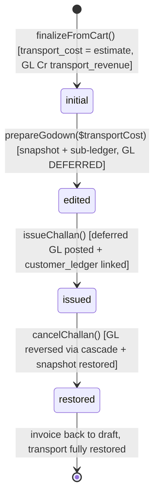

# Transport Cost

> **Module:** Sales (Phase 10)
> **Audience:** Engineers + AI assistants + **accountants** (must review before Canonical)
> **Status:** Draft — pending accountant sign-off
> **Last reviewed:** 2025-08-03
> **Source of truth:** this file + the transport-related code in
> `laravel/app/Services/Sales/SalesInvoiceService.php` (postInvoiceGL) +
> `laravel/app/Services/Sales/SalesChallanService.php` (prepareGodown + issueChallan +
> postTransportAdjustmentGL + cancelChallan) + `laravel/database/sql/04_sales.sql:26-156`.

## 1. What is it?

**Transport cost** is a **header-level field** on `sales_invoices.transport_cost` (initial
estimate at finalize) AND `sales_challans.transport_cost` (actual at delivery) +
`transport_adjustment` (delta) + `adjustment_journal_entry_id` (GL JE for the delta).

It is **REVENUE** (Cr `transport_revenue` ledger) charged to the customer — NOT a separate
expense ledger. The company charges the customer for delivery; the actual transport vendor
payment is recorded separately (free-text `transport_name` + `transport_phone` fields, no
`transport_vendors` master table — gap G18).

The transport cost follows a **Phase-6 godown-edit workflow**:

1. **At `finalizeFromCart`:** `transport_cost` is the initial estimate (from cart data). GL Cr
   `transport_revenue` posted in `postInvoiceGL` (alongside Dr AR / Cr Sales Revenue).
2. **At `prepareGodown($transportCost)`:** optional Phase-6 transport edit — if the new transport
   differs from the current `transport_cost` by > 0.01:
   - Snapshot the ORIGINAL values into `pre_challan_transport` + `pre_challan_total` (ONLY on
     the FIRST edit — preserved across re-edits).
   - UPDATE `sales_invoices` SET `transport_cost = newTransport`, `total_amount = sub_total -
     discount + newTransport`.
   - INSERT a `customer_ledger` 'invoice_adjustment' row for the delta (debit if transport rose,
     credit if fell) with `journal_entry_id = NULL` (GL DEFERRED to `issueChallan`).
3. **At `issueChallan`:** if `pre_challan_transport IS NOT NULL` (godown edited):
   - `transportAdjustment = transport_cost - pre_challan_transport`.
   - If `|transportAdjustment| > 0.01`: `postTransportAdjustmentGL` posts the deferred GL JE
     (Dr/Cr AR + transport_revenue, swapped by sign) + links the godown-time `customer_ledger`
     rows to it (so `cancelChallan`'s cascade reverses both).
4. **At `cancelChallan`:** if `adjustment_journal_entry_id` is set,
   `JournalReversalService::reverseByJournalEntry` cascades the GL + customer_ledger reversal.
   If `pre_challan_transport` is not null, restore the invoice's `transport_cost` +
   `total_amount` from the snapshot.

There is **NO `TransportCostService`, `TransportCostController`, `TransportCostPolicy`, or
`TransportCost` model**. Transport logic is distributed across `SalesInvoiceService` and
`SalesChallanService`. There is **NO `transport_cost_items` table** (transport is header-level,
not per-line). There is **NO `config/transport.php`**.

## 2. Why does it exist?

- **Sales often include a delivery charge** (transport cost) — this is revenue to the seller,
  not an expense.
- **The transport estimate at finalize time may differ from the actual transport at delivery
  time** (godown prep re-evaluates the route, vehicle, vendor). The Phase-6 workflow allows
  editing at godown prep.
- **Snapshot + deferred GL pattern** ensures:
  - The GL reflects the TOTAL change (not just the last edit) — the snapshot is taken only on
    the first edit.
  - The cancel path restores the original invoice totals.
  - The `customer_ledger` 'invoice_adjustment' rows are linked to the GL JE so the cascade
    reversal covers both.
- **Free-text transport vendor fields** mirror the legacy schema (no `transport_vendors` master).

## 3. When is it used?

- **At `finalizeFromCart`:** `transport_cost` is the initial estimate. GL Cr `transport_revenue`
  posted in `postInvoiceGL` (L1035-1046).
- **At `prepareGodown($transportCost)`:** optional Phase-6 transport edit (L228-286).
- **At `issueChallan`:** deferred transport-adjustment GL posting + customer_ledger linking
  (L441-494).
- **At `cancelChallan`:** transport adjustment GL reversal via cascade + snapshot restore
  (L627-654).

## 4. Who uses it?

- **`salesman` / `manager` / `admin`** — enters `transport_cost` at finalize.
- **`warehouse_manager` / `manager` / `admin`** — edits transport at godown prep.
- **`accountant`** — reviews `transport_revenue` GL + `transport_adjustment` entries.
- NO dedicated transport manager role (transport is a column, not a separate module).

## 5. Related modules

- `sales-overview.md` — module map.
- `sales-invoice.md` — the invoice that carries `transport_cost` (initial estimate).
- `sales-challan.md` — the challan that carries `transport_cost` (actual) + `transport_adjustment`
  (delta) + `adjustment_journal_entry_id` (GL JE).
- `../accounting/chart-of-accounts.md` — `transport_revenue` nature (L91 in
  `LedgerNatureService::EXTENDED_NATURES`; Income, credit normal balance).
- `../accounting/journal-posting-rules.md` §7.6.1 — Dr/Cr matrix for `postInvoiceGL` (Cr
  transport_revenue line) + `postTransportAdjustmentGL`.
- `../accounting/reversal-vs-cancellation.md` — `JournalReversalService::reverseByJournalEntry`
  cascade at `cancelChallan`.
- `../accounting/subledger-reconciliation.md` — `customer_ledger` 'invoice_adjustment' rows.

## 6. Business rules

- **MUST** post Cr `transport_revenue` (NOT `transport_cost` — that's a column name, not a
  ledger nature) at invoice finalize if transport > 0.01.
- **MUST** fall back to `sales_revenue` ledger if `transport_revenue` not configured (L817-818).
- **MUST** snapshot `pre_challan_transport` + `pre_challan_total` ONLY on the FIRST godown edit
  (preserve across re-edits).
- **MUST** defer the transport adjustment GL to `issueChallan` (NOT post at godown).
- **MUST** link the `customer_ledger` 'invoice_adjustment' rows to the GL JE at `issueChallan`
  (so `cancelChallan`'s cascade reverses both).
- **MUST** reverse the transport adjustment GL via `JournalReversalService::reverseByJournalEntry`
  at `cancelChallan` (cascade covers GL + customer_ledger).
- **MUST** restore the invoice's `transport_cost` + `total_amount` from the snapshot at
  `cancelChallan`.
- **MUST NOT** post GL at godown prep time (deferred pattern).
- **MUST NOT** re-snapshot on subsequent godown edits (only first edit snapshots).
- **MUST NOT** create a separate `transport_cost` ledger nature — it's `transport_REVENUE`
  (income, credit normal balance).

## 7. Data model

### Transport-related columns

| Table | Column | Type | Purpose |
|---|---|---|---|
| `sales_invoices` | `transport_cost` | numeric(12,2) DEFAULT 0 | Initial estimate at finalize |
| `sales_invoices` | `pre_challan_transport` | numeric(12,2), nullable | Snapshot of original transport before godown edit |
| `sales_invoices` | `pre_challan_total` | numeric(14,2), nullable | Snapshot of original total before godown edit |
| `sales_challans` | `transport_cost` | numeric(12,2) DEFAULT 0 | Actual at delivery |
| `sales_challans` | `transport_adjustment` | numeric(12,2) DEFAULT 0 | Delta from `pre_challan_transport` |
| `sales_challans` | `adjustment_journal_entry_id` | integer FK to journal_entries | GL JE for the adjustment |
| `sales_challans` | `transport_name` | varchar(100) | Free text — no `transport_vendors` table (G18) |
| `sales_challans` | `transport_phone` | varchar(30) | Free text |
| `sales_challans` | `vehicle_number` | varchar(50) | Free text |
| `sales_challans` | `driver_name` | varchar(100) | Free text |

**Note:** NO `transport_vendors` master table. NO `transport_cost_items` table (transport is
header-level, not per-line). NO `config/transport.php`.

## 8. Lifecycle / workflow

### State machine



### Dr/Cr matrix (verbatim from `postTransportAdjustmentGL` L801-854)

```php
// Positive adjustment: Dr AR / Cr Transport Revenue
// Negative adjustment: Dr Transport Revenue / Cr AR (swapped)
$isIncrease = $adjustment > 0;

$lines = [
    [
        'ledger_id' => $arLedgerId,            // nature: ar
        'debit' => $isIncrease ? $amount : 0,
        'credit' => $isIncrease ? 0 : $amount,
        'entity_type' => 'customer', 'entity_id' => $customerId,
        'memo' => 'Challan ' . $challanCode . ' — transport adjustment AR',
    ],
    [
        'ledger_id' => $transportLedgerId,     // nature: transport_revenue (fallback sales_revenue)
        'debit' => $isIncrease ? 0 : $amount,
        'credit' => $isIncrease ? $amount : 0,
        'entity_type' => 'sales_invoice', 'entity_id' => $invoiceId,
        'memo' => 'Challan ' . $challanCode . ' — transport adjustment revenue',
    ],
];

return $this->journalPosting->createJournalEntry([
    'entry_date' => $challanDate,
    'reference_type' => 'sales_invoice',       // NOTE: sales_invoice, NOT sales_challan
    'reference_id' => $invoiceId,
    'branch_id' => $branchId,
    'description' => 'Transport adjustment — Challan ' . $challanCode,
    'source' => 'sales_challan',
    'created_by' => $createdBy,
], $lines);
```

## 9. Integration points

| Integration | Direction | Purpose |
|---|---|---|
| `SalesInvoiceService::postInvoiceGL` L1035-1046 | outbound | Cr `transport_revenue` line at finalize |
| `SalesChallanService::prepareGodown` L228-286 | outbound | Phase-6 transport edit (snapshot + sub-ledger) |
| `SalesChallanService::issueChallan` L441-494 | outbound | Deferred GL posting + customer_ledger linking |
| `SalesChallanService::postTransportAdjustmentGL` L801-854 | outbound | Dr/Cr AR + transport_revenue (swapped by sign) |
| `SalesChallanService::cancelChallan` L627-654 | outbound | JournalReversalService cascade + snapshot restore |
| `SubLedgerService::postCustomerLedgerEntry` | outbound | customer_ledger 'invoice_adjustment' rows (journal_entry_id=NULL at godown, linked at issue) |
| `JournalReversalService::reverseByJournalEntry` | outbound | Cascade reversal at cancelChallan |
| `LedgerNatureService::EXTENDED_NATURES['transport_revenue']` L91 | outbound | Income, credit normal balance |

## 10. Edge cases

- **Godown edit with NULL `$transportCost` (Mobile API caller):** skips the transport-edit block
  (backward compat — the mobile API may not send `transport_cost` in the godown payload).
- **Transport adjustment = 0 (no change):** no GL posted, no snapshot, no
  `adjustment_journal_entry_id`.
- **Pre-Phase-6 invoices (`pre_challan_transport = NULL`):** no transport adjustment GL at
  `issueChallan`, no restore at `cancelChallan` (backward compat).
- **Multiple godown re-edits:** snapshot taken ONLY on first edit; subsequent edits update
  `transport_cost` + `total_amount` but don't re-snapshot. The `issueChallan` GL reflects the
  TOTAL change from pre-godown state.
- **Transport decreased (negative adjustment):** Dr `transport_revenue` / Cr `ar` (swapped).
- **`transport_revenue` ledger not configured:** falls back to `sales_revenue` (L817-818) —
  masks the revenue split in reports.
- **Invoice cancelled (not via challan cancel):** the original Cr `transport_revenue` from
  finalize is reversed via `JournalReversalService` (covers the `sales_invoice` JE). The
  transport adjustment GL (if any) is reversed separately at `cancelChallan`.
- **Transport vendor free-text (G18):** `transport_name` / `transport_phone` /
  `vehicle_number` / `driver_name` are free-text fields. A typo in the transport vendor name
  fragments reporting (e.g. "ABC Transport" vs "ABC Trans").

## 11. Gaps

1. **G4 (CRITICAL — RESOLVED)** — `fn_financial_audit_trigger` is now attached to
   `sales_invoices` and `sales_challans` (the two tables that carry transport-cost
   columns) via migration `2026_09_01_000002` (SALES-3, commit de2b6e6). Transport-cost
   mutations are now hash-chain-audited.
2. **G18 (MINOR)** — No `transport_vendors` master table — free-text `transport_name` fragments
   reporting.
3. **NO `transport_cost_items` table** — transport is header-level only, cannot capture per-line
   transport allocation. If per-line transport is needed (e.g. multi-warehouse invoice with
   different transport per line), this is a limitation.
4. **NO transport vendor payment flow** — the actual cash paid to the transport vendor is NOT
   tracked in this module. It would be an `other_expense` entry with `transport_name` in the
   description, but no formal linkage to the challan.
5. **`postTransportAdjustmentGL` uses `reference_type='sales_invoice'`** (NOT `sales_challan`)
   — the adjustment GL is linked to the invoice, not the challan. This is intentional (the
   adjustment is about the invoice's transport, not the challan's), but it means the challan's
   `journal_entry_id` (COGS) and `adjustment_journal_entry_id` (transport) reference different
   entity types. Confirm this is correct.
6. **`transport_revenue` fallback to `sales_revenue`** — if the `transport_revenue` ledger is
   not configured, the transport revenue is posted to `sales_revenue` instead. This masks the
   revenue split in reports (transport revenue appears as sales revenue). Consider making
   `transport_revenue` a required ledger (throw if not configured).
7. **NO `config/transport.php`** — no knobs for transport cost validation (max, min), no
   toggle for the deferred-GL pattern, no toggle for the fallback behavior.
8. **`AuditableMasterData` bypass** — transport cost mutations use `DB::table('sales_invoices')->update()`
   and `DB::table('sales_challans')->insertGetId()` — the trait never fires. Only
   `SalesAuditLogger` (via `godownPrepared` / `challanIssued` / `challanReversed`) captures the
   mutation.

## 12. Accountant review checklist

> **This is a SAFETY-CRITICAL document.** Before marking it Canonical, an accountant with
> production credentials MUST review and sign off on each item below.

- [ ] The Dr/Cr matrix (Cr `transport_revenue` at finalize; Dr/Cr AR + transport_revenue
      swapped by sign at adjustment) matches the actual treatment.
- [ ] The `transport_revenue` ledger nature (Income, credit normal balance) is correct.
- [ ] The fallback to `sales_revenue` if `transport_revenue` not configured — confirm whether
      this should be a hard error instead.
- [ ] The snapshot semantics (first edit only, preserved across re-edits) is correct.
- [ ] The deferred GL pattern (godown sub-ledger only, `issueChallan` posts GL + links) is
      correct.
- [ ] The cascade reversal at `cancelChallan` (GL + customer_ledger) is correct.
- [ ] The snapshot restore at `cancelChallan` (transport_cost + total_amount reset from
      snapshot) is correct.
- [ ] The `reference_type='sales_invoice'` on the adjustment GL (NOT `sales_challan`) — confirm
      this is the desired linkage.
- [ ] The transport vendor free-text fields (G18) — confirm whether a `transport_vendors`
      master table should be created for reporting accuracy.
- [ ] The lack of a transport vendor payment flow — confirm whether this should be a separate
      module or tracked via `other_expense`.

## 13. Cross-references

- `sales-overview.md` — module map.
- `sales-invoice.md` — the invoice that carries `transport_cost` (initial estimate).
- `sales-challan.md` — the challan that carries `transport_cost` (actual) +
  `transport_adjustment` (delta).
- `../accounting/chart-of-accounts.md` — `transport_revenue` nature.
- `../accounting/journal-posting-rules.md` §7.6.1 — `postInvoiceGL` + `postTransportAdjustmentGL`.
- `../accounting/reversal-vs-cancellation.md` — `JournalReversalService` cascade.
- `../accounting/subledger-reconciliation.md` — `customer_ledger` 'invoice_adjustment' rows.
