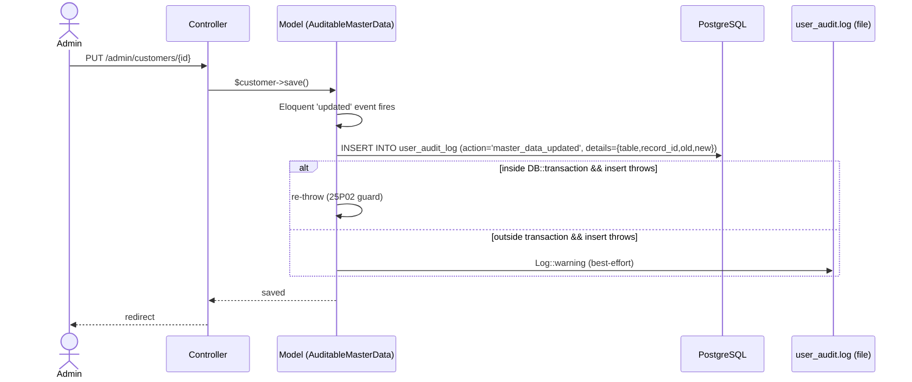
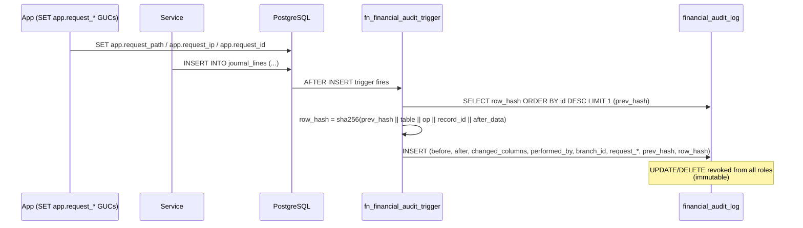

# Audit Trails

> **Module:** Security / Audit
> **Audience:** Engineers + AI assistants + accountants + security reviewers
> **Status:** Draft
> **Last reviewed:** 2026-09-06 (LOW-H / G-314: added `period_close_override` to §7.2 tracked-actions list)
> **Source of truth:** this file + `laravel/app/Traits/AuditableMasterData.php` + `laravel/app/Services/Auth/UserAuditLogger.php` + `laravel/database/sql/02_accounting.sql` (financial_audit_log)

## 1. What is it?

RC_ERP_v2 has **two distinct audit systems**, deliberately kept separate:

1. **User audit log** (`user_audit_log` table) — a general-purpose, append-only log of
   user/security/master-data events: login, logout, password change, role change, account
   lockout, system-policy activation, branch override, and master-data CRUD. Written by the
   `UserAuditLogger` service and the `AuditableMasterData` trait.
2. **Financial audit log** (`financial_audit_log` table) — an **immutable, cryptographically
   chained** log of every INSERT/UPDATE/DELETE on 10 financial tables, with `before_data` /
   `after_data` JSONB snapshots and a SHA-256 hash chain. Enforced by a PostgreSQL trigger;
   `UPDATE` and `DELETE` are revoked from all roles.

Several modules also keep their own per-module audit tables (stock adjustment, stock take,
warehouse transfer, sales, branch demand, purchase) for lifecycle transitions.

## 2. Why does it exist?

- **Compliance & forensic need:** the business must be able to answer "who changed this customer's
  credit limit, when, and from what to what?" The user audit log answers that for master data.
- **Accounting integrity:** the financial audit log proves that no one silently mutated a journal
  entry after the fact. The hash chain makes tampering detectable.
- **Defense-in-depth:** audit trails complement RBAC — even an admin who is allowed to delete a
  record leaves an indelible trace.
- **Segregation from financial data:** user activity (logins, role changes) is operational; financial
  mutations are accounting. Different retention (36 months vs 84 months), different access, different
  storage shape — hence two tables.

## 3. When is it used?

- **On every login/logout/password/role/lockout event** — `UserAuditLogger::log(...)`.
- **On every create/update/delete/restore of a master-data model** — `AuditableMasterData` trait
  hooks Eloquent events (31 models).
- **On every financial mutation** — the `fn_financial_audit_trigger()` fires AFTER INSERT/UPDATE/DELETE
  on 10 financial tables.
- **On every cross-branch override** — `EnforceBranchIsolation::logBranchOverrideIfCrossBranch()`.
- **On system-policy activate/deactivate** — `SystemPolicyService::writeAuditLog()`.
- **On admin period-close override** — `JournalPostingService::validatePeriod` writes a
  `period_close_override` row when an admin forces a journal entry through to a closed accounting
  period (see §7.2).
- **On module-specific lifecycle transitions** — per-module audit loggers (stock, sales, purchase,
  branch demand).

## 4. Who uses it?

- **Admins** view the user audit log via `GlobalAuditController` (`/admin/audit`, `role:admin`).
- **Accountants / auditors** consume the financial audit log via the chain-verification view and
  ad-hoc SQL.
- **Superadmin** reviews system-policy and branch-override entries.
- **System/automated:** triggers and traits write rows; no human action needed.

## 5. Related modules

- `auth-and-sessions.md` — login/logout audit.
- `credential-versioning.md` — `password_change`, `role_change` audit.
- `rbac-roles-permissions.md` — `role_change`, menu-permission changes.
- `branch-context-security.md` — `branch_override` audit.
- `system-policy-compliance.md` — `system_policy_activate/deactivate` audit.
- `../accounting/financial-audit-log.md` (Phase 6, pending) — deep dive on the financial audit log.
- `../database/triggers-views-constraints.md` — the trigger catalog.

## 6. Business rules

- **MUST** never `UPDATE` or `DELETE` rows from `user_audit_log` or `financial_audit_log`. Both
  are append-only.
- **MUST** revoke `UPDATE, DELETE` on `financial_audit_log` from all roles (DDL does this).
- **MUST** capture the actor (`user_id` / `performed_by`), the action, the timestamp, and the
  branch context on every audit row.
- **MUST** re-throw audit-write errors when inside a DB transaction (a swallowed SQL error leaves
  PostgreSQL in an aborted state — error `25P02`). The `AuditableMasterData` trait does this.
- **MUST** sanitize `user_agent` (strip CR/LF/TAB, truncate to 255 chars) before writing — CRLF
  injection prevention.
- **MUST** dual-write user audit to PostgreSQL **and** a JSON-lines file (`storage/logs/user_audit.log`)
  so a DB outage doesn't lose the audit trail.
- **MUST** make audit logging best-effort (never throw to the user) **except** inside a
  transaction (see above).
- **MUST NOT** rely on audit reads being branch-isolated — `user_audit_log` and
  `financial_audit_log` are NOT RLS-protected. Access is gated at the application layer (admin-only
  routes). See §12.
- **SHOULD** keep user-audit retention at 36 months and financial-audit retention at 84 months
  (7-year compliance).

## 7. Technical implementation

### 7.1 `AuditableMasterData` trait — `laravel/app/Traits/AuditableMasterData.php`

Hooks Eloquent events: `created`, `updated` (only when `wasChanged()`), `deleted` (soft-delete),
`restored` (only if the model uses `SoftDeletes`).

Writes a row to `user_audit_log`:

```php
DB::table('user_audit_log')->insert([
    'user_id'         => Auth::id(),
    'action'          => 'master_data_' . $action,  // master_data_created|updated|deleted|restored
    'target_user_id'  => null,
    'branch_id'       => session('branch_id'),
    'record_id'       => $recordId,
    'details'         => json_encode([
        'table'     => $tableName,
        'record_id' => $recordId,
        'old'       => $old,    // null for created; only changed keys for updated
        'new'       => $new,    // full attributes for created/restored; changed keys for updated
    ]),
    'ip_address'  => request()?->ip(),
    'user_agent'  => request()?->userAgent() ? mb_substr(preg_replace('/[\r\n\t]/', ' ', $ua), 0, 255) : null,
    'created_at'  => now(),
]);
```

**Critical transaction-aware error handling:**

```php
} catch (\Throwable $e) {
    // CRITICAL: Re-throw if inside a DB::transaction(), because a swallowed SQL error
    // leaves PostgreSQL in an aborted state (25P02).
    if (DB::transactionLevel() > 0) {
        throw $e;
    }
    Log::warning('AuditableMasterData: failed to log audit', [...]);
}
```

Per-instance audit history:

```php
public function auditHistory(int $limit = 100): \Illuminate\Support\Collection {
    return DB::table('user_audit_log')
        ->whereRaw("details::jsonb->>'table' = ?", [$this->getTable()])
        ->whereRaw("details::jsonb->>'record_id' = ?", [(string) $this->getKey()])
        ->orderBy('created_at', 'desc')->limit($limit)->get();
}
```

**31 models use the trait:** `Bank, Branch, BranchDemand, CommissionEntry, CommissionRule,
Customer, CustomerPayment, DamageInvoice, Employee, EmployeeTransaction, Ledger, MoneyTransfer,
OtherExpense, OtherIncome, Product, ProductCategory, ProductGroup, PurchaseOrder, PurchaseReceive,
PurchaseReturn, SalesChallan, SalesInvoice, SalesReturn, StockAdjustment, StockAdjustmentAuditLog,
StockTakeAuditLog, StockTakeSession, Supplier, SupplierPayment, User, Warehouse, WarehouseTransfer`.

> **Caveat:** `StockAdjustment` and `StockTakeSession` `use` the trait but their actual audit
> writes happen in dedicated services (`StockAdjustmentAuditService`, `StockTakeAuditLogger`).
> The trait is "dead" on those models — kept for the `auditHistory()` helper. (See model
> docblocks.)

### 7.2 `UserAuditLogger` service — `laravel/app/Services/Auth/UserAuditLogger.php`

**Dual-write** (PG + file):

1. `DB::table('user_audit_log')->insert([...])`.
2. `file_put_contents(storage_path('logs/user_audit.log'), $logEntry . "\n", FILE_APPEND | LOCK_EX)`
   — JSON-lines file.

Logged fields: `user_id, action, target_user_id, branch_id, details (json_encode), ip_address,
user_agent, created_at`. `user_agent` is sanitized (CRLF stripped, 255-char truncation).

**Tracked actions:** `login_success, login_failed, logout, password_change, role_change,
user_created, user_updated, user_deleted, account_locked`, plus `password_reset,
system_policy_activate, system_policy_deactivate, branch_override, period_close_override,
master_data_*`.

> **`period_close_override`** (LOW-H / G-314, G15) — **Severity: HIGH (write-block bypass).**
> Admin bypassed the period-close check (an admin forced a journal entry through to a closed
> accounting period). Triggered by `JournalPostingService::validatePeriod` (L438-470) when
> `config('accounting.period_close_admin_override')` is true AND the authenticated user passes
> `$user->isAdmin()`. The audit row is written **directly** via
> `DB::table('user_audit_log')->insert(...)` inside `validatePeriod` itself — it is NOT routed
> through `UserAuditLogger::log()`, so the dual-write (PG + file) defense-in-depth is bypassed
> for this action (same pattern flagged in G16 for `SystemPolicyService::writeAuditLog`).
>
> **Audit-row payload** (the row lives in `user_audit_log`):
> - `user_id` — the admin user's `users.id`.
> - `action` — `'period_close_override'`.
> - `target_user_id` — `null` (this is a self-action, not a target-user action).
> - `branch_id` — the branch whose period was overridden (top-level column).
> - `details` (JSONB) — `{
>     posting_date: <Y-m-d>,
>     closed_through: <accounting_periods.closed_through_date>,
>     branch_id: <int>,
>     reason: 'Admin override: posting to closed period'
> }`.
> - `ip_address` — `request()->ip()`.
> - `user_agent` — `request()->userAgent()` truncated to 255 chars.
> - `created_at` — `now()`.
>
> **What triggers it:** `createJournalEntry()` (L100-102) calls `validatePeriod($entry['entry_date'],
> $entry['branch_id'])` for every journal entry that has a `branch_id` and does NOT set the
> `skip_period_check` flag. If the posting date is `<= accounting_periods.closed_through_date` for
> that branch AND the admin-override config is enabled AND the current user is an admin, the
> override audit row is written and the posting proceeds. Reversals bypass the period check
> entirely via the `'skip_period_check'` flag (so a reversal against a closed-period posting can
> still proceed without firing this audit action).

Static signature:

```php
public static function log(?int $userId, string $action, ?int $targetUserId = null, array $details = []): void
```

Failures degrade to `Log::error` (do NOT throw) — best-effort.

### 7.3 `user_audit_log` table — `laravel/database/sql/06_payment_and_misc.sql`

```sql
CREATE TABLE user_audit_log (
    id integer GENERATED BY DEFAULT AS IDENTITY,
    user_id integer,
    action varchar(50) NOT NULL,
    target_user_id integer,
    branch_id integer,
    record_id integer,            -- added later by migration 2026_08_01_000003
    details jsonb,
    ip_address varchar(45),
    user_agent text,
    created_at timestamp(0) DEFAULT CURRENT_TIMESTAMP,
    PRIMARY KEY (id, created_at)
) PARTITION BY RANGE (created_at);
```

- Partitioned by RANGE on `created_at` (monthly partitions + default). See
  `../database/partitioning.md`.
- Indexes: `idx_ual_user (user_id)`, `idx_ual_action (action)`, `idx_ual_created_at_brin` (BRIN,
  64 pages/range).
- Retention: 36 months.

### 7.4 The financial audit log — `laravel/database/sql/02_accounting.sql`

Append-only, immutable, cryptographically chained.

```sql
CREATE TABLE financial_audit_log (
    id              BIGINT GENERATED BY DEFAULT AS IDENTITY PRIMARY KEY,
    table_name      VARCHAR(64) NOT NULL,
    operation       VARCHAR(6)  NOT NULL CHECK (operation IN ('INSERT','UPDATE','DELETE')),
    record_id       BIGINT NOT NULL,
    before_data     JSONB,
    after_data      JSONB,
    changed_columns TEXT[],
    performed_by    VARCHAR(100),
    db_session_user VARCHAR(100),
    branch_id       INTEGER,
    transaction_id  XID,
    request_path    VARCHAR(500),
    request_ip      VARCHAR(45),
    request_id      VARCHAR(100),
    prev_hash       VARCHAR(64),
    row_hash        VARCHAR(64),
    created_at      TIMESTAMP(0) NOT NULL DEFAULT CURRENT_TIMESTAMP,
    PRIMARY KEY (id, created_at)
) PARTITION BY RANGE (created_at);
```

**Immutability:** `REVOKE UPDATE, DELETE ON financial_audit_log FROM PUBLIC` (and from `postgres`
+ `remote_center` if those roles exist).

**Trigger function `fn_financial_audit_trigger()`** (PL/pgSQL, `SECURITY DEFINER`):
- Captures `before_data` / `after_data` as `to_jsonb(OLD)` / `to_jsonb(NEW)`.
- For UPDATE, computes `changed_columns` by diffing JSONB keys.
- Reads `branch_id` from the row's JSONB.
- Reads `request_path`, `request_ip`, `request_id` from GUCs
  (`current_setting('app.request_path', true)`, etc.) — these are set per-request by
  `SetAppBranchId` middleware (see `branch-context-security.md`).
- Reads the previous row's `row_hash` (`SELECT row_hash ... ORDER BY id DESC LIMIT 1`).
- Computes `row_hash = sha256(prev_hash || TG_TABLE_NAME || TG_OP || record_id ||
  COALESCE(after, before))`.
- Inserts the audit record.

**Triggers attached to 10 financial tables:** `journal_entries`, `journal_lines`,
`manual_journals`, `manual_journal_lines`, `customer_payments`, `supplier_payments`,
`money_transfers`, `other_incomes`, `other_expenses`, `employee_transactions`.

**Hash chain verification view:**

```sql
CREATE OR REPLACE VIEW v_financial_audit_chain_verification AS
SELECT id, table_name, operation, record_id, prev_hash, row_hash,
    CASE WHEN id = 1 THEN prev_hash = '0000...0000'
         ELSE prev_hash = LAG(row_hash) OVER (ORDER BY id) END AS chain_valid,
    created_at
FROM financial_audit_log ORDER BY id;
```

Indexes: `idx_fal_table_record`, `idx_fal_operation`, `idx_fal_performed_by`, `idx_fal_branch`,
`idx_fal_created_at_brin` (BRIN), `idx_fal_table_op`.

Retention: 84 months (7-year compliance).

### 7.5 Per-module audit services

Several modules keep their own audit tables for lifecycle transitions (NOT `user_audit_log`):

| Service | Table | Purpose |
|---|---|---|
| `app/Services/Stock/StockAdjustmentAuditService.php` + `StockAdjustmentAuditLogger.php` | `stock_adjustment_audit_log` | create/submit/approve/reject/confirm/cancel transitions |
| `app/Services/Stock/StockTakeAuditLogger.php` | `stock_take_audit_log` | stock-take session lifecycle |
| `app/Services/Stock/WarehouseTransferAuditService.php` | warehouse transfer transitions | |
| `app/Services/Sales/SalesAuditLogger.php` | sales audit | invoice/challan/return transitions |
| `app/Services/BranchDemand/BranchDemandAuditService.php` | `branch_demand_audit_log` | branch demand lifecycle |
| `app/Services/Purchase/PurchaseAuditService.php` | purchase audit | PO/GRN/Return audit |

### 7.6 `GlobalAuditController` — `laravel/app/Http/Controllers/Admin/GlobalAuditController.php`

Cross-module viewer over `user_audit_log`. Admin-only (`role:admin`).

Routes (`routes/web.php`):

```php
Route::prefix('admin/audit')->name('admin.audit.')->middleware('role:admin')->group(function () {
    Route::get('/',        [GlobalAuditController::class, 'index'])->name('index');
    Route::get('/export',  [GlobalAuditController::class, 'export'])->name('export');
    Route::get('/{id}',    [GlobalAuditController::class, 'show'])->name('show')->where(['id' => '[0-9]+']);
});
```

Filters: table, action, user_id, from/to date range, record_id, free-text search (ILIKE on
`details::text`).

Default scope: `$query->where('ual.action', 'like', 'master_data_%');` — focuses on master-data
changes; login/logout/password events stay in the table but surface via the SystemHealth
dashboard.

Audited tables list:

```php
private const AUDITED_TABLES = [
    'branches', 'warehouses', 'products', 'product_categories', 'product_groups',
    'customers', 'suppliers', 'employees', 'banks', 'ledgers', 'users',
];
private const AUDIT_ACTIONS = [
    'master_data_created', 'master_data_updated', 'master_data_deleted', 'master_data_restored',
];
```

CSV export: RFC 4180 + UTF-8 BOM, streamed in 500-row chunks.

## 8. Important database tables

| Table | Purpose | Key columns | Retention |
|---|---|---|---|
| `user_audit_log` | General user/security/master-data events | `user_id, action, target_user_id, branch_id, record_id, details jsonb, ip_address, user_agent` | 36 months |
| `financial_audit_log` | Immutable chained financial mutations | `table_name, operation, record_id, before_data, after_data, changed_columns, performed_by, branch_id, prev_hash, row_hash` | 84 months |
| `password_reset_tokens` | (mentioned for context) | — | — |
| `remember_tokens` | (mentioned for context) | — | — |

See `../database/er-diagrams.md` and `../database/triggers-views-constraints.md`.

## 9. Related services

- `laravel/app/Services/Auth/UserAuditLogger.php` — dual-write (PG + file).
- `laravel/app/Traits/AuditableMasterData.php` — master-data CRUD trait.
- Per-module audit services listed in §7.5.
- `laravel/app/Services/Compliance/SystemPolicyService.php` — writes `system_policy_*` actions.

## 10. Related models

- `laravel/app/Models/UserAuditLog.php` (if present; otherwise read via `DB::table`).
- The 31 models using `AuditableMasterData` (listed in §7.1).
- `laravel/app/Models/SystemPolicy.php` — writes audit on activate/deactivate.

## 11. Important workflows

### 11.1 Master-data update → audit



### 11.2 Financial mutation → trigger → chained audit



## 12. Known edge cases

- **Audit reads are NOT branch-isolated.** Neither `user_audit_log` nor `financial_audit_log` is
  RLS-protected. Access is gated at the application layer (`GlobalAuditController` is
  `role:admin`). An admin sees all branches' audit entries by design (audit is a cross-branch
  concern).
- **`record_id` was added late** to `user_audit_log` (migration `2026_08_01_000003`) to fix a
  `25P02` transaction-aborted bug in `MoneyTransferService::logAudit`. Older rows have NULL
  `record_id`.
- **`StockAdjustment` / `StockTakeSession` trait is "dead"** — the trait is `use`d but the
  services write their own audit rows. Don't assume the trait fires on these models.
- **`AuditableMasterData` re-throws inside transactions** — this is correct PostgreSQL behavior
  (a failed statement aborts the whole transaction), but it means a misbehaving audit insert can
  roll back the business operation. Keep the audit insert simple and reliable.
- **Hash chain `prev_hash` lookup is `ORDER BY id DESC LIMIT 1`** — under high concurrency two
  triggers could read the same `prev_hash`, producing a fork. The `v_financial_audit_chain_verification`
  view will flag both rows as `chain_valid = false`. This is a known limitation of trigger-based
  chaining (vs. a serializable transaction). Acceptable for the ERP's write volume.
- **`user_audit.log` file grows unbounded** — no rotation beyond Laravel's default `single` /
  `daily` log config. Monitor disk.
- **`GlobalAuditController` default scope hides non-master-data actions** — login/logout/password
  events are in the table but not shown in the default admin view (they surface via SystemHealth).
  An admin filtering by `action = login_failed` will still see them.
- **Financial audit `performed_by` is a varchar** — it stores the username, not the `users.id`.
  This is intentional (survives user deletion) but means joins to `users` are by username.

## 13. Future improvements

- **RLS on audit tables?** Probably not — audit is cross-branch by nature. Instead, consider
  column-level masking for non-admin readers if granular access is ever needed.
- **Serialize the financial audit hash-chain insert** (advisory lock per table) to eliminate the
  fork risk under concurrency.
- **Rotate / archive `user_audit.log`** beyond Laravel's default.
- **Unify the per-module audit loggers** behind a common interface (`AuditLoggerInterface`) so
  future modules don't reinvent the wheel.
- **Expose the financial chain-verification view** in the admin UI (today it's SQL-only).
- **Add an audit-read API** for external compliance tooling (Phase 17 API layer).
- **Document the `record_id` migration** in the changelog as a root-cause fix (already done in the
  product changelog).
