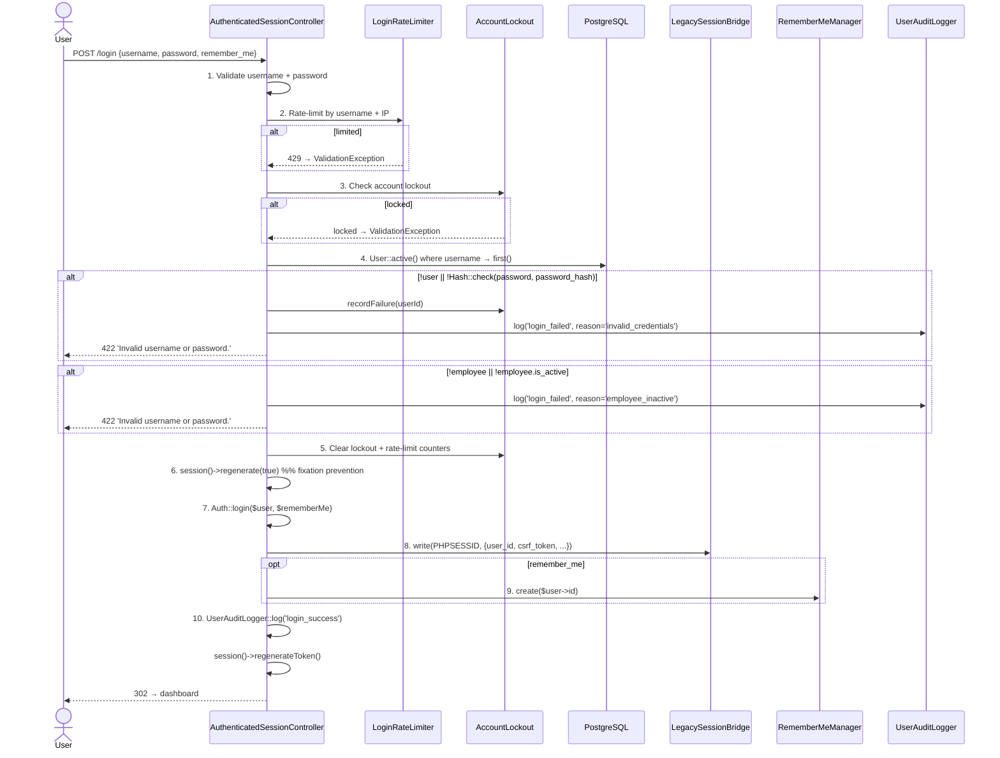

# Authentication & Sessions

> **Module:** Security / Auth
> **Audience:** Engineers + AI assistants + security reviewers
> **Status:** Draft
> **Last reviewed:** 2025-08-03
> **Source of truth:** this file + `laravel/app/Http/Controllers/Auth/AuthenticatedSessionController.php` + `laravel/config/auth.php` + `laravel/config/session.php`

## 1. What is it?

Authentication in RC_ERP_v2 is **session-based for the web UI** and **bearer-token-based for the
REST API** (a custom mechanism, not Laravel Sanctum — see `api-security.md`). A distinctive
feature of this ERP is the **shared-session bridge** with the legacy PHP application: a single
`PHPSESSID` cookie + a single Redis session store is shared between Laravel and legacy PHP, so a
user who logs in on either side is automatically authenticated on the other. Passwords are hashed
with bcrypt (cost 12). Sessions live in Redis and expire after 8 hours.

## 2. Why does it exist?

- The ERP was migrated from a custom PHP/MySQL codebase to Laravel 12 + PostgreSQL 16 (see
  `../PROJECT_OVERVIEW.md`). During the transition period both apps ran side-by-side and shared
  the same users, so a shared session was required to avoid double logins.
- bcrypt at cost 12 is the modern default; the legacy app stored MD5 hashes which were all
  re-hashed during migration.
- The session is intentionally **not encrypted** (`SESSION_ENCRYPT=false`) because it contains no
  secrets beyond the `credential_version` integer and the user's display metadata; the credential
  version is validated server-side on every request (see `credential-versioning.md`).

## 3. When is it used?

- **Login:** every time a user submits the login form at `/login`.
- **Every web request:** `SyncLegacySession` (first in the stack) restores Laravel auth from the
  legacy session if Laravel auth is not yet set; `CheckCredentialVersion` (global) invalidates the
  session if the credential version drifted.
- **Logout:** explicit `/logout` POST, or implicitly when the credential version is bumped
  (password change, role change, admin force-logout).
- **API requests:** bearer token in the `Authorization` header, validated per-request by `ApiAuth`
  middleware — no session involved.

## 4. Who uses it?

- All 10 roles (superadmin, admin, manager, accountant, salesman, warehouse_manager, dispatcher,
  hr, user, other) authenticate the same way. See `rbac-roles-permissions.md`.
- The shared-session bridge is transparent to end users — they see one login screen.

## 5. Related modules

- `credential-versioning.md` — the per-user counter that invalidates sessions.
- `password-policy.md` — the rules a new password must satisfy.
- `rbac-roles-permissions.md` — what an authenticated user is allowed to do.
- `branch-context-security.md` — how the branch GUC is set right after auth.
- `api-security.md` — the API bearer-token mechanism.
- `audit-trails.md` — login/logout/password audit rows.

## 6. Business rules

- **MUST** use bcrypt at cost 12 (`config/hashing.php`). No plaintext, no MD5, no SHA-* password
  storage.
- **MUST** regenerate the session ID on successful login (`session()->regenerate(true)`) to
  prevent session fixation.
- **MUST** rotate the CSRF token on login and logout (`session()->regenerateToken()`).
- **MUST** write the legacy session on Laravel login so the bridge stays in sync.
- **MUST** use the same cookie name (`PHPSESSID`) for both apps — the bridge depends on it.
- **MUST NOT** store the password (even hashed) in the session. Only `credential_version` is
  stored.
- **MUST** invalidate all other sessions when the credential version is bumped (see
  `credential-versioning.md`).
- **SHOULD** fail closed on employee-inactive: a user whose `employee.is_active = false` cannot
  log in even with correct credentials.
- 2FA / TOTP is **deliberately removed** (Phase 0 pre-migration cleanup). Do not re-add it without
  a product decision — see `../PROJECT_OVERVIEW.md` "Removed features".

## 7. Technical implementation

### 7.1 The login flow

Owned by `laravel/app/Http/Controllers/Auth/AuthenticatedSessionController.php`. Constructor
injects 5 collaborators: `LoginRateLimiter`, `AccountLockout`, `RememberMeManager`,
`LegacySessionBridge`, `NotificationService`.

The canonical 10-step sequence (from the controller docblock):



### 7.2 Session configuration — `laravel/config/session.php`

| Key | Default | Notes |
|---|---|---|
| `driver` | `redis` | Sessions live in Redis (not DB, not file). |
| `lifetime` | `480` (8 hours) | `SESSION_LIFETIME` env override. |
| `encrypt` | `false` | Sessions are NOT encrypted — see §2. |
| `connection` | `legacy` | The `legacy` Redis connection (DB 1, shared with PHP). |
| `cookie` | `PHPSESSID` | **Same name as legacy PHP** — required by the bridge. |
| `secure` | `false` | Assumes TLS terminates at the reverse proxy. |
| `same_site` | `lax` | |
| `legacy.redis_db` | `1` | The Redis DB where PHP native sessions live. |
| `legacy.redis_prefix` | `PHPREDIS_SESSION:` | phpredis key prefix. |

### 7.3 Auth configuration — `laravel/config/auth.php`

```php
'defaults' => ['guard' => 'web', 'passwords' => 'users'],
'guards' => [
    'web'     => ['driver' => 'session', 'provider' => 'users'],
    'sanctum' => ['driver' => 'sanctum', 'provider' => null], // declared but UNUSED
],
'providers' => ['users' => ['driver' => 'eloquent', 'model' => App\Models\User::class]],
'passwords' => ['users' => ['provider' => 'users', 'table' => 'password_reset_tokens',
                            'expire' => 60, 'throttle' => 60]],
'password_timeout' => 10800, // 3h "confirm password" window
'max_failed_attempts' => env('AUTH_MAX_FAILED_ATTEMPTS', 5),
'lockout_minutes'    => env('AUTH_LOCKOUT_MINUTES', 15),
'reset_token_hours'  => env('AUTH_RESET_TOKEN_HOURS', 1),
'remember_days'      => env('AUTH_REMEMBER_DAYS', 30),
```

> **Important:** the `sanctum` guard is declared but **never used**. The API authenticates via
> `ApiAuth` middleware which calls `Auth::login($user)` on the default `web` guard so that RBAC
> role checks work identically for web and API. See `api-security.md`.

### 7.4 The shared-session bridge

Two pieces collaborate:

1. **`SyncLegacySession` middleware** (`laravel/app/Http/Middleware/SyncLegacySession.php`) —
   prepended **first** in the global stack (`bootstrap/app.php`). Alias: `legacy.session`. It:
   - Skips API (`api/*`) and console requests.
   - If `Auth::check()` is already true → no-op.
   - Reads the legacy session from Redis via the bridge.
   - If the legacy session has a `user_id` and Laravel auth is not set → loads the User, checks
     `credential_version` with `hash_equals()` (constant-time), and on success calls
     `Auth::login($user)` and populates the Laravel session from the legacy data.
   - If the credential version mismatches → destroys the legacy session + revokes all remember-me
     tokens for that user (password was changed).
   - Else tries remember-me restore.

2. **`LegacySessionBridge`** (`laravel/app/Session/LegacySessionBridge.php`) — singleton bound in
   `AppServiceProvider::register()`. Reads/writes the exact same Redis keys that PHP's native
   `session.save_handler = redis` writes (`PHPREDIS_SESSION:<id>`), using `session_decode()` /
   `session_encode()` to convert between the PHP-serialized `$_SESSION` format and a PHP array.
   All failures degrade to `Log::warning` (never throw — the bridge is best-effort).

### 7.5 The User model — `laravel/app/Models/User.php`

Traits: `Notifiable, HasFactory, SoftDeletes, AuditableMasterData`. **Does NOT use `HasApiTokens`**
(Sanctum's trait) — API tokens are handled by the custom methods below.

Key overrides:

```php
public function getAuthPassword(): string    { return $this->password_hash; } // legacy column name
public function getAuthPasswordName(): string { return 'password_hash'; }
public function getRememberTokenName(): string { return 'remember_token'; }   // Laravel native fallback
```

Role helpers (role lives on `Employee`, not `User`):

```php
public function getRole(): string   { return $this->employee?->role ?? 'user'; }
public function getBranchId(): ?int { return $this->employee?->branch_id; }
public function isSuperadmin(): bool { return $this->getRole() === 'superadmin'; }
public function isAdmin(): bool      { return in_array($this->getRole(), ['admin','superadmin'], true); }
public function hasRole(string ...$roles): bool
public function isLocked(): bool     { return $this->locked_until !== null && $this->locked_until->isFuture(); }
```

Custom API-token methods (NOT Sanctum):

```php
public function generateApiToken(): string { /* Str::random(60); store sha256; return plain once */ }
public static function findByApiToken(string $plainToken): ?self { /* sha256 lookup, active, not deleted */ }
```

### 7.6 Logout flow — `AuthenticatedSessionController::destroy()`

1. Capture `branchId` + `username` **before** logout (needed for the `user_logout` notification).
2. `$this->rememberMe->revokeCurrent();`
3. `$this->bridge->destroy($sessionId);` — destroys the legacy session too.
4. `Auth::logout();`
5. `$request->session()->invalidate(); $request->session()->regenerateToken();`
6. `UserAuditLogger::log($userId, 'logout');`
7. Best-effort `user_logout` notification dispatch (never blocks redirect).

## 8. Important database tables

| Table | Purpose | Key columns |
|---|---|---|
| `users` | Login accounts (1:1 with `employees`) | `id, employee_id, username, password_hash, is_active, last_login, last_login_ip, failed_login_count, locked_until, credential_version, api_token, remember_token` |
| `password_reset_tokens` | Forgot-password broker tokens (SHA-256 hashed) | `user_id, token_hash, expires_at` |
| `remember_tokens` | Remember-me selector:validator pairs | `user_id, selector, token_hash, expires_at` |

> The `sessions` table is **not** used — sessions are in Redis. Schema lives in
> `laravel/database/sql/01_auth_and_master.sql`. See `../database/schema-overview.md` and
> `../database/er-diagrams.md`.

## 9. Related services

- `laravel/app/Services/Auth/LoginRateLimiter.php` — Redis-backed, 5/15min, keyed by username+IP.
  Also reused for forgot-password. See `password-policy.md`.
- `laravel/app/Services/Auth/AccountLockout.php` — failed-attempt counter + 15-min lockout.
- `laravel/app/Services/Auth/RememberMeManager.php` — selector:validator scheme, 30-day cookies,
  rotation on restore. See `password-policy.md`.
- `laravel/app/Services/Auth/UserAuditLogger.php` — dual-write (PG + file) audit logger. See
  `audit-trails.md`.
- `laravel/app/Session/LegacySessionBridge.php` — the shared-session bridge.
- `laravel/app/Services/Auth/CredentialVersion.php` — see `credential-versioning.md`.

## 10. Related models

- `laravel/app/Models/User.php`
- `laravel/app/Models/Employee.php` (1:1 with User; carries `role` + `branch_id`)

## 11. Important workflows

See the sequence diagram in §7.1. End-to-end:

1. Guest visits `/login`.
2. `AuthenticatedSessionController::create()` renders `auth.login` (bails to dashboard if already
   authed).
3. User submits credentials → `store()` runs the 10-step sequence.
4. On success: session regenerated, legacy session written, remember-me cookie set (if requested),
   audit logged, redirect to `intended('dashboard')`.
5. On every subsequent web request: `SyncLegacySession` → `SetAppBranchId` →
   `CheckCredentialVersion` → `CheckSystemPolicy` → route middleware.
6. Logout: `destroy()` reverses all of the above.

## 12. Known edge cases

- **Employee-inactive login:** a user with correct credentials but `employee.is_active = false` is
  rejected with the same generic "Invalid username or password." message (no user enumeration).
  The audit log records `login_failed` with reason `employee_inactive`.
- **Bcrypt rehash on login:** if `Hash::needsRehash($user->password_hash)` returns true (e.g. cost
  factor was raised), the password is re-hashed at login time and `CredentialVersion::bump()` is
  called — which immediately invalidates all the user's *other* sessions. This is intentional.
- **`last_login` update failure is non-blocking:** wrapped in try/catch; if it throws, the login
  still succeeds (`Log::warning`).
- **Notification dispatch is best-effort:** `NotificationService::dispatch('user_login', ...)` is
  fire-and-forget; a notification failure never blocks login.
- **`POST /reset` requires `password === confirm_password`** (custom match, not Laravel's
  `confirmed` rule). See `password-policy.md`.
- **API requests skip `SyncLegacySession`** (it checks `api/*` path). API auth is bearer-token via
  `ApiAuth` — see `api-security.md`.
- **Console commands have no session:** `SyncLegacySession`, `SetAppBranchId`, and
  `CheckCredentialVersion` do not run under CLI. Artisan commands that touch RLS-protected tables
  must `DB::unprepared("SET app.branch_id = ...")` manually. See `branch-context-security.md`.

## 13. Future improvements

- **Encryption at rest for sessions:** consider `SESSION_ENCRYPT=true` if sensitive data ever lands
  in the session payload.
- **Secure cookie:** set `SESSION_SECURE_COOKIE=true` once the VPS serves HTTPS end-to-end (Phase
  19 deployment).
- **Adopt Sanctum properly** (or remove the dead `sanctum` guard declaration) — currently the
  guard is declared in `config/auth.php` but unused, and `config/sanctum.php` does not exist.
- **Add a profile/password-change page** so users can change their own password through the
  `PasswordPolicy` service (today only the forgot-password flow + admin reset enforce the full
  policy). See `password-policy.md` §13.
- **Revisit the shared-session bridge** once the legacy PHP app is fully decommissioned — the
  bridge adds complexity (Redis key-format coupling, `session_decode` in-process).
