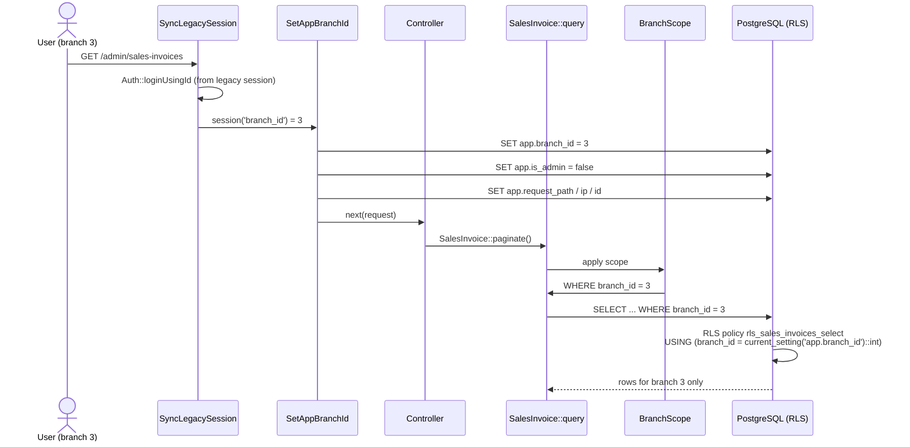
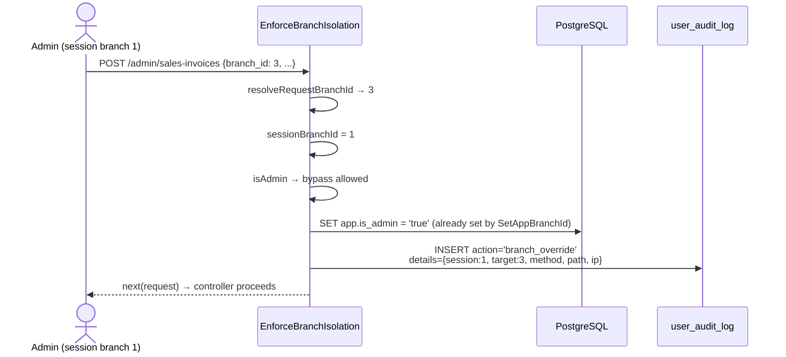

# Branch Context Security

> **Module:** Security / Multi-tenancy
> **Audience:** Engineers + AI assistants + security reviewers + DBAs
> **Status:** Draft
> **Last reviewed:** 2025-08-03
> **Source of truth:** this file + `laravel/app/Http/Middleware/SetAppBranchId.php` + `laravel/app/Http/Middleware/SetApiBranchContext.php` + `laravel/app/Http/Middleware/EnforceBranchIsolation.php` + `laravel/app/Models/Scopes/BranchScope.php` + `laravel/database/sql/07_views_triggers_constraints.sql`

## 1. What is it?

Branch context security is the **3-layer defense-in-depth** that enforces multi-branch isolation
in RC_ERP_v2. Every transactional row carries a `branch_id`; the system guarantees a non-admin
user can only see and mutate rows belonging to their own branch. The three layers are:

1. **Eloquent global scope** (`BranchScope`) — adds `WHERE branch_id = ?` to every query on
   branch-scoped models.
2. **Route middleware** (`EnforceBranchIsolation`) — blocks writes where the request's `branch_id`
   doesn't match the session's, and audit-logs admin cross-branch overrides.
3. **PostgreSQL Row-Level Security** (RLS) — the DB itself enforces `branch_id =
   current_setting('app.branch_id')` even if the app is bypassed.

The bridge between the app and the DB is a pair of **per-request GUC setters** (`SetAppBranchId`
for web, `SetApiBranchContext` for API) that run `SET app.branch_id = ...` and `SET app.is_admin
= ...` on the PostgreSQL connection.

> **Note:** this file focuses on the security mechanics. The conceptual 3-layer model and the
> RLS policy structure are also summarized in `../architecture/branch-isolation-rls.md`. This file
> is the security-authoritative deep dive (middleware internals, GUC injection-safety, the
> `FORCE ROW LEVEL SECURITY` correction, cross-branch exceptions).

## 2. Why does it exist?

- The ERP is multi-branch: a salesman in Branch A must never see Branch B's invoices, customers,
  or stock. A single leak across branches is a serious business breach.
- Defense-in-depth: a bug in the Eloquent scope (e.g. `withoutGlobalScope` called by mistake) must
  not expose cross-branch data — the DB RLS catches it.
- Admins (admin + superadmin) need to operate cross-branch (e.g. a manager overseeing two
  branches), but every cross-branch write must be audit-logged (`branch_override` action).

## 3. When is it used?

- **Every authenticated web request** — `SetAppBranchId` runs globally (after `SyncLegacySession`
  populates `session('branch_id')`).
- **Every authenticated API request** — `SetApiBranchContext` runs as route middleware (after
  `api.auth`).
- **Every write to a transactional route** — `EnforceBranchIsolation` runs as route middleware on
  POST/PUT/DELETE.
- **Every Eloquent query** on a branch-scoped model — `BranchScope` adds the WHERE clause.
- **Console commands** — neither `SetAppBranchId` nor `SetApiBranchContext` runs; CLI code must
  `SET app.branch_id` manually.

## 4. Who uses it?

- **All non-admin users** — enforced transparently; they cannot bypass it.
- **Admin / superadmin** — bypass the scope + RLS via the `app.is_admin = 'true'` GUC, but their
  cross-branch writes are audit-logged.
- **DBAs / direct psql sessions** — subject to RLS (deny-by-default if the GUC is unset).

## 5. Related modules

- `auth-and-sessions.md` — `SyncLegacySession` populates `session('branch_id')` before
  `SetAppBranchId` runs.
- `rbac-roles-permissions.md` — `isAdmin()` / `isSuperadmin()` drive the bypass.
- `audit-trails.md` — the `branch_override` audit action.
- `api-security.md` — the API auth + branch-context chain.
- `../architecture/branch-isolation-rls.md` — the conceptual overview (Phase 1).

## 6. Business rules

- **MUST** set the `app.branch_id` and `app.is_admin` GUCs on every authenticated connection
  (web via `SetAppBranchId`, API via `SetApiBranchContext`).
- **MUST** use `DB::unprepared()` with safely-cast values for the GUC SET (PostgreSQL `SET` does
  NOT accept PDO bound parameters — see §7.1).
- **MUST** use **both** `ENABLE ROW LEVEL SECURITY` **and** `FORCE ROW LEVEL SECURITY` on every
  RLS-protected table so the table owner is also subject to RLS.
- **MUST** set safe DB-default GUCs (`app.branch_id = 0`, `app.is_admin = false`) so direct psql
  sessions see NO branch data (deny-by-default).
- **MUST** audit-log every admin cross-branch write as `branch_override` (action written to
  `user_audit_log`).
- **MUST** block non-admin cross-branch writes with 403 (JSON for AJAX, redirect for web).
- **MUST NOT** rely solely on the Eloquent scope — always assume the scope could be bypassed;
  RLS is the last line of defense.
- **MUST NOT** use `?` / `$1` placeholders in `SET app.branch_id = ?` — PDO will reject it.
- **MUST** set the GUC manually in console commands that touch RLS-protected tables.
- **SHOULD** use `current_setting('app.is_admin', true)` (the `true` = missing-ok) so policies
  degrade to deny when the GUC is unset.

## 7. Technical implementation

### 7.1 `SetAppBranchId` middleware — `laravel/app/Http/Middleware/SetAppBranchId.php`

Appended globally in `bootstrap/app.php`. Runs AFTER `SyncLegacySession`.

```php
if (Auth::check()) {
    $user = Auth::user();
    $branchId = (int) (session('branch_id') ?? $user->getBranchId() ?? 0);
    $isAdmin = $user->isAdmin() ? 'true' : 'false';

    try {
        $safeBranchId = (int) ($branchId > 0 ? $branchId : 0);
        $safeIsAdmin  = $isAdmin === 'true' ? 'true' : 'false';
        DB::unprepared("SET app.branch_id = {$safeBranchId}");
        DB::unprepared("SET app.is_admin = {$safeIsAdmin}");

        // Phase 1.3: Set request context for financial audit trail triggers.
        $safePath = addcslashes($request->path() ?? '', "'\\");
        $safeIp   = addcslashes($request->ip() ?? '', "'\\");
        $safeRid  = addcslashes($request->header('X-Request-ID') ?? ($request->input('request_id') ?? uniqid('req_', true)), "'\\");
        DB::unprepared("SET app.request_path = '{$safePath}'");
        DB::unprepared("SET app.request_ip = '{$safeIp}'");
        DB::unprepared("SET app.request_id = '{$safeRid}'");
    } catch (\Throwable $e) {
        Log::debug('SET app.branch_id failed (migration may not be run yet): ' . $e->getMessage());
    }
}
```

**Why `DB::unprepared()` and not `DB::statement('SET app.branch_id = ?', [$branchId])`:**
PostgreSQL `SET` does not accept PDO bound parameters. `PDO::prepare()` would fail with
`syntax error at or near "$1"`. The values are already safely cast (`(int)` for branch_id; the
string is constrained to `'true'|'false'`), so inlining is SQL-injection-safe. The string GUCs
(`request_path`, `request_ip`, `request_id`) are escaped with `addcslashes(..., "'\\")`.

**`SET` (not `SET LOCAL`)** — scopes the GUC to the session (connection), persists for all queries
in this request, resets when the connection is recycled back to the pool.

**Console commands:** this middleware does NOT run. CLI code must
`DB::unprepared("SET app.branch_id = " . (int)$branchId)` manually.

**Skips silently** if `Auth::check()` is false (e.g. API requests where auth hasn't run yet —
`SetApiBranchContext` handles those).

### 7.2 `SetApiBranchContext` middleware — `laravel/app/Http/Middleware/SetApiBranchContext.php`

Alias: `set.api.branch`. Route-level middleware, applied to API route groups AFTER `api.auth`.

**Why it exists:** the global `SetAppBranchId` runs BEFORE route middleware like `api.auth`. For
API requests (Bearer token auth), `Auth::check()` is false at global-middleware time, so
`SetAppBranchId` skips and the GUCs stay at the DB default (`app.branch_id=0`,
`app.is_admin=false`). RLS then blocks ALL rows for non-admin API users. This middleware runs
AFTER `api.auth`, so `Auth::user()` is available.

**Logic:** same `SET app.branch_id` + `SET app.is_admin` calls as `SetAppBranchId`, derived from
`$user->getBranchId()` and `$user->isAdmin()`. Does NOT set the `app.request_*` GUCs (those are
only set for web).

**Failure mode:** if the GUCs don't exist (migration not run), silently skip + log debug. RLS
policies use `current_setting(..., true)` which returns NULL when the GUC is absent, so policies
degrade to deny-by-default (safe).

**Usage in `routes/api.php`:** applied to `stock-take`, `warehouse-transfers`,
`stock-adjustments`, `branch-demands` API route groups (the ones that query RLS-protected
transactional tables). See `api-security.md`.

### 7.3 `EnforceBranchIsolation` middleware — `laravel/app/Http/Middleware/EnforceBranchIsolation.php`

Alias: `branch.isolation`. Route-level middleware on POST writes.

**Enforcement rules:**
- Non-admin users: request `branch_id` MUST equal session `branch_id`. Mismatch → 403 (JSON for
  AJAX, redirect for web).
- Admin/superadmin: bypass allowed, but cross-branch overrides are logged to `user_audit_log`
  with action `'branch_override'`.

**Resolution of the request's `branch_id`** (four sources, checked in order):
1. `request->input('branch_id')` — form fields / JSON body.
2. `request->route('invoiceId')` — URL param; resolves via
   `DB::table('sales_invoices')->where('id', $invoiceId)->value('branch_id')`.
3. `request->route('id')` — generic resource ID; resolves via `inferTableFromUri()` (table
   inferred from the request path).
4. `request->route('session')` — Stock Take custom verb; resolves via `inferTableFromUri()`.

**`inferTableFromUri(string $path): ?string`** — maps URI substrings to tables:

| URI contains | Table |
|---|---|
| `sales-invoices` | `sales_invoices` |
| `sales-challans` | `sales_challans` |
| `sales-returns` | `sales_returns` |
| `customer-payments` | `customer_payments` |
| `supplier-transactions` / `supplier-payments` | `supplier_payments` |
| `employee-transactions` | `employee_transactions` |
| `manual-journals` | `manual_journals` |
| `purchase-orders` | `purchase_orders` |
| `purchase-receives` | `purchase_receives` |
| `purchase-returns` | `purchase_returns` |
| `stock-take` | `stock_take_sessions` |
| `stock-adjustments` | `stock_adjustments` |
| `damages` | `damage_invoices` |
| `other-incomes` | `other_incomes` |
| `other-expenses` | `other_expenses` |
| `branch-demands` | `null` (cross-branch — skip) |
| `money-transfers` | `null` (cross-branch — skip) |

**Cross-branch override audit:**

```php
private function logBranchOverrideIfCrossBranch(Request $request, $user, int $sessionBranchId): void {
    $requestBranchId = $this->resolveRequestBranchId($request);
    $urlParamBranchId = $this->resolveUrlParamBranchId($request);
    $targetBranchId = $requestBranchId ?? $urlParamBranchId;
    if ($targetBranchId !== null && $targetBranchId !== $sessionBranchId) {
        DB::table('user_audit_log')->insert([
            'user_id'        => $user->id,
            'action'         => 'branch_override',
            'target_user_id' => null,
            'branch_id'      => $targetBranchId,
            'details'        => json_encode([
                'session_branch_id' => $sessionBranchId,
                'target_branch_id'  => $targetBranchId,
                'method'            => $request->method(),
                'path'              => $request->path(),
                'ip'                => $request->ip(),
            ]),
            'ip_address' => $request->ip(),
            'user_agent' => $request->userAgent() ? mb_substr($request->userAgent(), 0, 255) : null,
            'created_at' => now(),
        ]);
    }
}
```

**Denial response:** 403 JSON `['message' => $message]` for `expectsJson()`, else redirect to
dashboard with error flash.

### 7.4 `BranchScope` global scope — `laravel/app/Models/Scopes/BranchScope.php`

```php
class BranchScope implements Scope {
    public function apply(Builder $builder, Model $model): void {
        if (!Auth::check()) return;             // no-op for console/unauthenticated
        if (Auth::user()->isAdmin()) return;     // admin sees all branches
        $branchId = (int)(session('branch_id') ?? Auth::user()->getBranchId() ?? 0);
        if ($branchId > 0) {
            $builder->where($model->getTable() . '.branch_id', '=', $branchId);
        }
    }
}
```

Applied via `static::addGlobalScope(new BranchScope)` in model `booted()` — confirmed on
`SalesInvoice`, `SalesChallan`, `SalesReturn`, `CustomerPayment`.

**Variants:**
- `laravel/app/Models/Scopes/MoneyTransferBranchScope.php` — filters by `from_branch_id` OR
  `to_branch_id`.
- `laravel/app/Models/Scopes/WarehouseTransferBranchScope.php` — same pattern.

**Bypass:** `Model::withoutGlobalScope(BranchScope::class)->get();` — admin-only contexts.

### 7.5 RLS policies — `laravel/database/sql/07_views_triggers_constraints.sql`

**35 tables** with the standard 5-policy pattern (SELECT / INSERT / UPDATE / DELETE / admin
bypass):

```sql
ALTER TABLE <table> ENABLE ROW LEVEL SECURITY;
ALTER TABLE <table> FORCE ROW LEVEL SECURITY;
CREATE POLICY rls_<table>_select ON <table> FOR SELECT
    USING (current_setting('app.is_admin', true) = 'true'
           OR branch_id = current_setting('app.branch_id')::int);
CREATE POLICY rls_<table>_insert ON <table> FOR INSERT
    WITH CHECK (current_setting('app.is_admin', true) = 'true'
                OR branch_id = current_setting('app.branch_id')::int);
CREATE POLICY rls_<table>_update ON <table> FOR UPDATE
    USING (...) WITH CHECK (...);
CREATE POLICY rls_<table>_delete ON <table> FOR DELETE USING (...);
CREATE POLICY rls_<table>_admin ON <table> FOR ALL
    USING (current_setting('app.is_admin', true) = 'true')
    WITH CHECK (current_setting('app.is_admin', true) = 'true');
```

**The 35 RLS-enabled tables:** `accounting_periods, branch_cash, branch_demands, branch_expenses,
branch_ledger, branch_product_cost, cash_ledger, customer_ledger, customer_payments, customers,
damage_invoices, document_sequences, employee_ledger, employee_transactions, employees,
journal_entries, manual_journals, money_transfers, other_expenses, other_incomes, purchase_orders,
purchase_receives, purchase_returns, sales_challans, sales_draft_carts, sales_invoices,
sales_returns, stock_adjustments, stock_take_items, stock_take_sessions, stock_take_warehouses,
supplier_ledger, supplier_payments, suppliers, warehouse_transfers, warehouses`.

> **Correction to `../architecture/branch-isolation-rls.md`:** that Phase 1 doc states "The DDL
> uses `ENABLE ROW LEVEL SECURITY` (not `FORCE). In production, the app DB role is NOT the table
> owner, so RLS applies." **The actual DDL uses BOTH `ENABLE` AND `FORCE ROW LEVEL SECURITY`** on
> every RLS-protected table — so the table owner is also subject to RLS. This is the more
> conservative choice and is correct. The Phase 1 doc should be updated.

**Special case — `document_sequences`:** uses `branch_id = 0` (global rows); policies match on
`branch_id = 0`, not the session branch. Document sequences are global-per-type.

**Safe defaults (RLS GUCs deny-by-default):**

```sql
ALTER DATABASE <dbname> SET app.branch_id = 0;
ALTER DATABASE <dbname> SET app.is_admin = false;
```

Direct psql sessions without `SET app.branch_id` see NO branch data (deny by default).
`current_setting('app.is_admin', true)` returns NULL if unset → `= 'true'` is FALSE → non-admin →
enforced.

### 7.6 Superadmin bypass

Two-layer bypass:
1. **App layer:** `BranchScope::apply()` returns early if `Auth::user()->isAdmin()`.
   `EnforceBranchIsolation` calls `logBranchOverrideIfCrossBranch()` then returns `$next($request)`
   for admins.
2. **DB layer (RLS):** `app.is_admin = 'true'` GUC (set by `SetAppBranchId` /
   `SetApiBranchContext` for admin/superadmin users). The `rls_<table>_admin` policy allows all
   access. No `SET ROLE`, no flag — purely a GUC comparison.

### 7.7 Cross-branch operations (warehouse transfers, branch demands, money transfers)

These modules are cross-branch by design (`from_branch_id` + `to_branch_id`):
- `EnforceBranchIsolation::inferTableFromUri()` returns `null` for `branch-demands` and
  `money-transfers` (explicit skips).
- `MoneyTransferBranchScope` and `WarehouseTransferBranchScope` filter reads by `from_branch_id OR
  to_branch_id`.
- Authorization is done in the controller + service based on the user's role in the transaction
  (requester vs supplier branch).

## 8. Important database tables

The 35 RLS-protected tables are listed in §7.5. Each carries a `branch_id integer` column (except
`document_sequences` which uses `branch_id = 0` for global rows). See
`../database/schema-overview.md` and `../database/er-diagrams.md`.

## 9. Related services

- (No dedicated service — the middleware + scope + RLS collaborate.)
- `laravel/app/Services/MenuService.php` — unrelated (menu visibility, not branch).

## 10. Related models

- All 35 RLS-protected models (see §7.5).
- `laravel/app/Models/Scopes/BranchScope.php`, `MoneyTransferBranchScope.php`,
  `WarehouseTransferBranchScope.php`.

## 11. Important workflows

### 11.1 Web request → GUC set → RLS-enforced query



### 11.2 Admin cross-branch write → audit



## 12. Known edge cases

- **Console commands have no GUC.** `php artisan tinker` or any artisan command that queries
  RLS-protected tables will see NO rows (the DB default `app.branch_id = 0` matches nothing) unless
  the command explicitly `SET app.branch_id`. Document this in any new command.
- **`SET` is not `SET LOCAL`.** `SET` persists for the connection's lifetime. If the connection is
  recycled back to the pool mid-request (unusual), the GUC leaks to the next request. Laravel's
  default connection pooling reuses connections, but `SetAppBranchId` re-sets the GUC on every
  request, so this is safe in practice.
- **`FORCE ROW LEVEL SECURITY` correction.** The Phase 1 doc (`branch-isolation-rls.md`) said the
  DDL uses `ENABLE` not `FORCE`. The actual DDL uses BOTH. This file is authoritative.
- **`document_sequences` uses `branch_id = 0`.** It is RLS-enabled but the policy matches on
  `branch_id = 0` (global rows), not the session branch. A non-admin user can read document
  sequences because the policy's `OR branch_id = 0` clause matches. This is intentional (sequence
  numbers are global-per-type).
- **`current_setting('app.is_admin', true)` returns NULL** when the GUC is unset → `= 'true'` is
  FALSE → non-admin → enforced. Safe default.
- **API requests need `set.api.branch` middleware** in addition to `api.auth`. Forgetting it
  leaves the GUC at the DB default and RLS blocks everything for non-admin API users. The route
  group definitions in `routes/api.php` must include it for any RLS-protected table.
- **`MoneyTransferBranchScope` / `WarehouseTransferBranchScope`** filter by `from_branch_id OR
  to_branch_id` — but the underlying RLS policy on `money_transfers` / `warehouse_transfers` uses
  the standard single-`branch_id` pattern. These tables have BOTH `from_branch_id` and
  `to_branch_id` columns; the RLS policy matches on whichever column the policy was written
  against (check the specific policy in `07_views_triggers_constraints.sql`). This is a known
  tension — the scope is more permissive than a naive single-column RLS policy would be.
- **`addcslashes` is not the same as `pg_escape_literal`.** It escapes `'` and `\` for the
  request-path/IP/request-id GUCs, which is sufficient for these low-cardinality strings, but is
  not a general-purpose SQL-string escaper. Don't reuse this pattern for arbitrary user input.

## 13. Future improvements

- **Update `../architecture/branch-isolation-rls.md`** to reflect the `FORCE ROW LEVEL SECURITY`
  correction.
- **Add a console-command helper** (e.g. a `SetsBranchContext` trait or a base command class) that
  auto-`SET`s the GUC so artisan commands don't silently see no rows.
- **Reconcile `MoneyTransferBranchScope` / `WarehouseTransferBranchScope` with their RLS
  policies** — ensure the scope and the policy agree on which column(s) define branch ownership.
- **Consider `SET LOCAL`** scoped to a transaction for write operations, so the GUC can't leak
  past a `DB::transaction()` boundary.
- **Add a test harness** that asserts RLS blocks cross-branch reads at the DB level (independent
  of the Eloquent scope) — defense-in-depth verification.
- **Document the `branch_override` audit in the admin UI** so compliance reviewers can filter and
  review cross-branch writes.
