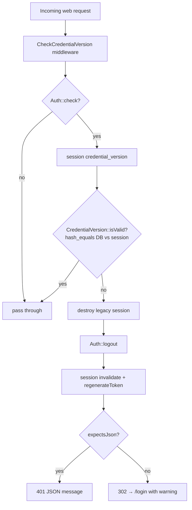

# Credential Versioning

> **Module:** Security / Sessions
> **Audience:** Engineers + AI assistants + security reviewers
> **Status:** Draft
> **Last reviewed:** 2025-08-03
> **Source of truth:** this file + `laravel/app/Services/Auth/CredentialVersion.php` + `laravel/app/Http/Middleware/CheckCredentialVersion.php`

## 1. What is it?

A **monotonic integer counter** on the `users` table (`credential_version`, default `1`) that is
bumped whenever a user's password or role/branch changes. Every active session stores the version
value at login time; a global middleware compares the session's stored version against the DB
value on every web request and **invalidates the session** if they differ. Comparison uses
`hash_equals()` for constant-time equality.

## 2. Why does it exist?

- To **invalidate all of a user's other sessions** when their password is changed (by reset, by
  admin, or by bcrypt rehash) or when their role/branch changes — without maintaining a session
  registry.
- It is the cheap alternative to a server-side session blocklist: instead of tracking every
  session ID per user, we track one integer. Any session whose stored integer is stale is killed
  on the next request.
- It works across the **shared-session bridge**: the legacy PHP session also carries
  `credential_version`, so a password change in Laravel invalidates the legacy session too (and
  vice-versa).

## 3. When is it used?

- **Bumped** on: bcrypt rehash at login, forgot-password reset, admin "Reset Password", admin user
  update with new password, employee role/branch change, new user creation (set to `1`), legacy
  employee migration (copied from legacy).
- **Checked** on every web request by the global `CheckCredentialVersion` middleware (after auth
  runs).
- **Checked** on legacy-session restore by `SyncLegacySession::loginFromLegacy()` (before
  `Auth::login()`).

## 4. Who uses it?

- **System/automated:** the middleware runs for every authenticated web request.
- **Admins:** trigger bumps via `UserController::resetPassword()`, `UserController::update()`,
  `EmployeeController::update()`.
- **Users (self):** trigger a bump by completing the forgot-password flow.
- **The login flow itself:** triggers a bump if `Hash::needsRehash()` returns true.

## 5. Related modules

- `auth-and-sessions.md` — sessions store `credential_version`; `SyncLegacySession` validates it.
- `password-policy.md` — password reset bumps the version.
- `rbac-roles-permissions.md` — role/branch change bumps the version.
- `audit-trails.md` — `password_change`, `role_change` audit actions.

## 6. Business rules

- **MUST** bump `credential_version` on every credential-affecting change: password change, role
  change, branch change, admin force-logout.
- **MUST** compare using `hash_equals()` (constant-time) — never `==` or `===` on the raw value.
- **MUST** invalidate **both** the Laravel session and the legacy session on mismatch (destroy the
  legacy Redis key, `Auth::logout()`, `session()->invalidate()`, `regenerateToken()`).
- **MUST** revoke all remember-me tokens for the user on a version mismatch detected during
  legacy-session restore (`RememberMeManager::revokeAllForUser($userId)`).
- **MUST NOT** apply this check to API bearer-token requests — the API uses stateless bearer
  tokens; `ApiAuth` does not consult `credential_version`. Revoking an API token is done by
  regenerating `users.api_token` (see `api-security.md`).
- **SHOULD** bump via `CredentialVersion::bump()` (atomic `DB::raw('credential_version + 1')`)
  rather than reading-then-writing the column, to avoid lost updates under concurrency.

## 7. Technical implementation

### 7.1 The column

```sql
-- laravel/database/sql/01_auth_and_master.sql line 67
credential_version integer NOT NULL DEFAULT 1,
```

Cast on `User`: `'credential_version' => 'integer'`. In `$fillable`.

### 7.2 `CredentialVersion` service — `laravel/app/Services/Auth/CredentialVersion.php`

Static methods, no constructor.

```php
public static function fetch(int $userId): ?string
{
    $version = DB::table('users')->where('id', $userId)->value('credential_version');
    return $version !== null ? (string) $version : null;
}

public static function bump(int $userId): void
{
    DB::table('users')->where('id', $userId)->update([
        'credential_version' => DB::raw('credential_version + 1'),
        'updated_at' => now(),
    ]);
}

public static function isValid(int $userId, string $sessionVersion): bool
{
    $currentVersion = self::fetch($userId);
    if ($currentVersion === null) return false;
    if ($sessionVersion === '') return false;
    return hash_equals($currentVersion, $sessionVersion);  // constant-time
}
```

### 7.3 `CheckCredentialVersion` middleware — `laravel/app/Http/Middleware/CheckCredentialVersion.php`

Appended globally in `bootstrap/app.php` (after `SetAppBranchId`, before `CheckSystemPolicy`).

```php
public function handle(Request $request, Closure $next): Response
{
    if (!Auth::check()) {
        return $next($request);
    }
    $userId = (int) Auth::id();
    $sessionVersion = (string) session('credential_version', '');

    if (!CredentialVersion::isValid($userId, $sessionVersion)) {
        $sessionId = LegacySessionBridge::getSessionIdFromRequest($request);
        $this->bridge->destroy($sessionId);
        Auth::logout();
        $request->session()->invalidate();
        $request->session()->regenerateToken();

        if ($request->expectsJson()) {
            return response()->json([
                'message' => 'Your session ended because your account credentials were changed. Please sign in again.',
            ], 401);
        }
        return redirect()->route('login')
            ->with('warning', 'Your session ended because your account credentials were changed. Please sign in again.');
    }
    return $next($request);
}
```

**Behavior on mismatch:** destroy legacy session → `Auth::logout()` → invalidate Laravel session
→ regenerate CSRF token → **401 JSON** for `expectsJson()` or **302 redirect** to `/login` with a
warning flash.

### 7.4 Every site that bumps the version

| # | Site | File | Trigger | Mechanism |
|---|---|---|---|---|
| 1 | Bcrypt rehash on login | `app/Http/Controllers/Auth/AuthenticatedSessionController.php:139` | `Hash::needsRehash()` true at login | `CredentialVersion::bump($user->id)` |
| 2 | Password reset (forgot flow) | `app/Http/Controllers/Auth/NewPasswordController.php:97` | User submits new password via reset token | `CredentialVersion::bump($userId)` + `revokeAllForUser` |
| 3 | Employee role/branch change | `app/Http/Controllers/Admin/EmployeeController.php:260` | Admin edits `role` or `branch_id` | `CredentialVersion::bump($item->user->id)` |
| 4 | Admin updates user (new password) | `app/Http/Controllers/Admin/UserController.php:247` | Admin sets a new password via `update()` | direct column write (`+1`) |
| 5 | Admin force-reset password | `app/Http/Controllers/Admin/UserController.php:347` | Admin clicks "Reset Password" | direct column write (`+1`) |
| 6 | New user created | `app/Http/Controllers/Admin/UserController.php:186` | Admin creates a new user | `$validated['credential_version'] = 1` |
| 7 | Setup command | `app/Console/Commands/SetupRcerp.php:152` | `php artisan setup:rcerp` | `'credential_version' => 1` |
| 8 | Legacy employee migration | `app/Console/Commands/MigrateLegacyEmployees.php:469` | `php artisan migrate:legacy-employees` | copies legacy value (default `1`) |

> **Inconsistency:** sites 1–3 use `CredentialVersion::bump()` (atomic). Sites 4–5 write the
> column directly via Eloquent mass-assignment (`($user->credential_version ?? 1) + 1`). Both
> produce the same effect, but the direct writes are not atomic under concurrency (read-modify-
> write). Prefer `CredentialVersion::bump()` for new code.

### 7.5 Force-logout / lockout behavior

**Force-logout (credential bump) paths:**
1. **Password reset** (`NewPasswordController::store`) — bumps version + calls
   `RememberMeManager::revokeAllForUser($userId)`. Fully clean.
2. **Admin password reset** (`UserController::resetPassword`) — increments version + clears
   `locked_until` + `failed_login_count`. Does **not** explicitly revoke remember-me tokens
   (gap — the legacy session + remember-me cookie persist until `CheckCredentialVersion` runs on
   the next web request, which then destroys them).
3. **Role/branch change** (`EmployeeController::update`) — bumps version. Remember-me tokens are
   **not** revoked here, but `SyncLegacySession::loginFromLegacy` will revoke them on the next
   request when the version mismatches.

**Lockout columns** (`users`):
- `failed_login_count integer NOT NULL DEFAULT 0`
- `locked_until timestamp(0)` (nullable)

`User::isLocked()` returns `$this->locked_until !== null && $this->locked_until->isFuture()`.
Admin "Unlock" (`UserController::unlock`) clears both. See `password-policy.md` §7.4.

## 8. Important database tables

| Table | Purpose | Key columns |
|---|---|---|
| `users` | Holds the counter | `id, credential_version (int, default 1), locked_until, failed_login_count` |

No separate `credential_versions` table exists — the counter is a column on `users`.

## 9. Related services

- `laravel/app/Services/Auth/CredentialVersion.php` — `fetch()`, `bump()`, `isValid()`.
- `laravel/app/Session/LegacySessionBridge.php` — session destroy on mismatch.
- `laravel/app/Services/Auth/RememberMeManager.php` — `revokeAllForUser()` on mismatch/reset.

## 10. Related models

- `laravel/app/Models/User.php` — `credential_version` cast + `$fillable`.

## 11. Important workflows

### 11.1 The check on every web request



### 11.2 Password reset → force-logout everyone else

```mermaid
sequenceDiagram
    actor U as User (browser A)
    actor U2 as User (browser B, other session)
    participant NPC as NewPasswordController
    participant DB as PostgreSQL
    participant CV as CredentialVersion
    participant RM as RememberMeManager

    U->>NPC: POST /reset {token, password}
    NPC->>DB: UPDATE users SET password_hash = bcrypt(password)
    NPC->>DB: DELETE FROM password_reset_tokens WHERE user_id = ?
    NPC->>CV: bump(userId)   ;; DB credential_version +1
    NPC->>RM: revokeAllForUser(userId)
    NPC-->>U: redirect → /login (success)
    Note over U2: browser B's session still has old version
    U2->>NPC: any request
    NPC->>NPC: CheckCredentialVersion runs
    NPC->>CV: isValid(userId, oldVersion) → false
    NPC->>NPC: logout + invalidate + destroy legacy
    NPC-->>U2: 302 → /login (warning)
```

## 12. Known edge cases

- **API requests are not covered.** `CheckCredentialVersion` is global but `Auth::check()` is
  false for API requests at global-middleware time (bearer auth runs as route middleware via
  `ApiAuth`). `ApiAuth` does not consult `credential_version`. To revoke an API token, regenerate
  `users.api_token` (see `api-security.md`).
- **Direct column writes (sites 4–5) are not atomic.** Two concurrent admin actions on the same
  user could both read `v=3`, both write `v=4`, losing one bump. Use `CredentialVersion::bump()`.
- **`revokeAllForUser` is not always called at bump time** (sites 3, 4, 5). The remember-me
  cookies linger until the next web request triggers `CheckCredentialVersion` / `SyncLegacySession`
  — at which point they are revoked. This is a small window, not a security hole (the session is
  already dead), but it leaves orphan rows in `remember_tokens` until then.
- **Console commands don't run the middleware.** An artisan command that changes a password must
  call `CredentialVersion::bump()` explicitly; the user's web sessions will then die on next
  request, but the command itself won't trigger the redirect.
- **The legacy session bridge must carry `credential_version`.** If a future change to
  `LegacySessionBridge::write()` drops the key, `SyncLegacySession::loginFromLegacy()` will treat
  it as an empty string → `isValid()` returns false → the legacy session is destroyed and the user
  must re-login. The bridge currently writes it; don't remove it.

## 13. Future improvements

- **Apply the check to API requests too.** Either have `ApiAuth` consult `credential_version`
  (store it on the token row) or migrate API auth to Sanctum `personal_access_tokens` (which
  supports token revocation natively). See `api-security.md` §13.
- **Standardize on `CredentialVersion::bump()`** everywhere — replace the direct `+1` column
  writes in `UserController` (sites 4, 5) with the service call.
- **Always pair `bump()` with `RememberMeManager::revokeAllForUser()`** so remember-me tokens are
  cleaned up immediately rather than lazily.
- **Consider a `credential_version`-keyed session invalidation event** (Listen/Notify) so other
  app instances invalidate the session immediately rather than on the next request — useful if the
  app is ever scaled horizontally.
