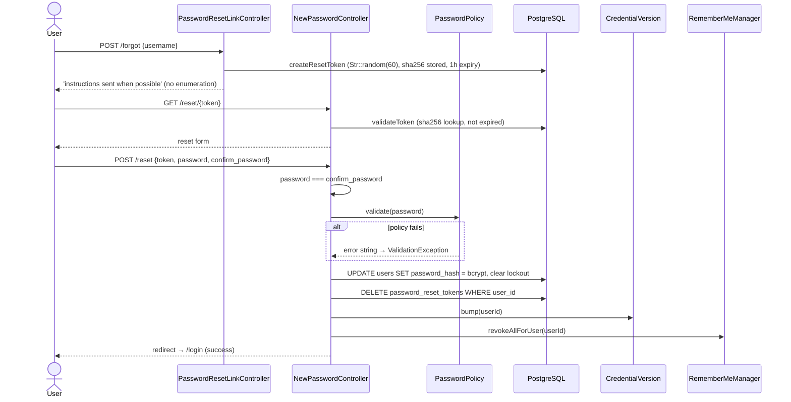
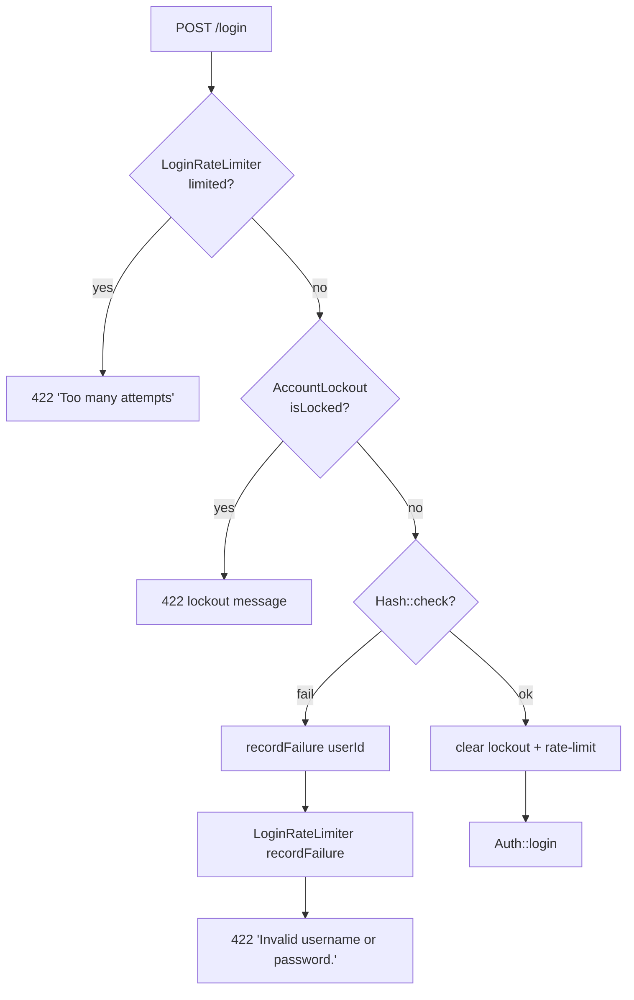

# Password Policy

> **Module:** Security / Auth
> **Audience:** Engineers + AI assistants + security reviewers
> **Status:** Draft
> **Last reviewed:** 2025-08-03
> **Source of truth:** this file + `laravel/app/Services/Auth/PasswordPolicy.php` + `laravel/app/Services/Auth/AccountLockout.php` + `laravel/app/Services/Auth/LoginRateLimiter.php` + `laravel/app/Services/Auth/RememberMeManager.php`

## 1. What is it?

The password policy is the set of rules a new password must satisfy, plus the controls that gate
login attempts (rate limiting, account lockout) and the remember-me mechanism. The policy is
enforced centrally by the `PasswordPolicy` service: minimum 8 / maximum 128 characters, at least
one letter, one digit, one special character, and a **HaveIBeenPwned k-anonymity breach check**
(the password is rejected if it has appeared in a known data breach). The HIBP check fails open if
the API is unreachable.

## 2. Why does it exist?

- To block trivially weak passwords (`password`, `12345678`, `qwerty`) at the moment they are
  chosen, not after a breach.
- To throttle credential-stuffing attacks via per-username + per-IP rate limiting and a 15-minute
  account lockout after 5 failed attempts.
- To provide a safe remember-me that survives a stolen cookie no better than one use
  (selector:validator scheme with rotation).

## 3. When is it used?

- **Password reset (forgot flow):** the **only** path that calls `PasswordPolicy::validate()`
  today. Enforced in `NewPasswordController::store()`.
- **Login:** `LoginRateLimiter` + `AccountLockout` gate every login attempt.
- **Remember-me restore:** on every web request where `SyncLegacySession` falls through to the
  remember-me cookie.
- **Admin-initiated password set/reset:** currently uses **weaker inline rules** (see §7.2 —
  documented gap).

## 4. Who uses it?

- **Users (self):** forgot-password flow.
- **Admins:** `UserController::store()`, `UserController::update()`, `UserController::resetPassword()`.
- **System/automated:** the `LoginRateLimiter` + `AccountLockout` services run on every login.

## 5. Related modules

- `auth-and-sessions.md` — login flow + password reset controller.
- `credential-versioning.md` — password reset bumps the credential version.
- `audit-trails.md` — `password_change`, `password_reset`, `account_locked` audit actions.
- `api-security.md` — API tokens are a separate concern (not passwords).

## 6. Business rules

- **MUST** hash passwords with bcrypt at cost 12 (`config/hashing.php`).
- **MUST** enforce, on the forgot-password reset path: length 8–128, ≥1 letter, ≥1 digit, ≥1
  special character, and HIBP breach check.
- **MUST** fail open on HIBP unreachable (allow the password, log a warning) — availability over
  strictness when the external API is down.
- **MUST** rate-limit login: 5 attempts per 15 minutes, keyed by username **and** IP (Redis).
- **MUST** lock the account for 15 minutes after 5 failed attempts
  (`users.failed_login_count` + `users.locked_until`).
- **MUST** clear `failed_login_count` + `locked_until` on successful login and on password reset.
- **MUST** use a selector:validator remember-me scheme with **rotation on every successful
  restore** and **revoke-all on validator mismatch** (potential theft → kill all tokens).
- **MUST** make reset tokens single-use (delete on use) and expire after 1 hour.
- **MUST NOT** reuse passwords from history — **currently NOT enforced** (no `password_history`
  table; see §13).
- **MUST NOT** expire passwords by age — **currently NOT enforced** (no `password_changed_at`
  column; see §13).
- **SHOULD** apply the full `PasswordPolicy::validate()` to admin-initiated password sets too (gap
  — see §7.2).

## 7. Technical implementation

### 7.1 `PasswordPolicy` service — `laravel/app/Services/Auth/PasswordPolicy.php`

Static class.

```php
public static function validate(string $password): true|string
{
    if (strlen($password) < 8)   return 'Password must be at least 8 characters long.';
    if (strlen($password) > 128) return 'Password must not exceed 128 characters.';
    if (!preg_match('/[A-Za-z]/', $password))   return 'Password must contain at least one letter.';
    if (!preg_match('/[0-9]/', $password))      return 'Password must contain at least one number.';
    if (!preg_match('/[^A-Za-z0-9]/', $password)) return 'Password must contain at least one special character.';
    if (!self::isSafeFromHIBP($password))       return 'This password has appeared in a known data breach. Please choose a different password.';
    return true;
}
```

| Rule | Value | Notes |
|---|---|---|
| Min length | 8 | hardcoded |
| Max length | 128 | hardcoded |
| Required: letter | ≥1 `[A-Za-z]` | (uppercase NOT separately required) |
| Required: digit | ≥1 `[0-9]` | |
| Required: special char | ≥1 `[^A-Za-z0-9]` | |
| Required: uppercase | **NOT enforced** | gap — any letter suffices |
| Required: lowercase | **NOT enforced** | gap |
| Breach check | HIBP k-anonymity (SHA-1 prefix, 5 chars) | `isSafeFromHIBP()` |
| Password history | **NOT FOUND** — no `password_history` table | reuse not prevented |
| Max age / expiry | **NOT FOUND** — no `password_changed_at` column | no expiry enforcement |

### 7.2 Where validation happens (and the admin-path gap)

| Path | File | Rule applied |
|---|---|---|
| Forgot-password reset | `app/Http/Controllers/Auth/NewPasswordController.php:68` | `PasswordPolicy::validate()` (full policy + HIBP) |
| Admin creates user | `app/Http/Controllers/Admin/UserController.php` (`store`) | `'password' => ['required','string','min:6','max:128']` — **weaker** |
| Admin updates user (new password) | `app/Http/Controllers/Admin/UserController.php` (`update`) | `'password' => ['nullable','string','min:6','max:128']` — **weaker** |
| Admin force-reset password | `app/Http/Controllers/Admin/UserController.php` (`resetPassword`) | generates random 16-char string; no policy check |

> **Documented gap:** admin-initiated passwords bypass `PasswordPolicy::validate()` entirely. The
> reset flow is the only path that enforces complexity + HIBP. No form request in
> `app/Http/Requests/` references `PasswordPolicy` (grep confirmed).

### 7.3 HIBP k-anonymity check — `PasswordPolicy::isSafeFromHIBP()`

```php
$hash = strtoupper(sha1($password));
$prefix = substr($hash, 0, 5);   // only 5 chars sent
$suffix = substr($hash, 5);
$response = Http::withHeaders(['Add-Padding' => 'true'])->timeout(5)
    ->get("https://api.pwnedpasswords.com/range/{$prefix}");
```

- Sends only the first 5 chars of the SHA-1 hash (k-anonymity: HIBP never sees the full hash).
- Adds the `Add-Padding: true` header to mitigate traffic analysis.
- 5-second timeout.
- **Fail-open:** if HIBP is unreachable (non-2xx or exception), the password is **allowed** with a
  `Log::warning('HIBP Pwned Passwords API unreachable, failing open', ...)`.
- If the suffix appears with `count > 0`, the password is rejected.

### 7.4 `AccountLockout` service — `laravel/app/Services/Auth/AccountLockout.php`

```php
public function __construct() {
    $this->maxFailed  = config('auth.max_failed_attempts', 5);
    $this->lockMinutes = config('auth.lockout_minutes', 15);
}

public function recordFailure(int $userId): void {
    DB::table('users')->where('id', $userId)->update([
        'failed_login_count' => DB::raw('failed_login_count + 1'),
        'locked_until' => DB::raw(
            'CASE WHEN failed_login_count + 1 >= ' . $this->maxFailed
            . ' THEN NOW() + INTERVAL \'' . $this->lockMinutes . ' minutes\''
            . ' ELSE locked_until END'
        ),
        'updated_at' => now(),
    ]);
}
```

A **single UPDATE** increments the counter and conditionally sets `locked_until` once the
threshold is reached — no SELECT, no row lock, race-safe under PostgreSQL semantics.

`isLocked()`, `lockMessage()`, `clear()` round out the API.

### 7.5 `LoginRateLimiter` — `laravel/app/Services/Auth/LoginRateLimiter.php`

Redis-backed, distributed.

```php
$this->maxAttempts = config('auth.max_failed_attempts', 5);
$this->decaySeconds = 900; // 15 minutes
```

- `isLimited($key)`, `recordFailure($key)`, `clear($key)`, `remainingAttempts($key)`,
  `availableIn($key)`.
- Key: `'login_rate:' . hash('sha256', $key)` — hashed to avoid leaking usernames into Redis keys
  and to keep keys valid for Redis.
- Reused for forgot-password requests (keyed `'forgot:' . $username`).

### 7.6 `RememberMeManager` — `laravel/app/Services/Auth/RememberMeManager.php`

Selector:validator scheme (mirrors legacy `RememberMe.php`).

- Cookie name: `'remember_rcerp'` (NOT Laravel's default `remember_web_*`).
- Lifetime: `config('auth.remember_days', 30)` = 30 days.
- `create($userId)`: `$selector = bin2hex(random_bytes(16)); $validator = bin2hex(random_bytes(32));`
  store `sha256($validator)` in `remember_tokens`; cookie = `selector:validator`.
- `attemptRestore()`:
  - Splits cookie on `:`.
  - Looks up `remember_tokens WHERE selector = ? AND expires_at > now()`.
  - **Constant-time** compare via `hash_equals($row->token_hash, sha256($validator))`.
  - On mismatch → clear cookie + **`revokeAllForUser($row->user_id)`** (potential theft → kill
    all tokens for that user).
  - On success → **rotate** the token (new selector + validator, update row, queue new cookie).
- `revokeCurrent()`, `revokeAllForUser($userId)`.

> The `User` model also defines `getRememberTokenName()` returning `'remember_token'` (Laravel's
> native column), so Laravel's built-in `Auth::login($user, $rememberMe)` may also write that
> column. `RememberMeManager` is the **primary** mechanism; the native column is a fallback.

### 7.7 Password reset flow — controllers + tables

**Forgot (`PasswordResetLinkController`):**
- Validates `username`. Rate-limited via `LoginRateLimiter` keyed `'forgot:' . $username`.
- `User::active()->where('username', $username)->first()`.
- Generic message to prevent enumeration: `'If an account exists for that username, reset
  instructions have been sent when possible.'`
- Token: `Str::random(60)` plain; `hash('sha256', $token)` stored; `expires_at = now + 1h`
  (`config('auth.reset_token_hours', 1)`).
- Deletes any existing tokens for the user (single-use).
- Sends email via `Mail::raw(...)` to `$user->employee?->email` ONLY if SMTP host is configured;
  otherwise silent (dev mode logs the URL).

**Reset (`NewPasswordController`):**
- Validates `token`, `password`, `confirm_password` all required strings.
- Custom match check: `password === confirm_password` (not Laravel's `confirmed` rule).
- `PasswordPolicy::validate($password)`.
- Re-validates the token (single-use).
- `UPDATE users SET password_hash = bcrypt(password), failed_login_count = 0, locked_until = null`.
- `DELETE FROM password_reset_tokens WHERE user_id = ?`.
- `CredentialVersion::bump($userId)`.
- `RememberMeManager::revokeAllForUser($userId)`.
- `UserAuditLogger::log($userId, 'password_reset')`.
- Redirect to `/login` with success.

### 7.8 Token validation — `NewPasswordController::validateToken()`

```php
private function validateToken(string $token): ?object {
    $tokenHash = hash('sha256', $token);
    return DB::table('password_reset_tokens')
        ->where('token_hash', $tokenHash)
        ->where('expires_at', '>', now())
        ->first();
}
```

## 8. Important database tables

| Table | Purpose | Key columns |
|---|---|---|
| `users` | Password hash + lockout counters | `password_hash, failed_login_count, locked_until, credential_version, remember_token` |
| `password_reset_tokens` | Forgot-password broker tokens (SHA-256 hashed) | `user_id, token_hash (unique), expires_at` |
| `remember_tokens` | Remember-me selector:validator pairs | `user_id, selector (unique), token_hash, expires_at` |

> **No `password_history` table exists.** Password reuse is not prevented. See §13.

## 9. Related services

- `laravel/app/Services/Auth/PasswordPolicy.php` — `validate()`, `isSafeFromHIBP()`,
  `validateUsername()`.
- `laravel/app/Services/Auth/AccountLockout.php` — `recordFailure()`, `isLocked()`, `clear()`.
- `laravel/app/Services/Auth/LoginRateLimiter.php` — Redis-backed rate limiter.
- `laravel/app/Services/Auth/RememberMeManager.php` — selector:validator remember-me.
- `laravel/app/Services/Auth/UserAuditLogger.php` — `password_change`, `password_reset`,
  `account_locked` audit rows.

## 10. Related models

- `laravel/app/Models/User.php` — `password_hash` cast (hidden), `isLocked()`, lockout scopes.

## 11. Important workflows

### 11.1 Forgot-password → reset → force-logout



### 11.2 Login rate-limit + lockout



## 12. Known edge cases

- **Admin-initiated passwords bypass the policy.** `UserController::store/update/resetPassword`
  use `min:6` inline rules or a random generator. A 6-character admin-set password would pass
  admin rules but fail the user-facing policy. Documented gap (§7.2, §13).
- **`validateUsername()` exists** (4–50 chars, `[A-Za-z0-9_]+`) but is separate from password
  validation — it is not called by the password reset flow.
- **HIBP fail-open.** If `api.pwnedpasswords.com` is unreachable, breached passwords are allowed.
  This is intentional (availability) but should be monitored.
- **Remember-me cookie name differs from Laravel default.** `'remember_rcerp'` vs
  `'remember_web_*'`. Both mechanisms may coexist (the `User` model exposes the native column
  name); the legacy `RememberMeManager` is authoritative.
- **`availableIn()` always returns `900`** (the decay window), not the actual remaining TTL —
  Laravel's Redis cache doesn't expose TTL cheaply. The UI shows a fixed 15 minutes even if only
  30 seconds remain.
- **Forgot-password rate limit reuses the login limiter** with the same 5/15min thresholds (the
  controller docstring says "3 per 15 minutes" but the actual limit is 5).
- **`confirm_password` is a custom match**, not Laravel's `confirmed` rule — the request must
  include both fields with that exact naming.

## 13. Future improvements

- **Apply `PasswordPolicy::validate()` to admin-initiated passwords.** Replace the inline
  `min:6` rules in `UserController::store/update/resetPassword` with a call to the service (or a
  shared form request that delegates to it).
- **Add a `password_history` table** (last N hashes per user) and reject reuse.
- **Add a `password_changed_at` column** and enforce a max-age policy (e.g. 90 days) with a
  grace-period warning.
- **Enforce uppercase + lowercase separately** if the business wants stricter complexity.
- **Move HIBP to fail-closed in production** (or add a circuit breaker that fails closed after N
  consecutive unreachable checks).
- **Fix the `availableIn()` approximation** by reading the Redis TTL directly.
- **Add a profile/password-change page** so users can change their own password through the full
  policy (today only the forgot flow does).
