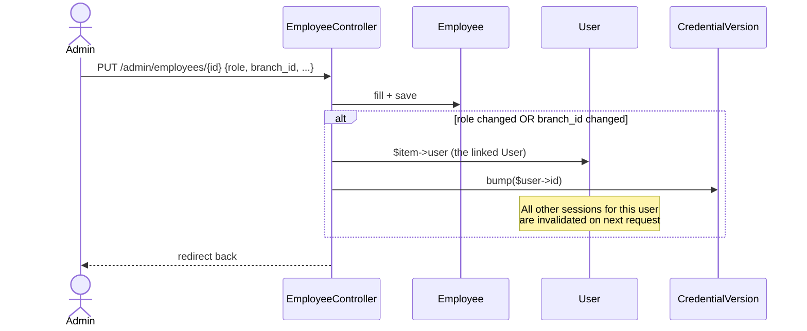
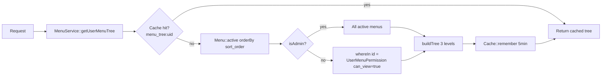

# RBAC — Roles & Permissions

> **Module:** Security / RBAC
> **Audience:** Engineers + AI assistants + security reviewers
> **Status:** Draft
> **Last reviewed:** 2025-08-03
> **Source of truth:** this file + `laravel/config/roles.php` + `laravel/app/Http/Middleware/EnsureRole.php` + `laravel/app/Http/Middleware/EnsureMenuPermission.php` + `laravel/app/Services/MenuService.php`

## 1. What is it?

RC_ERP_v2 uses a **plain string-based role model** (no `spatie/laravel-permission`, no roles
table, no role pivot). There are exactly **10 roles in 3 tiers** defined in `config/roles.php`.
Each user has exactly one role, stored on the `employees.role` column (a `varchar(30)` with a DB
CHECK constraint). Authorization is enforced at three layers: route middleware (`EnsureRole`,
`EnsureMenuPermission`), Eloquent-scoped per-row policies (`app/Policies/`), and a per-user,
per-menu visibility matrix (`user_menu_permissions` table) that drives the sidebar.

## 2. Why does it exist?

- The legacy app used the same string-roles model; keeping it minimized migration risk and let the
  existing Blade UI keep its `if ($user->isAdmin())` checks working unchanged (the "keep existing
  UI" principle in `../PROJECT_OVERVIEW.md`).
- A full RBAC package (spatie) was overkill for 10 fixed roles and would have required a roles
  table + pivots + cache, none of which the business needed.
- The 3-tier split (superadmin / admin / operational) mirrors how the company is actually
  administered: a single superadmin owns company-critical actions; admins manage users and
  master data; the 8 operational roles do day-to-day branch work.

## 3. When is it used?

- **On every authenticated request** — `EnsureRole` middleware on protected route groups checks
  the user's role against the allowed list.
- **On sidebar render** — `MenuService::getUserMenuTree()` filters menus by `can_view` permissions
  (non-admins only).
- **On direct URL access** — `EnsureMenuPermission` middleware blocks deep links to menus the user
  can't see (defense-in-depth layer 2).
- **Inside controllers** — `$this->authorize()` calls re-check via the policy classes
  (defense-in-depth layer 3).
- **During role assignment** — admins edit `employee.role` via `EmployeeController::update()`
  (which also bumps `credential_version` — see `credential-versioning.md`).

## 4. Who uses it?

| Role | Tier | Typical user |
|---|---|---|
| superadmin | superadmin | The company owner / production-credential holder. |
| admin | admin | IT admin / back-office manager. |
| manager | operational | Branch manager. |
| accountant | operational | Finance team. |
| salesman | operational | Front-counter sales staff. |
| warehouse_manager | operational | Godown in-charge. |
| dispatcher | operational | Dispatch rider / godown helper. |
| hr | operational | HR officer. |
| user | operational | Generic operational login (access fully controlled by menu permissions). |
| other | operational | Catch-all for custom access profiles. |

## 5. Related modules

- `auth-and-sessions.md` — how a user becomes authenticated.
- `credential-versioning.md` — role changes bump the credential version.
- `branch-context-security.md` — admin/superadmin bypass branch isolation.
- `audit-trails.md` — `role_change` audit action.
- `system-policy-compliance.md` — superadmin-only system policy gate.

## 6. Business rules

- **MUST** keep exactly 10 roles in 3 tiers as defined in `config/roles.php`. Do not invent new
  roles in code without updating the config + the DB CHECK constraint.
- **MUST** store the role on `employees.role` (not `users`). The `User::getRole()` helper reads
  `$this->employee?->role ?? 'user'`.
- **MUST** let `superadmin` pass every `EnsureRole` check unconditionally (it short-circuits
  before the role list comparison).
- **MUST** let `admin` + `superadmin` bypass `EnsureMenuPermission` (menu visibility is
  unrestricted for the admin tier).
- **MUST** enforce maker-checker (segregation of duties) in `DamagePolicy` — the submitter of a
  damage draft cannot approve their own submission.
- **MUST** bump `credential_version` when an employee's `role` or `branch_id` changes (see
  `credential-versioning.md`).
- **MUST NOT** rely on `assignable_by` for runtime enforcement — it is documented intent only;
  there is no `RoleAssignmentService`. (Gap — see §13.)
- **SHOULD** use `$this->authorize()` in controllers as defense-in-depth even when route
  middleware already gates by role.

## 7. Technical implementation

### 7.1 The 10 roles — `laravel/config/roles.php`

| Role key | Label | Tier | Description | `assignable_by` |
|---|---|---|---|---|
| `superadmin` | Super Admin | `superadmin` | Full system control incl. company-critical actions and superadmin account management. | `['superadmin']` |
| `admin` | Admin | `admin` | User accounts, employees, permissions, normal administrative work. | `['superadmin','admin']` |
| `manager` | Manager | `operational` | Branch operations: sales oversight, reversals, reports, warehouse coordination. | `['superadmin','admin']` |
| `accountant` | Accountant | `operational` | Payments, GL reconciliation, financial reports, return confirmations. | `['superadmin','admin']` |
| `salesman` | Salesman | `operational` | Sales invoices, challans (read), customer-facing sales. | `['superadmin','admin']` |
| `warehouse_manager` | Warehouse Manager | `operational` | Godown/challan preparation, stock movements, return confirmations. | `['superadmin','admin']` |
| `dispatcher` | Dispatcher | `operational` | Dispatch and challan execution alongside warehouse staff. | `['superadmin','admin']` |
| `hr` | HR | `operational` | Employee master data and HR-related modules. | `['superadmin','admin']` |
| `user` | User | `operational` | Generic operational login; access controlled entirely by menu permissions. | `['superadmin','admin']` |
| `other` | Other | `operational` | Catch-all operational role for custom access profiles. | `['superadmin','admin']` |

### 7.2 Where the role is stored — DB CHECK mismatch (known gap)

The DB CHECK on `employees.role` (in `laravel/database/sql/01_auth_and_master.sql`):

```sql
role varchar(30) NOT NULL
  CHECK (role IN ('admin','salesman','warehouse_manager','dispatcher',
                  'accountant','hr','manager','other','superadmin'))
```

The CHECK lists **9** roles — `'user'` is missing. The config lists **10**. `'user'` is only ever
the fallback string returned by `User::getRole()` when an employee has a null/empty role; it is
never persisted. **Do not persist `'user'` to the DB** — it would violate the CHECK.

### 7.3 `EnsureRole` middleware — `laravel/app/Http/Middleware/EnsureRole.php`

Alias: `role`. Usage: `->middleware('role:admin')` or `->middleware('role:admin,accountant')`.

Logic:
1. Not authenticated → 401 JSON (`expectsJson`) or redirect to `/login`.
2. `if ($userRole === 'superadmin') return $next($request);` — superadmin always passes.
3. Tier check: `if (in_array('admin', $allowedTiers, true) && $userRole === 'admin')` — admin-tier
   routes allow admin.
4. Exact match: `if (in_array($userRole, $roles, true))`.
5. Deny → 403 JSON `'You do not have permission to perform this action.'` or redirect with error.

### 7.4 `EnsureMenuPermission` middleware — `laravel/app/Http/Middleware/EnsureMenuPermission.php`

Alias: `menu.permission`. Usage: `->middleware('menu.permission:branchdemand')` (controller only)
or `->middleware('menu.permission:branchdemand,pending')` (controller + action).

Logic:
1. Not authenticated → 401/redirect.
2. `if ($user->isAdmin()) return $next($request);` — admin/superadmin bypass.
3. `if ($this->menuService->canView($user, $controller, $action ?? ''))`.
4. Deny → 403 JSON `'You do not have permission to access this menu.'` or redirect.

> Currently only 1 route group uses `menu.permission` (`admin/branch-demands`). The rest rely on
> `role:` middleware + `EnsureRole`. This is by design — `EnsureMenuPermission` is the granular
> escape hatch for cases where role alone is too coarse.

### 7.5 The menu system (3-level hierarchy, DB-driven)

**`menus` table** (`laravel/database/sql/01_auth_and_master.sql`):

| Column | Purpose |
|---|---|
| `id` | PK |
| `parent_id` | `0` = top-level; otherwise self-reference. |
| `menu_label` | Display text. |
| `controller` | Legacy controller name; mapped to a Laravel named route by `MenuService::resolveMenuUrl()`. |
| `action` | Optional action sub-key. |
| `icon` | Sidebar icon. |
| `sort_order` | Display order. |
| `is_active` | Soft-hide without deleting. |

**`user_menu_permissions` table** — the per-user, per-menu matrix:

| Column | Purpose |
|---|---|
| `user_id` | FK→users (CASCADE). |
| `menu_id` | FK→menus (CASCADE). |
| `can_view` | Show in sidebar + allow direct URL. |
| `can_edit` | Show edit buttons (UI hint; not enforced server-side today). |
| UNIQUE | `(user_id, menu_id)` — one row per pair. |

### 7.6 `MenuService` — `laravel/app/Services/MenuService.php`

Singleton (bound in `AppServiceProvider::register()`). Key methods:

- `getUserMenuTree(User $user): array` — **cached 5 minutes** per user
  (`Cache::remember('menu_tree:{user_id}', 300, ...)`). Builds a 3-level tree filtered by
  `can_view=true` for non-admins; admins see all active menus.
- `canView(User, string $controller, string $action = ''): bool` — admin bypass; else existence
  check on `user_menu_permissions` joined to `menus` (case-insensitive controller match).
- `setPermission(int $userId, int $menuId, bool $canView, bool $canEdit): void` —
  `updateOrCreate` + invalidate the user's cache.
- `invalidateUserMenuCache(int $userId)` / `invalidateAllMenuCaches()`.

Cache key: `menu_tree:{user_id}`. TTL: `300` seconds.

### 7.7 Gates — `laravel/app/Providers/AppServiceProvider.php`

Two `Gate::define` calls:

```php
Gate::define('manage-system-policy', fn (User $user) => $user->isSuperadmin());
Gate::define('view-notification-rules', fn (User $user) => $user->isAdmin());
```

### 7.8 Policies — `laravel/app/Policies/`

8 policy classes. 7 are registered via `Gate::policy(...)` in `AppServiceProvider::boot()`;
`SystemPolicyPolicy` exists but is **not registered** (the `manage-system-policy` Gate uses a
closure instead — `SystemPolicyPolicy` is currently dead code).

| Policy | Model | Methods | Role matrix (summary) |
|---|---|---|---|
| `SalesInvoicePolicy` | `SalesInvoice` | `view, create, update, delete, callItADay, receivePayment, reversePayment, exportCsv` | salesman / accountant / warehouse_manager / manager / admin (varies) |
| `CustomerPaymentPolicy` | `CustomerPayment` | `view, create, delete, printReceipt` | salesman / accountant / manager / admin |
| `SupplierTransactionPolicy` | `SupplierPayment` | `view, viewAudit, create, delete, printSlip` | accountant / manager / admin |
| `EmployeeTransactionPolicy` | `EmployeeTransaction` | `view, viewAudit, create, delete, printSlip` | accountant / manager / admin |
| `ManualJournalPolicy` | `ManualJournal` | `view, viewAudit, create, delete, post` | accountant / manager / admin |
| `StockAdjustmentPolicy` | `StockAdjustment` | `view, audit, create, viewProductRate, confirm, submit, approve, reject, cancel` | admin / accountant / manager (manager read-only) + same-branch check |
| `DamagePolicy` | `DamageInvoice` | `viewAny, view, create, viewProductStock, confirm, cancel, submit, approve, reject, uploadAttachment, deleteAttachment, viewAttachment, recoverFromEmployee` | admin / manager / warehouse_manager + maker-checker |
| `SystemPolicyPolicy` | (none — pure Gate) | `manage` | superadmin only — **NOT registered** |

**Defense-in-depth pattern (every policy class):** "Each method returns true for the EXACT set of
roles the corresponding route middleware already allows — so `$this->authorize()` in the
controller is defense-in-depth (the middleware gates first; the policy re-confirms the same
rule)."

**Same-branch enforcement:** `StockAdjustmentPolicy` and `DamagePolicy` each have a
`private sameBranch(User, Model): bool` helper:

```php
if ($user->isAdmin()) return true;
$sessionBranchId = (int) (session('branch_id') ?? $user->getBranchId() ?? 0);
return $sessionBranchId > 0 && (int) $adjustment->branch_id === $sessionBranchId;
```

**Maker-checker (DamagePolicy):**
- `approve()` / `reject()` return `false` if `(int) $damage->submitted_by === (int) $user->id`
  (submitter cannot approve their own submission).
- `confirm()` requires `isApproved()`.
- `cancel()` rejects terminal states (`isRejected()`, `isCancelled()`).
- `recoverFromEmployee()` requires `isConfirmed()` + non-empty `accountable_employee_id` + no
  prior recovery.
- Attachment mutations require `isDraft()` (evidence is frozen once the damage leaves draft).

## 8. Important database tables

| Table | Purpose | Key columns |
|---|---|---|
| `employees` | Carries the `role` + `branch_id` per user | `id, role (CHECK 9 values), branch_id, is_active` |
| `menus` | 3-level menu hierarchy | `id, parent_id, menu_label, controller, action, is_active, sort_order` |
| `user_menu_permissions` | Per-user, per-menu visibility matrix | `user_id, menu_id, can_view, can_edit` UNIQUE(user_id, menu_id) |

See `../database/er-diagrams.md` for the auth/master ER diagram.

## 9. Related services

- `laravel/app/Services/MenuService.php` — menu tree + permission cache.
- (No `RoleService` or `RoleAssignmentService` exists — gap, see §13.)

## 10. Related models

- `laravel/app/Models/User.php` — `getRole()`, `isSuperadmin()`, `isAdmin()`, `hasRole()`.
- `laravel/app/Models/Employee.php` — carries `role`.
- `laravel/app/Models/Menu.php` — `scopeActive`, `scopeTopLevel`, `children()`, `permissions()`.
- `laravel/app/Models/UserMenuPermission.php` — `can_view` / `can_edit` bool casts.

## 11. Important workflows

### 11.1 Role assignment (admin edits an employee)



### 11.2 Menu visibility resolution (per request)



## 12. Known edge cases

- **DB CHECK vs config mismatch:** the DB CHECK on `employees.role` allows 9 values; the config
  defines 10 (`'user'` is missing from the CHECK). Persisting `'user'` would raise a constraint
  violation. `'user'` is only ever an in-memory fallback.
- **`assignable_by` is not enforced at runtime.** The config documents who *may* assign each role,
  but no middleware/service checks it. An admin could today assign `superadmin` to a new employee
  (the route is gated by `role:admin`, not `role:superadmin`). This is a documented gap.
- **`SystemPolicyPolicy` is dead code** — defined in `app/Policies/` but never registered; the
  `manage-system-policy` Gate uses a closure. Do not assume `$this->authorize('manage', ...)`
  resolves to the policy class.
- **Menu permission `can_edit` is a UI hint only** — it is not enforced server-side today; the
  server enforces `can_view` only (via `EnsureMenuPermission`).
- **Cache staleness on role change:** when an admin changes a user's role, `MenuService` does not
  automatically invalidate that user's menu cache. The user keeps their old menu tree for up to 5
  minutes (cache TTL) unless `MenuService::invalidateUserMenuCache($userId)` is called. (The
  credential-version bump does force a re-login, which indirectly clears this — but a same-session
  role change without logout would show stale menus.)
- **Policies re-check role + same-branch, not menu permissions.** A user with `can_view=true` on a
  menu but whose role is not in the policy's allowed list will be blocked at `$this->authorize()`
  even if they reached the controller.

## 13. Future improvements

- **Enforce `assignable_by` at runtime** — add a `RoleAssignmentService` (or a `Gate`) that
  `EmployeeController::update()` consults before changing `employee.role`, so an admin cannot
  assign `superadmin`.
- **Register `SystemPolicyPolicy`** (or delete the class if it will never be used) to remove the
  dead-code ambiguity.
- **Sync the DB CHECK with the config** — either add `'user'` to the CHECK or drop `'user'` from
  the config.
- **Invalidate the user's menu cache on role/permission change** in `EmployeeController::update()`
  and `MenuService::setPermission()` (the latter already does; the former does not).
- **Enforce `can_edit` server-side** if granular edit-vs-view control becomes a real requirement.
- **Consider a role→menu seed** so new installs get a sensible default menu set per role without
  manual per-user toggling.
