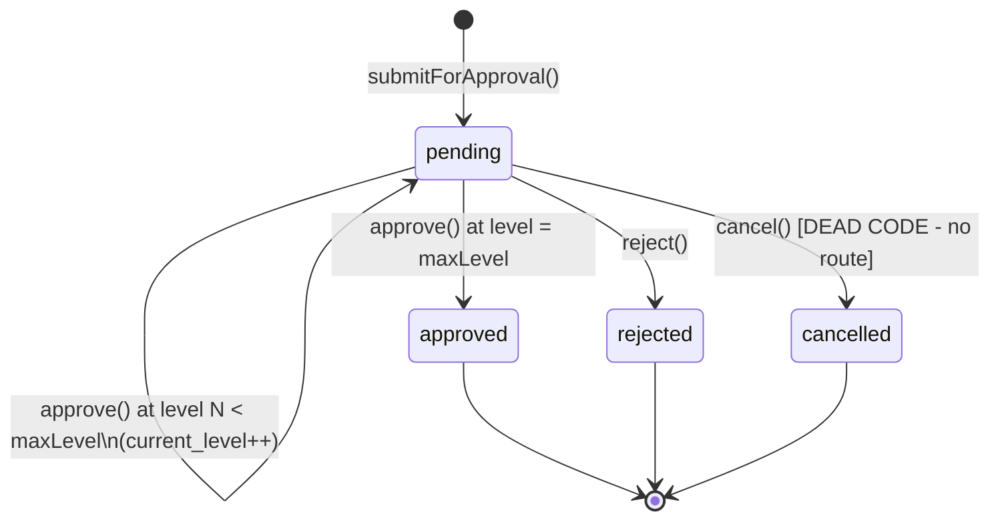
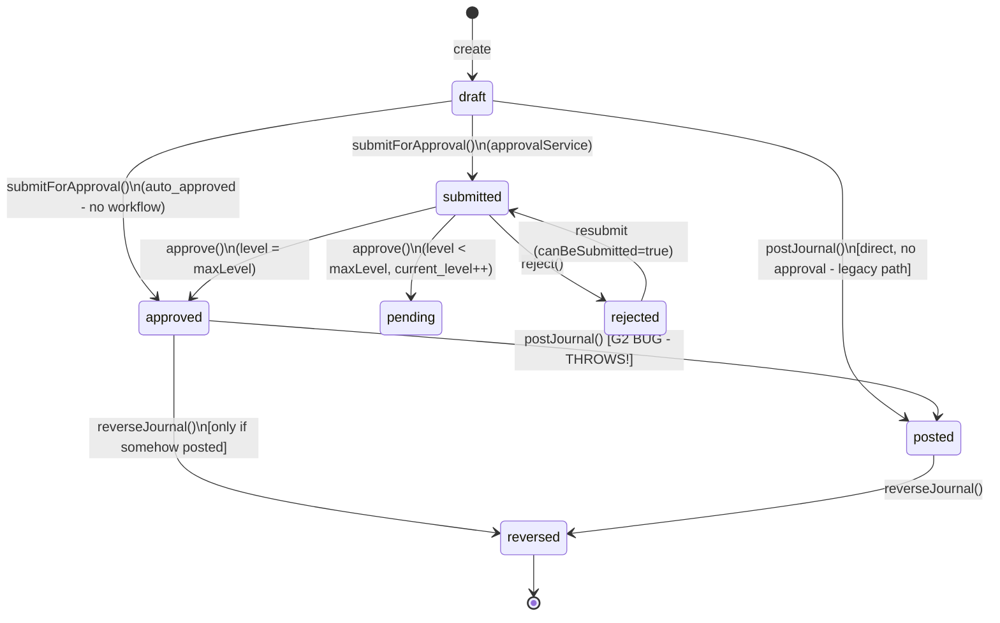
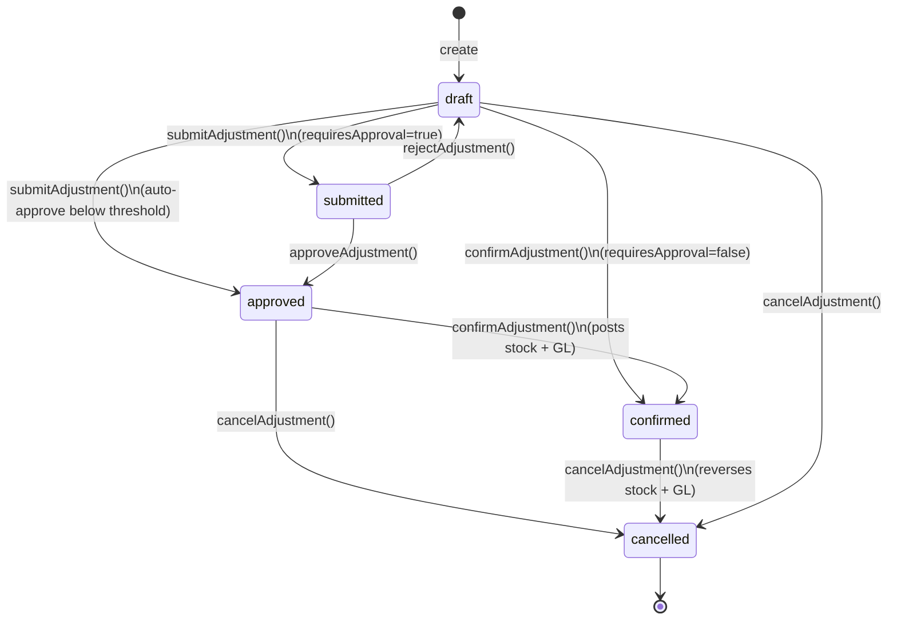
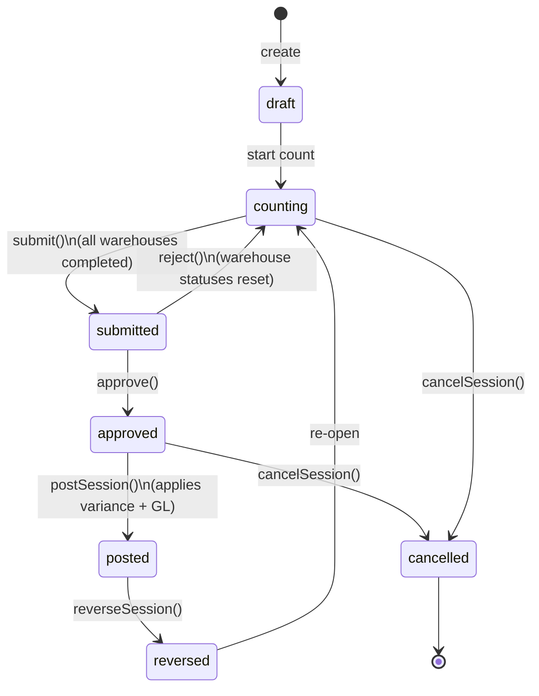
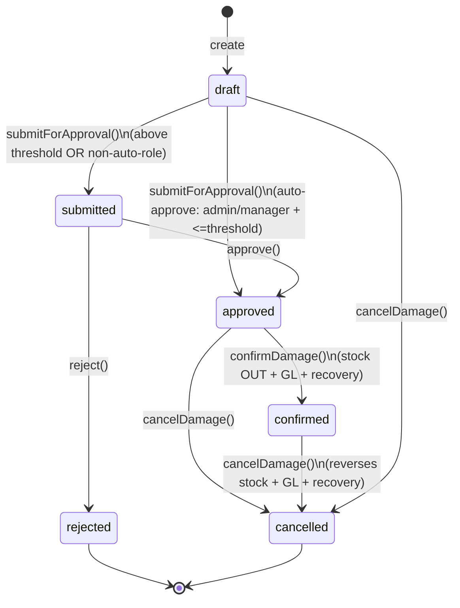
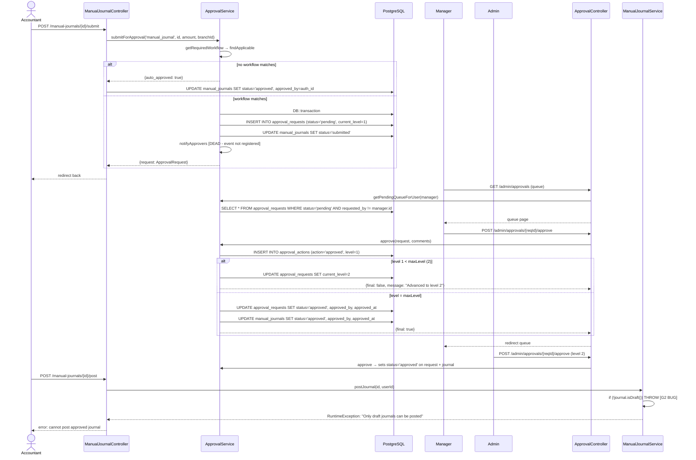
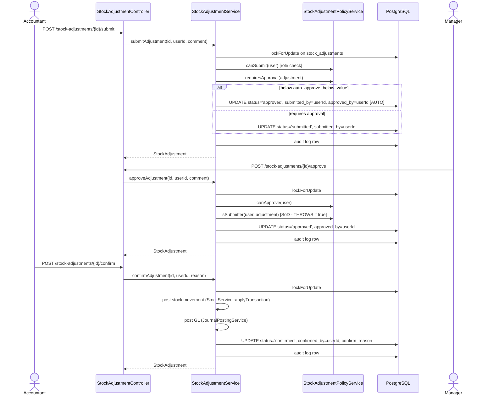

# Approval Workflow & Maker-Checker — Phase 14

> **Module:** Workflows / Approval Engine
> **Audience:** Engineers, AI assistants, accountants, auditors, compliance officers
> **Status:** Draft — pending compliance review (**NOT SAFETY-CRITICAL in the GL sense** — approval gates
> themselves do not post to the GL; but **business-critical** because they gate stock adjustments, stock takes,
> damage invoices, and manual journals before those entities post. ~~Four CRITICAL gaps (G1 architectural
> inconsistency, G2 approved-manual-journal dead-ends at post, G4 notification dispatch is dead code,
> G7 DDL stale) mean the approval subsystem is only partially production-ready.~~)
> **WORKFLOWS-APPROVAL (commit `d84a5a8`):** all 4 CRITICALs in this file resolved
> (G-075/G1, G-077/G2, G-080/G4, G-081/G7). The approval subsystem is now
> production-ready. Remaining HIGH/MEDIUM gaps (G3/G5/G6/G8-G16) are
> non-blocking hardening items.
> **Last reviewed:** Phase 14 (initial creation) + WORKFLOWS-APPROVAL session
> **Source of truth:** This file is the canonical reference for the approval subsystem. The implementation
> lives in:
> - `laravel/app/Services/Approval/ApprovalService.php` (407L — the generic-engine crown jewel),
> - `laravel/app/Http/Controllers/Admin/ApprovalController.php` (124L),
> - `laravel/app/Models/{ApprovalWorkflow,ApprovalStep,ApprovalRequest,ApprovalAction}.php`,
> - `laravel/app/Services/Stock/{StockAdjustmentService,StockAdjustmentPolicyService,StockTakeService,StockTakePolicyService,DamageService}.php` (the Pattern-B entity-specific maker-checker services),
> - `laravel/app/Http/Controllers/Admin/{ManualJournalController,StockAdjustmentController,StockTakeController,DamageController}.php`,
> - `laravel/app/Policies/{StockAdjustmentPolicy,DamagePolicy}.php`,
> - `laravel/config/{stock_adjustment,damage}.php` + the `stock_take_policies` DB table,
> - migrations `laravel/database/migrations/{2025_07_28_000001_add_approval_workflow_to_stock_take_sessions,2025_07_29_000001_add_approval_to_stock_adjustments,2026_01_05_000001_damage_approval_workflow,2026_08_10_000001_create_approval_workflow_engine}.php`.

---

## 1. What is it?

The **approval subsystem** is the ERP's maker-checker / segregation-of-duties layer. It inserts a
configurable approval gate between drafting a record and posting it to the GL or applying it to stock.
A user with a "submitter" role (the *maker*) creates a draft and submits it; a different user with an
"approver" role (the *checker*) reviews and either approves or rejects it. Only after approval can the
record be confirmed/posted.

This codebase has **two parallel, non-intersecting approval patterns**:

- **Pattern A — Generic configurable approval engine** (migration `2026_08_10_000001`, added in the
  Phase-5-era "Approval Workflow Engine" refactor). Four new tables (`approval_workflows`,
  `approval_steps`, `approval_requests`, `approval_actions`) + a multi-level `ApprovalService` +
  `ApprovalController` + `/admin/approvals` UI. Designed as a configurable, multi-level,
  role-gated, branch-aware engine "for any entity type". **In practice only `ManualJournal` is wired
  into it**, and even there it is broken (see G2).
- **Pattern B — Entity-specific maker-checker columns** (older pattern, three migrations). Each of
  `stock_adjustments`, `stock_take_sessions`, and `damage_invoices` has its OWN bespoke set of
  approval columns (`submitted_by/at`, `approved_by/at`, `approval_comments`, etc.) on its own table,
  its OWN expanded `status` CHECK constraint, its OWN `submit()/approve()/reject()` service methods,
  and its OWN policy/config layer (`config/stock_adjustment.php`, `config/damage.php`, or the
  `stock_take_policies` DB table). No shared code.

The two patterns do NOT share infrastructure. `ApprovalService::updateEntityStatus()` only implements
the `manual_journal` case (with an explicit `// Future: add other entity types here` comment); the
three Pattern-B entities cannot flow through the generic engine.

---

## 2. Why does it exist?

- **Segregation of duties (SoD).** The accountant/counter who creates a record cannot be the same
  person who approves it for posting. This is a foundational internal-control principle: the maker
  and the checker must be different humans, enforced in code so a compromised or coerced account
  cannot self-approve.
- **Configurable approval thresholds.** Low-value records (e.g. a stock adjustment under
  `STOCK_ADJ_AUTO_APPROVE_VALUE` = 1000 Taka) can bypass the gate and auto-approve inline, while
  high-value records (e.g. a damage invoice above `DAMAGE_APPROVAL_THRESHOLD` = 5000 Taka) are
  forced through explicit approval even when submitted by an admin/manager.
- **Audit trail.** Every submit / approve / reject / cancel action is recorded with actor, timestamp,
  role snapshot, and comment, so an auditor can reconstruct who approved what and when.
- **Policy flexibility.** The approval gate can be turned on/off per entity (`require_approval`
  flag), per role (`approver_roles` / `submitter_roles` arrays), and per value threshold — without
  code changes.
- **The generic engine (Pattern A) was added later** to unify the three bespoke Pattern-B
  implementations under one configurable roof, but the migration was never finished — only
  `manual_journal` was onboarded, and the post-step is broken (G2).

---

## 3. When is it used?

Approval gates fire on these four entity lifecycles:

| Entity | Submit trigger | Approve trigger | Confirm/Post trigger | Pattern |
|---|---|---|---|---|
| **ManualJournal** | User clicks "Submit for Approval" on a draft journal | Manager/admin clicks "Approve" in `/admin/approvals` queue | User clicks "Post" on the approved journal | **A** (generic engine) |
| **StockAdjustment** | Accountant clicks "Submit" on a draft adjustment | Manager/admin clicks "Approve" | Accountant clicks "Confirm" (posts stock + GL) | **B** (entity-specific) |
| **StockTakeSession** | Counter clicks "Submit" after all warehouses complete counting | Manager/admin clicks "Approve" | Manager clicks "Post" (applies variance to stock + GL) | **B** (entity-specific) |
| **DamageInvoice** | User clicks "Submit for Approval" on a draft damage | Manager/admin clicks "Approve" | Manager clicks "Confirm" (posts stock OUT + GL + recovery) | **B** (entity-specific) |

Frequency: low-to-moderate. Stock adjustments and damages are occasional (a few per day per branch);
stock takes are rare (monthly/quarterly); manual journals are frequent but most are auto-approved
(no workflow matches because `min_amount=0` is seeded but `requiresApprovalForAmount` returns true
for any `amount >= 0` — see G-note on the seed).

Auto-approval shortcuts (Pattern B only — intentional SoD bypass where the submitter IS the approver):
- `StockAdjustmentService::submitAdjustment` auto-advances to `approved` when below
  `auto_approve_below_value` (default 1000 Taka). Comment in source: *"the segregation-of-duties
  check is bypassed by design"*.
- `DamageService::submitForApproval` auto-approves when the submitter's role is in
  `config('damage.approval.auto_approve_roles')` (= `['admin','manager']`) AND `total_value <=
  DAMAGE_APPROVAL_THRESHOLD` (default 5000 Taka). Both `submitted_by` and `approved_by` are stamped
  with the same user.
- `ManualJournalController::submitForApproval` auto-approves when `ApprovalService::submitForApproval`
  returns `['auto_approved' => true]` (no workflow applies). The journal is set to `approved` with
  `approved_by = auth()->id()`.

---

## 4. Who uses it?

- **Accountants** (`role:accountant`) — submit stock adjustments and manual journals for approval;
  confirm stock adjustments after approval.
- **Managers** (`role:manager`) — approve/reject submitted stock adjustments, stock takes, damages,
  and manual journals. Primary approver role.
- **Admins** (`role:admin`) — everything managers can do, plus configure approval workflows
  (Pattern A `updateWorkflow` route is admin-only), second-level approval on high-value manual
  journals (seeded level-2 step role=`admin`).
- **Warehouse managers** (`role:warehouse_manager`) — submit stock take sessions and damages for
  approval (but cannot approve — that's manager/admin only).
- **Superadmin** — implicit bypass of role checks via `ApprovalStep::canBeActedBy` (admin/superadmin
  override), but SoD (`requested_by !== user->id`) is still enforced at `ApprovalRequest::canBeActedBy`.
- **Auditors** — read-only consumers of the `approval_actions` audit log + the entity-specific
  approval columns (`submitted_by/at`, `approved_by/at`, `approval_comments`).
- **System/automated** — the `StockAdjustmentAuditService::sectionApprovalWorkflow` health-check
  scans for historical self-approval violations (`approved_by === submitted_by`) and stuck drafts.

---

## 5. Related modules

- `../security/rbac-roles-permissions.md` — the role/permission matrix that gates submit/approve/
  reject/confirm/cancel actions per entity (Phase 5).
- `../security/audit-trails.md` — the `approval_actions` table as an audit log + the recurring gap
  that `fn_financial_audit_trigger` is NOT attached to the approval tables (G12, Phase 5).
- `../security/system-policy-compliance.md` (Phase 14 sibling) — the `stock_take_policies` DB table
  pattern (runtime-configurable) vs `config/stock_adjustment.php` (deploy-time config) vs
  `config/damage.php` (hybrid). Three different policy-storage strategies.
- `../accounting/reversal-vs-cancellation.md` (Phase 6) — the ManualJournal reversal state machine
  and how reversal interacts with approval (G13: reversal does NOT cascade to `approval_requests`).
- `../accounting/fiscal-year-period-close.md` (Phase 6) — the `block_closed_period` knob on stock
  adjustments that prevents submitting back-dated adjustments into a closed period.
- `../inventory/stock-adjustment.md` / `../inventory/stock-take.md` / `../inventory/damage.md`
  (Phase 8) — the entity lifecycles that the approval gates sit inside.
- `./notification-workflow.md` (Phase 15 — pending) — the DEAD CODE notification dispatch (G4):
  `ApprovalService::notifyApprovers/notifyRequester` dispatches 4 event names that are NOT registered
  in `NotificationRule::EVENTS`, so `NotificationService::dispatch` silently returns 0.

---

## 6. Business rules

### 6.1 Segregation of duties (SoD) — the foundational rule

- **MUST** enforce that the submitter (maker) and the approver (checker) are different users.
  Enforced at 10 sites (see §8 below for verbatim code). (`ApprovalRequest::canBeActedBy`,
  `StockAdjustmentService::approveAdjustment`, `StockTakeService::approve`, `DamageService::approve`,
  `DamageService::reject`, `DamagePolicy::approve`, `DamagePolicy::reject`,
  `StockAdjustmentAuditService::sectionApprovalWorkflow`).
- **MUST NOT** allow self-approval except via an explicit, documented, threshold-based auto-approve
  shortcut (StockAdjustment below 1000 Taka; Damage below 5000 Taka submitted by admin/manager;
  ManualJournal when no workflow applies). Every auto-approve stamps `submitted_by === approved_by`
  and writes a comment like `[AUTO-APPROVED — below threshold]` so the audit trail is explicit.
- **MUST** exclude the requester's own submissions from the approval queue.
  (`ApprovalService::getPendingQueueForUser` L268: `->where('requested_by', '!=', $user->id)`).

### 6.2 Status transition rules

- **MUST** only allow `submit` from a draft/rejected state. (`ManualJournal::canBeSubmitted` =
  `isDraft() || isRejected()`; `StockAdjustment::isDraft()`; `StockTakeSession::isCounting()`;
  `DamageInvoice::isDraft()`).
- **MUST** only allow `approve` / `reject` from the `submitted` state. Every service throws if the
  entity is not currently `submitted`.
- **MUST** only allow `confirm`/`post` from the `approved` state (Pattern B) — EXCEPT
  `ManualJournalService::postJournal` which throws on non-draft (G2 BUG — see §12).
- **MUST** only allow `cancel` from draft / submitted / approved (not from confirmed/posted —
  confirmed cancels go through the reversal path instead).
- **MUST NOT** allow resubmitting an already-submitted request. (`ApprovalService::submitForApproval`
  checks for an existing pending request and returns `already_submitted => true`).

### 6.3 Multi-level approval rules (Pattern A only)

- **MUST** advance `current_level` by 1 on each non-final approval. (`ApprovalService::approve`
  L155-161).
- **MUST** set `status='approved'` only when `current_level >= maxLevel()`. (`ApprovalService::approve`
  L138-146).
- **MUST** record an `ApprovalAction` row for EVERY approve/reject action (including intermediate
  levels), with `level`, `action`, `acted_by`, `acted_at`, `comments`, `role_at_time`.
- **SHOULD** support parallel approval (`is_parallel=true` on a step = ALL users with that role must
  approve before advancing). **CURRENTLY DEAD CONFIG** — `approve()` never reads `is_parallel` (G9).
- **MUST NOT** use `requires_approval_levels` to decide final approval — the service uses
  `maxLevel()` (= `steps->max('level')`). `requires_approval_levels` is dead config (see §8.6).

### 6.4 Configurable threshold rules

- **MUST** respect `min_amount` on a workflow: `ApprovalWorkflow::requiresApprovalForAmount` =
  `is_active && amount >= min_amount`. (`ApprovalWorkflow.php:72-75`).
- **MUST** auto-approve (skip the gate) when no applicable workflow matches.
  (`ApprovalService::submitForApproval` L48-50).
- **MUST** branch-scope workflows: `findApplicable` prefers branch-specific workflows over
  global ones (`branch_id IS NULL OR branch_id = ?`, `orderByDesc(min_amount)`). (`ApprovalWorkflow.php:58-67`).
- **MUST** respect the per-entity config knobs: `require_approval` (gate on/off),
  `auto_approve_below_value` (skip gate below threshold), `approver_roles` / `submitter_roles`
  (role allow-lists), `block_closed_period` (reject back-dated).

### 6.5 Audit + immutability rules

- **MUST** record `role_at_time` on every `ApprovalAction` — a snapshot of the actor's role at the
  moment of action, so a later role change doesn't rewrite history. (`ApprovalService::approve/reject`
  pass `$user->getRole()`).
- **MUST** record `submitted_by/at`, `approved_by/at`, `rejected_by/at`, `approval_comments` on the
  entity row itself (Pattern B) for fast rendering without joining `approval_actions`.
- **MUST NOT** allow editing an approval comment after the fact — comments are append-only
  (`StockAdjustmentService::appendComment` concatenates new lines; never overwrites).
- **SHOULD** attach `fn_financial_audit_trigger` to `approval_workflows` and `approval_steps` so
  policy changes (who CAN approve) are tamper-evident. **CURRENTLY NOT ATTACHED** (G12).
- **SHOULD** enable RLS on the 4 generic approval tables. **CURRENTLY NOT ENABLED** (G15).

---

## 7. Technical implementation

### 7.1 Pattern A — Generic configurable approval engine

#### 7.1.1 `ApprovalWorkflow` model — `laravel/app/Models/ApprovalWorkflow.php` (92L)

The workflow configuration: which entity types require approval, at what thresholds, how many levels.

- **`$fillable`**: `name, entity_type, min_amount, is_active, requires_approval_levels, branch_id, description`.
- **`$casts`**: `min_amount → decimal:2`, `is_active → boolean`, `requires_approval_levels → integer`.
- Uses `SoftDeletes`.
- **Relations**: `steps()` HasMany `ApprovalStep` (ordered by `level`); `requests()` HasMany `ApprovalRequest`.
- **Scopes**: `scopeActive` (`where is_active=true`); `scopeForEntity` (`where entity_type=?`).
- **Helpers**:
  - `findApplicable(entityType, amount, branchId)` — static; active + forEntity + `min_amount <= amount`
    + `(branch_id IS NULL OR branch_id=?)` + `orderByDesc(min_amount)` → branch-specific-first. Returns
    `?self`.
  - `requiresApprovalForAmount(amount)` — `is_active && amount >= min_amount`.
  - `getStepAtLevel(level)` — `steps->firstWhere('level', $level)`.
  - `maxLevel()` — `steps->max('level') ?? 0`.

#### 7.1.2 `ApprovalStep` model — `laravel/app/Models/ApprovalStep.php` (40L)

One level within a workflow.

- **`$fillable`**: `approval_workflow_id, level, role, is_parallel, description`.
- **`$casts`**: `level → integer`, `is_parallel → boolean`.
- **`$timestamps = false`** (L22) — **MISMATCH** with migration L50 `$table->timestamps()` (G10).
- **Relations**: `workflow()` BelongsTo `ApprovalWorkflow`.
- **Helpers**: `canBeActedBy(role)` — `role === $this->role || role === 'admin' || role === 'superadmin'`.
  (Admin/superadmin bypass the role check — but SoD still enforced at `ApprovalRequest::canBeActedBy`.)

#### 7.1.3 `ApprovalRequest` model — `laravel/app/Models/ApprovalRequest.php` (154L)

The per-entity request tracking row. One row per submitted entity (or one row per submit cycle if
resubmitted after rejection).

- **`$fillable`**: `entity_type, entity_id, approval_workflow_id, current_level, status, requested_by,
  requested_at, approved_by, approved_at, rejected_by, rejected_at, rejection_reason`.
- **`$casts`**: `current_level → integer`, `requested_at/approved_at/rejected_at → datetime`.
- **Relations**: `workflow()`, `actions()`, `requester()`, `approver()`, `rejecter()`.
- **Scopes**: `scopePending/Approved/Rejected`, `scopeForEntity(entityType, entityId)`,
  `scopeForEntityType(entityType)`.
- **Helpers**:
  - `isPending/isApproved/isRejected/isCancelled` — status checks.
  - `currentStep()` — `workflow?->getStepAtLevel(current_level)`.
  - `canBeActedBy(user)` — **SoD check**: if `user->id === requested_by` → `false`. Else
    `step->canBeActedBy(userRole)`.
  - `getEntity()` — `modelMap` `[manual_journal→ManualJournal, stock_adjustment→StockAdjustment,
    damage_invoice→DamageInvoice]` → `find(entity_id)`. Returns `null` if entity_type unknown or
    entity missing.

#### 7.1.4 `ApprovalAction` model — `laravel/app/Models/ApprovalAction.php` (49L)

The append-only audit log of every approve/reject/comment action.

- **`$fillable`**: `approval_request_id, level, action, acted_by, acted_at, comments, role_at_time`.
- **`$casts`**: `level → integer`, `acted_at → datetime`.
- **`$timestamps = false`** (L24). Migration L85 sets `acted_at DEFAULT CURRENT_TIMESTAMP`.
- **Relations**: `request()` BelongsTo `ApprovalRequest`; `actor()` BelongsTo `User`.
- **Helpers**: `isApproval()` (`action === 'approved'`); `isRejection()` (`action === 'rejected'`).
- **Note**: `action` column has NO CHECK constraint — any string ≤ 20 chars accepted (could be
  `commented` per the migration comment, but `commented` is never written by the service).

#### 7.1.5 `ApprovalService` — `laravel/app/Services/Approval/ApprovalService.php` (407L) — CROWN JEWEL

Constructor injects an optional `NotificationService`:

```php
public function __construct(
    private ?NotificationService $notificationService = null,
) {}
```

**`getRequiredWorkflow(entityType, amount, branchId): ?ApprovalWorkflow`** (L35-42):
```php
public function getRequiredWorkflow(string $entityType, float $amount, ?int $branchId = null): ?ApprovalWorkflow
{
    return ApprovalWorkflow::findApplicable($entityType, $amount, $branchId);
}
```

**`submitForApproval(entityType, entityId, amount, branchId): array`** (L44-96):
```php
public function submitForApproval(string $entityType, int $entityId, float $amount, ?int $branchId = null): array
{
    $workflow = $this->getRequiredWorkflow($entityType, $amount, $branchId);

    // No workflow applies → auto-approve
    if (!$workflow || !$workflow->requiresApprovalForAmount($amount)) {
        return ['auto_approved' => true, 'workflow' => null];
    }

    $user = Auth::user();

    return DB::transaction(function () use ($entityType, $entityId, $workflow, $user) {
        $existing = ApprovalRequest::forEntity($entityType, $entityId)
            ->where('status', 'pending')->first();
        if ($existing) {
            return ['auto_approved' => false, 'workflow' => $workflow, 'request' => $existing, 'already_submitted' => true];
        }

        $request = ApprovalRequest::create([
            'entity_type' => $entityType, 'entity_id' => $entityId,
            'approval_workflow_id' => $workflow->id, 'current_level' => 1,
            'status' => 'pending', 'requested_by' => $user->id, 'requested_at' => now(),
        ]);

        $this->updateEntityStatus($entityType, $entityId, 'submitted');
        $this->notifyApprovers($request, 'submitted');

        Log::info("Approval request created", [...]);
        return ['auto_approved' => false, 'workflow' => $workflow, 'request' => $request];
    });
}
```

**`approve(request, comments): array`** (L98-172) — multi-level logic:
```php
public function approve(ApprovalRequest $request, ?string $comments = null): array
{
    $user = Auth::user();
    if (!$request->isPending()) {
        return ['success' => false, 'message' => 'Request is not pending.'];
    }
    if (!$request->canBeActedBy($user)) {
        return ['success' => false, 'message' => 'You are not authorized to approve this request, or you cannot approve your own submission.'];
    }

    return DB::transaction(function () use ($request, $user, $comments) {
        $workflow = $request->workflow;
        $currentLevel = $request->current_level;
        $maxLevel = $workflow->maxLevel();

        ApprovalAction::create([
            'approval_request_id' => $request->id, 'level' => $currentLevel,
            'action' => 'approved', 'acted_by' => $user->id, 'acted_at' => now(),
            'comments' => $comments, 'role_at_time' => $user->getRole(),
        ]);

        if ($currentLevel >= $maxLevel) {
            // Final approval
            $request->update([
                'status' => 'approved', 'approved_by' => $user->id, 'approved_at' => now(),
            ]);
            $this->updateEntityStatus($request->entity_type, $request->entity_id, 'approved');
            $this->notifyRequester($request, 'approved');
            return ['success' => true, 'message' => 'Fully approved. The entity can now be posted.', 'final' => true];
        } else {
            // Advance to next level
            $nextLevel = $currentLevel + 1;
            $request->update(['current_level' => $nextLevel]);
            $this->notifyApprovers($request, 'next_level');
            return ['success' => true, 'message' => "Level {$currentLevel} approved. Advanced to level {$nextLevel}.", 'final' => false];
        }
    });
}
```

**`reject(request, reason): array`** (L174-226):
```php
public function reject(ApprovalRequest $request, string $reason): array
{
    $user = Auth::user();
    if (!$request->isPending()) { return ['success' => false, 'message' => 'Request is not pending.']; }
    if (!$request->canBeActedBy($user)) { return ['success' => false, 'message' => 'You are not authorized to reject this request.']; }

    return DB::transaction(function () use ($request, $user, $reason) {
        ApprovalAction::create([
            'approval_request_id' => $request->id, 'level' => $request->current_level,
            'action' => 'rejected', 'acted_by' => $user->id, 'acted_at' => now(),
            'comments' => $reason, 'role_at_time' => $user->getRole(),
        ]);

        $request->update([
            'status' => 'rejected', 'rejected_by' => $user->id, 'rejected_at' => now(),
            'rejection_reason' => $reason,
        ]);
        $this->updateEntityStatus($request->entity_type, $request->entity_id, 'rejected');
        $this->notifyRequester($request, 'rejected');
        return ['success' => true, 'message' => 'Request rejected.'];
    });
}
```

**`cancel(request): array`** (L228-256) — **DEAD CODE** (no controller route):
```php
public function cancel(ApprovalRequest $request): array
{
    $user = Auth::user();
    if (!$request->isPending()) { return ['success' => false, 'message' => 'Only pending requests can be cancelled.']; }
    if ($request->requested_by !== $user->id && !$user->isAdmin()) {
        return ['success' => false, 'message' => 'Only the requester or admin can cancel.'];
    }
    return DB::transaction(function () use ($request, $user) {
        $request->update(['status' => 'cancelled']);
        $this->updateEntityStatus($request->entity_type, $request->entity_id, 'draft');
        return ['success' => true, 'message' => 'Request cancelled. Entity set back to draft.'];
    });
}
```

**`getPendingQueueForUser(user, entityType): Collection`** (L258-284):
```php
public function getPendingQueueForUser($user, ?string $entityType = null)
{
    $role = $user->getRole();
    $query = ApprovalRequest::with(['workflow', 'requester', 'actions'])
        ->where('status', 'pending')
        ->where('requested_by', '!=', $user->id); // Segregation of duties
    if ($entityType) { $query->where('entity_type', $entityType); }
    $requests = $query->orderBy('requested_at')->get();
    return $requests->filter(function ($request) use ($role) {
        $step = $request->currentStep();
        if (!$step) { return false; }
        return $step->canBeActedBy($role);
    });
}
```

**`getApprovalHistory(entityType, entityId): Collection`** (L286-295):
```php
public function getApprovalHistory(string $entityType, int $entityId)
{
    return ApprovalRequest::with(['workflow', 'actions.actor', 'requester'])
        ->forEntity($entityType, $entityId)
        ->orderByDesc('requested_at')->get();
}
```

**`private updateEntityStatus(entityType, entityId, status): void`** (L297-337) — **only `manual_journal` implemented**:
```php
private function updateEntityStatus(string $entityType, int $entityId, string $status): void
{
    $user = Auth::user();
    switch ($entityType) {
        case 'manual_journal':
            $journal = ManualJournal::find($entityId);
            if (!$journal) break;
            $updateData = ['status' => $status];
            if ($status === 'submitted') {
                $updateData['submitted_by'] = $user->id;
                $updateData['submitted_at'] = now();
            } elseif ($status === 'approved') {
                $updateData['approved_by'] = $user->id;
                $updateData['approved_at'] = now();
            } elseif ($status === 'rejected') {
                $updateData['rejected_by'] = $user->id;
                $updateData['rejected_at'] = now();
            } elseif ($status === 'draft') {
                $updateData['submitted_by'] = null;
                $updateData['submitted_at'] = null;
                $updateData['approved_by'] = null;
                $updateData['approved_at'] = null;
                $updateData['rejected_by'] = null;
                $updateData['rejected_at'] = null;
            }
            $journal->update($updateData);
            break;
        // Future: add other entity types here
        // case 'stock_adjustment': ...
        // case 'damage_invoice': ...
    }
}
```

**`private notifyApprovers(request, event): void`** (L339-370) — **DEAD CODE** (events not registered):
```php
private function notifyApprovers(ApprovalRequest $request, string $event): void
{
    try {
        $step = $request->currentStep();
        if (!$step) return;
        $entity = $request->getEntity();
        $entityLabel = $entity ? ($entity->journal_code ?? $entity->code ?? "#{$request->entity_id}") : "#{$request->entity_id}";
        $eventType = match ($event) {
            'submitted' => 'approval_request_submitted',
            'next_level' => 'approval_request_next_level',
            default => 'approval_request_submitted',
        };
        if ($this->notificationService) {
            $this->notificationService->dispatch(
                $eventType,
                "Approval required for {$request->entity_type} {$entityLabel} (Level {$request->current_level})",
                $request->entity_type, $request->entity_id,
                ['level' => $request->current_level, 'role' => $step->role],
                ['branch_id' => $entity?->branch_id]
            );
        }
    } catch (\Throwable $e) {
        Log::warning("Failed to send approval notification", ['error' => $e->getMessage()]);
    }
}
```

**`private notifyRequester(request, outcome): void`** (L372-406) — **DEAD CODE**:
```php
private function notifyRequester(ApprovalRequest $request, string $outcome): void
{
    try {
        $entity = $request->getEntity();
        $entityLabel = $entity ? ($entity->journal_code ?? $entity->code ?? "#{$request->entity_id}") : "#{$request->entity_id}";
        $eventType = match ($outcome) {
            'approved' => 'approval_request_approved',
            'rejected' => 'approval_request_rejected',
            default => 'approval_request_approved',
        };
        $message = match ($outcome) {
            'approved' => "Your {$request->entity_type} {$entityLabel} has been fully approved.",
            'rejected' => "Your {$request->entity_type} {$entityLabel} has been rejected.",
            default => "Your {$request->entity_type} {$entityLabel} approval status changed.",
        };
        if ($this->notificationService) {
            $this->notificationService->dispatch(
                $eventType, $message, $request->entity_type, $request->entity_id,
                ['outcome' => $outcome, 'requester_id' => $request->requested_by],
                ['specific_user' => $request->requested_by]
            );
        }
    } catch (\Throwable $e) {
        Log::warning("Failed to send requester notification", ['error' => $e->getMessage()]);
    }
}
```

#### 7.1.6 `ApprovalController` — `laravel/app/Http/Controllers/Admin/ApprovalController.php` (124L)

Five actions (no FormRequest classes — G3):

- `queue(Request)` — loads `getPendingQueueForUser` + the user's own pending requests + all active
  workflows. Renders `admin/approvals/queue`.
- `approve(Request, id)` — `findOrFail` + `ApprovalService::approve(comments)`. No validation on
  `comments` (G3).
- `reject(Request, id)` — validates `reason: required|string|min:3|max:500` inline + `reject(reason)`.
- `workflows()` — lists all `ApprovalWorkflow` with steps. Renders `admin/approvals/workflows`.
- `updateWorkflow(Request, id)` — admin-only; inline validate `is_active/min_amount/name/description`
  + `$workflow->update(...)`.

#### 7.1.7 Routes — `routes/web.php` L349-356

```php
Route::prefix('admin/approvals')->name('admin.approvals.')->middleware('role:accountant,manager,admin')->group(function () {
    Route::get('/',             [ApprovalController::class, 'queue'])->name('queue');
    Route::post('{id}/approve', [ApprovalController::class, 'approve'])->name('approve')->middleware('role:manager,admin');
    Route::post('{id}/reject',  [ApprovalController::class, 'reject'])->name('reject')->middleware('role:manager,admin');
    Route::get('workflows',     [ApprovalController::class, 'workflows'])->name('workflows');
    Route::post('workflows/{id}',[ApprovalController::class, 'updateWorkflow'])->name('workflows.update')->middleware('role:admin');
});
```

**No `branch.isolation` middleware** (G5). **No menu seed** (G11).

#### 7.1.8 Blade views

- `resources/views/admin/approvals/queue.blade.php` (186L) — "Pending My Action" table + "My
  Submitted Requests" table + Reject modal (with reason textarea). Approve is a one-click POST.
- `resources/views/admin/approvals/workflows.blade.php` (87L) — per-workflow card with active
  toggle + `min_amount` inline edit + steps table (level, role, is_parallel badge "All must approve"
  vs "Any one"). The `is_parallel` badge is **display-only** — no edit control (G9 dead config).

#### 7.1.9 Seeded default workflow — `2026_08_10_000001` L124-157

```php
// approval_workflows seed
['name' => 'Manual Journal Approval', 'entity_type' => 'manual_journal',
 'min_amount' => 0, 'is_active' => true, 'requires_approval_levels' => 1,
 'branch_id' => null, 'description' => 'Default approval workflow for manual journal entries...']

// approval_steps seed (level 1 — manager)
['approval_workflow_id' => $workflowId, 'level' => 1, 'role' => 'manager',
 'is_parallel' => false, 'description' => 'First-level approval by manager. Any manager can approve.']

// approval_steps seed (level 2 — admin, for high-value journals)
['approval_workflow_id' => $workflowId, 'level' => 2, 'role' => 'admin',
 'is_parallel' => false, 'description' => 'Second-level approval by admin. Only required for high-value journals.']
```

> **Note on the seed:** `requires_approval_levels=1` but both level 1 AND level 2 steps are seeded.
> The service uses `maxLevel()` (= 2) to decide final approval, NOT `requires_approval_levels`.
> So level 2 IS enforced for every manual journal (because `min_amount=0` matches everything).
> `requires_approval_levels` is dead config. If the intent was "level 2 only for high-value", the
> seed should have set `min_amount` higher on the workflow or split into two workflows.

### 7.2 Pattern B — Entity-specific maker-checker

#### 7.2.1 StockAdjustment approval

**Migration** `2025_07_28... ` (note: stock adjustment is `2025_07_29`) expands the `status` CHECK
to `('draft','submitted','approved','confirmed','cancelled','rejected')` and adds 8 approval columns
(`submitted_by/at`, `approved_by/at`, `approval_comments`, `confirmed_by/at`, `confirm_reason`,
`cancel_reason`) + a partial index `idx_sa_submitted(branch_id, submitted_at) WHERE status='submitted'`
that powers the "awaiting my approval" worklist.

**Service** `laravel/app/Services/Stock/StockAdjustmentService.php` (987L):

- `submitAdjustment(adjustmentId, userId, comment)` (L260-329) — `lockForUpdate` + draft check +
  `policy->canSubmit` role check + auto-approve-below-threshold shortcut (sets `approved_by=userId`)
  OR sets `submitted` + appends comment + audit log.
- `approveAdjustment(adjustmentId, userId, comment)` (L344-398) — `lockForUpdate` + submitted check +
  `policy->canApprove` + **SoD: `policy->isSubmitter` throws** + comment required + sets `approved`
  + audit log.
- `rejectAdjustment(adjustmentId, userId, comment)` (L415-464) — submitted check + reason required +
  sets status back to `draft` + clears `approved_by/at` + appends `[REJECTED]` comment + audit log.
- `confirmAdjustment(adjustmentId, userId, reason)` (L499+) — approved check + posts stock movement
  + posts GL + sets `confirmed` + `confirmed_by/at` + `confirm_reason` + audit log.
- `cancelAdjustment(adjustmentId, userId, reason)` (L691+) — draft/submitted/approved check + if
  confirmed, reverses stock + GL; sets `cancelled` + `cancel_reason`.

**Policy** `laravel/app/Services/Stock/StockAdjustmentPolicyService.php` (213L) reads 8 config knobs
from `config/stock_adjustment.php`:
- `require_approval` (bool, default true) — gate on/off.
- `auto_approve_below_value` (numeric, default 1000) — skip gate below this value.
- `max_value_without_secondary_approval` (numeric, default 50000) — force second approval ≥ this.
- `approver_roles` (array, default `['admin','manager']`).
- `submitter_roles` (array, default `['admin','accountant']`).
- `confirmer_roles` (array, default `['admin','accountant']`).
- `force_confirmer_roles` (array, default `['admin']`).
- `block_closed_period` (bool, default true) — reject back-dated into closed period.

**Config** `laravel/config/stock_adjustment.php` (223L) — file-backed, deploy-time config. Edit
requires a deploy; no admin UI to change at runtime.

**Controller** `laravel/app/Http/Controllers/Admin/StockAdjustmentController.php` (857L) —
`submit` (L335), `approve` (L367), `reject` (L395), `confirm` (L284), `cancel` (L421). All routes
have `branch.isolation` middleware.

**Auth policy** `laravel/app/Policies/StockAdjustmentPolicy.php` (207L) — `submit/approve/reject/
confirm/cancel` policy methods + `sameBranch()` check. **Note**: the SoD check is in the SERVICE
(throws), not the policy (which would return false/403). Defense-in-depth gap.

#### 7.2.2 StockTakeSession approval

**Migration** `2025_07_28_000001_add_approval_workflow_to_stock_take_sessions.php` (208L) expands
the `status` CHECK to `('draft','counting','submitted','approved','posted','cancelled','reversed')`
+ adds 5 approval columns + partial index `idx_sts_submitted` + creates the **`stock_take_policies`
DB-backed config table** (the only Pattern-B entity with runtime-configurable knobs).

**`stock_take_policies` table** — key/value with `jsonb` value column, 5-min in-memory cache via
`StockTakePolicyService`. 10 seeded keys (4 approval-related + 6 ABC/variance/recount):
- `stock_take.require_approval` (bool, default false) — gate on/off.
- `stock_take.auto_approve_below_value` (numeric, default 0) — auto-approve below this variance value.
- `stock_take.approver_roles` (jsonb array, default `["admin","manager"]`).
- `stock_take.variance_threshold_block` (numeric, default 0) — force approval even when
  `require_approval=false` if total `|gain|+|loss|` value ≥ this.

**Service** `laravel/app/Services/Stock/StockTakeService.php` (2920L):
- `submit(sessionId, submittedBy)` (L1344-1405) — `lockForUpdate` + counting check + all-warehouses-
  completed check + sets `submitted` + clears prior approval artifacts (for resubmit cycles) +
  audit log. Freeze stays on.
- `approve(sessionId, approvedBy, comments)` (L1426-1478) — submitted check + **SoD:
  `submitted_by === approvedBy` throws** + sets `approved` + audit log.
- `reject(sessionId, rejectedBy, comments)` (L1497-1549) — submitted check + reason required + sets
  status back to `counting` + resets all warehouse statuses from `completed` to `counting` (so the
  counter sees it as "needs re-count") + audit log.
- `postSession` (L1577+) — approved check + applies variance to stock + posts GL + sets `posted`.
- `cancelSession` (L2109+) — draft/counting/submitted/approved check + releases freeze + sets
  `cancelled`.

**Policy** `laravel/app/Services/Stock/StockTakePolicyService.php` (197L) — 7 accessors reading
from the `stock_take_policies` table (5-min cache). `approvalRequiredForVariance()` decision logic:
returns true if `require_approval=true` OR `variance_threshold_block > 0 && variance_value >=
variance_threshold_block`.

**Controller** `laravel/app/Http/Controllers/Admin/StockTakeController.php` — `submit/approve/reject`
routes with `role:admin,manager,warehouse_manager` + `branch.isolation`.

#### 7.2.3 DamageInvoice approval

**Migration** `2026_01_05_000001_damage_approval_workflow.php` (195L) expands the `damage_invoices`
`status` CHECK to `('draft','submitted','approved','confirmed','cancelled','rejected')` + adds 7
approval columns (`submitted_by/at`, `approved_by/at`, `approval_rejected_by/at`, `approval_notes`)
+ 2 partial indexes (`idx_dmg_submitted` + `idx_dmg_approved_pending`).

> **Naming inconsistency**: Damage uses `approval_rejected_by/at` (different from the
> `rejected_by/at` convention in StockAdjustment and ManualJournal). Documented for clarity.

**Service** `laravel/app/Services/Stock/DamageService.php` (1263L):
- `submitForApproval(damageId, userId)` (L538-649) — draft check + photo-evidence gate (for
  photographable loss types) + accountability gate (witness/accountable employee by type) +
  **auto-approve shortcut**: if `role ∈ config('damage.approval.auto_approve_roles')` AND
  `total_value <= DAMAGE_APPROVAL_THRESHOLD` (default 5000) AND `threshold > 0` → collapse
  submit+approve into one step (sets `approved_by=userId`). Else sets `submitted` + dispatches
  notification.
- `approve(damageId, userId, notes)` (L667-714) — submitted check + **SoD: `submitted_by === userId`
  throws** + sets `approved` + dispatches `damage_invoice_approved` notification.
- `reject(damageId, userId, reason)` (L735-781) — submitted check + reason required + **SoD throws**
  + sets `rejected` + `approval_rejected_by/at` + dispatches `damage_invoice_rejected` notification.
- `confirmDamage(damageId, userId)` (L274+) — approved check + posts stock OUT + posts GL +
  recovery journal if `accountable_employee_id` set + sets `confirmed`.
- `cancelDamage(damageId, userId, reason)` (L407+) — draft/submitted/approved/confirmed check + if
  confirmed, reverses stock + GL + recovery; sets `cancelled`.
- `dispatchApprovalNotification(event, body, damage, actorUserId)` (L793-817) — private helper;
  wraps `NotificationService::dispatch` in try/catch.

**Config** `laravel/config/damage.php` (138L) — hybrid (file-backed + DB seed):
```php
'approval' => [
    'threshold'          => (float) env('DAMAGE_APPROVAL_THRESHOLD', 5000),
    'auto_approve_roles' => ['admin', 'manager'],
],
'roles' => [
    'create'  => ['admin', 'manager', 'warehouse_manager'],
    'submit'  => ['admin', 'manager', 'warehouse_manager'],
    'approve' => ['admin', 'manager'],
    'confirm' => ['admin', 'manager'],
    'cancel'  => ['admin', 'manager'],
],
```

**Auth policy** `laravel/app/Policies/DamagePolicy.php` (374L) — `submit/approve/reject/confirm/
cancel/recoverFromEmployee` methods + `sameBranch()` + **SoD in policy** (returns false/403 on
self-approve/reject — cleaner than StockAdjustment which only checks in the service).

**Controller** `laravel/app/Http/Controllers/Admin/DamageController.php` (874L) — `submit` (L407),
`approve` (L434), `reject` (L464). Routes with `role:admin,manager,warehouse_manager` +
`branch.isolation`.

### 7.3 ManualJournal integration with Pattern A

**Model** `laravel/app/Models/ManualJournal.php` (210L):
- `STATUSES` const: `['draft','submitted','approved','posted','reversed','rejected']`.
- `approvalRequest()` relation — HasOne `ApprovalRequest` (scoped by `entity_type='manual_journal'`).
- `canBeSubmitted()` — `isDraft() || isRejected()`.
- `canBePosted()` — `isApproved() || isDraft()`. ← **This contradicts the service (G2).**

**Controller** `laravel/app/Http/Controllers/Admin/ManualJournalController.php` (352L):
- `submitForApproval(id)` (L~240-260) — calls `ApprovalService::submitForApproval('manual_journal',
  $id, $amount, $branchId)`. If `result['auto_approved']` → sets journal `status='approved',
  approved_by=auth()->id()`. Else the service already set `submitted`.
- `approve(id)` (L~ 260-275) — `findOrFail` the `ApprovalRequest` + `ApprovalService::approve`.
- `reject(id)` (L~ 275-290) — `findOrFail` the `ApprovalRequest` + `ApprovalService::reject`.

**Service bug** — `laravel/app/Services/Accounting/ManualJournalService.php` (525L):
- `postJournal(journalId, userId)` (L142) throws at L150-152: `if (!$journal->isDraft()) { throw new
  \RuntimeException("Only draft journals can be posted..."); }`. So an `approved` journal CANNOT be
  posted. The UI shows a Post button (because `canBePosted()` returns true for approved) but clicking
  it throws. **G2 — the entire approval workflow for manual journals dead-ends at post.**

---

## 8. Important database tables

### 8.1 `approval_workflows` (Pattern A config)

| Column | Type | Default | Notes |
|---|---|---|---|
| `id` | bigint PK | auto | |
| `name` | varchar(100) | | e.g. "Manual Journal Approval" |
| `entity_type` | varchar(50) | | "manual_journal", "stock_adjustment", "damage_invoice" |
| `min_amount` | decimal(15,2) | 0 | Only require approval above this amount |
| `is_active` | boolean | true | |
| `requires_approval_levels` | unsignedSmallInt | 1 | **DEAD CONFIG** — service uses `maxLevel()` instead |
| `branch_id` | **string** (nullable) | null | **BUG — should be integer/FK** (G8) |
| `description` | text | null | |
| `created_at`/`updated_at` | timestamps | | |
| `deleted_at` | timestamp | null | SoftDeletes |

**Indexes**: `uq_workflow_entity_branch(entity_type, branch_id, deleted_at)`, `idx(entity_type, is_active)`.

### 8.2 `approval_steps` (Pattern A level config)

| Column | Type | Default | Notes |
|---|---|---|---|
| `id` | bigint PK | auto | |
| `approval_workflow_id` | FK → approval_workflows | | cascadeOnDelete |
| `level` | unsignedSmallInt | | 1 = first, 2 = second |
| `role` | varchar(50) | | "manager", "admin" |
| `is_parallel` | boolean | false | **DEAD CONFIG** — never read by service (G9) |
| `description` | text | null | |
| `created_at`/`updated_at` | timestamps | | **Model has `$timestamps=false`** (G10 — columns stay NULL) |

**Indexes**: `uq_step_workflow_level(approval_workflow_id, level)`.

### 8.3 `approval_requests` (Pattern A runtime state)

| Column | Type | Default | Notes |
|---|---|---|---|
| `id` | bigint PK | auto | |
| `entity_type` | varchar(50) | | "manual_journal" |
| `entity_id` | **unsignedBigInteger** (NOT FK) | | **Orphan risk** (G6) |
| `approval_workflow_id` | FK → approval_workflows | | cascadeOnDelete |
| `current_level` | unsignedSmallInt | 1 | |
| `status` | varchar(20) | 'pending' | CHECK `IN ('pending','approved','rejected','cancelled')` |
| `requested_by` | unsignedBigInteger | | NOT FK |
| `requested_at` | timestamp | CURRENT_TIMESTAMP | |
| `approved_by` | unsignedBigInteger | null | NOT FK |
| `approved_at` | timestamp | null | |
| `rejected_by` | unsignedBigInteger | null | NOT FK |
| `rejected_at` | timestamp | null | |
| `rejection_reason` | text | null | |
| `created_at`/`updated_at` | timestamps | | |

**Indexes**: `idx_ar_entity(entity_type, entity_id)`, `idx_ar_status_level(status, current_level)`,
`idx(requested_by)`. **NO RLS** (G15).

### 8.4 `approval_actions` (Pattern A audit log)

| Column | Type | Default | Notes |
|---|---|---|---|
| `id` | bigint PK | auto | |
| `approval_request_id` | FK → approval_requests | | cascadeOnDelete |
| `level` | unsignedSmallInt | | Which level this action was for |
| `action` | varchar(20) | | 'approved'/'rejected'/'commented' (NO CHECK constraint) |
| `acted_by` | unsignedBigInteger | | NOT FK |
| `acted_at` | timestamp | CURRENT_TIMESTAMP | |
| `comments` | text | null | |
| `role_at_time` | varchar(50) | null | Role snapshot |

**Indexes**: `idx_aa_request_level(approval_request_id, level)`, `idx(acted_by)`. **No timestamps**
(`$timestamps=false`).

### 8.5 Entity-specific approval columns (Pattern B)

**`manual_journals`** (added by `2026_08_10_000001`): `submitted_by/at`, `approved_by/at`,
`approval_comments`, `rejected_by/at`. Status CHECK expanded to
`('draft','submitted','approved','posted','reversed','rejected')`. Index `idx_mj_submitted(status,
submitted_at)`.

**`stock_adjustments`** (added by `2025_07_29_000001`): `submitted_by/at`, `approved_by/at`,
`approval_comments`, `confirmed_by/at`, `confirm_reason`, `cancel_reason`. Status CHECK expanded to
`('draft','submitted','approved','confirmed','cancelled','rejected')`. Partial index
`idx_sa_submitted(branch_id, submitted_at) WHERE status='submitted'`.

**`stock_take_sessions`** (added by `2025_07_28_000001`): `submitted_by/at`, `approved_by/at`,
`approval_comments`. Status CHECK expanded to
`('draft','counting','submitted','approved','posted','cancelled','reversed')`. Partial index
`idx_sts_submitted(branch_id, submitted_at) WHERE status='submitted'`.

**`damage_invoices`** (added by `2026_01_05_000001`): `submitted_by/at`, `approved_by/at`,
`approval_rejected_by/at` (different naming!), `approval_notes`. Status CHECK expanded to
`('draft','submitted','approved','confirmed','cancelled','rejected')`. Two partial indexes:
`idx_dmg_submitted(branch_id, submitted_at) WHERE status='submitted'` AND
`idx_dmg_approved_pending(branch_id, approved_at) WHERE status='approved'`.

### 8.6 `stock_take_policies` (Pattern B runtime config)

| Column | Type | Notes |
|---|---|---|
| `id` | bigint PK | |
| `key` | varchar(80), UNIQUE | e.g. "stock_take.require_approval" |
| `value` | jsonb | bool / numeric / string / array |
| `description` | text, nullable | |
| `updated_by` | integer, nullable | |
| `updated_at` | timestamp, nullable | |
| `created_at` | timestamp | useCurrent |

Seeded with 4 approval keys + 6 ABC/variance/recount keys (10 total).

---

## 9. Related services

- `laravel/app/Services/Approval/ApprovalService.php` (407L) — **Pattern A crown jewel**. Singleton
  is NOT registered; resolved via constructor injection in `ApprovalController`.
- `laravel/app/Services/Stock/StockAdjustmentService.php` (987L) — Pattern B for stock adjustments.
- `laravel/app/Services/Stock/StockAdjustmentPolicyService.php` (213L) — config reader + SoD check.
- `laravel/app/Services/Stock/StockTakeService.php` (2920L) — Pattern B for stock takes.
- `laravel/app/Services/Stock/StockTakePolicyService.php` (197L) — DB-backed policy reader (5-min cache).
- `laravel/app/Services/Stock/DamageService.php` (1263L) — Pattern B for damage invoices.
- `laravel/app/Services/Stock/StockAdjustmentAuditService.php` (551L) — health-check that detects
  self-approval violations + stuck drafts/approved. **References `ApprovalService` in name only —
  does NOT use it**; queries `stock_adjustments` directly.
- `laravel/app/Services/Accounting/ManualJournalService.php` (525L) — `postJournal` (G2 bug) +
  `reverseJournal` (G13 no cascade).

---

## 10. Related models

- `laravel/app/Models/ApprovalWorkflow.php` (92L) — uses SoftDeletes.
- `laravel/app/Models/ApprovalStep.php` (40L) — `$timestamps=false` (G10).
- `laravel/app/Models/ApprovalRequest.php` (154L) — `canBeActedBy` SoD + `getEntity` polymorphic.
- `laravel/app/Models/ApprovalAction.php` (49L) — append-only audit log.
- `laravel/app/Models/ManualJournal.php` (210L) — `STATUSES` + `approvalRequest` relation +
  `canBeSubmitted/canBePosted`.
- `laravel/app/Models/StockAdjustment.php` — `isDraft/isSubmitted/isApproved/isConfirmed`.
- `laravel/app/Models/StockTakeSession.php` (174L) — `isSubmitted/isApproved/isActivelyFreezing`.
- `laravel/app/Models/DamageInvoice.php` (425L) — 6-state machine + `wasAutoApproved` + 3 BelongsTo
  user relations (submitter/approver/rejecter).

---

## 11. Important workflows

### 11.1 State machine — ApprovalRequest (Pattern A, 4 states)



### 11.2 State machine — ManualJournal (Pattern A, 6 states, with G2 bug)



> **G2 BUG**: `ManualJournalService::postJournal` L150 throws `if (!$journal->isDraft())`. So the
> `approved → posted` transition is unreachable. The `canBePosted()` model method returns true for
> approved journals (UI shows Post button), but the service refuses. This dead-ends the entire
> approval workflow for manual journals.

### 11.3 State machine — StockAdjustment (Pattern B, 6 states)



### 11.4 State machine — StockTakeSession (Pattern B, 7 states)



### 11.5 State machine — DamageInvoice (Pattern B, 6 states)



### 11.6 Sequence — ManualJournal submit + multi-level approve + (broken) post



### 11.7 Sequence — StockAdjustment submit + approve + confirm (Pattern B, working)



---

## 12. Known edge cases

### G1 — CRITICAL — Architectural inconsistency: generic engine used by 1 entity only

`ApprovalService::updateEntityStatus` (L300-336) only implements the `manual_journal` case (with
explicit comment `// Future: add other entity types here`). `ApprovalRequest::getEntity` has a
`modelMap` for 3 entity types (manual_journal, stock_adjustment, damage_invoice) but only
manual_journal actually flows through the generic engine. StockAdjustment / StockTakeSession / Damage
all use Pattern B (their own bespoke columns + own service methods). The 3 entities CANNOT use the
generic engine because `updateEntityStatus` would no-op their status transitions. Two parallel
approval systems = maintenance burden, behavior drift, audit fragmentation (no single approval queue
across all entity types).

> ✅ **RESOLVED — G-075 / G1 (WORKFLOWS-APPROVAL, commit `d84a5a8`).** `ApprovalService::updateEntityStatus` now handles all 3 entity types in the modelMap, not just `manual_journal`. Two new cases added to the switch:
>   - **`stock_adjustment`** — maps generic statuses to the Pattern B columns (`submitted_by`/`submitted_at`, `approved_by`/`approved_at`). No dedicated `rejected_by`/`rejected_at` column on this table — rejection is captured via `status='rejected'` + the existing `approval_comments` text field.
>   - **`damage_invoice`** — maps to `approval_rejected_by`/`approval_rejected_at` (NOT `rejected_by`/`rejected_at`) + `approval_notes` (NOT `approval_comments`). Column-name differences from manual_journal are documented inline.
>
> The generic engine is now usable for all 3 entities. Pattern B services (StockAdjustmentService, DamageService) continue to work unchanged — this fix removes the "1 entity only" limitation without forcing a migration of Pattern B callers. The `// Future: add other entity types here` comment is removed.

### G2 — CRITICAL — ManualJournalService::postJournal refuses 'approved' status

`ManualJournalService::postJournal` L150-152 throws `if (!$journal->isDraft())`. But
`ManualJournal::canBePosted()` returns true for approved journals, and the UI shows a Post button on
approved journals. Clicking it throws "Only draft journals can be posted". The entire approval
workflow for manual journals is dead-ended. A user who submits + gets approval CANNOT post — they
must cancel, recreate as draft, and post without approval. This makes the approval workflow for
manual journals effectively useless. The auto-approve path also lands in this trap.

> ✅ **RESOLVED — G-077 / G2 (WORKFLOWS-APPROVAL, commit `d84a5a8`).** `ManualJournalService::postJournal` L150 guard changed from `if (!$journal->isDraft())` to `if (!$journal->canBePosted())`. This matches the model's own contract: `ManualJournal::canBePosted()` returns true for both `isDraft()` AND `isApproved()`. Draft journals post directly (no approval needed); approved journals post after the approval gate cleared. Both paths converge on the same GL posting logic (`postToGL`). The error message is updated from "Only draft journals can be posted" to "Only draft or approved journals can be posted". The UI Post button (which was already gated by `canBePosted()`) now works end-to-end for approved journals — the approval workflow is no longer dead-ended.

### G3 — HIGH — ApprovalController has NO FormRequest classes

Grep for `app/Http/Requests/*Approval*` returns 0 results. `ApprovalController::approve` accepts
`comments` with NO validation (only `reject` validates `reason: required|string|min:3|max:500`
inline). `updateWorkflow` uses inline `$request->validate(...)`. `queue` accepts `entityType` from
user input with NO validation.

> ✅ **RESOLVED — G-176 / G3 (WORKFLOWS-AUDIT-1).** Created 4 FormRequest classes under
> `app/Http/Requests/Approval/`:
>   - `ApproveRequest` — `comments: nullable|string|max:1000` (was: no validation at all).
>   - `RejectRequest` — `reason: required|string|min:3|max:500` (was: inline validate).
>   - `UpdateWorkflowRequest` — `is_active: boolean`, `min_amount: numeric|min:0`,
>     `name: string|max:100`, `description: nullable|string|max:500` (was: inline validate).
>   - `QueueIndexRequest` — `entity_type: nullable|string|in:manual_journal,stock_adjustment,
>     damage_invoice,purchase_order,stock_take_session` (was: raw `$request->input('entity_type')`
>     with NO validation — a forged query string could cause downstream errors).
> ApprovalController: 4 method signatures changed from `Request $request` to the dedicated
> FormRequest; 2 inline `validate()` calls removed; raw `input()` reads replaced with
> `validated()`. Zero inline `validate()` calls remain.

### G4 — CRITICAL — Notification dispatch is DEAD CODE

`ApprovalService::notifyApprovers/notifyRequester` dispatches 4 event names
(`approval_request_submitted`, `approval_request_next_level`, `approval_request_approved`,
`approval_request_rejected`) that are NOT in `NotificationRule::EVENTS` (which lists 14 events, none
approval-related). `NotificationService::dispatch` silently returns 0 when no rule matches. The
migration comment L159-161 admits "we add via config/seeder" but no seeder exists. Approvers never
receive a notification; requesters never learn their request was approved/rejected. Users must
manually poll `/admin/approvals`. (Damage uses different event names `damage_invoice_submitted/
approved/rejected` which ARE in `NotificationService::EVENT_META` but have NO seeded
`NotificationRule` rows — also dead.)

> ✅ **RESOLVED — G-080 / G4 (WORKFLOWS-APPROVAL, commit `d84a5a8`).** Three-layer fix so approval notifications fire out of the box:
>   1. **`NotificationRule::EVENTS`** — added the 4 approval events (`approval_request_submitted`, `approval_request_next_level`, `approval_request_approved`, `approval_request_rejected`) to the model's EVENTS constant. Previously these were dispatched by `ApprovalService` but NOT in EVENTS, so `NotificationService::dispatch` silently returned 0 (no rule matched).
>   2. **`NotificationService::EVENT_META`** — added icon/color/title metadata for the 4 events so they render correctly in the notification UI.
>   3. **`NotificationRuleSeeder`** — added 4 default rules: `submitted` + `next_level` → admins + sales managers (the approval worklist); `approved` + `rejected` → `invoice_creator` (the submitter, resolved via context at dispatch time). The seeder is idempotent — re-running skips existing rules.
>
> The `ApprovalService::notifyApprovers/notifyRequester` methods already dispatched the correct event names — they were just firing into a void. Now the events are registered + seeded, so approvers receive a notification when a request is submitted, and requesters learn when their request is approved/rejected. The separate damage-specific events (`damage_invoice_submitted/approved/rejected`) remain un-seeded — they're a Damage-module concern, not in this approval-engine cluster.

### G5 — HIGH — No branch.isolation on approval routes

`admin/approvals` group (routes/web.php L350-356) has only `role:accountant,manager,admin`
middleware, NO `branch.isolation`. `EnforceBranchIsolation::inferTableFromUri` does NOT map
`approvals`. A manager from Branch A can approve another branch's pending manual_journal request by
URL-guessing `/admin/approvals/{id}/approve`. Mitigated for `manual_journal` because `ManualJournal`
has RLS — but the `ApprovalRequest` row itself is branch-less, and the service doesn't re-check the
entity's branch_id against the user's session branch. Same gap on `ManualJournalController` approve/
reject routes (L1464-1469 lack `branch.isolation`).

> ✅ RESOLVED in commit c4acdb0 (G-178) — Three changes:
> 1. Added `branch.isolation` middleware to the `admin/approvals` route group in `routes/web.php:366` (was `role:accountant,manager,admin` only — now `['role:accountant,manager,admin', 'branch.isolation']`).
> 2. Added `branch.isolation` middleware to the ManualJournalController approve/reject (and submit) routes in `routes/web.php:1499-1504` (submit already had it from a prior fix; approve/reject were missing it).
> 3. Extended `EnforceBranchIsolation::inferTableFromUri()` with an `approvals` pattern returning `null` — `approval_requests` has NO `branch_id` column (only `requested_by` user_id), so single-branch inference doesn't apply. The middleware still checks `request->input('branch_id')` for forged values on POST bodies (defense-in-depth). The entity's branch is validated at the service layer: `ApprovalService` loads the entity via `entity_type + entity_id` and re-checks the entity's `branch_id` against the approver's session branch. For the ManualJournal routes specifically, the middleware resolves `{id}` → `manual_journals.branch_id` via the existing `manual-journals` pattern (line 186), so a manager from Branch A can no longer approve another branch's pending JE. See `app/Http/Middleware/EnforceBranchIsolation.php:336-345` + `routes/web.php:359-372, 1493-1504`. Sub-problem A (Session 6, Security/RLS cluster).

### G6 — HIGH — approval_requests.entity_id is unsignedBigInteger, NOT FK

Migration L59 `$table->unsignedBigInteger('entity_id')` — no `->constrained()`. If a manual_journal
is hard-deleted, its `approval_requests` row remains as an orphan. `ApprovalRequest::getEntity()`
returns null (because `ManualJournal::find()` returns null), but the row stays in the table and the
audit log shows it.

> ✅ **RESOLVED — G-180 / G6 (WORKFLOWS-AUDIT-1).** Design decision: KEEP `entity_id` as a
> polymorphic integer (no single hard FK). Rationale: the approval engine is GENERIC by design —
> `entity_id` references `manual_journals.id`, `stock_adjustments.id`, `damage_invoices.id`,
> `purchase_orders.id`, or `stock_take_sessions.id` depending on `entity_type`. PostgreSQL doesn't
> support a single FK column pointing to multiple parent tables natively (no polymorphic FK
> constraint). The alternatives (per-entity_type child tables, or per-entity_type FK constraints
> with NOT VALID + VALIDATE) were rejected as too complex/brittle.
>
> Mitigations added:
>   1. **Partial indexes per entity_type** — `idx_ar_manual_journal_pending`,
>      `idx_ar_stock_adjustment_pending`, `idx_ar_damage_invoice_pending`,
>      `idx_ar_purchase_order_pending`, `idx_ar_stock_take_session_pending`. Each is a partial
>      index on `(entity_id, current_level) WHERE entity_type = '<type>' AND status = 'pending'`.
>      Speeds up the pending-queue lookup per entity type (the hot path in
>      `ApprovalService::getPendingQueueForUser`).
>   2. **`cleanup_orphan_approval_requests()` SQL function** — callable via
>      `SELECT cleanup_orphan_approval_requests();`. Iterates the known entity_type→table mapping,
>      finds pending approval_requests rows whose entity_id no longer exists in the parent table
>      (LEFT JOIN anti-pattern), and marks them as `status='cancelled'` with a rejection_reason
>      explaining the auto-cancellation. Idempotent — re-running is safe.
>   3. **Migration runs the cleanup once** on `up()` (best-effort — catches pre-existing orphans).
>
> SQL baseline `11_approval_workflow.sql` updated: 5 partial indexes added + the cleanup function
> defined at the end of the file + a comment block above the `approval_requests` CREATE TABLE
> documenting the polymorphic design decision.

### G7 — CRITICAL — DDL stale: approval tables missing from database/sql/*.sql

The 4 generic approval tables exist ONLY in the migration file — NOT in `database/sql/*.sql`. A
fresh install from the SQL baseline + `php artisan migrate` works, but `php artisan schema:dump`
round-trip or a re-deploy from SQL snapshot only would lose the approval engine. Additionally:

> ✅ **RESOLVED — G-081 / G7 (WORKFLOWS-APPROVAL, commit `d84a5a8`).** Three DDL changes bring the SQL baseline in sync with the migrations:
>   1. **Created `database/sql/11_approval_workflow.sql`** — defines all 4 generic approval tables (`approval_workflows`, `approval_steps`, `approval_requests`, `approval_actions`) with their indexes, CHECK constraints, and the seed default Manual Journal workflow (2 levels: manager → admin). Idempotent seed using `WHERE NOT EXISTS`.
>   2. **Refreshed `02_accounting.sql`** — `manual_journals` CHECK expanded from `('draft','posted','reversed')` to the 6-state `('draft','submitted','approved','posted','reversed','rejected')`; 7 approval columns added (`submitted_by`/`submitted_at`, `approved_by`/`approved_at`, `approval_comments`, `rejected_by`/`rejected_at`); 2 indexes added (`idx_mj_status`, `idx_mj_submitted` partial).
>   3. **Refreshed `03_stock.sql`** — `damage_invoices` `status` column added (was missing entirely) with the 6-state CHECK `('draft','submitted','approved','confirmed','cancelled','rejected')`; 7 approval columns added (`submitted_by`/`submitted_at`, `approved_by`/`approved_at`, `approval_rejected_by`/`approval_rejected_at`, `approval_notes`); 2 partial indexes added (`idx_dmg_submitted`, `idx_dmg_approved_pending`).
>
> A fresh install from the SQL baseline now includes the full approval engine. The migrations remain the source of truth for runtime; this file is the canonical reference for DBAs and external readers.
`manual_journals` in `02_accounting.sql` L291 has CHECK `('draft','posted','reversed')` only —
missing the 3 new states. `manual_journals` in `02_accounting.sql` is missing all 6 approval columns.
`damage_invoices` in `03_stock.sql` is missing approval columns AND has no status CHECK at all.

### G8 — HIGH — approval_workflows.branch_id declared as string, not integer

Migration L33 `$table->string('branch_id')->nullable()` — clearly a typo. Should be
`unsignedInteger` or `foreignId`. `findApplicable` does `->where('branch_id', $branchId)` where
`$branchId` is `?int` — Postgres implicit-casts, but no FK enforcement and index efficiency is
degraded (text comparison vs integer).

> ✅ **RESOLVED — G-183 / G8 (WORKFLOWS-AUDIT-1).** Migration
> `2026_09_05_000007_fix_approval_workflows_branch_id_type.php`:
>   1. **Backfill guard** — NULLs out any non-numeric string `branch_id` values (rare — would only
>      happen if a buggy seed wrote a non-integer string). Numeric strings like `'3'` cast cleanly
>      during the ALTER.
>   2. **ALTER COLUMN TYPE integer USING branch_id::integer** — Postgres validates every row
>      during the cast.
>   3. **Recreates the `uq_workflow_entity_branch` unique constraint** (dropped before the type
>      change, recreated after — integer columns participate in unique constraints identically to
>      strings).
>   4. **Adds FK `branch_id → branches(id) ON DELETE CASCADE`** — a branch deletion cascades to
>      its branch-specific workflows; global workflows (`branch_id=NULL`) are unaffected (NULL
>      never matches).
> `ApprovalWorkflow` model: `branch_id` added to `$casts` as `'integer'` so Eloquent returns
> `int|null` instead of `string`. SQL baseline `11_approval_workflow.sql` updated: `branch_id
> varchar(255)` → `branch_id integer REFERENCES branches(id) ON DELETE CASCADE`.

### G9 — MEDIUM — is_parallel flag is dead config

Stored + cast + rendered in UI as "All must approve" badge, but `ApprovalService::approve()` never
reads it. A single `ApprovalAction` row advances the level regardless of `is_parallel=true`. The UI
badge misleads admins into thinking parallel approval is enforced.

> ✅ **RESOLVED — G-245 / G9 (MEDIUM-WAVE-1).** The misleading UI was the
> actionable harm; true parallel approval (all role members must act before
> advancing) is a future enhancement beyond single-session scope. Two changes
> make the system honest about current behavior:
>   1. **`resources/views/admin/approvals/workflows.blade.php`** — the
>      `@if ($step->is_parallel)` badge was relabeled from "All must approve"
>      (a false claim) to "Parallel (reserved)" with a `title` tooltip
>      explaining "Configured for all-must-approve, but parallel enforcement
>      is not yet implemented. Currently a single approver advances the
>      level." The `@else` branch was relabeled "Any one" → "Single
>      approver". Admins are no longer misled.
>   2. **`ApprovalService::approve()`** — added an explicit code comment
>      (G-245 marker) documenting that `is_parallel` is intentionally NOT
>      read; single-approver-per-level is the enforced behavior; parallel
>      approval is reserved for a future enhancement. Cross-refs this §G9.
>
> The `is_parallel` column + cast are KEPT (no migration) so a future
> parallel-approval implementation only needs to add the counting logic in
> `approve()`, not a schema change. The column is no longer "dead config"
> silently — it is documented reserved config with an honest UI.

### G10 — MEDIUM — approval_steps model has $timestamps=false but migration adds timestamps() columns

`ApprovalStep.php` L22 `$timestamps = false`. Migration L50 `$table->timestamps()`. Eloquent will
NOT auto-fill `created_at/updated_at` on `ApprovalStep::create()`. Columns stay NULL. Same issue in
`ApprovalAction.php` L24 (mitigated: migration sets `acted_at DEFAULT CURRENT_TIMESTAMP` which serves
the audit purpose; `created_at/updated_at` absent entirely from that migration).

> ✅ **RESOLVED — G-246 / G10 (MEDIUM-WAVE-2-B).** Aligned the model with
> the migration. `ApprovalStep.php` now declares `public $timestamps = true;`
> (the Eloquent default) — the previous `$timestamps = false` override was
> removed. The `approval_steps` table's `created_at` + `updated_at` columns
> (declared at L50 of migration `2026_08_10_000001_create_approval_workflow_engine.php`)
> are now populated on every `ApprovalStep::create()` / `->update()` call,
> restoring the audit trail for workflow-step edits (admins can now see
> when a step was added / last modified by the workflow designer).
>
> **ApprovalAction.php was intentionally left UNTOUCHED.** Its
> `$timestamps = false` IS correct: the `approval_actions` migration (L79-91
> of the same migration file) deliberately omits `$table->timestamps()` and
> uses `acted_at` (with `DEFAULT CURRENT_TIMESTAMP`) as the audit timestamp
> instead. The previous note in this §G10 about ApprovalAction's
> `$timestamps = false` was a "mitigated" observation, not a separate
> fix-able gap — the migration's design choice to use a single `acted_at`
> column (not the standard Eloquent `created_at`/`updated_at` pair) is
> intentional + correct for an immutable audit-log table where rows are
> never updated after insertion.
>
> An explanatory comment was added to `ApprovalStep.php` documenting the
> G-246 alignment + cross-referencing ApprovalAction's intentional
> divergence. No migration change was needed — the schema already had
> the columns; only the model override was stale.

### G11 — HIGH — No menu/nav entry for admin/approvals

No menu seed, no nav view references `/admin/approvals`. Users can only reach the approval queue by
typing the URL directly. The generic approval engine is effectively invisible to end users. (Mitigated
by G4 — even if discovered, notifications don't fire.)

> ✅ **RESOLVED — G-186 / G11 (WORKFLOWS-AUDIT-1).** Migration
> `2026_09_05_000009_add_approval_queue_menus.php` adds a two-level menu structure under the
> existing "Administration" parent (menu id=2):
>   - `Approval Queue` (parent, controller=`approval`, icon=`fas fa-check-circle`, sort_order=95)
>     - `Pending Queue` (action=`index` → `/admin/approvals`)
>     - `Workflows` (action=`workflows` → `/admin/approvals/workflows`)
> Superadmin (E0001) gets full `can_view + can_edit` on both menus via `user_menu_permissions`
> upsert. `MenuService::resolveMenuUrl()` routeMap extended with `approval` →
> `admin.approvals.queue` (or `admin.approvals.workflows` when action=`workflows`). Idempotent via
> `updateOrInsert` on `(controller, action)`.

### G12 — HIGH — No fn_financial_audit_trigger on approval tables

The hash-chain audit trigger is attached to 10 financial tables in `02_accounting.sql` L446-455 but
NOT to `approval_workflows`, `approval_steps`, `approval_requests`, `approval_actions`,
`stock_adjustments`, `stock_take_sessions`, `damage_invoices`. The `approval_actions` table has its
own application-level audit, but `approval_workflows` and `approval_steps` (which hold the approval
POLICY) have NO immutable audit trail — an admin can silently change `min_amount` or `is_active` on
a workflow and erase the evidence. Recurring cross-phase gap (Phase 13 found 15+ tables missing the
trigger).

> ✅ **RESOLVED — G-187 / G12 (WORKFLOWS-AUDIT-1).** Migration
> `2026_09_05_000010_attach_financial_audit_trigger_to_notification_and_approval_tables.php`
> attaches `trg_audit_<table>` to all 4 approval engine tables: `approval_workflows`,
> `approval_steps`, `approval_requests`, `approval_actions`. (The same migration also covers the
> 2 notification config tables for G-181 — see notification-workflow.md.) The trigger function reads
> `branch_id` from the row's JSONB representation (works for tables without a `branch_id` column —
> none of the 4 approval tables have `branch_id` directly). SQL baseline `11_approval_workflow.sql`
> updated with the 4 trigger attachments at the end of the file. Idempotent via
> `DROP TRIGGER IF EXISTS` before `CREATE TRIGGER`. Performance note: the 4 target tables have LOW
> write volume (approval_workflows + approval_steps are admin-config tables; approval_requests +
> approval_actions are write-on-approve which is rare) — the cost is negligible compared to the
> existing 10 audited financial tables.

### G13 — MEDIUM — Reversal of posted manual_journal does NOT cascade to approval_requests

`ManualJournalService::reverseJournal` only reverses the GL `journal_entry_id` and sets
`manual_journals.status='reversed'`. It does NOT touch the `approval_requests` row — that row stays
`status='approved'` forever. The approval timeline becomes stale/misleading (shows approved with no
indication the journal was later reversed).

> ✅ **RESOLVED — G-250 / G13 (MEDIUM-WAVE-3).** `ManualJournalService::reverseJournal`
> now cascades to `approval_requests` — between the "mark reversed" step and the
> audit log, a new step queries
> `ApprovalRequest::where('entity_type', 'manual_journal')->where('entity_id', $journalId)->where('status', 'approved')`
> and updates each matching row to `status='cancelled'` with the `rejection_reason`
> column set to `"Manual journal reversed on {Y-m-d H:i:s}: {reason}"`. Design
> decision: reuse the existing `cancelled` status (already in the
> `approval_requests` CHECK constraint — see `11_approval_workflow.sql` L75)
> rather than introducing a new `superseded` status. This mirrors the
> `cleanup_orphan_approval_requests()` SQL function (`11_approval_workflow.sql`
> L190-196) which also uses `status='cancelled'` + `rejection_reason` for
> non-pending voiding, and semantically mirrors `ApprovalService::cancel()` (just
> triggered by a different lifecycle event — reversal, not requester-cancel). The
> implementation uses the `ApprovalRequest` model directly (NOT
> `ApprovalService::cancel()`) because `cancel()` requires `Auth::user()`,
> requires the request to be pending, and would call `updateEntityStatus()` to
> reset the manual journal back to 'draft' (undoing the reversal we just did).
> The audit log details array now includes `'approval_requests_cancelled' =>
> $count` (int, the number of approval_requests rows that were cancelled —
> typically 0 for auto-approved journals that never went through the workflow, 1
> for workflow-approved journals). Brace/paren/bracket balance on the modified
> `ManualJournalService.php`: 44/44 braces, 247/247 parens, 61/61 brackets (all
> 0 diff — verified structurally; no PHP binary in sandbox).

> ⚠️ **FALSE POSITIVE — LOW-D.** Agent LOW-D was tasked with deleting `ApprovalService::cancel()` as dead code, but the verification step (`grep -r '\->cancel\(' laravel/`) found **1 live call site** that contradicts the gap's evidence. The method is NOT dead code — it is reachable from HTTP via the Purchase Order cancellation flow:
> - **Route:** `routes/web.php:961` — `Route::post('{id}/cancel', [PurchaseOrderController::class, 'cancel'])` (gated by `role:admin,manager` + `branch.isolation`)
> - **Controller:** `app/Http/Controllers/Admin/PurchaseOrderController.php:594-603` — `cancel()` calls `$this->poService->cancelOrder($id, auth()->id(), $request->validated('cancel_reason'))`
> - **Service:** `app/Services/Purchase/PurchaseOrderService.php:362-409` — `cancelOrder()` queries for a pending `approval_request` (L375-378) and, if one exists, calls `$this->approvalService->cancel($pendingApproval)` at **L380** (introduced by PURCHASING-API-2 / G-116 — comment at L372-374 explains it cancels pending approval_request rows so the approver's queue doesn't show stale entries).
>
> The gap text's claim that "NO controller action + NO route is registered. Unreachable from any HTTP request." is factually wrong — the PO cancel route has been registered since PURCHASING-API-2 (G-116). Deleting `cancel()` would break PO cancellation whenever a PO has a pending approval request. **Method KEPT intact.** `ApprovalService.php` brace/paren/bracket counts: 71/71, 178/178, 83/83 ✓. Orchestrator should reclassify G-316 from `open` to `wontfix` (false positive) in ISSUES_REGISTER.md and refresh the source line ref.

### G14 — LOW — ApprovalService::cancel() is dead code

`cancel` method exists (sets `status='cancelled'`, resets entity to 'draft') but NO controller
action + NO route is registered. Unreachable from any HTTP request.

### G15 — HIGH — NO RLS on the 4 generic approval tables

> ✅ RESOLVED in commit 278a03d (G-188) — RLS migration `2026_08_30_000002_add_rls_mvs_notifications_approvals.php` (G-188 section) adds `ENABLE ROW LEVEL SECURITY` + `FORCE ROW LEVEL SECURITY` + per-verb policies on all 4 generic approval tables. **`approval_workflows`** (has `branch_id` declared as STRING, nullable — null = all branches; known schema bug per G-183): branch-scoped via text comparison — `branch_id IS NULL OR branch_id = current_setting('app.branch_id', true)` + admin bypass. Text comparison works because the middleware sets `app.branch_id` as an integer-castable string ('1', '2'). Per-verb policies (SELECT/INSERT/UPDATE/DELETE) + admin bypass. **`approval_steps`** (NO `branch_id`, inherits from workflow via `approval_workflow_id` FK): admin-only for ALL verbs — could use an EXISTS subquery to `approval_workflows.branch_id`, but admin-only is simpler + safer for config rarely read directly by non-admins. **`approval_requests`** (NO `branch_id`, only `requested_by` user_id + polymorphic `entity_type`/`entity_id`): admin-only for ALL verbs. The gap text explicitly states "a branch-scoped RLS policy would need to join via entity_type+entity_id to the underlying entity table — currently impossible at the DB level." Polymorphic `entity_id` cannot be FK'd, so a CASE statement per entity_type would be required for branch scoping — out of scope. Admin-only is the accepted limitation. **`approval_actions`** (NO `branch_id`, audit log): admin-only for ALL verbs. Append-only by `ApprovalService` at the app layer; admin-only at the DB layer. Mirrors the canonical `add_rls_branch_isolation` pattern (GUC `app.branch_id` + `app.is_admin`, DROP IF EXISTS for idempotency, ENABLE + FORCE RLS).

Grep for `ENABLE ROW LEVEL SECURITY.*approval` returns NO matches. Combined with G5 (no
branch.isolation on routes), a manager from Branch A can see and act on Branch B's approval_requests
via `/admin/approvals`. The `approval_requests` table has NO `branch_id` column (only `requested_by`),
so a branch-scoped RLS policy would need to join via `entity_type`+`entity_id` to the underlying
entity table — currently impossible at the DB level. Recurring cross-phase gap (Phase 13 found
consolidation tables admin-only RLS; these are worse — NO RLS at all).

### G16 — MEDIUM — No race condition protection in ApprovalService::approve()

`approve` opens a `DB::transaction` but does NOT `lockForUpdate()` on the `ApprovalRequest` row
before reading `current_level` and `status`. Two concurrent calls to `approve()` on the same request
could both pass `isPending()`, both insert an `ApprovalAction`, and both update the request —
creating duplicate approval actions. Contrast with `StockAdjustmentService::approveAdjustment` L347
which correctly does `lockForUpdate()->find($adjustmentId)`.

> ✅ **RESOLVED — G-254 / G16 (MEDIUM-WAVE-1).** `ApprovalService::approve()`
> now re-fetches the `ApprovalRequest` with `SELECT ... FOR UPDATE` at the
> start of the `DB::transaction` closure:
> `$request = ApprovalRequest::lockForUpdate()->find($request->id);`. The
> `isPending()` check is re-run INSIDE the transaction after the lock is
> acquired, so a concurrent call that already advanced/closed the request
> fails the recheck and returns `{success: false, message: 'Request is not
> pending.'}` instead of inserting a duplicate `ApprovalAction`. Mirrors the
> canonical pattern in `StockAdjustmentService::approveAdjustment` (L347).
> The outer `isPending()` check (before the transaction) is retained as an
> early-exit optimization. The `reject()` + other transactional methods share
> the same shape but were left as-is per the gap's approve-only scope; they
> can adopt the same lock in a future hardening pass.

### Other edge cases (not gaps, but worth noting)

- **Auto-approve SoD bypass is intentional** — `StockAdjustmentService::submitAdjustment` L287-301
  comment: *"the segregation-of-duties check is bypassed by design"* for below-threshold. The audit
  log records `auto_approved: true` so the bypass is visible.
- **Damage reject is terminal** — unlike StockAdjustment (reject → draft, can resubmit) and
  ManualJournal (reject → can resubmit via `canBeSubmitted`), a rejected DamageInvoice CANNOT be
  resubmitted; the user must create a new one. (`DamageInvoice::isDraft()` is the only submit gate.)
- **StockTake reject resets warehouse statuses** — `reject()` sets all `stock_take_warehouses` rows
  back to `counting` so the counter sees the session as "needs re-count". The freeze stays on.
- **StockTake resubmit clears prior approval artifacts** — `submit()` clears `approved_by/at` +
  `approval_comments` (null) on resubmit, so a fresh approval cycle starts clean. Keeps
  `submitted_by/at` as history.
- **`role_at_time` snapshot** — every `ApprovalAction` records the actor's role at action time, so a
  later role change doesn't rewrite history.

---

## 13. Future improvements

Ordered by severity (CRITICAL first):

1. **Fix G2 — allow `approved` journals to post.** Change `ManualJournalService::postJournal` L150
   to `if (!$journal->canBePosted()) throw ...` where `canBePosted() = isApproved() || isDraft()`.
   This is a one-line fix that unblocks the entire manual-journal approval workflow.
2. **Fix G4 — register the 4 approval event names in `NotificationRule::EVENTS`** and seed default
   `NotificationRule` rows (e.g. "notify all managers on `approval_request_submitted`"). Wire
   `notifyApprovers/notifyRequester` to actually deliver.
3. **Fix G1 — onboard the 3 Pattern-B entities into the generic engine.** Implement the
   `stock_adjustment`, `stock_take_session`, `damage_invoice` cases in
   `ApprovalService::updateEntityStatus`. Migrate the entity-specific submit/approve/reject methods
   to delegate to `ApprovalService`. This eliminates the dual-system maintenance burden and gives a
   single unified approval queue.
4. **Fix G7 — add the 4 approval tables + the manual_journals/damage_invoices column additions +
   status CHECK expansions to `database/sql/*.sql`** so the DDL baseline is not stale.
5. **Fix G15 — enable RLS on the 4 generic approval tables.** Add a `branch_id` column to
   `approval_requests` (denormalized from the entity at submit time) + per-verb policies mirroring
   the entity's branch scoping.
6. **Fix G5 — add `branch.isolation` middleware** to the `admin/approvals` route group + the
   `ManualJournalController` approve/reject routes. Map `approvals` in
   `EnforceBranchIsolation::inferTableFromUri`.
7. **Fix G12 — attach `fn_financial_audit_trigger`** to `approval_workflows` and `approval_steps`
   (the policy tables) so config changes are tamper-evident. (Single migration could attach to all
   missing tables across phases — Phase 13's G4/G6 found 15+ tables missing the trigger.)
8. **Fix G6 — add FK constraints** on `approval_requests.entity_id` (polymorphic — use a
   `CHECK (entity_type IN (...))` + per-type FK, or accept the orphan risk with a periodic cleanup
   job).
9. **Fix G8 — change `approval_workflows.branch_id` from string to integer/FK.** Migration:
   `ALTER TABLE approval_workflows ALTER COLUMN branch_id TYPE integer USING branch_id::integer`.
10. **Fix G9 — implement `is_parallel`** in `ApprovalService::approve()`: when `is_parallel=true`,
    require ALL users with the step's role to have an `ApprovalAction` row before advancing. Or
    remove the flag + the UI badge to eliminate the misleading config.
11. **Fix G10 — either remove `$timestamps=false`** from `ApprovalStep`/`ApprovalAction` models OR
    remove `timestamps()` from the migration. Pick one.
12. **Fix G11 — add a menu entry** for `/admin/approvals` in the admin nav, gated by
    `@can('approve', ApprovalRequest::class)` or `role:manager,admin`.
13. **Fix G3 — create FormRequest classes** (`ApproveApprovalRequest`, `RejectApprovalRequest`,
    `UpdateWorkflowRequest`) for the 3 mutating controller actions.
14. **Fix G13 — cascade reversal to approval_requests.** In `ManualJournalService::reverseJournal`,
    set the linked `approval_requests` row to a new `status='superseded'` (or just leave a comment
    on the request pointing to the reversal).
15. **Fix G14 — either wire `ApprovalService::cancel()`** to a controller route (`POST
    /admin/approvals/{id}/cancel`) OR delete the method.
16. **Fix G16 — add `lockForUpdate()`** in `ApprovalService::approve/reject`:
    `$request = ApprovalRequest::lockForUpdate()->find($id)`.
17. **Unify the SoD enforcement location** — currently split between services (throw) and policies
    (return false/403). Pick one (policy is cleaner — gives a 403 before the service runs).
18. **Unify the rejection-reason column naming** — Damage uses `approval_rejected_by/at`; the others
    use `rejected_by/at`. Pick one.
19. **Add a `period_close_override`-style audit action** for approval workflow config changes
    (when an admin toggles `is_active` or changes `min_amount`, write a `user_audit_log` row with
    action `approval_workflow_config_change`). Currently G12 means these changes are silent.
20. **Add a unified "My Approvals" dashboard** that aggregates pending requests across ALL entity
    types (Pattern A + Pattern B) so approvers don't have to visit 4 different pages.
21. **Add a periodic cleanup job** for orphaned `approval_requests` (entity hard-deleted but request
    row remains — G6).
22. **Document the three config-storage strategies** (file-backed `config/stock_adjustment.php` vs
   DB-backed `stock_take_policies` table vs hybrid `config/damage.php`) in a cross-cutting
   `workflows/policy-config-strategies.md` (future phase) so the trade-offs are explicit.

---

## 14. Cross-reference deferral map

This file cross-links to:

- `../security/rbac-roles-permissions.md` (Phase 5 — exists) — per-route role matrix for submit/
  approve/reject/confirm/cancel across all 4 entity types.
- `../security/audit-trails.md` (Phase 5 — exists) — `approval_actions` as an audit log + G12
  (fn_financial_audit_trigger NOT attached).
- `../security/system-policy-compliance.md` (Phase 14 sibling) — the three config-storage strategies
  (file-backed vs DB-backed vs hybrid) + the `period_close_admin_override` flag that gates
  back-dated submissions.
- `../accounting/reversal-vs-cancellation.md` (Phase 6 — exists) — ManualJournal reversal + G13.
- `../accounting/fiscal-year-period-close.md` (Phase 6 — exists) — `block_closed_period` knob.
- `../inventory/stock-adjustment.md` / `../inventory/stock-take.md` / `../inventory/damage.md`
  (Phase 8 — exists) — entity lifecycles.
- `./notification-workflow.md` (Phase 15 — pending) — G4 DEAD CODE notification dispatch.

Backlinks expected FROM (future updates when those docs are revised):
- `../finance/consolidation-intercompany.md` §13 compliance matrix row #4 (fn_financial_audit_trigger)
  — should note approval tables are ALSO missing the trigger (G12).
- `../finance/branch-demand.md` §13 compliance matrix row #5 (RLS) — should note approval tables
  have NO RLS either (G15).
- `../security/audit-trails.md` §13 tracked-actions — should add `approval_action_*` audit events.

---

*End of `workflows/approval-workflow.md` — Phase 14.*
