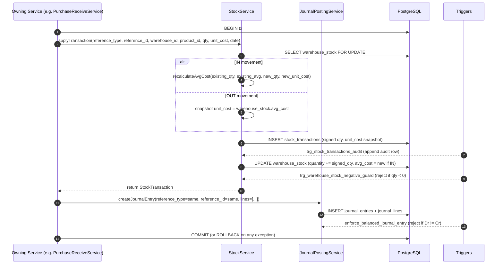

# Inventory-to-GL — Stock Movement → Journal Posting Map (Phase 20)

> **Module:** Workflows / Cross-Cutting (Inventory → Accounting)
> **Audience:** Engineers, AI assistants, accountants, auditors, warehouse staff
> **Status:** Draft — pending accountant review. **SAFETY-CRITICAL** because every stock
> movement either (a) directly posts to the GL via a `postXxxGL()` method, or (b) implicitly
> links to the GL via `(reference_type, reference_id)` on `stock_transactions` matching the
> same keys on `journal_entries`. Errors here corrupt both the stock sub-ledger AND the GL,
> and they propagate to COGS in order-to-cash and AP/AR sub-ledger reconciliation.
> **Last reviewed:** Phase 20 (initial creation)
> **Source of truth:** This file is the canonical stock-movement → GL map. Per-step detail
> lives in:
> - [`../inventory/stock-ledger.md`](../inventory/stock-ledger.md) — the `stock_transactions`
>   reference-type matrix and canonical writer/reversal,
> - [`../inventory/stock-costing.md`](../inventory/stock-costing.md) — moving-average cost derivation,
> - [`../inventory/warehouse-stock.md`](../inventory/warehouse-stock.md) — per-warehouse quantities,
> - [`../inventory/stock-adjustment.md`](../inventory/stock-adjustment.md),
>   [`../inventory/stock-take.md`](../inventory/stock-take.md), [`../inventory/damage.md`](../inventory/damage.md),
>   [`../inventory/warehouse-transfer.md`](../inventory/warehouse-transfer.md),
> - [`../accounting/journal-posting-rules.md`](../accounting/journal-posting-rules.md) §7.6 — master Dr/Cr matrix.

---

## 1. What is it?

This file is the **single canonical map** between every stock movement in the ERP and the
journal entry it posts (or does NOT post) to the General Ledger. RC_ERP has ~14 distinct
stock movement types, each identified by a `reference_type` value on the
`stock_transactions` row. The corresponding GL posting is identified by the same
`(reference_type, reference_id)` pair on `journal_entries`.

The map exists because the linkage is **NOT 1:1** — some movements post one journal entry,
some post two (intercompany), some post zero (cart, reservation, draft state), and some
post conditionally (only if `total_amount > 0.01`, or only if `restock=true`).

### 1.1 The two linkage layers

1. **Explicit GL post** — the owning service calls `JournalPostingService::createJournalEntry()`
   with `reference_type` and `reference_id` matching the stock transaction. This is the
   primary path.
2. **Implicit GL link** — even when no journal entry is posted (e.g. a draft-state cart),
   the `stock_transactions` row carries `(reference_type, reference_id)` so an auditor can
   trace any stock movement back to its source document and (if posted) to its GL entry via
   a JOIN on those two columns.

### 1.2 The 14 reference_type values

The DB CHECK constraint on `stock_transactions.reference_type` lists 11 values; the
`StockTransaction` model defines 14 (the extra 3 are reversal variants — see
[`../inventory/stock-ledger.md`](../inventory/stock-ledger.md) §7.2). They are:

| # | reference_type | Direction | Posts GL? | GL method | Source |
|---|---|---|---|---|---|
| 1 | `opening_balance` | IN | Yes | (manual JE) | Phase 0 ETL seed |
| 2 | `purchase_receive` | IN | Yes | `postReceiveGL` | P2P §11.2 |
| 3 | `purchase_return` | OUT | Yes | `postReturnGL` | P2P §11.3 |
| 4 | `sales_invoice` | OUT | Yes (revenue side) | `postInvoiceGL` | O2C §11.2 |
| 5 | `sales_challan` | OUT | Yes (COGS side) | `postCogsGL` | O2C §11.3 |
| 6 | `sales_return` | IN (if restock) | Yes (two entries) | `postRevenueReversalGL` + `postCogsReversalGL` | O2C §11.5 |
| 7 | `stock_adjustment` | ± (increase/decrease) | Yes | `postAdjustmentGL` | this file §11.3 |
| 8 | `stock_take` | ± (gain/loss/revaluation) | Yes | `postStockTakeGL` | this file §11.4 |
| 9 | `damage` | OUT | Yes | `postDamageGL` | this file §11.5 |
| 10 | `warehouse_transfer` | OUT + IN (pair) | Yes (same-branch: no GL; cross-branch: 2 JEs) | `postIntercompanyGL` (cross-branch only) | this file §11.6 |
| 11 | `branch_demand` | OUT + IN (pair) | Yes (two JEs — intercompany) | `postDemandFulfillmentJournals` | this file §11.7 |
| 12 | `purchase_receive_reversal` | OUT (counter) | Yes | `postReceiveGL` (counter) | P2P §11.5 |
| 13 | `sales_invoice_reversal` | IN (counter) | Yes | `postInvoiceGL` (counter) | O2C §11.6 |
| 14 | `sales_challan_reversal` | IN (counter) | Yes | `postCogsGL` (counter) | O2C §11.6 |

> **Note:** `opening_balance` posts are made via a manual `JournalPostingService::createJournalEntry()`
> call during the Phase 0 ETL seed, with `reference_type='opening_balance'`. They are not
> driven by a per-movement service method.

---

## 2. Why does it exist?

- **Sub-ledger reconciliation.** The `inventory` ledger in the GL MUST always equal the sum
  of `warehouse_stock.quantity × warehouse_stock.avg_cost` across all warehouses. The
  `stock:reconcile-drift` artisan command verifies this daily. This file documents which
  movements post (and which don't) so the reconciliation logic can be reasoned about.
- **COGS integrity.** The COGS posted on a sales challan MUST equal the avg_cost snapshot
  at challan time. The COGS reversal on a sales return MUST equal the ORIGINAL avg_cost
  snapshot. This file makes both snapshots explicit.
- **Intercompany symmetry.** Cross-branch transfers and branch demands post TWO journal
  entries — one per branch — that MUST be mirror images (Dr/Cr swapped). This file
  documents the symmetry so an auditor can verify it.
- **Reversal traceability.** Every reversal movement (`purchase_receive_reversal`,
  `sales_invoice_reversal`, `sales_challan_reversal`) carries `reference_id` pointing to
  the ORIGINAL movement, plus a `reversal_of` column on the counter `journal_entries` row.
  This file is the canonical list of reversal pairs.
- **Period-close cutoff.** At period close, the accountant must verify that all stock
  movements dated in the closing period have matching GL entries. This file is the lookup
  table for that verification.

---

## 3. When is it used?

- **Continuous.** Every stock movement in the ERP goes through `StockService::applyTransaction()`,
  which writes the `stock_transactions` row. The owning service (purchase/sales/inventory)
  then decides whether to post a journal entry.
- **Daily drift check.** The cron `stock:reconcile-drift` (03:00) verifies that the sum of
  `stock_transactions` matches `warehouse_stock` and that the GL `inventory` ledger matches
  the stock sub-ledger.
- **Period close.** At month/year-end, the accountant runs `subledger:reconcile-inventory`
  to confirm the linkage documented in this file holds for the closing period.
- **Audit.** An auditor tracing a stock movement to its GL entry (or vice versa) uses the
  `(reference_type, reference_id)` JOIN documented here.

---

## 4. Who uses it?

| Role | Use |
|---|---|
| `warehouse_staff` / `warehouse_manager` | Triggers movements (GRN confirm, dispatch, adjustment, take, damage, transfer) |
| `accountant` / `admin` | Verifies GL postings, runs reconciliation commands |
| `auditor` (read-only) | Traces movements → GL using `(reference_type, reference_id)` JOIN |
| `superadmin` | Period-close cutoff verification |
| AI assistant | Uses this file as the canonical lookup to answer "does movement X post to GL?" |

---

## 5. Related modules

- **Architecture:** [`../architecture/layered-design.md`](../architecture/layered-design.md), [`../architecture/branch-isolation-rls.md`](../architecture/branch-isolation-rls.md)
- **Database:** [`../database/schema-overview.md`](../database/schema-overview.md), [`../database/er-diagrams.md`](../database/er-diagrams.md) §Stock domain, [`../database/triggers-views-constraints.md`](../database/triggers-views-constraints.md)
- **Accounting:** [`../accounting/journal-posting-rules.md`](../accounting/journal-posting-rules.md), [`../accounting/subledger-reconciliation.md`](../accounting/subledger-reconciliation.md), [`../accounting/reversal-vs-cancellation.md`](../accounting/reversal-vs-cancellation.md), [`../accounting/running-balance.md`](../accounting/running-balance.md)
- **Inventory:** [`../inventory/stock-ledger.md`](../inventory/stock-ledger.md), [`../inventory/stock-costing.md`](../inventory/stock-costing.md), [`../inventory/warehouse-stock.md`](../inventory/warehouse-stock.md), [`../inventory/stock-adjustment.md`](../inventory/stock-adjustment.md), [`../inventory/stock-take.md`](../inventory/stock-take.md), [`../inventory/damage.md`](../inventory/damage.md), [`../inventory/warehouse-transfer.md`](../inventory/warehouse-transfer.md), [`../inventory/uom-conversion.md`](../inventory/uom-conversion.md), [`../inventory/stock-verification.md`](../inventory/stock-verification.md)
- **Finance:** [`../finance/branch-demand.md`](../finance/branch-demand.md), [`../finance/consolidation-intercompany.md`](../finance/consolidation-intercompany.md)
- **Workflows:** [`./procure-to-pay.md`](./procure-to-pay.md), [`./order-to-cash.md`](./order-to-cash.md), [`./period-close-workflow.md`](./period-close-workflow.md)

---

## 6. Business rules (the Core Rules)

### 6.1 Every stock movement writes a `stock_transactions` row

Every IN/OUT movement MUST go through `StockService::applyTransaction()`, which writes one
row to `stock_transactions` (partitioned by `transaction_date`) with:
- `reference_type` (one of the 14 values in §1.2)
- `reference_id` (the FK to the source document — `purchase_receives.id`, `sales_invoices.id`, etc.)
- `warehouse_id`, `product_id`
- `quantity` (signed: positive for IN, negative for OUT)
- `unit_cost` (snapshot of avg_cost at movement time — used by reversals)
- `transaction_date`
- `branch_id` (set by `BranchScope`)

The row is the **immutable source of truth** for the movement. It is never UPDATEd or
DELETEd. Corrections are made by writing a counter row via `reverseTransaction()`.

### 6.2 `warehouse_stock` is the materialized view of `stock_transactions`

The `warehouse_stock` row (one per `(warehouse_id, product_id)` pair) is updated by
`StockService::applyTransaction()` on every movement. It maintains:
- `quantity` (running sum)
- `avg_cost` (moving average — recalculated on every IN, unchanged on OUT)
- `reserved_quantity` (for sales-cart reservations — not yet a GL event)

The `trg_warehouse_stock_negative_guard` BEFORE UPDATE trigger rejects any OUT movement
that would push `quantity < 0`. There is NO override.

### 6.3 GL posts are decided by the owning service, not by `StockService`

`StockService::applyTransaction()` does NOT call `JournalPostingService`. The owning
service (e.g. `PurchaseReceiveService::confirm()`) decides whether to post a GL entry
after the stock_transaction row is written. This separation is deliberate — it lets the
owning service control the GL `reference_type`, `memo`, and posting date.

### 6.4 GL posts use the SAME `(reference_type, reference_id)` as the stock movement

When `PurchaseReceiveService::confirm()` calls `JournalPostingService::createJournalEntry()`
with `reference_type='purchase_receive', reference_id=$receive->id`, those values MUST
match the `stock_transactions` rows for the same GRN. This is the JOIN key for audit and
reconciliation.

### 6.5 IN movements recalculate avg_cost; OUT movements do not

`StockService::recalculateAvgCost()` is called on every IN movement (purchase_receive,
sales_return with restock, stock_adjustment increase, stock_take gain). It is NEVER called
on OUT movements (sales_invoice, sales_challan, damage, stock_adjustment decrease,
stock_take loss). OUT movements consume the existing avg_cost without changing it.

### 6.6 OUT movements snapshot `unit_cost` from `warehouse_stock.avg_cost`

On every OUT movement, `StockService::applyTransaction()` reads
`warehouse_stock.avg_cost` at that instant and writes it to
`stock_transactions.unit_cost`. This snapshot is used by:
- The COGS calculation in `SalesChallanService::postCogsGL()` (Σ qty × unit_cost)
- The COGS reversal in `SalesReturnService::postCogsReversalGL()` (uses ORIGINAL unit_cost)

### 6.7 Reversals use the ORIGINAL `unit_cost` snapshot

When `reverseTransaction()` writes a counter movement (e.g.
`reference_type='purchase_receive_reversal'`), it copies the `unit_cost` from the ORIGINAL
`stock_transactions` row — NOT the current `warehouse_stock.avg_cost`. This ensures the
GL reversal matches the original GL post exactly.

### 6.8 Intercompany movements post TWO journal entries

Cross-branch warehouse transfers and branch demands post TWO journal entries — one per
branch — that are mirror images:
- Creditor branch: Dr `interbranch_receivable` / Cr `inventory`
- Debtor branch: Dr `inventory` / Cr `interbranch_payable`

Same-branch warehouse transfers post ZERO journal entries (the stock moves between
warehouses in the same branch, but the GL `inventory` balance is unchanged).

### 6.9 Some movements post conditionally

- `stock_adjustment` posts only if `total_amount >= 0.01` (rounding tolerance).
- `sales_return` posts COGS reversal only if `restock=true` (otherwise the inventory debit
  is replaced by `damage_loss`).
- `damage` posts `postEmployeeRecovery` only if an employee is held accountable
  (`recovery_employee_id` is set).
- `warehouse_transfer` posts GL only if cross-branch (`from_branch_id != to_branch_id`).

### 6.10 Period gate

Every GL post goes through `validatePeriod()`. Same as P2P §6.5 / O2C §6.5.

### 6.11 Branch isolation

Every `stock_transactions` and `warehouse_stock` row carries `branch_id`. RLS policies on
both tables enforce `current_setting('app.branch_id') = branch_id`. A user in Branch A
cannot see or write Branch B's stock.

### 6.12 Audit trail

Every `stock_transactions` INSERT fires `trg_stock_transactions_audit` which writes an
append-only row to `stock_transactions_audit` (with `before`/`after` JSON). The
`AuditableMasterData` trait on `StockTransaction` also writes to `audit_trails`.

---

## 7. Technical implementation

### 7.1 The canonical writer — `StockService::applyTransaction()`

`laravel/app/Services/Stock/StockService.php:58`:

```php
public function applyTransaction(array $data): StockTransaction
{
    // Validate: reference_type in CHECK list, quantity != 0, warehouse+product exist
    // Read warehouse_stock row (lockForUpdate to prevent concurrent write)
    // For IN movements: recalculateAvgCost()
    // For OUT movements: snapshot unit_cost = warehouse_stock.avg_cost
    // INSERT stock_transactions row (signed quantity)
    // UPDATE warehouse_stock (quantity += signed_qty, avg_cost = new_avg_cost if IN)
    // (trg_warehouse_stock_negative_guard fires on UPDATE — rejects if quantity < 0)
    // (trg_stock_transactions_audit fires AFTER INSERT)
    // Return the StockTransaction model
}
```

### 7.2 The canonical reversal — `StockService::reverseTransaction()`

`laravel/app/Services/Stock/StockService.php:194`:

```php
public function reverseTransaction(StockTransaction $original, string $reversalReferenceType): StockTransaction
{
    // Read original.unit_cost (snapshot — used as the reversal's unit_cost)
    // Compute counter quantity = -original.quantity
    // Compute counter reference_type = $reversalReferenceType (e.g. 'purchase_receive_reversal')
    // SAME reference_id as original (so the JOIN still works)
    // Call applyTransaction() with the counter data
    // Return the counter StockTransaction
}
```

### 7.3 GL post call sites

Every `postXxxGL()` method lives in the owning service. They all call
`JournalPostingService::createJournalEntry()` with the matching `reference_type` and
`reference_id`. See §11 below for the per-movement Dr/Cr tables.

### 7.4 Service inventory (inventory-side touchpoints)

| Service | File | Role |
|---|---|---|
| `StockService` | `laravel/app/Services/Stock/StockService.php` | Canonical writer/reversal; `applyTransaction()`, `reverseTransaction()`, `recalculateAvgCost()` |
| `StockAdjustmentService` | `laravel/app/Services/Stock/StockAdjustmentService.php` | `postAdjustmentGL()` L836 |
| `StockTakeService` | `laravel/app/Services/Stock/StockTakeService.php` | `postStockTakeGL()` L2483 |
| `DamageService` | `laravel/app/Services/Stock/DamageService.php` | `postDamageGL()` L841; `postEmployeeRecovery()` L1114; `resolveLossLedgerId()` L921 |
| `WarehouseTransferService` | `laravel/app/Services/Stock/WarehouseTransferService.php` | `postIntercompanyGL()` L531 (cross-branch only) |
| `BranchIntercompanyService` | `laravel/app/Services/Finance/BranchIntercompanyService.php` | `postDemandFulfillmentJournals()` L76 |
| `JournalPostingService` | `laravel/app/Services/Accounting/JournalPostingService.php` | The only GL writer |
| `StockVerificationService` | `laravel/app/Services/Stock/StockVerificationService.php` | `stock:replay-verify`, `stock:reconcile-drift` |

### 7.5 Models

| Model | File | Notes |
|---|---|---|
| `StockTransaction` | `laravel/app/Models/StockTransaction.php` | Partitioned by `transaction_date`; 14 reference_type values; `BranchScope` |
| `WarehouseStock` | `laravel/app/Models/WarehouseStock.php` | Materialized view of stock_transactions; `lockForUpdate` on every write |
| `StockAdjustment` | `laravel/app/Models/StockAdjustment.php` | `ledgerReferenceType()` |
| `StockTakeSession` | `laravel/app/Models/StockTakeSession.php` | `status` state machine; approval gate |
| `DamageInvoice` | `laravel/app/Models/DamageInvoice.php` | `status` state machine; approval gate |
| `WarehouseTransfer` | `laravel/app/Models/WarehouseTransfer.php` | `from_warehouse_id`, `to_warehouse_id` |
| `BranchDemand` | `laravel/app/Models/BranchDemand.php` | Inter-branch requisition |

### 7.6 Triggers fired on stock movements

| Trigger | Table | Purpose |
|---|---|---|
| `trg_stock_transactions_audit` | `stock_transactions` AFTER INSERT/UPDATE/DELETE | Append-only audit row in `stock_transactions_audit` |
| `trg_warehouse_stock_negative_guard` | `warehouse_stock` BEFORE UPDATE | Reject `quantity < 0` |
| `trg_warehouse_stock_overallocation_guard` | `warehouse_stock` BEFORE UPDATE | Reject `reserved > available` |
| `enforce_balanced_journal_entry()` | `journal_entries` BEFORE INSERT/UPDATE | Dr=Cr enforcement on the linked GL post |
| RLS policies | `stock_transactions`, `warehouse_stock` | `current_setting('app.branch_id') = branch_id` |

---

## 8. Important database tables

| Table | Schema | Purpose | Key columns |
|---|---|---|---|
| `stock_transactions` | `03_stock.sql` (partitioned by `transaction_date`) | The stock ledger | `id, reference_type, reference_id, warehouse_id, product_id, quantity, unit_cost, transaction_date, branch_id` |
| `stock_transactions_audit` | `03_stock.sql` | Append-only audit | `stock_transaction_id, action, before, after, user_id` |
| `warehouse_stock` | `03_stock.sql` | Per-warehouse quantities | `warehouse_id, product_id, quantity, avg_cost, reserved_quantity, branch_id` |
| `stock_adjustments` | `03_stock.sql` | Adjustment header | `id, branch_id, warehouse_id, type (increase/decrease), total_amount, status, approval_state` |
| `stock_adjustment_items` | `03_stock.sql` | Adjustment lines | `adjustment_id, product_id, quantity, unit_cost` |
| `stock_take_sessions` | `03_stock.sql` | Stock-take header | `id, branch_id, warehouse_id, status, freeze_at` |
| `stock_take_items` | `03_stock.sql` | Counted vs system qty | `session_id, product_id, counted_qty, system_qty, variance_qty` |
| `damage_invoices` | `03_stock.sql` | Damage header | `id, branch_id, damage_code, type, total_amount, status, recovery_employee_id` |
| `damage_invoice_items` | `03_stock.sql` | Damage lines | `damage_id, product_id, quantity, unit_cost` |
| `warehouse_transfers` | `03_stock.sql` | Transfer header | `id, from_warehouse_id, to_warehouse_id, status, total_amount` |
| `warehouse_transfer_items` | `03_stock.sql` | Transfer lines | `transfer_id, product_id, quantity, unit_cost` |
| `branch_demands` | (migration-added) | Inter-branch requisition | `id, from_branch_id, to_branch_id, status` |
| `journal_entries` | `02_accounting.sql` (partitioned) | GL header | `id, reference_type, reference_id, branch_id, entry_date, source, reversal_of` |
| `journal_lines` | `02_accounting.sql` (partitioned) | GL lines | `entry_id, ledger_id, debit, credit, entity_type, entity_id` |

See [`../database/er-diagrams.md`](../database/er-diagrams.md) §Stock domain.

---

## 9. Related services

See §7.4.

---

## 10. Related models

See §7.5.

---

## 11. Important workflows

### 11.1 The canonical apply-then-post flow



### 11.2 Stock movement → GL posting — the master map

| reference_type | Direction | GL post? | Method | Dr | Cr | Amount basis |
|---|---|---|---|---|---|---|
| `opening_balance` | IN | Yes (manual) | (seed script) | Inventory | Opening Balance Equity | qty × seed_cost |
| `purchase_receive` | IN | Yes | `postReceiveGL` | Inventory | AP | Σ(qty × unit_cost) = total_amount |
| `purchase_return` | OUT | Yes | `postReturnGL` | AP | Inventory | Σ(qty × unit_cost) = total_amount |
| `purchase_receive_reversal` | OUT (counter) | Yes | `postReceiveGL` (counter) | AP | Inventory | same as original |
| `sales_invoice` | OUT | Yes (revenue side) | `postInvoiceGL` | AR | Sales Revenue (+ Cr Transport Revenue, Dr Sales Discount) | sub_total / discount / transport |
| `sales_challan` | OUT | Yes (COGS side) | `postCogsGL` | COGS | Inventory | Σ(qty × avg_cost_snapshot) |
| `sales_return` | IN (if restock) | Yes (two entries) | `postRevenueReversalGL` + `postCogsReversalGL` | (A) Sales Return / Cr AR; (B) Inventory / Cr COGS | (A) AR; (B) COGS | (A) Σ(qty × sales_rate); (B) Σ(qty × ORIGINAL avg_cost) |
| `sales_invoice_reversal` | IN (counter) | Yes | `postInvoiceGL` (counter) | Sales Revenue (+ Transport Revenue) / Cr Sales Discount | AR | same as original |
| `sales_challan_reversal` | IN (counter) | Yes | `postCogsGL` (counter) | Inventory | COGS | same as original |
| `stock_adjustment` (increase) | IN | Yes (if ≥0.01) | `postAdjustmentGL` | Inventory | Inventory Surplus | Σ(qty × avg_cost) |
| `stock_adjustment` (decrease) | OUT | Yes (if ≥0.01) | `postAdjustmentGL` | Inventory Shrinkage | Inventory | Σ(qty × avg_cost) |
| `stock_take` (gain) | IN | Yes | `postStockTakeGL` | Inventory | Inventory Surplus | Σ(variance_qty × avg_cost) |
| `stock_take` (loss) | OUT | Yes | `postStockTakeGL` | Inventory Shrinkage | Inventory | Σ(variance_qty × avg_cost) |
| `stock_take` (revaluation) | ± | Yes | `postStockTakeGL` | Inventory / Cr Inventory Revaluation (or reverse) | (mirror) | (qty × cost_drift) |
| `damage` | OUT | Yes | `postDamageGL` | Damage Loss (or Inventory Shrinkage by type) | Inventory | Σ(qty × avg_cost) |
| `damage` (employee recovery) | — | Yes (additional) | `postEmployeeRecovery` | Employee Payable | Damage Loss | recovery_amount |
| `warehouse_transfer` (same-branch) | OUT + IN | **No** | (none) | — | — | (stock moves, GL unchanged) |
| `warehouse_transfer` (cross-branch) | OUT + IN | Yes (two JEs) | `postIntercompanyGL` | (From-branch) interbranch_payable / Cr Inventory; (To-branch) Inventory / Cr interbranch_receivable | (mirror) | Σ(qty × avg_cost) |
| `branch_demand` (fulfillment) | OUT + IN | Yes (two JEs) | `postDemandFulfillmentJournals` | (Creditor branch) interbranch_receivable / Cr Inventory; (Debtor branch) Inventory / Cr interbranch_payable | (mirror) | Σ(qty × avg_cost) |

### 11.3 Stock adjustment confirm — Dr/Cr posting table

`StockAdjustmentService::postAdjustmentGL()` L836-903 — type-aware:

**Increase variant:**

| # | Account | Ledger nature | Debit | Credit |
|---|---|---|---|---|
| 1 | Inventory | `inventory` | `total_amount` | 0 |
| 2 | Inventory Surplus | `inventory_surplus` | 0 | `total_amount` |
| | | **Total** | **T** | **T** | Dr = Cr ✓ |

**Decrease variant:**

| # | Account | Ledger nature | Debit | Credit |
|---|---|---|---|---|
| 1 | Inventory Shrinkage | `inventory_shrinkage` | `total_amount` | 0 |
| 2 | Inventory | `inventory` | 0 | `total_amount` |
| | | **Total** | **T** | **T** | Dr = Cr ✓ |

`reference_type` = `stock_adjustment` · `reference_id` = `$adjustment->id` · `source` = `stock_adjustment`.

### 11.4 Stock-take confirm — Dr/Cr posting table

`StockTakeService::postStockTakeGL()` L2483 — three variants based on variance:

**Gain (counted > system):**

| # | Account | Ledger nature | Debit | Credit |
|---|---|---|---|---|
| 1 | Inventory | `inventory` | Σ(variance_qty × avg_cost) | 0 |
| 2 | Inventory Surplus | `inventory_surplus` | 0 | same |
| | | **Total** | **T** | **T** | Dr = Cr ✓ |

**Loss (counted < system):**

| # | Account | Ledger nature | Debit | Credit |
|---|---|---|---|---|
| 1 | Inventory Shrinkage | `inventory_shrinkage` | Σ(variance_qty × avg_cost) | 0 |
| 2 | Inventory | `inventory` | 0 | same |
| | | **Total** | **T** | **T** | Dr = Cr ✓ |

**Revaluation (cost drift, Phase 9):**

| # | Account | Ledger nature | Debit | Credit |
|---|---|---|---|---|
| 1 | Inventory (or Inventory Revaluation) | `inventory` / `inventory_revaluation` | Σ(qty × cost_drift) (if ↑) | 0 (if ↑) |
| 2 | Inventory Revaluation (or Inventory) | `inventory_revaluation` / `inventory` | 0 (if ↑) | Σ(qty × cost_drift) (if ↑) |
| | | **Total** | **T** | **T** | Dr = Cr ✓ |

`reference_type` = `stock_take` · `source` = `stock_take`.

### 11.5 Damage confirm — Dr/Cr posting table

`DamageService::postDamageGL()` L841-905:

| # | Account | Ledger nature | Debit | Credit |
|---|---|---|---|---|
| 1 | Damage Loss (or Inventory Shrinkage by type) | `damage_loss` / `inventory_shrinkage` | Σ(qty × avg_cost) | 0 |
| 2 | Inventory | `inventory` | 0 | Σ(qty × avg_cost) |
| | | **Total** | **T** | **T** | Dr = Cr ✓ |

**Type-aware loss ledger** (`resolveLossLedgerId()` L921-945):

| Damage type | Loss ledger nature |
|---|---|
| `missing`, `theft` | `inventory_shrinkage` |
| `real_damage`, `quality_reject`, `customer_return`, `other` | `damage_loss` (fallback: `inventory_shrinkage`) |

**Employee recovery (additional entry, if `recovery_employee_id` set):**

| # | Account | Ledger nature | Debit | Credit |
|---|---|---|---|---|
| 1 | Employee Payable | `employee_payable` | `recovery_amount` | 0 |
| 2 | Damage Loss | `damage_loss` | 0 | `recovery_amount` |
| | | **Total** | **T** | **T** | Dr = Cr ✓ |

`reference_type` = `damage` · `source` = `damage`.

### 11.6 Warehouse transfer confirm — Dr/Cr posting

`WarehouseTransferService::postIntercompanyGL()` L531 — **cross-branch only**:

**Creditor branch (from-branch — ships stock out):**

| # | Account | Ledger nature | Debit | Credit |
|---|---|---|---|---|
| 1 | Interbranch Payable | `interbranch_payable` | Σ(qty × avg_cost) | 0 |
| 2 | Inventory | `inventory` | 0 | Σ(qty × avg_cost) |
| | | **Total** | **T** | **T** | Dr = Cr ✓ |

**Debtor branch (to-branch — receives stock):**

| # | Account | Ledger nature | Debit | Credit |
|---|---|---|---|---|
| 1 | Inventory | `inventory` | Σ(qty × avg_cost) | 0 |
| 2 | Interbranch Receivable | `interbranch_receivable` | 0 | Σ(qty × avg_cost) |
| | | **Total** | **T** | **T** | Dr = Cr ✓ |

`reference_type` = `warehouse_transfer` · `source` = `warehouse_transfer`.

> **Note:** Same-branch warehouse transfers post ZERO journal entries. The two
> `stock_transactions` rows (OUT from source warehouse, IN to dest warehouse) net to zero
> GL impact because both warehouses belong to the same `branch_id`.

### 11.7 Branch demand fulfillment — Dr/Cr posting

`BranchIntercompanyService::postDemandFulfillmentJournals()` L76 — TWO journal entries:

**Supplier branch (creditor — fulfills the demand):**

| # | Account | Ledger nature | Debit | Credit |
|---|---|---|---|---|
| 1 | Interbranch Receivable | `interbranch_receivable` | Σ(qty × avg_cost) | 0 |
| 2 | Inventory | `inventory` | 0 | Σ(qty × avg_cost) |
| | | **Total** | **T** | **T** | Dr = Cr ✓ |

**Requester branch (debtor — receives the stock):**

| # | Account | Ledger nature | Debit | Credit |
|---|---|---|---|---|
| 1 | Inventory | `inventory` | Σ(qty × avg_cost) | 0 |
| 2 | Interbranch Payable | `interbranch_payable` | 0 | Σ(qty × avg_cost) |
| | | **Total** | **T** | **T** | Dr = Cr ✓ |

`reference_type` = `branch_demand` · `source` = `branch_demand`.

### 11.8 Stock movement reversal — counter-GL post

When `StockService::reverseTransaction()` writes a counter `stock_transactions` row (with
`reference_type = '{original}_reversal'` and the SAME `reference_id`), the owning service
calls `JournalPostingService::createJournalEntry()` with:
- `reference_type = '{original}_reversal'`
- `reference_id` = SAME as original
- `reversal_of` = original `journal_entries.id`
- `skip_period_check = true` (reversals can post in a later period)
- Dr/Cr swapped from the original entry

This is the **reversal-over-mutation** rule (see
[`../accounting/reversal-vs-cancellation.md`](../accounting/reversal-vs-cancellation.md)).

---

## 12. Known edge cases

1. **Cross-branch warehouse transfer dead code.**
   `WarehouseTransferService::postIntercompanyGL()` L531-617 is **DEAD CODE** — the
   `confirm()` method does NOT call it (see
   [`../inventory/warehouse-transfer.md`](../inventory/warehouse-transfer.md) §7.3 + §8).
   Cross-branch transfers currently post stock movements but NO GL entries — known gap,
   must be activated before cross-branch transfers go live in production.
2. **Avg-cost rollback drift.** When a GRN is cancelled after intervening sales, the
   avg_cost rollback is NOT a simple inverse. See P2P §12.8.
3. **Sales return without restock.** The COGS reversal posts Dr Damage Loss / Cr COGS
   instead of Dr Inventory / Cr COGS. The `damage_loss` ledger is debited, NOT
   `inventory`. The stock_transaction row is NOT written (no IN movement).
4. **Stock-take revaluation with NULL avg_cost.** If `warehouse_stock.avg_cost` is NULL
   (legacy data), the revaluation posts a zero-amount entry. Known drift source.
5. **Damage with employee recovery.** The recovery_amount may differ from the
   damage_amount (partial recovery). The two entries post independently.
6. **Intercompany elimination at consolidation.** The two intercompany entries (§11.6,
   §11.7) are eliminated at consolidation run via `ConsolidationService::postEliminationEntry()`
   — see [`../finance/consolidation-intercompany.md`](../finance/consolidation-intercompany.md).
7. **Stock_adjustment below 0.01.** Rounded to zero — no GL post. The stock_transaction
   row is still written.
8. **Concurrent stock writes.** `StockService::applyTransaction()` uses
   `lockForUpdate()` on `warehouse_stock` to serialize concurrent writes per
   `(warehouse_id, product_id)` pair. Without this, two concurrent OUT movements could
   both pass the negative guard and then push `quantity < 0`.
9. **UoM conversion.** When stock is moved in a different UoM (e.g. box vs piece),
   `uom_conversions` is consulted to compute the effective quantity. The conversion
   factor is applied BEFORE writing the `stock_transactions` row — the row always stores
   the BASE UoM quantity. See [`../inventory/uom-conversion.md`](../inventory/uom-conversion.md).
10. **Warehouse freeze during stock-take.** When a stock-take session is in `counting`
    state, the warehouse is frozen — no IN/OUT movements allowed. The
    `trg_warehouse_freeze_guard` trigger rejects the movement. See
    [`../inventory/stock-take.md`](../inventory/stock-take.md).
11. **Reserved quantity vs available.** `warehouse_stock.reserved_quantity` is increased
    when a sales cart is created (not a GL event). It is decreased when the cart is
    converted to an invoice (which writes a real OUT `stock_transaction`). The
    `available_quantity = quantity − reserved_quantity` is what the cart-creation check
    uses.
12. **Negative-stock guard has NO override.** Unlike the period-close admin override, the
    negative-stock guard is absolute. Back-orders must use the cart-split workflow (see
    O2C §13.2).

---

## 13. Future improvements

1. **Activate cross-branch warehouse transfer GL.** Re-enable
   `postIntercompanyGL()` in `WarehouseTransferService::confirm()`.
2. **Avg-cost snapshot backfill.** One-time migration to populate NULL `unit_cost`
   snapshots on legacy `stock_transactions`.
3. **Stock-take revaluation on NULL avg_cost.** Reject the revaluation (or use a fallback
   cost) instead of posting a zero entry.
4. **Stock ledger → GL reconciliation view.** Create a materialized view
   `stock_gl_reconciliation` that JOINs `stock_transactions` to `journal_entries` on
   `(reference_type, reference_id)` and flags mismatches. Currently this is done by the
   `stock:reconcile-drift` command in PHP; a SQL MV would be faster.
5. **Reserved-quantity GL post.** Currently cart reservations are not a GL event. For
    stricter accounting, they could post a Dr Reserved Inventory / Cr Inventory memo
    entry. Out of current scope.
6. **Movement type extension.** Add `manufacturing_assembly` and `manufacturing_disassembly`
   reference_types when the manufacturing module is built (currently N/A — see
   [`../business/business-model.md`](../business/business-model.md)).

---

## 14. Verification commands

| Command | Verifies |
|---|---|
| `php artisan stock:replay-verify` | Replays all stock_transactions, confirms warehouse_stock matches |
| `php artisan stock:reconcile-drift` | Daily drift check between stock_transactions and warehouse_stock + GL |
| `php artisan subledger:reconcile-inventory --branch={id}` | Inventory sub-ledger (warehouse_stock × avg_cost) ties to GL `inventory` ledger |
| `php artisan journal:replay-verify` | Replays all journal entries, confirms Dr=Cr globally |
| `php artisan partition:verify-join` | Weekly partition-wise join correctness |
| `php artisan audit:reconstruct --model=StockTransaction --id={id}` | Full audit trail of a stock movement |

---

## 15. Cross-references

- **Master Dr/Cr matrix:** [`../accounting/journal-posting-rules.md`](../accounting/journal-posting-rules.md) §7.6
- **Stock ledger detail:** [`../inventory/stock-ledger.md`](../inventory/stock-ledger.md) §7.2 (reference_type matrix)
- **Stock costing:** [`../inventory/stock-costing.md`](../inventory/stock-costing.md)
- **P2P workflow:** [`./procure-to-pay.md`](./procure-to-pay.md) (purchase_receive, purchase_return)
- **O2C workflow:** [`./order-to-cash.md`](./order-to-cash.md) (sales_invoice, sales_challan, sales_return)
- **Period close:** [`./period-close-workflow.md`](./period-close-workflow.md) (cutoff verification)
- **Notifications:** [`./notification-workflow.md`](./notification-workflow.md) (stock-event fan-out)
- **Reversal rules:** [`../accounting/reversal-vs-cancellation.md`](../accounting/reversal-vs-cancellation.md)
- **Intercompany:** [`../finance/consolidation-intercompany.md`](../finance/consolidation-intercompany.md), [`../finance/branch-demand.md`](../finance/branch-demand.md)
