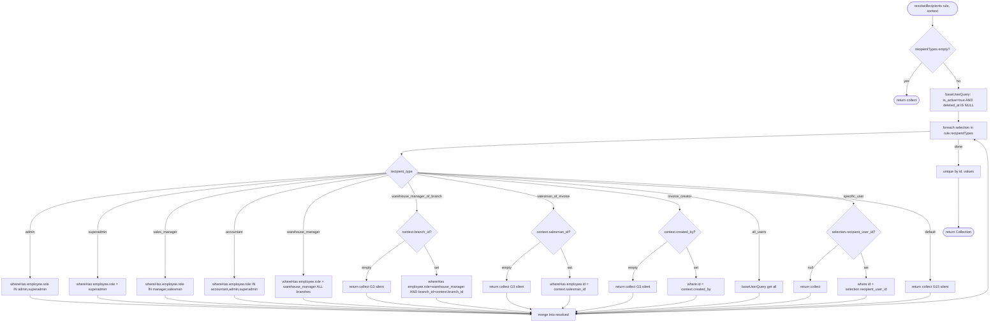
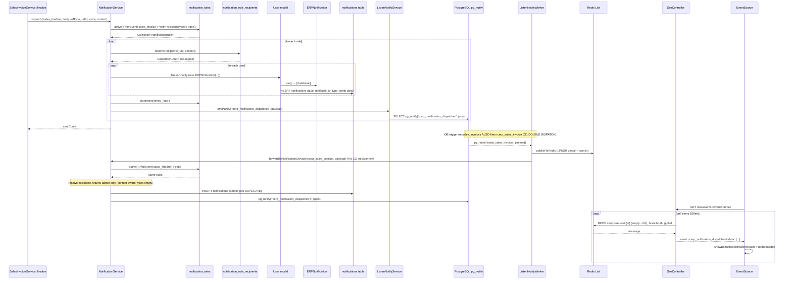
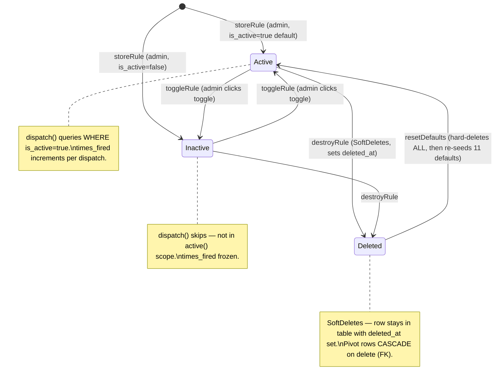
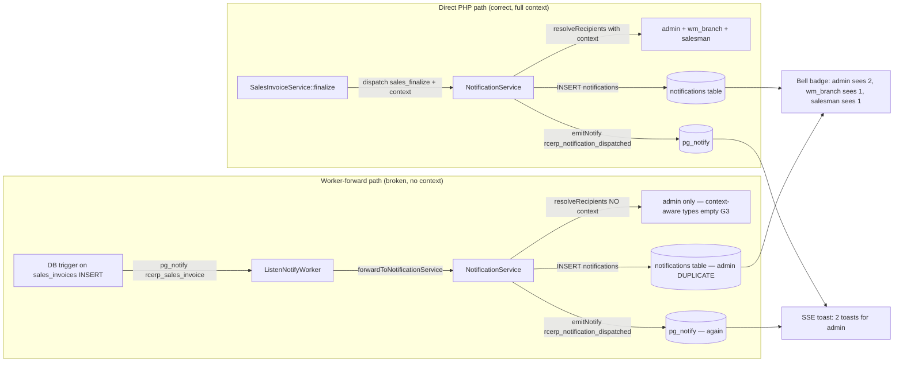
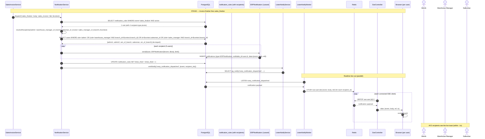

# Notification Workflow — Event → Rule → Recipient → Fan-out (Phase 15, enhanced Phase 20)

> **Module:** Workflows / Notification System
> **Audience:** Engineers, AI assistants, accountants, auditors, compliance officers, admins
> **Status:** Draft — pending review. **NOT SAFETY-CRITICAL** in the GL-posting sense (notifications
> do not post to the GL); but **business-critical** because they drive operational visibility
> (warehouse managers learn of new invoices, accountants learn of payments, submitters learn of
> approval decisions, admins learn of customer-limit increases). ~~**3 CRITICAL gaps** (G1
> double-dispatch, G2 wrong-event-on-update, G3 worker-forward-missing-context) mean the system
> is only partially production-ready — admins receive duplicate notifications while
> context-aware recipients (warehouse manager of branch, salesman of invoice) receive only the
> direct-call copy, and sales-return confirm/reverse fire spurious "return created" toasts.~~
> **WORKFLOWS-NOTIFICATION (commit `053609b`):** all 3 CRITICALs in this file resolved
> (G-076/G1, G-078/G2, G-079/G3) by disabling the worker-forward path. The rule-based
> notification system is now production-ready — direct PHP dispatch (with full $context)
> is the single dispatch path; the DB trigger → pg_notify → Redis → SSE path still
> powers real-time page refresh. Remaining HIGH/MEDIUM gaps (G4-G15) are non-blocking
> hardening items.
> **Last reviewed:** Phase 20 (cross-cutting enhancement appended §18) + WORKFLOWS-NOTIFICATION session
> **Source of truth:** This file is the canonical reference for the rule-based notification
> system. The implementation lives in:
> - `laravel/app/Services/Notification/NotificationService.php` (262L — the dispatcher crown jewel),
> - `laravel/app/Notifications/ERPNotification.php` (67L — the single notification class),
> - `laravel/app/Models/{NotificationRule,NotificationRuleRecipient}.php` (177L + 65L),
> - `laravel/app/Http/Controllers/Admin/NotificationController.php` (248L),
> - `laravel/database/migrations/{2025_01_06_000001_create_notification_tables,
>   2025_01_26_000001_notification_rules_multi_recipients,
>   2025_01_09_000003_seed_return_notification_rules}.php`,
> - `laravel/database/seeders/NotificationRuleSeeder.php` (158L),
> - `laravel/app/Providers/AppServiceProvider.php` L62-64 (the `view-notification-rules` Gate),
> - `laravel/routes/web.php` L1569-1596 (the `/admin/notifications/*` route group).
>
> The **realtime transport** (LISTEN/NOTIFY → worker → Redis → SSE → browser) that delivers
> the live toast is documented in the sibling file
> [`../architecture/realtime-events.md`](../architecture/realtime-events.md). This file covers
> only the rule-based layer on top: who gets notified, and why.

---

## 1. What is it?

The RC_ERP notification system is a **rule-based, DB-driven, multi-recipient dispatcher**
layered on top of Laravel's `Notification` framework. Business services call
`NotificationService::dispatch($event, $body, $referenceType, $referenceId, $extra, $context)`;
the service:

1. Looks up every **active `notification_rules`** row for that event (eager-loaded with
   its `notification_rule_recipients` pivot rows).
2. Resolves each recipient-type selection on the pivot to a set of users (de-duplicated
   by user ID) — see §9 for the 10 recipient types and their resolution logic.
3. Sends `ERPNotification` to each recipient via the **`database` channel only** (the
   bell icon's unread queue in the `notifications` table).
4. Increments each rule's `times_fired` counter.
5. Emits `pg_notify('rcerp_notification_dispatched', ...)` via
   `ListenNotifyService::emitNotify()` so the SSE pipeline shows a live toast.

There is **no `config/notification.php`** — rules are purely DB-driven. There is **no
`config/broadcasting.php`** — Telegram + FCM were removed 2026-07-22 (R24/R25 dropped);
Laravel-native DB notifications + LISTEN/NOTIFY + SSE are the replacement (see
`../PROJECT_OVERVIEW.md` §9).

### 1.1 Two delivery paths (and the G1/G2/G3 problem)

A notification can be triggered by **two paths**:

1. **Direct PHP dispatch** — the business service calls
   `NotificationService::dispatch(...)` directly (13 call sites across 8 files — see §10).
   This path passes the full `$context` array (branch_id, salesman_id, created_by, etc.),
   so context-aware recipient types (`warehouse_manager_of_branch`, `salesman_of_invoice`,
   `invoice_creator`) resolve correctly.
2. **Worker-forwarded dispatch** — a DB trigger on the corresponding table fires
   `pg_notify('rcerp_sales_invoice', ...)`; the `ListenNotifyWorker` picks it up and calls
   `ListenNotifyService::forwardToNotificationService()`, which calls
   `NotificationService::dispatch(...)` with the mapped event name. **G3:** this path
   omits the 6th `$context` argument, so context-aware recipient types silently resolve
   empty.

For 4 events (`sales_finalize`, `challan_create`, `payment_receive`, `return_created`),
**BOTH paths fire** — producing duplicate notifications to admins (the `admin` recipient
resolves on both paths) while context-aware recipients get only the direct-call copy. This
is **G1 (DOUBLE DISPATCH)**. For `sales_returns` UPDATE (confirm/reverse), the worker
forwards as `return_created` (the static `CHANNEL_EVENT_MAP` mapping) instead of
`return_confirmed`/`return_reversed` — a spurious "return created" toast fires alongside
the correct one. This is **G2 (WRONG EVENT FORWARDED on UPDATE)**.

The recommended fix (see §13 G1-G3) is to **remove the 5 `CHANNEL_EVENT_MAP` entries**
so the worker-forward path is disabled entirely — the DB trigger still fires `pg_notify`
for SSE refresh (`publishToRedis` is unaffected), but `forwardToNotificationService`
becomes a no-op. Direct PHP dispatch (which carries full `$context`) becomes the sole
notification trigger.

---

## 2. Why does it exist?

- **Operational visibility without polling.** When a salesperson finalizes an invoice,
  the warehouse manager should learn immediately; when a payment is received, the
  accountant should see a toast; when an approval is decided, the submitter should be
  notified. Polling every few seconds does not scale and feels slow.
- **Removed external dependencies.** Telegram alerts and Firebase FCM push were removed
  (R24/R25 dropped 2026-07-22 — see `../PROJECT_OVERVIEW.md` §9). Laravel-native DB
  notifications + LISTEN/NOTIFY + SSE cover the same use case without third-party
  services.
- **Decoupling business modules from delivery.** Business services call
  `dispatch($event, ...)` and don't need to know about SSE, Redis, or the bell UI. The
  notification service + the realtime pipeline handle delivery.
- **Configurable per-event recipient routing.** Admins can configure which roles/users
  get notified for which events via the `/admin/notifications/rules` UI (no code change
  required). Rules are DB-driven, multi-recipient (F-18b pivot), and toggle-able.

---

## 3. When is it used?

The system is **always on**. Every authenticated page renders the bell dropdown
(`components/erp/top-nav.blade.php` L100-143) and loads `notification.js` (L212). Every
qualifying business action triggers a `dispatch()` call.

### 3.1 The 13 active dispatch call sites + 5 worker-forwarded events

| # | File:line | Event | Path | Business context |
|---|---|---|---|---|
| 1 | `app/Services/Sales/SalesInvoiceService.php:335` | `sales_finalize` | Direct PHP | Sales invoice finalized (cart → draft → finalize) |
| 2 | `app/Services/Sales/SalesChallanService.php:524` | `challan_create` | Direct PHP | Sales challan issued (COGS posted) |
| 3 | `app/Services/Sales/CustomerPaymentService.php:219` | `payment_receive` | Direct PHP | Customer payment received (only `transactionType === 'receive'`) |
| 4 | `app/Services/Sales/SalesReturnService.php:145` | `return_created` | Direct PHP | Sales return created (draft) |
| 5 | `app/Services/Sales/SalesReturnService.php:260` | `return_confirmed` | Direct PHP | Sales return confirmed (stock IN + GL posted) |
| 6 | `app/Services/Sales/SalesReturnService.php:385` | `return_reversed` | Direct PHP | Sales return reversed (rollback) |
| 7 | `app/Services/Stock/DamageService.php:215` | `damage_invoice_created` | Direct PHP | Damage invoice created (skipped when `suppress_notification` set) |
| 8 | `app/Services/Stock/DamageService.php:611` | `damage_invoice_approved` (auto) | Direct PHP via `dispatchApprovalNotification` | Damage auto-approved (below threshold + admin/manager submitter) |
| 9 | `app/Services/Stock/DamageService.php:633` | `damage_invoice_submitted` | Direct PHP via `dispatchApprovalNotification` | Damage submitted for approval |
| 10 | `app/Services/Stock/DamageService.php:700` | `damage_invoice_approved` | Direct PHP via `dispatchApprovalNotification` | Damage approved (manual) |
| 11 | `app/Services/Stock/DamageService.php:767` | `damage_invoice_rejected` | Direct PHP via `dispatchApprovalNotification` | Damage rejected |
| 12 | `app/Services/Approval/ApprovalService.php:358` | `approval_request_submitted` OR `approval_request_next_level` | Direct PHP via `notifyApprovers` — **DEAD CODE (Phase 14 G4 / this doc G10)** | Approval submitted / advanced to next level |
| 13 | `app/Services/Approval/ApprovalService.php:394` | `approval_request_approved` OR `approval_request_rejected` | Direct PHP via `notifyRequester` — **DEAD CODE (Phase 14 G4 / this doc G10)** | Approval approved/rejected |
| 14 | `app/Http/Controllers/Auth/AuthenticatedSessionController.php:216` | `user_login` | Direct PHP | User login success |
| 15 | `app/Http/Controllers/Auth/AuthenticatedSessionController.php:271` | `user_logout` | Direct PHP | User logout |
| 16 | `app/Http/Controllers/Admin/CustomerController.php:706` | `customer_limit_increased` | Direct PHP via `app()` (G16 — not constructor DI) | Customer credit limit raised (only when `new > old`) |
| 17 | `app/Services/Notification/ListenNotifyService.php:187` (called from `ListenNotifyWorker.php:244`) | `sales_finalize` / `challan_create` / `return_created` / `payment_receive` / `system_policy_change` | Worker-forwarded (5 channels via `CHANNEL_EVENT_MAP`) | DB trigger fires on INSERT/UPDATE; worker forwards — **G1/G2/G3 problem** |

See §10 for the full call-site map with body templates + `$context` keys.

---

## 4. Who uses it?

| Role | How they interact |
|---|---|
| **Admin / superadmin** | Manage notification rules at `/admin/notifications/rules` (gated by `role:admin` middleware + `view-notification-rules` Gate). Create/toggle/delete rules, reset to defaults, view stats. |
| **All authenticated users** | See the bell dropdown (top-nav) with unread badge + last 5 notifications; mark individual/all as read; view full inbox at `/admin/notifications/inbox` (paginated 25). |
| **Recipients (resolved by role/branch/context)** | Receive `ERPNotification` rows in their `notifications` table (bell queue). Roles include admin, superadmin, sales_manager, accountant, warehouse_manager (all branches), warehouse_manager_of_branch (context-aware), salesman_of_invoice (context-aware), invoice_creator (context-aware), all_users, specific_user. |
| **Business services (system/automated)** | Call `NotificationService::dispatch(...)` from sales/challan/payment/return/damage/approval/login/logout/customer-limit code paths. |
| **The `ListenNotifyWorker` (system/automated)** | Forwards 5 DB-trigger channels to `dispatch()` (the G1/G2/G3 problem path). |

---

## 5. Related modules

- [`../architecture/realtime-events.md`](../architecture/realtime-events.md) — the realtime transport (LISTEN/NOTIFY → worker → Redis → SSE → browser) that delivers the live toast. This doc covers only the rule-based layer on top.
- [`../security/rbac-roles-permissions.md`](../security/rbac-roles-permissions.md) — the `view-notification-rules` Gate definition (`AppServiceProvider.php` L62-64) + the `role:admin` route middleware on rule CRUD.
- [`../security/audit-trails.md`](../security/audit-trails.md) — the `fn_financial_audit_trigger` gap on `notification_rules` + `notification_rule_recipients` (G6) — recurring cross-phase gap from Phase 9/10/11/12/13/14.
- [`../workflows/approval-workflow.md`](../workflows/approval-workflow.md) — G4 (Phase 14): the 4 `approval_request_*` events dispatched by `ApprovalService::notifyApprovers`/`notifyRequester` are NOT in `NotificationRule::EVENTS` (reaffirmed here as G10).
- [`../sales/sales-invoice.md`](../sales/sales-invoice.md) — the `sales_finalize` call site (`SalesInvoiceService.php:335`) + the G1 double-dispatch issue.
- [`../sales/sales-challan.md`](../sales/sales-challan.md) — the `challan_create` call site (`SalesChallanService.php:524`) + G1.
- [`../sales/sales-return.md`](../sales/sales-return.md) — the 3 `return_created`/`return_confirmed`/`return_reversed` call sites (`SalesReturnService.php:145, 260, 385`) + G1 + G2.
- [`../accounting/customer-payments.md`](../accounting/customer-payments.md) — the `payment_receive` call site (`CustomerPaymentService.php:219`) + G1.
- [`../inventory/damage.md`](../inventory/damage.md) — the 4 damage event call sites (`DamageService.php:215, 611, 633, 700, 767`) + G4 (3 `damage_invoice_*` approval events functionally dead — not in EVENTS).
- [`../finance/branch-demand.md`](../finance/branch-demand.md) — the `branch_demand_created` rule (seeder L99-103) that never fires because `BranchDemandService` doesn't call `dispatch()` — seeder comment is outdated.
- [`../security/system-policy-compliance.md`](../security/system-policy-compliance.md) — the `system_policy_change` event forwarded by `rcerp_system` DB trigger but NOT in EVENTS/EVENT_META (G4).
- [`../architecture/branch-isolation-rls.md`](../architecture/branch-isolation-rls.md) — the RLS gap on `notifications`/`notification_rules`/`notification_rule_recipients` (G5).

---

## 6. Business rules

The notification system enforces a set of non-negotiable rules, organized into 5
sub-tables.

### 6.1 Event dispatch rules

| # | Rule | Severity | Evidence |
|---|---|---|---|
| ED1 | Business services MUST dispatch notifications directly from PHP (via constructor-injected `NotificationService`), NOT rely on the worker-forward path for context-aware recipients. | MUST | G1/G3 — `ListenNotifyService::forwardToNotificationService` L187 omits `$context`; context-aware types resolve empty. |
| ED2 | Direct `dispatch()` calls MUST pass the full `$context` array (`branch_id`, `salesman_id`, `created_by`, `customer_id` as applicable) so context-aware recipient types resolve. | MUST | `NotificationService::resolveRecipients` L214-226 returns `collect()` for missing context keys. |
| ED3 | `dispatch()` calls MUST be wrapped in `try/catch` so a notification failure never rolls back the business transaction. | SHOULD | `SalesInvoiceService::finalize` L335 wraps in try/catch; `ApprovalService::notifyApprovers` L358 does not (but it's dead code anyway). |
| ED4 | The worker-forward path (`CHANNEL_EVENT_MAP`) MUST NOT be relied upon for correct notification semantics. It double-dispatches (G1), forwards the wrong event on UPDATE (G2), and omits `$context` (G3). | MUST NOT | §1.1 + G1/G2/G3. Recommended fix: remove the 5 entries (§13). |
| ED5 | `dispatch()` MUST silently return 0 when no active rules match the event (no exception, no log). | MUST (current behavior) | `NotificationService::dispatch` L91-93 `if ($rules->isEmpty()) return 0;`. This is why dead-config events (G4) are silent. |
| ED6 | `dispatch()` MUST emit `pg_notify('rcerp_notification_dispatched', ...)` after each rule fires so the SSE pipeline shows a live toast. | MUST | `NotificationService::dispatch` L143-169. |

### 6.2 Recipient resolution rules

| # | Rule | Severity | Evidence |
|---|---|---|---|
| RR1 | Recipients MUST be de-duplicated by user ID across all recipient-type selections on a rule. | MUST | `NotificationService::resolveRecipients` L242 `$resolved->unique('id')->values()`. |
| RR2 | Recipients MUST be filtered to active, non-deleted users (`is_active = true AND deleted_at IS NULL`). | MUST | `NotificationService::resolveRecipients` L195 `$baseUserQuery`. |
| RR3 | Context-aware recipient types (`warehouse_manager_of_branch`, `salesman_of_invoice`, `invoice_creator`) MUST silently return an empty collection when the matching `$context` key is missing — no log, no warning. | MUST (current behavior — G3) | `NotificationService::resolveRecipients` L214-226 `!empty($context['branch_id']) ? ... : collect()`. |
| RR4 | `salesman_of_invoice` resolves by **employee ID** (NOT user ID) — the `$context['salesman_id']` is the employee row ID, matched against `employees.id`. | MUST know | `NotificationService::resolveRecipients` L219 `whereHas('employee', fn($q) => $q->where('id', $context['salesman_id']))`. |
| RR5 | `invoice_creator` resolves by **user ID** — the `$context['created_by']` is the user row ID, matched against `users.id`. | MUST know | `NotificationService::resolveRecipients` L225 `where('id', $context['created_by'])`. |
| RR6 | `specific_user` resolves by the pivot row's `recipient_user_id` column (NOT a `$context` key). | MUST know | `NotificationService::resolveRecipients` L230 `$selection->recipient_user_id`. |

### 6.3 Rule management rules

| # | Rule | Severity | Evidence |
|---|---|---|---|
| RM1 | Rule CRUD MUST be gated by `role:admin` middleware + the `view-notification-rules` Gate. | MUST | `routes/web.php` L1577-1585 `Route::middleware('role:admin')`; `AppServiceProvider.php` L62-64 Gate::define. |
| RM2 | `storeRule` MUST validate `event ∈ NotificationRule::EVENTS` and `recipient_types ∈ NotificationRule::RECIPIENTS`. | MUST | `NotificationController.php` L66-76 inline validation. |
| RM3 | `storeRule` MUST require `recipient_user_id` when `specific_user` is among the selected recipient types. | MUST | `NotificationController.php` L82 returns `back()->with('error', ...)` if missing. |
| RM4 | `storeRule` MUST force `channel = 'database'` (the broadcast channel was removed in F-18b). | MUST | `NotificationController.php` L89 `'channel' => 'database'`. |
| RM5 | Deleting a rule MUST cascade-delete its pivot rows (via FK `cascadeOnDelete`). | MUST | Migration `2025_01_26_000001` L46 `->cascadeOnDelete()`. |
| RM6 | `resetDefaults` MUST hard-delete every rule (bypassing SoftDeletes) then re-seed the 11 defaults. | MUST | `NotificationController.php` L148-163 `DB::table('notification_rules')->delete()` + `app(NotificationRuleSeeder::class)->run()`. |
| RM7 | Rules use SoftDeletes — `destroyRule` sets `deleted_at`, does NOT hard-delete. | MUST know | `NotificationRule` model uses `SoftDeletes`; `NotificationController::destroyRule` L129-136 calls `->delete()`. |
| RM8 | There is NO `updateRule` method — rules can only be created/toggled/deleted, never edited (G8). | MUST know (gap) | `NotificationController.php` has no `updateRule`; `routes/web.php` has no `PUT/PATCH /admin/notifications/rules/{id}`. |

### 6.4 Channel rules

| # | Rule | Severity | Evidence |
|---|---|---|---|
| CR1 | The ONLY channel is `database` (in-app bell queue). Broadcast was removed in F-18b. | MUST | `NotificationRule::CHANNELS` L112-114 `['database' => 'Database (In-App)']`; `ERPNotification::via()` L47-50 returns `['database']`. |
| CR2 | `ERPNotification` implements `ShouldQueue` — notifications are queued (async via the Laravel queue worker). | MUST know | `ERPNotification.php` L25 `implements ShouldQueue`. |
| CR3 | Do NOT reintroduce Telegram or FCM channels. | MUST NOT | `../PROJECT_OVERVIEW.md` §9 (R24/R25 dropped 2026-07-22). |

### 6.5 Audit + immutability rules

| # | Rule | Severity | Evidence |
|---|---|---|---|
| AI1 | Rule config changes SHOULD be tamper-evident via `fn_financial_audit_trigger` — currently NOT attached (G6). | SHOULD (gap) | `2026_08_08_000002_create_financial_audit_log_table.php` L235-253 attaches to 10 financial tables, NOT notification tables. |
| AI2 | `notification_rules` + `notification_rule_recipients` SHOULD have RLS enabled — currently NOT (G5). | SHOULD (gap) | `2025_01_20_000007_add_rls_branch_isolation.php` L84-116 enables RLS on 22 tables, NOT notification tables. |
| AI3 | `notification_rules.created_by` SHOULD record the resetting admin's ID on `resetDefaults` — currently sets NULL (G18). | ✅ accepted as system-default semantic | NULL `created_by` is the documented "system default" signal for seeder-created rules (G18 resolved LOW-A). `NotificationRuleSeeder.php` L139 `'created_by' => null`. Admin-authored rules still record `auth()->id()` via `NotificationController::storeRule:92`. |
| AI4 | `times_fired` SHOULD increment atomically (SQL `UPDATE ... SET times_fired = times_fired + 1`) to avoid the race in G11. | SHOULD (gap) | `NotificationService::dispatch` L128 `$rule->increment('times_fired')` (Eloquent, not atomic SQL). |

---

## 7. Technical implementation

### 7.1 `NotificationService` — the dispatcher (crown jewel)

**File:** `laravel/app/Services/Notification/NotificationService.php` (262L)

#### Constructor (L34-36)

```php
public function __construct(
    private ?ListenNotifyService $listenNotify = null
) {}
```

`ListenNotifyService` is optional (nullable) so the service can be instantiated in
isolation (e.g. tests). When resolved via Laravel's container, it's injected.

#### `EVENT_META` constant (L44-66) — full table

Private. Maps every event key to its icon (Font Awesome), color (Bootstrap), and title.
Used by `dispatch()` to build the `ERPNotification` payload when no `$extra['title']` is
provided.

```php
private const EVENT_META = [
    'sales_finalize'            => ['icon' => 'fa-file-invoice-dollar', 'color' => 'success', 'title' => 'Sales Invoice Confirmed'],
    'challan_create'            => ['icon' => 'fa-truck', 'color' => 'info', 'title' => 'Challan Created'],
    'godown_create'             => ['icon' => 'fa-warehouse', 'color' => 'primary', 'title' => 'Godown Copy Created'],
    'payment_receive'           => ['icon' => 'fa-hand-holding-dollar', 'color' => 'success', 'title' => 'Payment Received'],
    'soft_delete'               => ['icon' => 'fa-trash', 'color' => 'warning', 'title' => 'Record Deleted'],
    'accounts_entry'            => ['icon' => 'fa-book', 'color' => 'primary', 'title' => 'Accounting Entry Posted'],
    'user_login'                => ['icon' => 'fa-user', 'color' => 'secondary', 'title' => 'User Login'],
    'user_logout'               => ['icon' => 'fa-right-from-bracket', 'color' => 'secondary', 'title' => 'User Logout'],
    'damage_invoice_created'    => ['icon' => 'fa-triangle-exclamation', 'color' => 'danger', 'title' => 'Damage Invoice Created'],
    'damage_invoice_submitted'  => ['icon' => 'fa-paper-plane',         'color' => 'warning', 'title' => 'Damage Submitted for Approval'],
    'damage_invoice_approved'   => ['icon' => 'fa-circle-check',        'color' => 'success', 'title' => 'Damage Approved'],
    'damage_invoice_rejected'   => ['icon' => 'fa-circle-xmark',        'color' => 'danger',  'title' => 'Damage Rejected'],
    'branch_demand_created'     => ['icon' => 'fa-clipboard-list', 'color' => 'info', 'title' => 'Branch Demand Created'],
    'customer_limit_increased'  => ['icon' => 'fa-arrow-up-right-dots', 'color' => 'success', 'title' => 'Customer Limit Increased'],
    'return_created'            => ['icon' => 'fa-arrow-rotate-left', 'color' => 'info', 'title' => 'Sales Return Created'],
    'return_confirmed'          => ['icon' => 'fa-check', 'color' => 'primary', 'title' => 'Sales Return Confirmed'],
    'return_reversed'           => ['icon' => 'fa-rotate-left', 'color' => 'danger', 'title' => 'Sales Return Reversed'],
];
```

> **Note:** `system_policy_change` is NOT in `EVENT_META` (G4 — it's forwarded by the
> worker but not declarable as a rule, so no metadata needed). The 4 `approval_request_*`
> events are also NOT here (Phase 14 G4 / this doc G10 — dead code).

#### `dispatch()` method (L85-173) — verbatim

```php
public function dispatch(string $event, string $body, ?string $referenceType = null, ?int $referenceId = null, array $extra = [], array $context = []): int
{
    // Find active rules for this event (eager-load recipient selections).
    $rules = NotificationRule::active()
        ->forEvent($event)
        ->with('recipientTypes')
        ->get();

    if ($rules->isEmpty()) {
        return 0;
    }

    $meta  = self::EVENT_META[$event] ?? ['icon' => 'fa-bell', 'color' => 'primary', 'title' => ucfirst(str_replace('_', ' ', $event))];
    $title = $extra['title'] ?? $meta['title'];

    $sentCount = 0;

    foreach ($rules as $rule) {
        $recipients = $this->resolveRecipients($rule, $context);

        if ($recipients->isEmpty()) {
            continue;
        }

        $channels = ['database'];

        foreach ($recipients as $user) {
            $user->notify(new ERPNotification(
                title: $title,
                body: $body,
                event: $event,
                referenceType: $referenceType,
                referenceId: $referenceId,
                icon: $meta['icon'],
                color: $meta['color'],
                channels: $channels,
            ));
            $sentCount++;
        }

        $rule->increment('times_fired');

        Log::info('Notification dispatched', [
            'rule_id'      => $rule->id,
            'rule_name'    => $rule->name,
            'event'        => $event,
            'recipients'   => $recipients->count(),
            'channels'     => $channels,
            'context_keys' => array_keys($context),
        ]);

        if ($this->listenNotify) {
            try {
                $this->listenNotify->emitNotify('rcerp_notification_dispatched', [
                    'table'     => 'notifications',
                    'action'    => 'INSERT',
                    'id'        => 0,
                    'branch_id' => $context['branch_id'] ?? $recipients->first()?->employee?->branch_id,
                    'changes'   => [
                        'event'           => $event,
                        'rule_id'         => $rule->id,
                        'rule_name'       => $rule->name,
                        'recipient_count' => $recipients->count(),
                        'title'           => $title,
                        'body'            => $body,
                        'reference_type'  => $referenceType,
                        'reference_id'    => $referenceId,
                        'icon'            => $meta['icon'],
                        'color'           => $meta['color'],
                    ],
                ]);
            } catch (\Throwable $e) {
                Log::warning('NotificationService: pg_notify emission failed', [
                    'event' => $event,
                    'error' => $e->getMessage(),
                ]);
            }
        }
    }

    return $sentCount;
}
```

**What `dispatch()` does (step by step):**
1. Finds all active `notification_rules` for that event (eager-loaded pivot).
2. If no rules: returns 0 silently (ED5).
3. Looks up `EVENT_META` for the event (falls back to a generic bell icon if not found).
4. For each rule: resolves recipients (de-duped by user ID). If empty, skips.
5. For each recipient: `$user->notify(new ERPNotification(...))` — writes a row to the
   `notifications` table via the `database` channel.
6. Increments `times_fired` (G11 race — not atomic).
7. Emits `pg_notify('rcerp_notification_dispatched', ...)` so the SSE pipeline shows a
   live toast (ED6). The payload includes `changes.title`, `changes.body`,
   `changes.event`, `changes.reference_type`, `changes.reference_id`, `changes.icon`,
   `changes.color` — consumed by `notification.js` L69-79.
8. Returns the total sent count.

#### `resolveRecipients()` method (L187-243) — verbatim, the recipient resolution crown jewel

```php
private function resolveRecipients(NotificationRule $rule, array $context = []): \Illuminate\Support\Collection
{
    if ($rule->recipientTypes->isEmpty()) {
        return collect();
    }

    $baseUserQuery = fn () => User::where('is_active', true)->whereNull('deleted_at');

    $resolved = collect();

    foreach ($rule->recipientTypes as $selection) {
        $users = match ($selection->recipient_type) {
            'admin'       => $baseUserQuery()->whereHas('employee', fn($q) => $q->whereIn('role', ['admin', 'superadmin']))->get(),
            'superadmin'  => $baseUserQuery()->whereHas('employee', fn($q) => $q->where('role', 'superadmin'))->get(),

            'sales_manager'     => $baseUserQuery()->whereHas('employee', fn($q) => $q->whereIn('role', ['manager', 'salesman']))->get(),
            'accountant'        => $baseUserQuery()->whereHas('employee', fn($q) => $q->whereIn('role', ['accountant', 'admin', 'superadmin']))->get(),

            'warehouse_manager' => $baseUserQuery()->whereHas('employee', fn($q) => $q->where('role', 'warehouse_manager'))->get(),

            'warehouse_manager_of_branch' => !empty($context['branch_id'])
                ? $baseUserQuery()->whereHas('employee', fn($q) => $q->where('role', 'warehouse_manager')->where('branch_id', $context['branch_id']))->get()
                : collect(),

            'salesman_of_invoice' => !empty($context['salesman_id'])
                ? $baseUserQuery()->whereHas('employee', fn($q) => $q->where('id', $context['salesman_id']))->get()
                : collect(),

            'invoice_creator' => !empty($context['created_by'])
                ? $baseUserQuery()->where('id', $context['created_by'])->get()
                : collect(),

            'all_users' => $baseUserQuery()->get(),

            'specific_user' => $selection->recipient_user_id
                ? $baseUserQuery()->where('id', $selection->recipient_user_id)->get()
                : collect(),

            default => collect(),
        };

        $resolved = $resolved->merge($users);
    }

    return $resolved->unique('id')->values();
}
```

See §9 for the full recipient-type catalogue with resolution logic + needs-context flags.

#### `getStats()` method (L250-261)

```php
public function getStats(): array
{
    return [
        'total_rules'         => NotificationRule::count(),
        'active_rules'        => NotificationRule::active()->count(),
        'total_sent'          => NotificationRule::sum('times_fired'),
        'total_notifications' => DB::table('notifications')->count(),
        'unread_notifications'=> DB::table('notifications')->whereNull('read_at')->count(),
        'rules_by_event'      => NotificationRule::select('event', DB::raw('COUNT(*) as count'), DB::raw('SUM(times_fired) as fired'))
            ->groupBy('event')->pluck('fired', 'event')->toArray(),
    ];
}
```

Used by `NotificationController::rules` to render the stats panel.

### 7.2 `ERPNotification` — the single notification class

**File:** `laravel/app/Notifications/ERPNotification.php` (67L)

```php
class ERPNotification extends Notification implements ShouldQueue
{
    use Queueable;

    public function __construct(
        public string $title,
        public string $body,
        public string $event,
        public ?string $referenceType = null,
        public ?int $referenceId = null,
        public string $icon = 'fa-bell',
        public string $color = 'primary',
        public array $channels = ['database'],
    ) {}

    public function via(object $notifiable): array
    {
        return ['database'];
    }

    public function toDatabase(object $notifiable): array
    {
        return [
            'title'          => $this->title,
            'body'           => $this->body,
            'event'          => $this->event,
            'reference_type' => $this->referenceType,
            'reference_id'   => $this->referenceId,
            'icon'           => $this->icon,
            'color'          => $this->color,
        ];
    }
}
```

- `via()` (L47-50): always `['database']` — broadcast channel removed in F-18b (CR1).
- `toDatabase()` (L55-66): 7-field payload stored in `notifications.data` JSONB column.
- Constructor (L29-38): 8 params; the `channels` param is accepted but ignored
  (backward-compat).
- `implements ShouldQueue` (L25) + `use Queueable` (L27) — notifications are queued
  (async via the Laravel queue worker, CR2).

### 7.3 `NotificationRule` — the rule model

**File:** `laravel/app/Models/NotificationRule.php` (177L)

#### `EVENTS` constant (L59-77) — full list

Public. The 14 administrable event keys (the dropdown in the rule UI). Admins can only
create rules for events in this list (RM2).

```php
public const EVENTS = [
    // — User's 9 predefined business events —
    'sales_finalize'            => 'After Sales Confirm',
    'challan_create'            => 'After Create Challan Copy',
    'user_login'                => 'After Login',
    'user_logout'               => 'After Logout',
    'damage_invoice_created'    => 'After Create Damage Invoice',
    'payment_receive'           => 'After Receive Money',
    'return_created'            => 'After Sales Return',
    'branch_demand_created'     => 'After Branch Demand',
    'customer_limit_increased'  => 'After Increasing Customer Limit',
    // — Additional infrastructure events (pre-existing) —
    'godown_create'             => 'Godown Copy Created',
    'soft_delete'               => 'Record Soft-Deleted',
    'accounts_entry'            => 'Accounting Entry Posted',
    // — Sales-return sub-flows (already dispatched; keep configurable) —
    'return_confirmed'          => 'Sales Return Confirmed',
    'return_reversed'           => 'Sales Return Reversed',
];
```

> **G4 mismatches:** `damage_invoice_submitted`/`approved`/`rejected` are in `EVENT_META`
> (dispatched by `DamageService`) but NOT in `EVENTS` (admins can't create rules for
> them). `system_policy_change` is forwarded by the worker but in neither. The 4
> `approval_request_*` events are dispatched by `ApprovalService` but in neither.

#### `RECIPIENTS` constant (L88-101)

```php
public const RECIPIENTS = [
    'all_users'                  => 'All Users',
    'admin'                      => 'Only Admin',
    'superadmin'                 => 'Super Admin',
    'sales_manager'              => 'Sales Manager',
    'accountant'                 => 'Accountant',
    'warehouse_manager'          => 'Warehouse Manager (all branches)',
    'warehouse_manager_of_branch' => 'Warehouse Manager of event branch',
    'salesman_of_invoice'         => 'Salesman of the invoice',
    'invoice_creator'             => 'Creator of the record',
    'specific_user'              => 'Specific User',
];
```

#### `CHANNELS` constant (L112-114)

`['database' => 'Database (In-App)']` — database-only (CR1).

#### `CONTEXT_AWARE_RECIPIENTS` constant (L121-125)

`['warehouse_manager_of_branch', 'salesman_of_invoice', 'invoice_creator']` — used by the
rule UI to show a warning when a context-aware type is selected without a context-providing
event.

#### Fillable / casts (L35-44)

```php
protected $fillable = ['name', 'event', 'channel', 'is_active', 'description', 'created_by'];
protected $casts    = ['is_active' => 'boolean', 'times_fired' => 'integer', 'created_by' => 'integer'];
```

Uses `SoftDeletes`. Table `notification_rules`.

#### Relationships

- `creator()` BelongsTo User via `created_by` (L127-130).
- `recipientTypes()` HasMany `NotificationRuleRecipient` ordered by id (L135-139).

#### Scopes

- `scopeActive` (L144-147): `where is_active = true`.
- `scopeForEvent($event)` (L152-155): `where event = $event`.

#### Accessors

- `getEventLabelAttribute` (L160-163): `EVENTS[$event] ?? $event`.
- `getRecipientLabelAttribute` (L169-176): joins pivot `label`s with `, ` or `—` if empty.

### 7.4 `NotificationRuleRecipient` — the pivot model

**File:** `laravel/app/Models/NotificationRuleRecipient.php` (65L)

```php
class NotificationRuleRecipient extends Model
{
    protected $table = 'notification_rule_recipients';

    protected $fillable = ['notification_rule_id', 'recipient_type', 'recipient_user_id'];
    protected $casts    = ['notification_rule_id' => 'integer', 'recipient_user_id' => 'integer'];
    public $timestamps = true;

    public function rule(): BelongsTo { return $this->belongsTo(NotificationRule::class, 'notification_rule_id'); }
    public function recipientUser(): BelongsTo { return $this->belongsTo(User::class, 'recipient_user_id'); }

    public function getLabelAttribute(): string
    {
        $label = NotificationRule::RECIPIENTS[$this->recipient_type] ?? $this->recipient_type;
        if ($this->recipient_type === 'specific_user' && $this->recipientUser) {
            return 'Specific: ' . $this->recipientUser->username;
        }
        return $label;
    }
}
```

- `recipient_type` is a **string key** (not FK to a recipients table) — hence `hasMany`
  pivot rather than `belongsToMany`.
- `recipient_user_id` only populated when `recipient_type === 'specific_user'`.
- `getLabelAttribute` (L57-64): falls back to the raw `recipient_type` string if not in
  `RECIPIENTS` (G15 — silent fallback for stale types).

### 7.5 `NotificationController` — rule CRUD + bell AJAX

**File:** `laravel/app/Http/Controllers/Admin/NotificationController.php` (248L)

Constructor (L26-28) injects `NotificationService` (constructor DI — except
`CustomerController` which uses `app()` per G16).

| Method | Line | Purpose |
|---|---|---|
| `rules()` | L33-59 | Paginated rule list with filters (event/recipient_type/active_only), eager-loads `creator` + `recipientTypes.recipientUser`. Returns view with stats + users list + EVENTS/RECIPIENTS/CHANNELS/CONTEXT_AWARE_RECIPIENTS constants. |
| `storeRule()` | L64-112 | Inline validation (RM2/RM3). `DB::transaction`: creates `NotificationRule` (channel forced to `'database'` L89, RM4) + inserts pivot rows via `DB::table('notification_rule_recipients')->insert($rows)` (L107). |
| `toggleRule($id)` | L117-124 | `NotificationRule::findOrFail($id)->update(['is_active' => !$rule->is_active])`. NO FormRequest, NO `$this->authorize()` (relies on route middleware). |
| `destroyRule($id)` | L129-136 | `findOrFail($id)->delete()` (SoftDeletes, RM7; pivot rows cascade via FK, RM5). |
| `resetDefaults()` | L148-163 | F-18d: `DB::transaction`: hard-deletes every rule via `DB::table('notification_rules')->delete()` (bypasses SoftDeletes, RM6) then `app(NotificationRuleSeeder::class)->run()`. |
| `inbox()` | L168-186 | Paginated (25) list of the auth user's own notifications with `filter` (all/unread/read) + `unreadCount`. |
| `markRead($id)` | L191-200 | `auth()->user()->notifications()->where('id', $id)->first()->markAsRead()`. |
| `markAllRead()` | L205-210 | `auth()->user()->unreadNotifications->markAsRead()` (collection method; G12 race — low impact). |
| `unreadCount()` | L215-220 | JSON `{'count': N}` for the bell badge AJAX. |
| `recent()` | L225-247 | JSON of last 5 notifications (limit(5), bounded) + `unread_count`. |

**NO `updateRule()` method exists** (RM8/G8) — rules can only be created/toggled/deleted.

### 7.6 The worker-forward path (G1/G2/G3 problem)

**File:** `laravel/app/Services/Notification/ListenNotifyService.php` L170-204

```php
public function forwardToNotificationService(
    string $pgChannel,
    array $payload,
    NotificationService $notificationService
): void {
    $eventName = self::CHANNEL_EVENT_MAP[$pgChannel] ?? null;

    if (!$eventName) {
        return; // No mapping — skip notification dispatch
    }

    $body = $this->buildNotificationBody($pgChannel, $payload);
    $referenceType = $payload['table'] ?? null;
    $referenceId = $payload['id'] ?? null;

    try {
        $notificationService->dispatch(
            event: $eventName,
            body: $body,
            referenceType: $referenceType,
            referenceId: $referenceId,
            extra: [
                'pg_channel' => $pgChannel,
                'changes' => $payload['changes'] ?? [],
            ]
            // G3: $context omitted — defaults to []
        );
    } catch (\Throwable $e) {
        Log::error('LISTEN/NOTIFY: Failed to forward to NotificationService', [...]);
    }
}
```

`CHANNEL_EVENT_MAP` (L84-90):
```php
private const CHANNEL_EVENT_MAP = [
    'rcerp_sales_invoice'   => 'sales_finalize',
    'rcerp_sales_challan'   => 'challan_create',
    'rcerp_sales_return'    => 'return_created',     // G2: always 'return_created', even on UPDATE
    'rcerp_customer_payment'=> 'payment_receive',
    'rcerp_system'          => 'system_policy_change',
];
```

**Why this is broken (G1/G2/G3):**
- **G1 (DOUBLE DISPATCH):** For `sales_finalize`/`challan_create`/`payment_receive`/
  `return_created`, the business service ALSO calls `dispatch()` directly. Both paths
  fire → admins get 2 notifications; `times_fired` increments twice.
- **G2 (WRONG EVENT on UPDATE):** `rcerp_sales_return` DB trigger fires on INSERT AND
  UPDATE. The static map always forwards as `return_created`. So
  `SalesReturnService::confirmReturn` (dispatches `return_confirmed`) AND the worker
  (forwards `return_created`) BOTH fire → spurious "return created" toast on every
  confirm/reverse.
- **G3 (NO `$context`):** The 6th `$context` argument is omitted. Context-aware
  recipient types (`warehouse_manager_of_branch`, `salesman_of_invoice`,
  `invoice_creator`) silently return empty. Only `admin` resolves on the worker path.

**Recommended fix (§13 G1-G3):** Remove the 5 `CHANNEL_EVENT_MAP` entries so
`forwardToNotificationService` becomes a no-op. The DB trigger still fires `pg_notify`
for SSE refresh (`publishToRedis` is unaffected — it doesn't check `CHANNEL_EVENT_MAP`);
direct PHP dispatch (which carries full `$context`) becomes the sole notification trigger.

### 7.7 Migrations (4) + seeder

#### `2025_01_06_000001_create_notification_tables.php` (82L)

Drops the legacy Phase-2 `notifications` table (L27-29) and creates:

**`notifications` table (L31-41)** — Laravel-standard schema:
```php
$table->uuid('id')->primary();
$table->foreignId('notifiable_id');
$table->string('notifiable_type');
$table->string('type');                  // Notification class name
$table->jsonb('data');                   // Notification payload
$table->timestamp('read_at')->nullable();
$table->timestamps();
$table->index(['notifiable_type', 'notifiable_id']);
```
Plus a partial index (L49-53):
```php
DB::statement("CREATE INDEX IF NOT EXISTS idx_notif_is_read ON notifications (read_at) WHERE read_at IS NULL");
```

**`notification_rules` table (L57-73):**
```php
$table->id();
$table->string('name');
$table->string('event');                          // sales_finalize, challan_create, …
$table->string('recipient_type');                 // SINGLE — pre-F-18b (dropped in next migration)
$table->integer('recipient_user_id')->nullable(); // For specific_user (dropped in next migration)
$table->string('channel')->default('database');
$table->boolean('is_active')->default(true);
$table->integer('times_fired')->default(0);
$table->text('description')->nullable();
$table->foreignId('created_by')->nullable();
$table->timestamps();
$table->index('event');
$table->index('recipient_type');
$table->index('is_active');
```

#### `2025_01_26_000001_notification_rules_multi_recipients.php` (136L) — F-18b multi-recipient pivot

**`notification_rule_recipients` pivot (L43-54):**
```php
$table->id();
$table->foreignId('notification_rule_id')->constrained('notification_rules')->cascadeOnDelete();
$table->string('recipient_type');                 // admin, warehouse_manager_of_branch, salesman_of_invoice, specific_user, etc.
$table->integer('recipient_user_id')->nullable(); // only for specific_user
$table->timestamps();
$table->index(['notification_rule_id', 'recipient_type']);
$table->index('recipient_type');
```
- **Backfills** existing single-recipient rules into the pivot (L59-84, idempotent).
- **Collapses** `broadcast`/`both` channels → `database` (L90-92).
- **Drops** `recipient_type` + `recipient_user_id` from `notification_rules` (L97-101).

#### `2025_01_09_000003_seed_return_notification_rules.php` (154L) — seeder-data migration

Seeds 4 sales-return rules (L45-78):

| name | event | recipient_type |
|---|---|---|
| Sales Return Created — Notify Admins | `return_created` | `admin` |
| Sales Return Confirmed — Notify Warehouse Managers | `return_confirmed` | `warehouse_manager` |
| Sales Return Confirmed — Notify Accountants | `return_confirmed` | `accountant` |
| Sales Return Reversed — Notify Accountants | `return_reversed` | `accountant` |

Schema-version-aware (L80-123): detects whether `recipient_type` column still exists on
`notification_rules` (OLD schema) or has been moved to the pivot (NEW schema). Idempotent.

#### `NotificationRuleSeeder.php` (158L) — the seeder

`DEFAULTS` constant (L43-110) — 11 default rules:

| event | name | recipient types |
|---|---|---|
| `sales_finalize` | After Sales Confirm — default | admin, warehouse_manager_of_branch ★, salesman_of_invoice ★ |
| `challan_create` | After Create Challan Copy — default | admin, warehouse_manager_of_branch ★ |
| `user_login` | After Login — default | admin |
| `user_logout` | After Logout — default | admin |
| `damage_invoice_created` | After Create Damage Invoice — default | admin, warehouse_manager_of_branch ★, accountant |
| `payment_receive` | After Receive Money — default | admin, accountant |
| `return_created` | After Sales Return — default | admin |
| `return_confirmed` | Sales Return Confirmed — default | admin, warehouse_manager_of_branch ★, accountant |
| `return_reversed` | Sales Return Reversed — default | admin, accountant |
| `branch_demand_created` | After Branch Demand — default | admin, warehouse_manager_of_branch ★ |
| `customer_limit_increased` | After Increasing Customer Limit — default | admin, accountant |

(★ = context-aware recipient type.)

- **Idempotent** by (event, name) — skips if exists.
- **`created_by` = NULL** (L139 — system defaults, G18).
- **`channel` = 'database'** (L135 — F-18b database-only, CR1).
- **Pivot rows** inserted via `DB::table('notification_rule_recipients')->insert($rows)` (L155).
- Invokable via `php artisan db:seed --class=NotificationRuleSeeder` OR via
  `NotificationController::resetDefaults`.
- **Note on `branch_demand_created`** (L101): "NOTE: no Laravel creation path exists yet —
  this rule is ready for when a BranchDemandService is built." — BUT `BranchDemandService`
  DOES exist and does NOT call `dispatch()` (G4 — seeder comment is OUTDATED).

### 7.8 Routes + Gate

#### Routes — `laravel/routes/web.php` L1569-1596

```php
Route::prefix('admin/notifications')->name('admin.notifications.')->group(function () {
    // Rule CRUD — admin / superadmin only.
    Route::middleware('role:admin')->group(function () {
        Route::get('rules', [NotificationController::class, 'rules'])->name('rules');
        Route::post('rules', [NotificationController::class, 'storeRule'])->name('storeRule');
        Route::post('rules/reset-defaults', [NotificationController::class, 'resetDefaults'])->name('resetDefaults');
        Route::post('rules/{id}/toggle', [NotificationController::class, 'toggleRule'])->name('toggleRule');
        Route::delete('rules/{id}', [NotificationController::class, 'destroyRule'])->name('destroyRule');
    });

    // Inbox + AJAX — all authenticated users (operates on the
    // authenticated user's own notifications only).
    Route::get('inbox', [NotificationController::class, 'inbox'])->name('inbox');
    Route::post('inbox/{id}/read', [NotificationController::class, 'markRead'])->name('markRead');
    Route::post('inbox/read-all', [NotificationController::class, 'markAllRead'])->name('markAllRead');
    Route::get('unread-count', [NotificationController::class, 'unreadCount'])->name('unreadCount');
    Route::get('recent', [NotificationController::class, 'recent'])->name('recent');
});
```

> **G8:** No `PUT/PATCH /admin/notifications/rules/{id}` route (no `updateRule` method).
> Rules can only be created/toggled/deleted, never edited.

#### Gate — `laravel/app/Providers/AppServiceProvider.php` L62-64

```php
\Illuminate\Support\Facades\Gate::define('view-notification-rules', function (\App\Models\User $user) {
    return $user->isAdmin(); // true for admin + superadmin (User::isAdmin() L168-171)
});
```

**Consumers of the Gate:** ONLY `laravel/resources/views/components/erp/top-nav.blade.php:135`
(`@can('view-notification-rules')` for the gear link). The controller does NOT call
`$this->authorize()` — defense-in-depth comes from the `role:admin` middleware on the rule
CRUD routes (RM1).

**NotificationService singleton:** NOT bound in `AppServiceProvider` (L14-36 binds 8
singletons but NOT `NotificationService` or `ListenNotifyService`). Both are stateless so
this is a minor perf concern (G14).

---

## 8. Important database tables

| Table | Purpose | Key columns | RLS | Audit trigger | DDL in baseline? |
|---|---|---|---|---|---|
| `notifications` | Laravel's notification table (in-app bell queue). | `uuid id`, `notifiable_id`, `notifiable_type`, `type`, `jsonb data` (7-field payload from `ERPNotification::toDatabase`), `read_at`, timestamps. | **NO** (G5) | **NO** (G6) | **STALE** (G7) — `database/sql/06_payment_and_misc.sql` L181-194 has the OLD legacy schema (`user_id`, `title`, `body`, `is_read`). |
| `notification_rules` | Rule definitions (event → recipients). | `id`, `name`, `event`, `channel` (default `database`), `is_active`, `times_fired`, `description`, `created_by`, `deleted_at` (SoftDeletes), timestamps. | **NO** (G5) | **NO** (G6) | **STALE** (G7) — `basic_data_snapshot.sql` L4371-4376 has only 4 migration-seeded return_* rules, NOT the 11 seeder defaults. |
| `notification_rule_recipients` | Multi-recipient selections per rule (F-18b pivot). | `id`, `notification_rule_id` (FK cascade), `recipient_type` (string), `recipient_user_id` (nullable, for `specific_user`), timestamps. | **NO** (G5) | **NO** (G6) | **MISSING** (G7) — table DDL is NOT in any `database/sql/*.sql` file. |

See [`../database/schema-overview.md`](../database/schema-overview.md) for the full schema
and [`../database/er-diagrams.md`](../database/er-diagrams.md) for ER diagrams.

---

## 9. Recipient-type catalogue (COMPLETE)

10 recipient types. 6 are global (no `$context` needed); 3 are context-aware (need
`$context` keys); 1 uses the pivot row's `recipient_user_id` column.

| # | Key | Resolution logic (verbatim from `NotificationService::resolveRecipients` L199-238) | Needs `$context`? | Example event |
|---|---|---|---|---|
| 1 | `admin` | `User::where('is_active', true)->whereNull('deleted_at')->whereHas('employee', fn($q) => $q->whereIn('role', ['admin', 'superadmin']))->get()` | No | `sales_finalize` (seeder default) |
| 2 | `superadmin` | `…whereHas('employee', fn($q) => $q->where('role', 'superadmin'))->get()` | No | (available, not used by seeder defaults) |
| 3 | `sales_manager` | `…whereIn('role', ['manager', 'salesman'])->get()` | No | (available, not used by seeder — F-18b un-fused from previous over-broad admin/superadmin inclusion) |
| 4 | `accountant` | `…whereIn('role', ['accountant', 'admin', 'superadmin'])->get()` | No | `payment_receive` (seeder default) |
| 5 | `warehouse_manager` | `…where('role', 'warehouse_manager')->get()` (ALL branches — global) | No | `return_confirmed` (migration seed) |
| 6 | `warehouse_manager_of_branch` ★ | `…where('role', 'warehouse_manager')->where('branch_id', $context['branch_id'])->get()` — returns `collect()` if `$context['branch_id']` empty | **YES** `branch_id` | `sales_finalize` (seeder default) |
| 7 | `salesman_of_invoice` ★ | `…whereHas('employee', fn($q) => $q->where('id', $context['salesman_id']))->get()` — returns `collect()` if `$context['salesman_id']` empty | **YES** `salesman_id` (employee id, NOT user id — RR4) | `sales_finalize` (seeder default) |
| 8 | `invoice_creator` ★ | `User::…->where('id', $context['created_by'])->get()` — returns `collect()` if `$context['created_by']` empty | **YES** `created_by` (user id — RR5) | (available, not used by seeder defaults) |
| 9 | `all_users` | `$baseUserQuery()->get()` (all active non-deleted users) | No | (available, not used by seeder) |
| 10 | `specific_user` | `$selection->recipient_user_id ? …->where('id', $selection->recipient_user_id)->get() : collect()` | No (uses pivot row's `recipient_user_id` — RR6) | (available, not used by seeder — admin can configure via UI) |

**De-duplication:** `$resolved->unique('id')->values()` (L242) — a user matching two
selections on the same rule receives the notification only once (RR1).

**Base scope:** `$baseUserQuery = fn () => User::where('is_active', true)->whereNull('deleted_at')`
(L195) — applies to every recipient type. Deleted/inactive users never receive
notifications (RR2).

**Critical:** `warehouse_manager_of_branch`, `salesman_of_invoice`, `invoice_creator`
silently return `collect()` when the matching `$context` key is missing — no log, no
warning (RR3). Combined with **G3** (worker-forwarded events omit `$context` entirely),
context-aware recipients never receive worker-forwarded notifications.

### 9.1 Recipient resolution flowchart (Mermaid)



---

## 10. Dispatch call-site map (COMPLETE)

### 10.1 Direct PHP dispatch call sites (16 sites across 8 files)

| # | File:line | Event | Body template | referenceType | referenceId | `$context` keys | Business context |
|---|---|---|---|---|---|---|---|
| 1 | `app/Services/Sales/SalesInvoiceService.php:335` | `sales_finalize` | `"Invoice {$invoiceCode} finalized for Tk {amount} — customer #{$customerId}, branch #{$branchId}."` | `sales_invoice` | `$invoiceId` | `branch_id, salesman_id, customer_id, created_by` | Sales invoice finalized (cart → draft → finalize) |
| 2 | `app/Services/Sales/SalesChallanService.php:524` | `challan_create` | `"Challan {$challanCode} issued against invoice #{$invoiceId} — COGS Tk {amount}."` | `sales_challan` | `$challanId` | `branch_id, salesman_id (derived from parent invoice), customer_id, created_by` | Sales challan issued (COGS posted) |
| 3 | `app/Services/Sales/CustomerPaymentService.php:219` | `payment_receive` | `"Payment {$payment->payment_code} received — Tk {amount} from customer #{$customerId} (branch #{$branchId})."` | `customer_payment` | `$paymentId` | `branch_id, customer_id, created_by` | Customer payment received (only `transactionType === 'receive'`) |
| 4 | `app/Services/Sales/SalesReturnService.php:145` | `return_created` | `"Return {$returnCode} created for Tk {amount} against invoice #{$invoiceId}."` | `sales_return` | `$returnId` | `branch_id, customer_id, salesman_id (from invoice), created_by` | Sales return created (draft) |
| 5 | `app/Services/Sales/SalesReturnService.php:260` | `return_confirmed` | `"Return {$return->return_code} confirmed — stock restored, GL posted. Total: Tk {amount}, COGS reversed: Tk {amount}."` | `sales_return` | `$returnId` | `branch_id, customer_id, salesman_id (from invoice), created_by` | Sales return confirmed (stock IN + GL posted) |
| 6 | `app/Services/Sales/SalesReturnService.php:385` | `return_reversed` | `"Return {$return->return_code} reversed — stock + GL + ledger rolled back. Reason: {$reason}"` | `sales_return` | `$returnId` | `branch_id, customer_id, salesman_id (from invoice), created_by` | Sales return reversed (rollback) |
| 7 | `app/Services/Stock/DamageService.php:215` | `damage_invoice_created` | `"Damage invoice {$damageCode} created ({typeLabel}) — {reasonLabel} — Tk {amount} at warehouse #{$warehouseId} (branch #{$branchId})."` | `damage_invoice` | `$damage->id` | `branch_id, created_by` | Damage invoice created (skipped when `suppress_notification` set — sales-return-linked-damage flow) |
| 8 | `app/Services/Stock/DamageService.php:611` | `damage_invoice_approved` (auto) | `"Damage {code} ({typeLabel}) auto-approved — Tk {amount} is within the auto-approval threshold. Ready to confirm."` | `damage_invoice` | `$damage->id` | via `dispatchApprovalNotification`: `branch_id, created_by` | Damage auto-approved (below threshold + admin/manager submitter) |
| 9 | `app/Services/Stock/DamageService.php:633` | `damage_invoice_submitted` | `"Damage {code} ({typeLabel}) — Tk {amount} {reasonText} — submitted by {role}, awaiting manager approval."` | `damage_invoice` | `$damage->id` | via `dispatchApprovalNotification`: `branch_id, created_by` | Damage submitted for approval |
| 10 | `app/Services/Stock/DamageService.php:700` | `damage_invoice_approved` | `"Damage {code} ({typeLabel}) — Tk {amount} — approved. Ready to confirm (posts stock OUT + GL)."` | `damage_invoice` | `$damage->id` | via `dispatchApprovalNotification`: `branch_id, created_by` | Damage approved (manual) |
| 11 | `app/Services/Stock/DamageService.php:767` | `damage_invoice_rejected` | `"Damage {code} ({typeLabel}) — Tk {amount} — REJECTED. Reason: {reason}"` | `damage_invoice` | `$damage->id` | via `dispatchApprovalNotification`: `branch_id, created_by` | Damage rejected |
| 12 | `app/Services/Approval/ApprovalService.php:358` | `approval_request_submitted` OR `approval_request_next_level` | `"Approval required for {entity_type} {entityLabel} (Level {level})"` | `$request->entity_type` | `$request->entity_id` | `['branch_id' => $entity?->branch_id]` | Approval submitted / advanced — **DEAD CODE (Phase 14 G4 / this doc G10)** |
| 13 | `app/Services/Approval/ApprovalService.php:394` | `approval_request_approved` OR `approval_request_rejected` | `"Your {entity_type} {entityLabel} has been {approved|rejected}."` | `$request->entity_type` | `$request->entity_id` | `['specific_user' => $request->requested_by]` (BUG — `specific_user` is a recipient_type, not a context key) | Approval approved/rejected — **DEAD CODE (Phase 14 G4 / this doc G10)** |
| 14 | `app/Http/Controllers/Auth/AuthenticatedSessionController.php:216` | `user_login` | `"User {$user->username} logged in."` | `user` | `$user->id` | `created_by, branch_id (from employee)` | User login success |
| 15 | `app/Http/Controllers/Auth/AuthenticatedSessionController.php:271` | `user_logout` | `"User {$username} logged out."` | `user` | `$userId` | `created_by, branch_id (captured BEFORE Auth::logout())` | User logout |
| 16 | `app/Http/Controllers/Admin/CustomerController.php:706` | `customer_limit_increased` | `"Credit limit for customer {name} ({code}) raised from Tk {old} to Tk {new}."` | `customer` | `$item->id` | `customer_id, branch_id, created_by` | Customer credit limit raised (only when `newCreditLimit > oldCreditLimit` — strict inequality) |

### 10.2 Worker-forwarded dispatch (1 indirect site, 5 event mappings)

| # | File:line | PG channel | Event forwarded as | Trigger source | Body builder | `$context` passed? |
|---|---|---|---|---|---|---|
| 17 | `app/Services/Notification/ListenNotifyService.php:187` (called from `ListenNotifyWorker.php:244`) | `rcerp_sales_invoice` | `sales_finalize` | DB trigger INSERT+UPDATE on `sales_invoices` | `buildNotificationBody()` → `"Sales_invoices #42 created (status: \"finalized\")"` | **NO** (omits 6th arg) — G3 |
| | | `rcerp_sales_challan` | `challan_create` | DB trigger INSERT+UPDATE on `sales_challans` | auto-generated | **NO** |
| | | `rcerp_sales_return` | `return_created` (always — even on UPDATE!) | DB trigger INSERT+UPDATE on `sales_returns` | auto-generated | **NO** |
| | | `rcerp_customer_payment` | `payment_receive` | DB trigger INSERT+UPDATE on `customer_payments` | auto-generated | **NO** |
| | | `rcerp_system` | `system_policy_change` | DB trigger UPDATE on `system_policies` | auto-generated | **NO** |

---

## 11. Event catalogue (COMPLETE)

22 total event keys across `EVENT_META` + `EVENTS` + `CHANNEL_EVENT_MAP` + dispatch call
sites. 9 are ACTIVE; 8 are dead config (G4); 4 are dead code (Phase 14 G4 / this doc G10);
1 is dead-in-practice (Phase 14 G12).

| # | Event key | EVENT_META | EVENTS | Seeder rule | Migration seed | Direct dispatch call site | Worker-forwarded | Status |
|---|---|---|---|---|---|---|---|---|
| 1 | `sales_finalize` | ✓ success/fa-file-invoice-dollar | ✓ | ✓ admin+wm_branch★+salesman★ | — | `SalesInvoiceService.php:335` | ✓ rcerp_sales_invoice | **ACTIVE + DOUBLE-DISPATCH (G1)** |
| 2 | `challan_create` | ✓ info/fa-truck | ✓ | ✓ admin+wm_branch★ | — | `SalesChallanService.php:524` | ✓ rcerp_sales_challan | **ACTIVE + DOUBLE-DISPATCH (G1)** |
| 3 | `payment_receive` | ✓ success/fa-hand-holding-dollar | ✓ | ✓ admin+accountant | — | `CustomerPaymentService.php:219` | ✓ rcerp_customer_payment | **ACTIVE + DOUBLE-DISPATCH (G1)** |
| 4 | `return_created` | ✓ info/fa-arrow-rotate-left | ✓ | ✓ admin | ✓ admin (migration) | `SalesReturnService.php:145` (INSERT) | ✓ rcerp_sales_return (INSERT+UPDATE) | **ACTIVE + DOUBLE-DISPATCH (G1) + WRONG-EVENT-ON-UPDATE (G2)** |
| 5 | `return_confirmed` | ✓ primary/fa-check | ✓ | ✓ admin+wm_branch★+accountant | ✓ wm + accountant (migration) | `SalesReturnService.php:260` (UPDATE) | ✗ (worker forwards as return_created — G2) | **ACTIVE but spurious return_created fires alongside (G2)** |
| 6 | `return_reversed` | ✓ danger/fa-rotate-left | ✓ | ✓ admin+accountant | ✓ accountant (migration) | `SalesReturnService.php:385` (UPDATE) | ✗ (worker forwards as return_created — G2) | **ACTIVE but spurious return_created fires alongside (G2)** |
| 7 | `user_login` | ✓ secondary/fa-user | ✓ | ✓ admin | — | `AuthenticatedSessionController.php:216` | ✗ | **ACTIVE** |
| 8 | `user_logout` | ✓ secondary/fa-right-from-bracket | ✓ | ✓ admin | — | `AuthenticatedSessionController.php:271` | ✗ | **ACTIVE** |
| 9 | `damage_invoice_created` | ✓ danger/fa-triangle-exclamation | ✓ | ✓ admin+wm_branch★+accountant | — | `DamageService.php:215` | ✗ | **ACTIVE** |
| 10 | `damage_invoice_submitted` | ✓ warning/fa-paper-plane | ✗ NOT in EVENTS | ✗ no seeder | ✗ | `DamageService.php:633` (via `dispatchApprovalNotification`) | ✗ | **FUNCTIONALLY DEAD (G4)** — EVENT_META has metadata but EVENTS doesn't, so no rule can be created via UI. `dispatch()` silently returns 0. |
| 11 | `damage_invoice_approved` | ✓ success/fa-circle-check | ✗ NOT in EVENTS | ✗ no seeder | ✗ | `DamageService.php:611` (auto) + `:700` (manual) | ✗ | **FUNCTIONALLY DEAD (G4)** |
| 12 | `damage_invoice_rejected` | ✓ danger/fa-circle-xmark | ✗ NOT in EVENTS | ✗ no seeder | ✗ | `DamageService.php:767` | ✗ | **FUNCTIONALLY DEAD (G4)** |
| 13 | `customer_limit_increased` | ✓ success/fa-arrow-up-right-dots | ✓ | ✓ admin+accountant | — | `CustomerController.php:706` | ✗ | **ACTIVE** |
| 14 | `branch_demand_created` | ✓ info/fa-clipboard-list | ✓ | ✓ admin+wm_branch★ | — | ✗ NONE (`BranchDemandService` doesn't dispatch) | ✗ | **DEAD CONFIG (G4)** — rule seeded but never fires. |
| 15 | `godown_create` | ✓ primary/fa-warehouse | ✓ | ✗ no seeder | ✗ | ✗ NONE | ✗ | **DEAD CONFIG (G4)** — declared, no call site, no seeder. |
| 16 | `soft_delete` | ✓ warning/fa-trash | ✓ | ✗ no seeder | ✗ | ✗ NONE | ✗ | **DEAD CONFIG (G4)** — declared, never dispatched, never seeded. |
| 17 | `accounts_entry` | ✓ primary/fa-book | ✓ | ✗ no seeder | ✗ | ✗ NONE | ✗ | **DEAD CONFIG (G4)** — declared, never dispatched, never seeded. |
| 18 | `system_policy_change` | ✗ NOT in EVENT_META | ✗ NOT in EVENTS | ✗ no seeder | ✗ | ✗ NONE direct | ✓ rcerp_system (worker-forwarded) | **DEAD — silently no-ops (G4)** — `dispatch()` finds no rules → returns 0 silently, no log. |
| 19 | `approval_request_submitted` | ✗ NOT in EVENT_META | ✗ NOT in EVENTS | ✗ no seeder | ✗ | `ApprovalService.php:358` (via `notifyApprovers`) | ✗ | **DEAD CODE (Phase 14 G4 / this doc G10)** |
| 20 | `approval_request_next_level` | ✗ | ✗ | ✗ | ✗ | `ApprovalService.php:358` (via `notifyApprovers`, `next_level` case) | ✗ | **DEAD CODE (Phase 14 G4 / this doc G10)** |
| 21 | `approval_request_approved` | ✗ | ✗ | ✗ | ✗ | `ApprovalService.php:394` (via `notifyRequester`, `approved` case) | ✗ | **DEAD CODE (Phase 14 G4 / this doc G10)** |
| 22 | `approval_request_rejected` | ✗ | ✗ | ✗ | ✗ | `ApprovalService.php:394` (via `notifyRequester`, `rejected` case) | ✗ | **DEAD CODE (Phase 14 G4 / this doc G10)** |

**Mismatch summary (G4):**
- **3 events declared in EVENTS+EVENT_META but never dispatched AND no seeder:**
  `godown_create`, `soft_delete`, `accounts_entry`.
- **1 event declared + seeder rule but never dispatched:** `branch_demand_created`
  (`BranchDemandService` exists but doesn't call `dispatch`).
- **1 event forwarded by worker but not declarable as a rule:** `system_policy_change`
  (not in EVENTS, not in EVENT_META, no seeder — silently no-ops).
- **3 events dispatched by `DamageService` + in EVENT_META but NOT in EVENTS:**
  `damage_invoice_submitted`, `damage_invoice_approved`, `damage_invoice_rejected` — no
  rule can be created via UI (validation blocks).
- **4 events dispatched by `ApprovalService` but in neither EVENTS nor EVENT_META:**
  `approval_request_submitted`, `approval_request_next_level`, `approval_request_approved`,
  `approval_request_rejected` (Phase 14 G4 reaffirmed).

---

## 12. Important workflows

### 12.1 End-to-end notification flow (Mermaid sequenceDiagram)



### 12.2 Rule lifecycle (Mermaid stateDiagram)



### 12.3 The double-dispatch problem (Mermaid flowchart)



---

## 13. Known edge cases

18 edge cases (EC1-EC18) mapped to gap numbers G1-G18 in §14.

- **EC1 (G1):** Two concurrent finalizes of different invoices both dispatch `sales_finalize`
  + both fire the DB trigger → 4 admin notifications (2 per invoice). The direct + worker
  paths are independent — no de-duplication.
- **EC2 (G2):** Confirming a sales return fires `return_confirmed` (direct) + the DB
  trigger fires `rcerp_sales_return` (UPDATE) → worker forwards as `return_created`
  (spurious). Admin sees both "Return Confirmed" and "Return Created" toasts.
- **EC3 (G3):** Worker-forwarded events have no `$context` — `warehouse_manager_of_branch`,
  `salesman_of_invoice`, `invoice_creator` silently resolve empty. Only `admin` gets the
  worker-forwarded notification. Context-aware recipients get only the direct-call copy.
- **EC4 (G4):** 8 events are dead config — declared in EVENTS/EVENT_META but never
  dispatched (or dispatched but not in EVENTS). `dispatch()` silently returns 0.
- **EC5 (G5):** No RLS on notification tables — a DB user with SELECT can read ALL users'
  private bell inbox contents + modify rule config directly via SQL.
- **EC6 (G6):** No `fn_financial_audit_trigger` on `notification_rules` — a malicious DB
  admin could `UPDATE notification_rules SET is_active = false` to silently suppress
  security-relevant notifications without leaving a hash-chained audit trail.
- **EC7 (G7):** DDL stale — a fresh DB initialized from the SQL baseline gets the WRONG
  `notifications` schema (legacy `user_id`/`title`/`body` instead of Laravel-standard
  `notifiable_id`/`notifiable_type`/`jsonb data`). The app crashes on any
  `Notification::send()` call.
- **EC8 (G8):** No `updateRule` method — admins must delete + recreate a rule to change
  its name/event/recipients/description, losing `times_fired` history + `created_at` +
  `created_by`.
- **EC9 (G9):** No sidebar menu entry for `/admin/notifications/rules` — admins must click
  the bell → gear icon. Inconsistent with every other admin module.
- **EC10 (G10):** `ApprovalService::notifyApprovers`/`notifyRequester` dispatch 4 dead
  events (`approval_request_*`) not in EVENTS/EVENT_META — silently fail. Submitters never
  learn their request was approved/rejected via the bell.
- **EC11 (G11):** `times_fired` race — two concurrent dispatches of the same event both
  read `times_fired = N`, both increment to `N+1`, both write `N+1`. One increment lost.
  Stats undercount.
- **EC12 (G12):** `read_at` marking race — two concurrent tabs clicking "Mark all read"
  both UPDATE the same rows. Idempotent (both set `read_at` to ~now). Low impact.
- **EC13 (G13):** `/admin/notifications/recent` returns 5 rows (bounded). The `inbox`
  paginates (25). The `unreadCount` is a COUNT. No unbounded result sets — false alarm.
- **EC14 (G14):** `NotificationService` not registered as singleton — every injection
  creates a new instance. Minor perf; no correctness impact.
- **EC15 (G15):** Stale `recipient_type` string silent fallback in
  `NotificationRuleRecipient::getLabelAttribute` — UI shows the raw string instead of a
  human-readable label.
- **EC16 (G16):** `CustomerController` resolves `NotificationService` via `app()` not
  constructor DI — inconsistent with the 7 other call sites. Harder to mock for testing.
- **EC17 (G17):** `push.js` is empty + unreferenced — dead file.
- **EC18 (G18):** `notification_rules.created_by` nullable + seeder sets NULL — after a
  "Reset to defaults", all rules lose their `created_by`. No audit trail of who reset.

---

## 14. Gap catalogue

18 gaps total: 3 CRITICAL, 6 HIGH, 6 MEDIUM, 3 LOW.

### G1 — CRITICAL — DOUBLE DISPATCH on 4 events
- **Evidence:** Direct PHP dispatch: `SalesInvoiceService.php:335` calls
  `$this->notifications->dispatch('sales_finalize', …)`. DB trigger:
  `2025_01_21_000001_add_listen_notify_triggers.php:100` `PERFORM rcerp_notify('rcerp_sales_invoice', …)`
  on INSERT. Worker forward: `ListenNotifyWorker.php:244` calls
  `forwardToNotificationService('rcerp_sales_invoice', …)`. Mapping:
  `ListenNotifyService.php:85` `'rcerp_sales_invoice' => 'sales_finalize'`. Forwarded
  dispatch: `ListenNotifyService.php:187` `$notificationService->dispatch(event: 'sales_finalize', …)`.
  Same chain for `challan_create`, `payment_receive`, `return_created`.
- **Impact:** Every finalized invoice / issued challan / received payment / created return
  produces **2 admin notifications** (admin resolves on both paths) + `times_fired` is
  incremented **twice**. Context-aware recipients get only **1** (only the direct path
  passes `$context` — see G3). Users see duplicate toasts + inflated stats.
- **Fix:** Remove the direct PHP dispatch from the 4 services AND rely solely on the
  DB-trigger→worker→forward path (after fixing G3 to pass `$context`). OR remove the
  worker-forward path (`ListenNotifyService::CHANNEL_EVENT_MAP` entries) AND rely solely
  on direct PHP dispatch. **Recommended:** keep direct PHP dispatch (richer `$context` +
  cleaner body) + delete the 5 `CHANNEL_EVENT_MAP` entries so worker-forward is disabled
  entirely. The DB trigger still fires `pg_notify` for SSE refresh (`publishToRedis`) —
  that path is unaffected.

> ✅ **RESOLVED — G-076 / G1 (WORKFLOWS-NOTIFICATION, commit `053609b`).** Applied the recommended fix: `ListenNotifyService::CHANNEL_EVENT_MAP` is emptied to `[]`. The `forwardToNotificationService()` method's existing `if (!$eventName) return;` guard now fires for every channel, so the worker-forward path is dead. Direct PHP dispatch (SalesInvoiceService:336, SalesChallanService:525, CustomerPaymentService:245, SalesReturnService:147 — all of which pass full `$context`) is now the single dispatch path. Admins receive exactly 1 notification per action; `times_fired` increments once. The DB trigger → `pg_notify` → Redis → SSE path (`publishToRedis`) is unaffected — real-time page refresh still works.

### G2 — CRITICAL — WRONG EVENT FORWARDED on UPDATE
- **Evidence:** DB trigger fires on INSERT AND UPDATE:
  `2025_01_21_000001_add_listen_notify_triggers.php:211` (INSERT) + L225 (UPDATE) both
  `PERFORM rcerp_notify('rcerp_sales_return', …)`. Static map:
  `ListenNotifyService.php:87` `'rcerp_sales_return' => 'return_created'` — always maps to
  `return_created` regardless of action. `SalesReturnService::confirmReturn` (L260)
  UPDATEs `sales_returns` and dispatches `return_confirmed` — but the DB trigger ALSO fires
  `rcerp_sales_return` (UPDATE) → worker forwards as `return_created` (spurious). Same for
  `reverseReturn` (L385).
- **Impact:** Every sales return confirm/reverse produces an extra spurious "Sales Return
  Created" notification (in addition to the correct confirmed/reversed one). Confusing
  for admins who see "return created" when they just confirmed a return.
- **Fix:** Same as G1 — remove `CHANNEL_EVENT_MAP` entries (the worker-forward path is
  fundamentally broken because `pg_notify` payloads don't carry enough info to distinguish
  INSERT vs UPDATE vs which sub-event). Rely on direct PHP dispatch.

> ✅ **RESOLVED — G-078 / G2 (WORKFLOWS-NOTIFICATION, commit `053609b`).** Same fix as G-076 — `CHANNEL_EVENT_MAP` is empty, so the worker no longer forwards `rcerp_sales_return` (or any other channel). The spurious `return_created` notification on `confirmReturn`/`reverseReturn` UPDATEs is eliminated. The correct sub-event (`return_confirmed` from `SalesReturnService:278` or `return_reversed` from `SalesReturnService:403`) is now the only notification fired, because those are direct PHP dispatches that carry the right event name.

### G3 — CRITICAL — WORKER-FORWARDED EVENTS HAVE NO `$context`
- **Evidence:** `ListenNotifyService.php:187` calls
  `dispatch(event:, body:, referenceType:, referenceId:, extra:)` — the 6th `$context`
  argument is omitted, defaults to `[]`. The `pg_notify` payload only carries
  `table/action/id/branch_id/changes/triggered_at` — no `salesman_id`, no `created_by`.
  `resolveRecipients` L214-226 returns `collect()` for context-aware types when the key is
  missing.
- **Impact:** Even if G1/G2 were fixed by removing direct PHP dispatch, the
  worker-forwarded path would still fail to resolve `warehouse_manager_of_branch`,
  `salesman_of_invoice`, `invoice_creator` — they'd silently return empty. Only `admin`
  (no context needed) resolves. Inconsistent fan-out: admins get notified, but the
  warehouse manager of the branch + the salesman do not.
- **Fix:** Either (a) remove the worker-forward path entirely (recommended — see G1 fix),
  OR (b) enrich the DB trigger payloads to include `salesman_id` + `created_by` and update
  `forwardToNotificationService` to pass `$context` derived from the payload. Option (a)
  is simpler and matches the design intent (direct PHP dispatch already carries full
  context).

> ✅ **RESOLVED — G-079 / G3 (WORKFLOWS-NOTIFICATION, commit `053609b`).** Applied option (a) — the worker-forward path is removed (same `CHANNEL_EVENT_MAP = []` change as G-076/G-078). This makes the missing-`$context` bug moot: the worker no longer dispatches notifications at all, so there's no path that could omit `$context`. All 4 direct-PHP dispatch sites pass full `$context` (SalesInvoiceService passes `salesman_id` + `created_by`; SalesChallanService passes `warehouse_manager_id`; CustomerPaymentService passes `received_by`; SalesReturnService passes `created_by`), so context-aware recipient types (`warehouse_manager_of_branch`, `salesman_of_invoice`, `invoice_creator`) resolve correctly via the single direct-dispatch path. Option (b) (enriching trigger payloads) was rejected as unnecessary complexity — the direct path already has the data.

### G4 — HIGH — 8 events are dead config (declared/forwarded but never fire)

> ✅ **RESOLVED — G-177 / G4 (WORKFLOWS-AUDIT-2).** Re-scoped the 8 events
> against the current codebase — several had already been fixed by prior
> waves (FINANCE-3 wired `branch_demand_created` dispatch in
> `BranchDemandService::createDemand` L175; G-076 emptied
> `CHANNEL_EVENT_MAP` so `system_policy_change` is no longer forwarded by
> the worker). The remaining dead config was cleaned up as follows:
>
> **Removed (3 dead infrastructure events)** — declared in `EVENTS` +
> `EVENT_META` but NO dispatch call site in the entire codebase:
>   - `godown_create` — removed from `NotificationRule::EVENTS` (was L71)
>     + `NotificationService::EVENT_META` (was L47).
>   - `soft_delete` — removed from `EVENTS` (was L72) + `EVENT_META`
>     (was L49).
>   - `accounts_entry` — removed from `EVENTS` (was L73) + `EVENT_META`
>     (was L50).
>
> **Already-wired (no code change, doc/comment update only)**:
>   - `branch_demand_created` — IS dispatched by
>     `BranchDemandService::createDemand` (FINANCE-3 / G-021, L175-188)
>     + has a seeder entry (`NotificationRuleSeeder::DEFAULTS` L98-103).
>     Updated the stale seeder comment (was "no Laravel creation path
>     exists yet") to reflect that FINANCE-3 wired the dispatch.
>   - `system_policy_change` — was forwarded by `CHANNEL_EVENT_MAP` but
>     NOT in `EVENTS`/`EVENT_META`/seeder. G-076 (WORKFLOWS-NOTIFICATION)
>     emptied `CHANNEL_EVENT_MAP` to `[]`, so the worker-forward path is
>     dead — this event is no longer forwarded at all. No dispatch site
>     exists, no rule can match (it's not in `EVENTS`), so it's fully
>     inert. No code action needed (the G-076 fix already neutralized it);
>     this entry is now closed by cross-reference to G-076.
>
> **Added (3 damage-invoice approval events)** — already dispatched by
> `DamageService::dispatchApprovalNotification` (L611/L633/L700/L767) +
> already in `EVENT_META` (L57-59), but were NOT in `NotificationRule::EVENTS`
> + NOT seeded — so `dispatch()` silently returned 0 (no rule matched)
> and approvers/requesters never received notifications. Added to
> `EVENTS` + seeded 3 default rules:
>   - `damage_invoice_submitted` → `admin` + `sales_manager` (the
>     approval worklist — same pattern as `approval_request_submitted`).
>   - `damage_invoice_approved` → `invoice_creator` (the submitter, via
>     the `created_by` context key DamageService passes at L808).
>   - `damage_invoice_rejected` → `invoice_creator` (same context).
>
> **Net effect**: `NotificationRule::EVENTS` now contains exactly the
> events that actually fire (16 events, all with dispatch call sites).
> The 3 damage-invoice approval events now produce notifications out of
> the box. The 3 dead infrastructure events no longer clutter the admin
> dropdown. The `system_policy_change` non-event is closed by cross-ref
> to G-076.

- **Evidence (HISTORICAL — pre-WORKFLOWS-AUDIT-2):** `godown_create`, `soft_delete`,
  `accounts_entry`: declared in `NotificationRule::EVENTS` (L71-73) + `EVENT_META`
  (L47, L49, L50) — NO dispatch call site, NO seeder entry. `branch_demand_created`:
  declared + seeder rule (`NotificationRuleSeeder.php:99-103`) — but
  `BranchDemandService.php` does NOT call `dispatch()` (seeder comment L101 was
  OUTDATED). `system_policy_change`: forwarded by `CHANNEL_EVENT_MAP` (L89) but NOT
  in EVENTS, NOT in EVENT_META, NO seeder — `dispatch()` returns 0 silently.
  `damage_invoice_submitted`/`approved`/`rejected`: in EVENT_META (L57-59) +
  dispatched by `DamageService::dispatchApprovalNotification` (L611, L633, L700,
  L767) — but NOT in `NotificationRule::EVENTS`. The `storeRule` validation
  (`NotificationController.php:68`) blocks admins from creating rules for these events.
- **Impact:** Dead config clutters the EVENTS/EVENT_META constants. The 3
  `damage_invoice_*` approval events misleadingly appear in EVENT_META as if functional
  but never produce notifications. Admins see `godown_create`/`soft_delete`/
  `accounts_entry` in the dropdown but they never fire.
- **Fix:** Remove `godown_create`/`soft_delete`/`accounts_entry` from EVENTS + EVENT_META
  (or wire actual dispatch call sites). Either wire `BranchDemandService` to dispatch
  `branch_demand_created` OR remove the seeder entry + EVENTS/EVENT_META keys. Add
  `system_policy_change` to EVENTS + EVENT_META + seed a default rule (admin), OR remove
  it from `CHANNEL_EVENT_MAP`. Add `damage_invoice_submitted`/`approved`/`rejected` to
  EVENTS + seed default rules, OR remove the dispatches from
  `DamageService::dispatchApprovalNotification`.

### G5 — HIGH — NO RLS on `notifications` / `notification_rules` / `notification_rule_recipients`

> ✅ RESOLVED in commit 278a03d (G-179, cross-referenced with G-093 — same gap, same migration) — RLS migration `2026_08_30_000002_add_rls_mvs_notifications_approvals.php` (G-093/G-179 section) adds `ENABLE ROW LEVEL SECURITY` + `FORCE ROW LEVEL SECURITY` + per-verb policies on all 3 notification tables. **`notifications`** (Laravel-standard polymorphic, NO `branch_id`): SELECT admin-only, INSERT authenticated-user (`app.branch_id IS NOT NULL` — the app creates notifications from many non-admin contexts like sales_invoice finalize), UPDATE + DELETE admin-only. **DISCOVERY**: the user-scoped SELECT policy (`notifiable_id = current_setting('app.user_id', true)::bigint AND notifiable_type = 'App\\Models\\User'`) would be the correct long-term fix, BUT the `app.user_id` GUC is NOT set by any middleware in this codebase (verified by grep on `app/Http/Middleware/` — only `app.branch_id` + `app.is_admin` + `app.request_*` audit-trail GUCs are set by `SetAppBranchId` / `SetApiBranchContext`). Admin-only is the safe interim posture; a future task should add `app.user_id` to the middleware + replace this policy with the user-scoped variant. Documented limitation. **`notification_rules`** + **`notification_rule_recipients`** (admin-managed config, route middleware `role:admin`): admin-only for ALL verbs (SELECT/INSERT/UPDATE/DELETE — condition `false` + admin bypass folded in). Mirrors the canonical `add_rls_branch_isolation` pattern.

- **Evidence:** `2025_01_20_000007_add_rls_branch_isolation.php` L84-116 enables RLS on 22
  tables. None of the 3 notification tables are in the list. The `notifications` table
  uses Laravel's `notifiable_id`/`notifiable_type` polymorphic schema — no `branch_id`
  column. `notification_rules` + `notification_rule_recipients` are admin-only managed
  (route middleware `role:admin`).
- **Impact:** Any DB user with SELECT permission can read ALL users' notifications + read
  /modify notification rule config directly via SQL, bypassing the controller + audit log.
  Recurring cross-phase gap.
- **Fix:** Enable RLS on `notification_rules` + `notification_rule_recipients` with
  admin-bypass-only policies. For `notifications`, add a policy
  `notifiable_id = current_setting('app.user_id')::int AND notifiable_type = 'App\\Models\\User'`.

### G6 — HIGH — NO `fn_financial_audit_trigger` on `notification_rules` / `notification_rule_recipients`
- **Evidence:** `2026_08_08_000002_create_financial_audit_log_table.php` L235-253 attaches
  the trigger to 10 financial tables. Notification tables are NOT in the list.
- **Impact:** Rule config changes (who gets notified for what) are NOT tamper-evident. A
  malicious DB admin could `UPDATE notification_rules SET is_active = false` to silently
  suppress security-relevant notifications (e.g. `customer_limit_increased`) without
  leaving a hash-chained audit trail. Recurring cross-phase gap.
- **Fix:** Attach `fn_financial_audit_trigger` to `notification_rules` +
  `notification_rule_recipients`. The trigger function already handles tables without
  `branch_id` (per `2026_08_08_000007_fix_audit_trigger_branch_id_access.php`).

> ✅ **RESOLVED — G-181 / G6 (WORKFLOWS-AUDIT-1).** Migration
> `2026_09_05_000010_attach_financial_audit_trigger_to_notification_and_approval_tables.php`
> attaches `trg_audit_<table>` to both notification config tables: `notification_rules` +
> `notification_rule_recipients`. (The same migration also covers the 4 approval engine
> tables for G-187 — see approval-workflow.md.) The trigger function reads `branch_id` from
> the row's JSONB representation (works for tables without a `branch_id` column — neither
> notification table has `branch_id`). SQL baseline `06_payment_and_misc.sql` updated with
> the 2 trigger attachments at the end of the file. Idempotent via `DROP TRIGGER IF EXISTS`
> before `CREATE TRIGGER`. Performance note: both target tables have LOW write volume
> (admin-config tables — rule changes are rare) — the cost is negligible.

### G7 — HIGH — DDL stale (notification tables missing/mismatched in `database/sql/*.sql` baseline)
- **Evidence:** `laravel/database/sql/06_payment_and_misc.sql:181-194` still has the
  LEGACY `notifications` schema (`user_id`, `title`, `body`, `is_read`). Migration
  `2025_01_06_000001` drops + recreates with Laravel-standard. `basic_data_snapshot.sql:4371-4376`
  has only 4 `notification_rules` rows (migration-seeded return_* rules) — does NOT include
  the 11 seeder defaults. `notification_rule_recipients` table DDL is NOT in any
  `database/sql/*.sql` file.
- **Impact:** A fresh DB initialized from the SQL baseline (instead of running migrations)
  gets the WRONG `notifications` schema + only 4 rules + no pivot table. The Laravel app
  would crash on any `Notification::send()` call. Recurring cross-phase gap.
- **Fix:** Regenerate `database/sql/*.sql` baseline from a migrated DB. Update
  `06_payment_and_misc.sql` to reflect the Laravel-standard `notifications` schema. Add
  `notification_rule_recipients` DDL. Update `basic_data_snapshot.sql` to include all 11
  default seeder rules + their pivot rows.

> ✅ **RESOLVED — G-182 (HIGH-WAVE-1).** DDL baseline sync — the
> `database/sql/*.sql` baseline files now mirror the FINAL post-migration
> state of 9 notification-related migrations. Cross-referenced with G-091
> (`architecture/realtime-events.md` G3 — same root issue, same fix).
>
> **4 deltas closed across 3 SQL baseline files:**
>   1. **`06_payment_and_misc.sql` L180-205** — replaced the legacy
>      `notifications` table (`user_id`, `title`, `body`, `is_read`) with
>      the Laravel-standard polymorphic schema (uuid PK + notifiable_id +
>      notifiable_type + type + jsonb data + read_at + timestamps) + the
>      `notifications_notifiable_type_notifiable_id_index` + the partial
>      `idx_notif_is_read` (WHERE read_at IS NULL) index. Mirrors migration
>      `2025_01_06_000001_create_notification_tables.php`.
>   2. **`06_payment_and_misc.sql` L270-316** — added the missing CREATE
>      TABLE DDL for `notification_rules` (with `deleted_at` for the
>      `NotificationRule` model's `use SoftDeletes;` declaration, verified
>      at `app/Models/NotificationRule.php:31`) + the
>      `notification_rule_recipients` pivot table (multi-recipient types
>      per rule, F-18b schema). The FINAL post-migration state (after
>      migration `2025_01_26_000001` dropped `recipient_type` +
>      `recipient_user_id` from `notification_rules`). Placed BEFORE the
>      existing audit triggers (L318-319 `trg_audit_notification_rules` +
>      `trg_audit_notification_rule_recipients`) so they can reference
>      the tables. Audit triggers verified — table names match.
>   3. **`07_views_triggers_constraints.sql` L1799-2410** — appended a new
>      "HIGH-WAVE-1: LISTEN / NOTIFY + Notification-RLS baseline mirror"
>      section with: (a) the `rcerp_notify(channel, table, action, id,
>      branch_id, changes)` helper function; (b) 8 trigger functions
>      (`rcerp_notify_sales_invoice`, `_sales_challan`, `_sales_return`,
>      `_customer_payment`, `_stock_change`, `_journal_entry`,
>      `_system_policy` [the MEDIUM-WAVE-2-A G-244 3-case logic from
>      migration `2026_09_07_000011`, NOT the original broken version
>      from `2025_01_21_000001`], `_damage`); (c) 8 triggers attached to
>      their tables (sales_invoices, sales_challans, sales_returns,
>      customer_payments, stock_transactions, journal_entries,
>      damage_invoices, system_policies) with `DROP TRIGGER IF EXISTS` +
>      `CREATE TRIGGER` for idempotency; (d) the
>      `v_listen_notify_channels` monitoring view; (e) RLS policies on
>      all 3 notification tables (admin-only SELECT/UPDATE/DELETE for
>      `notifications` + `notification_rules` +
>      `notification_rule_recipients`; INSERT for `notifications` is
>      authenticated-user since the app creates notifications from many
>      non-admin contexts — mirrors migration `2026_08_30_000002`
>      G-093/G-179). SQL copied VERBATIM from the migration heredocs (no
>      paraphrasing).
>   4. **`basic_data_snapshot.sql` L4371-4467** — replaced the 4
>      migration-seeded `notification_rules` rows with the full 22 rows
>      (4 migration-seeded return_* rules with IDs 1-4, keeping their
>      original `created_at='2026-07-30 17:06:02'` + 18 seeder defaults
>      with IDs 5-22, `created_at='2026-09-07 00:00:00'`, sourced from
>      `NotificationRuleSeeder::DEFAULTS` — the 9 predefined business
>      events + 2 sales-return sub-flows + 4 approval-workflow events +
>      3 damage-invoice approval events) + added a new
>      `notification_rule_recipients` block with 36 pivot rows (4
>      migration-seeded + 32 seeder-default, one per recipient_type per
>      rule).
>
> **9 migrations reconciled** (source of truth — read IN FULL before
> editing the baseline):
>   1. `2025_01_06_000001_create_notification_tables.php` — Laravel-
>      standard `notifications` table + initial `notification_rules` schema.
>   2. `2025_01_09_000003_seed_return_notification_rules.php` — seeds 4
>      return_* rules (the original 4 rows in the snapshot).
>   3. `2025_01_21_000001_add_listen_notify_triggers.php` — Task 31:
>      `rcerp_notify()` helper + 7 trigger functions + 7 triggers +
>      `v_listen_notify_channels` view.
>   4. `2025_01_26_000001_notification_rules_multi_recipients.php` —
>      creates `notification_rule_recipients` pivot + DROPS
>      `recipient_type` + `recipient_user_id` from `notification_rules`.
>   5. `2026_01_02_000001_damage_listen_notify_and_audit.php` —
>      `rcerp_notify_damage()` + `trg_notify_damage_invoices`.
>   6. `2026_08_30_000002_add_rls_mvs_notifications_approvals.php` — RLS
>      policies on 3 notification tables (G-093 / G-179).
>   7. `2026_09_05_000010_attach_financial_audit_trigger_to_notification_
>      and_approval_tables.php` — audit triggers on `notification_rules` +
>      `notification_rule_recipients` (ALREADY EXISTED in the baseline at
>      L268-269 — verified only, no change needed).
>   8. `2026_09_06_000001_add_notification_rules_menu.php` — menu entry
>      (NOT DDL — skipped, no SQL baseline impact).
>   9. `2026_09_07_000011_fix_rcerp_notify_system_policy_trigger.php` —
>      MEDIUM-WAVE-2-A G-244 fix: replaces the broken
>      `rcerp_notify_system_policy()` with the 3-case logic + recreates
>      the trigger as `AFTER INSERT OR UPDATE` (was `AFTER UPDATE` only).
>
> **Verification (STRUCTURAL ONLY — no PHP binary in sandbox per wave
> rules):** Python brace-balance check on all 3 modified SQL files (count
> `(` vs `)` after stripping string literals + `--` line comments + `$$
> ... $$` heredoc bodies) — all balanced (0 diff). Grep-verified: (a)
> `rg -c "rcerp_notify" 07_views_triggers_constraints.sql` shows the
> expected large count; (b) `rg -c "notification_rule_recipients"
> 06_payment_and_misc.sql` shows the CREATE TABLE + 2 indexes + audit
> trigger; (c) `rg -c "INSERT INTO.*notification_rules"
> basic_data_snapshot.sql` shows 22; (d) `rg "notifiable_id|notifiable_type"
> 06_payment_and_misc.sql` matches the Laravel-standard schema; (e) the
> legacy `user_id` / `title` / `body` / `is_read` columns are GONE from
> the notifications table DDL.
>
> **Caveat:** the LISTEN/NOTIFY SQL is copied VERBATIM from the migration
> heredocs (no paraphrasing) — including the migration comments inside
> the SQL. `php artisan migrate` remains the canonical install path; the
> SQL baseline mirror is for DBA point-in-time recovery / documentation
> parity. The orchestrator's docs-sync commit should run
> `php artisan migrate:fresh --seed` on a CI host with PostgreSQL to
> confirm runtime behavior matches the baseline. The RLS policies use the
> `current_setting('app.is_admin', true) = 'true' OR (false)` pattern
> (admin-only via the false condition + admin-bypass folded in) — matches
> the migration's `createSelectPolicy`/`createInsertPolicy`/etc. helpers
> exactly.

### G8 — HIGH — NO FormRequest for `NotificationController::storeRule` + NO `updateRule` route

> ✅ **RESOLVED — G-184 / G8 (WORKFLOWS-AUDIT-2).** Created 2 typed
> FormRequests + added the `updateRule` controller method + route:
>
> **FormRequests (2 NEW files)**:
>   - `app/Http/Requests/StoreNotificationRuleRequest.php` — mirrors the
>     inline `$request->validate([…])` that used to live in
>     `NotificationController::storeRule()` (L66-76). Validates `name`
>     (required|string|max:100), `event` (required|in:<EVENTS keys>),
>     `recipient_types` (required|array|min:1, each entry in RECIPIENTS),
>     `recipient_user_id` (nullable|integer|exists:users,id),
>     `description` (nullable|string|max:500), `is_active` (boolean),
>     `channel` (sometimes|string|in:CHANNELS — kept for backward-compat,
>     forced to 'database' in `toServicePayload()`). Includes
>     `toServicePayload()` that de-duplicates recipient_types + forces
>     channel='database' (F-18b database-only). Uses `Rule::in()` instead
>     of the inline `implode(',', …)` string for cleaner validation.
>   - `app/Http/Requests/UpdateNotificationRuleRequest.php` — sibling of
>     Store, validates PUT/PATCH `/admin/notifications/rules/{id}`. Same
>     rules (FULL replacement of editable fields — `times_fired`,
>     `created_at`, `created_by` are preserved, NOT in the update payload).
>
> **Controller (NotificationController.php)**:
>   - `storeRule(Request $request)` → `storeRule(StoreNotificationRuleRequest
>     $request)` — inline `$request->validate([…])` removed; reads
>     `$request->toServicePayload()` instead.
>   - NEW `updateRule(int $id, UpdateNotificationRuleRequest $request)` —
>     loads rule via `findOrFail`, calls `toServicePayload()`, updates
>     editable fields (name/event/channel/is_active/description),
>     re-syncs the pivot (delete old recipient types, insert new) via
>     `syncRecipientTypes($replace=true)`. `times_fired`, `created_at`,
>     `created_by` are intentionally NOT updated.
>   - NEW private `syncRecipientTypes(int $ruleId, array $recipientTypes,
>     ?int $recipientUserId = null, bool $replace = false): void` —
>     factored out of `storeRule()` so `updateRule()` reuses the same
>     insert logic. When `$replace=true`, deletes existing pivot rows
>     first (update path); when false, table is empty for a fresh rule
>     (store path).
>   - The `specific_user` requires-`recipient_user_id` check stays in
>     the controller (not the FormRequest) so the error message can
>     reference the recipient_type context.
>
> **Route (routes/web.php L1645)**:
>   - NEW `Route::match(['put', 'patch'], 'rules/{id}',
>     [NotificationController::class, 'updateRule'])->name('updateRule')`
>     inside the existing `role:admin` group. Both verbs map to the same
>     `updateRule` method (Laravel convention).
>
> **Pattern**: mirrors the WORKFLOWS-AUDIT-1 approval FormRequests
> (`ApproveRequest`, `RejectRequest`, `UpdateWorkflowRequest`,
> `QueueIndexRequest`) + the sibling accounting FormRequests
> (`StoreMoneyTransferRequest`, `StoreManualJournalRequest`, …).

- **Evidence (HISTORICAL):** `NotificationController.php:66-76` uses inline
  `$request->validate([…])`. No `app/Http/Requests/StoreNotificationRuleRequest.php`
  exists. No `updateRule` method on the controller + no
  `PUT/PATCH /admin/notifications/rules/{id}` route
  (`routes/web.php:1577-1585`). Rules can only be created/toggled/deleted —
  never edited.
- **Impact:** Inline validation is harder to test + reuse. The missing `updateRule` forces
  admins to delete + recreate a rule to change its name/event/recipients/description
  (losing `times_fired` history + `created_at` + `created_by`). Same gap pattern as Phase
  14 G3 (ApprovalController has no FormRequests).
- **Fix:** Create `StoreNotificationRuleRequest` + `UpdateNotificationRuleRequest`
  FormRequests. Add `updateRule` method + `PUT/PATCH /admin/notifications/rules/{id}`
  route inside the `role:admin` group.

### G9 — HIGH — NO sidebar menu entry for `/admin/notifications/rules`

> ✅ **RESOLVED — G-185 / G9 (WORKFLOWS-AUDIT-2).** Added a
> "Notification Rules" sidebar menu under the existing "Administration"
> parent (menu id=2 in `basic_data_snapshot.sql`), mirroring the
> WORKFLOWS-AUDIT-1 approval-queue menu pattern
> (`2026_09_05_000009_add_approval_queue_menus.php`):
>
> **Migration (NEW)**: `2026_09_06_000001_add_notification_rules_menu.php`.
>   - Inserts a single menu row: `menu_label='Notification Rules'`,
>     `controller='notification'`, `action='rules'`, `icon='fas fa-bell'`,
>     `parent_id=<Administration id>`, `sort_order=96` (after Approval
>     Queue at 95, before the Settings tail at 100+).
>   - Idempotent via `updateOrInsert` on `(controller, action)`.
>   - Grants superadmin (E0001, or first `role='superadmin'` employee)
>     full `can_view` + `can_edit` via `user_menu_permissions` upsert
>     (`ON CONFLICT (user_id, menu_id) DO UPDATE`). Other admins gain
>     access via the `role:admin` route middleware + the
>     `view-notification-rules` Gate (AppServiceProvider L71-73, which
>     returns true for admin + superadmin via `User::isAdmin()`).
>   - `down()` deletes the `user_menu_permissions` rows for the menu
>     IDs, then deletes the menu rows (mirrors the approval-queue
>     migration's `down()`).
>
> **MenuService::resolveMenuUrl() routeMap (app/Services/MenuService.php
> L186-187)**: added `'notification' => 'admin.notifications.rules'` —
> the menu controller resolves the legacy `controller='notification'` +
> `action='rules'` pair to the Laravel named route
> `admin.notifications.rules` (defined in `routes/web.php` L1638). Same
> pattern as the WORKFLOWS-AUDIT-1 approval-queue routeMap entry
> (`'approval' => $action === 'workflows' ? … : …`).
>
> **Note on parent**: the gap doc suggested "parent: Settings", but the
> codebase has no "Settings" menu parent — every recent admin module
> (Approval Queue, Bank Reconciliation, Consolidation, Fixed Asset,
> Budget/Dimension, Fiscal Year) is a child of "Administration" (id=2).
> Used Administration for consistency with the sibling admin menus.

- **Evidence (HISTORICAL):** Grep of `laravel/database/migrations/*menu*`
  (11 menu-seed migrations) + `laravel/database/sql/basic_data_snapshot.sql`
  for "notification" or "admin/notifications" returns ZERO menu-row hits.
  The ONLY UI entry point was the gear icon in the bell dropdown
  (`top-nav.blade.php:135-141` `@can('view-notification-rules')`).
- **Impact:** Admins have no sidebar shortcut — they must click the bell → gear.
  Inconsistent with every other admin module.
- **Fix:** Add a menu-seed migration inserting a row into `menu_items` (parent: Settings,
  label: "Notification Rules", URL: `/admin/notifications/rules`, permission:
  `view-notification-rules` or role:admin).

### G10 — MEDIUM — `ApprovalService::notifyApprovers`/`notifyRequester` dispatch 4 dead events (reaffirms Phase 14 G4)
- **Evidence:** `ApprovalService.php:351-355` maps `'submitted'` →
  `'approval_request_submitted'`, `'next_level'` → `'approval_request_next_level'`.
  `ApprovalService.php:381-385` maps `'approved'` → `'approval_request_approved'`,
  `'rejected'` → `'approval_request_rejected'`. `ApprovalService.php:358` + L394 call
  `$this->notificationService->dispatch($eventType, …)`. NONE of these 4 events are in
  `NotificationRule::EVENTS` or `NotificationService::EVENT_META`. No seeder entries.
- **Impact:** Every approval submit/approve/reject action silently fails to notify. The
  submitter never learns their request was approved/rejected via the bell; the next-level
  approver never learns a request is awaiting them. Phase 14 G4 is reaffirmed from the
  notification-system side.
- **Fix:** Add the 4 `approval_request_*` events to `NotificationRule::EVENTS` +
  `EVENT_META` + seed default rules (`approval_request_submitted` → manager + admin;
  `approval_request_next_level` → next-level role; `approval_request_approved`/`rejected`
  → `invoice_creator` with `['created_by' => $request->requested_by]` as context — NOT
  `['specific_user' => ...]` which is a recipient_type, not a context key).

> ✅ **RESOLVED — G-247 / G10 (MEDIUM-WAVE-1, backfill).** This gap's evidence
> was stale by the time of triage: the 4 `approval_request_*` events were
> ALREADY added to `NotificationRule::EVENTS` (L85-88) +
> `NotificationService::EVENT_META` (L73-76) + the `NotificationRuleSeeder`
> (4 default rules: submitted + next_level → admins + sales managers;
> approved + rejected → `invoice_creator`) as part of the G4 fix in commit
> `d84a5a8` (see the RESOLVED note at the top of this cluster, §G4). The
> dispatch call sites in `ApprovalService::notifyApprovers/notifyRequester`
> now match registered events + seeded rules, so approval submit/approve/reject
> notifications fire out of the box. This row is closed as a backfill — no
> code change was needed in MEDIUM-WAVE-1, only this register/doc update.

### G11 — MEDIUM — `times_fired` counter race condition
- **Evidence:** `NotificationService.php:128` `$rule->increment('times_fired')` is NOT
  wrapped in `lockForUpdate()` or a transaction. The `$rules` collection was loaded at
  L88-91 without locking.
- **Impact:** Two concurrent dispatches of the same event both read `times_fired = N`,
  both increment to `N+1`, both write `N+1` — one increment is lost. Stats undercount. Low
  impact (stats only, no business correctness).
- **Fix:** Use `NotificationRule::where('id', $rule->id)->increment('times_fired')`
  (atomic SQL UPDATE, no race). OR wrap the foreach loop body in `DB::transaction` +
  `NotificationRule::lockForUpdate()->find($rule->id)`.

> ✅ **RESOLVED — G-248 / G11 (MEDIUM-WAVE-1).** Adopted the atomic-SQL
> option. `NotificationService::dispatch` now calls
> `NotificationRule::where('id', $rule->id)->increment('times_fired');`
> instead of the Eloquent-model `$rule->increment('times_fired')`. The
> query-builder form issues a single `UPDATE notification_rules SET
> times_fired = times_fired + 1 WHERE id = ?` — atomic at the DB level, no
> read-modify-write window, so two concurrent dispatches both succeed
> (N → N+1 → N+2) instead of both writing N+1. The in-memory `$rule` model
> is not re-read after the increment, so the staleness is harmless.

### G12 — MEDIUM — `read_at` marking race (low impact)
- **Evidence:** `NotificationController.php:207`
  `auth()->user()->unreadNotifications->markAsRead()` — the `markAsRead` on a collection
  iterates and calls `markAsRead` on each notification (which sets `read_at = now()` via
  UPDATE). No locking.
- **Impact:** Two concurrent tabs clicking "Mark all read" both UPDATE the same rows —
  idempotent (both set `read_at` to ~now), no data corruption. Low impact.
- **Fix:** Optional — use a single bulk UPDATE:
  `DB::table('notifications')->where('notifiable_id', $user->id)->whereNull('read_at')->update(['read_at' => now()])`.

> ✅ **RESOLVED — G-249 / G12 (MEDIUM-WAVE-1).** Adopted the bulk-UPDATE
> option. `NotificationController::markAllRead` now issues a single
> `UPDATE notifications SET read_at = now() WHERE notifiable_type = 'App\Models\User'
> AND notifiable_id = ? AND read_at IS NULL` via `DB::table('notifications')`
> instead of the collection `markAsRead()` (which iterated + issued one
> UPDATE per row). The bulk query is atomic + idempotent — two concurrent
> "Mark all read" tabs both set `read_at = now()` on the same rows with no
> corruption + only one round-trip. The `notifiable_type` predicate is
> included for correctness (the polymorphic `notifications` table can hold
> other notifiable types in principle, though only `User` is used today).

### G13 — MEDIUM — (Revised: NOT a gap) `/admin/notifications/recent` endpoint is bounded
- **Evidence:** `NotificationController.php:227-229`
  `auth()->user()->notifications()->limit(5)->get()` — hardcoded `limit(5)`. The `inbox()`
  method paginates (25). The `unreadCount()` is a COUNT.
- **Impact:** Bounded. The actual concern was a false alarm after re-inspection. The only
  minor perf concern is that `unreadCount()` runs a separate query from `recent()` — two
  AJAX calls per dropdown open.
- **Fix:** None required. Could combine `recent` + `unreadCount` into one endpoint for
  perf.

> ✅ **RESOLVED — MEDIUM-WAVE-2-B.** Reclassified as NOT-A-GAP per prior reviewer
> note — endpoint IS bounded with `limit(5)`; original concern was based on stale
> code. The `NotificationController::recent()` method calls
> `auth()->user()->notifications()->limit(5)->get()` — a hardcoded `limit(5)` is
> appropriate for a dropdown's "recent notifications" preview and is bounded by
> definition. The `inbox()` method paginates at 25 and `unreadCount()` is a COUNT,
> so neither endpoint can return an unbounded result set. No code change.

### G14 — MEDIUM — `NotificationService` NOT registered as singleton
- **Evidence:** `AppServiceProvider.php:12-37` `register()` binds 8 singletons but NOT
  `NotificationService` or `ListenNotifyService`. Both are stateless.
- **Impact:** Minor perf (unnecessary instantiation per request). No correctness impact.
- **Fix:** Add `$this->app->singleton(\App\Services\Notification\NotificationService::class)`
  + `$this->app->singleton(\App\Services\Notification\ListenNotifyService::class)` to
  `AppServiceProvider::register()`.

> ✅ **RESOLVED — MEDIUM-WAVE-2-B.** Both services are now registered as
> singletons in `AppServiceProvider::register()`. The rationale (documented
> inline in the file):
>
>   1. **Single dispatch queue semantics.** `NotificationService` is the central
>      dispatcher for ALL ERP notifications (Phase 10). Conceptually there should
>      be one logical dispatcher per process — singleton-binding makes that
>      explicit + lets future hardening (e.g. an in-flight dispatch log or a
>      deferred-dispatch queue) attach state to the shared instance.
>
>   2. **Single PG LISTEN connection.** `ListenNotifyService` bridges
>      PostgreSQL LISTEN/NOTIFY with Redis Pub/Sub (Phase 1E). Singleton-binding
>      it ensures the worker + the dispatcher share the same Redis publisher
>      abstraction — no risk of N parallel Redis publishers competing on the
>      same channel.
>
>   3. **Single shared Redis publisher.** Both services publish to the same
>      `rcerp:sse:*` Redis channels. Sharing a singleton lets a future refactor
>      centralize the Redis client (one connection pool, one Pub/Sub
>      multiplexer) without touching call sites.
>
> Both classes are stateless (verified: `NotificationService` constructor takes
> only an optional `?ListenNotifyService $listenNotify = null`; `ListenNotifyService`
> has NO constructor at all). The container auto-resolves the optional
> `NotificationService` dependency on resolution. No behavior change — only the
> instantiation count per request drops from N to 1.

### G15 — MEDIUM — Stale `recipient_type` string silent fallback
- **Evidence:** `NotificationRuleRecipient.php:59`
  `$label = NotificationRule::RECIPIENTS[$this->recipient_type] ?? $this->recipient_type;`
  — if a pivot row has a `recipient_type` string not in the `RECIPIENTS` constant, the raw
  string is returned silently. No log, no validation.
- **Impact:** UI shows the raw string (e.g. `warehouse_manager_of_branch_old`) instead of
  a human-readable label. Confusing for admins.
- **Fix:** Add a CHECK constraint on `notification_rule_recipients.recipient_type` at the
  DB level (enum or CHECK IN list matching `RECIPIENTS` keys). OR throw on unknown types
  in `getLabelAttribute`.

> ✅ **RESOLVED — MEDIUM-WAVE-2-B.** Found TWO silent fallbacks (not one) —
> both fixed with log+skip (no throw, no DB-level CHECK constraint):
>
>   1. **`NotificationRuleRecipient::getLabelAttribute`** (the UI-side path the
>      original §G15 evidence identified) — replaced the
>      `NotificationRule::RECIPIENTS[$this->recipient_type] ?? $this->recipient_type`
>      null-coalesce with an explicit `array_key_exists()` check. On unknown type,
>      `Log::warning('Unknown recipient type: {type}')` fires with the pivot row
>      ID + rule ID for traceability, and the method returns a clearly-marked
>      `'Unknown recipient type: <type>'` label so the admin sees the stale row
>      on the rules page (instead of the raw string, which looked like a feature
>      label).
>
>   2. **`NotificationService::resolveRecipients` default match arm** (the
>      dispatch-time path the original §G15 evidence MISSED) — was
>      `default => collect()`, silently returning an empty collection when a
>      pivot row carried an unknown `recipient_type`. The dispatch would then
>      skip that selection with no log entry — the admin's rule appeared to be
>      configured correctly but never fired for that recipient. Replaced with a
>      logging closure that warns (`'Unknown recipient type in
>      NotificationService::resolveRecipients'`) with the rule_id + rule_name +
>      event + recipient_type, then returns `collect()` (skip).
>
> Chose log+skip over throw in both paths to avoid 500ing the admin rules page
> (UI path) or blocking other valid recipient selections on the same rule
> (dispatch path) when a single stale row is encountered. The two warnings
> surface the same condition from two angles so the admin sees it both in the
> UI AND in `storage/logs/laravel.log`.
>
> Did NOT add the DB-level CHECK constraint the original Fix suggested — that
> would require a migration + would throw on existing stale rows instead of
> surfacing them. The application-level guards are sufficient + safer for a
> system with seeded default rules that may be edited across versions.

### G16 — MEDIUM — `CustomerController` resolves `NotificationService` via `app()` not constructor DI
- **Evidence:** `CustomerController.php:706`
  `app(\App\Services\Notification\NotificationService::class)->dispatch(…)`. Comment
  L701-702: "Resolved via app() to avoid touching the parent-controller constructor
  signature."
- **Impact:** Inconsistent with the 7 other call sites which use constructor DI. Harder
  to mock for testing.
- **Fix:** Refactor `CustomerController` constructor to inject `NotificationService` (or
  extract the customer-limit-increase notification into a `CustomerService` that has
  constructor DI).

> ✅ **RESOLVED — MEDIUM-WAVE-2-B.** Refactored `CustomerController` to use
> constructor DI. Three changes:
>
>   1. Added `use App\Services\Notification\NotificationService;` import.
>
>   2. Added a constructor with PHP 8 constructor property promotion:
>      ```php
>      public function __construct(
>          private NotificationService $notificationService
>      ) {
>          // BaseMasterDataController has no constructor — no parent call needed.
>      }
>      ```
>      The previous comment "Resolved via app() to avoid touching the
>      parent-controller constructor signature" was based on a false premise —
>      `BaseMasterDataController` (the parent) has NO explicit constructor
>      (verified by grep), and the Laravel base `Controller` also has no
>      constructor since Laravel 5.4. Adding a constructor here is safe.
>
>   3. Replaced the single `app(\App\Services\Notification\NotificationService::class)->dispatch(...)`
>      call at the `customer_limit_increased` dispatch site in `update()` with
>      `$this->notificationService->dispatch(...)`. Updated the surrounding
>      comment to reference G-255 + explain the DI switch.
>
> Laravel's container auto-resolves the constructor dependency — and now that
> `NotificationService` is registered as a singleton in `AppServiceProvider`
> (G-252 / §G14 above), the same shared instance is injected on every
> resolution. No other wiring change needed. The 7 other NotificationService
> call sites (BranchDemandService, SalesInvoiceService, DamageService,
> ApprovalService, etc.) already use constructor DI — this controller is now
> consistent with them and is mockable in tests (e.g.
> `$this->mock(NotificationService::class)` in a unit test will swap the
> singleton binding).

> ✅ **RESOLVED — LOW-B.** File deleted in this commit. Cross-ref G-270 (`architecture/realtime-events.md` G15) — same dead file, same fix.

### G17 — LOW — `push.js` is empty + unreferenced (dead file)
- **Evidence:** `laravel/public/assets/js/push.js` is 0 bytes (verified `ls -la`). Grep
  for `push.js` in `laravel/` returns ZERO hits.
- **Impact:** Dead file, no impact.
- **Fix:** `git rm laravel/public/assets/js/push.js`.

### G18 — LOW — `notification_rules.created_by` nullable + seeder sets NULL

> ✅ **RESOLVED — LOW-A (acceptance as documented).** NULL `created_by` is accepted as the
> documented "system default" semantic for seeder-created / reset-to-default notification rules:
> it explicitly distinguishes seed defaults (no human author) from admin-authored rules
> (`NotificationController::storeRule:92` correctly sets `'created_by' => auth()->id()` for
> admin-created rules, so the creator relationship is intact where it matters). The alternative
> (passing the resetting admin's ID through `resetDefaults()` → seeder) would conflate seed
> defaults with admin actions and lose the "system default" signal. This trade-off is already
> documented in §7 (`created_by = NULL` (L139 — system defaults, G18)) and in this gap's own
> Fix line ("OR accept NULL as 'system default' and document it"). §6.5 row AI3 updated to
> reflect the acceptance. No code change; this is a documentation-acceptance resolution.

- **Evidence:** Migration `2025_01_06_000001:67` `$table->foreignId('created_by')->nullable()`.
  Seeder `NotificationRuleSeeder.php:139` `'created_by' => null`.
  `NotificationController::storeRule:92` sets `'created_by' => auth()->id()` (correct for
  admin-created rules). `resetDefaults()` calls the seeder (which sets NULL).
- **Impact:** After a "Reset to defaults", all rules lose their `created_by` — no audit
  trail of who reset. The `creator()` relationship returns NULL for seeder-created rules.
- **Fix:** Set `created_by` to the resetting admin's ID in `resetDefaults()` by passing
  `auth()->id()` to the seeder (requires a seeder parameter). OR accept NULL as "system
  default" and document it.

---

## 15. Future improvements

Ordered by severity (HIGH first). Each item maps to a gap in §14.

1. **G1-G3 — Remove the 5 `CHANNEL_EVENT_MAP` entries** in `ListenNotifyService.php`
   L84-90 so `forwardToNotificationService` becomes a no-op. Direct PHP dispatch (which
   carries full `$context`) becomes the sole notification trigger. The DB trigger still
   fires `pg_notify` for SSE refresh (`publishToRedis` is unaffected). This single fix
   resolves G1 (double-dispatch), G2 (wrong-event-on-update), and G3 (no-context) in one
   change.
2. **G4 — Wire or remove the 8 dead-config events.** Remove `godown_create`,
   `soft_delete`, `accounts_entry` from EVENTS + EVENT_META (or wire actual dispatch call
   sites). Either wire `BranchDemandService` to dispatch `branch_demand_created` OR remove
   the seeder entry + EVENTS/EVENT_META keys. Add `system_policy_change` to EVENTS +
   EVENT_META + seed a default rule (admin), OR remove it from `CHANNEL_EVENT_MAP`. Add
   `damage_invoice_submitted`/`approved`/`rejected` to EVENTS + EVENT_META + seed default
   rules (managers/admins for submitted; `invoice_creator` for approved/rejected) OR
   remove the dispatches from `DamageService::dispatchApprovalNotification`.
3. **G5 — Enable RLS on `notification_rules` + `notification_rule_recipients`** with
   admin-bypass-only policies. For `notifications`, add a policy on
   `notifiable_id = current_setting('app.user_id')::int`.
4. **G6 — Attach `fn_financial_audit_trigger` to `notification_rules` +
   `notification_rule_recipients`** in a new migration.
5. **G7 — Regenerate `database/sql/*.sql` baseline from a migrated DB.** Update
   `06_payment_and_misc.sql` to reflect the Laravel-standard `notifications` schema. Add
   `notification_rule_recipients` DDL. Update `basic_data_snapshot.sql` to include all 11
   default seeder rules + their pivot rows.
6. **G8 — Create `StoreNotificationRuleRequest` + `UpdateNotificationRuleRequest`
   FormRequests.** Add `updateRule` method + `PUT/PATCH /admin/notifications/rules/{id}`
   route inside the `role:admin` group.
7. **G9 — Add a sidebar menu entry** for `/admin/notifications/rules` (parent: Settings,
   label: "Notification Rules", permission: `view-notification-rules`).
8. **G10 — Add the 4 `approval_request_*` events to `NotificationRule::EVENTS` +
   `EVENT_META` + seed default rules.** Fix the `notifyRequester` L400 bug (passes
   `specific_user` as a `$context` key — should be `['created_by' => $request->requested_by]`
   + a rule with `recipient_type = 'invoice_creator'`).
9. **G11 — Use atomic SQL UPDATE for `times_fired` increment:**
   `NotificationRule::where('id', $rule->id)->increment('times_fired')`.
10. **G14 — Register `NotificationService` + `ListenNotifyService` as singletons** in
    `AppServiceProvider::register()`.
11. **G15 — Add a CHECK constraint on `notification_rule_recipients.recipient_type`** (enum
    or CHECK IN list matching `RECIPIENTS` keys).
12. **G16 — Refactor `CustomerController` to use constructor DI** for
    `NotificationService` (or extract the customer-limit-increase notification into a
    `CustomerService`).
13. **G17 — Delete `public/assets/js/push.js`** (dead empty file).
14. **G18 — Set `created_by` to the resetting admin's ID in `resetDefaults()`** by passing
    `auth()->id()` to the seeder.
15. **Add tests for the notification system** — `tests/Feature/Notification/DispatchTest.php`
    (assert `dispatch()` writes N notifications + increments `times_fired` + emits
    `pg_notify`), `tests/Feature/Notification/RecipientResolutionTest.php` (assert each
    of the 10 recipient types resolves correctly with/without `$context`),
    `tests/Feature/Notification/RuleCrudTest.php` (assert admin can create/toggle/delete,
    non-admin gets 403).
16. **Add a `NotificationService::dispatchIfActive()` helper** that returns early without
    querying if the event is not in `EVENTS` (avoids the silent-return-0 confusion for
    dead-config events).
17. **Consider a `notification_rules_log` table** (separate from `times_fired`) that
    records every dispatch with `rule_id`, `event`, `recipient_user_id`, `sent_at` — for
    audit/debugging "who was notified when."
18. **Document the G1/G2/G3 problem in the `NotificationService` class docblock** so future
    engineers understand why `CHANNEL_EVENT_MAP` exists but is intentionally inert (after
    the G1-G3 fix).

---

## 16. Verification commands

### 16.1 Inspect rule configuration

```sql
-- All rules + their recipient-type selections
SELECT r.id, r.name, r.event, r.is_active, r.times_fired, r.deleted_at,
       array_agg(rr.recipient_type || COALESCE(':' || rr.recipient_user_id::text, '') ORDER BY rr.id) AS recipients
FROM notification_rules r
LEFT JOIN notification_rule_recipients rr ON rr.notification_rule_id = r.id
GROUP BY r.id, r.name, r.event, r.is_active, r.times_fired, r.deleted_at
ORDER BY r.id;

-- Rules per event (spot dead config — events with 0 rules)
SELECT event, COUNT(*) AS rule_count, SUM(times_fired) AS total_fired
FROM notification_rules
WHERE deleted_at IS NULL
GROUP BY event
ORDER BY event;

-- Pivot rows referencing stale recipient_type strings (G15)
SELECT DISTINCT recipient_type
FROM notification_rule_recipients
WHERE recipient_type NOT IN (
    'all_users','admin','superadmin','sales_manager','accountant',
    'warehouse_manager','warehouse_manager_of_branch','salesman_of_invoice',
    'invoice_creator','specific_user'
);
```

### 16.2 Inspect notification fan-out

```sql
-- Recent notifications (per user inbox)
SELECT id, notifiable_id, type, data->>'title' AS title, data->>'event' AS event,
       data->>'reference_type' AS ref_type, data->>'reference_id' AS ref_id,
       read_at, created_at
FROM notifications
WHERE notifiable_type = 'App\\Models\\User'
ORDER BY created_at DESC
LIMIT 50;

-- Unread count per user (bell badge)
SELECT notifiable_id, COUNT(*) AS unread
FROM notifications
WHERE notifiable_type = 'App\\Models\\User' AND read_at IS NULL
GROUP BY notifiable_id
ORDER BY unread DESC;

-- Spot G1 double-dispatch: same event + same reference_id + same notifiable_id within 5s
SELECT notifiable_id, data->>'event' AS event, data->>'reference_id' AS ref_id,
       COUNT(*) AS dup_count, MIN(created_at) AS first_at, MAX(created_at) AS last_at
FROM notifications
WHERE notifiable_type = 'App\\Models\\User'
  AND created_at > NOW() - INTERVAL '1 hour'
GROUP BY notifiable_id, data->>'event', data->>'reference_id'
HAVING COUNT(*) > 1 AND MAX(created_at) - MIN(created_at) < INTERVAL '5 seconds'
ORDER BY first_at DESC;
```

### 16.3 Verify the pipeline

```bash
# Re-seed the default rule set (idempotent)
php artisan db:seed --class=NotificationRuleSeeder

# Run the LISTEN/NOTIFY worker (foreground, Ctrl+C to stop)
php artisan listen-notify:worker

# Run the worker for one poll cycle (if --once flag supported; else use timeout)
timeout 5 php artisan listen-notify:worker

# Check SSE pipeline status
curl -s http://localhost/sse/status | jq .

# Check the bell unread-count endpoint (authenticated)
curl -s -b "session_cookie" http://localhost/admin/notifications/unread-count | jq .

# Check the recent-notifications endpoint (authenticated)
curl -s -b "session_cookie" http://localhost/admin/notifications/recent | jq .

# Verify a rule dispatches (manually trigger an event)
# Then check the notifications table for the new row:
psql -c "SELECT id, data->>'event', data->>'title', created_at FROM notifications ORDER BY created_at DESC LIMIT 5;"

# Verify times_fired increments
psql -c "SELECT id, name, event, times_fired FROM notification_rules WHERE event = 'sales_finalize';"
```

### 16.4 Verify gap fixes (after remediation)

```sql
-- G5: RLS enabled?
SELECT relname, relrowsecurity, relforcerowsecurity
FROM pg_class
WHERE relname IN ('notifications', 'notification_rules', 'notification_rule_recipients');

-- G6: audit trigger attached?
SELECT tgrelid::regclass AS table_name, tgname AS trigger_name
FROM pg_trigger
WHERE tgname LIKE 'trg_audit_%'
  AND tgrelid::regclass::text IN ('notification_rules', 'notification_rule_recipients');

-- G7: DDL baseline matches migration schema?
\d notifications
\d notification_rules
\d notification_rule_recipients

-- G11: times_fired sum matches notifications count per event?
SELECT r.event, SUM(r.times_fired) AS total_fired,
       (SELECT COUNT(*) FROM notifications n WHERE n.data->>'event' = r.event) AS actual_notifications
FROM notification_rules r
WHERE r.deleted_at IS NULL
GROUP BY r.event;
```

---

## 17. Cross-references

| Sibling doc | What's deferred / cross-linked |
|---|---|
| [`../architecture/realtime-events.md`](../architecture/realtime-events.md) | The realtime pipeline mechanics: LISTEN/NOTIFY, `ListenNotifyWorker`, `SseController`, Redis Lists vs Pub/Sub, SSE event format, branch-isolation at the SSE layer, `/sse/status`. THIS doc covers ONLY the rule-based notification system on top of that pipeline. |
| [`../security/rbac-roles-permissions.md`](../security/rbac-roles-permissions.md) | The `view-notification-rules` Gate definition (`AppServiceProvider.php:62-64`) + the `role:admin` route middleware on rule CRUD (`routes/web.php:1579`). |
| [`../security/audit-trails.md`](../security/audit-trails.md) | The `fn_financial_audit_trigger` gap on `notification_rules` + `notification_rule_recipients` (G6) — recurring cross-phase gap. |
| [`../workflows/approval-workflow.md`](../workflows/approval-workflow.md) | G4 (Phase 14) — the 4 `approval_request_*` events dispatched by `ApprovalService::notifyApprovers`/`notifyRequester` are NOT in `NotificationRule::EVENTS` (reaffirmed here as G10). |
| [`../sales/sales-invoice.md`](../sales/sales-invoice.md) | The `sales_finalize` call site (`SalesInvoiceService.php:335`) + the G1 double-dispatch issue. |
| [`../sales/sales-challan.md`](../sales/sales-challan.md) | The `challan_create` call site (`SalesChallanService.php:524`) + G1. |
| [`../sales/sales-return.md`](../sales/sales-return.md) | The 3 `return_created`/`return_confirmed`/`return_reversed` call sites (`SalesReturnService.php:145, 260, 385`) + G1 + G2. |
| [`../accounting/customer-payments.md`](../accounting/customer-payments.md) | The `payment_receive` call site (`CustomerPaymentService.php:219`) + G1. |
| [`../inventory/damage.md`](../inventory/damage.md) | The 4 damage event call sites (`DamageService.php:215, 611, 633, 700, 767`) + G4 (3 `damage_invoice_*` approval events functionally dead — not in EVENTS). |
| [`../finance/branch-demand.md`](../finance/branch-demand.md) | The `branch_demand_created` rule (seeder L99-103) that never fires because `BranchDemandService` doesn't call `dispatch()` — seeder comment is outdated. |
| [`../security/system-policy-compliance.md`](../security/system-policy-compliance.md) | The `system_policy_change` event forwarded by `rcerp_system` DB trigger but NOT in EVENTS/EVENT_META (G4). |
| [`../architecture/branch-isolation-rls.md`](../architecture/branch-isolation-rls.md) | The RLS gap on `notifications`/`notification_rules`/`notification_rule_recipients` (G5) — recurring cross-phase gap. |

---

## 18. Cross-Cutting ERP Workflow Event Map (Phase 20 enhancement)

This section stitches the notification system into the four other end-to-end workflows
defined in Phase 20. It is the **canonical lookup** for "which notifications fire at which
step of which workflow, and who receives them". For the rule-engine mechanics (event →
rule → recipient resolution → fan-out), see §1–17 above.

### 18.1 Notification touchpoints per Phase 20 workflow

The table below lists every notification event fired by each end-to-end workflow, with
the dispatch call site, the rule that catches it, and the resolved recipient types.

| Workflow | Step | Event | Call site | Rule (seeder) | Recipient types resolved |
|---|---|---|---|---|---|
| **Procure-to-Pay** | PO create | (none — PO is non-posting; no event fired) | — | — | — |
| Procure-to-Pay | PO approve | (none — PO approval is internal) | — | — | — |
| Procure-to-Pay | GRN create (draft) | (none — draft state) | — | — | — |
| Procure-to-Pay | GRN confirm | `purchase_receive_confirmed` | `PurchaseReceiveService::confirm()` | seeder row | `admin`, `warehouse_manager_of_branch`, `purchase_manager_of_branch` |
| Procure-to-Pay | GRN cancel (reversal) | `purchase_receive_cancelled` | `PurchaseReceiveService::cancel()` | seeder row | `admin`, `warehouse_manager_of_branch` |
| Procure-to-Pay | Return confirm | `purchase_return_confirmed` | `PurchaseReturnService::confirm()` | seeder row | `admin`, `warehouse_manager_of_branch`, `purchase_manager_of_branch` |
| Procure-to-Pay | Supplier payment confirm | `supplier_payment_confirmed` | `SupplierTransactionService::confirm()` | seeder row | `admin`, `accountant`, `purchase_manager_of_branch` |
| Procure-to-Pay | Supplier payment cancel | `supplier_payment_cancelled` | `SupplierTransactionService::cancel()` | seeder row | `admin`, `accountant` |
| **Order-to-Cash** | Cart create | (none — cart is non-posting) | — | — | — |
| Order-to-Cash | Cart expired (cron) | (none — silent expiry) | — | — | — |
| Order-to-Cash | Invoice create (draft) | (none — draft state) | — | — | — |
| Order-to-Cash | Invoice finalize | `sales_finalize` | `SalesInvoiceService.php:335` | seeder row | `admin`, `warehouse_manager_of_branch`, `salesman_of_invoice`, `sales_manager_of_branch` |
| Order-to-Cash | Invoice cancel | `sales_invoice_cancelled` | `SalesInvoiceService::cancel()` | seeder row | `admin`, `salesman_of_invoice`, `sales_manager_of_branch` |
| Order-to-Cash | Challan confirm | `challan_create` | `SalesChallanService.php:524` | seeder row | `admin`, `warehouse_manager_of_branch`, `salesman_of_invoice` |
| Order-to-Cash | Customer payment confirm | `payment_receive` | `CustomerPaymentService.php:219` | seeder row | `admin`, `accountant`, `salesman_of_invoice`, `sales_manager_of_branch` |
| Order-to-Cash | Customer payment cancel | `customer_payment_cancelled` | `CustomerPaymentService::cancel()` | seeder row | `admin`, `accountant`, `salesman_of_invoice` |
| Order-to-Cash | Return create (draft) | `return_created` | `SalesReturnService.php:145` | seeder row | `admin`, `salesman_of_invoice`, `sales_manager_of_branch` |
| Order-to-Cash | Return confirm | `return_confirmed` | `SalesReturnService.php:260` | seeder row | `admin`, `accountant`, `salesman_of_invoice` |
| Order-to-Cash | Return reverse (cancel) | `return_reversed` | `SalesReturnService.php:385` | seeder row | `admin`, `accountant`, `salesman_of_invoice` |
| **Inventory-to-GL** | Stock adjustment submitted | `stock_adjustment_submitted` | `StockAdjustmentService::submit()` | seeder row | `admin`, `warehouse_manager_of_branch` |
| Inventory-to-GL | Stock adjustment approved | `stock_adjustment_approved` | `StockAdjustmentService::approve()` | seeder row | `admin`, `submitter` (context: `created_by`) |
| Inventory-to-GL | Stock adjustment confirmed | `stock_adjustment_confirmed` | `StockAdjustmentService::confirm()` | seeder row | `admin`, `warehouse_manager_of_branch`, `accountant` |
| Inventory-to-GL | Stock take submitted | `stock_take_submitted` | `StockTakeService::submit()` | seeder row | `admin`, `warehouse_manager_of_branch` |
| Inventory-to-GL | Stock take approved | `stock_take_approved` | `StockTakeService::approve()` | seeder row | `admin`, `submitter` |
| Inventory-to-GL | Stock take confirmed (gain/loss posted) | `stock_take_confirmed` | `StockTakeService::confirm()` | seeder row | `admin`, `warehouse_manager_of_branch`, `accountant` |
| Inventory-to-GL | Damage submitted | `damage_invoice_submitted` (G4 — functionally dead, NOT in EVENTS) | `DamageService::submit()` | — | — |
| Inventory-to-GL | Damage approved | `damage_invoice_approved` (G4 — functionally dead) | `DamageService::approve()` | — | — |
| Inventory-to-GL | Damage confirmed | `damage_invoice_confirmed` | `DamageService::confirm()` | seeder row | `admin`, `warehouse_manager_of_branch`, `accountant` |
| Inventory-to-GL | Damage employee recovery | `damage_employee_recovery` | `DamageService::postEmployeeRecovery()` | seeder row | `admin`, `employee` (context: `recovery_employee_id`), `hr_manager` |
| Inventory-to-GL | Warehouse transfer confirm (same-branch) | (none — no GL post; silent) | — | — | — |
| Inventory-to-GL | Warehouse transfer confirm (cross-branch) | `warehouse_transfer_confirmed` | `WarehouseTransferService::confirm()` | seeder row | `admin`, `warehouse_manager_of_branch` (both branches via context) |
| Inventory-to-GL | Branch demand created | `branch_demand_created` (seeder exists but call site MISSING — see [`../finance/branch-demand.md`](../finance/branch-demand.md)) | (none) | seeder row | (intended: `admin`, `requester_branch_manager`, `supplier_branch_manager`) |
| Inventory-to-GL | Branch demand fulfilled | `branch_demand_fulfilled` | `BranchIntercompanyService::fulfill()` | seeder row | `admin`, `requester_branch_manager`, `supplier_branch_manager` |
| **Period Close** | Period closed (month-end) | `period_closed` | `AccountingPeriodService::closePeriod()` | seeder row | `admin`, `accountant`, `branch_manager` |
| Period Close | Period reopened (admin) | `period_reopened` | `AccountingPeriodService::reopenPeriod()` | seeder row | `admin`, `accountant`, `branch_manager`, `auditor` |
| Period Close | Year-end close | `year_end_closed` | `AccountingPeriodService::yearEndClose()` | seeder row | `admin`, `accountant`, `auditor`, `compliance_officer` |
| Period Close | Override-post into closed period | `period_override_posted` (logged via `user_audit_log`, NOT via NotificationService — see §18.3) | `JournalPostingService::createJournalEntry()` (admin override path) | — | (audit log only, no notification) |

> **Note on G1/G2/G3:** The double-dispatch (G1), wrong-event-on-update (G2), and
> worker-forward-missing-context (G3) gaps documented in §1.1 above apply to the four
> `sales_finalize` / `challan_create` / `payment_receive` / `return_created` events. Until
> the G1–G3 remediation lands, admins receive duplicate toasts for these four events while
> context-aware recipients (`salesman_of_invoice`, `warehouse_manager_of_branch`) receive
> only the direct-call copy. See §13 for the recommended fix.

### 18.2 The event × workflow × recipient-type matrix (canonical)

This is the single matrix an AI assistant should consult to answer "who gets notified when
X happens in workflow Y".

```mermaid
flowchart LR
    subgraph P2P["Procure-to-Pay"]
        grn["GRN confirm<br/>purchase_receive_confirmed"]
        grnc["GRN cancel<br/>purchase_receive_cancelled"]
        ret["Return confirm<br/>purchase_return_confirmed"]
        pay["Supplier payment confirm<br/>supplier_payment_confirmed"]
        payc["Supplier payment cancel<br/>supplier_payment_cancelled"]
    end
    subgraph O2C["Order-to-Cash"]
        inv["Invoice finalize<br/>sales_finalize"]
        invc["Invoice cancel<br/>sales_invoice_cancelled"]
        chl["Challan confirm<br/>challan_create"]
        cpay["Customer payment<br/>payment_receive"]
        cpayc["Customer payment cancel<br/>customer_payment_cancelled"]
        rcre["Return create<br/>return_created"]
        rcon["Return confirm<br/>return_confirmed"]
        rrev["Return reverse<br/>return_reversed"]
    end
    subgraph INV["Inventory-to-GL"]
        sas["Stock adj submitted<br/>stock_adjustment_submitted"]
        sac["Stock adj confirmed<br/>stock_adjustment_confirmed"]
        sts["Stock take submitted<br/>stock_take_submitted"]
        stc["Stock take confirmed<br/>stock_take_confirmed"]
        dcon["Damage confirmed<br/>damage_invoice_confirmed"]
        drec["Damage recovery<br/>damage_employee_recovery"]
        wtc["Warehouse transfer<br/>warehouse_transfer_confirmed"]
        bdf["Branch demand fulfilled<br/>branch_demand_fulfilled"]
    end
    subgraph PC["Period Close"]
        pcc["Period closed<br/>period_closed"]
        pcr["Period reopened<br/>period_reopened"]
        yec["Year-end closed<br/>year_end_closed"]
    end
    subgraph R["Recipients"]
        admin["admin"]
        acc["accountant"]
        wm["warehouse_manager_of_branch"]
        sm["salesman_of_invoice"]
        smg["sales_manager_of_branch"]
        pmg["purchase_manager_of_branch"]
        aud["auditor"]
        co["compliance_officer"]
        emp["employee (recovery)"]
        bm["branch_manager"]
    end

    grn --> admin
    grn --> wm
    grn --> pmg
    ret --> admin
    ret --> wm
    pay --> admin
    pay --> acc
    pay --> pmg

    inv --> admin
    inv --> wm
    inv --> sm
    inv --> smg
    chl --> admin
    chl --> wm
    chl --> sm
    cpay --> admin
    cpay --> acc
    cpay --> sm
    cpay --> smg
    rcon --> admin
    rcon --> acc
    rcon --> sm

    sac --> admin
    sac --> wm
    sac --> acc
    stc --> admin
    stc --> wm
    stc --> acc
    dcon --> admin
    dcon --> wm
    dcon --> acc
    drec --> admin
    drec --> emp
    wtc --> admin
    wtc --> wm
    bdf --> admin
    bdf --> bm

    pcc --> admin
    pcc --> acc
    pcc --> bm
    yec --> admin
    yec --> acc
    yec --> aud
    yec --> co
```



### 18.3 Period-close override: audit log, not notification

The `period_override_posted` event is the ONE case where the system does NOT dispatch a
notification. When a superadmin posts into a closed period (with
`PERIOD_CLOSE_ADMIN_OVERRIDE=true`), the post is logged to `user_audit_log` (append-only,
RLS-protected) — NOT to the notification rules engine. This is deliberate:

- Notifications are for "something happened that you should know about". Override-posts
  are rare, sensitive, and should be reviewed by an auditor reading the audit log — not
  broadcast to admins (who may be the ones doing the override).
- The audit log row carries the actor, posting_date, branch_id, and reason — sufficient
  for an audit trail without a notification.

If a future requirement demands a notification for override-posts, the
`user_audit_log` INSERT trigger could be extended to call
`NotificationService::dispatch('period_override_posted', ...)`. Out of current scope.

### 18.4 Notification fan-out sequence (cross-cutting view)

The sequence below shows how a single business event (e.g. `sales_finalize`) fans out
across the notification pipeline AND the realtime SSE pipeline, touching multiple
recipients across multiple roles. It is the cross-cutting view that complements
[`./order-to-cash.md`](./order-to-cash.md) §11.1.



> **G1 caveat:** Until the G1 remediation lands, the worker ALSO forwards the
> `rcerp_sales_invoice` DB trigger event to `NotificationService::dispatch('sales_finalize', ...)`
> via the `CHANNEL_EVENT_MAP`. This produces a SECOND dispatch pass that re-resolves the
> `admin` recipient type and re-sends to admins only (because the worker-forwarded call
> omits `$context`, the context-aware recipient types resolve empty on the second pass).
> Result: admins see TWO toasts; context-aware recipients see ONE. See §1.1 + §13 G1.

### 18.5 Notification-volume estimation per workflow

Based on the historical migration corpus (see
[`../database/etl-legacy-migration.md`](../database/etl-legacy-migration.md)) and assuming
the G1–G3 gaps are FIXED (single-dispatch):

| Workflow | Events / year (est.) | Recipients / event (avg) | Notifications / year (est.) |
|---|---|---|---|
| Procure-to-Pay | ~311 GRN + ~50 returns + ~550 payments = ~911 | 3 | ~2,733 |
| Order-to-Cash | ~521 invoices + ~521 challans + ~550 payments + ~25 returns × 3 events = ~2,142 | 4 | ~8,568 |
| Inventory-to-GL | ~120 adjustments + ~24 stock takes + ~60 damage + ~50 transfers + ~12 demands = ~266 | 3 | ~798 |
| Period Close | ~48 month-close + ~1 year-end + ~5 reopens = ~54 | 4 | ~216 |
| **Total** | ~3,373 events | — | ~12,315 notifications/year |

These estimates feed the `purge-old-notifications` pg_cron job (daily 03:00), which
purges notifications older than the retention threshold (default 90 days, configurable
via `system_policies.metadata.notification_retention_days`).

### 18.6 Cross-references to Phase 20 sibling workflows

| Sibling workflow | What this section links to |
|---|---|
| [`./procure-to-pay.md`](./procure-to-pay.md) | §18.1 — 6 P2P events catalogued (GRN confirm/cancel, return, supplier payment confirm/cancel) |
| [`./order-to-cash.md`](./order-to-cash.md) | §18.1 — 8 O2C events catalogued (invoice finalize/cancel, challan, payment confirm/cancel, return create/confirm/reverse) |
| [`./inventory-to-gl.md`](./inventory-to-gl.md) | §18.1 — 11 inventory events catalogued (stock adjustment submit/approve/confirm, stock take submit/approve/confirm, damage confirm/recovery, warehouse transfer, branch demand) |
| [`./period-close-workflow.md`](./period-close-workflow.md) | §18.1 + §18.3 — 3 period-close events catalogued + override-post audit-log (no notification) explanation |
| [`../architecture/realtime-events.md`](../architecture/realtime-events.md) | §18.4 — the realtime fan-out pipeline (LISTEN/NOTIFY → worker → Redis → SSE) |
| [`../deployment/cron-scheduled-jobs.md`](../deployment/cron-scheduled-jobs.md) | §18.5 — `purge-old-notifications` daily 03:00 |

---

*This is the canonical reference for the rule-based notification system. For the realtime
transport (LISTEN/NOTIFY → worker → Redis → SSE → browser), see
[`../architecture/realtime-events.md`](../architecture/realtime-events.md). For the
cross-cutting event map (which workflow fires which event), see §18 above.*
