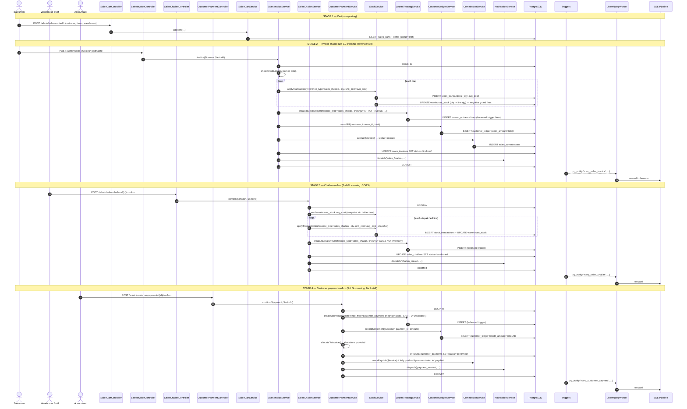
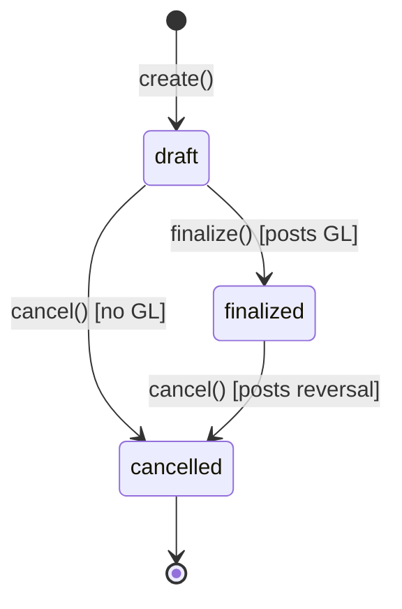
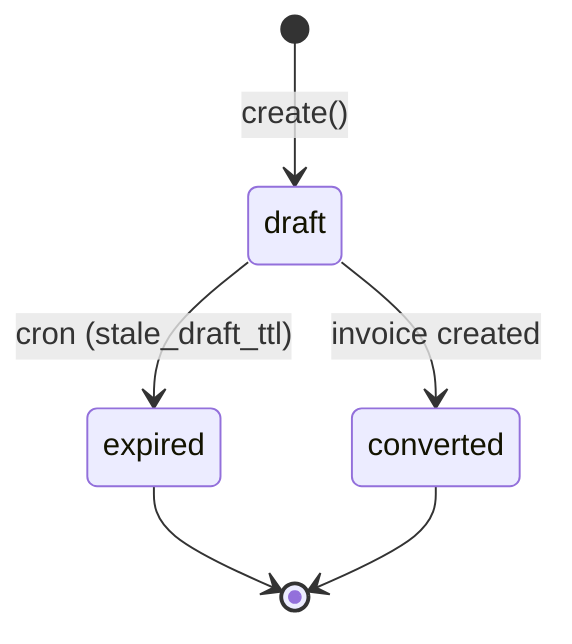

# Order-to-Cash — End-to-End Workflow (Phase 20)

> **Module:** Workflows / Cross-Cutting (Sales → Inventory → Accounting)
> **Audience:** Engineers, AI assistants, accountants, auditors, sales managers, warehouse staff
> **Status:** Draft — pending accountant review. **SAFETY-CRITICAL** because the workflow
> crosses the GL boundary four times (invoice finalize posts Revenue+AR+COGS; challan posts
> COGS+Inventory; payment posts Bank+AR; return posts Sales Return+AR+Inventory+COGS).
> Reversal rules and the moving-average cost rollback MUST preserve Dr=Cr and the
> reversal-over-mutation rule. The workflow also drives commission accrual.
> **Last reviewed:** Phase 20 (initial creation)
> **Source of truth:** This file is the canonical end-to-end view. Per-step detail lives in:
> - [`../sales/sales-overview.md`](../sales/sales-overview.md), [`../sales/sales-invoice.md`](../sales/sales-invoice.md),
>   [`../sales/sales-challan.md`](../sales/sales-challan.md), [`../sales/sales-cart.md`](../sales/sales-cart.md),
>   [`../sales/sales-return.md`](../sales/sales-return.md), [`../sales/commission.md`](../sales/commission.md),
>   [`../sales/transport-cost.md`](../sales/transport-cost.md), [`../sales/sales-audit.md`](../sales/sales-audit.md),
> - [`../accounting/customer-payments.md`](../accounting/customer-payments.md) — AR sub-ledger + payment posting,
> - [`../accounting/journal-posting-rules.md`](../accounting/journal-posting-rules.md) §7.6.1 (sales) + §7.6.6 (customer payment),
> - [`../inventory/stock-ledger.md`](../inventory/stock-ledger.md), [`../inventory/stock-costing.md`](../inventory/stock-costing.md).

---

## 1. What is it?

Order-to-Cash (O2C) is the end-to-end value chain that turns a customer order into collected
cash and reconciled revenue. In RC_ERP it spans **five sub-systems**, each with its own
service (per [`../coding/service-layer-conventions.md`](../coding/service-layer-conventions.md)):

1. **Cart** — `SalesCartService` holds a per-user draft of items + quantities + customer +
   salesman + warehouse + transport. Carts expire after `sales.stale_draft_ttl` minutes
   (cron-cancelled at 02:00). No GL impact.
2. **Sales Invoice** — `SalesInvoiceService::create()` converts a cart into a `draft`
   invoice (still no GL). `SalesInvoiceService::finalize()` is the first safety-critical
   step: it atomically (a) writes `sales_invoice_items` + `sales_invoice_dispatches`,
   (b) writes a `stock_transactions` OUT row per item (reserving stock), (c) posts
   `postInvoiceGL()` → Dr **AR** / Cr **Sales Revenue** (+ Cr Transport Revenue if transport,
   + Dr Sales Discount if discount), (d) seeds the AR sub-ledger
   (`customer_ledger`), (e) accrues commission (in `sales_commissions`), and (f) emits
   `pg_notify('rcerp_sales_invoice', ...)`.
3. **Sales Challan** — `SalesChallanService` is the *godown dispatch* document. It can be
   created from an invoice or standalone. `confirm()` posts `postCogsGL()` →
   Dr **COGS** / Cr **Inventory** (using the avg_cost snapshot from the GRN that fed this
   stock). This is the second GL crossing.
4. **Customer Payment** — `CustomerPaymentService::create()` creates a *draft* payment.
   `confirm()` posts `postPaymentGL()` → type-aware (see §11.4). Default `receive` posts
   Dr **Bank/Cash** / Cr **AR** (with optional Dr Sales Discount for discount_amount).
   This is the third GL crossing. Optionally allocates to one or more invoices via
   `allocateToInvoice()`.
5. **Sales Return** — `SalesReturnService::confirm()` posts TWO journal entries: revenue
   reversal (Dr Sales Return / Cr AR) and COGS reversal (Dr Inventory / Cr COGS, using the
   ORIGINAL avg_cost snapshot). This is the fourth GL crossing.

The full chain (Cart → Invoice → Challan → Payment → optional Return) is **strictly
sequential per customer invoice** but multiple invoices can be in-flight concurrently for
different customers. O2C is **branch-isolated**, **period-gated**, and **credit-limit
gated** (see §6.8).

---

## 2. Why does it exist?

- **Two-phase commit per financial event.** Each GL-touching step (invoice finalize,
  challan confirm, payment confirm, return confirm) uses a `draft → confirm → cancel`
  state machine. Drafts are reversible without GL impact; confirm is the point-of-no-return.
- **Sub-ledger reconciliation.** Every invoice finalize seeds `customer_ledger` with an AR
  row; every payment confirm seeds a settlement row. The AR sub-ledger MUST always tie to
  the sum of `ar` ledger balances in the GL — see
  [`../accounting/subledger-reconciliation.md`](../accounting/subledger-reconciliation.md).
- **COGS integrity.** The challan is the point where COGS is recognized. It uses the
  `warehouse_stock.avg_cost` snapshot AT THE TIME OF DISPATCH — not at invoice finalize.
  This decoupling allows an invoice to be finalized (revenue + AR posted) before physical
  dispatch (COGS posted), matching the commercial reality of B2B wholesale.
- **Credit limit enforcement.** Before invoice finalize, the service checks the customer's
  outstanding AR balance + the new invoice total against `customers.credit_limit`. Over-limit
  sales are rejected (or escalated to admin override — see [`../business/business-rules-catalog.md`](../business/business-rules-catalog.md)).
- **Commission accrual.** On invoice finalize, commission is accrued (in `sales_commissions`)
  based on the salesman's commission rule (target × rate). It is NOT paid until the invoice
  is fully paid (state machine in [`../sales/commission.md`](../sales/commission.md)).
- **Audit trail.** Every state transition is captured by `AuditableMasterData` + the global
  `AuditTrail` observer.

---

## 3. When is it used?

- **Trigger:** A customer (typically a retailer buying wholesale from RC) places an order.
- **Frequency:** Continuous, multi-branch, multi-customer. Replay-data volumes from
  [`../database/etl-legacy-migration.md`](../database/etl-legacy-migration.md): ~521 invoices
  and ~550 customer payments in the historical migration corpus.
- **Lifecycle stage:** Operational (daily), with month-end AR reconciliation and period-close
  revenue cutoff validation.
- **Return cadence:** Returns are exceptional (typical rate <5% of invoices).

---

## 4. Who uses it?

| Role | O2C step | Action |
|---|---|---|
| `salesman` / `sales_manager` | Cart create / edit | `/admin/sales-cart/*` |
| `salesman` / `sales_manager` / `admin` | Invoice create (draft) from cart | `/admin/sales-invoices/create` |
| `sales_manager` / `admin` | Invoice finalize (revenue+AR+COGS reserve post) | `/admin/sales-invoices/{id}/finalize` |
| `admin` | Invoice cancel (reversal) | `/admin/sales-invoices/{id}/cancel` |
| `warehouse_staff` / `warehouse_manager` | Challan create + confirm (godown dispatch, COGS post) | `/admin/sales-challans/*` |
| `accountant` / `admin` | Customer payment draft | `/admin/customer-payments/create` |
| `accountant` / `admin` | Customer payment confirm (bank+AR post) | `/admin/customer-payments/{id}/confirm` |
| `accountant` / `admin` | Customer payment cancel (reversal) | `/admin/customer-payments/{id}/cancel` |
| `accountant` / `admin` | Allocate payment to invoice(s) | `allocateToInvoice()` |
| `sales_manager` / `admin` | Return create + confirm | `/admin/sales-returns/*` |
| `auditor` (read-only) | All steps | `audit-trails` viewer |

---

## 5. Related modules

- **Architecture:** [`../architecture/layered-design.md`](../architecture/layered-design.md), [`../architecture/branch-isolation-rls.md`](../architecture/branch-isolation-rls.md), [`../architecture/realtime-events.md`](../architecture/realtime-events.md)
- **Business:** [`../business/core-workflows.md`](../business/core-workflows.md)
- **Database:** [`../database/schema-overview.md`](../database/schema-overview.md), [`../database/er-diagrams.md`](../database/er-diagrams.md) §Sales/Payment domain
- **Accounting:** [`../accounting/journal-posting-rules.md`](../accounting/journal-posting-rules.md) (the master Dr/Cr matrix), [`../accounting/customer-payments.md`](../accounting/customer-payments.md), [`../accounting/subledger-reconciliation.md`](../accounting/subledger-reconciliation.md), [`../accounting/reversal-vs-cancellation.md`](../accounting/reversal-vs-cancellation.md), [`../accounting/running-balance.md`](../accounting/running-balance.md), [`../accounting/fiscal-year-period-close.md`](../accounting/fiscal-year-period-close.md)
- **Inventory:** [`../inventory/stock-ledger.md`](../inventory/stock-ledger.md), [`../inventory/stock-costing.md`](../inventory/stock-costing.md), [`../inventory/warehouse-stock.md`](../inventory/warehouse-stock.md)
- **Sales:** [`../sales/sales-overview.md`](../sales/sales-overview.md), [`../sales/sales-invoice.md`](../sales/sales-invoice.md), [`../sales/sales-challan.md`](../sales/sales-challan.md), [`../sales/sales-cart.md`](../sales/sales-cart.md), [`../sales/sales-return.md`](../sales/sales-return.md), [`../sales/commission.md`](../sales/commission.md), [`../sales/transport-cost.md`](../sales/transport-cost.md), [`../sales/sales-audit.md`](../sales/sales-audit.md)
- **Security:** [`../security/audit-trails.md`](../security/audit-trails.md), [`../security/branch-context-security.md`](../security/branch-context-security.md)
- **Workflows:** [`./procure-to-pay.md`](./procure-to-pay.md) (upstream — feeds avg_cost), [`./period-close-workflow.md`](./period-close-workflow.md), [`./inventory-to-gl.md`](./inventory-to-gl.md)

---

## 6. Business rules (the Core Rules)

### 6.1 Cart is non-posting

A Sales Cart MUST NOT post to the GL or the stock ledger. It records intent only.
`sales.stale_draft_ttl` minutes after creation, the cron job `sales:cancel-stale-drafts`
marks it `expired`.

### 6.2 Invoice finalize is the first GL crossing

`SalesInvoiceService::finalize()` is the ONLY step in O2C that posts
Dr **AR** / Cr **Sales Revenue**. It MUST do so atomically with the stock reservation
(`stock_transactions` with `reference_type='sales_invoice'`, negative qty) and the AR
sub-ledger seed and the commission accrual — all inside one `DB::transaction` closure.

### 6.3 Dr = Cr (the inviolable rule)

Every `postInvoiceGL`, `postCogsGL`, `postPaymentGL`, `postRevenueReversalGL`,
`postCogsReversalGL` call goes through `JournalPostingService::createJournalEntry()`,
enforced by the `enforce_balanced_journal_entry()` trigger. Unbalanced lines roll back the
entire transaction.

### 6.4 Reversal over mutation

Cancelling a finalized invoice / confirmed challan / confirmed payment / confirmed return
MUST create a counter `journal_entries` row (with `reference_type` =
`sales_invoice_reversal` / `sales_challan_reversal` / `customer_payment_reversal` /
`sales_return_reversal`, `reversal_of` = original entry id) and a counter
`stock_transactions` row. The original rows are NEVER mutated (only `cancelled_at` is set).

### 6.5 Period gate

Same as P2P §6.5 — `validatePeriod()` on every GL post.

### 6.6 Branch isolation

Same as P2P §6.6 — every O2C row carries `branch_id`, enforced by `BranchScope` +
`EnforceBranchIsolation` + RLS.

### 6.7 COGS uses avg_cost at challan time, not invoice time

`SalesChallanService::postCogsGL()` reads `warehouse_stock.avg_cost` AT THE TIME OF
CHALLAN CONFIRM, not at invoice finalize. This means: if a GRN raises avg_cost between
invoice finalize and challan confirm, the COGS posted will reflect the new (higher) cost.
This is correct behavior (matching actual cost of goods dispatched). It also means: if
challan confirm happens BEFORE invoice finalize (challan-first flow), COGS is recognized
before revenue — the controller enforces invoice finalize before challan confirm in the
default flow.

### 6.8 Credit limit enforcement

Before invoice finalize, `SalesInvoiceService::checkCreditLimit()` queries
`customer_ledger.balance` + pending invoices and compares to `customers.credit_limit`.
Over-limit → `RuntimeException` (or admin override via `sales.credit_limit_override_roles`).

### 6.9 Negative stock guard

The `trg_warehouse_stock_negative_guard` trigger fires on `warehouse_stock` BEFORE UPDATE.
If the OUT movement would push `quantity` below zero, the trigger raises an exception and
the entire finalize transaction rolls back. There is NO override (the guard is absolute).
This means: an invoice cannot be finalized against stock that doesn't physically exist.

### 6.10 AR sub-ledger must tie to GL

After every invoice finalize, `customer_ledger` MUST contain one AR row whose
`debit_amount` equals the invoice `total_amount`. After every payment confirm,
`customer_ledger` MUST contain one settlement row whose `credit_amount` equals the payment
`amount`. The sum of all `customer_ledger.debit_amount − credit_amount` for a customer MUST
equal the GL `ar` ledger balance. The `subledger:reconcile-ar` artisan command verifies
this.

### 6.11 Payment allocation is optional but must balance

A customer payment MAY be allocated against one or more invoices via `allocateToInvoice()`.
If allocated, the sum of allocations MUST equal the payment `amount`. Unallocated payments
create a customer advance (credit balance in `customer_ledger`) — i.e. customer-paid-in-advance.

### 6.12 Commission accrual vs payment

Commission is accrued at invoice finalize (in `sales_commissions` with status `accrued`)
but only flips to `payable` (and later `paid`) when the linked invoice is fully paid. This
prevents the salesman from earning commission on unpaid invoices — see
[`../sales/commission.md`](../sales/commission.md).

### 6.13 Sales return uses ORIGINAL avg_cost, not current

`SalesReturnService::postCogsReversalGL()` reads the avg_cost from the ORIGINAL invoice's
`stock_transactions.unit_cost` snapshot — NOT the current `warehouse_stock.avg_cost`. This
is critical: if avg_cost has changed between sale and return, the COGS reversal must match
the COGS originally posted, not the current cost. Otherwise the GL would have a phantom
gain/loss.

### 6.14 Return restocking is optional

A sales return MAY or MAY NOT restock the goods. If `restock=true`, a counter
`stock_transactions` IN row is written (with `reference_type='sales_return'`, positive qty,
original avg_cost). If `restock=false` (damaged goods), no stock ledger row is written —
the inventory debit in the COGS reversal is replaced by a Dr Damage Loss.

---

## 7. Technical implementation

### 7.1 Layered call chain (canonical — invoice finalize)

```
HTTP POST /admin/sales-invoices/{id}/finalize
  → Middleware: auth, EnsureRole:sales_manager|admin, EnforceBranchIsolation
    → SalesInvoiceController::finalize(Request, SalesInvoice $invoice)
      → SalesInvoiceService::finalize($invoice, $actorId)
        → DB::transaction(function () use (...) {
            // 1. State guard: status === 'draft'
            // 2. Credit-limit check (or admin override)
            // 3. For each line:
            //    a. StockService::applyTransaction(['reference_type'=>'sales_invoice',
            //       'reference_id'=>$invoice->id, 'warehouse_id'=>..., 'product_id'=>...,
            //       'quantity'=>-$qty, 'unit_cost'=>$warehouseStock->avg_cost, 'transaction_date'=>...])
            //       → writes stock_transactions row + updates warehouse_stock (negative guard fires)
            //    b. (avg_cost NOT recalculated on OUT — only on IN)
            // 4. JournalPostingService::createJournalEntry([
            //    'reference_type'=>'sales_invoice', 'reference_id'=>$invoice->id,
            //    'branch_id'=>..., 'entry_date'=>..., 'source'=>'sales',
            //    'lines'=>[
            //      ['ledger_id'=>ar_ledger, 'debit'=>$total, 'credit'=>0],
            //      ['ledger_id'=>sales_revenue_ledger, 'debit'=>0, 'credit'=>$revenue],  // subTotal or subTotal-discount
            //      ...(Dr sales_discount if discount>0),
            //      ...(Cr transport_revenue if transport>0),
            //    ], 'memo'=>"Invoice #{$invoice->invoice_code}"])
            //    → fires enforce_balanced_journal_entry trigger
            // 5. CustomerLedgerService::recordAR($customerId, $invoice->id, $total, 'sales_invoice')
            //    → writes customer_ledger row (debit_amount=total)
            // 6. CommissionService::accrue($invoice) → writes sales_commissions row (status=accrued)
            // 7. $invoice->update(['status'=>'finalized', 'finalized_by'=>$actorId, 'finalized_at'=>now()])
            // 8. NotificationService::dispatch('sales_finalize', [...], 'sales_invoice', $invoice->id)
            // 9. ListenNotifyService::emitNotify('rcerp_sales_invoice', [...])
          })
```

### 7.2 Service inventory (O2C touchpoints)

| Service | File | Role in O2C |
|---|---|---|
| `SalesCartService` | `laravel/app/Services/Sales/SalesCartService.php` | Cart lifecycle; non-posting; stale-draft TTL |
| `SalesInvoiceService` | `laravel/app/Services/Sales/SalesInvoiceService.php` | Invoice draft/finalize/cancel; `postInvoiceGL()` L989 |
| `SalesChallanService` | `laravel/app/Services/Sales/SalesChallanService.php` | Challan draft/confirm/cancel; `postCogsGL()` L703; `postTransportAdjustmentGL()` L801 |
| `SalesReturnService` | `laravel/app/Services/Sales/SalesReturnService.php` | Return draft/confirm/cancel; `postRevenueReversalGL()` L415; `postCogsReversalGL()` L459 |
| `CustomerPaymentService` | `laravel/app/Services/Accounting/CustomerPaymentService.php` | Payment draft/confirm/cancel; `postPaymentGL()` L368; `allocateToInvoice()` L648 |
| `CommissionService` | `laravel/app/Services/Sales/CommissionService.php` | `accrue()`, `markPayable()`, `markPaid()` |
| `StockService` | `laravel/app/Services/Stock/StockService.php` | `applyTransaction()`; `reverseTransaction()` |
| `JournalPostingService` | `laravel/app/Services/Accounting/JournalPostingService.php` | `createJournalEntry()` — the only GL writer |
| `CustomerLedgerService` | `laravel/app/Services/Accounting/CustomerLedgerService.php` | `recordAR()`, `recordSettlement()` — AR sub-ledger writer |
| `NotificationService` | `laravel/app/Services/Notification/NotificationService.php` | `dispatch()` for `sales_finalize`, `challan_create`, `payment_receive`, `return_created` |
| `ListenNotifyService` | `laravel/app/Services/Realtime/ListenNotifyService.php` | `emitNotify()` → PG channel → worker → SSE |

### 7.3 Controllers

| Controller | File | Routes |
|---|---|---|
| `SalesCartController` | `laravel/app/Http/Controllers/Admin/SalesCartController.php` | `/admin/sales-cart/*` |
| `SalesInvoiceController` | `laravel/app/Http/Controllers/Admin/SalesInvoiceController.php` | `/admin/sales-invoices/*` |
| `SalesChallanController` | `laravel/app/Http/Controllers/Admin/SalesChallanController.php` | `/admin/sales-challans/*` |
| `SalesReturnController` | `laravel/app/Http/Controllers/Admin/SalesReturnController.php` | `/admin/sales-returns/*` |
| `CustomerPaymentController` | `laravel/app/Http/Controllers/Admin/CustomerPaymentController.php` | `/admin/customer-payments/*` |

### 7.4 Models

| Model | File | Notes |
|---|---|---|
| `SalesCart` | `laravel/app/Models/SalesCart.php` | Non-posting; `BranchScope` |
| `SalesInvoice` | `laravel/app/Models/SalesInvoice.php` | Partitioned by RANGE(invoice_date); `ledgerReferenceType()` |
| `SalesInvoiceItem` | `laravel/app/Models/SalesInvoiceItem.php` | Lines |
| `SalesInvoiceDispatch` | `laravel/app/Models/SalesInvoiceDispatch.php` | Dispatch header |
| `SalesChallan` | `laravel/app/Models/SalesChallan.php` | Partitioned |
| `SalesReturn` | `laravel/app/Models/SalesReturn.php` | Partitioned |
| `CustomerPayment` | `laravel/app/Models/CustomerPayment.php` | Partitioned; AR sub-ledger anchor |
| `InvoicePaymentAllocation` | `laravel/app/Models/InvoicePaymentAllocation.php` | Pivot to invoice |
| `SalesCommission` | `laravel/app/Models/SalesCommission.php` | Commission accrual |
| `StockTransaction` | `laravel/app/Models/StockTransaction.php` | The stock ledger |
| `JournalEntry` / `JournalLine` | `laravel/app/Models/JournalEntry.php` | GL; partitioned |
| `CustomerLedger` | `laravel/app/Models/CustomerLedger.php` | AR sub-ledger |

### 7.5 Triggers fired during O2C

| Trigger | Table | Purpose |
|---|---|---|
| `enforce_balanced_journal_entry()` | `journal_entries` BEFORE INSERT/UPDATE | Dr=Cr enforcement |
| `trg_stock_transactions_audit` | `stock_transactions` AFTER | Append-only audit |
| `trg_warehouse_stock_negative_guard` | `warehouse_stock` BEFORE UPDATE | Reject negative stock on OUT |
| `trg_warehouse_stock_overallocation_guard` | `warehouse_stock` BEFORE UPDATE | Reject over-allocation (reserved > available) |
| `trg_sales_invoice_notify` | `sales_invoices` AFTER UPDATE | `pg_notify('rcerp_sales_invoice', ...)` |
| `trg_sales_challan_notify` | `sales_challans` AFTER UPDATE | `pg_notify('rcerp_sales_challan', ...)` |
| `trg_customer_payment_notify` | `customer_payments` AFTER UPDATE | `pg_notify('rcerp_customer_payment', ...)` |
| RLS policies | All O2C tables | `current_setting('app.branch_id') = branch_id` |

---

## 8. Important database tables

| Table | Schema | Purpose | Key columns |
|---|---|---|---|
| `sales_carts` | `04_sales.sql` | Cart header | `id, customer_id, salesman_id, branch_id, warehouse_id, status, expires_at` |
| `sales_cart_items` | `04_sales.sql` | Cart lines | `cart_id, product_id, quantity, unit_price` |
| `sales_invoices` | `04_sales.sql` (partitioned) | Invoice header | `id, cart_id, customer_id, salesman_id, branch_id, invoice_code, status, sub_total, discount, transport_cost, total_amount, invoice_date` |
| `sales_invoice_items` | `04_sales.sql` | Invoice lines | `invoice_id, product_id, quantity, unit_price, avg_cost_snapshot, total` |
| `sales_invoice_dispatches` | `04_sales.sql` | Dispatch header | `invoice_id, warehouse_id, transport_cost, dispatch_date` |
| `sales_invoice_dispatchers` | `04_sales.sql` | Dispatcher assignment | `dispatch_id, employee_id` |
| `sales_challans` | `04_sales.sql` (partitioned) | Challan header | `id, invoice_id, branch_id, challan_code, status, dispatch_date` |
| `sales_returns` | `04_sales.sql` (partitioned) | Return header | `id, invoice_id, customer_id, branch_id, return_code, status, total_amount, restock` |
| `sales_return_items` | `04_sales.sql` | Return lines | `return_id, product_id, quantity, unit_price, avg_cost_snapshot` |
| `customer_payments` | `06_payment_and_misc.sql` (partitioned) | Payment header | `id, customer_id, branch_id, payment_code, type, amount, discount_amount, status, payment_date` |
| `invoice_payment_allocations` | `05_purchase.sql` | Payment ↔ invoice allocation | `payment_id, invoice_id, allocated_amount` |
| `sales_commissions` | `06_payment_and_misc.sql` | Commission | `invoice_id, salesman_id, amount, status (accrued/payable/paid), accrued_at, paid_at` |
| `stock_transactions` | `03_stock.sql` (partitioned) | Stock ledger | `id, reference_type, reference_id, warehouse_id, product_id, quantity, unit_cost, transaction_date` |
| `warehouse_stock` | `03_stock.sql` | Per-warehouse quantities | `warehouse_id, product_id, quantity, avg_cost, reserved_quantity` |
| `journal_entries` | `02_accounting.sql` (partitioned) | GL header | `id, reference_type, reference_id, branch_id, entry_date, source, reversal_of` |
| `journal_lines` | `02_accounting.sql` (partitioned) | GL lines | `entry_id, ledger_id, debit, credit, entity_type, entity_id` |
| `customer_ledger` | `02_accounting.sql` | AR sub-ledger | `customer_id, branch_id, reference_type, reference_id, debit_amount, credit_amount, balance` |

See [`../database/er-diagrams.md`](../database/er-diagrams.md) §Sales/Payment domain.

---

## 9. Related services

See §7.2.

---

## 10. Related models

See §7.4.

---

## 11. Important workflows

### 11.1 End-to-end sequence — happy path (Cart → Invoice → Challan → Payment)



### 11.2 Invoice finalize — Dr/Cr posting table

`SalesInvoiceService::postInvoiceGL()` L989-1062 — verbatim pattern:

| # | Account | Ledger nature | Debit | Credit | Condition |
|---|---|---|---|---|---|
| 1 | Accounts Receivable | `ar` | `total_amount` | 0 | always |
| 2 | Sales Revenue | `sales_revenue` | 0 | `sub_total` (or `sub_total − discount`) | always |
| 3 | Sales Discount | `sales_discount` | `discount_amount` | 0 | if `discount > 0` |
| 4 | Transport Revenue | `transport_revenue` | 0 | `transport_cost` | if `transport_cost > 0` |
| | | **Total** | **T** | **T** | Dr = Cr ✓ |

`reference_type` = `sales_invoice` · `reference_id` = `$invoice->id` · `source` = `sales` ·
`branch_id` = `$invoice->branch_id` · `entry_date` = `finalized_at`.

### 11.3 Challan confirm — Dr/Cr posting table

`SalesChallanService::postCogsGL()` L703:

| # | Account | Ledger nature | Debit | Credit | Memo |
|---|---|---|---|---|---|
| 1 | Cost of Goods Sold | `cogs` | Σ(qty × avg_cost_snapshot) | 0 | "Challan #code — COGS" |
| 2 | Inventory | `inventory` | 0 | Σ(qty × avg_cost_snapshot) | "Challan #code — stock-out" |
| | | **Total** | **T** | **T** | Dr = Cr ✓ |

`reference_type` = `sales_challan` · `source` = `challan` · `entry_date` = `dispatch_date`.

#### 11.3.1 Transport adjustment — `postTransportAdjustmentGL()` L801

If the actual transport cost differs from the invoice-time estimate:
- **Transport ↑**: Dr AR / Cr Transport Revenue (or `sales_revenue` fallback)
- **Transport ↓**: Dr Transport Revenue / Cr AR

### 11.4 Customer payment confirm — Dr/Cr posting table

`CustomerPaymentService::postPaymentGL()` L368-423 — type-aware:

| Variant | Method | Dr | Cr | Memo |
|---|---|---|---|---|
| `receive` (default) | `buildReceiveGL` L430 | Bank/Cash × amount+discount_amount · Sales Discount × discount_amount (if >0) | AR × amount+discount_amount | "Customer payment #code" |
| `discount` (write off discount only) | `buildDiscountGL` L477 | Sales Discount × (amount+discount_amount) | AR × (amount+discount_amount) | "Discount posted #code" |
| `write_off` (bad debt) | `buildWriteOffGL` L508 | Bad Debt (fallback finance_cost → operating_expense) × amount | AR × amount | "Bad debt write-off #code" |
| `payment` (refund to customer) | `buildRefundGL` L543 | AR × amount | Bank/Cash × amount | "Refund to customer #code" |

`reference_type` = `customer_payment` · `source` = `customer_payment` · `entry_date` = `payment_date`.

### 11.5 Sales return confirm — Dr/Cr posting (two journal entries)

`SalesReturnService::confirm()` L415 + L459 — TWO separate `createJournalEntry` calls:

**Entry A — Revenue reversal (`postRevenueReversalGL`):**

| # | Account | Ledger nature | Debit | Credit |
|---|---|---|---|---|
| 1 | Sales Return | `sales_return` | Σ(qty × sales_rate) | 0 |
| 2 | Accounts Receivable | `ar` | 0 | Σ(qty × sales_rate) |
| | | **Total** | **T** | **T** | Dr = Cr ✓ |

**Entry B — COGS reversal (`postCogsReversalGL`):**

| # | Account | Ledger nature | Debit | Credit |
|---|---|---|---|---|
| 1 | Inventory (or Damage Loss if restock=false) | `inventory` / `damage_loss` | Σ(qty × ORIGINAL avg_cost) | 0 |
| 2 | Cost of Goods Sold | `cogs` | 0 | Σ(qty × ORIGINAL avg_cost) |
| | | **Total** | **T** | **T** | Dr = Cr ✓ |

`reference_type` = `sales_return` · `source` = `sales_return` · `entry_date` = `return_date`.

> **CRITICAL:** Entry B uses `avg_cost_snapshot` from the ORIGINAL invoice's
> `stock_transactions.unit_cost` — NOT the current `warehouse_stock.avg_cost`. This is
> enforced by `SalesReturnService` reading `sales_invoice_items.avg_cost_snapshot`. If the
> snapshot column is NULL (legacy data), the service falls back to current avg_cost — known
> gap, see [`../sales/sales-return.md`](../sales/sales-return.md) §Gaps.

### 11.6 Invoice cancellation (reversal) — Dr/Cr posting

`SalesInvoiceService::cancel()` L324 — atomic, in `DB::transaction`:

| Step | Action | Dr | Cr |
|---|---|---|---|
| 1 | `StockService::reverseTransaction()` writes counter `stock_transactions` row (qty positive, `reference_type=sales_invoice_reversal`) | — | — |
| 2 | Counter `customer_ledger` row (credit_amount=total) | — | — |
| 3 | `JournalPostingService::createJournalEntry()` with `reversal_of=original_entry_id`, `skip_period_check=true` | Dr Sales Revenue / Dr Transport Revenue (if any) / Cr Sales Discount (if any) | Cr AR |
| 4 | `CommissionService::reverseAccrual($invoice)` — flips `sales_commissions.status` to `reversed` | — | — |
| 5 | `sales_invoices.update(status='cancelled', cancelled_at=now())` | — | — |

The cancellation posts a counter GL entry with `reference_type = sales_invoice_reversal`.
The original rows are NEVER mutated.

### 11.7 State machines



(Same state machine for `sales_invoices`, `sales_challans`, `customer_payments`,
`sales_returns`. The `sales_carts` state machine has additional `expired` state from the
stale-draft cron.)



---

## 12. Known edge cases

1. **Invoice finalized but not dispatched.** The invoice has posted Revenue+AR but no COGS
   yet. The P&L shows revenue with no matching COGS until the challan confirms. The balance
   sheet shows inventory at cost (correct) and AR (correct). The P&L is temporarily
   inflated. This is acceptable for a few days; long-running un-dispatched invoices should
   be flagged.
2. **Challan before invoice.** Allowed in the challan-first flow (walk-in customer). The
   challan posts COGS first; the invoice (created later) posts Revenue+AR. Both must
   reconcile at period close.
3. **Return without original invoice.** Not allowed — `SalesReturnService::create()`
   requires `invoice_id` (FK NOT NULL). A return without a source invoice is a manual
   journal entry.
4. **Partial return.** Allowed — a return can have a subset of invoice items. The two
   counter entries post proportionally.
5. **Return of already-returned items.** Not allowed — `SalesReturnService::confirm()`
   checks `sales_return_items.quantity` against the original invoice's remaining
   un-returned quantity.
6. **Customer over-payment.** If `amount > outstanding AR`, the surplus creates a customer
   advance (credit balance in `customer_ledger`). The accountant can either refund
   (`type=payment` variant — Dr AR / Cr Bank) or apply to a future invoice.
7. **Discount-only payment.** The `discount` variant writes off the discount portion of an
   invoice without any cash movement. Used when a customer disputes and the admin agrees to
   a discount.
8. **Bad-debt write-off.** The `write_off` variant posts Dr Bad Debt / Cr AR. The AR is
   cleared without cash receipt. Requires admin role.
9. **Avg-cost drift on return.** §6.13 above. If the snapshot column is NULL (legacy),
   current avg_cost is used — known drift source.
10. **Commission on partially-paid invoices.** Commission stays in `accrued` until the
    invoice is FULLY paid (not partially). The `markPayable()` call is triggered from
    `CustomerPaymentService::confirm()` only when the allocation sum equals the invoice
    total.
11. **Stale-draft expiry during edit.** If the cron fires while a user is editing a cart,
    the cart is marked `expired` and the next save fails with `RuntimeException`. The user
    must create a new cart.
12. **Cross-branch invoice.** Rejected by `EnforceBranchIsolation` middleware. For
    cross-branch sales, use the Branch Demand workflow — see
    [`../finance/branch-demand.md`](../finance/branch-demand.md).
13. **Intercompany settlement (cross-branch customer payment).**
    `CustomerPaymentService::postIntercompanySettlement()` L772 is **DEAD CODE** (`return
    null;` at L780). Now that `banks.branch_id` exists, this could be re-activated — see
    [`../accounting/customer-payments.md`](../accounting/customer-payments.md) §8.
14. **Transport cost adjustment after challan.** If the actual transport differs from the
    invoice-time estimate, `postTransportAdjustmentGL()` posts a delta entry — see §11.3.1.
15. **Negative-stock on invoice finalize.** The trigger rolls back the entire finalize.
    This is intentional — sales cannot be made against stock that doesn't exist. To handle
    back-orders, the cart should be split or the customer notified of the shortage.

---

## 13. Future improvements

1. **Activate intercompany customer payment.** Re-enable `postIntercompanySettlement()` now
   that `banks.branch_id` exists.
2. **Back-order handling.** Currently an invoice fails atomically if any line is
   short-stocked. A back-order workflow would split the cart into a fulfillable invoice and
   a back-order cart.
3. **Avg_cost snapshot backfill.** Run a one-time migration to populate
   `sales_invoice_items.avg_cost_snapshot` for legacy invoices (currently NULL → drift risk).
4. **Commission payable on partial payment.** Currently all-or-nothing. A pro-rata model
   would pay commission proportionally to the paid amount.
5. **Customer credit hold workflow.** Currently over-limit sales are rejected. A
   configurable "credit hold" state (allow finalize but flag for review) would be more
   flexible.
6. **Auto-allocation.** `allocateToInvoice()` currently requires the user to specify
   allocations. A FIFO auto-allocation (oldest invoice first) would reduce accountant
   effort.
7. **Sales order document.** Currently the cart is the only pre-invoice document. A formal
   Sales Order (with approval flow) would mirror the PO on the purchasing side.

---

## 14. Verification commands

| Command | Verifies |
|---|---|
| `php artisan subledger:reconcile-ar --branch={id}` | AR sub-ledger ties to GL `ar` ledger |
| `php artisan journal:replay-verify` | Replays all journal entries, confirms Dr=Cr globally |
| `php artisan stock:replay-verify` | Replays all stock_transactions, confirms warehouse_stock matches |
| `php artisan stock:reconcile-drift` | Daily drift check (cron-scheduled) |
| `php artisan sales:cancel-stale-drafts` | Cancel expired carts (cron 02:00) |
| `php artisan commission:reconcile` | Commission sub-ledger vs invoice payment status |
| `php artisan audit:reconstruct --model=SalesInvoice --id={id}` | Full audit trail |

---

## 15. Cross-references

- **Master Dr/Cr matrix:** [`../accounting/journal-posting-rules.md`](../accounting/journal-posting-rules.md) §7.6.1 (sales) + §7.6.6 (customer payment)
- **Upstream:** [`./procure-to-pay.md`](./procure-to-pay.md) — feeds avg_cost consumed in §11.3
- **Stock movement → GL map:** [`./inventory-to-gl.md`](./inventory-to-gl.md)
- **Period gate:** [`./period-close-workflow.md`](./period-close-workflow.md)
- **Notifications fired:** [`./notification-workflow.md`](./notification-workflow.md) §Cross-cutting event map
- **Reversal rules:** [`../accounting/reversal-vs-cancellation.md`](../accounting/reversal-vs-cancellation.md)
- **Sub-ledger recon:** [`../accounting/subledger-reconciliation.md`](../accounting/subledger-reconciliation.md)
- **Branch demand (cross-branch sales):** [`../finance/branch-demand.md`](../finance/branch-demand.md)
