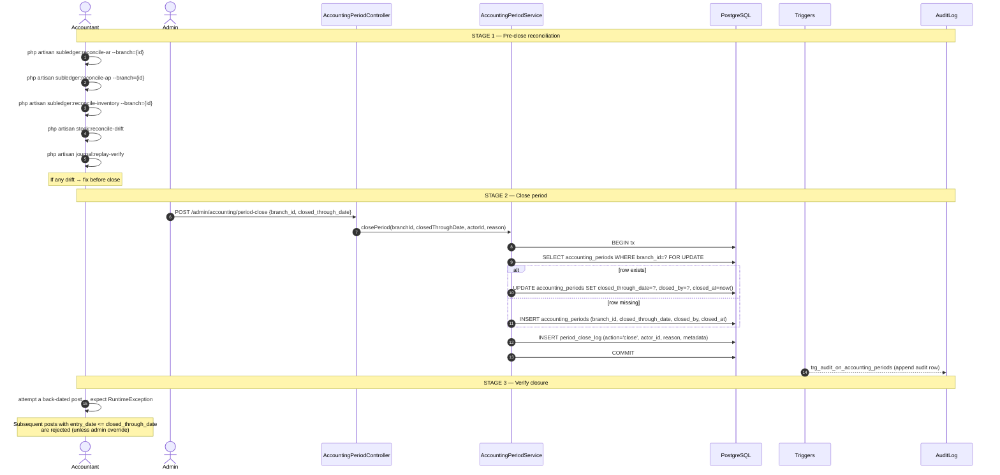
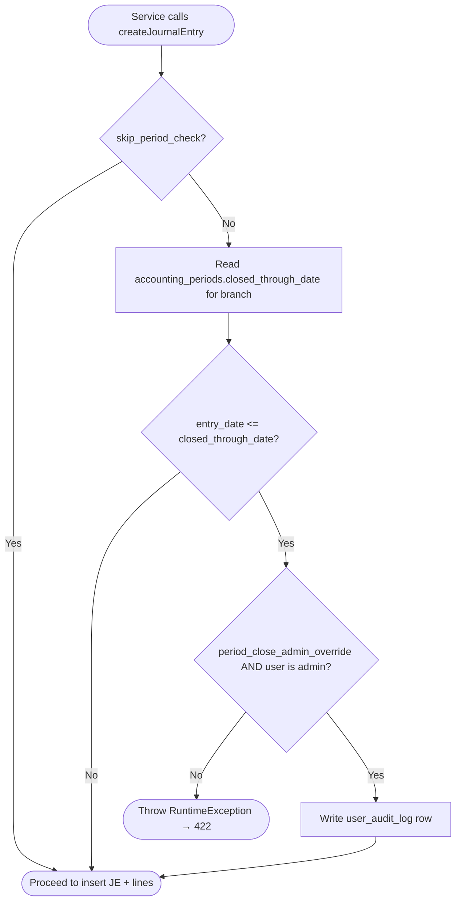
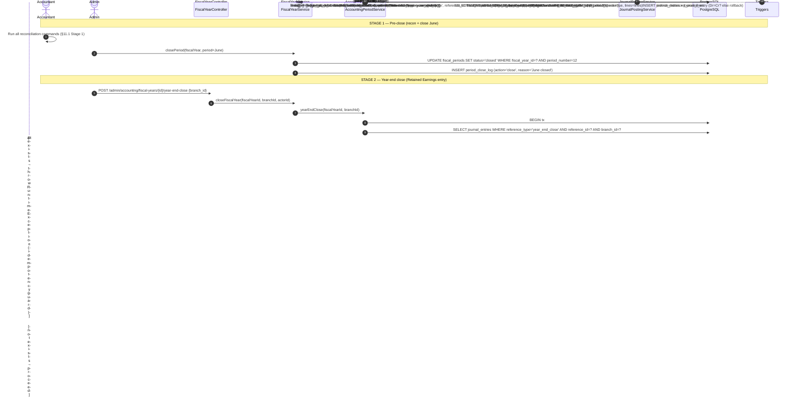
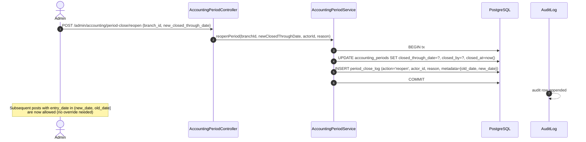
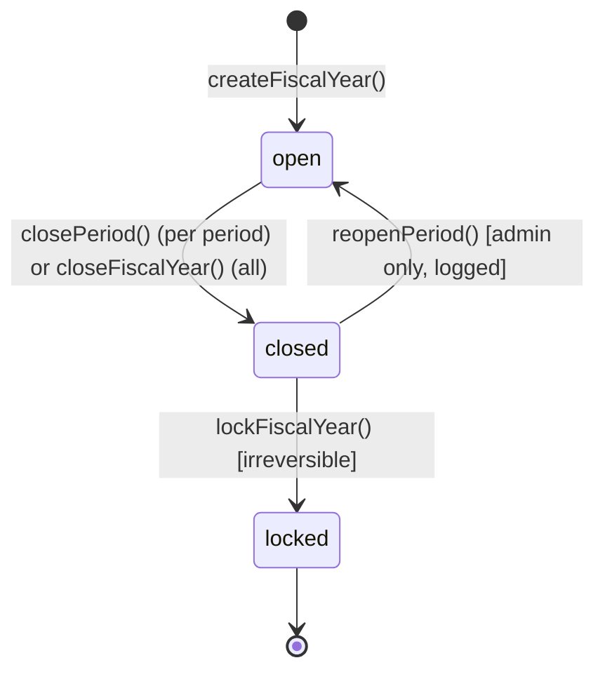

# Period Close Workflow — Month & Year-End Close (Phase 20)

> **Module:** Workflows / Cross-Cutting (Accounting → Finance → Operations)
> **Audience:** Engineers, AI assistants, accountants, auditors, admins, compliance officers
> **Status:** Draft — pending accountant review. **SAFETY-CRITICAL** because period close
> gates every GL post via `validatePeriod()` and year-end close posts the Retained Earnings
> clearing entry. An incorrect close either (a) blocks legitimate postings, or (b) lets
> back-dated entries corrupt a closed period. Year-end close is irreversible without a
> full reversal of the Retained Earnings entry.
> **Last reviewed:** Phase 20 (initial creation)
> **Source of truth:** This file is the canonical end-to-end view. Per-step detail lives in:
> - [`../accounting/fiscal-year-period-close.md`](../accounting/fiscal-year-period-close.md) — the `accounting_periods` + `fiscal_years` + `fiscal_periods` + `period_close_log` tables + `AccountingPeriodService` + `FiscalYearService`,
> - [`../accounting/journal-posting-rules.md`](../accounting/journal-posting-rules.md) §7.6.9 — `yearEndClose` Dr/Cr pattern,
> - [`../accounting/subledger-reconciliation.md`](../accounting/subledger-reconciliation.md) — AR/AP/inventory recon,
> - [`../accounting/running-balance.md`](../accounting/running-balance.md) — MV refresh strategy,
> - [`../deployment/cron-scheduled-jobs.md`](../deployment/cron-scheduled-jobs.md) — pg_cron + Laravel scheduler.

---

## 1. What is it?

Period close is the end-of-period sequence that locks a branch's books for a date range so
no further GL postings can be made into that range, then (at year-end) zeros out the
Income/Expense ledgers to Retained Earnings. RC_ERP has TWO close mechanisms layered
together:

1. **Legacy soft-close** — `accounting_periods` table, one row per branch, with a single
   `closed_through_date` column. `JournalPostingService::createJournalEntry()` calls
   `validatePeriod($entryDate, $branchId)` which checks this column on every post. Simple
   and fast; used for month-end cutoff.
2. **Enhanced fiscal-year close** — `fiscal_years` + `fiscal_periods` + `period_close_log`
   tables, added by migration `2026_08_10_000004`. Each fiscal year has 12 monthly periods
   (or 4 quarterly, or 1 annual) with `status` ∈ {`open`, `closed`, `locked`}. Year-end
   close is a multi-step workflow with audit log entries.

The two mechanisms are **complementary, not redundant**: the legacy soft-close enforces the
hard cutoff at the GL-post level (fast, low-latency); the enhanced close tracks the
workflow state (open/closed/locked) with audit log and supports the year-end Retained
Earnings clearing entry.

### 1.1 Three close granularities

| Granularity | Mechanism | Frequency | Reversibility |
|---|---|---|---|
| **Month-end soft-close** | Legacy `accounting_periods.closed_through_date` | Monthly (per branch) | Reversible by admin (`reopen`) |
| **Period close (enhanced)** | `fiscal_periods.status = closed` | Monthly or quarterly | Reversible (`status = open`) until year-end |
| **Year-end close** | `fiscal_years.status = closed` + Retained Earnings entry | Annually (July 1 → June 30 BD fiscal year) | **Irreversible without full reversal** |

### 1.2 What period close does NOT do

- It does NOT freeze stock movements (those continue — only the GL post is gated).
- It does NOT close the AR/AP sub-ledgers (those are open continuously; reconciliation is
  a separate command, `subledger:reconcile-ar` / `subledger:reconcile-ap`).
- It does NOT recompute the moving-average cost (avg_cost is continuous).
- It does NOT archive data (that's the partitioning/archival subsystem — see
  [`../architecture/partitioning-archival.md`](../architecture/partitioning-archival.md)).

---

## 2. Why does it exist?

- **Cutoff integrity.** Once the accountant closes a period, no further back-dated entries
  can corrupt the reported numbers. This is a foundational accounting control.
- **Audit trail.** Every close/reopen action is recorded in `period_close_log` with actor,
  timestamp, period range, and reason. An auditor can reconstruct the close history.
- **Year-end Retained Earnings.** At year-end, all Income/Expense ledgers MUST be zeroed
  to Retained Earnings so the next fiscal year starts with a clean P&L. This is the only
  automated year-end operation.
- **Bangladesh fiscal year.** The BD fiscal year is July 1 → June 30 (hardcoded fallback
  in `2026_08_10_000004:148-153`). The `fiscal_years` table can be configured for any
  date range via `system_policies.metadata.fiscal_year_start` / `fiscal_year_end`.
- **Reconciliation gate.** Before close, the accountant runs `subledger:reconcile-*` and
  `stock:reconcile-drift` and `journal:replay-verify` to confirm the books are clean.
  Close is the seal on that verification.
- **Admin override.** The `PERIOD_CLOSE_ADMIN_OVERRIDE` flag (default true) allows a
  superadmin to post into a closed period — useful for late adjustments, but logged to
  `user_audit_log` for audit.

---

## 3. When is it used?

- **Month-end close:** Per branch, typically on the 1st–3rd of the following month. The
  accountant runs reconciliation commands, fixes any drift, then closes the period.
- **Year-end close:** Annually, on July 1 (BD fiscal year start). The accountant closes
  June, runs year-end close (which posts the Retained Earnings entry), and opens the new
  fiscal year.
- **Mid-period reopen:** Rare — used when a late entry must be back-dated into a closed
  period. Admin only; logged.
- **Period-close verification:** Continuous — the `validatePeriod()` check fires on every
  GL post.

---

## 4. Who uses it?

| Role | Action |
|---|---|
| `accountant` | Runs reconciliation commands, prepares period for close |
| `admin` / `superadmin` | Closes period, reopens period, runs year-end close |
| `superadmin` | Override-posts into a closed period (logged to `user_audit_log`) |
| `auditor` (read-only) | Reads `period_close_log`, verifies close sequence |
| `system` (automated) | `validatePeriod()` check on every GL post (no human action) |

---

## 5. Related modules

- **Architecture:** [`../architecture/layered-design.md`](../architecture/layered-design.md)
- **Database:** [`../database/schema-overview.md`](../database/schema-overview.md), [`../database/triggers-views-constraints.md`](../database/triggers-views-constraints.md) (`enforce_balanced_journal_entry`)
- **Accounting:** [`../accounting/fiscal-year-period-close.md`](../accounting/fiscal-year-period-close.md) (canonical), [`../accounting/journal-posting-rules.md`](../accounting/journal-posting-rules.md), [`../accounting/subledger-reconciliation.md`](../accounting/subledger-reconciliation.md), [`../accounting/running-balance.md`](../accounting/running-balance.md), [`../accounting/financial-audit-log.md`](../accounting/financial-audit-log.md)
- **Deployment:** [`../deployment/cron-scheduled-jobs.md`](../deployment/cron-scheduled-jobs.md), [`../deployment/artisan-commands.md`](../deployment/artisan-commands.md)
- **Security:** [`../security/audit-trails.md`](../security/audit-trails.md), [`../security/system-policy-compliance.md`](../security/system-policy-compliance.md)
- **Workflows:** [`./procure-to-pay.md`](./procure-to-pay.md), [`./order-to-cash.md`](./order-to-cash.md), [`./inventory-to-gl.md`](./inventory-to-gl.md), [`./notification-workflow.md`](./notification-workflow.md)

---

## 6. Business rules (the Core Rules)

### 6.1 `validatePeriod()` is called on every GL post

Every `JournalPostingService::createJournalEntry()` call MUST call
`validatePeriod($entry['entry_date'], $branchId)` — UNLESS `skip_period_check` is true
(used for reversals and year-end close). If `posting_date <= closed_through_date`, the
post is rejected with `RuntimeException` unless the admin override conditions are met.

### 6.2 Admin override is logged

If `config('accounting.period_close_admin_override')` is true AND the user is admin, the
override is allowed but MUST log to `user_audit_log` with actor, timestamp, posting_date,
branch_id, and reason. The log row is append-only (RLS-protected).

### 6.3 Reversals skip the period check

Counter-entries for cancellations (e.g. `purchase_receive_reversal`,
`sales_invoice_reversal`) MUST set `skip_period_check = true` so they can post in a later
period than the original. This is correct behavior: a sale made in June and cancelled in
July must reverse in July (the current period), not be blocked by June being closed.

### 6.4 Year-end close uses `skip_period_check = true`

The Retained Earnings clearing entry posts with `entry_date = fiscal_year_end_date` (which
is in the closed year). Without `skip_period_check = true`, the post would be rejected by
the very close it is finalizing.

### 6.5 Year-end close zeros Income and Expense ledgers only

Balance Sheet (Asset, Liability, Equity) ledgers are NOT zeroed — they carry forward.
The `yearEndClose()` method iterates `ledgerBalances` and only acts on
`account_type = 'Income'` (Dr to zero the credit balance) and `account_type = 'Expense'`
(Cr to zero the debit balance).

### 6.6 Retained Earnings is the balancing line

After zeroing all Income/Expense ledgers, the net difference (Income − Expense = Net
Profit) is posted as a single line to the Retained Earnings ledger:
- Net Profit > 0 → Cr Retained Earnings
- Net Loss < 0 → Dr Retained Earnings

The Retained Earnings ledger is configured in `config/accounting.php` (`retained_earnings_ledger_id`).

### 6.7 Year-end close is one journal entry per branch

`yearEndClose($fiscalYearId, $branchId)` posts ONE journal entry containing all the
zeroing lines plus the balancing Retained Earnings line. The `reference_type` is
`year_end_close`, the `source` is `year_end_close`, and `skip_period_check` is true.

### 6.8 Year-end close is idempotent guarded

`yearEndClose()` checks if a `journal_entries` row with `reference_type='year_end_close'`
and `reference_id=$fiscalYearId` already exists for the branch. If so, it throws
`RuntimeException` to prevent double-close. To re-run, the accountant must first cancel
the existing year-end entry (which posts a counter reversal).

### 6.9 Bangladesh fiscal year (July 1 – June 30)

Hardcoded fallback in `2026_08_10_000004:148-153`. Configurable via
`system_policies.metadata.fiscal_year_start` / `fiscal_year_end`. If the SystemPolicy
metadata keys are set, they override the BD fallback.

### 6.10 Period close is per-branch

`accounting_periods` has `branch_id (unique)` — one row per branch. Each branch closes
its own periods independently. This supports branches in different time zones or with
different fiscal calendars (rare but possible).

### 6.11 `period_close_log` is append-only

Every close/reopen action MUST write a row to `period_close_log` with actor, timestamp,
period range, action (`close` / `reopen` / `year_end_close`), and reason. The table is
RLS-protected and has no UPDATE/DELETE grants.

### 6.12 Reconciliation commands must pass before close

The accountant MUST run, before closing a period:
- `php artisan subledger:reconcile-ar --branch={id}` (AR sub-ledger ties to GL)
- `php artisan subledger:reconcile-ap --branch={id}` (AP sub-ledger ties to GL)
- `php artisan subledger:reconcile-inventory --branch={id}` (inventory sub-ledger ties to GL)
- `php artisan stock:reconcile-drift` (stock_transactions matches warehouse_stock)
- `php artisan journal:replay-verify` (Dr=Cr globally)

Any drift MUST be resolved before close. The close command does not enforce this (it
trusts the accountant), but the audit trail will reflect whether the recon commands were
run.

---

## 7. Technical implementation

### 7.1 Service inventory

| Service | File | Role |
|---|---|---|
| `AccountingPeriodService` | `laravel/app/Services/Accounting/AccountingPeriodService.php` (475L) | Legacy soft-close: `closePeriod()`, `reopenPeriod()`, `validatePeriod()`, `yearEndClose()` L274 |
| `FiscalYearService` | `laravel/app/Services/Accounting/FiscalYearService.php` (450L) | Enhanced: `createFiscalYear()`, `closePeriod()`, `closeFiscalYear()`, `lockFiscalYear()` |
| `JournalPostingService` | `laravel/app/Services/Accounting/JournalPostingService.php` | Calls `validatePeriod()` on every `createJournalEntry()` (unless `skip_period_check`) |
| `SubLedgerReconciliationService` | `laravel/app/Services/Accounting/SubLedgerReconciliationService.php` | `reconcileAR()`, `reconcileAP()`, `reconcileInventory()` |
| `StockVerificationService` | `laravel/app/Services/Stock/StockVerificationService.php` | `replayVerify()`, `reconcileDrift()` |
| `AuditTrail` observer | `laravel/app/Observers/AuditTrailObserver.php` | Captures `accounting_periods` / `fiscal_years` / `fiscal_periods` state changes |

### 7.2 Controllers

| Controller | File | Routes |
|---|---|---|
| `AccountingPeriodController` | `laravel/app/Http/Controllers/Admin/AccountingPeriodController.php` | `/admin/accounting/period-close` (close/reopen) |
| `FiscalYearController` | `laravel/app/Http/Controllers/Admin/FiscalYearController.php` | `/admin/accounting/fiscal-years/*` |

### 7.3 Models

| Model | File | Notes |
|---|---|---|
| `AccountingPeriod` | `laravel/app/Models/AccountingPeriod.php` | Legacy; one row per branch |
| `FiscalYear` | `laravel/app/Models/FiscalYear.php` | Enhanced; `status` state machine |
| `FiscalPeriod` | `laravel/app/Models/FiscalPeriod.php` | Enhanced; per-month/quarter |
| `PeriodCloseLog` | `laravel/app/Models/PeriodCloseLog.php` | Append-only audit log |
| `JournalEntry` | `laravel/app/Models/JournalEntry.php` | Stores year-end-close entry |

### 7.4 Config knobs

| Knob | File | Default | Purpose |
|---|---|---|---|
| `accounting.period_close_admin_override` | `config/accounting.php` | true | Allow admin to post into closed period (logged) |
| `accounting.retained_earnings_ledger_id` | `config/accounting.php` | (set per CoA) | The RE ledger for year-end close |
| `accounting.gl_reconciliation_tolerance` | `config/accounting.php` | 0.01 | Tolerance for sub-ledger recon |
| `system_policies.metadata.fiscal_year_start` / `_end` | DB | (NULL → BD fallback) | Override the BD July 1 – June 30 fiscal year |

### 7.5 Scheduled jobs (none directly for period close)

Period close is a manual admin action. The pg_cron + Laravel scheduler jobs support close
indirectly by refreshing MVs and reconciling drift, but no job auto-closes a period. See
[`../deployment/cron-scheduled-jobs.md`](../deployment/cron-scheduled-jobs.md):

| Job | Schedule | Purpose |
|---|---|---|
| `cancel-stale-drafts` (pg_cron) | Daily 02:00 | Cancel expired carts / draft invoices |
| `refresh-report-views` (pg_cron) | Every 5 min | Refresh reporting MVs (running balance etc.) |
| `refresh-rb-checks` (pg_cron) | Hourly | Refresh running-balance MVs |
| `purge-old-notifications` (pg_cron) | Daily 03:00 | Purge notifications older than retention |
| `analyze-high-write-tables` (pg_cron) | Daily 04:00 | ANALYZE for query planner stats |
| `reports:refresh` (Laravel) | Every 5 min | Same as refresh-report-views |
| `sales:cancel-stale-drafts` (Laravel) | Daily 02:00 | Cancel stale carts |
| `stock:reconcile-drift` (Laravel) | Daily 03:00 | Daily drift check (input to close decision) |
| `partition:export-parquet` (Laravel) | Quarterly 04:30 | Archive old partitions |
| `partition:verify-join` (Laravel) | Weekly Mon 05:00 | Partition-wise join correctness |
| `partition:measure-perf` (Laravel) | Weekly Mon 05:30 | Partition performance metrics |

---

## 8. Important database tables

| Table | Schema | Purpose | Key columns |
|---|---|---|---|
| `accounting_periods` | `02_accounting.sql:271-281` | Legacy soft-close | `branch_id (unique), closed_through_date, closed_by, closed_at` |
| `fiscal_years` | migration `2026_08_10_000004` | Enhanced FY | `fiscal_year_code, start_date, end_date, period_type, status, is_current` |
| `fiscal_periods` | migration `2026_08_10_000004` | Enhanced periods | `fiscal_year_id, period_number, start_date, end_date, status` |
| `period_close_log` | migration `2026_08_10_000004` | Append-only audit | `branch_id, fiscal_year_id, fiscal_period_id, action, actor_id, action_at, reason, metadata` |
| `journal_entries` | `02_accounting.sql` (partitioned) | GL header | `id, reference_type, reference_id, branch_id, entry_date, source, reversal_of, skip_period_check` |
| `journal_lines` | `02_accounting.sql` (partitioned) | GL lines | `entry_id, ledger_id, debit, credit` |
| `ledgers` | `02_accounting.sql` | CoA | `id, ledger_code, ledger_name, account_type, nature` |
| `user_audit_log` | `02_accounting.sql` | Admin override audit | `user_id, action, context, created_at` |

See [`../database/er-diagrams.md`](../database/er-diagrams.md) §Accounting domain.

---

## 9. Related services

See §7.1.

---

## 10. Related models

See §7.3.

---

## 11. Important workflows

### 11.1 Month-end close sequence (per branch)

### 11.2 Period-close validation flow (on every GL post)

### 11.3 Year-end close sequence (annual, July 1)

### 11.4 Year-end close — Dr/Cr posting table

`AccountingPeriodService::yearEndClose()` L274-388 — verbatim pattern:

For each Income ledger (credit balance, `net_balance < 0`):

| # | Account | Ledger nature | Debit | Credit | Memo |
|---|---|---|---|---|---|
| (per ledger) | Income Ledger X | `account_type='Income'` | `abs(net_balance)` | 0 | "Year-end close — zero {ledger_name}" |

For each Expense ledger (debit balance, `net_balance > 0`):

| # | Account | Ledger nature | Debit | Credit | Memo |
|---|---|---|---|---|---|
| (per ledger) | Expense Ledger Y | `account_type='Expense'` | 0 | `abs(net_balance)` | "Year-end close — zero {ledger_name}" |

Balancing Retained Earnings line:

| Condition | Account | Ledger nature | Debit | Credit |
|---|---|---|---|---|
| `netProfit > 0` (profit) | Retained Earnings | `retained_earnings` | 0 | `netProfit` |
| `netProfit < 0` (loss) | Retained Earnings | `retained_earnings` | `abs(netProfit)` | 0 |
| `netProfit == 0` | (no balancing line needed; entries already balance) | — | — | — |
| | **Total** | | **T** | **T** | Dr = Cr ✓ |

`reference_type` = `year_end_close` · `reference_id` = `$fiscalYearId` · `source` =
`year_end_close` · `entry_date` = `fiscal_year.end_date` · `skip_period_check` = true.

> **Note:** Balance Sheet ledgers (Asset, Liability, Equity) are NOT zeroed — they carry
> forward. The closing balance of the FY becomes the opening balance of the next FY
> naturally (no explicit carry-forward entry is posted).

### 11.5 Mid-period reopen (admin only)

### 11.6 State machines

(`fiscal_years.status` ∈ {`draft`, `open`, `closed`, `locked`} — `locked` is a
hard-lock that prevents even admin reopen; intended for archived years.)

---

## 12. Known edge cases

1. **Override-post into closed period.** Allowed if `PERIOD_CLOSE_ADMIN_OVERRIDE=true` and
   user is admin. Logged to `user_audit_log`. The post appears in the closed period's
   reports — the auditor must reconcile this against the `period_close_log`.
2. **Reversal in a later period.** A sale finalized in June and cancelled in July posts
   the reversal in July (current period) with `skip_period_check=true`. The June P&L
   remains as originally reported; the July P&L shows the reversal. This is correct
   accounting (the reversal is a July event).
3. **Year-end close with pending reversals.** If a reversal is pending (draft state) at
   year-end close, it is NOT included in the year-end calculations. The accountant must
   either confirm or cancel the draft before close.
4. **Year-end close with un-paid invoices.** Commission on un-paid invoices stays in
   `accrued` state across the year boundary. It is NOT zeroed at year-end (it's a balance
   sheet item, not P&L).
5. **Cross-branch consolidation at year-end.** The consolidation run
   (`ConsolidationService::postConsolidation`) eliminates intercompany entries BEFORE
   year-end close. The order is: (a) consolidate, (b) close periods, (c) year-end close.
   See [`../finance/consolidation-intercompany.md`](../finance/consolidation-intercompany.md).
6. **BD fiscal year override.** If `system_policies.metadata.fiscal_year_start` is set to
   e.g. `Jan 1`, the BD fallback is bypassed. The `fiscal_years` table must have a row
   matching the override.
7. **Idempotency guard.** `yearEndClose()` rejects double-close. To re-run, the accountant
   must first cancel the existing year-end entry (counter-post) — which itself requires
   `skip_period_check=true`.
8. **Recon drift at close.** If `subledger:reconcile-ar` reports drift, the close still
   succeeds (it's not enforced in code). The auditor must flag this in the post-close
   review. Known gap: the close command SHOULD fail if recon drift > tolerance.
9. **Period close during ongoing transactions.** A period can be closed while
   transactions are in-flight (no lock). Transactions that commit after the close with
   `entry_date <= closed_through_date` will fail at `validatePeriod()` (unless override).
10. **Multiple branches, different close dates.** Each branch closes independently. Branch
    A may close June on July 1; Branch B may close June on July 5. The consolidated
    reports use the latest close date as the cutoff.
11. **Year-end close with no Retained Earnings ledger configured.** Throws
    `RuntimeException`. The accountant must configure
    `accounting.retained_earnings_ledger_id` in `config/accounting.php` first.
12. **Migration from legacy soft-close to enhanced close.** The legacy
    `accounting_periods` table is NOT deprecated — it remains the fast-path check. The
    enhanced `fiscal_periods` is the workflow layer. Both must agree: if
    `fiscal_periods.status='closed'` for June but `accounting_periods.closed_through_date`
    is May 31, the close is inconsistent. The reconciliation is manual (known gap).

---

## 13. Future improvements

1. **Enforce recon before close.** The close command SHOULD fail if any reconciliation
   command reports drift > tolerance. Currently it's the accountant's responsibility.
2. **Auto-close stale open periods.** A scheduled job could auto-close periods older than
   90 days if no transactions have been posted. Out of current scope (judgment call).
3. **Hard-lock year after archive.** After a fiscal year is archived to Parquet (see
   [`../architecture/partitioning-archival.md`](../architecture/partitioning-archival.md)),
   the `fiscal_years.status` should auto-flip to `locked`. Currently manual.
4. **Multi-currency close.** Currently single-currency (BDT). If multi-currency is added,
   year-end close must post FX revaluation entries before zeroing.
5. **Period-close dashboard.** A view showing per-branch close status, recon drift, and
   pending approvals — to give the accountant a single screen for close preparation.
6. **Year-end close preview.** A dry-run mode that shows the proposed Retained Earnings
   entry without posting. Currently the accountant must run recon commands and compute
   manually.
7. **Audit trail cross-link.** The `period_close_log` SHOULD link to the
   `journal_entries.id` of any year-end close entry. Currently the link is via
   `(reference_type='year_end_close', reference_id=fiscal_year_id)` — works but requires
   a JOIN to discover.

---

## 14. Verification commands

| Command | Verifies |
|---|---|
| `php artisan subledger:reconcile-ar --branch={id}` | AR sub-ledger ties to GL |
| `php artisan subledger:reconcile-ap --branch={id}` | AP sub-ledger ties to GL |
| `php artisan subledger:reconcile-inventory --branch={id}` | Inventory sub-ledger ties to GL |
| `php artisan stock:reconcile-drift` | Stock ledger matches warehouse_stock |
| `php artisan journal:replay-verify` | Dr=Cr globally |
| `php artisan partition:verify-join` | Partition-wise join correctness |
| `php artisan audit:reconstruct --model=AccountingPeriod --id={id}` | Full audit trail of a close action |
| `php artisan fiscal-year:status` | Current FY/period status per branch |
| `php artisan fiscal-year:year-end-dry-run --branch={id} --fiscal-year={id}` | (Future improvement #6 — not yet implemented) |

---

## 15. Cross-references

- **Canonical detail:** [`../accounting/fiscal-year-period-close.md`](../accounting/fiscal-year-period-close.md)
- **Master Dr/Cr matrix:** [`../accounting/journal-posting-rules.md`](../accounting/journal-posting-rules.md) §7.6.9
- **Sub-ledger recon:** [`../accounting/subledger-reconciliation.md`](../accounting/subledger-reconciliation.md)
- **Running balance MVs:** [`../accounting/running-balance.md`](../accounting/running-balance.md)
- **Financial audit log:** [`../accounting/financial-audit-log.md`](../accounting/financial-audit-log.md)
- **Cron jobs:** [`../deployment/cron-scheduled-jobs.md`](../deployment/cron-scheduled-jobs.md)
- **Artisan commands:** [`../deployment/artisan-commands.md`](../deployment/artisan-commands.md)
- **Consolidation:** [`../finance/consolidation-intercompany.md`](../finance/consolidation-intercompany.md)
- **Workflows:** [`./procure-to-pay.md`](./procure-to-pay.md) (AP cutoff), [`./order-to-cash.md`](./order-to-cash.md) (AR cutoff), [`./inventory-to-gl.md`](./inventory-to-gl.md) (inventory cutoff), [`./notification-workflow.md`](./notification-workflow.md) (close-event notifications)
