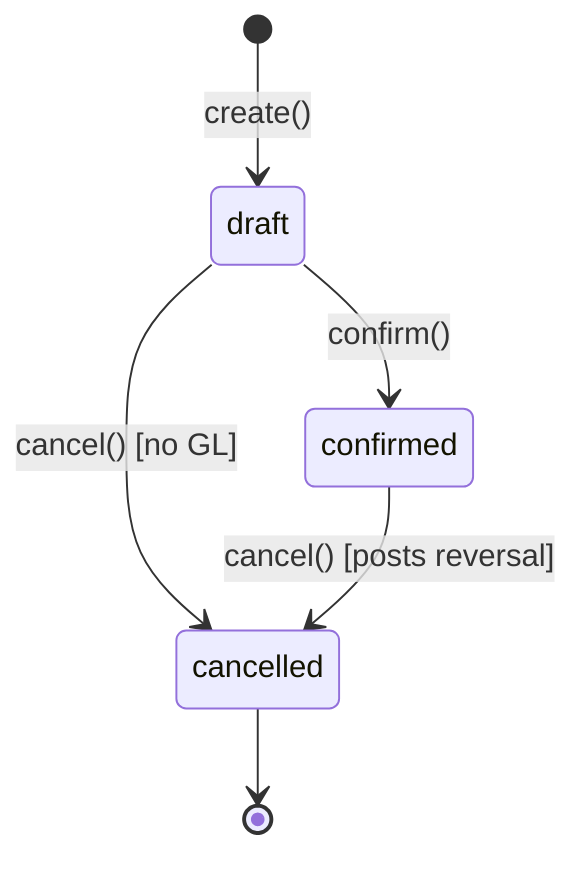

# Procure-to-Pay — End-to-End Workflow (Phase 20)

> **Module:** Workflows / Cross-Cutting (Purchasing → Inventory → Accounting)
> **Audience:** Engineers, AI assistants, accountants, auditors, warehouse staff, purchase managers
> **Status:** Draft — pending accountant review. **SAFETY-CRITICAL** because the workflow
> crosses the GL boundary twice (GRN confirm posts Dr Inventory / Cr AP; supplier payment posts
> Dr AP / Cr Bank). Reversal and partial-return flows MUST preserve Dr=Cr and the
> reversal-over-mutation rule. The workflow also touches the moving-average cost engine
> (`StockService::recalculateAvgCost`) — errors here corrupt COGS downstream in order-to-cash.
> **Last reviewed:** Phase 20 (initial creation)
> **Source of truth:** This file is the canonical end-to-end view. Per-step detail lives in:
> - [`../purchasing/purchase-order.md`](../purchasing/purchase-order.md) — PO lifecycle,
> - [`../purchasing/purchase-receive.md`](../purchasing/purchase-receive.md) — GRN + Dr Inventory / Cr AP,
> - [`../purchasing/purchase-return.md`](../purchasing/purchase-return.md) — return + reversal,
> - [`../purchasing/purchase-audit.md`](../purchasing/purchase-audit.md) — audit trail,
> - [`../accounting/supplier-transactions.md`](../accounting/supplier-transactions.md) — AP sub-ledger + payment posting,
> - [`../accounting/journal-posting-rules.md`](../accounting/journal-posting-rules.md) §7.6 — the master Dr/Cr matrix,
> - [`../inventory/stock-ledger.md`](../inventory/stock-ledger.md) — `stock_transactions` reference-type matrix,
> - [`../inventory/stock-costing.md`](../inventory/stock-costing.md) — moving-average cost derivation.

---

## 1. What is it?

Procure-to-Pay (P2P) is the end-to-end value chain that turns a supplier relationship into a
paid-and-reconciled AP balance. In RC_ERP it spans **four sub-systems** that the ERP keeps as
separate services (one service per operation, per `coding/service-layer-conventions.md`):

1. **Purchase Order (PO)** — `PurchaseOrderService` records a non-posting commitment to buy
   specific quantities at specific prices from a specific supplier for a specific branch.
   The PO never touches the GL or the stock ledger; it is a commercial document only.
2. **Goods Receive Note (GRN)** — `PurchaseReceiveService::create()` creates a *draft* GRN
   (still no GL). `PurchaseReceiveService::confirm()` is the safety-critical step: it
   atomically (a) writes a `stock_transactions` IN row, (b) recalculates the moving-average
   cost for each affected `warehouse_stock` row, (c) posts `postReceiveGL()` →
   Dr **Inventory** / Cr **AP**, (d) seeds the AP sub-ledger (`supplier_ledger`) with the
   payable, and (e) emits `pg_notify('rcerp_purchase_receive', ...)` for the realtime fan-out.
3. **Purchase Return** — `PurchaseReturnService::confirm()` writes an OUT stock-transaction
   row (with `reference_type = 'purchase_return'`), recalculates avg_cost (rollback), and
   posts `postReturnGL()` → Dr **AP** / Cr **Inventory** — the mirror of the GRN posting.
4. **Supplier Payment** — `SupplierTransactionService::create()` creates a *draft* payment
   (still no GL). `SupplierTransactionService::confirm()` posts `postPaymentGL()` →
   Dr **AP** / Cr **Bank/Cash**, writes the AP sub-ledger settlement row, and (optionally)
   allocates the payment against one or more GRNs via `allocateToGRN()`.

The full chain (PO → GRN → optional Return → Payment) is **strictly sequential per supplier
invoice** but multiple POs/GRNs/Payments can be in-flight concurrently for different
suppliers. The P2P chain is **branch-isolated** (every row carries `branch_id`; RLS +
`BranchScope` enforce it) and **period-gated** (every GL post calls `validatePeriod()`).

---

## 2. Why does it exist?

- **Segregation of duties.** The user who confirms a GRN (typically warehouse staff) is NOT
  the user who confirms a supplier payment (typically an accountant). The four-service
  split enforces this in code — no single role can both create the payable and pay it.
- **Two-phase commit per financial event.** Both GRN and Supplier Payment use a `draft →
  confirm → cancel` state machine. Drafts are reversible without GL impact; confirm is the
  point-of-no-return that posts to the GL. Cancellation creates a *reversal entry*, never a
  hard-delete (see [`../accounting/reversal-vs-cancellation.md`](../accounting/reversal-vs-cancellation.md)).
- **Sub-ledger reconciliation.** Every GRN confirm seeds `supplier_ledger` with an AP row;
  every payment confirm seeds a settlement row. The AP sub-ledger MUST always tie to the
  sum of `ap` ledger balances in the GL — see
  [`../accounting/subledger-reconciliation.md`](../accounting/subledger-reconciliation.md).
- **Moving-average cost integrity.** The GRN is the **only** point in P2P where stock
  quantity AND stock value both change. The avg_cost recalculation is therefore the
  downstream source-of-truth for COGS in order-to-cash. An error here propagates to every
  future sale of the same SKU.
- **Audit trail.** Every state transition is captured by the `AuditableMasterData` trait
  (37 models) and/or the global `AuditTrail` observer — see
  [`../security/audit-trails.md`](../security/audit-trails.md).

---

## 3. When is it used?

- **Trigger:** A branch needs to replenish stock from a supplier.
- **Frequency:** Continuous, multi-branch, multi-supplier. Replay-data volumes from
  [`../database/etl-legacy-migration.md`](../database/etl-legacy-migration.md): ~311 GRNs and
  ~550 supplier payments in the historical migration corpus.
- **Lifecycle stage:** Operational (daily), with month-end AP reconciliation and
  period-close AP cutoff validation (see §6.5 and `period-close-workflow.md`).
- **Cancellation cadence:** Returns are exceptional (typical rate <2% of GRNs); supplier
  payment cancellations are rarer still and always require a counter-posting reversal.

---

## 4. Who uses it?

| Role | P2P step | Action |
|---|---|---|
| `purchase_manager` / `admin` | PO create / approve / cancel | `/admin/purchase-orders/*` routes |
| `warehouse_staff` / `warehouse_manager` | GRN create (draft) | `/admin/purchase-receives/create` |
| `warehouse_manager` / `admin` | GRN confirm (stock-in + AP post) | `/admin/purchase-receives/{id}/confirm` |
| `warehouse_manager` / `admin` | GRN cancel (reversal) | `/admin/purchase-receives/{id}/cancel` |
| `warehouse_manager` / `admin` | Return create + confirm | `/admin/purchase-returns/*` |
| `accountant` / `admin` | Supplier payment draft | `/admin/supplier-transactions/create` |
| `accountant` / `admin` | Supplier payment confirm (AP post + bank credit) | `/admin/supplier-transactions/{id}/confirm` |
| `accountant` / `admin` | Supplier payment cancel (reversal) | `/admin/supplier-transactions/{id}/cancel` |
| `accountant` / `admin` | Allocate payment to GRN(s) | `allocateToGRN()` |
| `auditor` (read-only) | All steps | `audit-trails` viewer |
| `superadmin` | Period-close gate override | `PERIOD_CLOSE_ADMIN_OVERRIDE` |

---

## 5. Related modules

- **Architecture:** [`../architecture/layered-design.md`](../architecture/layered-design.md) (controllers → services → models → DB)
- **Architecture:** [`../architecture/branch-isolation-rls.md`](../architecture/branch-isolation-rls.md) (RLS + `BranchScope`)
- **Architecture:** [`../architecture/realtime-events.md`](../architecture/realtime-events.md) (LISTEN/NOTIFY → SSE)
- **Business:** [`../business/core-workflows.md`](../business/core-workflows.md) (value chain context)
- **Database:** [`../database/schema-overview.md`](../database/schema-overview.md), [`../database/er-diagrams.md`](../database/er-diagrams.md) §Purchase/Payment domain
- **Accounting:** [`../accounting/journal-posting-rules.md`](../accounting/journal-posting-rules.md) (the master Dr/Cr matrix)
- **Accounting:** [`../accounting/supplier-transactions.md`](../accounting/supplier-transactions.md) (AP sub-ledger + payment posting)
- **Accounting:** [`../accounting/subledger-reconciliation.md`](../accounting/subledger-reconciliation.md)
- **Accounting:** [`../accounting/reversal-vs-cancellation.md`](../accounting/reversal-vs-cancellation.md)
- **Accounting:** [`../accounting/running-balance.md`](../accounting/running-balance.md)
- **Accounting:** [`../accounting/fiscal-year-period-close.md`](../accounting/fiscal-year-period-close.md) (period gate)
- **Inventory:** [`../inventory/stock-ledger.md`](../inventory/stock-ledger.md), [`../inventory/stock-costing.md`](../inventory/stock-costing.md), [`../inventory/warehouse-stock.md`](../inventory/warehouse-stock.md)
- **Purchasing:** [`../purchasing/purchase-order.md`](../purchasing/purchase-order.md), [`../purchasing/purchase-receive.md`](../purchasing/purchase-receive.md), [`../purchasing/purchase-return.md`](../purchasing/purchase-return.md), [`../purchasing/purchase-audit.md`](../purchasing/purchase-audit.md)
- **Security:** [`../security/audit-trails.md`](../security/audit-trails.md), [`../security/branch-context-security.md`](../security/branch-context-security.md)
- **Workflows:** [`./order-to-cash.md`](./order-to-cash.md) (downstream consumer of avg_cost), [`./period-close-workflow.md`](./period-close-workflow.md) (AP cutoff), [`./inventory-to-gl.md`](./inventory-to-gl.md)

---

## 6. Business rules (the Core Rules)

These are the non-negotiable rules that govern P2P. Violations are bugs.

### 6.1 PO is non-posting

A Purchase Order MUST NOT post to the GL or the stock ledger. It records intent only. The
`status` field cycles through `draft → pending → approved → received → partially_received →
closed → cancelled` but no transition writes a journal entry or a `stock_transactions` row.

### 6.2 GRN confirm is the single point of GL entry

`PurchaseReceiveService::confirm()` is the ONLY step in P2P that posts
Dr **Inventory** / Cr **AP**. It MUST do so atomically with the stock-ledger write and the
avg_cost recalculation — all inside one `DB::transaction` closure. Partial confirm is NOT
supported: a GRN is either fully confirmed (all items received) or remains draft.

### 6.3 Dr = Cr (the inviolable rule)

Every `postReceiveGL` and `postReturnGL` and `postPaymentGL` call goes through
`JournalPostingService::createJournalEntry()`, which writes `journal_entries` + `journal_lines`
and is enforced by the `enforce_balanced_journal_entry()` trigger (see
[`../accounting/journal-posting-rules.md`](../accounting/journal-posting-rules.md) §7.3). An
unbalanced set of lines raises `TriggerException` and the entire transaction rolls back.

### 6.4 Reversal over mutation (cancellation posts a counter-entry)

Cancelling a confirmed GRN or payment MUST NOT delete the original rows or flip a status
flag alone. It MUST create a reversal `journal_entries` row (with `reference_type` =
`purchase_receive_reversal` / `supplier_payment_reversal`, `reversal_of` = original entry id)
and a counter `stock_transactions` row (with `reference_type` = `purchase_receive_reversal`,
negative quantity). The original rows retain their original status; only a `cancelled_at`
column is touched. See [`../accounting/reversal-vs-cancellation.md`](../accounting/reversal-vs-cancellation.md).

### 6.5 Period gate

Every GL post calls `validatePeriod($entry_date, $branchId)`. If `posting_date <=
closed_through_date`, the post is rejected with `RuntimeException` unless (a) the user is
admin AND (b) `config('accounting.period_close_admin_override')` is true. The override is
logged to `user_audit_log`. See
[`../accounting/fiscal-year-period-close.md`](../accounting/fiscal-year-period-close.md) §7.10.

### 6.6 Branch isolation

Every P2P row (`purchase_orders`, `purchase_receives`, `purchase_returns`,
`supplier_payments`, the corresponding `journal_entries`, `stock_transactions`) carries a
`branch_id` that is enforced three ways: (a) `BranchScope` global Eloquent scope, (b)
`EnforceBranchIsolation` middleware sets `app.branch_id` GUC, (c) RLS policies on every
partitioned table. A user in Branch A CANNOT see or write Branch B's P2P rows. See
[`../architecture/branch-isolation-rls.md`](../architecture/branch-isolation-rls.md).

### 6.7 Avg-cost recalculation is mandatory on every GRN

`StockService::recalculateAvgCost($warehouseId, $productId)` is called inside the GRN
confirm transaction. It uses the formula:

```
new_avg_cost = (existing_qty × existing_avg_cost + received_qty × unit_cost) / (existing_qty + received_qty)
```

This MUST happen BEFORE the GL post, so that the GL `inventory` ledger debit matches the
new weighted value. Skipping or reordering this step creates a permanent drift between the
stock sub-ledger and the GL — see [`../inventory/stock-costing.md`](../inventory/stock-costing.md).

### 6.8 AP sub-ledger must tie to GL

After every GRN confirm, `supplier_ledger` MUST contain one AP row whose `credit_amount`
equals the GRN `total_amount`. After every payment confirm, `supplier_ledger` MUST contain
one settlement row whose `debit_amount` equals the payment `amount`. The sum of all
`supplier_ledger.credit_amount − debit_amount` for a supplier MUST equal the GL `ap` ledger
balance. The `subledger:reconcile-ap` artisan command verifies this. See
[`../accounting/subledger-reconciliation.md`](../accounting/subledger-reconciliation.md).

### 6.9 Payment allocation is optional but must balance

A supplier payment MAY be allocated against one or more GRNs via `allocateToGRN()`. If
allocated, the sum of allocations MUST equal the payment `amount`. Unallocated payments
create a supplier advance (debit balance in `supplier_ledger`) that is later reconciled.

### 6.10 No negative AP

The system MUST NOT allow a supplier's AP balance to go negative through over-payment. The
`SupplierTransactionService::confirm()` method checks `supplier_ledger` balance before
posting and rejects over-payments with `RuntimeException`. (Note: this guard is partial —
see [`../purchasing/purchase-audit.md`](../purchasing/purchase-audit.md) §Gaps.)

---

## 7. Technical implementation

### 7.1 Layered call chain (canonical)

```
HTTP POST /admin/purchase-receives/{id}/confirm
  → Middleware: auth, EnsureRole:warehouse_manager|admin, EnforceBranchIsolation
    → PurchaseReceiveController::confirm(Request, PurchaseReceive $receive)
      → PurchaseReceiveService::confirm($receive, $actorId)
        → DB::transaction(function () use (...) {
            // 1. State guard: $receive->status === 'draft' (else throw)
            // 2. For each line: StockService::applyTransaction(['reference_type' => 'purchase_receive',
            //    'reference_id' => $receive->id, 'warehouse_id' => ..., 'product_id' => ...,
            //    'quantity' => +$qty, 'unit_cost' => $line->unit_cost, 'transaction_date' => ...])
            //    → writes stock_transactions row + warehouse_stock row + recalculates avg_cost
            // 3. JournalPostingService::createJournalEntry([
            //    'reference_type' => 'purchase_receive', 'reference_id' => $receive->id,
            //    'branch_id' => ..., 'entry_date' => today(), 'source' => 'grn',
            //    'lines' => [['ledger_id' => inventory_ledger, 'debit' => total, 'credit' => 0],
            //                ['ledger_id' => ap_ledger,         'debit' => 0, 'credit' => total]],
            //    'memo' => "GRN #{$receive->grn_code}"])
            //    → writes journal_entries + journal_lines, fires enforce_balanced_journal_entry trigger
            // 4. SupplierLedgerService::recordAP($supplierId, $receive->id, $total, 'purchase_receive')
            //    → writes supplier_ledger row (credit_amount = total)
            // 5. $receive->update(['status' => 'confirmed', 'confirmed_by' => $actorId, 'confirmed_at' => now()])
            // 6. NotificationService::dispatch('purchase_receive_confirmed', [...], 'purchase_receive', $receive->id)
            // 7. ListenNotifyService::emitNotify('rcerp_purchase_receive', [...])
          })
```

### 7.2 Service inventory (P2P touchpoints)

| Service | File | Role in P2P |
|---|---|---|
| `PurchaseOrderService` | `laravel/app/Services/Purchase/PurchaseOrderService.php` | PO lifecycle; non-posting |
| `PurchaseReceiveService` | `laravel/app/Services/Purchase/PurchaseReceiveService.php` | GRN draft/confirm/cancel; `postReceiveGL()` L371 |
| `PurchaseReturnService` | `laravel/app/Services/Purchase/PurchaseReturnService.php` | Return draft/confirm/cancel; `postReturnGL()` L360 |
| `SupplierTransactionService` | `laravel/app/Services/Accounting/SupplierTransactionService.php` | Payment draft/confirm/cancel; `postPaymentGL()` L405; `allocateToGRN()` L560 |
| `StockService` | `laravel/app/Services/Stock/StockService.php` | `applyTransaction()` L58 (canonical writer); `reverseTransaction()` L194; `recalculateAvgCost()` |
| `JournalPostingService` | `laravel/app/Services/Accounting/JournalPostingService.php` | `createJournalEntry()` — the only GL writer; runs `validatePeriod` + balanced-journal trigger |
| `SupplierLedgerService` | `laravel/app/Services/Accounting/SupplierLedgerService.php` | `recordAP()`, `recordSettlement()` — AP sub-ledger writer |
| `NotificationService` | `laravel/app/Services/Notification/NotificationService.php` | `dispatch()` for `purchase_receive_confirmed`, `supplier_payment_confirmed`, etc. |
| `ListenNotifyService` | `laravel/app/Services/Realtime/ListenNotifyService.php` | `emitNotify()` → PG channel → worker → SSE |
| `AuditTrail` observer | `laravel/app/Observers/AuditTrailObserver.php` | Captures state changes on audited models |

### 7.3 Controllers

| Controller | File | Routes |
|---|---|---|
| `PurchaseOrderController` | `laravel/app/Http/Controllers/Admin/PurchaseOrderController.php` | `/admin/purchase-orders/*` |
| `PurchaseReceiveController` | `laravel/app/Http/Controllers/Admin/PurchaseReceiveController.php` | `/admin/purchase-receives/*` |
| `PurchaseReturnController` | `laravel/app/Http/Controllers/Admin/PurchaseReturnController.php` | `/admin/purchase-returns/*` |
| `SupplierTransactionController` | `laravel/app/Http/Controllers/Admin/SupplierTransactionController.php` | `/admin/supplier-transactions/*` |

All controllers are thin: they validate via FormRequest, call the service, and return a
redirect/JSON. **No business logic in controllers** — see
[`../coding/service-layer-conventions.md`](../coding/service-layer-conventions.md).

### 7.4 Models

| Model | File | Notes |
|---|---|---|
| `PurchaseOrder` | `laravel/app/Models/PurchaseOrder.php` | `BranchScope`; `$fillable`; audited |
| `PurchaseReceive` | `laravel/app/Models/PurchaseReceive.php` | Partitioned by RANGE(invoice_date); `ledgerReferenceType()` |
| `PurchaseReturn` | `laravel/app/Models/PurchaseReturn.php` | Partitioned; `ledgerReferenceType()` |
| `SupplierPayment` | `laravel/app/Models/SupplierPayment.php` | Partitioned; AP sub-ledger anchor |
| `SupplierPaymentSettlement` | `laravel/app/Models/SupplierPaymentSettlement.php` | Pivot to GRN |
| `StockTransaction` | `laravel/app/Models/StockTransaction.php` | The stock ledger; 11 reference-type values |
| `JournalEntry` / `JournalLine` | `laravel/app/Models/JournalEntry.php` | GL; partitioned |
| `SupplierLedger` | `laravel/app/Models/SupplierLedger.php` | AP sub-ledger |

### 7.5 Triggers fired during P2P

| Trigger | Table | Purpose |
|---|---|---|
| `enforce_balanced_journal_entry()` | `journal_entries` BEFORE INSERT/UPDATE | Dr=Cr enforcement — the crown jewel (see `02_accounting.sql`) |
| `trg_stock_transactions_audit` | `stock_transactions` AFTER INSERT/UPDATE/DELETE | Append-only audit row |
| `trg_warehouse_stock_negative_guard` | `warehouse_stock` BEFORE UPDATE | Reject negative stock (only on OUT movements) |
| `trg_purchase_receive_notify` | `purchase_receives` AFTER UPDATE | `pg_notify('rcerp_purchase_receive', ...)` for SSE |
| `trg_supplier_payment_notify` | `supplier_payments` AFTER UPDATE | `pg_notify('rcerp_supplier_payment', ...)` |
| RLS policies | All P2P tables | `current_setting('app.branch_id') = branch_id` |

---

## 8. Important database tables

| Table | Schema | Purpose | Key columns |
|---|---|---|---|
| `purchase_orders` | `04_purchase.sql` | PO header | `id, supplier_id, branch_id, po_code, status, total_amount` |
| `purchase_order_items` | `04_purchase.sql` | PO lines | `po_id, product_id, quantity, unit_cost` |
| `purchase_receives` | `05_purchase.sql` (partitioned) | GRN header | `id, po_id, supplier_id, branch_id, grn_code, status, total_amount, received_at` |
| `purchase_receive_items` | `05_purchase.sql` | GRN lines | `receive_id, product_id, quantity, unit_cost, warehouse_id` |
| `purchase_returns` | `05_purchase.sql` (partitioned) | Return header | `id, receive_id, supplier_id, branch_id, return_code, status, total_amount` |
| `purchase_return_items` | `05_purchase.sql` | Return lines | `return_id, product_id, quantity, unit_cost` |
| `supplier_payments` | `06_payment_and_misc.sql` (partitioned) | Payment header | `id, supplier_id, branch_id, payment_code, type, amount, status, payment_date` |
| `supplier_payment_settlements` | `06_payment_and_misc.sql` | Payment ↔ GRN allocation | `payment_id, receive_id, allocated_amount` |
| `stock_transactions` | `03_stock.sql` (partitioned) | Stock ledger | `id, reference_type, reference_id, warehouse_id, product_id, quantity, unit_cost, transaction_date` |
| `warehouse_stock` | `03_stock.sql` | Per-warehouse quantities | `warehouse_id, product_id, quantity, avg_cost, reserved_quantity` |
| `journal_entries` | `02_accounting.sql` (partitioned) | GL header | `id, reference_type, reference_id, branch_id, entry_date, source, reversal_of` |
| `journal_lines` | `02_accounting.sql` (partitioned) | GL lines | `entry_id, ledger_id, debit, credit, entity_type, entity_id` |
| `supplier_ledger` | `02_accounting.sql` | AP sub-ledger | `supplier_id, branch_id, reference_type, reference_id, debit_amount, credit_amount, balance` |
| `audit_trails` | `02_accounting.sql` | Append-only audit | `auditable_type, auditable_id, action, before, after, user_id` |

See [`../database/er-diagrams.md`](../database/er-diagrams.md) §Purchase/Payment domain for the
Mermaid ER diagram.

---

## 9. Related services

See §7.2 for the inventory. Cross-cutting helpers:

- `SubLedgerReconciliationService` — `subledger:reconcile-ap` command's back-end.
- `AccountingPeriodService::validatePeriod()` — called from inside `createJournalEntry`.
- `AppServiceProvider` — wires `JournalPostingService`, `StockService`,
  `SupplierLedgerService` as singletons.

---

## 10. Related models

See §7.4.

---

## 11. Important workflows

### 11.1 End-to-end sequence — happy path (PO → GRN → Payment)

```mermaid
sequenceDiagram
    autonumber
    actor U as Warehouse Manager
    actor A as Accountant
    participant C1 as PurchaseReceiveController
    participant C2 as SupplierTransactionController
    participant S1 as PurchaseReceiveService
    participant S2 as SupplierTransactionService
    participant SS as StockService
    participant JPS as JournalPostingService
    participant SLS as SupplierLedgerService
    participant NS as NotificationService
    participant DB as PostgreSQL
    participant T as Triggers
    participant W as ListenNotifyWorker
    participant SSE as SSE Pipeline

    Note over U,SSE: STAGE 1 — PO (omitted; non-posting)

    Note over U,SSE: STAGE 2 — GRN confirm
    U->>C1: POST /admin/purchase-receives/{id}/confirm
    C1->>S1: confirm($receive, $actorId)
    S1->>DB: BEGIN tx
    S1->>SS: applyTransaction(reference_type=purchase_receive, +qty, unit_cost)
    SS->>DB: INSERT stock_transactions (+qty, unit_cost)
    SS->>DB: UPDATE warehouse_stock (qty, avg_cost recalc)
    SS->>DB: (negative guard trigger fires)
    S1->>JPS: createJournalEntry(reference_type=purchase_receive, lines=[Dr Inv / Cr AP])
    JPS->>DB: INSERT journal_entries
    JPS->>DB: INSERT journal_lines
    T-->>JPS: enforce_balanced_journal_entry BEFORE INSERT (Dr=Cr? else rollback)
    JPS->>SLS: recordAP(supplier, receive_id, total)
    SLS->>DB: INSERT supplier_ledger (credit_amount=total)
    S1->>DB: UPDATE purchase_receives SET status='confirmed'
    S1->>NS: dispatch('purchase_receive_confirmed', ...)
    NS->>DB: INSERT notifications (per recipient rule)
    S1->>DB: COMMIT (or ROLLBACK on any exception)
    T-->>W: pg_notify('rcerp_purchase_receive', ...)
    W->>SSE: forward to browser

    Note over U,SSE: STAGE 3 — Supplier payment confirm
    A->>C2: POST /admin/supplier-transactions/{id}/confirm
    C2->>S2: confirm($payment, $actorId)
    S2->>DB: BEGIN tx
    S2->>JPS: createJournalEntry(reference_type=supplier_payment, lines=[Dr AP / Cr Bank])
    JPS->>DB: INSERT journal_entries + journal_lines (balanced trigger fires)
    JPS->>SLS: recordSettlement(supplier, payment_id, amount)
    SLS->>DB: INSERT supplier_ledger (debit_amount=amount)
    S2->>S2: allocateToGRN() if allocations provided (writes supplier_payment_settlements)
    S2->>DB: UPDATE supplier_payments SET status='confirmed'
    S2->>NS: dispatch('supplier_payment_confirmed', ...)
    S2->>DB: COMMIT
    T-->>W: pg_notify('rcerp_supplier_payment', ...)
    W->>SSE: forward to browser
```

### 11.2 GRN confirm — Dr/Cr posting table

`PurchaseReceiveService::postReceiveGL()` L371-414 — verbatim pattern:

| # | Account | Ledger nature | Debit | Credit | Memo |
|---|---|---|---|---|---|
| 1 | Inventory | `inventory` | `total_amount` | 0 | "GRN #grn_code — stock-in" |
| 2 | Accounts Payable | `ap` | 0 | `total_amount` | "GRN #grn_code — payable to supplier" |
| | | **Total** | **T** | **T** | Dr = Cr ✓ |

`reference_type` = `purchase_receive` · `reference_id` = `$receive->id` · `source` = `grn` ·
`branch_id` = `$receive->branch_id` · `entry_date` = `confirmed_at`.

### 11.3 Purchase return confirm — Dr/Cr posting table

`PurchaseReturnService::postReturnGL()` L360 — the mirror of GRN:

| # | Account | Ledger nature | Debit | Credit | Memo |
|---|---|---|---|---|---|
| 1 | Accounts Payable | `ap` | `total_amount` | 0 | "Return #return_code — AP reversal" |
| 2 | Inventory | `inventory` | 0 | `total_amount` | "Return #return_code — stock-out reversal" |
| | | **Total** | **T** | **T** | Dr = Cr ✓ |

`reference_type` = `purchase_return` · `source` = `purchase_return`.

### 11.4 Supplier payment confirm — Dr/Cr posting table

`SupplierTransactionService::postPaymentGL()` L405-451 — type-aware:

| Variant | Type | Dr | Cr | Memo |
|---|---|---|---|---|
| `payment` | Dr AP / Cr Bank | `ap` × amount | `cash_bank` (or bank-ledger mapping) × amount | "Supplier payment #code" |
| `advance` | Dr AP / Cr Bank | `ap` × amount | `cash_bank` × amount | "Advance to supplier #code" |
| `receive` (supplier credit note) | Dr Inventory / Cr AP | `inventory` × amount | `ap` × amount | "Supplier credit receive #code" |

`reference_type` = `supplier_payment` · `source` = `supplier_payment`.

### 11.5 GRN cancellation (reversal) — Dr/Cr posting table

`PurchaseReceiveService::cancel()` L287 (atomic, in `DB::transaction`):

| Step | Action | Dr | Cr |
|---|---|---|---|
| 1 | `StockService::reverseTransaction()` writes counter `stock_transactions` row (qty negative, `reference_type=purchase_receive_reversal`) | — | — |
| 2 | Recalculate avg_cost (rollback to pre-GRN weighted value) | — | — |
| 3 | `JournalPostingService::createJournalEntry()` with `reversal_of=original_entry_id`, `skip_period_check=true` | Dr AP × total | Cr Inventory × total |
| 4 | `SupplierLedgerService::recordAPReversal()` writes counter row (debit_amount=total) | — | — |
| 5 | `purchase_receives.update(status='cancelled', cancelled_at=now())` | — | — |

The original rows are NEVER mutated. The cancellation posts a counter GL entry with
`reference_type = purchase_receive_reversal`. The `reversal_of` column links them for audit.

### 11.6 State machines



(Same state machine applies to `purchase_receives`, `purchase_returns`, `supplier_payments`.)

---

## 12. Known edge cases

1. **Partial GRN against a PO.** A PO with 3 lines can have 3 separate GRNs (one per line)
   or one GRN with all 3 lines. The PO status auto-flips to `partially_received` after the
   first GRN and `received` after the last. Each GRN posts independently.
2. **GRN without a PO.** Allowed — `po_id` is nullable. Direct GRN is common for
   walk-in supplier purchases. The P2P chain skips Stage 1.
3. **Supplier payment without allocation.** Allowed — creates a supplier advance. The
   accountant must allocate later via `allocateToGRN()`.
4. **Over-allocation.** Rejected by `allocateToGRN()` if the sum of allocations would exceed
   the payment amount.
5. **Period-closed GRN.** If `entry_date <= closed_through_date`, the post is rejected
   unless admin override is on. The warehouse manager sees a 422 with the closed-period
   message.
6. **Cross-branch GRN.** Rejected by `EnforceBranchIsolation` middleware before the service
   is called.
7. **Negative stock after GRN cancellation.** The `trg_warehouse_stock_negative_guard`
   trigger fires on the OUT counter-movement. If the stock was already sold, the
   cancellation rolls back and the user must first reverse the sale (see
   `order-to-cash.md` §12.4).
8. **Avg-cost drift.** If a GRN is cancelled after intervening sales, the avg_cost rollback
   is NOT a simple inverse. `StockService::reverseTransaction()` uses the ORIGINAL avg_cost
   snapshot from `stock_transactions.unit_cost` to compute the rollback. Edge: if the
   original GRN raised avg_cost from 100→120 and 50% was sold, the rollback restores to 100
   on the remaining 50% (correct) but the COGS already posted on the sold 50% is NOT
   reversed — that's a known gap, see [`../inventory/stock-costing.md`](../inventory/stock-costing.md) §13.
9. **Supplier ledger reconciliation drift.** If `supplier_ledger` and GL `ap` ever diverge,
   the `subledger:reconcile-ap` command reports the drift. Known cause: manual DB writes
   bypassing `SupplierLedgerService` (anti-pattern, but historical).
10. **Duplicate payment confirmation.** The `confirm()` method guards on `status === 'draft'`;
    a second confirm raises `RuntimeException`. The user must cancel and re-create.
11. **Intercompany settlement (cross-branch supplier payment).** The
    `SupplierTransactionService::postIntercompanySettlement()` method exists (L616) but is
    **DEAD CODE** — same status as the customer-payment variant. See
    [`../accounting/supplier-transactions.md`](../accounting/supplier-transactions.md) §8.
12. **Return after payment.** If a GRN is paid before being returned, the return posts
    Dr AP / Cr Inventory, leaving a credit balance in AP for the supplier. The accountant
    must either issue a follow-up advance (Dr Bank / Cr AP — `type=receive`) or net the
    credit against the next GRN.

---

## 13. Future improvements

1. **Partial GRN confirmation.** Currently all-or-nothing. Adding per-line confirm would
   require a richer state machine and a partial-post GL pattern (Dr Inventory on confirmed
   lines only).
2. **Intercompany supplier payment.** Activate `postIntercompanySettlement()` (the
   counterpart of the customer-payment dead code) now that `banks.branch_id` exists.
3. **Three-way match.** Add a PO ↔ GRN ↔ Supplier Invoice match gate before payment
   confirm. Currently the match is manual (the accountant eyeballs the PO + GRN before
   clicking confirm).
4. **Supplier portal.** A read-only portal where suppliers can see their GRNs and payment
   status. Out of current scope.
5. **Early-payment discount.** The `supplier_payments.discount_amount` column exists but is
   not yet wired into `postPaymentGL()`. Need a Dr AP / Cr Bank / Cr Discount-Received
   three-line posting.
6. **Avg-cost rollback on GRN cancellation after sale.** Currently a known gap (§12.8).
   The fix requires either (a) blocking cancellation when intervening sales exist, or (b)
   posting a COGS true-up entry.
7. **AP aging report.** The MV `ap_aging_summary` exists but is not auto-refreshed on every
   payment. Wire to `refresh:report-views` after supplier payment confirm.

---

## 14. Verification commands

| Command | Verifies |
|---|---|
| `php artisan subledger:reconcile-ap --branch={id}` | AP sub-ledger ties to GL `ap` ledger |
| `php artisan journal:replay-verify` | Replays all journal entries, confirms Dr=Cr globally |
| `php artisan stock:replay-verify` | Replays all stock_transactions, confirms warehouse_stock matches |
| `php artisan stock:reconcile-drift` | Daily drift check (cron-scheduled) |
| `php artisan partition:verify-join` | Weekly partition-wise join correctness check |
| `php artisan audit:reconstruct --model=PurchaseReceive --id={id}` | Reconstructs the full audit trail |

---

## 15. Cross-references

- **Master Dr/Cr matrix:** [`../accounting/journal-posting-rules.md`](../accounting/journal-posting-rules.md) §7.6.2 (purchase) + §7.6.5 (supplier transactions)
- **Downstream consumer:** [`./order-to-cash.md`](./order-to-cash.md) — uses avg_cost from §11.2
- **Stock movement → GL map:** [`./inventory-to-gl.md`](./inventory-to-gl.md)
- **Period gate:** [`./period-close-workflow.md`](./period-close-workflow.md)
- **Notifications fired:** [`./notification-workflow.md`](./notification-workflow.md) §Cross-cutting event map
- **Reversal rules:** [`../accounting/reversal-vs-cancellation.md`](../accounting/reversal-vs-cancellation.md)
- **Sub-ledger recon:** [`../accounting/subledger-reconciliation.md`](../accounting/subledger-reconciliation.md)
