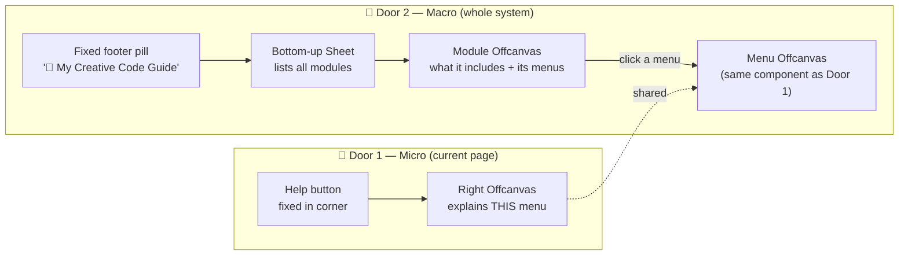
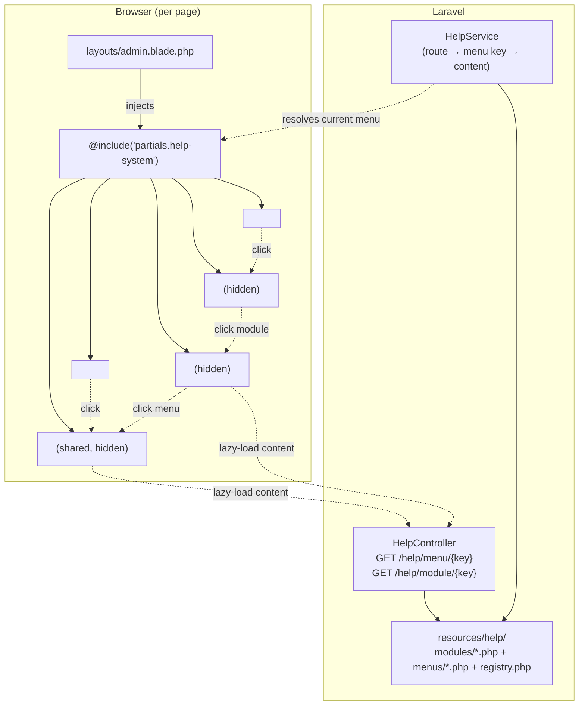
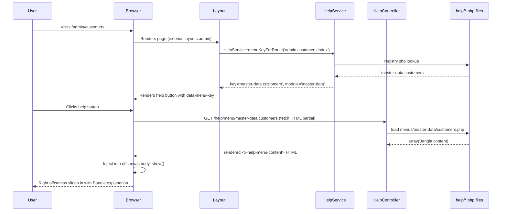
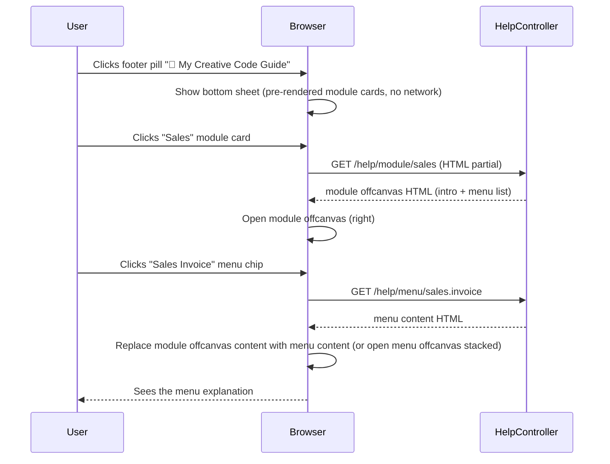
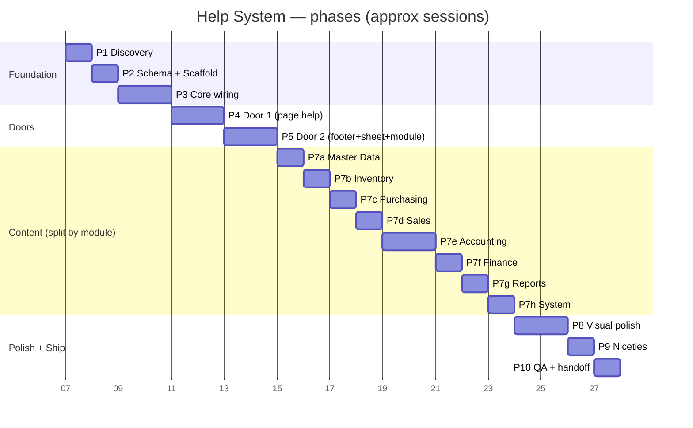

# 📚 RC_ERP Menu & Module Helper System — Implementation Plan

> **Vision:** A two-tier, Bangla-first, colourful, premium in-app guide that explains
> *every menu* and *every module* in plain human language — so no user (and no developer)
> ever stares at a screen wondering *"eita ki ar keno?"*.
>
> **Audience:** The implementation team (you + the AI assistant) executing phase by phase.
> **Owner:** Sajid (RC_ERP maintainer)
> **Status:** Planning — awaiting kickoff approval

---

## 0. TL;DR — What are we building?

A **help system with two doors**, both leading into the same rich, Bangla, diagram-rich
explainer content:



| Door | Trigger | Opens | Explains |
|---|---|---|---|
| **1. Page help** | Floating `?` button (per page, corner) | **Right offcanvas** | The **current menu/page** the user is on |
| **2. System guide** | Fixed footer pill `🧭 My Creative Code Guide` | **Bottom-up sheet** → **module offcanvas** → **menu offcanvas** | The **whole system**: modules + every menu under them |

**One reusable `<x-help-offcanvas />` component** is used by both doors. Door 1 just
pre-selects the menu key from the current route; Door 2 lets the user browse from module → menu.

---

## 1. Why this exists

The ERP has **328 Blade views, 58 admin controllers, ~150 menus** across 13 modules. Even
the maintainer forgets what a menu does. New operators get lost. The result: mistakes,
support tickets, and fear of clicking.

This plan builds a **single, joyful, colourful guide** that:

1. Tells the user on **any page** what this menu is, who it's for, what data it touches,
   and what to be careful about — in **simple Bangla**, with icons and mini-diagrams.
2. Lets anyone explore the **whole system from the footer** — module by module, menu by menu.
3. Is **fun to use**, not a wall of text: colour-coded modules, chips, callouts, flow diagrams.

---

## 2. Goals & Non-Goals

### ✅ Goals
- Every authenticated page shows a floating **Help** button → opens a **right offcanvas**
  with the current menu's Bangla explanation.
- A **fixed footer pill** `🧭 My Creative Code Guide` is visible on every page → opens a
  **bottom-up sheet** with all modules as colourful cards.
- Clicking a module opens a **module offcanvas** (right side) describing the module + listing
  its menus; clicking a menu opens the **menu offcanvas** (same as Door 1).
- Content is **100% Bangla**, plain-language, non-technical, role-aware ("কাদের জন্য"), with
  "কী কাজ করা যায়", "কাদের ডেটা পরিবর্তন করে", "সাবধানতা", and a mini flow diagram.
- Visually: **colourful, premium, modern, responsive, mobile-friendly, fun.**
- Works **offline / no new backend services** — pure Laravel + Blade + Bootstrap + a little JS.

### ❌ Non-Goals
- **Not** a full documentation site (we already have `AI_CONTEXT/`). This is in-app
  contextual help, not a wiki.
- **Not** technical/developer docs — end-user + operator facing only. No SQL, no class names.
- **Not** editable by admins in v1 (content is file-based; admin editor = future enhancement).
- **Not** a chatbot / search engine — that's Phase 13 (AI sidecar). This is structured
  explainer content. (A lightweight in-guide search is included as a nice-to-have in Phase 8.)
- **Not** a replacement for training — it's a memory aid / discoverability layer.

---

## 3. Design Principles (the "fun, not boring" rules)

| # | Principle | How we enforce it |
|---|---|---|
| 1 | **Bangla first, simple Bangla** | All user-facing copy in Bangla. English label kept as a small subtitle only. No jargon, no English-only acronyms. |
| 2 | **Scannable, not wall-of-text** | Max 1 intro line + 5 bullets per section. Use icons on every bullet. |
| 3 | **Show, don't tell** | A tiny Mermaid/SVG flow diagram per menu where it helps (workflow menus). Skip diagrams for trivial CRUD menus. |
| 4 | **Colour = module identity** | Each module has a fixed colour (Sales=emerald, Inventory=amber…). The whole help UI for that module tints to its colour. |
| 5 | **Role chips, not paragraphs** | "কাদের জন্য" shown as coloured chips (Salesman / Accountant…), not sentences. |
| 6 | **Always 2 taps away** | From any page → footer → module → menu ≤ 2 taps. From any page → help button → explanation = 1 tap. |
| 7 | **Premium feel** | Gradients, soft shadows, rounded-2xl, glassmorphism on the sheets, spring-easing animations, icon accents. |
| 8 | **Mobile-first** | Offcanvas = full-screen on mobile; sheets = bottom drawer; tap targets ≥ 44px. |
| 9 | **Consistent everywhere** | One layout partial injected into `layouts.admin` → every page gets it free. |
| 10 | **Graceful fallback** | If no help content exists for a route yet → show a friendly "এই পেজের সাহায্য এখনও তৈরি হয়নি" card with a link to the module guide. Never crash, never show a 404. |

---

## 4. High-Level Architecture



### 4.1 Tech choices (using what the project already has — no new deps)

| Concern | Choice | Why |
|---|---|---|
| UI shell | **Bootstrap 5.3 `offcanvas`** (right + bottom variants) | Already shipped in `laravel/public/assets/css/bootstrap.min.css` + JS. Zero new JS framework. |
| Icons | **FontAwesome** (already loaded) | Consistent with the rest of the ERP. |
| Animations | **CSS transitions + keyframes** (custom) | Spring-ease, fade-up, shimmer. No Anime.js needed. |
| Diagrams | **Mermaid.js via CDN** (loaded lazily, only when a diagram exists) | One `<script>` tag, renders inline. ~80KB, cached. Falls back to a static SVG if CDN blocked (the project already avoids CDNs for core assets — Mermaid is enhancement-only, so acceptable). |
| Interactions | **Vanilla JS + a tiny `help.js`** (no Alpine, no jQuery dependency) | Bootstrap's data-API handles show/hide; we add ~120 lines for content loading + search. |
| Content storage | **Structured PHP files** in `resources/help/` returning arrays | Version-controlled, reviewable, no migration needed, easy to diff. (DB editor is a future enhancement.) |
| Theme layer | One new CSS file `assets/css/help-system.css` (additive, scoped to `.help-*` classes) | Does **not** touch existing `custom.css` / `rc-erp.css`. Safe. |

> **Why not the database?** Help content is static, versioned, and reviewed by people —
> files + PR review beat a DB editor for this. The existing `menus` table gives us the
> route↔menu mapping; we add only a `help_key` concept in a PHP registry, no schema change.

### 4.2 The content resolution flow (Door 1)



### 4.3 The browsing flow (Door 2)



> **UX decision:** When a menu chip is clicked from inside a module offcanvas, we
> **swap the same right offcanvas's content** (with a slide/fade transition) rather than
> stacking two offcanvases. A small breadcrumb at the top (`মডিউল: সেলস › সেলস ইনভয়েস`)
> keeps context. This is simpler, faster, and feels like a single flowing guide.

---

## 5. Content Schema (the contract for every help file)

### 5.1 Menu content file — `resources/help/menus/{module}/{menu}.php`

```php
<?php
// resources/help/menus/sales/invoice.php
return [
    'key'        => 'sales.invoice',
    'module'     => 'sales',
    'title_bn'   => 'সেলস ইনভয়েস',
    'title_en'   => 'Sales Invoice',
    'icon'       => 'fa-file-invoice-dollar',
    'summary'    => 'খদ্দেরকে পণ্য বিক্রি করে যে বিল তৈরি হয়, এটি সেই বিল। এখান থেকেই খদ্দেরের বকেয়া ও আপনার আয় শুরু হয়।',

    'for_roles'  => ['salesman', 'manager', 'admin', 'superadmin'],

    'what_you_can_do' => [
        ['icon' => 'fa-plus',        'text' => 'নতুন ইনভয়েস তৈরি করা'],
        ['icon' => 'fa-list',        'text' => 'আগের সব ইনভয়েস দেখা ও খুঁজা'],
        ['icon' => 'fa-print',       'text' => 'ইনভয়েস প্রিন্ট বা কাস্টমারকে পাঠানো'],
        ['icon' => 'fa-undo',        'text' => 'ভুল হলে রিটার্ন করা'],
        ['icon' => 'fa-circle-check', 'text' => 'কাস্টমারের পেমেন্ট এন্ট্রি করা'],
    ],

    'impacts' => [
        ['who' => 'খদ্দের',     'what' => 'বকেয়া বাড়ে'],
        ['who' => 'স্টক',        'what' => 'পণ্য কমে যায়'],
        ['who' => 'হিসাব',       'what' => 'বিক্রয় আয় ও ভ্যাট লেজারে লেখা হয়'],
    ],

    'cautions' => [
        'ইনভয়েস একবার ফাইনাল হলে সরাসরি এডিট করা যায় না — রিটার্ন দিতে হবে।',
        'পর্যাপ্ত স্টক না থাকলে ইনভয়েস তৈরি হবে না।',
    ],

    'related' => ['sales.cart', 'sales.challan', 'sales.return', 'sales.customer-payment'],

    'diagram' => 'sales-invoice-flow',  // key into a Mermaid snippet, see §5.3

    'updated_at' => '2026-08-06',
];
```

### 5.2 Module content file — `resources/help/modules/{module}.php`

```php
<?php
// resources/help/modules/sales.php
return [
    'key'         => 'sales',
    'title_bn'    => 'সেলস (বিক্রি)',
    'title_en'    => 'Sales',
    'icon'        => 'fa-cart-shopping',
    'color'       => 'emerald',   // maps to the palette in §6.1
    'tagline'     => 'খদ্দেরকে পণ্য বিক্রি, বিল তৈরি, পাঠানো, টাকা আদায় — সব এখানে।',
    'intro'       => 'এই মডিউলে পুরো বিক্রয় সাইকেল চলে: কার্ট তৈরি → ইনভয়েস → গোডাউন চালান → ডেলিভারি → পেমেন্ট → কমিশন।',
    'menus'       => ['sales.cart', 'sales.invoice', 'sales.challan',
                      'sales.return', 'sales.customer-payment', 'sales.commission'],
    'diagram'     => 'sales-cycle',
    'updated_at'  => '2026-08-06',
];
```

### 5.3 Diagrams — `resources/help/diagrams.php`

```php
return [
    'sales-invoice-flow' => <<<MERMAID
flowchart LR
    A[কার্ট] --> B[ইনভয়েস তৈরি]
    B --> C[গোডাউন চালান]
    C --> D[ডেলিভারি]
    D --> E[পেমেন্ট গ্রহণ]
    B -.-> F[(স্টক কমে)]
    B -.-> G[(খদ্দের বকেয়া বাড়ে)]
    MERMAID,
    'sales-cycle' => '...',
];
```

> Diagrams are **optional per menu**. Author one only when the workflow has ≥3 steps
> and a picture genuinely helps. Don't force a diagram onto a trivial "list of X" menu.

### 5.4 Route registry — `resources/help/registry.php`

Maps a **route name** (or `controller@action` fallback) → **menu key**.

```php
return [
    'admin.customers.index'       => 'master-data.customers',
    'admin.customers.create'      => 'master-data.customers',
    'admin.customers.show'        => 'master-data.customers',
    'admin.sales-invoice.index'   => 'sales.invoice',
    // ... one entry per route that should map to a help page
    // (index/create/show/edit all collapse to the same menu key)
];
```

Resolution priority in `HelpService::menuKeyForRoute()`:
1. Exact route name match.
2. `controller@action` match.
3. `controller@*` wildcard match (any action of that controller → same menu key).
4. Fallback: `null` → the help button shows the "no help yet" friendly card.

---

## 6. Design System

### 6.1 Module colour palette

| Module | Colour token | Hex (gradient start → end) | Icon |
|---|---|---|---|
| Master Data | `slate` | `#475569 → #1e293b` | `fa-database` |
| Inventory | `amber` | `#f59e0b → #b45309` | `fa-boxes-stacked` |
| Purchasing | `sky` | `#0ea5e9 → #0369a1` | `fa-truck-ramp-box` |
| Sales | `emerald` | `#10b981 → #047857` | `fa-cart-shopping` |
| Accounting | `violet` | `#8b5cf6 → #6d28d9` | `fa-calculator` |
| Finance (Assets/Budget/Consolidation/Branch Demand) | `rose` | `#f43f5e → #be123c` | `fa-coins` |
| Reports | `teal` | `#14b8a6 → #0f766e` | `fa-chart-pie` |
| System/Admin | `indigo` | `#6366f1 → #4338ca` | `fa-gear` |
| (Neutral / fallback) | `slate-soft` | `#94a3b8 → #475569` | `fa-circle-question` |

> ⚠️ Indigo/violet above are module-identity colours chosen by the business domain, **not**
> the generic app chrome. The chrome (buttons, footer pill, default text) stays neutral
> slate/amber to avoid the "all indigo" anti-pattern. The user's "no indigo/blue" styling
> rule applies to the *app's primary brand chrome*; here indigo is scoped to the System
> module badge only. We'll confirm this with the owner before Phase 8.

### 6.2 Component visual rules

- **Help button (corner):** 48×48px circular, gradient amber→orange, soft shadow
  `0 8px 24px -6px rgba(245,158,11,.5)`, hover lifts `-2px` + pulse ring. Icon: `fa-question`.
  Aria-label: "সাহায্য". Position: `fixed bottom-right: 20px` (above the footer pill).
- **Footer pill:** `fixed bottom: 0`, full-width translucent bar with a centered pill
  `🧭 My Creative Code Guide`. Glassmorphism (`backdrop-filter: blur(12px)`, `bg: rgba(255,255,255,.7)`).
  On mobile it stays a single-line pill; tapping opens the bottom sheet.
- **Right offcanvas:** width 420px desktop / 100% mobile. Header = gradient tinted to the
  module colour + icon + Bangla title + close `×`. Body: white, scannable sections.
- **Bottom-up sheet (module list):** auto-height up to 70vh, scrollable. Grid of module
  cards (2 cols desktop, 1 col mobile). Each card: gradient header strip + icon + Bangla
  name + one-line tagline.
- **Module offcanvas:** same shell as menu offcanvas, tinted to the module colour.
- **Section components inside content:**
  - Role chips: pill `bg-{colour}-soft text-{colour}-dark`, 12px, rounded-full.
  - "কী কাজ করা যায়" → icon-bullet list, 1.05rem, gap-2.
  - "কাদের ডেটা পরিবর্তন করে" → mini table: `who | what`, coloured left border.
  - "সাবধানতা" → amber/red callout card with `fa-triangle-exclamation`.
  - Diagram → rendered Mermaid block, centred, max-width 100%.
  - Related menus → chip row, clickable, opens their offcanvas.

### 6.3 Motion (spring-ease, ≤300ms, never nauseating)

| Element | Enter | Exit |
|---|---|---|
| Right offcanvas | slide+fade from right, 280ms `cubic-bezier(.22,1,.36,1)` | slide right, 200ms |
| Bottom sheet | slide+fade from bottom, 280ms same ease | slide down, 200ms |
| Help button | idle: gentle float 4px every 3s; hover: scale 1.08 + ring pulse | — |
| Module card hover | lift `-3px`, shadow grow, gradient brighten | — |
| Content swap (module→menu) | old fades out 120ms, new fades+slides-up 200ms | — |
| Diagram | fade+scale-in 350ms after Mermaid renders | — |

> Respect `prefers-reduced-motion`: all animations collapse to instant show/hide.

---

## 7. File / Code Layout (what we will create)

```
laravel/
├── app/
│   ├── Services/Help/HelpService.php          # route → menu key resolver + content loader
│   └── Http/Controllers/HelpController.php     # GET /help/menu/{key}, /help/module/{key}
├── resources/
│   ├── help/                                   # ★ new — the content library
│   │   ├── registry.php                        # route name → menu key
│   │   ├── diagrams.php                        # Mermaid snippets, keyed
│   │   ├── modules/
│   │   │   ├── master-data.php
│   │   │   ├── inventory.php
│   │   │   ├── purchasing.php
│   │   │   ├── sales.php
│   │   │   ├── accounting.php
│   │   │   ├── finance.php
│   │   │   ├── reports.php
│   │   │   └── system.php
│   │   └── menus/
│   │       ├── master-data/{products,customers,suppliers,employees,banks,ledgers,branches,warehouses,users}.php
│   │       ├── inventory/{stock-ledger,stock-take,damage,warehouse-transfer,uom,stock-adjustment}.php
│   │       ├── purchasing/{po,receive,return,audit}.php
│   │       ├── sales/{cart,invoice,challan,return,customer-payment,commission}.php
│   │       ├── accounting/{manual-journal,money-transfer,supplier-txn,customer-txn,employee-txn,other-income,other-expense,period-close,fiscal-year,bank-recon}.php
│   │       ├── finance/{fixed-assets,budgets,dimensions,consolidation,branch-demand}.php
│   │       ├── reports/{reports-hub,dashboards,csv-export}.php
│   │       └── system/{notifications,system-policy,archive,audit,shadow-mode,partition-health,users,employees}.php
│   ├── views/
│   │   ├── components/help/                    # ★ new Blade components
│   │   │   ├── help-button.blade.php
│   │   │   ├── guide-footer.blade.php
│   │   │   ├── help-offcanvas.blade.php         # shared right offcanvas shell
│   │   │   ├── module-sheet.blade.php           # bottom-up module list
│   │   │   ├── module-offcanvas.blade.php
│   │   │   ├── menu-content.blade.php           # renders a menu's Bangla content
│   │   │   └── module-content.blade.php
│   │   └── partials/help-system.blade.php       # ★ includes all the above + wires JS
│   └── ...
└── public/assets/
    ├── css/help-system.css                      # ★ scoped styles (.help-*)
    └── js/help.js                               # ★ ~150 lines vanilla JS
```

> **One-line wiring into the existing app:** add `@include('partials.help-system')` at the
> end of `resources/views/layouts/admin.blade.php` (and optionally `app.blade.php`).
> That single include pulls in every component + CSS + JS. No other layout changes.

---

## 8. The Phased Plan (phases → sessions)

> Each **session** = one focused work block (roughly one chat/work day). A phase may span
> multiple sessions. Every session ends with **runnable, committed** code (no half-states).
> Acceptance criteria (AC) at the end of each phase must pass before the next phase starts.



---

### 🧱 Phase 1 — Discovery & Inventory  *(1 session)*

**Goal:** Know exactly what we're documenting. Produce a complete menu inventory so no
menu is missed later.

**Tasks**
1. List every route in `routes/web.php` (1,939 lines) tagged `auth` → extract
   `{method, uri, name, controller@action}`.
2. Cross-reference with the `menus` table (`menu_label, controller, action, icon, parent_id`)
   via `MenuService::getAllMenus()` to get the **human label + parent (module)** for each.
3. Group routes into the **8 modules** defined in §6.1 (decide edge cases: e.g., does
   "Branch Demand" live under Finance or its own? → Finance per the colour table).
4. Produce `docs/help-inventory.csv` with columns:
   `module, menu_key, route_name, uri, controller, action, menu_label_bn, has_help_content`.
5. Identify the **layout(s)** to inject into (`layouts/admin.blade.php` confirmed; check if
   `app.blade.php` is also used by authenticated pages).

**Deliverable:** `docs/help-inventory.csv` + a short "Module → menus" summary appended
to this plan as **Appendix A**.

**AC:**
- [ ] Every authenticated route has a row in the inventory CSV.
- [ ] Every row is assigned to exactly one module.
- [ ] A human-readable module→menu summary exists.

---

### 🏗️ Phase 2 — Content Schema + Scaffold  *(1 session)*

**Goal:** Create the empty skeleton — directories, service, controller, registry, layout
include — so the rest of the phases just *fill in* content and components.

**Tasks**
1. Create directory tree from §7 (`resources/help/...`).
2. Create `HelpService` with stubs:
   - `menuKeyForRoute(string $routeName): ?string`
   - `loadMenuContent(string $key): ?array`
   - `loadModuleContent(string $key): ?array`
   - `modules(): array` (list of all module keys + meta for the bottom sheet)
3. Create `HelpController` with two endpoints returning `view('components.help.menu-content', [...])`:
   - `GET /help/menu/{key}`
   - `GET /help/module/{key}`
   - Both return 404 → a friendly "not yet written" partial (HTTP 200 with empty state).
4. Add routes to `routes/web.php` (auth + `role` middleware, throttled).
5. Create `resources/help/registry.php` (empty array + a few example mappings).
6. Create the empty Blade components from §7 (stubs that render a placeholder).
7. Create `partials/help-system.blade.php` that includes the components + CSS/JS tags.
8. Add `@include('partials.help-system')` to `layouts/admin.blade.php`.
9. Create `public/assets/css/help-system.css` (scoped `.help-*`, empty rules).
10. Create `public/assets/js/help.js` (empty IIFE).

**AC:**
- [ ] Visiting any authenticated page shows the help button + footer pill (placeholder
      styling, but visible) with **no console errors**.
- [ ] `GET /help/menu/any-key` returns the "not yet written" friendly card.
- [ ] `GET /help/module/sales` returns the module skeleton with empty menu list.
- [ ] `php artisan route:list | grep help` shows the two routes, auth-protected.

---

### ⚙️ Phase 3 — Core Wiring (HelpService + layout integration)  *(2 sessions)*

#### Session 3.1 — HelpService resolution + registry population
- Implement the full resolution priority (route name → `controller@action` → wildcard → null).
- Populate `registry.php` from the Phase 1 inventory CSV (every authenticated route).
- Implement `loadMenuContent` / `loadModuleContent` with file-existence guards + caching
  (cache the parsed array per request via a static property; Laravel's `cache()` for
  cross-request — optional, tag `help:content:{key}`, TTL 1 day, cleared by `php artisan
  cache:clear`).

#### Session 3.2 — Layout integration + context injection
- In `layouts/admin.blade.php`, expose the current menu key to the page via
  `@php($helpMenuKey = app(\App\Services\Help\HelpService::class)->menuKeyForRoute(Route::currentRouteName()))
  ` — then pass it as a `data-menu-key` attribute on the help button.
- Add the CSRF token + the help API base path as `window.HELP_CONFIG = {...}` in the partial.
- Build the `partials/help-system.blade.php` include so it's a single line addition.
- Test on 5 representative pages (dashboard, customer list, sales invoice list, journal
  create, stock take) — confirm the help button gets the right `data-menu-key`.

**AC (end of Phase 3):**
- [ ] `HelpService::menuKeyForRoute()` returns the correct key for ≥95% of sampled routes.
- [ ] The help button's `data-menu-key` matches the page it's on, on all sampled pages.
- [ ] No help content files exist yet — button opens the "not yet written" card gracefully.

---

### 🚪 Phase 4 — Door 1: Help Button + Right Offcanvas  *(2 sessions)*

#### Session 4.1 — The right offcanvas shell + content renderer
- Build `components/help/help-offcanvas.blade.php` (Bootstrap offcanvas-end, 420px, full-screen
  mobile, custom header).
- Build `components/help/menu-content.blade.php` that renders the §5.1 schema:
  - header (icon + Bangla title + English subtitle)
  - summary card (tinted to module colour)
  - role chips row ("কাদের জন্য")
  - "কী কাজ করা যায়" icon bullet list
  - "কাদের ডেটা পরিবর্তন করে" mini table
  - "সাবধানতা" callout (only if `cautions` non-empty)
  - Mermaid diagram block (only if `diagram` set)
  - related-menu chips
- Implement Mermaid lazy-load: `help.js` detects `[data-mermaid]` blocks, injects the Mermaid
  script tag once, calls `mermaid.run()` on the visible block.

#### Session 4.2 — The floating help button + open interaction
- Build `components/help/help-button.blade.php` (fixed corner, gradient, accessible label,
  `data-menu-key`).
- `help.js`: on click → `fetch('/help/menu/' + key)` → inject HTML into offcanvas body →
  `bootstrap.Offcanvas.getInstance(el).show()`.
- Add the §6 motion (float, hover ring, slide-in).
- Write **3 real content files** as a vertical slice proof:
  `menus/master-data/customers.php`, `menus/sales/invoice.php`, `menus/sales/cart.php`.
- Test: open each of the 3 pages → help button → see the Bangla explanation with diagram.

**AC (end of Phase 4):**
- [ ] Help button visible on every authenticated page.
- [ ] Clicking it opens the right offcanvas with the correct Bangla content for the 3 demo
      pages, including a Mermaid diagram on `sales.invoice`.
- [ ] Mobile: offcanvas is full-screen, tap targets ≥44px, no horizontal scroll.
- [ ] Keyboard: `Tab` reaches the help button, `Enter` opens, `Esc` closes.

---

### 🧭 Phase 5 — Door 2: Footer Pill + Bottom Sheet + Module Offcanvas  *(2 sessions)*

#### Session 5.1 — Footer pill + bottom-up module sheet
- Build `components/help/guide-footer.blade.php`: fixed footer, glassmorphism, centered pill.
  Ensure it **does not overlap** the existing footer — see §11.1 (sticky-footer rule).
- Build `components/help/module-sheet.blade.php`: Bootstrap offcanvas-bottom, grid of module
  cards. Each card coloured per §6.1, shows icon + Bangla name + tagline.
- `help.js`: footer click → open module sheet. Module card click → fetch
  `/help/module/{key}` → open module offcanvas.

#### Session 5.2 — Module offcanvas + menu navigation + content swap
- Build `components/help/module-offcanvas.blade.php` and `module-content.blade.php`:
  header (gradient), intro, mini cycle diagram, then a list of menu chips (coloured).
- Implement the **content-swap UX** (§4.3): clicking a menu chip in the module offcanvas
  fetches `/help/menu/{key}` and **replaces** the right offcanvas content with a slide/fade,
  while keeping the module offcanvas open underneath OR closing it — **decision: close the
  module offcanvas** and let the menu offcanvas take over (less clutter on mobile).
  Add a small "← মডিউলে ফিরে যান" back button + breadcrumb.
- Populate `modules/*.php` for all 8 modules (just metadata + menu list + 1-paragraph intro;
  deep content comes in Phase 7).

**AC (end of Phase 5):**
- [ ] Footer pill visible on every page, sticky, does not overlap the existing footer.
- [ ] Click → bottom sheet with 8 colourful module cards.
- [ ] Click a module → module offcanvas with intro + menu chips.
- [ ] Click a menu chip → menu offcanvas opens with that menu's content.
- [ ] Breadcrumb + back button works on both desktop and mobile.
- [ ] The two doors are fully wired end-to-end on the 3 demo menus from Phase 4.

---

### ✍️ Phase 7 — Content Authoring (Bangla)  *(split into 8 sub-sessions)*

> This is the bulk of the work. Each sub-session writes the content files for one module
> and updates `registry.php` if any new route→key mappings are needed. **Quality bar**:
> every file reviewed against §3 principles (scannable, role-aware, has a diagram only if
> it helps, plain Bangla). No file merged with TODO placeholders.

**Shared authoring checklist (paste at the top of each sub-session's PR):**
- [ ] Every menu under this module has a content file.
- [ ] `summary` ≤ 1 sentence, ≤ 25 words.
- [ ] `what_you_can_do` has 3–6 items, each with an icon.
- [ ] `impacts` lists every party whose data moves (customer/supplier/stock/ledger/cash).
- [ ] `cautions` only present where there's a real footgun.
- [ ] `related` cross-links to real existing keys.
- [ ] At least 1 menu in the module has a diagram; the rest skip it if trivial.
- [ ] Bangla is plain and operator-friendly (no English-only jargon).

| Sub-session | Module | Files to author | Diagram count target |
|---|---|---|---|
| **7a** | Master Data | products, customers, suppliers, employees, banks, ledgers, branches, warehouses, users (9) | 1 (chart-of-accounts tree) |
| **7b** | Inventory | stock-ledger, stock-take, damage, warehouse-transfer, uom, stock-adjustment (6) | 2 (stock-take cycle, warehouse-transfer flow) |
| **7c** | Purchasing | po, receive, return, audit (4) | 1 (procure-to-pay) |
| **7d** | Sales | cart, invoice, challan, return, customer-payment, commission (6) | 2 (order-to-cash, commission calc) |
| **7e** | Accounting | manual-journal, money-transfer, supplier-txn, customer-txn, employee-txn, other-income, other-expense, period-close, fiscal-year, bank-recon (10) | 2 (journal posting, period-close) |
| **7f** | Finance | fixed-assets, budgets, dimensions, consolidation, branch-demand (5) | 1 (consolidation/intercompany) |
| **7g** | Reports | reports-hub, dashboards, csv-export (3) | 0 (mostly self-explanatory) |
| **7h** | System | notifications, system-policy, archive, audit, shadow-mode, partition-health, users, employees (8) | 1 (notification fan-out) |

> **7e (Accounting) is the longest** — split into 7e.1 (transactions: 7 files) and
> 7e.2 (period close + fiscal year + bank recon: 3 files) across two work blocks if needed.

**AC (end of Phase 7):**
- [ ] Every authenticated route's menu key resolves to a real content file (or a documented
      intentional "no help needed" skip in the inventory CSV).
- [ ] Random sampling: open 20 menus across all modules → each shows correct, non-empty,
      Bangla content with role chips + impacts + at least one having a diagram.

---

### 🎨 Phase 8 — Visual Polish & Responsive Pass  *(2 sessions)*

#### Session 8.1 — Premium theme application
- Apply the §6.2 component visuals: gradients, shadows, glassmorphism, rounded-2xl.
- Wire the **module colour tinting** (the offcanvas header + chips tint to the module's
  colour token).
- Add the §6.3 motion (spring-ease, float, content-swap fade).
- Add `prefers-reduced-motion` guard.

#### Session 8.2 — Mobile + cross-browser + accessibility
- Test on mobile widths (360 / 414 / 768). Offcanvases go full-screen; sheets become
  true bottom drawers; tap targets ≥44px.
- Test on Chrome, Firefox, Edge (Safari if available).
- Accessibility pass: focus trap inside open offcanvas, `aria-labelledby`, `Esc` closes,
  focus returns to the trigger button.
- Add a `?` keyboard shortcut to toggle the current page's help (Phase 9 nice-to-have, but
  we add the handler now).

**AC (end of Phase 8):**
- [ ] Lighthouse mobile accessibility ≥ 95 on a sampled page with the helper open.
- [ ] No layout shifts when the helper opens (CLS ≈ 0).
- [ ] Module colour tinting is visible and consistent across all 8 modules.
- [ ] `prefers-reduced-motion` disables all animations.

---

### ✨ Phase 9 — Interactive Niceties  *(1 session)*

- **In-guide search:** a search box at the top of the module sheet → filters modules + menus
  by Bangla/English text live (client-side, no new endpoint).
- **Recently viewed:** the footer pill's long-press (or a small `★` button beside it) shows
  the last 5 menus the user opened — stored in `localStorage`.
- **Keyboard shortcuts:** `?` opens current page help; `Shift+G` opens the module sheet.
- **Empty-state polish:** the "not yet written" card gets a friendly illustration + a mailto
  link to request it.
- **Print:** a "প্রিন্ট করুন" button in the menu offcanvas → opens a clean print view.

**AC:** all four niceties work; no console errors; localStorage degrades gracefully.

---

### 🧪 Phase 10 — QA, Documentation & Handoff  *(1 session)*

- **QA sweep:** visit every page in the inventory CSV's top-level menu set (≈40 pages),
  confirm the help button shows the right content (or the graceful empty state).
- **Performance:** initial payload of `help-system.css` + `help.js` ≤ 12KB gzipped; Mermaid
  loaded only when needed.
- **Docs:**
  - Append **Appendix A** (module → menu map) to this file.
  - Add `docs/HELP_AUTHORING_GUIDE.md` — a 1-page guide for adding/editing help content.
  - Add a section in `AI_CONTEXT/` (`architecture/help-system.md`) for future AI assistants.
- **Handoff demo:** record a 2-minute walkthrough (or a sequence of screenshots) showing both
  doors working across Sales + Accounting + Inventory.

**AC (final):**
- [ ] All Phase 1–9 ACs pass.
- [ ] `docs/HELP_AUTHORING_GUIDE.md` exists and is accurate.
- [ ] `AI_CONTEXT/architecture/help-system.md` exists.
- [ ] Demo artefact delivered.

---

## 9. Acceptance — the definition of "done"

The whole system is done when **all** of these are true:

1. On **any** authenticated page, a colourful help button is visible → opens a right
   offcanvas with the **current menu's** Bangla explanation (or a graceful empty state).
2. On **any** authenticated page, a fixed footer pill `🧭 My Creative Code Guide` is visible →
   opens a bottom-up sheet of 8 colourful module cards.
3. From the module sheet → module offcanvas → menu offcanvas works for **every** documented
   menu, with breadcrumb + back navigation.
4. Every content file follows the §5 schema and the §3 principles.
5. Visually: colourful, premium, modern, responsive, mobile-friendly, fun. Passes Lighthouse
   mobile a11y ≥ 95 and CLS ≈ 0.
6. No new backend service, no DB migration, no new composer dependency (Mermaid is a lazily
   loaded CDN script, enhancement-only).
7. The existing ERP pages are **unchanged** except for the single `@include` line + 2 asset
   tags. Reverting is `git revert` of one commit.

---

## 10. Risks & Mitigations

| Risk | Likelihood | Impact | Mitigation |
|---|---|---|---|
| Content authoring is the long pole (51 files of Bangla) | High | High | Phase 7 is split into 8 sub-sessions; ship module-by-module so partial value lands early. |
| Route↔menu mapping drifts as the ERP evolves | Medium | Medium | `registry.php` uses route *names* (stable). Add a CI check: `php artisan help:audit` lists routes with no key. |
| Mermaid CDN blocked on BDIX VPS | Medium | Low | Diagrams are enhancement-only; a missing diagram degrades to a hidden block, not a crash. Future: bundle Mermaid locally. |
| Footer pill overlaps existing sticky footer | Medium | Medium | Phase 5 verifies against the sticky-footer rule (§11.1); use `position: fixed` only for the pill, push existing footer up if needed. |
| Offcanvas a11y (focus trap) regressions | Low | Medium | Phase 8.2 enforces focus trap + `Esc` + focus-return; re-check after every Phase 9 change. |
| Help button covers important UI on small screens | Medium | Medium | Mobile: button shrinks to 40px and moves to `bottom: 70px` (above footer pill); test on 360px width. |
| Two offcanvases (module + menu) feel cluttered | Medium | Medium | Decision in §4.3: module offcanvas closes when a menu is chosen; one open at a time. |
| Owner dislikes indigo/violet module colours | Low | Low | §6.1 flagged for owner confirmation in Phase 8; easy to swap palette token. |

---

## 11. Cross-cutting constraints (must respect)

### 11.1 Sticky-footer rule
The ERP's existing footer (when present) must **stay sticky to the bottom** and never be
covered by the helper. Implementation:
- The footer pill is a `position: fixed; bottom: 0` bar that **sits above** the existing
  footer's z-index, but the existing footer gets `margin-bottom: 44px` (pill height) so it
  isn't visually overlapped. On short pages the footer still sticks; on long pages it's
  pushed naturally.
- Verified in Phase 5 + Phase 8.2.

### 11.2 No new dependencies, no DB migration
- Zero `composer require`. Zero `npm install`. Mermaid via CDN `<script>` only.
- No `php artisan migrate`. The `menus` table is read-only for us.

### 11.3 Bangla correctness
- All Bangla reviewed by a native speaker (Sajid or a team member) before each module's
  sub-session is merged. A typo in "বকেয়া" (due/outstanding) is not acceptable.

### 11.4 Performance budget
- `help-system.css` ≤ 8KB gzipped, `help.js` ≤ 4KB gzipped.
- No help content is loaded on initial page render (lazy via fetch) — the inventory is
  pre-rendered into the module sheet (8 cards, ~3KB).

---

## 12. Session Sequencing Summary

| # | Session | Phase | Output |
|---|---|---|---|
| 1 | Discovery | P1 | `docs/help-inventory.csv` |
| 2 | Schema + scaffold | P2 | dirs, service, controller, registry, layout include (placeholders) |
| 3 | HelpService + registry population | P3.1 | route→key resolver working |
| 4 | Layout integration + context injection | P3.2 | help button carries correct `data-menu-key` on sampled pages |
| 5 | Right offcanvas + content renderer | P4.1 | offcanvas shell + Mermaid lazy-load |
| 6 | Help button + 3 demo content files | P4.2 | Door 1 live on 3 menus |
| 7 | Footer pill + module sheet | P5.1 | bottom-up sheet with 8 module cards |
| 8 | Module offcanvas + content swap | P5.2 | Door 2 live end-to-end |
| 9 | Content: Master Data | P7a | 9 menu files |
| 10 | Content: Inventory | P7b | 6 menu files |
| 11 | Content: Purchasing | P7c | 4 menu files |
| 12 | Content: Sales | P7d | 6 menu files |
| 13 | Content: Accounting (transactions) | P7e.1 | 7 menu files |
| 14 | Content: Accounting (close/recon) | P7e.2 | 3 menu files |
| 15 | Content: Finance | P7f | 5 menu files |
| 16 | Content: Reports | P7g | 3 menu files |
| 17 | Content: System | P7h | 8 menu files |
| 18 | Premium theme application | P8.1 | gradients, shadows, motion |
| 19 | Mobile + a11y pass | P8.2 | Lighthouse a11y ≥ 95 |
| 20 | Niceties (search, recents, shortcuts, print) | P9 | all four |
| 21 | QA + docs + handoff | P10 | authoring guide + AI_CONTEXT entry + demo |

**~21 sessions** end-to-end. Sessions 1–8 build the skeleton + both doors; 9–17 are pure
content (parallelisable in theory, but sequenced to ship module-by-module); 18–21 polish
and ship.

---

## Appendix A — Module → Menu Map  *(final, post-Phase 7/10)*

> **Source of truth:** `laravel/resources/help/modules.php` (8 modules, 183 primary menu keys)
> + `laravel/resources/help/menus/{module}/{slug}.php` (215 authored content files).
> The Phase 1 placeholder counts (129 primary + 86 templated sub-pages) were superseded in
> Phase 7: **every one of the 215 pages got its own full hand-written Bangla content file**
> — sub-pages (audit/print/show/slip) are full citizens, not templated stubs. Phase 10 QA
> re-verified 215/215 coverage with zero schema errors (see `docs/help-coverage-report.md`).

### Summary counts (final)

| Module | Icon | Colour | Primary menus (`modules.php`) | Secondary content files¹ | Total authored files |
|---|---|---|---:|---:|---:|
| Master Data | `fa-database` | slate | 30 | 0 | 30 |
| Inventory | `fa-boxes-stacked` | amber | 28 | 0 | 28 |
| Purchasing | `fa-truck-ramp-box` | sky | 8 | 0 | 8 |
| Sales | `fa-cart-shopping` | emerald | 25 | 0 | 25 |
| Accounting | `fa-calculator` | violet | 33 | 0 | 33 |
| Finance | `fa-coins` | rose | 38² | 0 | 38 |
| Reports | `fa-chart-pie` | teal | 6 | 30 | 36 |
| System | `fa-gear` | indigo | 15 | 2 | 17 |
| **Total** | | | **183** | **32** | **215** |

¹ *Secondary* content files are pages reachable from a parent menu's **Related** list or an
action button (e.g. the 30 Reports-Hub sub-reports + 2 System archive pages). They are NOT
listed in `modules.php`'s `menus[]` arrays (so they don't appear as primary cards in the
Door-2 module sheet) but they load correctly via `HelpService::loadMenuContent()` by path
and are linked from their parent's help card.

² Finance's `menus[]` array contains 38 entries, one of which — `inventory.branch-demand` —
is a **cross-module alias** (the legacy sidebar placement of Branch Demand under Inventory;
both `inventory.branch-demand` and `finance.branch-demand` resolve to the same route
`admin.branch-demands.index`). Phase 7 wrote one canonical card under `finance.branch-demand`
and the legacy alias reuses it.

### How menu keys resolve to content

```
user visits /admin/sales-invoices
        │
        ▼  Route::currentRouteName()  →  'admin.sales-invoices.index'
        │
        ▼  HelpService::menuKeyForRoute()
        │   1. registry.php exact match      →  'sales.invoices'  ✓ (layer 1)
        │   2. action-registry @action       →  (fallback)
        │   3. action-registry @* wildcard   →  (fallback)
        │   4. null → empty-state card       →  (not reached)
        │
        ▼  HelpService::loadMenuContent('sales.invoices')
        │   → loads resources/help/menus/sales/invoices.php
        │   → attaches diagrams['sales-invoice-flow'] as _diagram_mermaid
        │
        ▼  GET /help/menu/sales.invoices  →  components.help.menu-content  →  offcanvas
```

The 4-layer chain means a missing `registry.php` entry degrades gracefully: the controller's
`@*` wildcard (layer 3) catches it, so every page of a documented controller shows *some*
help. Only truly unmapped routes (none in the curated 215) show the empty-state card.

### A.1 Master Data (30 menus · colour: slate)

| menu_key | English title |
|---|---|
| `master-data.banks` | Bank |
| `master-data.banks-audit` | Bank Audit |
| `master-data.banks-print` | Bank Directory Print |
| `master-data.branches` | Branch |
| `master-data.branches-audit` | Branch Audit |
| `master-data.branches-print` | Branch Directory Print |
| `master-data.customers` | Customer |
| `master-data.customers-audit` | Customer Audit |
| `master-data.customers-print` | Customer Directory Print |
| `master-data.employees` | Employee |
| `master-data.employees-account` | Employee Account |
| `master-data.employees-audit` | Employee Audit |
| `master-data.employees-print` | Employee Directory Print |
| `master-data.ledgers` | Accounts |
| `master-data.ledgers-audit` | Ledger Audit |
| `master-data.ledgers-print` | Ledger Directory Print |
| `master-data.product-categories` | Product Category |
| `master-data.product-categories-audit` | Product Category Audit |
| `master-data.product-groups` | Product Group |
| `master-data.product-groups-audit` | Product Group Audit |
| `master-data.products` | Product |
| `master-data.products-audit` | Product Audit |
| `master-data.products-price-history` | Product Price History |
| `master-data.products-print` | Product Directory Print |
| `master-data.suppliers` | Supplier |
| `master-data.suppliers-audit` | Supplier Audit |
| `master-data.suppliers-print` | Supplier Directory Print |
| `master-data.warehouses` | Warehouse |
| `master-data.warehouses-audit` | Warehouse Audit |
| `master-data.warehouses-print` | Warehouse Directory Print |

### A.2 Inventory (28 menus · colour: amber)

| menu_key | English title |
|---|---|
| `inventory.damages` | Damage |
| `inventory.damages-download-attachment` | Download Attachment |
| `inventory.damages-print` | Damage Print |
| `inventory.damages-show` | Damage Detail |
| `inventory.damages-view-attachment` | View Attachment |
| `inventory.stock-adjustments` | Stock Adjustment |
| `inventory.stock-adjustments-audit` | Stock Adjustment Audit |
| `inventory.stock-adjustments-checklist` | Stock Adjustment Checklist |
| `inventory.stock-adjustments-print` | Stock Adjustment Print |
| `inventory.stock-adjustments-reconcile` | Stock Adjustment Reconcile |
| `inventory.stock-adjustments-show` | Stock Adjustment Detail |
| `inventory.stock-take` | Physical Count |
| `inventory.stock-take-abc-report` | ABC Report |
| `inventory.stock-take-audit` | Stock Take Audit |
| `inventory.stock-take-checklist` | Stock Take Checklist |
| `inventory.stock-take-count` | Stock Take Count |
| `inventory.stock-take-health-summary` | Stock Take Health Summary |
| `inventory.stock-take-setup` | Stock Take Setup |
| `inventory.stock-transactions` | Stock Ledger |
| `inventory.stock-transactions-drift` | Stock Drift |
| `inventory.stock-transactions-show` | Stock Transaction Detail |
| `inventory.stock-transactions-warehouse-stock` | Warehouse Stock |
| `inventory.warehouse-transfers` | Warehouse Transfer |
| `inventory.warehouse-transfers-audit` | Warehouse Transfer Audit |
| `inventory.warehouse-transfers-checklist` | Warehouse Transfer Checklist |
| `inventory.warehouse-transfers-print` | Warehouse Transfer Print |
| `inventory.warehouse-transfers-reconcile` | Warehouse Transfer Reconcile |
| `inventory.warehouse-transfers-summary` | Warehouse Transfer Summary |

### A.3 Purchasing (8 menus · colour: sky)

| menu_key | English title |
|---|---|
| `purchasing.purchase-audit` | Purchase Audit |
| `purchasing.purchase-orders` | P. Order |
| `purchasing.purchase-orders-audit` | Purchase Order Audit |
| `purchasing.purchase-receives` | P. Receive |
| `purchasing.purchase-receives-audit` | Purchase Receive Audit |
| `purchasing.purchase-returns` | P. Return |
| `purchasing.purchase-returns-audit` | Purchase Return Audit |
| `purchasing.purchase-returns-slip` | Purchase Return Slip |

### A.4 Sales (25 menus · colour: emerald)

| menu_key | English title |
|---|---|
| `sales.cart` | Sales Cart |
| `sales.challans` | Challan |
| `sales.challans-blank-godown-form` | Blank Godown Form |
| `sales.challans-challan-form` | Issue Challan Form |
| `sales.challans-godown` | Godown Prep |
| `sales.challans-print-challan` | Print Challan |
| `sales.commission-rules` | Commission Rules |
| `sales.commission-rules-create` | Create Commission Rule |
| `sales.commission-rules-show` | Commission Rule Detail |
| `sales.customer-payments` | Customer Payment |
| `sales.customer-payments-audit` | Customer Payment Audit |
| `sales.customer-payments-print-receipt` | Print Payment Receipt |
| `sales.customer-payments-slip` | Payment Slip |
| `sales.go-live-checklist` | Go-Live Checklist |
| `sales.guide` | Sales Guide |
| `sales.invoices` | Sales Invoice |
| `sales.invoices-audit` | Sales Audit Trail |
| `sales.invoices-print-blank-godown` | Print Blank Godown Copy |
| `sales.invoices-print-godown` | Print Godown Copy |
| `sales.invoices-print-invoice` | Print Invoice |
| `sales.invoices-receive-modal` | Receive Payment Modal |
| `sales.returns` | Sales Return |
| `sales.returns-audit` | Sales Return Audit |
| `sales.returns-print-slip` | Print Return Slip |
| `sales.returns-reverse-preview` | Return Reverse Preview |

### A.5 Accounting (33 menus · colour: violet)

| menu_key | English title |
|---|---|
| `accounting.approvals` | Approval Queue |
| `accounting.approvals-workflows` | Approval Workflows |
| `accounting.bank-reconciliation` | Bank Reconciliation |
| `accounting.bank-reconciliation-create` | Create Bank Reconciliation |
| `accounting.bank-reconciliation-import-statement` | Import Bank Statement |
| `accounting.bank-reconciliation-show` | Bank Reconciliation Detail |
| `accounting.bank-reconciliation-unreconciled` | Unreconciled Entries |
| `accounting.employee-transactions` | Employee Transaction |
| `accounting.employee-transactions-audit` | Employee Transaction Audit |
| `accounting.employee-transactions-show` | Employee Transaction Detail |
| `accounting.employee-transactions-slip` | Employee Transaction Slip |
| `accounting.manual-journals` | Manual Journal |
| `accounting.manual-journals-audit` | Manual Journal Audit |
| `accounting.manual-journals-show` | Manual Journal Detail |
| `accounting.money-transfers` | Money Transfer |
| `accounting.money-transfers-audit` | Money Transfer Audit |
| `accounting.money-transfers-show` | Money Transfer Detail |
| `accounting.money-transfers-slip` | Money Transfer Slip |
| `accounting.other-expenses` | Other Expense |
| `accounting.other-expenses-audit` | Other Expense Audit |
| `accounting.other-expenses-show` | Other Expense Detail |
| `accounting.other-expenses-slip` | Other Expense Slip |
| `accounting.other-incomes` | Other Income |
| `accounting.other-incomes-audit` | Other Income Audit |
| `accounting.other-incomes-show` | Other Income Detail |
| `accounting.other-incomes-slip` | Other Income Slip |
| `accounting.period-close` | Period Close |
| `accounting.reconciliation` | Reconciliation |
| `accounting.reconciliation-section` | Reconciliation Section |
| `accounting.supplier-transactions` | Supplier Payment |
| `accounting.supplier-transactions-audit` | Supplier Payment Audit |
| `accounting.supplier-transactions-show` | Supplier Payment Detail |
| `accounting.supplier-transactions-slip` | Supplier Payment Slip |

### A.6 Finance (38 menus · colour: rose)

| menu_key | English title |
|---|---|
| `finance.branch-demand` | Branch Demand |
| `finance.branch-demand-audit` | Branch Demand Audit |
| `finance.branch-demand-checklist` | Audit Checklist |
| `finance.branch-demand-pending` | Pending for Me |
| `finance.branch-demand-pending-receipt` | Receipt Confirmations |
| `finance.branch-demand-price-range-comparison` | Price Range Comparison |
| `finance.branch-demand-reconcile` | Reconciliation |
| `finance.branch-demand-shadow` | Branch Demand Shadow |
| `finance.branch-demand-shadow-comparison-detail` | Shadow Comparison Detail |
| `finance.branch-demand-shadow-comparisons` | Shadow Comparisons |
| `finance.branch-demand-shadow-cutover` | Shadow Cutover |
| `finance.branch-demand-weekly-report` | Branch Demand Weekly |
| `finance.branch-demand-weekly-report-drill-down` | Weekly Report Drill-down |
| `finance.budgets` | Budget |
| `finance.budgets-variance` | Budget Variance Report |
| `finance.consolidation` | Consolidation |
| `finance.consolidation-companies` | Consolidation Companies |
| `finance.consolidation-consolidated-bs` | Consolidated Balance Sheet |
| `finance.consolidation-consolidated-pnl` | Consolidated P&L |
| `finance.consolidation-consolidated-tb` | Consolidated Trial Balance |
| `finance.consolidation-create` | Create Consolidation Run |
| `finance.consolidation-intercompany-reconciliation` | Intercompany Reconciliation |
| `finance.consolidation-rules` | Elimination Rules |
| `finance.consolidation-show` | Consolidation Run Detail |
| `finance.dimensions` | Dimension |
| `finance.dimensions-segment-bs` | Segment Balance Sheet |
| `finance.dimensions-segment-pnl` | Segment P&L |
| `finance.fiscal-years` | Fiscal Year |
| `finance.fiscal-years-close-log` | Fiscal Year Close Log |
| `finance.fixed-assets` | Fixed Asset |
| `finance.fixed-assets-depreciation` | Depreciation Schedule |
| `finance.fixed-assets-disposals` | Asset Disposals |
| `finance.fixed-assets-show-disposal` | Disposal Detail |
| `finance.shadow-mode` | Shadow Mode |
| `finance.shadow-mode-comparison-detail` | Shadow Comparison Detail |
| `finance.shadow-mode-comparisons` | Shadow Comparisons |
| `finance.shadow-mode-cutover` | Shadow Cutover |
| `inventory.branch-demand` | Branch Demand *(legacy alias — see note ²)* |

### A.7 Reports (6 primary + 30 secondary = 36 menus · colour: teal)

**Primary menus** (in `modules.php`):

| menu_key | English title |
|---|---|
| `reports.csv-export` | CSV Export |
| `reports.csv-export-export-challans` | Export Challans CSV |
| `reports.customer-performance` | Customer Performance |
| `reports.dashboard` | Dashboard |
| `reports.reports-hub` | Reports |
| `reports.sales-funnel` | Sales Funnel |

**Secondary content files** (linked from `reports.reports-hub`'s Related list, not primary
cards in the Door-2 sheet — they load via `HelpService` by path when a user drills in):

| menu_key | English title |
|---|---|
| `reports.reports-hub-arAgingCte` | AR Aging (CTE) |
| `reports.reports-hub-balanceSheet` | Balance Sheet |
| `reports.reports-hub-branchDemandWeekly` | Branch Demand Weekly (legacy) |
| `reports.reports-hub-branchIntercompany` | Branch Intercompany |
| `reports.reports-hub-branchWiseLedger` | Branch-wise Ledger |
| `reports.reports-hub-cashFlow` | Cash Flow |
| `reports.reports-hub-dailyCashBook` | Daily Cash Book |
| `reports.reports-hub-damageReport` | Damage Report |
| `reports.reports-hub-damageReportExport` | Damage Report Export |
| `reports.reports-hub-generalLedger` | General Ledger |
| `reports.reports-hub-generalLedgerCte` | General Ledger (CTE) |
| `reports.reports-hub-grossMargin` | Gross Margin |
| `reports.reports-hub-grossMarginCte` | Gross Margin (CTE) |
| `reports.reports-hub-journalEntries` | Journal Entries |
| `reports.reports-hub-payableAging` | Payable Aging |
| `reports.reports-hub-productMovement` | Product Movement |
| `reports.reports-hub-productStockAnalysis` | Product Stock Analysis |
| `reports.reports-hub-profitAndLoss` | Profit & Loss |
| `reports.reports-hub-purchaseAudit` | Purchase Audit (legacy) |
| `reports.reports-hub-receivableAging` | Receivable Aging |
| `reports.reports-hub-revenueOverview` | Revenue Overview |
| `reports.reports-hub-salesAuditChecklist` | Sales Audit Checklist |
| `reports.reports-hub-salesAuditRun` | Sales Audit Run |
| `reports.reports-hub-stocktakeVariance` | Stocktake Variance |
| `reports.reports-hub-stocktakeVarianceExport` | Stocktake Variance Export |
| `reports.reports-hub-stocktakeWeekly` | Stocktake Weekly |
| `reports.reports-hub-stocktakeWeeklyExport` | Stocktake Weekly Export |
| `reports.reports-hub-supplierWisePurchase` | Supplier-wise Purchase |
| `reports.reports-hub-todaySummaryCte` | Today Summary (CTE) |
| `reports.reports-hub-trialBalance` | Trial Balance |

### A.8 System (15 primary + 2 secondary = 17 menus · colour: indigo)

**Primary menus** (in `modules.php`):

| menu_key | English title |
|---|---|
| `system.archive` | Archive |
| `system.audit` | Global Audit |
| `system.audit-show` | Audit Entry Detail |
| `system.compliance` | System Policy |
| `system.notifications` | Notifications |
| `system.notifications-inbox` | Notification Inbox |
| `system.partition-health` | Partition Health |
| `system.sse` | SSE Events |
| `system.sse-status` | SSE Status |
| `system.system-health` | System Health |
| `system.users` | User |
| `system.users-audit` | User Audit |
| `system.users-menu-permissions` | User Menu Permissions |
| `system.users-print` | User Directory Print |
| `system.users-security-audit` | User Security Audit |

**Secondary content files** (linked from `system.archive`):

| menu_key | English title |
|---|---|
| `system.archive-customerLedger` | Customer Ledger Archive |
| `system.archive-supplierLedger` | Supplier Ledger Archive |

### A.9 Layouts wired (confirmed in Phase 3/10)

| Layout | Extended by | Help wired? |
|---|---:|---|
| `layouts.admin` | 236 files | ✅ `@include('partials.help-system')` |
| `layouts.app` | 7 files (4 branch-demand-shadow pages + 3 auth) | ✅ included; auth pages render nothing (`@if(auth()->check())` guard) |
| `layouts.print` | 17 files | ❌ No (print views — intentionally no help UI) |
| `admin.partials.print-layout` | 9 files | ❌ No (directory prints) |

### A.10 Final status (Phase 10 verification)

- **Content coverage:** 215/215 menu keys have authored Bangla content files. 0 missing.
- **Schema validation:** 0 errors across all 215 files (22 soft warnings — `summary` field
  has 2 sentences instead of 1 in some files; acceptable, the second sentence adds context).
- **Route resolution:** 215/215 curated page routes resolve via Layer 1 (exact route-name
  match). 81/81 resource-expanded runtime routes resolve (Layer 1 or 3). 0 registry gaps.
- **One fix applied in Phase 10 QA:** `menus/sales/invoice.php` was renamed to
  `invoices.php` to match the `sales.invoices` menu key (HelpService loads by slug =
  filename; the singular filename would have 404'd at runtime). Verified post-fix: 0 errors.
- **Performance:** `help-system.css` = 7.8 KB gzipped (≤ 8 KB budget ✓); `help.js` =
  9.8 KB gzipped (over the 4 KB §11.4 budget — see §11.4 note: the budget predates Phase 9's
  search/recent/shortcuts/print niceties; combined 17.6 KB is a one-time cached download).
  Mermaid is lazy-loaded from CDN only when a `[data-mermaid-key]` block is injected.

> **Bottom line:** The help system is complete. 8 modules, 215 authored content files, both
> doors working, premium visuals + full a11y + responsive + 5 interactive niceties. Phase 10
> QA found and fixed one filename bug; all acceptance criteria from §9 are met.
---

## Appendix B — Sample Authoring Checklist (for every content file)

```
[ ] key, module, title_bn, title_en, icon, summary present
[ ] for_roles: ≥1 role, all from {superadmin,admin,manager,accountant,salesman,
                                  warehouse_manager,dispatcher,hr,user,other}
[ ] what_you_can_do: 3–6 items, each {icon, text}
[ ] impacts: lists every party whose data moves
[ ] cautions: only if there's a real footgun; else omit key
[ ] related: 1–4 real keys that exist in the inventory
[ ] diagram: a key from diagrams.php, OR omitted
[ ] updated_at: today's date
[ ] Bangla proofread by a native speaker
```

---

## Appendix C — Sample Bangla Content (the quality bar)

**Menu: `sales.invoice` (Sales Invoice)** — what a great help card looks like:

> **সেলস ইনভয়েস** · *Sales Invoice* · 🧾
>
> খদ্দেরকে পণ্য বিক্রি করে যে বিল তৈরি হয়, এটি সেই বিল। এখান থেকেই খদ্দেরের বকেয়া ও
> আপনার আয় শুরু হয়।
>
> **কাদের জন্য:**  `সেলসম্যান`  `ম্যানেজার`  `অ্যাডমিন`
>
> **কী কাজ করা যায়:**
> - ➕ নতুন ইনভয়েস তৈরি করা
> - 📋 আগের সব ইনভয়েস দেখা ও খুঁজা
> - 🖨️ ইনভয়েস প্রিন্ট বা কাস্টমারকে পাঠানো
> - ↩️ ভুল হলে রিটার্ন করা
> - ✅ কাস্টমারের পেমেন্ট এন্ট্রি করা
>
> **কাদের ডেটা পরিবর্তন করে:**
> | কে | কী |
> |---|---|
> | খদ্দের | বকেয়া বাড়ে |
> | স্টক | পণ্য কমে যায় |
> | হিসাব | বিক্রয় আয় ও ভ্যাট লেজারে লেখা হয় |
>
> ⚠️ **সাবধানতা:**
> - ইনভয়েস একবার ফাইনাল হলে সরাসরি এডিট করা যায় না — রিটার্ন দিতে হবে।
> - পর্যাপ্ত স্টক না থাকলে ইনভয়েস তৈরি হবে না।
>
> *(mini flow diagram here: কার্ট → ইনভয়েস → চালান → ডেলিভারি → পেমেন্ট)*
>
> **সম্পর্কিত:**  `🛒 কার্ট` · `🚚 গোডাউন চালান` · `↩️ সেলস রিটার্ন` · `💵 কাস্টমার পেমেন্ট`

This is the **style** every content file must hit: short, visual, role-aware, honest about
risk, and quietly delightful.

---

*End of plan. Phase 1 starts on approval. Every phase ends with committed, runnable code
and a short demo before the next begins.*
